# AI Engine Architecture

<cite>
**Referenced Files in This Document**
- [main.py](file://ai-engine/main.py)
- [requirements.txt](file://ai-engine/requirements.txt)
- [Dockerfile](file://ai-engine/Dockerfile)
- [sam_extractor.py](file://ai-engine/vision/sam_extractor.py)
- [hsv_matcher.py](file://ai-engine/vision/hsv_matcher.py)
- [mobilenet_extractor.py](file://ai-engine/vision/mobilenet_extractor.py)
- [then_vs_now.py](file://ai-engine/vision/then_vs_now.py)
- [symmetry.py](file://ai-engine/vision/symmetry.py)
- [ocr_matcher.py](file://ai-engine/vision/ocr_matcher.py)
- [aiController.js](file://server/src/controllers/aiController.js)
- [aiRoutes.js](file://server/src/routes/aiRoutes.js)
</cite>

## Table of Contents
1. [Introduction](#introduction)
2. [Project Structure](#project-structure)
3. [Core Components](#core-components)
4. [Architecture Overview](#architecture-overview)
5. [Detailed Component Analysis](#detailed-component-analysis)
6. [Dependency Analysis](#dependency-analysis)
7. [Performance Considerations](#performance-considerations)
8. [Troubleshooting Guide](#troubleshooting-guide)
9. [Conclusion](#conclusion)

## Introduction
This document describes the AI engine service that powers computer vision evaluations for the WARG platform. The AI engine is a FastAPI microservice exposing endpoints for shape extraction, color matching, texture comparison, archival image matching, symmetry analysis, and OCR-based plaque verification. It integrates with the main Express application via HTTP, receiving multipart image uploads and returning structured evaluation results.

The service emphasizes:
- Clear API boundaries between the frontend/backend and the AI engine
- Modular computer vision pipelines per task
- CPU-only model execution packaged in Docker for portability
- Health checks and model readiness reporting for orchestration

## Project Structure
The AI engine resides under ai-engine and exposes a FastAPI application with modular vision modules. The main Express server proxies authenticated requests to this service.

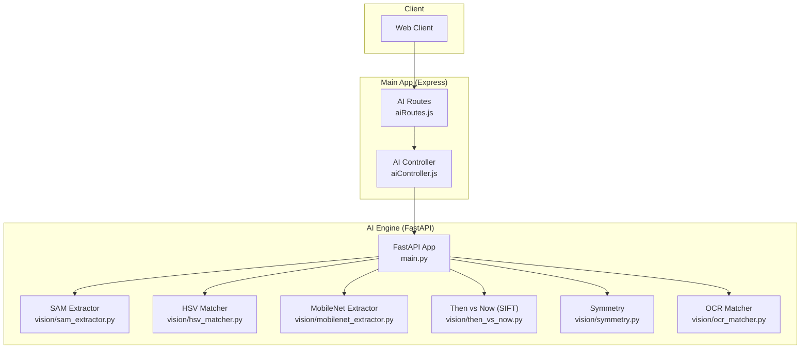

**Diagram sources**
- [aiRoutes.js:1-40](file://server/src/routes/aiRoutes.js#L1-L40)
- [aiController.js:1-163](file://server/src/controllers/aiController.js#L1-L163)
- [main.py:1-157](file://ai-engine/main.py#L1-L157)
- [sam_extractor.py:1-90](file://ai-engine/vision/sam_extractor.py#L1-L90)
- [hsv_matcher.py:1-62](file://ai-engine/vision/hsv_matcher.py#L1-L62)
- [mobilenet_extractor.py:1-50](file://ai-engine/vision/mobilenet_extractor.py#L1-L50)
- [then_vs_now.py:1-48](file://ai-engine/vision/then_vs_now.py#L1-L48)
- [symmetry.py:1-65](file://ai-engine/vision/symmetry.py#L1-L65)
- [ocr_matcher.py:1-79](file://ai-engine/vision/ocr_matcher.py#L1-L79)

**Section sources**
- [main.py:1-157](file://ai-engine/main.py#L1-L157)
- [aiRoutes.js:1-40](file://server/src/routes/aiRoutes.js#L1-L40)
- [aiController.js:1-163](file://server/src/controllers/aiController.js#L1-L163)

## Core Components
- FastAPI Application: Defines routes, security middleware, CORS configuration, health endpoint, and response schemas.
- Vision Modules: Each module encapsulates one computer vision pipeline:
  - SAM extractor for shape segmentation and IoU scoring
  - HSV matcher for color histogram similarity
  - MobileNet extractor for texture embeddings and cosine similarity
  - Then vs Now for SIFT feature matching with RANSAC
  - Symmetry analyzer using SSIM on mirrored halves
  - OCR matcher using Tesseract for text comparison
- Integration Layer: Express routes and controller forward multipart form data to the AI engine and return standardized responses.

Key responsibilities:
- Input validation and file handling at the Express layer
- Authentication enforcement before calling the AI engine
- Model loading and inference within the AI engine
- Structured JSON responses with confidence scores and pass/fail flags

**Section sources**
- [main.py:1-157](file://ai-engine/main.py#L1-L157)
- [aiRoutes.js:1-40](file://server/src/routes/aiRoutes.js#L1-L40)
- [aiController.js:1-163](file://server/src/controllers/aiController.js#L1-L163)

## Architecture Overview
The system follows a microservice pattern:
- The Express backend handles authentication and request routing.
- The AI engine provides specialized CV endpoints behind an API key.
- Models are loaded once at process startup and reused across requests.
- Containerization ensures consistent runtime dependencies and environment.

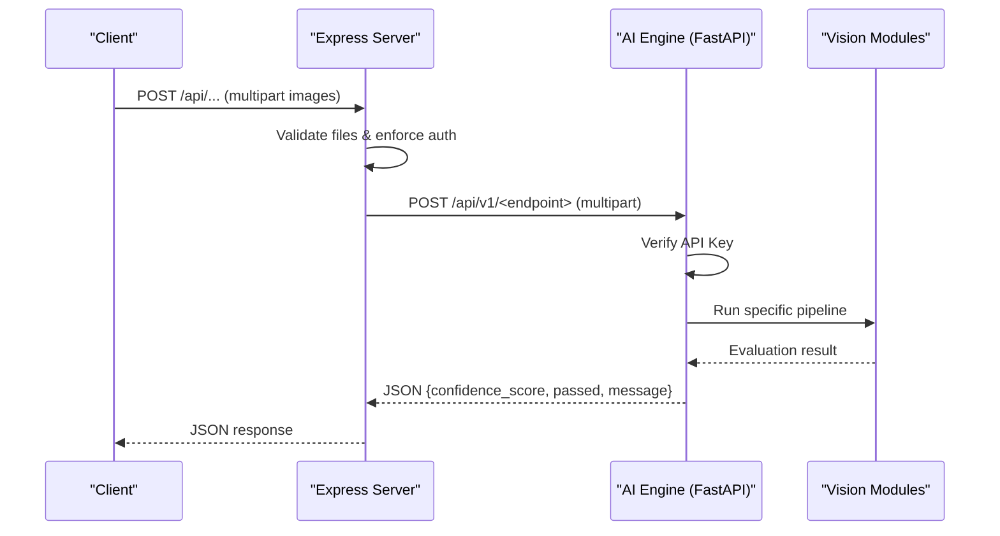

**Diagram sources**
- [aiRoutes.js:1-40](file://server/src/routes/aiRoutes.js#L1-L40)
- [aiController.js:1-163](file://server/src/controllers/aiController.js#L1-L163)
- [main.py:1-157](file://ai-engine/main.py#L1-L157)

## Detailed Component Analysis

### FastAPI Service and Security
- API Key Security: Requests must include X-API-Key header; invalid keys receive 401.
- CORS: Allows specified origins for cross-service calls.
- Health Endpoint: Reports status and model readiness flags for orchestrators.
- Response Models: Standardized EvaluationResult schema used across endpoints.

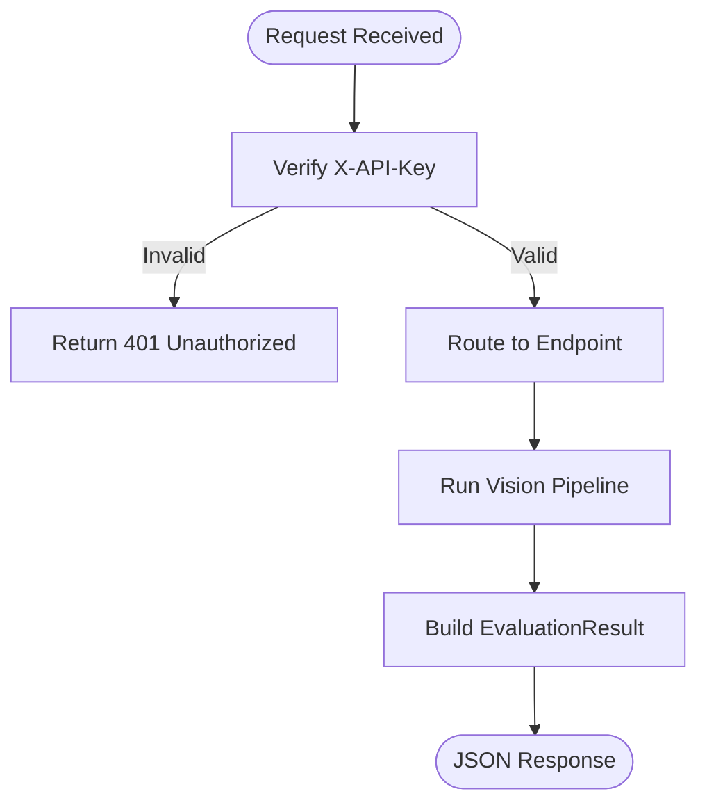

**Diagram sources**
- [main.py:1-52](file://ai-engine/main.py#L1-L52)
- [main.py:54-157](file://ai-engine/main.py#L54-L157)

**Section sources**
- [main.py:1-52](file://ai-engine/main.py#L1-L52)
- [main.py:54-157](file://ai-engine/main.py#L54-L157)

### Shape Extraction (SAM)
- Purpose: Segment primary shapes using Meta’s SAM guided by a dynamic crosshair and compare against a target mask.
- Scoring: Aligned Jaccard Index (IoU) after bounding-box alignment and resizing.
- Threshold: Pass if IoU >= 0.75.

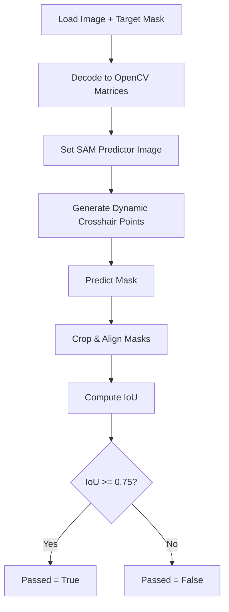

**Diagram sources**
- [sam_extractor.py:1-90](file://ai-engine/vision/sam_extractor.py#L1-L90)
- [main.py:77-93](file://ai-engine/main.py#L77-L93)

**Section sources**
- [sam_extractor.py:1-90](file://ai-engine/vision/sam_extractor.py#L1-L90)
- [main.py:77-93](file://ai-engine/main.py#L77-L93)

### Color Matching (HSV Histograms)
- Purpose: Compare color distributions using normalized Hue-Saturation histograms.
- Preprocessing: Saturation gating removes achromatic pixels; optional mask support.
- Scoring: Bhattacharyya distance converted to similarity; pass if similarity >= 0.80.

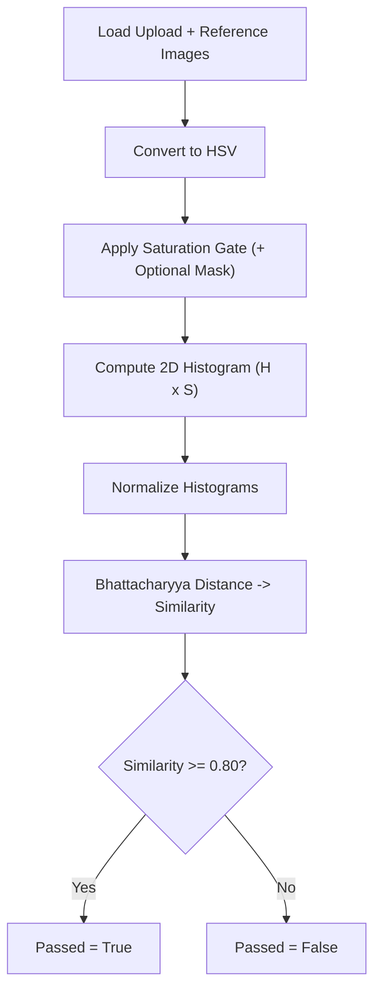

**Diagram sources**
- [hsv_matcher.py:1-62](file://ai-engine/vision/hsv_matcher.py#L1-L62)
- [main.py:95-111](file://ai-engine/main.py#L95-L111)

**Section sources**
- [hsv_matcher.py:1-62](file://ai-engine/vision/hsv_matcher.py#L1-L62)
- [main.py:95-111](file://ai-engine/main.py#L95-L111)

### Texture Matching (MobileNet Embeddings)
- Purpose: Compare structural textures using MobileNetV2 features.
- Preprocessing: Grayscale conversion and ImageNet normalization.
- Scoring: Cosine similarity of flattened feature vectors; pass if similarity >= 0.60.

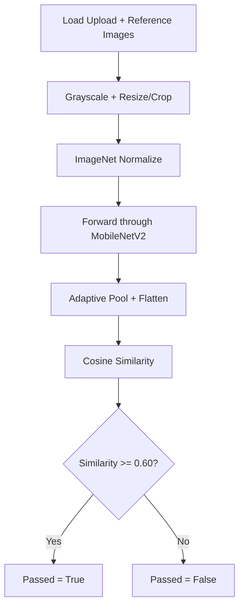

**Diagram sources**
- [mobilenet_extractor.py:1-50](file://ai-engine/vision/mobilenet_extractor.py#L1-L50)
- [main.py:113-125](file://ai-engine/main.py#L113-L125)

**Section sources**
- [mobilenet_extractor.py:1-50](file://ai-engine/vision/mobilenet_extractor.py#L1-L50)
- [main.py:113-125](file://ai-engine/main.py#L113-L125)

### Archival Image Matching (SIFT + RANSAC)
- Purpose: Match keypoints between current and archival images with geometric verification.
- Steps: SIFT detection, Lowe’s ratio test, RANSAC homography, count inliers.
- Decision: Pass if inlier matches >= threshold (default 15).

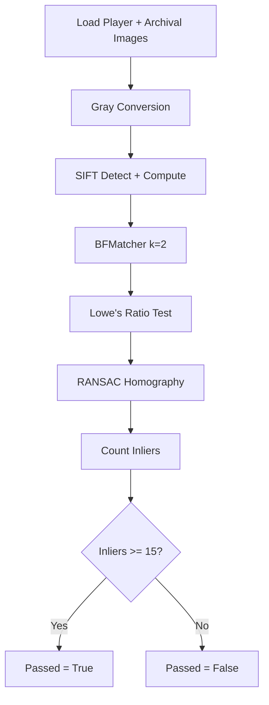

**Diagram sources**
- [then_vs_now.py:1-48](file://ai-engine/vision/then_vs_now.py#L1-L48)
- [main.py:127-138](file://ai-engine/main.py#L127-L138)

**Section sources**
- [then_vs_now.py:1-48](file://ai-engine/vision/then_vs_now.py#L1-L48)
- [main.py:127-138](file://ai-engine/main.py#L127-L138)

### Symmetry Analysis (SSIM)
- Purpose: Evaluate bilateral symmetry by mirroring one half and comparing via SSIM.
- Preprocessing: Gaussian blur to reduce noise; compute SSIM on mirrored halves.
- Decision: Pass if similarity percentage >= 40.0.

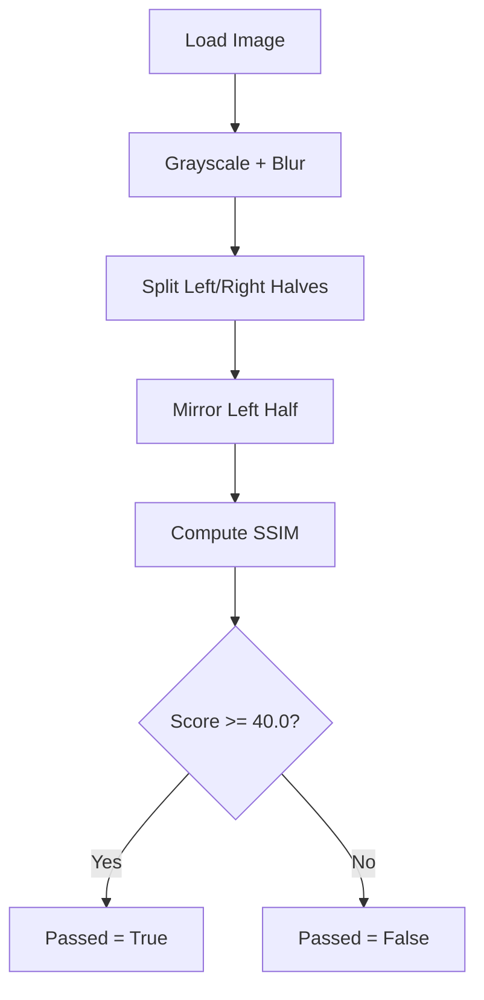

**Diagram sources**
- [symmetry.py:1-65](file://ai-engine/vision/symmetry.py#L1-L65)
- [main.py:140-150](file://ai-engine/main.py#L140-L150)

**Section sources**
- [symmetry.py:1-65](file://ai-engine/vision/symmetry.py#L1-L65)
- [main.py:140-150](file://ai-engine/main.py#L140-L150)

### OCR Plaque Matching (Tesseract)
- Purpose: Extract and compare engraved/weathered text from images.
- Preprocessing: Upscale small images, denoise, adaptive thresholding.
- Comparison: Normalize text and use sequence similarity; pass if similarity >= 0.75.

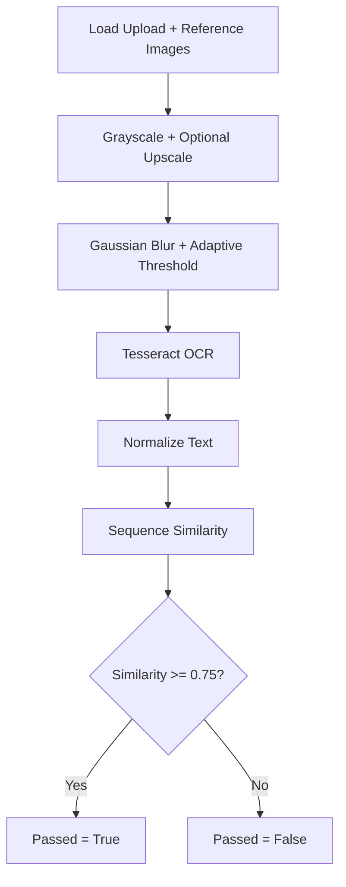

**Diagram sources**
- [ocr_matcher.py:1-79](file://ai-engine/vision/ocr_matcher.py#L1-L79)
- [main.py:152-157](file://ai-engine/main.py#L152-L157)

**Section sources**
- [ocr_matcher.py:1-79](file://ai-engine/vision/ocr_matcher.py#L1-L79)
- [main.py:152-157](file://ai-engine/main.py#L152-L157)

### Integration with Main Application
- Express routes accept multipart uploads with size limits and require authentication.
- The controller builds FormData and forwards it to the AI engine endpoints.
- Errors from the AI engine are propagated back to clients with appropriate status codes.

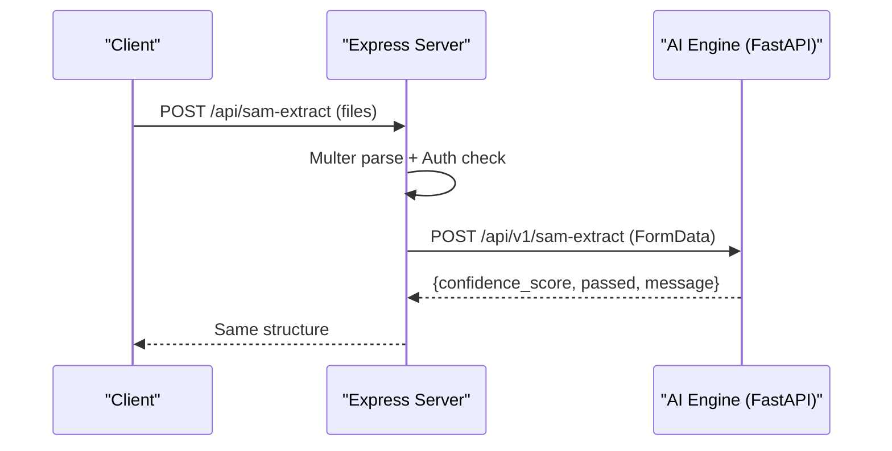

**Diagram sources**
- [aiRoutes.js:1-40](file://server/src/routes/aiRoutes.js#L1-L40)
- [aiController.js:1-163](file://server/src/controllers/aiController.js#L1-L163)
- [main.py:77-93](file://ai-engine/main.py#L77-L93)

**Section sources**
- [aiRoutes.js:1-40](file://server/src/routes/aiRoutes.js#L1-L40)
- [aiController.js:1-163](file://server/src/controllers/aiController.js#L1-L163)

## Dependency Analysis
- Runtime Dependencies: FastAPI, Uvicorn, OpenCV headless, NumPy, Pillow, PyTorch/TorchVision, timm, MobileSAM, Tesseract via pytesseract.
- System Dependencies: libgl1, libglib2.0-0, git, tesseract-ocr and language pack installed in Docker.
- External Integrations: MobileSAM checkpoint path expected under weights/mobile_sam.pt; Tesseract CLI required for OCR.

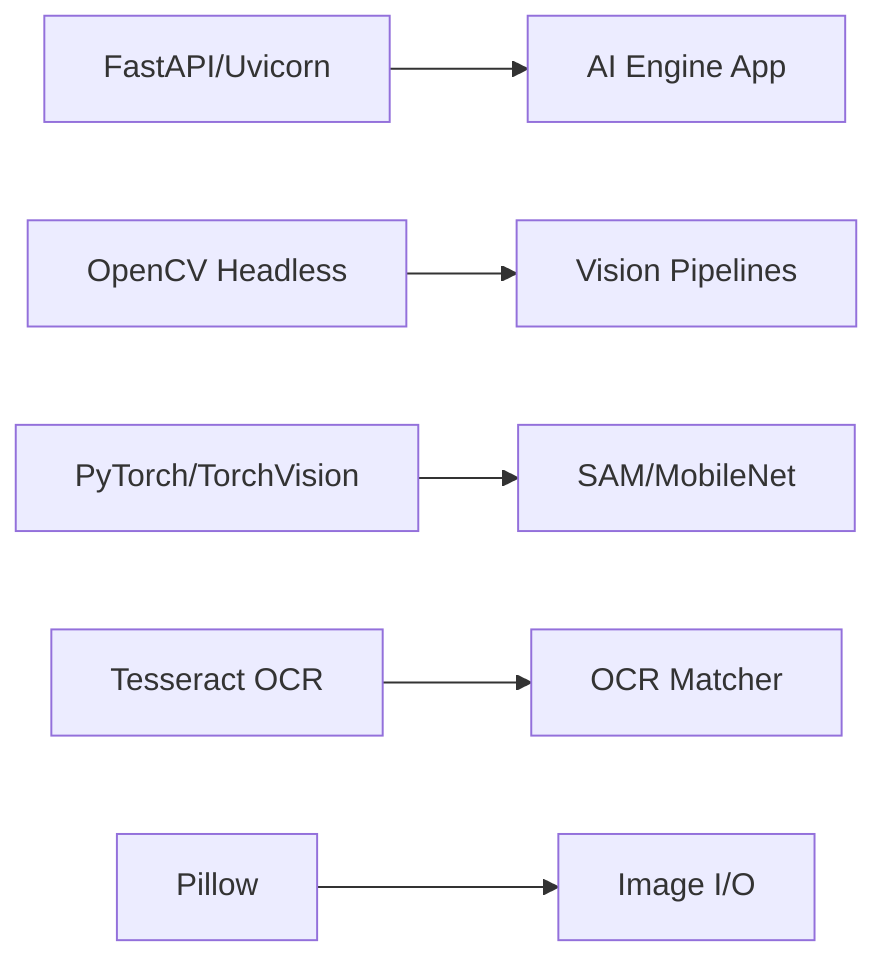

**Diagram sources**
- [requirements.txt:1-13](file://ai-engine/requirements.txt#L1-L13)
- [Dockerfile:1-40](file://ai-engine/Dockerfile#L1-L40)
- [sam_extractor.py:1-90](file://ai-engine/vision/sam_extractor.py#L1-L90)
- [mobilenet_extractor.py:1-50](file://ai-engine/vision/mobilenet_extractor.py#L1-L50)
- [ocr_matcher.py:1-79](file://ai-engine/vision/ocr_matcher.py#L1-L79)

**Section sources**
- [requirements.txt:1-13](file://ai-engine/requirements.txt#L1-L13)
- [Dockerfile:1-40](file://ai-engine/Dockerfile#L1-L40)

## Performance Considerations
- Model Loading Strategy:
  - SAM predictor and MobileNet models are initialized at import time and reused across requests to avoid repeated initialization overhead.
  - GPU acceleration is attempted when available; otherwise, CPU execution is used.
- Memory Management:
  - Images are decoded into NumPy arrays per request; ensure adequate RAM for concurrent requests.
  - Avoid unnecessary copies by reusing buffers where possible.
- Concurrency:
  - FastAPI runs asynchronously; heavy CPU-bound tasks may block event loop. Consider running workers or offloading long-running tasks to a queue if needed.
- Optimization Techniques:
  - Use grayscale conversions and targeted preprocessing to reduce computation.
  - Cache reference embeddings (e.g., MobileNet embeddings) if references are static.
  - Tune thresholds per pipeline to balance false positives/negatives.
- Scaling:
  - Horizontal scaling via multiple containers behind a load balancer.
  - Configure container memory limits (recommended minimum 1 GB, preferably 2 GB) and adjust worker processes based on CPU cores.

[No sources needed since this section provides general guidance]

## Troubleshooting Guide
- Missing API Key: Ensure X-API-Key header matches the configured value; otherwise, requests will be rejected with 401.
- CORS Issues: Verify allowed origins include the client domain and backend hostnames.
- Model Weights Not Found: SAM requires weights/mobile_sam.pt; absence triggers a warning and disables SAM predictions.
- Tesseract Not Installed: OCR endpoints depend on Tesseract CLI; install via system packages in the container.
- Health Checks: Use /health to verify service status and model readiness flags.

**Section sources**
- [main.py:1-52](file://ai-engine/main.py#L1-L52)
- [sam_extractor.py:1-16](file://ai-engine/vision/sam_extractor.py#L1-L16)
- [Dockerfile:14-20](file://ai-engine/Dockerfile#L14-L20)

## Conclusion
The AI engine provides a robust, modular computer vision microservice integrated with the main application. Its design separates concerns across clear API boundaries, leverages established models and algorithms, and supports containerized deployment. With careful attention to model loading, memory usage, and concurrency, the service can scale horizontally to meet demand while maintaining reliable evaluation outcomes.