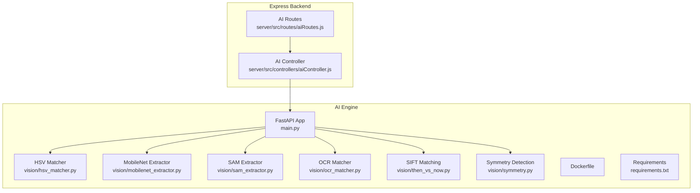
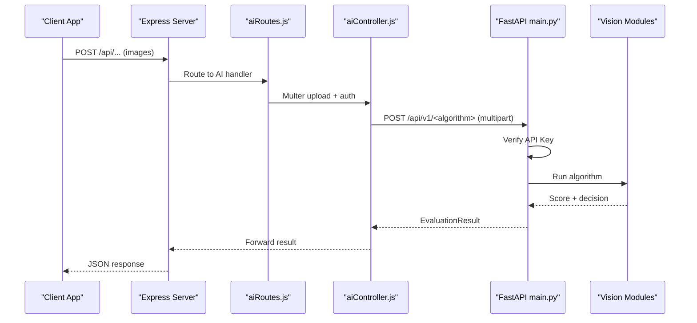
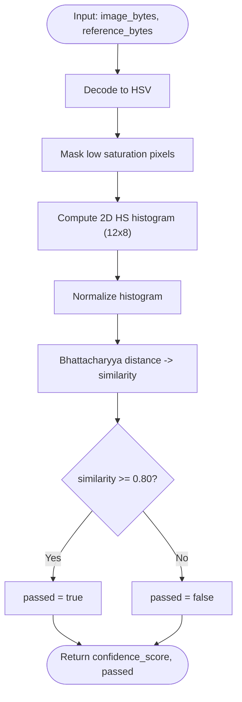
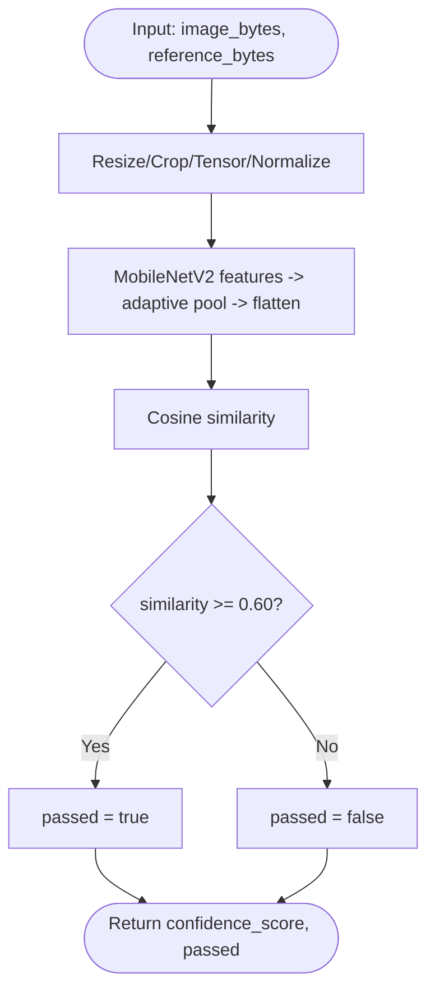
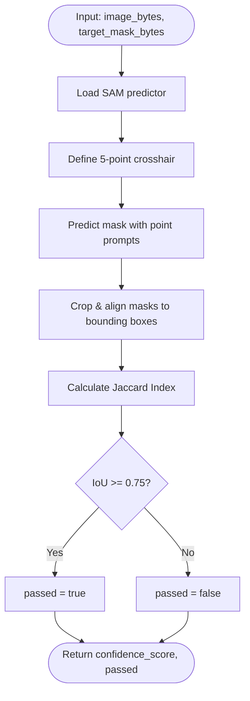
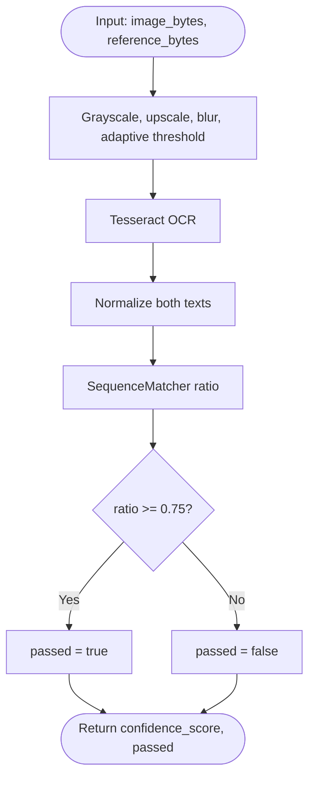
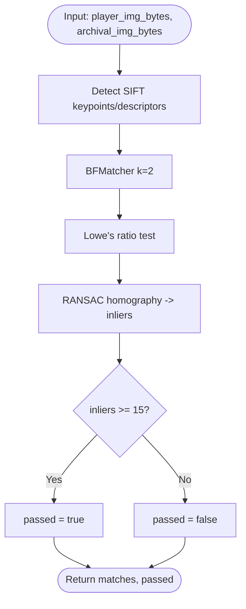
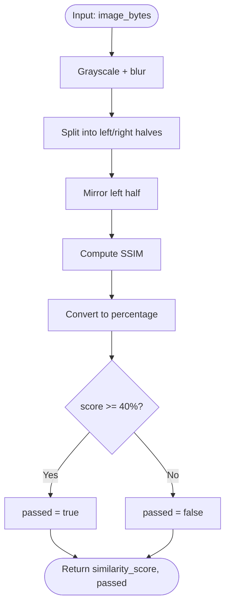
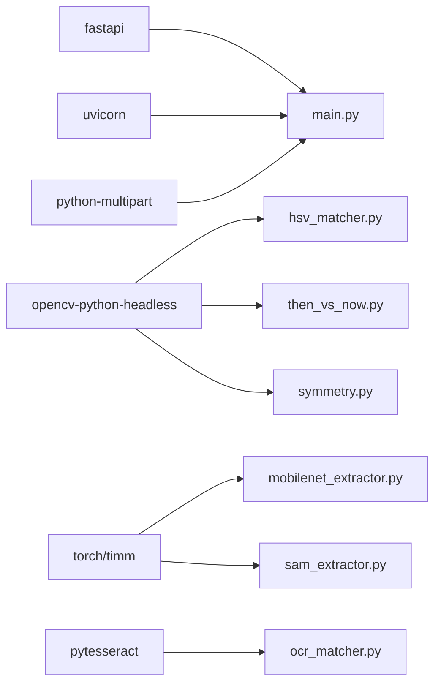

# AI Engine Service

<cite>
**Referenced Files in This Document**
- [main.py](file://ai-engine/main.py)
- [requirements.txt](file://ai-engine/requirements.txt)
- [Dockerfile](file://ai-engine/Dockerfile)
- [DEPLOYMENT.md](file://ai-engine/DEPLOYMENT.md)
- [hsv_matcher.py](file://ai-engine/vision/hsv_matcher.py)
- [mobilenet_extractor.py](file://ai-engine/vision/mobilenet_extractor.py)
- [sam_extractor.py](file://ai-engine/vision/sam_extractor.py)
- [ocr_matcher.py](file://ai-engine/vision/ocr_matcher.py)
- [then_vs_now.py](file://ai-engine/vision/then_vs_now.py)
- [symmetry.py](file://ai-engine/vision/symmetry.py)
- [aiController.js](file://server/src/controllers/aiController.js)
- [aiRoutes.js](file://server/src/routes/aiRoutes.js)
</cite>

## Table of Contents
1. [Introduction](#introduction)
2. [Project Structure](#project-structure)
3. [Core Components](#core-components)
4. [Architecture Overview](#architecture-overview)
5. [Detailed Component Analysis](#detailed-component-analysis)
6. [Dependency Analysis](#dependency-analysis)
7. [Performance Considerations](#performance-considerations)
8. [Troubleshooting Guide](#troubleshooting-guide)
9. [Conclusion](#conclusion)
10. [Appendices](#appendices)

## Introduction
This document describes the AI Engine service, a Python FastAPI microservice that provides computer vision algorithms for gameplay evaluation and puzzle verification. It implements:
- HSV color matching via histogram comparison
- MobileNet feature extraction for texture similarity
- Segment Anything Model (SAM) integration for shape segmentation and IoU scoring
- OCR processing using Tesseract for plaque text recognition
- SIFT-based archival image matching with geometric verification
- Symmetry detection using SSIM on mirrored halves

The service exposes secure endpoints to accept images and return confidence scores and pass/fail decisions. It is containerized with Docker and designed for deployment on cloud platforms with at least 1 GB RAM.

## Project Structure
The AI Engine resides under ai-engine and includes:
- FastAPI application entrypoint and API routes
- Vision modules implementing each algorithm
- Docker configuration and deployment guide
- Dependencies list for CPU-only PyTorch and OpenCV

**Diagram sources**
- [main.py:1-157](file://ai-engine/main.py#L1-L157)
- [hsv_matcher.py:1-62](file://ai-engine/vision/hsv_matcher.py#L1-L62)
- [mobilenet_extractor.py:1-50](file://ai-engine/vision/mobilenet_extractor.py#L1-L50)
- [sam_extractor.py:1-90](file://ai-engine/vision/sam_extractor.py#L1-L90)
- [ocr_matcher.py:1-79](file://ai-engine/vision/ocr_matcher.py#L1-L79)
- [then_vs_now.py:1-48](file://ai-engine/vision/then_vs_now.py#L1-L48)
- [symmetry.py:1-65](file://ai-engine/vision/symmetry.py#L1-L65)
- [aiRoutes.js:1-40](file://server/src/routes/aiRoutes.js#L1-L40)
- [aiController.js:1-163](file://server/src/controllers/aiController.js#L1-L163)

**Section sources**
- [main.py:1-157](file://ai-engine/main.py#L1-L157)
- [requirements.txt:1-13](file://ai-engine/requirements.txt#L1-L13)
- [Dockerfile:1-40](file://ai-engine/Dockerfile#L1-L40)
- [DEPLOYMENT.md:1-81](file://ai-engine/DEPLOYMENT.md#L1-L81)

## Core Components
- FastAPI application with API key security and CORS middleware
- Evaluation endpoints returning standardized results:
  - confidence_score: float between 0 and 1 (or percentage where noted)
  - passed: boolean decision based on thresholds
  - message: human-readable status
- Vision modules encapsulating algorithms:
  - HSV color histograms with Bhattacharyya distance
  - MobileNetV2 embeddings with cosine similarity
  - SAM segmentation with aligned Jaccard Index
  - OCR text normalization and sequence similarity
  - SIFT + RANSAC geometric verification
  - Symmetry via SSIM on mirrored halves

Key response model:
- EvaluationResult: confidence_score, passed, message

**Section sources**
- [main.py:54-157](file://ai-engine/main.py#L54-L157)

## Architecture Overview
The Express backend authenticates requests and forwards multipart image uploads to the AI Engine. The AI Engine validates API keys, runs the selected algorithm, and returns structured evaluation results.

**Diagram sources**
- [aiRoutes.js:1-40](file://server/src/routes/aiRoutes.js#L1-L40)
- [aiController.js:1-163](file://server/src/controllers/aiController.js#L1-L163)
- [main.py:10-20](file://ai-engine/main.py#L10-L20)
- [main.py:77-157](file://ai-engine/main.py#L77-L157)

## Detailed Component Analysis

### HSV Color Matching
- Purpose: Compare color distributions between player image and reference using HSV histograms.
- Processing:
  - Decode image bytes to HSV
  - Mask out low-saturation pixels to avoid achromatic noise
  - Build 2D Hue-Saturation histogram (12x8 bins), normalize
  - Compare histograms using Bhattacharyya distance; convert to similarity
- Threshold: Passed when similarity >= 0.80

**Diagram sources**
- [hsv_matcher.py:4-62](file://ai-engine/vision/hsv_matcher.py#L4-L62)
- [main.py:95-111](file://ai-engine/main.py#L95-L111)

**Section sources**
- [hsv_matcher.py:1-62](file://ai-engine/vision/hsv_matcher.py#L1-L62)
- [main.py:95-111](file://ai-engine/main.py#L95-L111)

### MobileNet Feature Extraction
- Purpose: Evaluate structural/textural similarity using deep features.
- Processing:
  - Load pre-trained MobileNetV2 (ImageNet weights)
  - Preprocess: resize, center crop, tensorize, normalize
  - Extract features and pool to 1D embedding (1280-dim)
  - Compute cosine similarity between embeddings
- Threshold: Passed when similarity >= 0.60

**Diagram sources**
- [mobilenet_extractor.py:11-50](file://ai-engine/vision/mobilenet_extractor.py#L11-L50)
- [main.py:113-125](file://ai-engine/main.py#L113-L125)

**Section sources**
- [mobilenet_extractor.py:1-50](file://ai-engine/vision/mobilenet_extractor.py#L1-L50)
- [main.py:113-125](file://ai-engine/main.py#L113-L125)

### Segment Anything Model (SAM) Integration
- Purpose: Extract primary shape from player image using SAM and compare with target mask.
- Processing:
  - Initialize MobileSAM predictor (CPU/GPU)
  - Define dynamic crosshair points around image center
  - Predict mask with point prompts
  - Crop and align masks by bounding boxes and resize to common size
  - Compute Jaccard Index (IoU)
- Threshold: Passed when IoU >= 0.75

**Diagram sources**
- [sam_extractor.py:6-90](file://ai-engine/vision/sam_extractor.py#L6-L90)
- [main.py:77-93](file://ai-engine/main.py#L77-L93)

**Section sources**
- [sam_extractor.py:1-90](file://ai-engine/vision/sam_extractor.py#L1-L90)
- [main.py:77-93](file://ai-engine/main.py#L77-L93)

### OCR Processing
- Purpose: Recognize engraved/weathered plaque text and compare with reference.
- Processing:
  - Decode image, grayscale, upscale if small
  - Denoise and apply adaptive thresholding
  - Run Tesseract OCR
  - Normalize text (lowercase, strip punctuation, collapse whitespace)
  - Compare using difflib SequenceMatcher ratio
- Threshold: Passed when similarity >= 0.75

**Diagram sources**
- [ocr_matcher.py:9-79](file://ai-engine/vision/ocr_matcher.py#L9-L79)
- [main.py:152-157](file://ai-engine/main.py#L152-L157)

**Section sources**
- [ocr_matcher.py:1-79](file://ai-engine/vision/ocr_matcher.py#L1-L79)
- [main.py:152-157](file://ai-engine/main.py#L152-L157)

### SIFT Archival Matching
- Purpose: Match keypoints between current and archival images with geometric verification.
- Processing:
  - Detect SIFT keypoints and descriptors
  - BFMatcher with k=2 matches
  - Lowe’s ratio test to filter good matches
  - RANSAC homography to count inliers
  - Passed if inliers >= min_matches (default 15)

**Diagram sources**
- [then_vs_now.py:4-48](file://ai-engine/vision/then_vs_now.py#L4-L48)
- [main.py:127-138](file://ai-engine/main.py#L127-L138)

**Section sources**
- [then_vs_now.py:1-48](file://ai-engine/vision/then_vs_now.py#L1-L48)
- [main.py:127-138](file://ai-engine/main.py#L127-L138)

### Symmetry Detection
- Purpose: Assess bilateral symmetry by mirroring one half and comparing via SSIM.
- Processing:
  - Grayscale and heavy Gaussian blur to reduce detail
  - Split into left/right halves
  - Mirror left half and compute SSIM against right half
  - Convert score to percentage; passed if >= 40%

**Diagram sources**
- [symmetry.py:4-65](file://ai-engine/vision/symmetry.py#L4-L65)
- [main.py:140-150](file://ai-engine/main.py#L140-L150)

**Section sources**
- [symmetry.py:1-65](file://ai-engine/vision/symmetry.py#L1-L65)
- [main.py:140-150](file://ai-engine/main.py#L140-L150)

## Dependency Analysis
External libraries and their roles:
- fastapi, uvicorn: Web framework and ASGI server
- python-multipart: Multipart form parsing
- opencv-python-headless: Image decoding, color space conversion, histograms, SIFT, SSIM
- numpy: Numerical operations
- torch, torchvision: Deep learning models (CPU-only)
- timm: Additional model utilities
- git+https://github.com/ChaoningZhang/MobileSAM.git: MobileSAM segmentation
- pytesseract: OCR engine wrapper

**Diagram sources**
- [requirements.txt:1-13](file://ai-engine/requirements.txt#L1-L13)
- [main.py:1-6](file://ai-engine/main.py#L1-L6)
- [hsv_matcher.py:1-3](file://ai-engine/vision/hsv_matcher.py#L1-L3)
- [mobilenet_extractor.py:1-5](file://ai-engine/vision/mobilenet_extractor.py#L1-L5)
- [sam_extractor.py:1-4](file://ai-engine/vision/sam_extractor.py#L1-L4)
- [ocr_matcher.py:1-5](file://ai-engine/vision/ocr_matcher.py#L1-L5)
- [then_vs_now.py:1-3](file://ai-engine/vision/then_vs_now.py#L1-L3)
- [symmetry.py:1-3](file://ai-engine/vision/symmetry.py#L1-L3)

**Section sources**
- [requirements.txt:1-13](file://ai-engine/requirements.txt#L1-L13)

## Performance Considerations
- Memory footprint: Loading PyTorch + MobileSAM + MobileNetV2 consumes ~400–500 MB before serving requests. Minimum 1 GB RAM recommended; 2 GB preferred.
- CPU-only inference: Optimized for CPU environments; GPU acceleration available if CUDA is present but not required.
- Image preprocessing:
  - HSV matcher avoids achromatic noise by masking low saturation.
  - MobileNet uses grayscale conversion internally to reduce lighting sensitivity.
  - OCR upscales small images and applies adaptive thresholding for robustness.
- Algorithmic complexity:
  - HSV histogram computation is O(H×W) per channel binning.
  - MobileNet forward pass dominates latency; batch or caching can help.
  - SAM prediction cost depends on image resolution and prompt strategy.
  - SIFT detection and BF matching scale with number of keypoints; RANSAC adds overhead.
  - Symmetry SSIM is O(H×W) with blurring.
- Throughput:
  - Use connection pooling and async handling in upstream services.
  - Consider horizontal scaling behind a load balancer.
  - Cache frequent reference images’ embeddings or histograms where appropriate.

[No sources needed since this section provides general guidance]

## Troubleshooting Guide
Common issues and resolutions:
- Missing API key:
  - Symptom: 401 Unauthorized
  - Cause: X-API-Key header missing or invalid
  - Resolution: Set environment variable AI_KEY and include X-API-Key in requests
- Model weights not found:
  - Symptom: Warning about SAM weights; health endpoint shows sam=false
  - Cause: weights/mobile_sam.pt missing
  - Resolution: Place MobileSAM checkpoint at weights/mobile_sam.pt
- Tesseract not installed:
  - Symptom: OCR fails or returns empty text
  - Resolution: Install tesseract-ocr and language data in container or host
- Out-of-memory errors:
  - Symptom: Container killed during startup or request
  - Resolution: Increase memory to at least 1 GB; prefer 2 GB
- CORS errors:
  - Symptom: Browser blocks requests
  - Resolution: Ensure origin is allowed in CORS settings

Operational checks:
- Health endpoint reports model readiness:
  - GET /health returns status and model availability flags

**Section sources**
- [main.py:10-20](file://ai-engine/main.py#L10-L20)
- [main.py:39-52](file://ai-engine/main.py#L39-L52)
- [sam_extractor.py:6-16](file://ai-engine/vision/sam_extractor.py#L6-L16)
- [Dockerfile:13-20](file://ai-engine/Dockerfile#L13-L20)
- [DEPLOYMENT.md:8-14](file://ai-engine/DEPLOYMENT.md#L8-L14)

## Conclusion
The AI Engine provides a modular, secure, and scalable set of computer vision capabilities tailored for gameplay evaluation. Its clear API contracts, robust error handling, and containerized deployment make it suitable for production environments. By tuning thresholds and optimizing preprocessing, teams can adapt these algorithms to diverse puzzle scenarios while maintaining performance and reliability.

[No sources needed since this section summarizes without analyzing specific files]

## Appendices

### API Endpoints Reference
All endpoints require:
- Header: X-API-Key (value from AI_KEY environment variable)
- Content-Type: multipart/form-data

Endpoints:
- POST /api/v1/sam-extract
  - Fields: image, target_mask
  - Response: { confidence_score, passed, message }
- POST /api/v1/hsv-match
  - Fields: image, reference_image
  - Response: { confidence_score, passed, message }
- POST /api/v1/texture-match
  - Fields: image, reference_image
  - Response: { confidence_score, passed, message }
- POST /api/v1/sift-match
  - Fields: image, archival_image
  - Response: { confidence_score, passed, message }
- POST /api/v1/symmetry
  - Fields: image
  - Response: { confidence_score, passed, message }
- POST /api/v1/ocr-match
  - Fields: image, reference_image
  - Response: { confidence_score, passed, message }

Health and root:
- GET /
- GET /health

**Section sources**
- [main.py:35-52](file://ai-engine/main.py#L35-L52)
- [main.py:77-157](file://ai-engine/main.py#L77-L157)

### Express Backend Integration
- Authentication: All AI routes require authentication via middleware.
- File limits: Up to 5 MB per file.
- Routing:
  - /api/sam-extract -> evaluateShape
  - /api/hsv-match -> evaluateColour
  - /api/texture-match -> evaluateTexture
  - /api/sift-match -> evaluateSift
  - /api/symmetry -> evaluateSymmetry
- Error handling:
  - 400 for missing files
  - 500 for upstream failures

**Section sources**
- [aiRoutes.js:1-40](file://server/src/routes/aiRoutes.js#L1-L40)
- [aiController.js:1-163](file://server/src/controllers/aiController.js#L1-L163)

### Deployment Configuration
- Environment variables:
  - PORT: Container port (default 8080)
  - AI_KEY: API key for securing endpoints
- Containerization:
  - Base image: python:3.11-slim
  - System deps: libgl1, libglib2.0-0, git, tesseract-ocr, tesseract-ocr-eng
  - CMD: uvicorn main:app --host 0.0.0.0 --port ${PORT}
- Cloud deployment notes:
  - Minimum 1 GB RAM; 2 GB recommended
  - Connect Express backend via AI_SERVICE_URL

**Section sources**
- [Dockerfile:1-40](file://ai-engine/Dockerfile#L1-L40)
- [DEPLOYMENT.md:1-81](file://ai-engine/DEPLOYMENT.md#L1-L81)

### Practical Examples

#### Integrating AI-Powered Puzzles
- Shape puzzles: Use /api/v1/sam-extract to verify that a player’s photo captures the intended object within a target mask region.
- Color challenges: Use /api/v1/hsv-match to validate color composition against a reference image.
- Texture identification: Use /api/v1/texture-match to confirm material or pattern consistency.
- Historical comparisons: Use /api/v1/sift-match to match current photos with archival images.
- Symmetry tasks: Use /api/v1/symmetry to detect symmetric structures.
- Plaque reading: Use /api/v1/ocr-match to verify inscriptions.

#### Customizing Vision Algorithms
- Adjust thresholds:
  - HSV: modify similarity threshold in endpoint logic
  - MobileNet: tune cosine similarity threshold
  - SAM: adjust IoU threshold
  - OCR: change difflib threshold
  - SIFT: change minimum inlier count
  - Symmetry: change SSIM percentage threshold
- Enhance preprocessing:
  - HSV: refine saturation mask ranges
  - OCR: add morphological operations or custom Tesseract configs
  - MobileNet: experiment with different input sizes or augmentations

#### Optimizing for Real-Time Gameplay
- Reduce image sizes before upload to lower bandwidth and processing time.
- Cache reference embeddings or histograms for frequently used references.
- Scale horizontally with multiple AI Engine instances behind a load balancer.
- Monitor /health to ensure model readiness and auto-restart failed containers.
- Tune thresholds per puzzle type to balance strictness and user experience.

[No sources needed since this section provides general guidance]