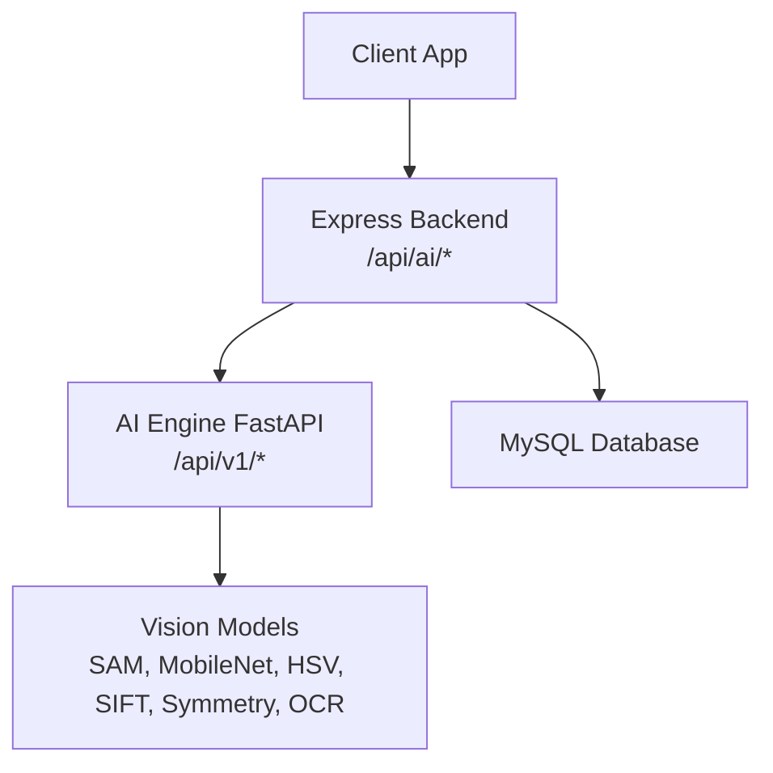
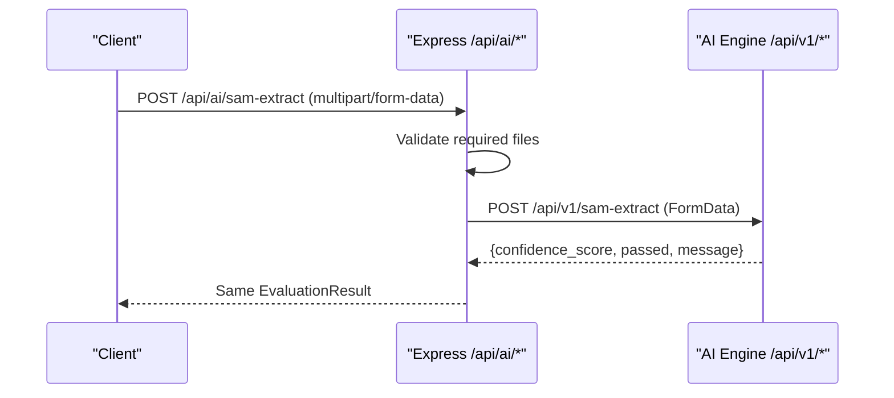
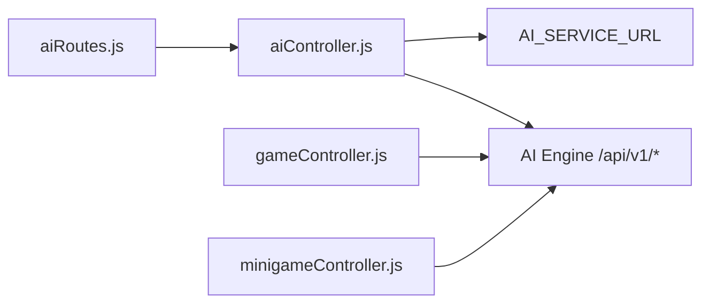

# API Endpoints

<cite>
**Referenced Files in This Document**
- [main.py](file://ai-engine/main.py)
- [DEPLOYMENT.md](file://ai-engine/DEPLOYMENT.md)
- [aiRoutes.js](file://server/src/routes/aiRoutes.js)
- [aiController.js](file://server/src/controllers/aiController.js)
- [app.js](file://server/src/app.js)
- [gameController.js](file://server/src/controllers/gameController.js)
- [minigameController.js](file://server/src/controllers/minigameController.js)
- [ai.test.js](file://server/tests/integration/ai.test.js)
</cite>

## Table of Contents
1. [Introduction](#introduction)
2. [Project Structure](#project-structure)
3. [Core Components](#core-components)
4. [Architecture Overview](#architecture-overview)
5. [Detailed Component Analysis](#detailed-component-analysis)
6. [Dependency Analysis](#dependency-analysis)
7. [Performance Considerations](#performance-considerations)
8. [Troubleshooting Guide](#troubleshooting-guide)
9. [Conclusion](#conclusion)

## Introduction
This document describes the AI engine endpoints exposed by the WARG Platform. It covers:
- HTTP methods and URL patterns for image processing endpoints
- Request/response schemas and authentication requirements
- Model selection parameters and output formats
- Error handling patterns, rate limiting policies, and versioning
- Concrete examples from the main application
- WebSocket usage for real-time features (not tied to AI endpoints)

The AI Engine is a FastAPI microservice that performs computer vision tasks such as shape extraction, color matching, texture matching, SIFT matching, symmetry evaluation, and OCR-based plaque matching. The Node/Express backend proxies authenticated client requests to the AI Engine and returns standardized results.

## Project Structure
The AI-related code spans two services:
- AI Engine (FastAPI): defines the authoritative evaluation endpoints under /api/v1
- Server (Express): exposes proxy endpoints under /api/ai and forwards requests to the AI Engine

**Diagram sources**
- [app.js:95-107](file://server/src/app.js#L95-L107)
- [aiRoutes.js:15-39](file://server/src/routes/aiRoutes.js#L15-L39)
- [aiController.js:1-163](file://server/src/controllers/aiController.js#L1-L163)
- [main.py:77-157](file://ai-engine/main.py#L77-L157)

**Section sources**
- [app.js:95-107](file://server/src/app.js#L95-L107)
- [aiRoutes.js:15-39](file://server/src/routes/aiRoutes.js#L15-L39)
- [aiController.js:1-163](file://server/src/controllers/aiController.js#L1-L163)
- [main.py:77-157](file://ai-engine/main.py#L77-L157)

## Core Components
- AI Engine FastAPI service:
  - Authentication via X-API-Key header
  - Health check endpoint
  - Image evaluation endpoints returning confidence_score, passed, message
- Express proxy routes:
  - Require user authentication via session
  - Accept multipart/form-data images
  - Forward to AI Engine and return its response

Key responsibilities:
- Validation of required files at the Express layer
- Proxying to AI Engine with correct fields
- Returning consistent error responses when the AI Engine fails

**Section sources**
- [main.py:10-20](file://ai-engine/main.py#L10-L20)
- [main.py:39-52](file://ai-engine/main.py#L39-L52)
- [aiRoutes.js:1-13](file://server/src/routes/aiRoutes.js#L1-L13)
- [aiController.js:1-31](file://server/src/controllers/aiController.js#L1-L31)

## Architecture Overview
The request flow for image processing:
1. Client sends an authenticated POST to Express under /api/ai/<endpoint>
2. Express validates required files and builds FormData
3. Express calls AI Engine under /api/v1/<endpoint>
4. AI Engine runs the selected model and returns EvaluationResult
5. Express returns the result to the client

**Diagram sources**
- [aiRoutes.js:15-18](file://server/src/routes/aiRoutes.js#L15-L18)
- [aiController.js:3-31](file://server/src/controllers/aiController.js#L3-L31)
- [main.py:77-93](file://ai-engine/main.py#L77-L93)

## Detailed Component Analysis

### Authentication and Security
- AI Engine:
  - Requires X-API-Key header
  - Returns 401 Unauthorized if missing or invalid
- Express:
  - All /api/ai routes require an authenticated session via requireAuth middleware
  - No direct client access to AI Engine; clients authenticate through Express

Configuration:
- AI_SERVICE_URL environment variable points to the AI Engine
- AI_API_KEY used when calling OCR endpoint directly from game controller

**Section sources**
- [main.py:10-20](file://ai-engine/main.py#L10-L20)
- [aiRoutes.js:12-13](file://server/src/routes/aiRoutes.js#L12-L13)
- [gameController.js:258-263](file://server/src/controllers/gameController.js#L258-L263)

### Versioning
- AI Engine endpoints are versioned under /api/v1
- Express proxy routes do not include a version prefix; they map to /api/v1 internally

**Section sources**
- [main.py:77-157](file://ai-engine/main.py#L77-L157)
- [aiRoutes.js:15-39](file://server/src/routes/aiRoutes.js#L15-L39)

### Image Processing Endpoints

#### Shape Extraction (SAM)
- Express: POST /api/ai/sam-extract
- AI Engine: POST /api/v1/sam-extract
- Request:
  - Content-Type: multipart/form-data
  - Fields:
    - image: binary image file
    - target_mask: binary mask file
- Response:
  - confidence_score: float
  - passed: boolean
  - message: string
- Notes:
  - Threshold for pass is implemented in AI Engine
  - Max file size enforced by Express multer limit (5MB)

**Section sources**
- [aiRoutes.js:15-18](file://server/src/routes/aiRoutes.js#L15-L18)
- [aiController.js:3-31](file://server/src/controllers/aiController.js#L3-L31)
- [main.py:77-93](file://ai-engine/main.py#L77-L93)

#### Color Matching (HSV Histograms)
- Express: POST /api/ai/hsv-match
- AI Engine: POST /api/v1/hsv-match
- Request:
  - Fields:
    - image: player image
    - reference_image: creator reference
- Response:
  - confidence_score: float
  - passed: boolean
  - message: string

**Section sources**
- [aiRoutes.js:20-23](file://server/src/routes/aiRoutes.js#L20-L23)
- [aiController.js:34-63](file://server/src/controllers/aiController.js#L34-L63)
- [main.py:95-111](file://ai-engine/main.py#L95-L111)

#### Texture Matching (MobileNet Embeddings)
- Express: POST /api/ai/texture-match
- AI Engine: POST /api/v1/texture-match
- Request:
  - Fields:
    - image: player image
    - reference_image: reference texture
- Response:
  - confidence_score: float
  - passed: boolean
  - message: string

**Section sources**
- [aiRoutes.js:25-28](file://server/src/routes/aiRoutes.js#L25-L28)
- [aiController.js:65-94](file://server/src/controllers/aiController.js#L65-L94)
- [main.py:113-125](file://ai-engine/main.py#L113-L125)

#### SIFT Matching (Archival Images)
- Express: POST /api/ai/sift-match
- AI Engine: POST /api/v1/sift-match
- Request:
  - Fields:
    - image: current capture
    - archival_image: historical reference
- Response:
  - confidence_score: float
  - passed: boolean
  - message: string

**Section sources**
- [aiRoutes.js:30-33](file://server/src/routes/aiRoutes.js#L30-L33)
- [aiController.js:96-125](file://server/src/controllers/aiController.js#L96-L125)
- [main.py:127-138](file://ai-engine/main.py#L127-L138)

#### Symmetry Evaluation
- Express: POST /api/ai/symmetry
- AI Engine: POST /api/v1/symmetry
- Request:
  - Field:
    - image: image to evaluate
- Response:
  - confidence_score: float
  - passed: boolean
  - message: string

**Section sources**
- [aiRoutes.js:35-37](file://server/src/routes/aiRoutes.js#L35-L37)
- [aiController.js:127-154](file://server/src/controllers/aiController.js#L127-L154)
- [main.py:140-150](file://ai-engine/main.py#L140-L150)

#### OCR Plaque Matching
- Direct call from game controller to AI Engine:
  - POST /api/v1/ocr-match
  - Headers:
    - X-API-Key: configured via AI_API_KEY
  - Fields:
    - image: player image
    - reference_image: reference plaque image
- Response:
  - confidence_score: float
  - passed: boolean
  - message: string

Notes:
- Game controller constructs FormData from base64 data stored in minigame config
- Outcome is mapped to 'pass' or 'fail' and persisted

**Section sources**
- [gameController.js:250-273](file://server/src/controllers/gameController.js#L250-L273)
- [main.py:152-157](file://ai-engine/main.py#L152-L157)

### Request and Response Schemas

Common response schema (EvaluationResult):
- confidence_score: number (float)
- passed: boolean
- message: string

Request schemas:
- All endpoints accept multipart/form-data
- Required fields vary per endpoint (see above)

Model selection parameters:
- Endpoint path selects the model:
  - sam-extract → SAM shape extraction
  - hsv-match → HSV color histograms
  - texture-match → MobileNet embeddings
  - sift-match → SIFT feature matching
  - symmetry → Symmetry evaluation
  - ocr-match → OCR plaque matching

Output formats:
- JSON objects conforming to EvaluationResult

**Section sources**
- [main.py:56-59](file://ai-engine/main.py#L56-L59)
- [main.py:77-157](file://ai-engine/main.py#L77-L157)

### Error Handling Patterns
- Missing files:
  - Express returns 400 with error message indicating missing fields
- AI Engine errors:
  - Express catches non-ok responses and returns 500 with generic error
- Authentication failures:
  - AI Engine returns 401 if X-API-Key is invalid or missing
- Session authentication:
  - Express requires login; unauthenticated requests receive 401

Examples from tests:
- 400 on missing files
- 500 when AI Engine responds with non-ok status

**Section sources**
- [aiController.js:5-7](file://server/src/controllers/aiController.js#L5-L7)
- [aiController.js:21-31](file://server/src/controllers/aiController.js#L21-L31)
- [ai.test.js:28-53](file://server/tests/integration/ai.test.js#L28-L53)
- [ai.test.js:143-156](file://server/tests/integration/ai.test.js#L143-L156)

### Rate Limiting Policies
- No explicit rate limiting middleware is present in the AI Engine or Express AI routes
- File upload limits:
  - Express multer limits each file to 5MB
- CORS:
  - AI Engine allows specific origins including local development URLs
- Recommendations:
  - Implement token-bucket or sliding-window rate limiting at the gateway or Express layer
  - Add per-user quotas for heavy endpoints like SIFT and OCR

**Section sources**
- [aiRoutes.js:7-10](file://server/src/routes/aiRoutes.js#L7-L10)
- [main.py:22-33](file://ai-engine/main.py#L22-L33)

### WebSocket Connections
- The platform uses Socket.io for real-time gameplay features (co-op, PvP), but these are not tied to AI endpoints
- WebSocket support is documented separately and applies to general live updates, not image processing

**Section sources**
- [warg-docs/docs/4-deployment/deployment-guide.md:173-177](file://warg-docs/docs/4-deployment/deployment-guide.md#L173-L177)

## Dependency Analysis
The AI integration involves:
- Express routes mounting AI proxy under /api/ai
- Controllers forwarding requests to AI Engine
- AI Engine exposing /api/v1 endpoints protected by X-API-Key

**Diagram sources**
- [aiRoutes.js:1-13](file://server/src/routes/aiRoutes.js#L1-L13)
- [aiController.js:1-31](file://server/src/controllers/aiController.js#L1-L31)
- [gameController.js:258-263](file://server/src/controllers/gameController.js#L258-L263)
- [minigameController.js:107-119](file://server/src/controllers/minigameController.js#L107-L119)

**Section sources**
- [aiRoutes.js:1-13](file://server/src/routes/aiRoutes.js#L1-L13)
- [aiController.js:1-31](file://server/src/controllers/aiController.js#L1-L31)
- [gameController.js:258-263](file://server/src/controllers/gameController.js#L258-L263)
- [minigameController.js:107-119](file://server/src/controllers/minigameController.js#L107-L119)

## Performance Considerations
- Memory usage:
  - AI Engine loads PyTorch and models at startup; minimum 1 GB RAM recommended
- CPU/GPU:
  - Heavy endpoints (SIFT, OCR) may benefit from GPU acceleration
- Concurrency:
  - FastAPI supports async endpoints; ensure adequate worker processes
- Network:
  - Keep AI_SERVICE_URL close to Express to reduce latency
- Caching:
  - Consider caching repeated evaluations for identical inputs where appropriate

**Section sources**
- [ai-engine/DEPLOYMENT.md:8-14](file://ai-engine/DEPLOYMENT.md#L8-L14)
- [ai-engine/DEPLOYMENT.md:47-66](file://ai-engine/DEPLOYMENT.md#L47-L66)

## Troubleshooting Guide
Common issues and resolutions:
- 401 Unauthorized from AI Engine:
  - Ensure X-API-Key header matches configured AI_API_KEY
- 400 Bad Request from Express:
  - Verify all required multipart fields are present
- 500 Internal Server Error:
  - Check AI_SERVICE_URL connectivity and health endpoint
  - Inspect logs for AI Engine errors
- OOM kills on AI Engine:
  - Increase instance memory to at least 1 GB
- CORS errors:
  - Confirm allowed origins include the client domain

Verification steps:
- Health endpoint: GET /health should return model availability
- Local development: run AI Engine with uvicorn on port 8000

**Section sources**
- [main.py:39-52](file://ai-engine/main.py#L39-L52)
- [ai-engine/DEPLOYMENT.md:59-66](file://ai-engine/DEPLOYMENT.md#L59-L66)
- [ai.test.js:28-53](file://server/tests/integration/ai.test.js#L28-L53)
- [ai.test.js:143-156](file://server/tests/integration/ai.test.js#L143-L156)

## Conclusion
The AI Engine provides robust image processing capabilities behind a secure, versioned REST API. The Express backend enforces authentication and proxies requests to the AI Engine, returning standardized results. Operators should monitor resource usage, implement rate limiting, and validate configuration variables for reliable operation. WebSocket features are available for real-time gameplay but are separate from AI endpoints.