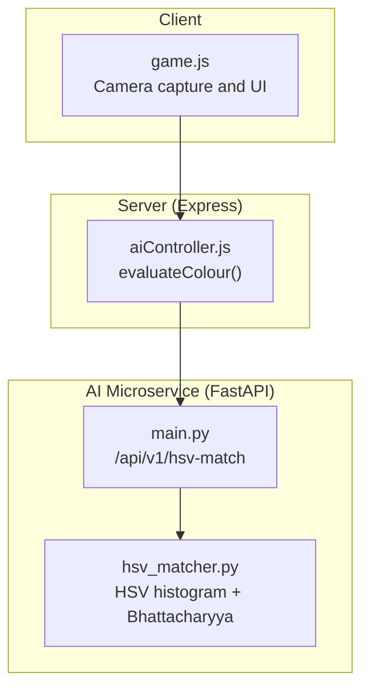
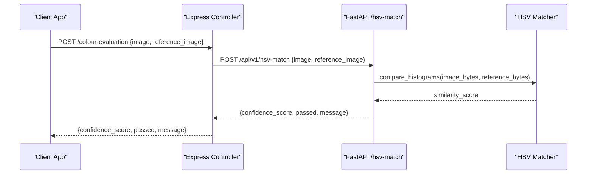
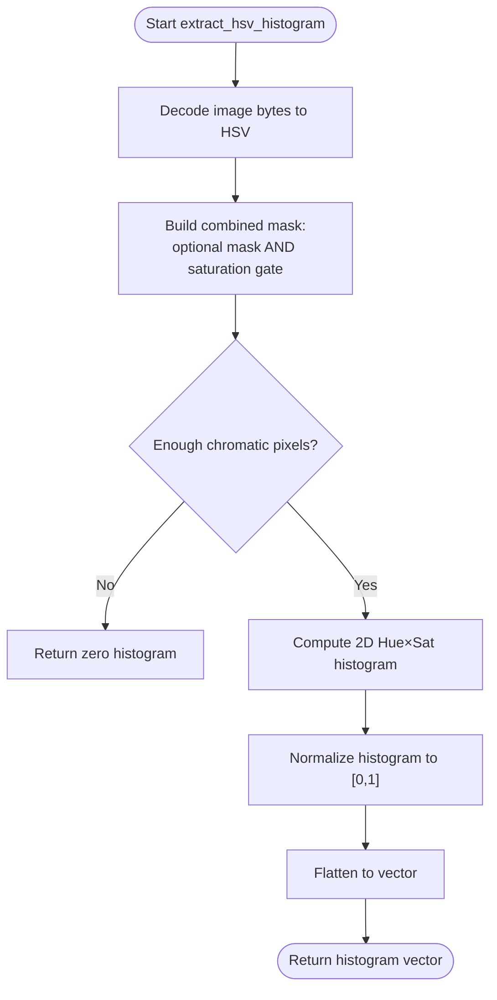
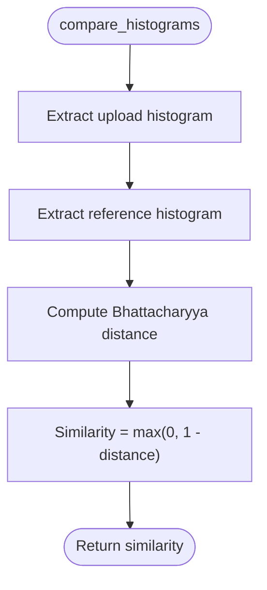
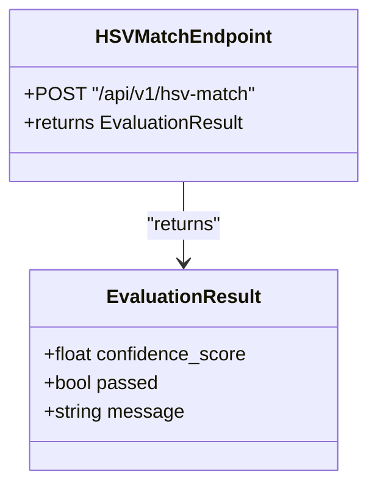
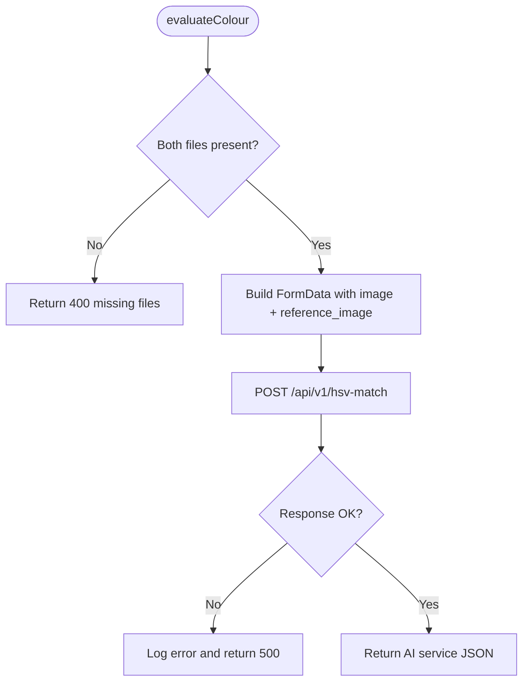
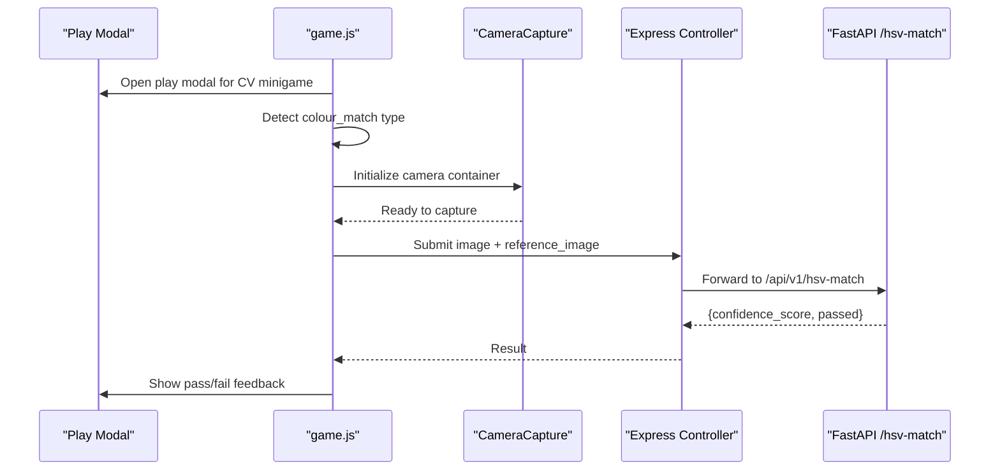
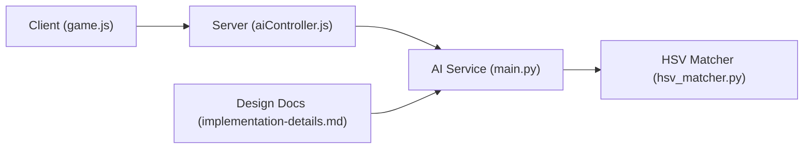

# Color Matching Algorithms

<cite>
**Referenced Files in This Document**
- [hsv_matcher.py](file://ai-engine/vision/hsv_matcher.py)
- [main.py](file://ai-engine/main.py)
- [aiController.js](file://server/src/controllers/aiController.js)
- [implementation-details.md](file://warg-docs/docs/2-architecture-and-design/implementation-details.md)
- [game.js](file://client/scripts/game.js)
</cite>

## Table of Contents
1. [Introduction](#introduction)
2. [Project Structure](#project-structure)
3. [Core Components](#core-components)
4. [Architecture Overview](#architecture-overview)
5. [Detailed Component Analysis](#detailed-component-analysis)
6. [Dependency Analysis](#dependency-analysis)
7. [Performance Considerations](#performance-considerations)
8. [Troubleshooting Guide](#troubleshooting-guide)
9. [Conclusion](#conclusion)

## Introduction
This document explains the HSV color matching implementation used by the WARG Platform’s colour-matching minigames. It covers how images are converted to HSV, how thresholds and masks filter out unreliable pixels, how similarity is computed, and how results are turned into confidence scores and pass/fail decisions. It also provides guidance for calibration, tolerance tuning under different lighting conditions, false positive prevention, performance optimization, integration with game puzzles, and troubleshooting common detection issues.

## Project Structure
The HSV color matching pipeline spans three layers:
- Client layer: initiates camera capture and submits player images alongside a reference image.
- Server layer: validates inputs and forwards requests to the AI microservice.
- AI microservice: performs HSV conversion, histogram extraction, similarity computation, and returns an authoritative evaluation result.

**Diagram sources**
- [game.js:359-384](file://client/scripts/game.js#L359-L384)
- [aiController.js:34-63](file://server/src/controllers/aiController.js#L34-L63)
- [main.py:95-111](file://ai-engine/main.py#L95-L111)
- [hsv_matcher.py:4-62](file://ai-engine/vision/hsv_matcher.py#L4-L62)

**Section sources**
- [game.js:359-384](file://client/scripts/game.js#L359-L384)
- [aiController.js:34-63](file://server/src/controllers/aiController.js#L34-L63)
- [main.py:95-111](file://ai-engine/main.py#L95-L111)
- [hsv_matcher.py:4-62](file://ai-engine/vision/hsv_matcher.py#L4-L62)

## Core Components
- HSV Histogram Extraction: Converts images to HSV, applies a saturation gate and optional mask, computes a normalized 2D Hue-Saturation histogram, and flattens it for comparison.
- Similarity Scoring: Compares histograms using the Bhattacharyya distance and converts it to a similarity score between 0 and 1.
- Evaluation Endpoint: Accepts player and reference images, computes similarity, and returns a confidence score plus a boolean pass decision based on a threshold.
- Server Integration: Validates required files and proxies the request to the AI service, returning its response to the client.

Key responsibilities:
- hsv_matcher.py: Image decoding, HSV conversion, masking, histogram computation, normalization, and similarity calculation.
- main.py: FastAPI endpoint that orchestrates the HSV match and sets the pass threshold.
- aiController.js: Express controller that forwards multipart form data to the AI service and handles errors.
- implementation-details.md: High-level design notes describing HSV-based color matching and the use of Bhattacharyya distance.
- game.js: Client-side flow that triggers camera capture for CV minigames including colour_match.

**Section sources**
- [hsv_matcher.py:4-62](file://ai-engine/vision/hsv_matcher.py#L4-L62)
- [main.py:95-111](file://ai-engine/main.py#L95-L111)
- [aiController.js:34-63](file://server/src/controllers/aiController.js#L34-L63)
- [implementation-details.md:86-87](file://warg-docs/docs/2-architecture-and-design/implementation-details.md#L86-L87)
- [game.js:359-384](file://client/scripts/game.js#L359-L384)

## Architecture Overview
The color matching system uses a simple but robust pipeline:
- The client captures a photo and sends both the player image and the creator-supplied reference image to the server.
- The server validates inputs and forwards them to the AI microservice via HTTP multipart upload.
- The AI microservice decodes images, converts to HSV, filters low-saturation pixels, builds a normalized Hue-Saturation histogram, compares it against the reference histogram using Bhattacharyya distance, and returns a confidence score and pass/fail decision.

**Diagram sources**
- [aiController.js:34-63](file://server/src/controllers/aiController.js#L34-L63)
- [main.py:95-111](file://ai-engine/main.py#L95-L111)
- [hsv_matcher.py:52-62](file://ai-engine/vision/hsv_matcher.py#L52-L62)

## Detailed Component Analysis

### HSV Histogram Extraction and Thresholding
The HSV matcher performs the following steps:
- Decodes the uploaded image bytes and converts from BGR to HSV.
- Builds a combined mask:
  - Optional external mask (e.g., from segmentation) is thresholded to binary.
  - A saturation gate discards pixels with low saturation (S < 30), reducing noise from achromatic regions where hue is meaningless.
  - If an external mask exists, it is AND-ed with the saturation mask.
- If very few chromatic pixels survive, returns a zero histogram so that achromatic uploads score near zero against chromatic references.
- Computes a 2D histogram over Hue (12 bins) and Saturation (8 bins) within the valid range, then normalizes it to [0, 1].

**Diagram sources**
- [hsv_matcher.py:4-50](file://ai-engine/vision/hsv_matcher.py#L4-L50)

**Section sources**
- [hsv_matcher.py:4-50](file://ai-engine/vision/hsv_matcher.py#L4-L50)

### Similarity Scoring and Pass/Fail Decision
- The matcher compares the flattened histograms of the upload and reference using the Bhattacharyya distance.
- Similarity is derived as max(0, 1 − distance).
- The FastAPI endpoint returns this similarity as the confidence score and marks the puzzle as passed if the score meets or exceeds the configured threshold.

**Diagram sources**
- [hsv_matcher.py:52-62](file://ai-engine/vision/hsv_matcher.py#L52-L62)

**Section sources**
- [hsv_matcher.py:52-62](file://ai-engine/vision/hsv_matcher.py#L52-L62)
- [main.py:95-111](file://ai-engine/main.py#L95-L111)

### API Endpoint and Confidence Scoring
- The endpoint accepts two images: the player’s upload and the creator’s reference.
- It calls the matcher to compute similarity and returns:
  - confidence_score: the similarity value.
  - passed: true if confidence_score ≥ 0.80; otherwise false.
  - message: a status string.

**Diagram sources**
- [main.py:56-60](file://ai-engine/main.py#L56-L60)
- [main.py:95-111](file://ai-engine/main.py#L95-L111)

**Section sources**
- [main.py:56-60](file://ai-engine/main.py#L56-L60)
- [main.py:95-111](file://ai-engine/main.py#L95-L111)

### Server Integration and Error Handling
- The Express controller validates that both image and reference_image are present.
- It constructs a multipart form and forwards the request to the AI service.
- On non-OK responses, it logs the error and returns a generic failure message.
- On success, it passes through the AI service’s JSON payload.

**Diagram sources**
- [aiController.js:34-63](file://server/src/controllers/aiController.js#L34-L63)

**Section sources**
- [aiController.js:34-63](file://server/src/controllers/aiController.js#L34-L63)

### Game Integration Flow
- The client identifies CV minigame types, including colour_match.
- When a node has a CV minigame, it initializes a camera capture component and prepares UI controls.
- The captured image is sent to the server’s colour evaluation endpoint, which proxies to the AI service.

**Diagram sources**
- [game.js:359-384](file://client/scripts/game.js#L359-L384)
- [aiController.js:34-63](file://server/src/controllers/aiController.js#L34-L63)
- [main.py:95-111](file://ai-engine/main.py#L95-L111)

**Section sources**
- [game.js:359-384](file://client/scripts/game.js#L359-L384)

## Dependency Analysis
- Client depends on server endpoints to evaluate colour matches.
- Server depends on the AI microservice URL and forwards multipart image payloads.
- AI microservice depends on OpenCV and NumPy for HSV conversion, histogram computation, and similarity measurement.
- Design documentation describes the high-level approach using HSV encoding and Bhattacharyya distance.

**Diagram sources**
- [game.js:359-384](file://client/scripts/game.js#L359-L384)
- [aiController.js:34-63](file://server/src/controllers/aiController.js#L34-L63)
- [main.py:95-111](file://ai-engine/main.py#L95-L111)
- [hsv_matcher.py:4-62](file://ai-engine/vision/hsv_matcher.py#L4-L62)
- [implementation-details.md:86-87](file://warg-docs/docs/2-architecture-and-design/implementation-details.md#L86-L87)

**Section sources**
- [aiController.js:34-63](file://server/src/controllers/aiController.js#L34-L63)
- [main.py:95-111](file://ai-engine/main.py#L95-L111)
- [hsv_matcher.py:4-62](file://ai-engine/vision/hsv_matcher.py#L4-L62)
- [implementation-details.md:86-87](file://warg-docs/docs/2-architecture-and-design/implementation-details.md#L86-L87)

## Performance Considerations
- Histogram binning: Using 12 hue bins and 8 saturation bins balances discriminative power with computational efficiency.
- Normalization: Min-max normalization ensures histograms are comparable across varying lighting and exposure levels.
- Masking: The saturation gate reduces noise from achromatic pixels, improving speed and accuracy by focusing only on meaningful hue information.
- Early exit: Returning a zero histogram when very few chromatic pixels exist avoids unnecessary computation and prevents false positives from achromatic images.
- Single-pass processing: The matcher decodes once per image and computes one histogram per image before comparison.

[No sources needed since this section provides general guidance]

## Troubleshooting Guide

Common issues and remedies:
- Low-confidence scores due to poor lighting:
  - Ensure adequate illumination and avoid strong shadows or glare.
  - Adjust the pass threshold if necessary for challenging environments.
- False positives from achromatic regions:
  - The saturation gate already mitigates this; ensure the target object has sufficient color saturation.
- Reference image quality:
  - Use clean, well-lit reference images without distracting backgrounds.
- Camera angle and framing:
  - Keep the target centered and avoid extreme angles that alter perceived colors.
- Network or server errors:
  - Verify the AI service URL and connectivity; check server logs for proxy errors.

Calibration and tuning recommendations:
- Tolerance settings:
  - The current pass threshold is set at a fixed value in the AI service. Tune this threshold based on your environment and dataset to balance false positives and false negatives.
- Lighting condition adjustments:
  - In bright outdoor scenes, consider tightening thresholds to reduce washout effects.
  - In indoor or low-light scenes, consider loosening thresholds slightly to accommodate reduced saturation.
- Mask usage:
  - If you integrate segmentation masks (e.g., from SAM), combine them with the saturation gate to focus on relevant regions.

False positive prevention:
- Rely on the saturation gate to ignore low-saturation pixels.
- Prefer pre-cropped, clean reference images to minimize background influence.
- Combine colour matching with other checks (e.g., shape or texture) when appropriate for stronger validation.

Integration tips:
- For sign hunts or colour-based signage, ensure brand colors are consistent and well-saturated in reference images.
- For multi-step puzzles, use colour matching as a secondary check after primary validation (e.g., shape or location).

**Section sources**
- [hsv_matcher.py:18-38](file://ai-engine/vision/hsv_matcher.py#L18-L38)
- [main.py:95-111](file://ai-engine/main.py#L95-L111)
- [aiController.js:34-63](file://server/src/controllers/aiController.js#L34-L63)
- [implementation-details.md:86-87](file://warg-docs/docs/2-architecture-and-design/implementation-details.md#L86-L87)

## Conclusion
The HSV color matching implementation provides a fast, robust method for evaluating colour similarity in WARG minigames. By converting images to HSV, filtering out low-saturation pixels, computing normalized Hue-Saturation histograms, and comparing them with Bhattacharyya distance, the system delivers reliable confidence scores and pass/fail decisions. With careful calibration of thresholds and attention to lighting conditions, creators can tune the system for diverse environments while minimizing false positives. The modular architecture—client, server, and AI microservice—facilitates integration with game puzzles and supports future enhancements such as advanced masking or additional validation layers.