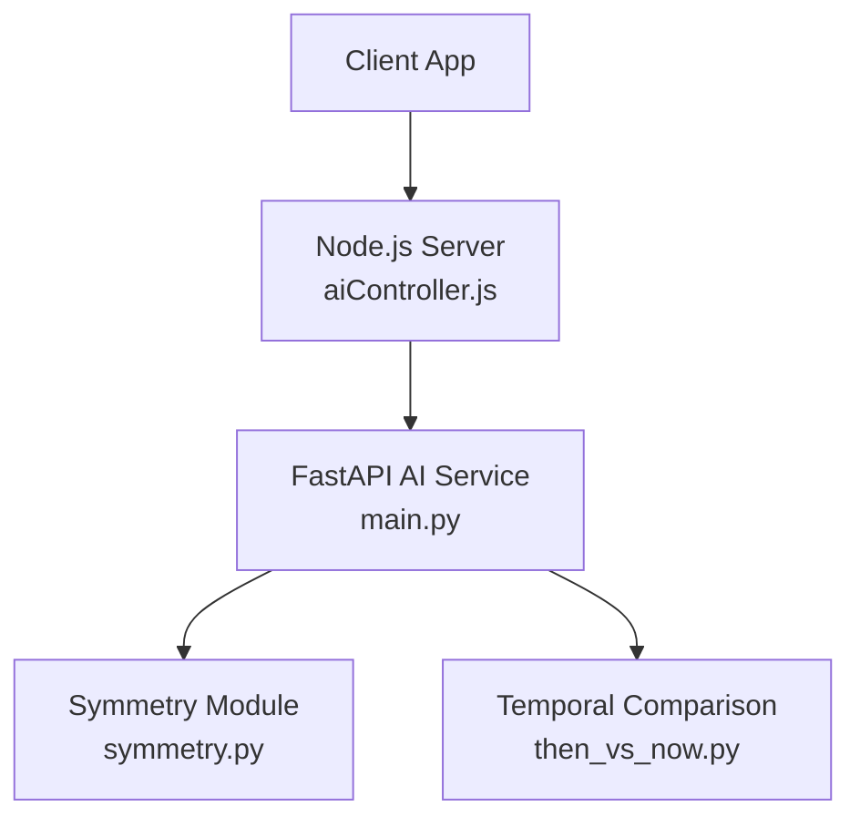
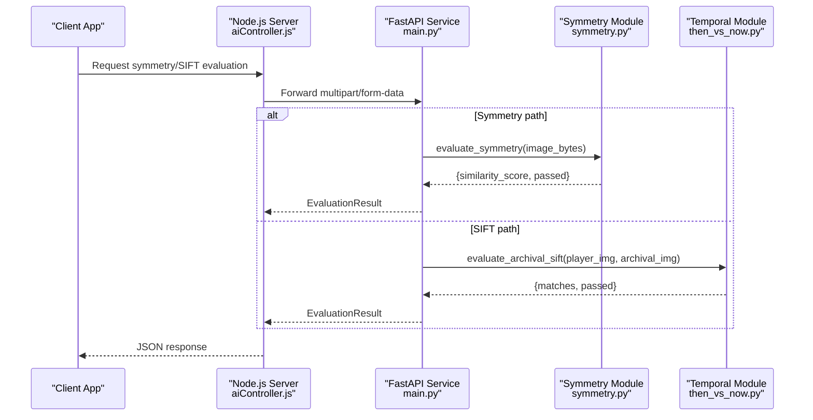
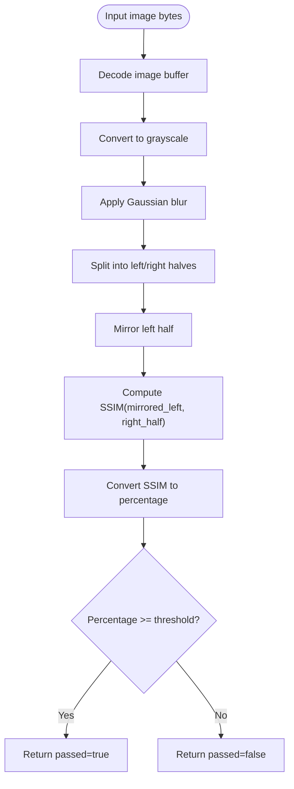
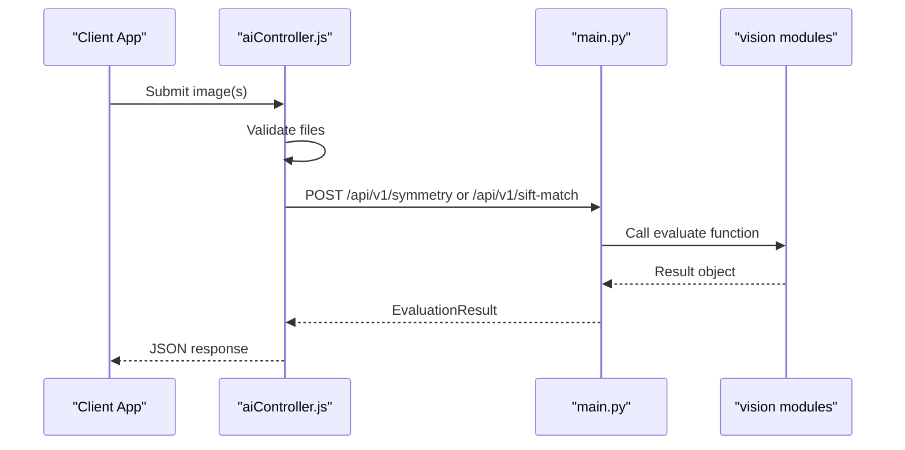
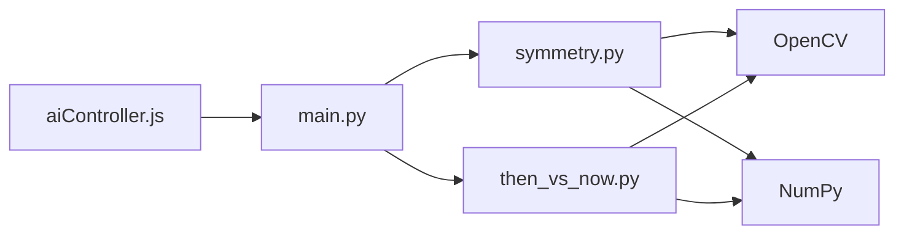

# Image Analysis Tools

<cite>
**Referenced Files in This Document**
- [main.py](file://ai-engine/main.py)
- [symmetry.py](file://ai-engine/vision/symmetry.py)
- [then_vs_now.py](file://ai-engine/vision/then_vs_now.py)
- [aiController.js](file://server/src/controllers/aiController.js)
- [implementation-details.md](file://warg-docs/docs/2-architecture-and-design/implementation-details.md)
</cite>

## Table of Contents
1. [Introduction](#introduction)
2. [Project Structure](#project-structure)
3. [Core Components](#core-components)
4. [Architecture Overview](#architecture-overview)
5. [Detailed Component Analysis](#detailed-component-analysis)
6. [Dependency Analysis](#dependency-analysis)
7. [Performance Considerations](#performance-considerations)
8. [Troubleshooting Guide](#troubleshooting-guide)
9. [Conclusion](#conclusion)
10. [Appendices](#appendices)

## Introduction
This document explains the advanced image analysis tools used for symmetry detection and temporal image comparison within the WARG Platform AI Engine. It focuses on:
- Symmetry detection using a center-axis mirror and Structural Similarity Index (SSIM).
- Temporal image comparison using SIFT feature matching with Lowe’s ratio test and RANSAC geometric verification.
- Integration points between the FastAPI-based AI service and the Node.js server controller.
- Configuration parameters, sensitivity tuning, and performance considerations for real-time gameplay scenarios.
- Practical use cases such as identifying symmetrical objects or detecting changes in environment states across time.

## Project Structure
The relevant components for this documentation are:
- FastAPI endpoints that expose symmetry and SIFT evaluation to the backend.
- Python vision modules implementing SSIM-based symmetry scoring and SIFT-based archival matching.
- A Node.js controller that proxies requests from the application to the AI service.
- Documentation describing axis capture and validation workflows.



**Diagram sources**
- [main.py:77-150](file://ai-engine/main.py#L77-L150)
- [aiController.js:96-154](file://server/src/controllers/aiController.js#L96-L154)

**Section sources**
- [main.py:1-157](file://ai-engine/main.py#L1-L157)
- [aiController.js:96-154](file://server/src/controllers/aiController.js#L96-L154)

## Core Components
- Symmetry Detection: Computes SSIM between mirrored and actual halves after blurring to reduce noise and minor asymmetries. Returns a similarity percentage and pass/fail decision.
- Temporal Image Comparison: Extracts SIFT keypoints and descriptors, performs Lowe’s ratio test, then applies RANSAC homography to filter geometrically consistent matches. Returns match count and pass/fail decision based on a minimum threshold.

Key responsibilities:
- Expose REST endpoints for symmetry and SIFT evaluations.
- Provide robust error handling for invalid inputs and decoding failures.
- Return standardized evaluation results including confidence score and pass status.

**Section sources**
- [symmetry.py:4-65](file://ai-engine/vision/symmetry.py#L4-L65)
- [then_vs_now.py:4-48](file://ai-engine/vision/then_vs_now.py#L4-L48)
- [main.py:127-150](file://ai-engine/main.py#L127-L150)

## Architecture Overview
The AI Engine exposes two primary endpoints for these capabilities:
- POST /api/v1/symmetry: Accepts an image and returns symmetry evaluation.
- POST /api/v1/sift-match: Accepts player and archival images and returns temporal comparison results.



**Diagram sources**
- [main.py:127-150](file://ai-engine/main.py#L127-L150)
- [aiController.js:96-154](file://server/src/controllers/aiController.js#L96-L154)
- [symmetry.py:31-65](file://ai-engine/vision/symmetry.py#L31-L65)
- [then_vs_now.py:4-48](file://ai-engine/vision/then_vs_now.py#L4-L48)

## Detailed Component Analysis

### Symmetry Detection
Symmetry detection evaluates whether an image exhibits bilateral symmetry around a vertical center axis. The algorithm:
- Decodes the input image buffer.
- Converts to grayscale.
- Applies Gaussian blur to suppress fine textures and small asymmetries.
- Splits the blurred image into left and right halves.
- Mirrors the left half horizontally.
- Computes SSIM between the mirrored left half and the right half.
- Converts SSIM to a percentage and compares against a threshold to determine pass/fail.

Mathematical background:
- SSIM measures perceived similarity by comparing local means, variances, and covariance between two image patches, stabilized by constants C1 and C2.
- The implementation uses OpenCV functions for Gaussian blurring and pixel-wise operations to compute the SSIM map and its mean.

Configuration and tuning:
- Blur kernel size controls tolerance to texture and noise; larger kernels increase robustness but may reduce sensitivity to subtle asymmetries.
- Threshold determines strictness; higher thresholds require stronger symmetry.

Use cases:
- Identifying symmetrical objects or patterns in gameplay scenes.
- Validating user-drawn axes of symmetry by mirroring and comparing halves.



**Diagram sources**
- [symmetry.py:31-65](file://ai-engine/vision/symmetry.py#L31-L65)

**Section sources**
- [symmetry.py:4-65](file://ai-engine/vision/symmetry.py#L4-L65)
- [implementation-details.md:174-178](file://warg-docs/docs/2-architecture-and-design/implementation-details.md#L174-L178)

### Temporal Image Comparison (SIFT + RANSAC)
Temporal comparison detects changes between a current player image and an archival reference image by establishing stable correspondences:
- Convert both images to grayscale.
- Detect and compute SIFT keypoints and descriptors.
- Match descriptors using brute-force matcher with L2 norm.
- Apply Lowe’s ratio test to filter ambiguous matches.
- Estimate homography via RANSAC to retain geometrically consistent matches.
- Count inliers and compare against a minimum threshold to decide pass/fail.

Algorithmic steps:
- SIFT extraction provides scale- and rotation-invariant features.
- Lowe’s ratio test reduces false positives by ensuring the best match is significantly better than the second-best.
- RANSAC robustly estimates a transformation model while rejecting outliers.

Configuration and tuning:
- min_matches sets the required number of inlier matches for a positive result; lower values increase sensitivity but risk false positives.
- RANSAC parameters (e.g., reprojection threshold) can be tuned for different scene complexities.

Use cases:
- Detecting environmental state changes between frames or over time.
- Verifying that a scene has not changed beyond expected variance.

```mermaid
flowchart TD
Start(["Player image bytes", "Archival image bytes"]) --> Decode["Decode to grayscale"]
Decode --> SIFT["Detect SIFT keypoints & descriptors"]
SIFT --> Match["Brute-force matching (L2)"]
Match --> Ratio["Lowe's ratio test"]
Ratio --> Geometric{"Enough good matches?"}
Geometric --> |No| LowMatches["Set inliers=[]"]
Geometric --> |Yes| Homography["RANSAC homography estimation"]
Homography --> Inliers["Filter matches by mask"]
LowMatches --> Count["Count inliers"]
Inliers --> Count
Count --> Threshold{"Inliers >= min_matches?"}
Threshold --> |Yes| Pass["Return passed=true"]
Threshold --> |No| Fail["Return passed=false"]
```

**Diagram sources**
- [then_vs_now.py:4-48](file://ai-engine/vision/then_vs_now.py#L4-L48)

**Section sources**
- [then_vs_now.py:4-48](file://ai-engine/vision/then_vs_now.py#L4-L48)

### API Endpoints and Controller Integration
The FastAPI service defines endpoints that accept multipart form data and return standardized evaluation results. The Node.js controller validates inputs, constructs FormData, forwards requests to the AI service, and handles errors.

Endpoints:
- POST /api/v1/symmetry: Evaluates symmetry and returns confidence_score and passed.
- POST /api/v1/sift-match: Evaluates temporal difference and returns matches and passed.

Integration flow:
- Client sends request to Node.js server.
- aiController.js validates files and forwards to AI service.
- main.py routes to appropriate vision module and returns structured result.



**Diagram sources**
- [main.py:127-150](file://ai-engine/main.py#L127-L150)
- [aiController.js:96-154](file://server/src/controllers/aiController.js#L96-L154)

**Section sources**
- [main.py:127-150](file://ai-engine/main.py#L127-L150)
- [aiController.js:96-154](file://server/src/controllers/aiController.js#L96-L154)

## Dependency Analysis
The AI Engine depends on:
- OpenCV for image processing (decoding, color conversion, blurring, SSIM computation, SIFT, matching, RANSAC).
- NumPy for array operations.
- FastAPI for HTTP routing and request handling.
- Node.js server controller for proxying requests and error handling.



**Diagram sources**
- [main.py:1-157](file://ai-engine/main.py#L1-L157)
- [symmetry.py:1-65](file://ai-engine/vision/symmetry.py#L1-L65)
- [then_vs_now.py:1-48](file://ai-engine/vision/then_vs_now.py#L1-L48)
- [aiController.js:96-154](file://server/src/controllers/aiController.js#L96-L154)

**Section sources**
- [main.py:1-157](file://ai-engine/main.py#L1-L157)
- [symmetry.py:1-65](file://ai-engine/vision/symmetry.py#L1-L65)
- [then_vs_now.py:1-48](file://ai-engine/vision/then_vs_now.py#L1-L48)
- [aiController.js:96-154](file://server/src/controllers/aiController.js#L96-L154)

## Performance Considerations
- Symmetry detection:
  - Blurring reduces computational load by simplifying texture details before splitting and comparing halves.
  - SSIM computation involves multiple Gaussian blurs and per-pixel operations; consider reducing image resolution for real-time constraints.
  - Adjust blur kernel size and threshold to balance speed and accuracy.

- Temporal comparison:
  - SIFT detection and descriptor computation are computationally intensive; pre-scale images to a manageable resolution.
  - Lowe’s ratio test and RANSAC add overhead; tune min_matches and RANSAC parameters to meet latency targets.
  - Batch processing or caching strategies can improve throughput when evaluating sequences.

- General:
  - Ensure efficient I/O by streaming image buffers directly to OpenCV without intermediate conversions where possible.
  - Monitor memory usage when processing large images or sequences.

[No sources needed since this section provides general guidance]

## Troubleshooting Guide
Common issues and resolutions:
- Invalid or missing image buffers:
  - Both symmetry and temporal modules raise errors if decoding fails. Verify content types and ensure proper multipart/form-data payloads.
- Poor symmetry scores:
  - Increase blur kernel size to tolerate more noise or adjust the threshold upward for stricter symmetry requirements.
- Insufficient SIFT matches:
  - Increase min_matches cautiously; too low may cause false positives, too high may reject valid comparisons.
  - Ensure sufficient overlap and lighting consistency between player and archival images.
- API integration errors:
  - Check CORS settings and API key authentication in the FastAPI service.
  - Validate that the Node.js controller correctly forwards files and handles non-OK responses.

**Section sources**
- [symmetry.py:31-38](file://ai-engine/vision/symmetry.py#L31-L38)
- [then_vs_now.py:8-13](file://ai-engine/vision/then_vs_now.py#L8-L13)
- [main.py:10-20](file://ai-engine/main.py#L10-L20)
- [aiController.js:114-124](file://server/src/controllers/aiController.js#L114-L124)

## Conclusion
The WARG Platform AI Engine provides robust symmetry detection and temporal image comparison capabilities suitable for real-time gameplay scenarios. By leveraging SSIM-based symmetry scoring and SIFT+RANSAC feature matching, the system can identify symmetrical objects and detect environmental changes with configurable sensitivity. Proper tuning of thresholds, blur parameters, and match counts enables balancing accuracy and performance for interactive applications.

[No sources needed since this section summarizes without analyzing specific files]

## Appendices

### Configuration Parameters and Tuning Guidelines
- Symmetry detection:
  - Blur kernel size: Controls tolerance to texture/noise; larger values increase robustness.
  - Threshold: Minimum similarity percentage to pass; adjust based on desired strictness.
- Temporal comparison:
  - min_matches: Required number of inlier matches; tune for sensitivity vs. reliability.
  - RANSAC parameters: Reprojection threshold and other options can be adjusted for scene complexity.

**Section sources**
- [symmetry.py:42-60](file://ai-engine/vision/symmetry.py#L42-L60)
- [then_vs_now.py:30-43](file://ai-engine/vision/then_vs_now.py#L30-L43)

### Use Cases in Gameplay Scenarios
- Symmetry puzzles:
  - Players capture a frame and draw an axis; the system mirrors and compares halves to validate correctness.
- Environmental change detection:
  - Compare current frames against archival references to detect alterations in scene elements.

**Section sources**
- [implementation-details.md:174-178](file://warg-docs/docs/2-architecture-and-design/implementation-details.md#L174-L178)