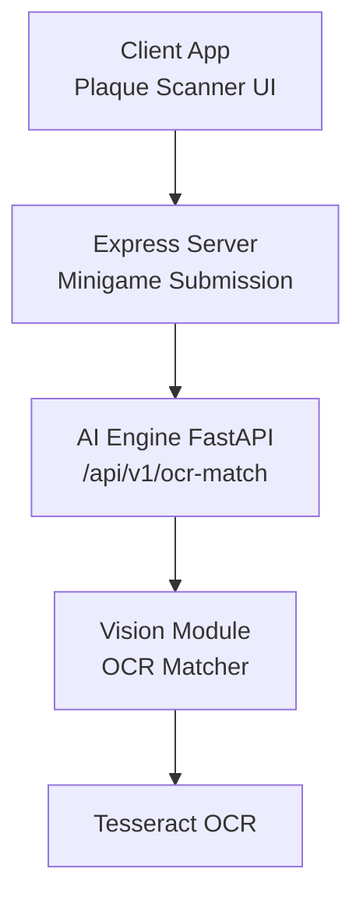
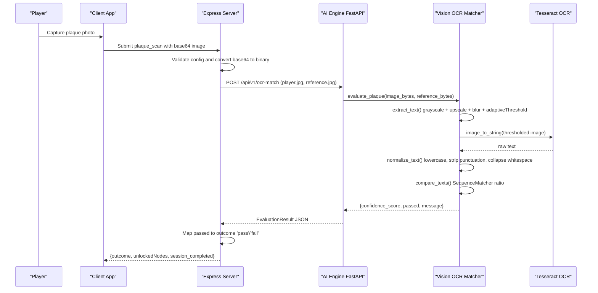
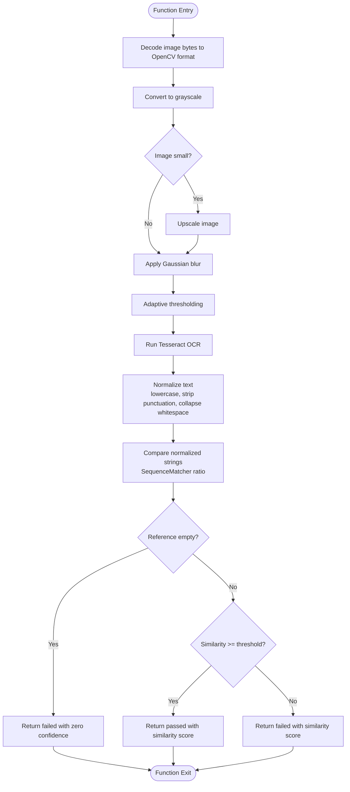
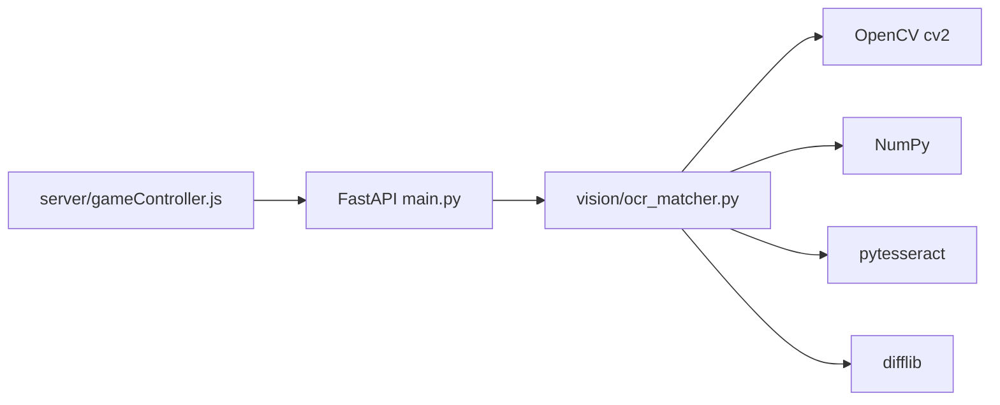

# OCR Processing

<cite>
**Referenced Files in This Document**
- [main.py](file://ai-engine/main.py)
- [ocr_matcher.py](file://ai-engine/vision/ocr_matcher.py)
- [gameController.js](file://server/src/controllers/gameController.js)
- [minigame-handlers.js](file://client/scripts/components/minigame-handlers.js)
- [DEPLOYMENT.md](file://ai-engine/DEPLOYMENT.md)
- [Dockerfile](file://ai-engine/Dockerfile)
- [requirements.txt](file://ai-engine/requirements.txt)
</cite>

## Table of Contents
1. [Introduction](#introduction)
2. [Project Structure](#project-structure)
3. [Core Components](#core-components)
4. [Architecture Overview](#architecture-overview)
5. [Detailed Component Analysis](#detailed-component-analysis)
6. [Dependency Analysis](#dependency-analysis)
7. [Performance Considerations](#performance-considerations)
8. [Troubleshooting Guide](#troubleshooting-guide)
9. [Conclusion](#conclusion)

## Introduction
This document explains the Optical Character Recognition (OCR) processing capabilities used by the platform to support puzzle types that require reading text from images, such as plaque and sign scanning. It covers the end-to-end flow from image capture through preprocessing, text extraction, normalization, and confidence scoring. It also provides guidance for integrating OCR into puzzle workflows, handling different fonts and languages, and optimizing recognition accuracy under challenging conditions like poor lighting, varied orientations, and multilingual content.

## Project Structure
The OCR capability is implemented as a dedicated AI service with an HTTP API. The server integrates this service when validating “plaque scan” minigames. The client exposes a UI for capturing photos and previewing them before submission.

**Diagram sources**
- [main.py:152-157](file://ai-engine/main.py#L152-L157)
- [ocr_matcher.py:9-34](file://ai-engine/vision/ocr_matcher.py#L9-L34)
- [gameController.js:250-273](file://server/src/controllers/gameController.js#L250-L273)

**Section sources**
- [main.py:1-52](file://ai-engine/main.py#L1-L52)
- [ocr_matcher.py:1-79](file://ai-engine/vision/ocr_matcher.py#L1-L79)
- [gameController.js:239-273](file://server/src/controllers/gameController.js#L239-L273)
- [minigame-handlers.js:130-154](file://client/scripts/components/minigame-handlers.js#L130-L154)

## Core Components
- AI Engine OCR endpoint: Accepts player and reference images, returns a normalized evaluation result including confidence score and pass/fail status.
- Vision OCR matcher: Preprocesses images, extracts text via Tesseract, normalizes strings, compares similarity, and applies a threshold decision.
- Server integration: Converts base64 images to binary, forwards them to the AI engine, and maps the returned pass/fail to minigame outcomes.
- Client UI: Provides a camera/file input for capturing plaque images and previews for user feedback.

Key responsibilities:
- Image preprocessing and enhancement for robust text detection.
- Text extraction using Tesseract OCR.
- Text normalization to reduce sensitivity to case, punctuation, and whitespace.
- Similarity-based confidence scoring with a configurable threshold.
- Integration with minigame validation logic.

**Section sources**
- [main.py:152-157](file://ai-engine/main.py#L152-L157)
- [ocr_matcher.py:9-78](file://ai-engine/vision/ocr_matcher.py#L9-L78)
- [gameController.js:250-273](file://server/src/controllers/gameController.js#L250-L273)
- [minigame-handlers.js:130-154](file://client/scripts/components/minigame-handlers.js#L130-L154)

## Architecture Overview
The OCR pipeline is invoked during minigame submission for the “plaque_scan” type. The server validates configuration, converts images to binary, calls the AI engine’s OCR endpoint, and updates game progress based on the returned confidence and pass/fail outcome.

**Diagram sources**
- [gameController.js:239-273](file://server/src/controllers/gameController.js#L239-L273)
- [main.py:152-157](file://ai-engine/main.py#L152-L157)
- [ocr_matcher.py:9-78](file://ai-engine/vision/ocr_matcher.py#L9-L78)

## Detailed Component Analysis

### AI Engine OCR Endpoint
Responsibilities:
- Securely expose the OCR evaluation endpoint behind an API key header.
- Accept two image files: the player’s captured image and the creator-provided reference image.
- Delegate processing to the vision module and return a standardized evaluation result.

Behavior:
- Validates API key and CORS settings.
- Reads uploaded files into memory.
- Calls the vision module’s plaque evaluation function.
- Returns a response model containing confidence_score, passed, and message.

Integration points:
- Health endpoint reports OCR readiness.
- Minigame controller invokes this endpoint for plaque_scan submissions.

**Section sources**
- [main.py:10-33](file://ai-engine/main.py#L10-L33)
- [main.py:39-52](file://ai-engine/main.py#L39-L52)
- [main.py:152-157](file://ai-engine/main.py#L152-L157)

### Vision OCR Matcher
Responsibilities:
- Extract readable text from images optimized for engraved or weathered surfaces.
- Normalize extracted text to improve matching robustness.
- Compute similarity between player and reference texts.
- Apply a threshold to determine pass/fail.

Preprocessing steps:
- Decode image bytes to OpenCV format.
- Convert to grayscale.
- Upscale small images to improve character clarity.
- Apply light Gaussian denoising.
- Use adaptive thresholding to handle uneven lighting and glare.

Text extraction:
- Run Tesseract OCR on the thresholded image.

Normalization:
- Lowercase conversion.
- Remove punctuation.
- Collapse multiple whitespaces into single spaces.
- Trim leading/trailing whitespace.

Scoring mechanism:
- Compare normalized strings using sequence similarity ratio (0.0–1.0).
- If reference text is empty after normalization, return a failed result with zero confidence.
- Threshold determines pass/fail; default threshold is 0.75.

Complexity considerations:
- Preprocessing operations are linear in image size.
- String normalization and comparison are linear in text length.
- Overall performance depends on image resolution and text density.

Error handling:
- Empty reference text yields a clear failure response.
- Confidence score reflects similarity; pass/fail is derived deterministically.

Optimization opportunities:
- Adjust threshold per use case (e.g., stricter for short phrases).
- Tune preprocessing parameters (kernel sizes, thresholds) for specific environments.
- Add language-specific Tesseract configurations for improved accuracy.

**Section sources**
- [ocr_matcher.py:9-34](file://ai-engine/vision/ocr_matcher.py#L9-L34)
- [ocr_matcher.py:36-51](file://ai-engine/vision/ocr_matcher.py#L36-L51)
- [ocr_matcher.py:53-78](file://ai-engine/vision/ocr_matcher.py#L53-L78)

#### OCR Matching Flowchart

**Diagram sources**
- [ocr_matcher.py:9-78](file://ai-engine/vision/ocr_matcher.py#L9-L78)

### Server Integration for Plaque Scan Minigame
Responsibilities:
- Validate that the plaque scanner has required configuration (reference image and MIME type).
- Convert base64-encoded images to binary buffers.
- Build multipart form data and call the AI engine’s OCR endpoint.
- Map the AI engine’s pass/fail result to minigame outcome.
- Update minigame attempts and waypoint progress accordingly.

Error handling:
- Missing configuration returns a 400 error.
- AI service failures return a 502 error.
- Transaction rollback on errors ensures consistency.

Outcome mapping:
- Success sets outcome to 'pass'; otherwise 'fail'.
- Allows retries if configured.

Progress tracking:
- Always marks waypoint progress as completed upon submission.
- Evaluates successor edges and unlocks subsequent waypoints based on conditions.

**Section sources**
- [gameController.js:239-273](file://server/src/controllers/gameController.js#L239-L273)
- [gameController.js:279-344](file://server/src/controllers/gameController.js#L279-L344)

### Client UI for Plaque Scanner
Responsibilities:
- Provide a file input for capturing environment photos.
- Display a preview of the selected image.
- Trigger submission to the server for validation.

User experience:
- Clear instructions guide players to photograph plaques or signs.
- Preview helps users confirm image quality before submission.

**Section sources**
- [minigame-handlers.js:130-154](file://client/scripts/components/minigame-handlers.js#L130-L154)

## Dependency Analysis
External dependencies:
- OpenCV (cv2): Image decoding, color space conversion, resizing, blurring, and adaptive thresholding.
- NumPy: Array handling for image buffers.
- Pytesseract: Wrapper around Tesseract OCR for text extraction.
- difflib: Built-in string similarity comparison.
- FastAPI: Web framework exposing endpoints.
- Tesseract binaries: Required for OCR execution.

Runtime configuration:
- API key header for securing AI engine access.
- CORS origins allowlist for cross-origin requests.
- Environment variables for AI service URL and API key.

Deployment notes:
- Tesseract and English language data must be installed in the container.
- Requirements include pytesseract and other Python packages.

**Diagram sources**
- [main.py:1-6](file://ai-engine/main.py#L1-L6)
- [ocr_matcher.py:1-5](file://ai-engine/vision/ocr_matcher.py#L1-L5)
- [requirements.txt:12](file://ai-engine/requirements.txt#L12)
- [Dockerfile:18-19](file://ai-engine/Dockerfile#L18-L19)
- [DEPLOYMENT.md:73](file://ai-engine/DEPLOYMENT.md#L73)

**Section sources**
- [requirements.txt:12](file://ai-engine/requirements.txt#L12)
- [Dockerfile:18-19](file://ai-engine/Dockerfile#L18-L19)
- [DEPLOYMENT.md:73](file://ai-engine/DEPLOYMENT.md#L73)

## Performance Considerations
- Image scaling: Upscaling small images improves character recognition but increases processing time. Choose thresholds carefully to balance speed and accuracy.
- Blurring kernel size: Larger kernels smooth noise more aggressively but may blur fine details; tune based on typical image quality.
- Adaptive threshold parameters: Block size and constant affect sensitivity to local lighting variations; adjust per deployment environment.
- Text normalization: Removing punctuation and collapsing whitespace reduces false negatives due to minor formatting differences.
- Threshold tuning: Default threshold of 0.75 can be adjusted per puzzle difficulty and expected text variability.
- Concurrency: The FastAPI service can handle concurrent requests; ensure adequate CPU/GPU resources for Tesseract inference.

[No sources needed since this section provides general guidance]

## Troubleshooting Guide
Common issues and resolutions:
- No readable text in reference image:
  - Ensure the reference image contains clear, legible text.
  - Improve lighting and focus when capturing reference images.
  - Consider adjusting preprocessing parameters or adding language packs for better OCR.
- Poor recognition accuracy:
  - Verify Tesseract installation and language data availability.
  - Increase image resolution or apply additional denoising.
  - Fine-tune adaptive threshold block size and constant.
- Multilingual support:
  - Install appropriate Tesseract language packs.
  - Configure OCR to use the correct language code for mixed-language content.
- Orientation and skew:
  - Add deskewing or rotation correction before OCR if plaques are frequently photographed at angles.
- Performance bottlenecks:
  - Profile image preprocessing and OCR calls.
  - Scale horizontally by running multiple AI engine instances behind a load balancer.

Operational checks:
- Health endpoint confirms OCR readiness.
- Review logs for AI service connectivity and response codes.
- Validate that the server correctly forwards base64 images and handles errors.

**Section sources**
- [ocr_matcher.py:53-78](file://ai-engine/vision/ocr_matcher.py#L53-L78)
- [main.py:39-52](file://ai-engine/main.py#L39-L52)
- [gameController.js:250-273](file://server/src/controllers/gameController.js#L250-L273)

## Conclusion
The OCR processing pipeline integrates seamlessly with the platform’s minigame system to enable plaque and sign scanning puzzles. It leverages OpenCV for robust image preprocessing, Tesseract for text extraction, and sequence similarity for confidence scoring. With careful tuning of preprocessing parameters, thresholds, and language packs, the system can achieve reliable recognition across varied fonts, languages, and environmental conditions. The modular design allows for future enhancements such as orientation correction, advanced denoising, and multilingual OCR configurations.

[No sources needed since this section summarizes without analyzing specific files]