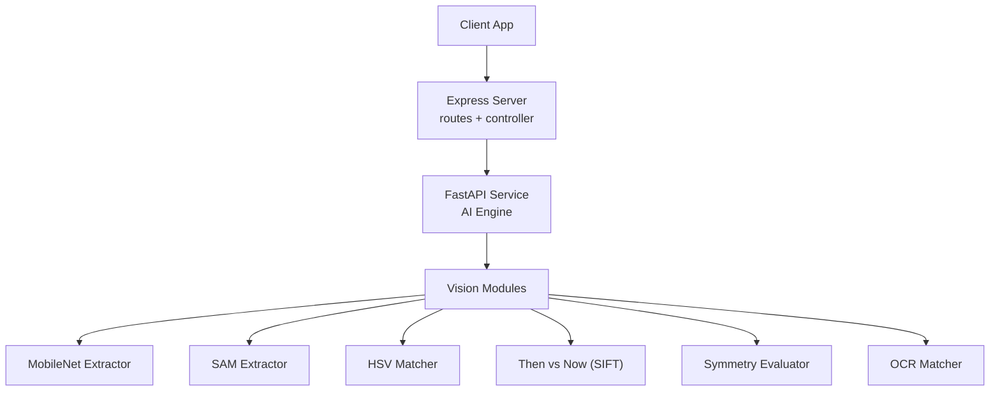
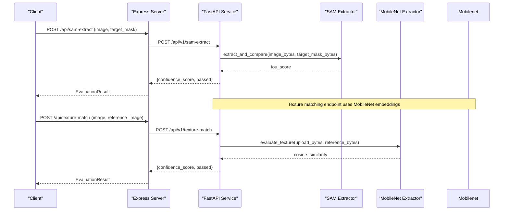
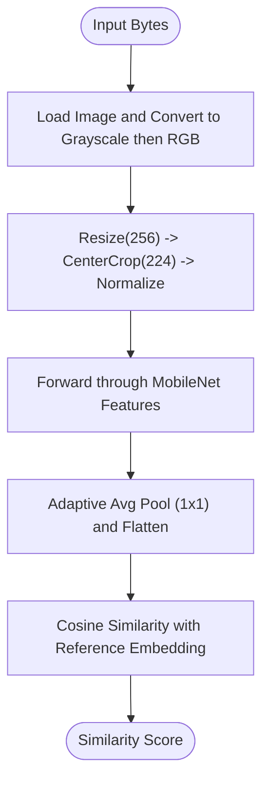
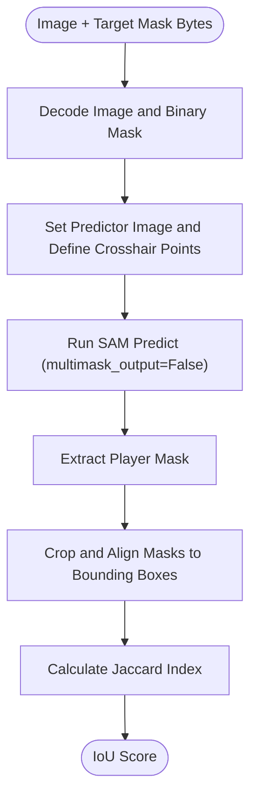
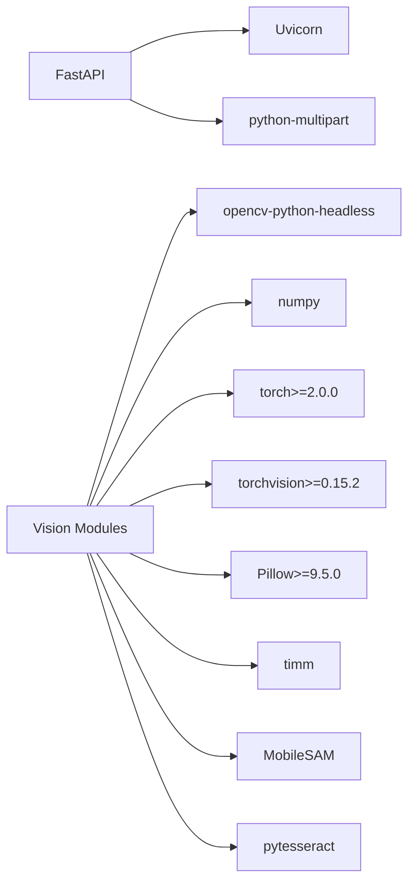

# Object Detection System

<cite>
**Referenced Files in This Document**
- [main.py](file://ai-engine/main.py)
- [mobilenet_extractor.py](file://ai-engine/vision/mobilenet_extractor.py)
- [sam_extractor.py](file://ai-engine/vision/sam_extractor.py)
- [hsv_matcher.py](file://ai-engine/vision/hsv_matcher.py)
- [then_vs_now.py](file://ai-engine/vision/then_vs_now.py)
- [symmetry.py](file://ai-engine/vision/symmetry.py)
- [ocr_matcher.py](file://ai-engine/vision/ocr_matcher.py)
- [aiController.js](file://server/src/controllers/aiController.js)
- [aiRoutes.js](file://server/src/routes/aiRoutes.js)
- [requirements.txt](file://ai-engine/requirements.txt)
</cite>

## Table of Contents
1. [Introduction](#introduction)
2. [Project Structure](#project-structure)
3. [Core Components](#core-components)
4. [Architecture Overview](#architecture-overview)
5. [Detailed Component Analysis](#detailed-component-analysis)
6. [Dependency Analysis](#dependency-analysis)
7. [Performance Considerations](#performance-considerations)
8. [Troubleshooting Guide](#troubleshooting-guide)
9. [Conclusion](#conclusion)
10. [Appendices](#appendices)

## Introduction
This document explains the object detection and segmentation capabilities implemented in the WARG Platform’s AI engine, focusing on:
- Feature extraction using MobileNet for texture similarity
- Precise shape segmentation with Segment Anything Model (SAM)
- Confidence thresholding and pass/fail decisions
- Integration between a lightweight MobileNet-based pipeline and SAM for robust evaluation
- Model loading, inference optimization, and memory management considerations for real-time processing
- Practical guidance for custom object training, accuracy tuning, and performance benchmarking across hardware configurations

The system exposes FastAPI endpoints for evaluation tasks and is integrated with an Express server that proxies requests to the AI service.

## Project Structure
The AI-related code is organized into two main parts:
- Python FastAPI service under ai-engine that implements vision algorithms and model inference
- Node.js Express routes and controllers under server that proxy client requests to the AI service

**Diagram sources**
- [main.py:1-157](file://ai-engine/main.py#L1-L157)
- [aiController.js:1-163](file://server/src/controllers/aiController.js#L1-L163)
- [aiRoutes.js:1-40](file://server/src/routes/aiRoutes.js#L1-L40)

**Section sources**
- [main.py:1-157](file://ai-engine/main.py#L1-L157)
- [aiController.js:1-163](file://server/src/controllers/aiController.js#L1-L163)
- [aiRoutes.js:1-40](file://server/src/routes/aiRoutes.js#L1-L40)

## Core Components
- FastAPI endpoints provide evaluation APIs for shape segmentation (SAM), color matching (HSV), texture similarity (MobileNet), archival matching (SIFT), symmetry analysis, and OCR text comparison.
- Vision modules encapsulate specific algorithms:
  - MobileNet extractor computes embeddings and cosine similarity for texture matching
  - SAM extractor performs zero-shot segmentation using point prompts and evaluates masks via Jaccard index
  - HSV matcher builds hue-saturation histograms and compares distributions
  - Then vs now module uses SIFT keypoints and RANSAC for geometric verification
  - Symmetry evaluator mirrors image halves and computes SSIM
  - OCR matcher preprocesses images and compares extracted text strings

Key responsibilities:
- Endpoint routing and request validation
- Model initialization and device placement
- Inference pipelines and confidence scoring
- Pass/fail thresholds per task

**Section sources**
- [main.py:35-157](file://ai-engine/main.py#L35-L157)
- [mobilenet_extractor.py:1-50](file://ai-engine/vision/mobilenet_extractor.py#L1-L50)
- [sam_extractor.py:1-90](file://ai-engine/vision/sam_extractor.py#L1-L90)
- [hsv_matcher.py:1-62](file://ai-engine/vision/hsv_matcher.py#L1-L62)
- [then_vs_now.py:1-48](file://ai-engine/vision/then_vs_now.py#L1-L48)
- [symmetry.py:1-65](file://ai-engine/vision/symmetry.py#L1-L65)
- [ocr_matcher.py:1-79](file://ai-engine/vision/ocr_matcher.py#L1-L79)

## Architecture Overview
The end-to-end flow for object detection and segmentation integrates a lightweight feature extractor (MobileNet) and a precise segmentation model (SAM). The FastAPI service orchestrates these components and returns standardized evaluation results.

**Diagram sources**
- [main.py:77-125](file://ai-engine/main.py#L77-L125)
- [sam_extractor.py:52-90](file://ai-engine/vision/sam_extractor.py#L52-L90)
- [mobilenet_extractor.py:40-50](file://ai-engine/vision/mobilenet_extractor.py#L40-L50)
- [aiController.js:3-94](file://server/src/controllers/aiController.js#L3-L94)

## Detailed Component Analysis

### MobileNet Feature Extraction Pipeline
MobileNet V2 is used to extract structural features from images for texture similarity evaluation. The pipeline:
- Loads pre-trained MobileNet V2 weights
- Applies ImageNet preprocessing (resize, center crop, normalization)
- Converts input bytes to grayscale then RGB to reduce lighting sensitivity
- Extracts feature maps and pools them into a 1D embedding vector
- Computes cosine similarity between embeddings of upload and reference images

**Diagram sources**
- [mobilenet_extractor.py:11-38](file://ai-engine/vision/mobilenet_extractor.py#L11-L38)
- [mobilenet_extractor.py:40-50](file://ai-engine/vision/mobilenet_extractor.py#L40-L50)

Implementation notes:
- Model is set to evaluation mode
- Inference runs without gradient computation
- Embedding dimensionality is fixed by pooling to 1D vector

Confidence thresholding:
- The texture match endpoint applies a threshold of 0.60 to decide pass/fail

**Section sources**
- [mobilenet_extractor.py:1-50](file://ai-engine/vision/mobilenet_extractor.py#L1-L50)
- [main.py:113-125](file://ai-engine/main.py#L113-L125)

### SAM Segmentation and Mask Evaluation
SAM is used for precise shape segmentation guided by point prompts. The pipeline:
- Initializes MobileSAM with a ViT-tiny checkpoint
- Places the model on CUDA if available, otherwise CPU
- Accepts an image and a binary target mask
- Uses a dynamic crosshair of five points centered around the image midpoint to prompt segmentation
- Produces a single mask output and aligns it with the reference mask by cropping to bounding boxes and resizing
- Calculates the Jaccard Index (IoU) between aligned masks

**Diagram sources**
- [sam_extractor.py:6-16](file://ai-engine/vision/sam_extractor.py#L6-L16)
- [sam_extractor.py:18-50](file://ai-engine/vision/sam_extractor.py#L18-L50)
- [sam_extractor.py:52-90](file://ai-engine/vision/sam_extractor.py#L52-L90)

Confidence thresholding:
- The shape evaluation endpoint uses a threshold of 0.75 to determine pass/fail

Model selection strategy:
- MobileSAM ViT-tiny is chosen for lightweight performance while maintaining strong zero-shot segmentation capability

Memory management:
- Predictor is initialized once at module load time
- Device placement checks for CUDA availability

**Section sources**
- [sam_extractor.py:1-90](file://ai-engine/vision/sam_extractor.py#L1-L90)
- [main.py:77-93](file://ai-engine/main.py#L77-L93)

### HSV Color Matching
HSV matcher computes normalized Hue-Saturation histograms and compares distributions using Bhattacharyya distance:
- Decodes image bytes and converts to HSV
- Optionally combines an external mask (e.g., from SAM) with a saturation gate to exclude achromatic pixels
- Builds a 12x8 histogram and normalizes it
- Compares histograms and returns similarity score

Thresholding:
- The color match endpoint applies a threshold of 0.80

Integration with SAM:
- While not directly invoked by SAM in this codebase, the HSV matcher supports optional mask_bytes to focus color analysis on segmented regions

**Section sources**
- [hsv_matcher.py:1-62](file://ai-engine/vision/hsv_matcher.py#L1-L62)
- [main.py:95-111](file://ai-engine/main.py#L95-L111)

### SIFT Archival Matching
Then vs now module extracts SIFT keypoints and descriptors, matches them, applies Lowe’s ratio test, and verifies geometric consistency via RANSAC homography:
- Detects keypoints and computes descriptors for both images
- Matches descriptors using BFMatcher with k=2
- Filters matches based on ratio test
- Computes homography and counts inliers
- Returns number of inliers and pass/fail decision based on minimum matches

Thresholding:
- Minimum matches threshold is configurable; default is 15

**Section sources**
- [then_vs_now.py:1-48](file://ai-engine/vision/then_vs_now.py#L1-L48)
- [main.py:127-138](file://ai-engine/main.py#L127-L138)

### Symmetry Evaluation
Symmetry evaluator blurs the image, splits it vertically, mirrors one half, and computes SSIM:
- Converts to grayscale and applies Gaussian blur
- Mirrors left half and compares with right half
- Returns similarity percentage and pass/fail decision

Thresholding:
- Threshold is 40% similarity

**Section sources**
- [symmetry.py:1-65](file://ai-engine/vision/symmetry.py#L1-L65)
- [main.py:140-150](file://ai-engine/main.py#L140-L150)

### OCR Text Matching
OCR matcher preprocesses images for engraved or weathered text and compares extracted strings:
- Upscales small images, denoises, and applies adaptive thresholding
- Runs Tesseract OCR
- Normalizes text (lowercase, strip punctuation, collapse whitespace)
- Compares strings using SequenceMatcher ratio
- Returns similarity score and pass/fail decision

Thresholding:
- Default threshold is 0.75

**Section sources**
- [ocr_matcher.py:1-79](file://ai-engine/vision/ocr_matcher.py#L1-L79)
- [main.py:152-157](file://ai-engine/main.py#L152-L157)

## Dependency Analysis
External dependencies are declared in requirements.txt and include FastAPI, Uvicorn, OpenCV headless, NumPy, PyTorch, Torchvision, Pillow, timm, MobileSAM, and Pytesseract.

**Diagram sources**
- [requirements.txt:1-12](file://ai-engine/requirements.txt#L1-L12)

Coupling and cohesion:
- Each vision module is cohesive and focused on a single algorithm
- FastAPI endpoints orchestrate modules without deep coupling
- Express server acts as a thin proxy layer, decoupling client from AI service internals

Potential circular dependencies:
- None observed; modules import only standard libraries and third-party packages

External integration points:
- Express server proxies HTTP requests to FastAPI
- Health endpoint reports model availability status

**Section sources**
- [requirements.txt:1-12](file://ai-engine/requirements.txt#L1-L12)
- [main.py:35-52](file://ai-engine/main.py#L35-L52)
- [aiController.js:1-163](file://server/src/controllers/aiController.js#L1-L163)
- [aiRoutes.js:1-40](file://server/src/routes/aiRoutes.js#L1-L40)

## Performance Considerations
- Model loading:
  - MobileNet is loaded once at module import time and set to evaluation mode
  - SAM predictor is initialized once at module load time with device placement check
- Inference optimization:
  - MobileNet inference uses torch.no_grad() to avoid gradient computation
  - SAM uses multimask_output=False to reduce output size
  - HSV matcher normalizes histograms to reduce numerical instability
- Memory management:
  - Avoid repeated model instantiation by initializing predictors at module level
  - Use headless OpenCV to reduce overhead in server environments
- Real-time processing:
  - Prefer GPU acceleration when CUDA is available
  - Batch requests where possible to amortize model loading costs
  - Tune thresholds per task to balance precision and recall

[No sources needed since this section provides general guidance]

## Troubleshooting Guide
Common issues and resolutions:
- Missing SAM weights:
  - Ensure the checkpoint file exists at the expected path; the module prints a warning if missing
- Invalid API key:
  - FastAPI enforces X-API-Key header; ensure correct key is provided
- CORS errors:
  - Verify allowed origins include your client domain
- File size limits:
  - Express multer limits uploads to 5MB; adjust if necessary
- OCR failures:
  - Ensure Tesseract is installed and accessible; verify image preprocessing steps

**Section sources**
- [sam_extractor.py:6-16](file://ai-engine/vision/sam_extractor.py#L6-L16)
- [main.py:10-20](file://ai-engine/main.py#L10-L20)
- [main.py:22-33](file://ai-engine/main.py#L22-L33)
- [aiRoutes.js:7-10](file://server/src/routes/aiRoutes.js#L7-L10)

## Conclusion
The WARG Platform’s AI engine integrates MobileNet for efficient feature extraction and SAM for precise segmentation, providing a robust pipeline for object detection and evaluation. Clear confidence thresholds govern pass/fail decisions across tasks, and the architecture separates concerns between Express and FastAPI layers. With careful attention to model loading, inference optimization, and memory management, the system can support real-time processing across diverse hardware configurations.

[No sources needed since this section summarizes without analyzing specific files]

## Appendices

### API Endpoints Summary
- Shape evaluation (SAM): POST /api/v1/sam-extract
- Color matching (HSV): POST /api/v1/hsv-match
- Texture matching (MobileNet): POST /api/v1/texture-match
- Archival matching (SIFT): POST /api/v1/sift-match
- Symmetry evaluation: POST /api/v1/symmetry
- OCR matching: POST /api/v1/ocr-match

Response schema:
- confidence_score: float
- passed: bool
- message: string

**Section sources**
- [main.py:54-69](file://ai-engine/main.py#L54-L69)
- [main.py:77-157](file://ai-engine/main.py#L77-L157)

### Custom Object Training Guidance
- For MobileNet-based texture matching:
  - Fine-tune MobileNet V2 on a curated dataset of textures relevant to your objects
  - Adjust preprocessing to match domain characteristics (e.g., lighting conditions)
  - Retune the cosine similarity threshold based on validation metrics
- For SAM-based segmentation:
  - Use point prompts tailored to object geometry; consider multiple prompt strategies
  - Evaluate mask alignment quality and adjust IoU threshold accordingly
  - Explore prompt engineering techniques (e.g., varying offsets) to improve robustness

[No sources needed since this section provides general guidance]

### Benchmarking Across Hardware
- Measure latency and throughput on CPU vs GPU
- Profile model loading times and inference durations
- Track memory usage during peak loads
- Compare thresholds’ impact on false positives/negatives across datasets

[No sources needed since this section provides general guidance]