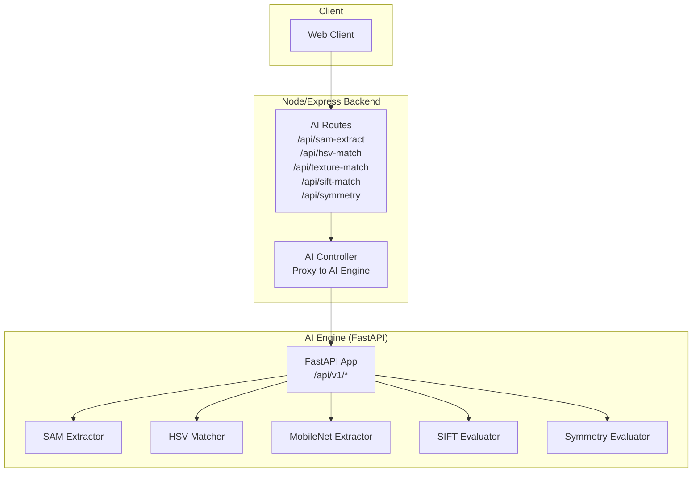
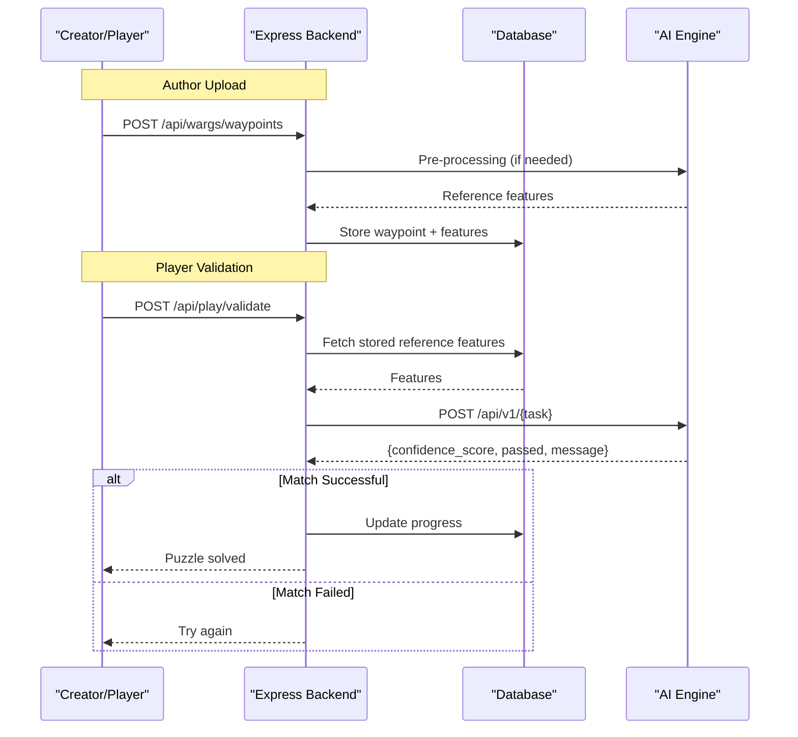
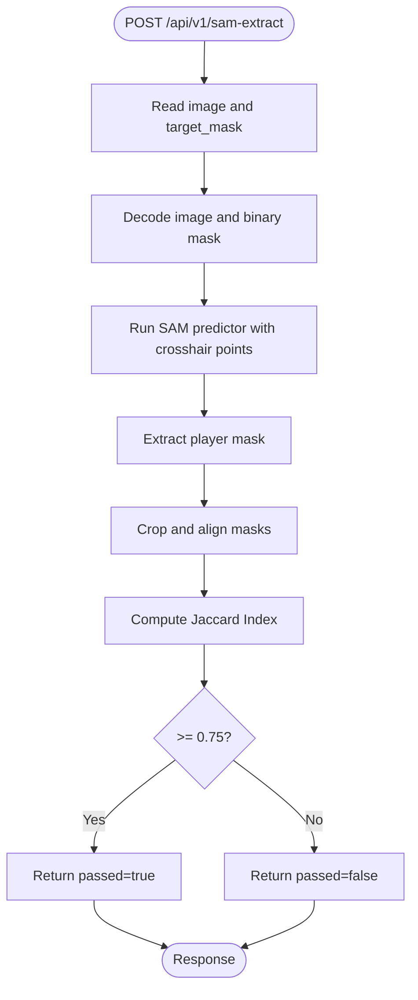
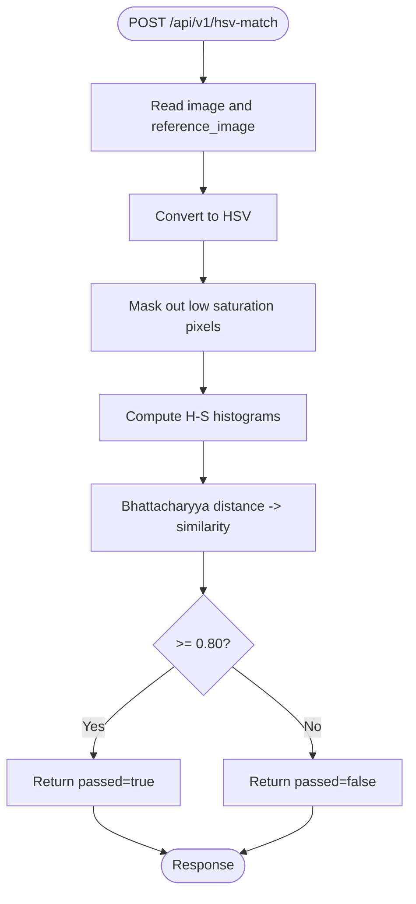
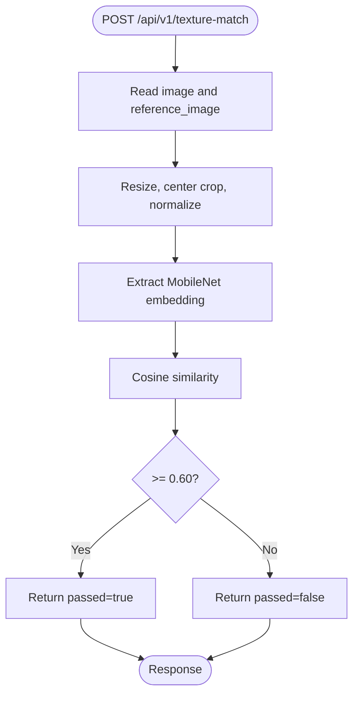
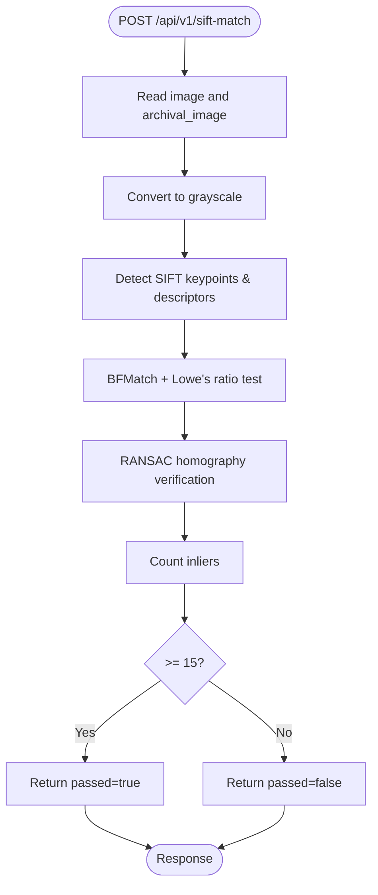
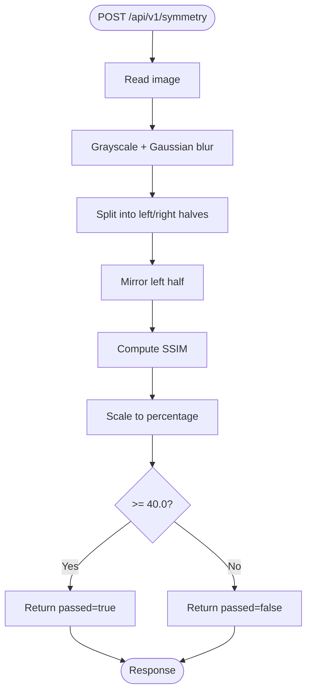
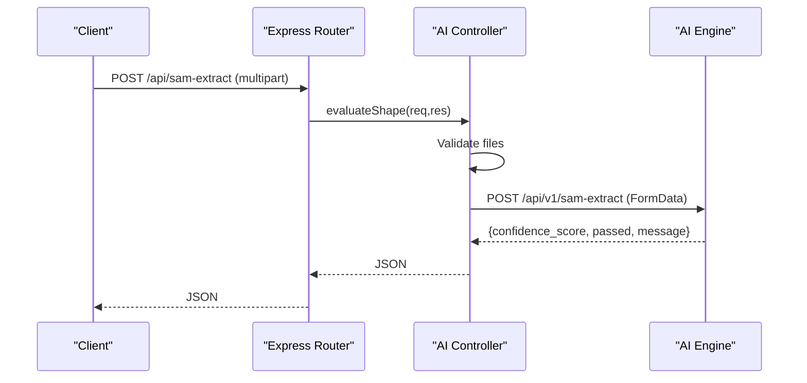
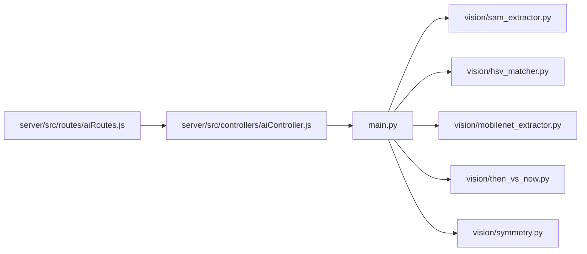

# AI Engine API

<cite>
**Referenced Files in This Document**
- [main.py](file://ai-engine/main.py)
- [sam_extractor.py](file://ai-engine/vision/sam_extractor.py)
- [hsv_matcher.py](file://ai-engine/vision/hsv_matcher.py)
- [mobilenet_extractor.py](file://ai-engine/vision/mobilenet_extractor.py)
- [then_vs_now.py](file://ai-engine/vision/then_vs_now.py)
- [symmetry.py](file://ai-engine/vision/symmetry.py)
- [aiRoutes.js](file://server/src/routes/aiRoutes.js)
- [aiController.js](file://server/src/controllers/aiController.js)
- [ai-engine-data-flow.md](file://warg-docs/docs/2-architecture-and-design/ai-engine-data-flow.md)
</cite>

## Table of Contents
1. [Introduction](#introduction)
2. [Project Structure](#project-structure)
3. [Core Components](#core-components)
4. [Architecture Overview](#architecture-overview)
5. [Detailed Component Analysis](#detailed-component-analysis)
6. [Dependency Analysis](#dependency-analysis)
7. [Performance Considerations](#performance-considerations)
8. [Troubleshooting Guide](#troubleshooting-guide)
9. [Conclusion](#conclusion)
10. [Appendices](#appendices)

## Introduction
This document provides comprehensive API documentation for the AI Engine that powers computer vision processing for the WARG Platform. It covers FastAPI endpoints for image analysis, HSV color matching, MobileNet feature extraction, SIFT archival matching, and SAM-based shape detection. It also documents how the Node/Express backend proxies requests to the AI Engine, including request/response schemas, file upload formats, confidence score interpretation, result parsing, model integration patterns, performance characteristics, error handling, and integration examples with timeout and retry strategies.

## Project Structure
The AI Engine is a FastAPI service exposing REST endpoints under /api/v1. The Node/Express backend exposes its own routes and proxies multipart/form-data requests to the AI Engine. Vision modules implement specific algorithms:
- SAM extractor for shape alignment and Jaccard scoring
- HSV matcher for color histogram similarity
- MobileNet extractor for texture embeddings and cosine similarity
- SIFT evaluator for archival image matching
- Symmetry evaluator using SSIM on mirrored halves

**Diagram sources**
- [aiRoutes.js:15-37](file://server/src/routes/aiRoutes.js#L15-L37)
- [aiController.js:1-163](file://server/src/controllers/aiController.js#L1-L163)
- [main.py:77-157](file://ai-engine/main.py#L77-L157)

**Section sources**
- [ai-engine-data-flow.md:9-44](file://warg-docs/docs/2-architecture-and-design/ai-engine-data-flow.md#L9-L44)

## Core Components
- FastAPI application with CORS and API key security
- Health endpoint reporting model availability
- Evaluation endpoints returning standardized results:
  - confidence_score: float between 0 and 1 (except symmetry which returns percentage)
  - passed: boolean threshold decision
  - message: human-readable status

Key response schema:
- EvaluationResult:
  - confidence_score: number
  - passed: boolean
  - message: string

Security:
- X-API-Key header required for all evaluation endpoints
- Default development key can be overridden via environment variable

CORS:
- Allows specified origins for browser access from frontend and staging environments

**Section sources**
- [main.py:1-52](file://ai-engine/main.py#L1-L52)
- [main.py:54-70](file://ai-engine/main.py#L54-L70)

## Architecture Overview
The data flow involves:
- Author uploads reference images and settings; backend may pre-process or store features
- Player captures an image at a waypoint; backend validates by calling AI Engine
- AI Engine computes similarity metrics and returns pass/fail decisions

**Diagram sources**
- [ai-engine-data-flow.md:11-44](file://warg-docs/docs/2-architecture-and-design/ai-engine-data-flow.md#L11-L44)

## Detailed Component Analysis

### Endpoint: Shape Extraction with SAM
- Method: POST
- URL: /api/v1/sam-extract
- Authentication: X-API-Key header
- Request:
  - Multipart/form-data fields:
    - image: player’s captured image
    - target_mask: creator-provided mask defining the target shape
- Response:
  - confidence_score: Jaccard Index (IoU) after aligning masks
  - passed: true if confidence_score >= 0.75
  - message: “Shape extraction and evaluation complete.”

Processing logic:
- Decode images and mask
- Use SAM predictor with dynamic crosshair points to extract primary shape
- Align masks by bounding boxes and resize player mask to reference crop
- Compute IoU

**Diagram sources**
- [main.py:77-93](file://ai-engine/main.py#L77-L93)
- [sam_extractor.py:52-90](file://ai-engine/vision/sam_extractor.py#L52-L90)

**Section sources**
- [main.py:77-93](file://ai-engine/main.py#L77-L93)
- [sam_extractor.py:1-90](file://ai-engine/vision/sam_extractor.py#L1-L90)

### Endpoint: HSV Color Matching
- Method: POST
- URL: /api/v1/hsv-match
- Authentication: X-API-Key header
- Request:
  - Multipart/form-data fields:
    - image: player’s captured image
    - reference_image: creator’s reference image
- Response:
  - confidence_score: Bhattacharyya-based similarity (0–1)
  - passed: true if confidence_score >= 0.80
  - message: “Colour evaluation complete.”

Processing logic:
- Convert images to HSV
- Build combined mask excluding low-saturation pixels
- Compute normalized 2D Hue-Saturation histograms
- Compare using Bhattacharyya distance and invert to similarity

**Diagram sources**
- [main.py:95-111](file://ai-engine/main.py#L95-L111)
- [hsv_matcher.py:4-62](file://ai-engine/vision/hsv_matcher.py#L4-L62)

**Section sources**
- [main.py:95-111](file://ai-engine/main.py#L95-L111)
- [hsv_matcher.py:1-62](file://ai-engine/vision/hsv_matcher.py#L1-L62)

### Endpoint: Texture Matching with MobileNet
- Method: POST
- URL: /api/v1/texture-match
- Authentication: X-API-Key header
- Request:
  - Multipart/form-data fields:
    - image: player’s captured image
    - reference_image: creator’s reference image
- Response:
  - confidence_score: Cosine similarity of MobileNet embeddings (0–1)
  - passed: true if confidence_score >= 0.60
  - message: “Texture evaluation complete.”

Processing logic:
- Load images, convert to grayscale then RGB for MobileNet
- Resize and normalize per ImageNet preprocessing
- Extract 1280-dim embedding via adaptive pooling
- Compute cosine similarity

**Diagram sources**
- [main.py:113-125](file://ai-engine/main.py#L113-L125)
- [mobilenet_extractor.py:24-50](file://ai-engine/vision/mobilenet_extractor.py#L24-L50)

**Section sources**
- [main.py:113-125](file://ai-engine/main.py#L113-L125)
- [mobilenet_extractor.py:1-50](file://ai-engine/vision/mobilenet_extractor.py#L1-L50)

### Endpoint: SIFT Archival Matching
- Method: POST
- URL: /api/v1/sift-match
- Authentication: X-API-Key header
- Request:
  - Multipart/form-data fields:
    - image: player’s captured image
    - archival_image: historical/reference image
- Response:
  - confidence_score: Number of geometrically consistent matches (inliers)
  - passed: true if inlier count >= min_matches (default 15)
  - message: “SIFT evaluation complete.”

Processing logic:
- Detect SIFT keypoints and descriptors
- Match with BFMatcher (NORM_L2), apply Lowe’s ratio test
- RANSAC homography to filter geometrically consistent matches
- Count inliers and compare against threshold

**Diagram sources**
- [main.py:127-138](file://ai-engine/main.py#L127-L138)
- [then_vs_now.py:4-48](file://ai-engine/vision/then_vs_now.py#L4-L48)

**Section sources**
- [main.py:127-138](file://ai-engine/main.py#L127-L138)
- [then_vs_now.py:1-48](file://ai-engine/vision/then_vs_now.py#L1-L48)

### Endpoint: Symmetry Evaluation
- Method: POST
- URL: /api/v1/symmetry
- Authentication: X-API-Key header
- Request:
  - Multipart/form-data field:
    - image: player’s captured image
- Response:
  - confidence_score: Percentage similarity (0–100)
  - passed: true if confidence_score >= 40.0
  - message: “Symmetry evaluation complete.”

Processing logic:
- Convert to grayscale and blur heavily to reduce noise
- Split image into left/right halves
- Mirror left half and compute SSIM with right half
- Scale SSIM to percentage and apply threshold

**Diagram sources**
- [main.py:140-150](file://ai-engine/main.py#L140-L150)
- [symmetry.py:31-65](file://ai-engine/vision/symmetry.py#L31-L65)

**Section sources**
- [main.py:140-150](file://ai-engine/main.py#L140-L150)
- [symmetry.py:1-65](file://ai-engine/vision/symmetry.py#L1-L65)

### Express Backend Integration
The Express backend exposes routes that accept multipart files and proxy them to the AI Engine.

- Routes:
  - POST /api/sam-extract
  - POST /api/hsv-match
  - POST /api/texture-match
  - POST /api/sift-match
  - POST /api/symmetry
- File limits: 5MB per request
- Authentication: requireAuth middleware protects all routes
- Proxy behavior:
  - Validates presence of required files
  - Builds FormData with buffers and original filenames
  - Calls AI_SERVICE_URL + /api/v1/{endpoint}
  - Returns AI Engine JSON response or maps errors to 500

**Diagram sources**
- [aiRoutes.js:15-37](file://server/src/routes/aiRoutes.js#L15-L37)
- [aiController.js:3-32](file://server/src/controllers/aiController.js#L3-L32)

**Section sources**
- [aiRoutes.js:1-40](file://server/src/routes/aiRoutes.js#L1-L40)
- [aiController.js:1-163](file://server/src/controllers/aiController.js#L1-L163)

## Dependency Analysis
- FastAPI app depends on vision modules:
  - sam_extractor
  - hsv_matcher
  - mobilenet_extractor
  - then_vs_now
  - symmetry
- Express backend depends on:
  - multer for multipart parsing
  - aiController for proxying requests
- External libraries:
  - OpenCV, NumPy for image processing
  - PyTorch and torchvision for MobileNet
  - mobile_sam for SAM predictor

**Diagram sources**
- [main.py:1-6](file://ai-engine/main.py#L1-L6)
- [aiRoutes.js:1-5](file://server/src/routes/aiRoutes.js#L1-L5)
- [aiController.js:1-5](file://server/src/controllers/aiController.js#L1-L5)

**Section sources**
- [main.py:1-6](file://ai-engine/main.py#L1-L6)
- [aiRoutes.js:1-5](file://server/src/routes/aiRoutes.js#L1-L5)
- [aiController.js:1-5](file://server/src/controllers/aiController.js#L1-L5)

## Performance Considerations
- Model loading:
  - SAM predictor initialization may fail gracefully if weights are missing; health endpoint reports availability
  - MobileNet loads default ImageNet weights at startup; ensure GPU/CPU availability for inference speed
- Image size:
  - Enforce client-side compression to stay within 5MB limit
  - Large images increase CPU/GPU time for decoding, resizing, and inference
- Algorithm complexity:
  - SAM inference cost depends on image resolution and device capability
  - HSV histogram computation is lightweight but sensitive to lighting and saturation
  - MobileNet embedding extraction is computationally intensive; consider batching or caching reference embeddings
  - SIFT matching scales with number of keypoints; RANSAC adds overhead
  - Symmetry SSIM is moderate cost due to blurring and pixel-wise operations
- Throughput:
  - Consider horizontal scaling of AI Engine behind a load balancer
  - Cache reference features where applicable to reduce repeated computations

[No sources needed since this section provides general guidance]

## Troubleshooting Guide
Common issues and resolutions:
- Missing API Key:
  - Ensure X-API-Key header is present and matches configured AI_KEY
- Invalid or missing files:
  - Verify multipart fields match endpoint expectations
  - Check file sizes do not exceed 5MB
- Model weight issues:
  - SAM predictor may be None if weights path is incorrect; check health endpoint models.sam flag
- Decoding failures:
  - Some endpoints raise ValueError when image buffers cannot be decoded; validate input format
- Network errors:
  - Express controller throws errors when AI service responds with non-OK status; inspect logs and AI_SERVICE_URL configuration

Error handling patterns:
- FastAPI raises HTTPException for unauthorized access
- Express controller catches fetch errors and returns 500 with generic messages
- Vision modules raise ValueError for invalid inputs; callers should handle appropriately

**Section sources**
- [main.py:14-20](file://ai-engine/main.py#L14-L20)
- [main.py:39-52](file://ai-engine/main.py#L39-L52)
- [aiController.js:21-31](file://server/src/controllers/aiController.js#L21-L31)
- [then_vs_now.py:12-13](file://ai-engine/vision/then_vs_now.py#L12-L13)
- [symmetry.py:37-38](file://ai-engine/vision/symmetry.py#L37-L38)

## Conclusion
The AI Engine provides robust computer vision endpoints for shape, color, texture, archival, and symmetry evaluations. The Express backend integrates seamlessly by proxying multipart requests and standardizing responses. Confidence thresholds are tuned per algorithm to balance false positives and negatives. Operators should monitor model availability, enforce file size limits, and implement retries with timeouts for resilient integrations.

[No sources needed since this section summarizes without analyzing specific files]

## Appendices

### HTTP Methods, URL Patterns, and Schemas
- POST /api/v1/sam-extract
  - Auth: X-API-Key
  - Request: image, target_mask
  - Response: { confidence_score, passed, message }
- POST /api/v1/hsv-match
  - Auth: X-API-Key
  - Request: image, reference_image
  - Response: { confidence_score, passed, message }
- POST /api/v1/texture-match
  - Auth: X-API-Key
  - Request: image, reference_image
  - Response: { confidence_score, passed, message }
- POST /api/v1/sift-match
  - Auth: X-API-Key
  - Request: image, archival_image
  - Response: { confidence_score, passed, message }
- POST /api/v1/symmetry
  - Auth: X-API-Key
  - Request: image
  - Response: { confidence_score, passed, message }

Note: All endpoints accept multipart/form-data. The symmetry endpoint returns confidence_score as a percentage (0–100).

**Section sources**
- [main.py:77-157](file://ai-engine/main.py#L77-L157)

### Confidence Score Interpretation
- SAM (Jaccard Index): Higher means better shape overlap; threshold 0.75
- HSV (Bhattacharyya similarity): Closer to 1 indicates similar color distribution; threshold 0.80
- MobileNet (Cosine similarity): Closer to 1 indicates similar texture structure; threshold 0.60
- SIFT (Inlier count): Absolute number of geometrically consistent matches; threshold 15
- Symmetry (SSIM percentage): Closer to 100 indicates higher bilateral symmetry; threshold 40.0

**Section sources**
- [main.py:91-92](file://ai-engine/main.py#L91-L92)
- [main.py:109-110](file://ai-engine/main.py#L109-L110)
- [main.py:123-124](file://ai-engine/main.py#L123-L124)
- [then_vs_now.py:43-47](file://ai-engine/vision/then_vs_now.py#L43-L47)
- [symmetry.py:56-64](file://ai-engine/vision/symmetry.py#L56-L64)

### Result Parsing Examples
- Parse passed boolean to determine success/failure in gameplay logic
- Use confidence_score for UI feedback (e.g., progress bars or hints)
- For SIFT, consider displaying match count for debugging

[No sources needed since this section provides general guidance]

### Integration Examples: Timeout Handling and Retry Mechanisms
Recommended patterns for connecting the AI Engine with the main application:
- Set explicit timeouts for fetch calls to avoid hanging requests
- Implement exponential backoff with jitter for transient failures
- Add circuit breaker logic to prevent cascading failures during AI Engine downtime
- Log detailed error context (status codes, payloads) for observability

Example approach:
- Wrap AI Engine calls in a utility function with configurable timeout and retry policy
- On failure, return a user-friendly error and optionally queue the request for later retry
- Monitor health endpoint to gate requests when models are unavailable

[No sources needed since this section provides general guidance]