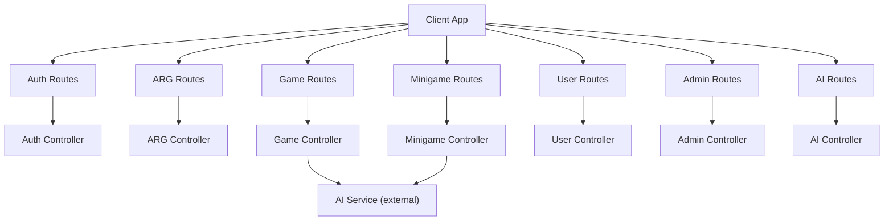
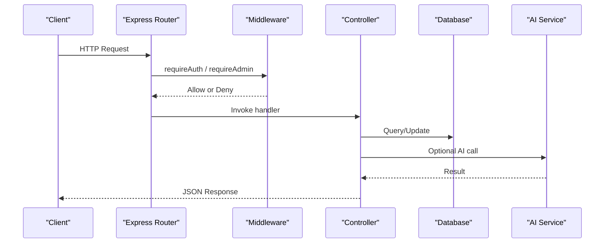
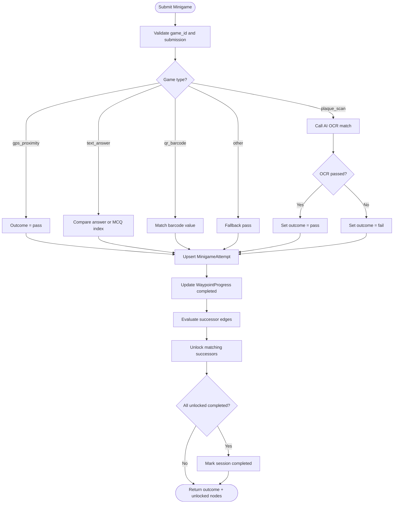
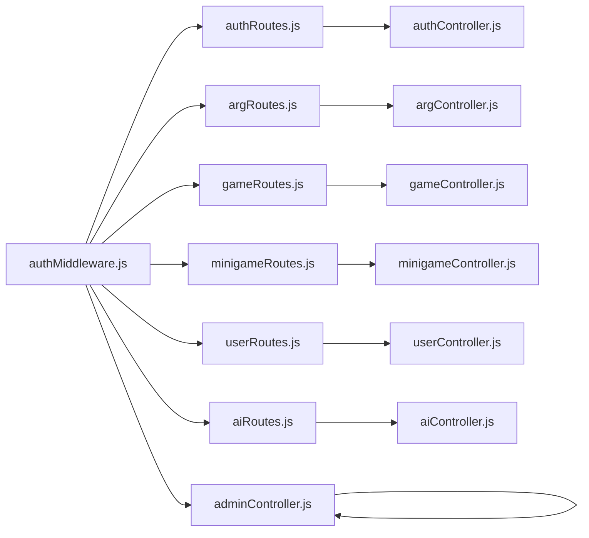

# API Reference

<cite>
**Referenced Files in This Document**
- [README.md](file://README.md)
- [authRoutes.js](file://server/src/routes/authRoutes.js)
- [argRoutes.js](file://server/src/routes/argRoutes.js)
- [gameRoutes.js](file://server/src/routes/gameRoutes.js)
- [minigameRoutes.js](file://server/src/routes/minigameRoutes.js)
- [userRoutes.js](file://server/src/routes/userRoutes.js)
- [adminRoutes.js](file://server/src/routes/adminRoutes.js)
- [aiRoutes.js](file://server/src/routes/aiRoutes.js)
- [authController.js](file://server/src/controllers/authController.js)
- [argController.js](file://server/src/controllers/argController.js)
- [gameController.js](file://server/src/controllers/gameController.js)
- [minigameController.js](file://server/src/controllers/minigameController.js)
- [userController.js](file://server/src/controllers/userController.js)
- [adminController.js](file://server/src/controllers/adminController.js)
- [aiController.js](file://server/src/controllers/aiController.js)
- [authMiddleware.js](file://server/src/middleware/authMiddleware.js)
</cite>

## Table of Contents
1. [Introduction](#introduction)
2. [Project Structure](#project-structure)
3. [Core Components](#core-components)
4. [Architecture Overview](#architecture-overview)
5. [Detailed Component Analysis](#detailed-component-analysis)
6. [Dependency Analysis](#dependency-analysis)
7. [Performance Considerations](#performance-considerations)
8. [Troubleshooting Guide](#troubleshooting-guide)
9. [Conclusion](#conclusion)
10. [Appendices](#appendices)

## Introduction
This document provides a comprehensive API reference for the WARG Platform, covering REST endpoints for authentication, argument (ARG) management, game operations, minigame handling, user management, admin functions, and AI engine integration. It also includes guidance on error handling, rate limiting considerations, and versioning notes based on the repository’s current implementation.

The platform is a location-based Alternate Reality Game system with server-side validation, anti-spoofing checks, branching gameplay logic, and optional computer vision evaluation via an external AI service.

**Section sources**
- [README.md:16-76](file://README.md#L16-L76)

## Project Structure
The backend exposes REST APIs through Express routers that delegate to controllers. Authentication uses Passport strategies (Google OAuth and local), session-based auth, and middleware guards for authorization. File uploads are handled by multer. The AI engine is accessed as an external microservice.

**Diagram sources**
- [authRoutes.js:1-124](file://server/src/routes/authRoutes.js#L1-L124)
- [argRoutes.js:1-32](file://server/src/routes/argRoutes.js#L1-L32)
- [gameRoutes.js:1-13](file://server/src/routes/gameRoutes.js#L1-L13)
- [minigameRoutes.js:1-19](file://server/src/routes/minigameRoutes.js#L1-L19)
- [userRoutes.js:1-15](file://server/src/routes/userRoutes.js#L1-L15)
- [adminRoutes.js:1-19](file://server/src/routes/adminRoutes.js#L1-L19)
- [aiRoutes.js:1-40](file://server/src/routes/aiRoutes.js#L1-L40)
- [authController.js:1-83](file://server/src/controllers/authController.js#L1-L83)
- [argController.js:1-452](file://server/src/controllers/argController.js#L1-L452)
- [gameController.js:1-368](file://server/src/controllers/gameController.js#L1-L368)
- [minigameController.js:1-126](file://server/src/controllers/minigameController.js#L1-L126)
- [userController.js:1-226](file://server/src/controllers/userController.js#L1-L226)
- [adminController.js:1-124](file://server/src/controllers/adminController.js#L1-L124)
- [aiController.js:1-163](file://server/src/controllers/aiController.js#L1-L163)

**Section sources**
- [authRoutes.js:1-124](file://server/src/routes/authRoutes.js#L1-L124)
- [argRoutes.js:1-32](file://server/src/routes/argRoutes.js#L1-L32)
- [gameRoutes.js:1-13](file://server/src/routes/gameRoutes.js#L1-L13)
- [minigameRoutes.js:1-19](file://server/src/routes/minigameRoutes.js#L1-L19)
- [userRoutes.js:1-15](file://server/src/routes/userRoutes.js#L1-L15)
- [adminRoutes.js:1-19](file://server/src/routes/adminRoutes.js#L1-L19)
- [aiRoutes.js:1-40](file://server/src/routes/aiRoutes.js#L1-L40)

## Core Components
- Authentication: Google OAuth redirect flow, local signup/login/logout, and profile retrieval.
- ARG Management: CRUD for ARGs, voting, flagging, cover image upload/retrieval.
- Game Operations: Start/resume sessions, get state, geofence arrival, minigame submission, abandon session.
- Minigame Handling: Upload reference images, retrieve them, submit attempts routed to AI services.
- User Management: Profile, library, friends, friend requests, search.
- Admin: Flags review/resolution, user ban toggle, delete games/comments.
- AI Engine: Proxy endpoints for shape, color, texture, SIFT, symmetry evaluations.

**Section sources**
- [authRoutes.js:1-124](file://server/src/routes/authRoutes.js#L1-L124)
- [argRoutes.js:1-32](file://server/src/routes/argRoutes.js#L1-L32)
- [gameRoutes.js:1-13](file://server/src/routes/gameRoutes.js#L1-L13)
- [minigameRoutes.js:1-19](file://server/src/routes/minigameRoutes.js#L1-L19)
- [userRoutes.js:1-15](file://server/src/routes/userRoutes.js#L1-L15)
- [adminRoutes.js:1-19](file://server/src/routes/adminRoutes.js#L1-L19)
- [aiRoutes.js:1-40](file://server/src/routes/aiRoutes.js#L1-L40)

## Architecture Overview
The API follows a layered architecture:
- Routes define HTTP endpoints and apply middleware (authentication, file upload).
- Controllers implement business logic, including database queries and calls to the AI service.
- Middleware enforces authentication and role-based access.

**Diagram sources**
- [authMiddleware.js:1-22](file://server/src/middleware/authMiddleware.js#L1-L22)
- [gameController.js:1-368](file://server/src/controllers/gameController.js#L1-L368)
- [minigameController.js:1-126](file://server/src/controllers/minigameController.js#L1-L126)
- [aiController.js:1-163](file://server/src/controllers/aiController.js#L1-L163)

## Detailed Component Analysis

### Authentication API
- Google OAuth
  - GET /api/auth/google
    - Redirects to Google consent; stores origin in session for return-to.
  - GET /api/auth/google/callback
    - Completes OAuth, logs in user, redirects to client page.
- Local Auth
  - POST /api/auth/signup
    - Creates user, hashes password, logs in immediately.
  - GET /api/auth/check-user
    - Validates uniqueness of email/username.
  - POST /api/auth/login
    - Authenticates local user, creates session, returns user_id.
  - GET /api/auth/logout
    - Destroys session, clears cookie.
  - GET /api/auth/me
    - Returns authenticated user profile and completed games count.

Authentication requirements:
- OAuth callback and login/logout/me use session-based auth.
- Signup and check-user do not require authentication.

Common response fields:
- Success responses include message and/or user object.
- Error responses include error string.

Error codes:
- 400: Validation errors (missing fields, duplicates).
- 401: Not authenticated or failed login.
- 500: Server errors during auth flows.

**Section sources**
- [authRoutes.js:6-55](file://server/src/routes/authRoutes.js#L6-L55)
- [authRoutes.js:57-121](file://server/src/routes/authRoutes.js#L57-L121)
- [authController.js:5-83](file://server/src/controllers/authController.js#L5-L83)

### ARG Management API
Endpoints:
- GET /api/args
  - Lists published ARGs with creator info and user vote if authenticated.
- GET /api/args/:id
  - Retrieves ARG details, waypoints, edges, minigames, and user vote.
- POST /api/args
  - Creates ARG with waypoints and edges; maps frontend types to internal game types.
- PUT /api/args/:id
  - Updates ARG metadata, waypoints, edges, and minigames.
- PATCH /api/args/:id/status
  - Updates ARG status (requires auth).
- POST /api/args/:id/vote
  - Toggle or update vote; updates like/dislike counts.
- POST /api/args/:id/flag
  - Submits a report flag for content moderation.
- POST /api/args/:id/cover-image
  - Uploads cover image (requires auth, image only, up to 5MB).
- GET /api/args/:id/cover-image
  - Retrieves stored cover image.

Authentication:
- Cover image upload requires authentication.
- Status update requires authentication.

Request/response schemas:
- Create/Update ARG body includes title, description, status, waypoints array, edges array.
- Waypoints include lat/lng, title, description, and optional games array.
- Edges include from/to waypoint IDs and optional triggers mapping game outcomes.
- Vote request includes user_id and vote value.
- Flag request includes reporter_id, reason, and optional description.

Error codes:
- 400: Missing required fields or invalid inputs.
- 403: Unauthorized when updating resources owned by others.
- 404: ARG not found.
- 500: Server errors.

**Section sources**
- [argRoutes.js:1-32](file://server/src/routes/argRoutes.js#L1-L32)
- [argController.js:3-54](file://server/src/controllers/argController.js#L3-L54)
- [argController.js:78-157](file://server/src/controllers/argController.js#L78-L157)
- [argController.js:159-326](file://server/src/controllers/argController.js#L159-L326)
- [argController.js:328-452](file://server/src/controllers/argController.js#L328-L452)

### Game Operations API
Endpoints:
- POST /api/games/:argId/start
  - Starts or resumes a game session; initializes progress for root waypoints.
- GET /api/games/:argId/state
  - Returns full game state: session, waypoints, progress, attempts, edges.
- POST /api/games/:argId/waypoint/:waypointId/arrive
  - Geofence arrival check; validates proximity using spatial query; requires auth and anti-spoofing.
- POST /api/games/:argId/waypoint/:waypointId/submit
  - Submits minigame answer; evaluates outcome; unlocks successor waypoints based on conditions.
- POST /api/games/:argId/abandon
  - Marks session as abandoned.

Authentication:
- Arrive endpoint requires authentication and anti-spoofing middleware.

Processing logic highlights:
- Branching logic evaluates edge conditions based on minigame attempt outcomes.
- Session completion is detected when no unlocked nodes remain and at least one node is completed.

Error codes:
- 400: Missing coordinates or invalid submissions.
- 404: Session or waypoint not found.
- 500: Server errors.
- 502: AI service unreachable during plaque scan evaluation.

**Section sources**
- [gameRoutes.js:1-13](file://server/src/routes/gameRoutes.js#L1-L13)
- [gameController.js:40-83](file://server/src/controllers/gameController.js#L40-L83)
- [gameController.js:85-161](file://server/src/controllers/gameController.js#L85-L161)
- [gameController.js:163-201](file://server/src/controllers/gameController.js#L163-L201)
- [gameController.js:203-350](file://server/src/controllers/gameController.js#L203-L350)
- [gameController.js:352-368](file://server/src/controllers/gameController.js#L352-L368)

#### Game Submission Flow

**Diagram sources**
- [gameController.js:203-350](file://server/src/controllers/gameController.js#L203-L350)

### Minigame Handling API
Endpoints:
- POST /api/minigames/:gameId/reference
  - Uploads reference image for minigame; stores base64 and mimetype in config.
- GET /api/minigames/:gameId/reference/image
  - Retrieves stored reference image.
- POST /api/minigames/:gameId/attempt
  - Submits player attempt image; routes to appropriate AI service based on game_type.

Authentication:
- All minigame endpoints require authentication.

Request/response schemas:
- Reference upload expects multipart/form-data with image field.
- Attempt submission expects multipart/form-data with image field; may include reference_image depending on game_type.

Error codes:
- 400: Missing files or unsupported game type.
- 404: Minigame not found or reference missing.
- 500: Server errors.

**Section sources**
- [minigameRoutes.js:1-19](file://server/src/routes/minigameRoutes.js#L1-L19)
- [minigameController.js:7-51](file://server/src/controllers/minigameController.js#L7-L51)
- [minigameController.js:53-126](file://server/src/controllers/minigameController.js#L53-L126)

### User Management API
Endpoints:
- GET /api/users/search/query?q=...
  - Searches users by username substring.
- GET /api/users/:id
  - Retrieves user profile with badges and completed games count.
- GET /api/users/:id/library
  - Lists ARGs created by user.
- GET /api/users/:id/friends
  - Lists accepted friends with active game context.
- DELETE /api/users/:id/friends/:friendId
  - Removes friend connection.
- GET /api/users/:id/friends/requests
  - Lists pending friend requests received by user.
- POST /api/users/:id/friends/request
  - Sends friend request.
- PUT /api/users/friends/requests/:requestId
  - Accepts or declines a friend request.

Authentication:
- Friend request operations typically require authentication (enforced by application-level guards elsewhere).

Error codes:
- 400: Invalid input (e.g., self-request, invalid status).
- 404: User or friend connection not found.
- 500: Server errors.

**Section sources**
- [userRoutes.js:1-15](file://server/src/routes/userRoutes.js#L1-L15)
- [userController.js:4-25](file://server/src/controllers/userController.js#L4-L25)
- [userController.js:27-37](file://server/src/controllers/userController.js#L27-L37)
- [userController.js:39-74](file://server/src/controllers/userController.js#L39-L74)
- [userController.js:76-95](file://server/src/controllers/userController.js#L76-L95)
- [userController.js:97-134](file://server/src/controllers/userController.js#L97-L134)
- [userController.js:136-175](file://server/src/controllers/userController.js#L136-L175)
- [userController.js:177-199](file://server/src/controllers/userController.js#L177-L199)
- [userController.js:201-226](file://server/src/controllers/userController.js#L201-L226)

### Admin API
Endpoints:
- GET /api/admin/flags
  - Lists open/reviewing flags with reporter and ARG details.
- PUT /api/admin/flags/:id/resolve
  - Resolves a flag, records resolver and timestamp.
- GET /api/admin/users?search=...
  - Searches users by username/email with trust score ordering.
- PUT /api/admin/users/:id/ban
  - Toggles user ban status (is_flagged).
- DELETE /api/admin/games/:id
  - Deletes an ARG.
- DELETE /api/admin/comments/:id
  - Deletes a comment.

Authentication:
- Admin endpoints require admin role.

Error codes:
- 404: Resource not found.
- 500: Server errors.

**Section sources**
- [adminRoutes.js:1-19](file://server/src/routes/adminRoutes.js#L1-L19)
- [adminController.js:4-43](file://server/src/controllers/adminController.js#L4-L43)
- [adminController.js:45-89](file://server/src/controllers/adminController.js#L45-L89)
- [adminController.js:91-124](file://server/src/controllers/adminController.js#L91-L124)

### AI Engine API
Proxy endpoints (require authentication):
- POST /api/ai/sam-extract
  - Fields: image, target_mask. Evaluates shape extraction.
- POST /api/ai/hsv-match
  - Fields: image, reference_image. Evaluates color matching.
- POST /api/ai/texture-match
  - Fields: image, reference_image. Evaluates texture matching.
- POST /api/ai/sift-match
  - Fields: image, archival_image. Evaluates SIFT matching.
- POST /api/ai/symmetry
  - Field: image. Evaluates symmetry detection.

Request/response schemas:
- All endpoints accept multipart/form-data with specified image fields.
- Responses mirror AI service outputs; typical fields include pass/fail and confidence metrics.

Error codes:
- 400: Missing required files.
- 500: Server errors or AI service failures.

**Section sources**
- [aiRoutes.js:1-40](file://server/src/routes/aiRoutes.js#L1-L40)
- [aiController.js:3-32](file://server/src/controllers/aiController.js#L3-L32)
- [aiController.js:34-63](file://server/src/controllers/aiController.js#L34-L63)
- [aiController.js:65-94](file://server/src/controllers/aiController.js#L65-L94)
- [aiController.js:96-125](file://server/src/controllers/aiController.js#L96-L125)
- [aiController.js:127-154](file://server/src/controllers/aiController.js#L127-L154)

### WebSocket API
There is no explicit WebSocket route or server setup in the provided source files. Real-time features such as live synchronization are mentioned conceptually in the project overview but are not implemented in the examined codebase.

[No sources needed since this section does not analyze specific files]

## Dependency Analysis
Key dependencies between components:
- Routes depend on controllers and middleware.
- Controllers depend on models and optionally the AI service.
- Authentication middleware protects sensitive endpoints.

**Diagram sources**
- [authRoutes.js:1-124](file://server/src/routes/authRoutes.js#L1-L124)
- [argRoutes.js:1-32](file://server/src/routes/argRoutes.js#L1-L32)
- [gameRoutes.js:1-13](file://server/src/routes/gameRoutes.js#L1-L13)
- [minigameRoutes.js:1-19](file://server/src/routes/minigameRoutes.js#L1-L19)
- [userRoutes.js:1-15](file://server/src/routes/userRoutes.js#L1-L15)
- [adminRoutes.js:1-19](file://server/src/routes/adminRoutes.js#L1-L19)
- [aiRoutes.js:1-40](file://server/src/routes/aiRoutes.js#L1-L40)
- [authMiddleware.js:1-22](file://server/src/middleware/authMiddleware.js#L1-L22)

**Section sources**
- [authRoutes.js:1-124](file://server/src/routes/authRoutes.js#L1-L124)
- [argRoutes.js:1-32](file://server/src/routes/argRoutes.js#L1-L32)
- [gameRoutes.js:1-13](file://server/src/routes/gameRoutes.js#L1-L13)
- [minigameRoutes.js:1-19](file://server/src/routes/minigameRoutes.js#L1-L19)
- [userRoutes.js:1-15](file://server/src/routes/userRoutes.js#L1-L15)
- [adminRoutes.js:1-19](file://server/src/routes/adminRoutes.js#L1-L19)
- [aiRoutes.js:1-40](file://server/src/routes/aiRoutes.js#L1-L40)
- [authMiddleware.js:1-22](file://server/src/middleware/authMiddleware.js#L1-L22)

## Performance Considerations
- Spatial queries: Use database spatial indexes on waypoints to optimize distance calculations.
- Image processing: Offload heavy AI computations to the external AI service; ensure proper timeouts and retries.
- File uploads: Enforce size limits and validate MIME types to prevent abuse.
- Transactions: Use database transactions for multi-step operations (e.g., ARG creation/update) to maintain consistency.
- Anti-spoofing: Apply heuristics and rate-limiting on location-sensitive endpoints to mitigate abuse.

[No sources needed since this section provides general guidance]

## Troubleshooting Guide
Common issues and resolutions:
- Authentication failures:
  - Ensure session cookies are enabled and CSRF protection is configured if used.
  - Verify Google OAuth credentials and CLIENT_URL settings.
- File upload errors:
  - Confirm multer configuration matches expected fields and size limits.
  - Validate MIME types and handle malformed payloads gracefully.
- AI service connectivity:
  - Check AI_SERVICE_URL and network reachability.
  - Implement retry logic with exponential backoff for transient failures.
- Database errors:
  - Inspect Sequelize queries and ensure correct model associations.
  - Monitor transaction rollbacks and log detailed error messages.

**Section sources**
- [authRoutes.js:35-55](file://server/src/routes/authRoutes.js#L35-L55)
- [argController.js:152-157](file://server/src/controllers/argController.js#L152-L157)
- [gameController.js:257-273](file://server/src/controllers/gameController.js#L257-L273)
- [minigameController.js:107-126](file://server/src/controllers/minigameController.js#L107-L126)

## Conclusion
The WARG Platform exposes a robust set of REST APIs for authentication, ARG management, game operations, minigame handling, user management, admin functions, and AI-driven evaluations. The architecture emphasizes secure session-based authentication, strict input validation, and modular controller design. While real-time features are conceptualized, they are not present in the current codebase. Integrators should focus on proper authentication, error handling, and rate limiting to ensure reliable operation.

[No sources needed since this section summarizes without analyzing specific files]

## Appendices

### API Versioning and Deprecation Policy
- Current API paths do not include explicit version segments; some AI proxy endpoints reference /api/v1 internally.
- No deprecation headers or policies are evident in the examined code.
- Recommendation: Introduce explicit versioning (e.g., /api/v1/...) and deprecation lifecycle (warnings, sunset dates) to support backward compatibility.

[No sources needed since this section provides general guidance]

### Practical Integration Patterns
- Authentication flow:
  - Initiate Google OAuth, handle callback, store session, then call protected endpoints.
  - For local auth, sign up, log in, and persist session cookie.
- ARG authoring:
  - Create ARG with waypoints and edges; map frontend game types to internal types.
  - Upload cover image and retrieve it for display.
- Gameplay loop:
  - Start session, fetch state, navigate waypoints, submit minigame answers, evaluate outcomes, unlock successors.
- Minigame evaluation:
  - Upload reference images, submit attempts, handle AI responses, and propagate results to game state.

[No sources needed since this section provides general guidance]