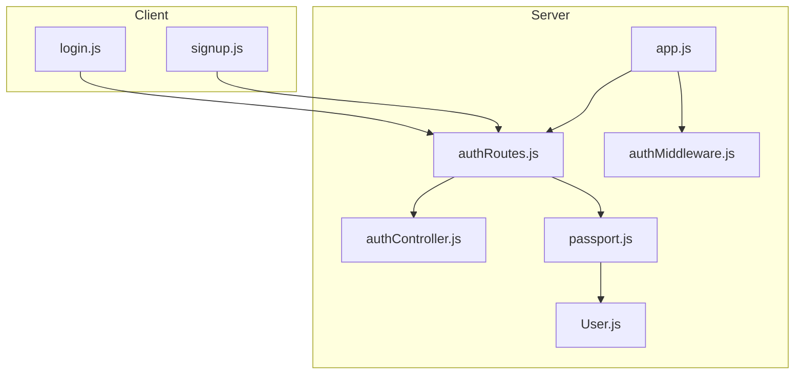
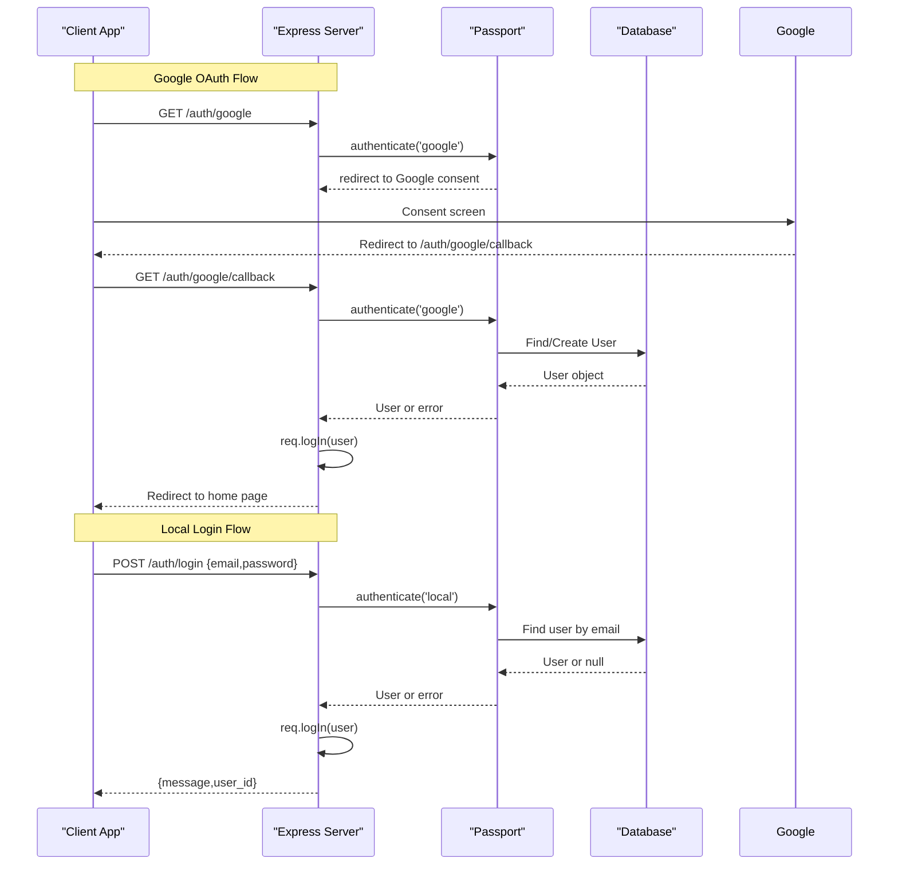
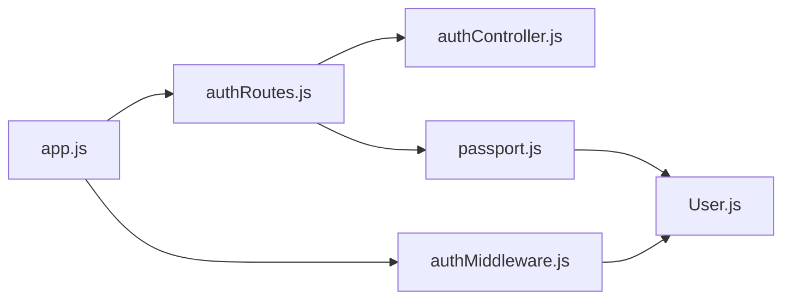

# Authentication API

<cite>
**Referenced Files in This Document**
- [authRoutes.js](file://server/src/routes/authRoutes.js)
- [authController.js](file://server/src/controllers/authController.js)
- [passport.js](file://server/src/config/passport.js)
- [authMiddleware.js](file://server/src/middleware/authMiddleware.js)
- [app.js](file://server/src/app.js)
- [User.js](file://server/src/models/User.js)
- [login.js](file://client/scripts/login.js)
- [signup.js](file://client/scripts/signup.js)
</cite>

## Table of Contents
1. [Introduction](#introduction)
2. [Project Structure](#project-structure)
3. [Core Components](#core-components)
4. [Architecture Overview](#architecture-overview)
5. [Detailed Component Analysis](#detailed-component-analysis)
6. [Dependency Analysis](#dependency-analysis)
7. [Performance Considerations](#performance-considerations)
8. [Troubleshooting Guide](#troubleshooting-guide)
9. [Conclusion](#conclusion)

## Introduction
This document provides comprehensive authentication API documentation for the WARG Platform. It covers:
- Google OAuth flow (/google, /google/callback)
- Local authentication (/login, /signup)
- Session management (/logout, /me)
- User validation (/check-user)
- Passport.js configuration and middleware integration
- Security considerations and practical client examples

The backend is built with Express, uses passport.js for authentication strategies (Google OAuth 2.0 and local email/password), and manages sessions via express-session with MySQL-backed persistence in production.

## Project Structure
Authentication-related code is organized as follows:
- Routes: server/src/routes/authRoutes.js
- Controllers: server/src/controllers/authController.js
- Strategies and session serialization: server/src/config/passport.js
- Auth middleware: server/src/middleware/authMiddleware.js
- App bootstrap and session setup: server/src/app.js
- User model: server/src/models/User.js
- Client-side flows: client/scripts/login.js, client/scripts/signup.js

**Diagram sources**
- [app.js:96-117](file://server/src/app.js#L96-L117)
- [authRoutes.js:1-124](file://server/src/routes/authRoutes.js#L1-L124)
- [authController.js:1-83](file://server/src/controllers/authController.js#L1-L83)
- [passport.js:1-99](file://server/src/config/passport.js#L1-L99)
- [authMiddleware.js:1-22](file://server/src/middleware/authMiddleware.js#L1-L22)
- [User.js:1-28](file://server/src/models/User.js#L1-L28)
- [login.js:1-44](file://client/scripts/login.js#L1-L44)
- [signup.js:1-145](file://client/scripts/signup.js#L1-L145)

**Section sources**
- [app.js:1-132](file://server/src/app.js#L1-L132)
- [authRoutes.js:1-124](file://server/src/routes/authRoutes.js#L1-L124)

## Core Components
- Google OAuth Strategy: Configured conditionally when environment variables are set; handles user lookup/creation and banned account checks.
- Local Strategy: Validates email/password using bcrypt; prevents login for accounts that use Google-only auth.
- Session Management: Uses express-session with MySQL store in production; serializes/deserializes users by ID.
- Auth Middleware: Provides requireAuth and requireAdmin guards.
- Auth Routes: Expose endpoints for Google OAuth, local signup/login, logout, profile retrieval, and user existence checks.

**Section sources**
- [passport.js:24-95](file://server/src/config/passport.js#L24-L95)
- [authMiddleware.js:1-22](file://server/src/middleware/authMiddleware.js#L1-L22)
- [authRoutes.js:6-121](file://server/src/routes/authRoutes.js#L6-L121)

## Architecture Overview
The authentication architecture integrates Express routes, passport strategies, and session handling to support both Google OAuth and local credentials.

**Diagram sources**
- [authRoutes.js:7-55](file://server/src/routes/authRoutes.js#L7-L55)
- [authRoutes.js:64-81](file://server/src/routes/authRoutes.js#L64-L81)
- [passport.js:24-95](file://server/src/config/passport.js#L24-L95)

## Detailed Component Analysis

### Endpoints Reference

#### Google OAuth
- Start OAuth
  - Method: GET
  - URL: /auth/google
  - Query Parameters: None
  - Request Body: None
  - Authentication: Not required
  - Response: Redirects to Google consent screen
  - Error Codes: N/A (redirect-based)
  - Notes: Stores requesting origin in session for post-login redirect

- Callback
  - Method: GET
  - URL: /auth/google/callback
  - Query Parameters: Google OAuth state/code
  - Request Body: None
  - Authentication: Not required
  - Response: Redirects to client application
  - Error Codes:
    - Redirects to client with query parameters indicating errors:
      - error=server_error (database/server error)
      - error=auth_failed (authentication failed)
      - error=session_error (session creation error)
  - Notes: Determines redirect URL from session or environment variables

**Section sources**
- [authRoutes.js:7-55](file://server/src/routes/authRoutes.js#L7-L55)

#### Local Authentication

- Signup
  - Method: POST
  - URL: /auth/signup
  - Headers: Content-Type: application/json
  - Request Body:
    - username: string (required)
    - email: string (required)
    - password: string (required)
  - Authentication: Not required
  - Response:
    - 201 Created: { message, user: { user_id, username, email, role } }
    - 400 Bad Request: { error }
    - 500 Internal Server Error: { error }
  - Notes: Automatically logs in the user after successful signup

- Check User Exists
  - Method: GET
  - URL: /auth/check-user
  - Query Parameters:
    - email: string (optional)
    - username: string (optional)
  - Authentication: Not required
  - Response:
    - 200 OK: { exists: boolean, field?: 'email' | 'username' }
    - 500 Internal Server Error: { error }
  - Notes: Used for frontend validation during signup

- Login
  - Method: POST
  - URL: /auth/login
  - Headers: Content-Type: application/json
  - Request Body:
    - email: string (required)
    - password: string (required)
  - Authentication: Not required
  - Response:
    - 200 OK: { message, user_id }
    - 401 Unauthorized: { error }
    - 500 Internal Server Error: { error }
  - Notes: Creates a session upon successful authentication

**Section sources**
- [authRoutes.js:57-81](file://server/src/routes/authRoutes.js#L57-L81)
- [authController.js:5-83](file://server/src/controllers/authController.js#L5-L83)

#### Session Management

- Logout
  - Method: GET
  - URL: /auth/logout
  - Headers: None
  - Request Body: None
  - Authentication: Required
  - Response:
    - 200 OK: { message }
    - 500 Internal Server Error: { error }
  - Notes: Destroys session and clears connect.sid cookie

- Get Current User
  - Method: GET
  - URL: /auth/me
  - Headers: None
  - Request Body: None
  - Authentication: Required
  - Response:
    - 200 OK: { user_id, username, email, role, games_completed, profile_picture }
    - 401 Unauthorized: { error }
    - 500 Internal Server Error: { error }
  - Notes: Includes count of completed game sessions for the authenticated user

**Section sources**
- [authRoutes.js:83-121](file://server/src/routes/authRoutes.js#L83-L121)

### Passport.js Configuration and Strategy Setup

- Serialization/Deserialization
  - Serializes user ID into session
  - Deserializes user by ID on each request, excluding sensitive fields like session_token

- Google OAuth Strategy
  - Conditionally registered when GOOGLE_CLIENT_ID and GOOGLE_CLIENT_SECRET are present
  - Handles existing user lookup and new user creation
  - Checks for banned accounts (is_flagged)

- Local Strategy
  - Uses email as username field and password field for authentication
  - Verifies password using bcrypt
  - Prevents login for Google-only accounts without password_hash

**Section sources**
- [passport.js:7-22](file://server/src/config/passport.js#L7-L22)
- [passport.js:24-64](file://server/src/config/passport.js#L24-L64)
- [passport.js:66-95](file://server/src/config/passport.js#L66-L95)

### Session Handling Mechanisms

- Session Storage
  - Production: MySQL-backed session store using express-mysql-session
  - Development/Test: In-memory session store
  - Cookie settings: httpOnly, secure (production), sameSite (none in production)

- Session Lifecycle
  - Sessions are created upon successful authentication
  - Sessions persist across requests until expiration or manual destruction
  - Logout destroys session and clears cookie

**Section sources**
- [app.js:50-84](file://server/src/app.js#L50-L84)
- [authRoutes.js:83-95](file://server/src/routes/authRoutes.js#L83-L95)

### Security Considerations

- Password Security
  - Passwords are hashed using bcrypt before storage
  - Local strategy verifies passwords securely

- Account Protection
  - Banned accounts (is_flagged) are rejected during authentication
  - Google-only accounts cannot log in via local strategy if no password_hash exists

- Session Security
  - Sessions use httpOnly cookies to prevent XSS access
  - Secure cookies in production
  - SameSite cookie policy configured appropriately

- CORS Configuration
  - Strict origin validation based on CLIENT_URL environment variable
  - Allows localhost development origins in non-production environments

**Section sources**
- [authController.js:29-31](file://server/src/controllers/authController.js#L29-L31)
- [passport.js:38-43](file://server/src/config/passport.js#L38-L43)
- [passport.js:76-83](file://server/src/config/passport.js#L76-L83)
- [app.js:29-44](file://server/src/app.js#L29-L44)

## Dependency Analysis

**Diagram sources**
- [authRoutes.js:1-124](file://server/src/routes/authRoutes.js#L1-L124)
- [authController.js:1-83](file://server/src/controllers/authController.js#L1-L83)
- [passport.js:1-99](file://server/src/config/passport.js#L1-L99)
- [User.js:1-28](file://server/src/models/User.js#L1-L28)
- [app.js:1-132](file://server/src/app.js#L1-L132)
- [authMiddleware.js:1-22](file://server/src/middleware/authMiddleware.js#L1-L22)

**Section sources**
- [authRoutes.js:1-124](file://server/src/routes/authRoutes.js#L1-L124)
- [app.js:1-132](file://server/src/app.js#L1-L132)

## Performance Considerations

- Database Queries
  - User lookups during authentication are optimized with indexed fields (email, google_uid)
  - Profile endpoint includes efficient counting of completed game sessions

- Session Storage
  - MySQL-backed sessions provide persistence across server restarts
  - Session expiration set to 24 hours to balance security and usability

- Authentication Flow Optimization
  - Google OAuth strategy caches user data efficiently
  - Local strategy avoids unnecessary database queries through proper indexing

[No sources needed since this section provides general guidance]

## Troubleshooting Guide

Common issues and their solutions:

- Google OAuth not working
  - Ensure GOOGLE_CLIENT_ID and GOOGLE_CLIENT_SECRET environment variables are set
  - Verify GOOGLE_CALLBACK_URL is correctly configured
  - Check network connectivity to Google OAuth services

- Local authentication failures
  - Verify email and password are correct
  - Check if account was created via Google (no password_hash)
  - Ensure bcrypt comparison is functioning properly

- Session issues
  - Verify SESSION_SECRET is set in production
  - Check MySQL connection for session persistence
  - Ensure cookies are enabled in client browsers

- CORS errors
  - Verify CLIENT_URL environment variable matches client domain
  - Check browser console for specific CORS error messages

**Section sources**
- [passport.js:27-64](file://server/src/config/passport.js#L27-L64)
- [passport.js:67-95](file://server/src/config/passport.js#L67-L95)
- [app.js:50-84](file://server/src/app.js#L50-L84)

## Conclusion

The WARG Platform authentication system provides robust support for both Google OAuth and local authentication methods. The implementation follows security best practices including password hashing, session management, and account protection mechanisms. The modular architecture allows for easy maintenance and extension of authentication features.

Key strengths include:
- Dual authentication method support (Google OAuth and local)
- Secure session management with persistent storage
- Comprehensive error handling and user feedback
- Flexible configuration through environment variables
- Well-structured code organization following separation of concerns

For client implementations, refer to the provided JavaScript examples in login.js and signup.js for practical usage patterns.

[No sources needed since this section summarizes without analyzing specific files]