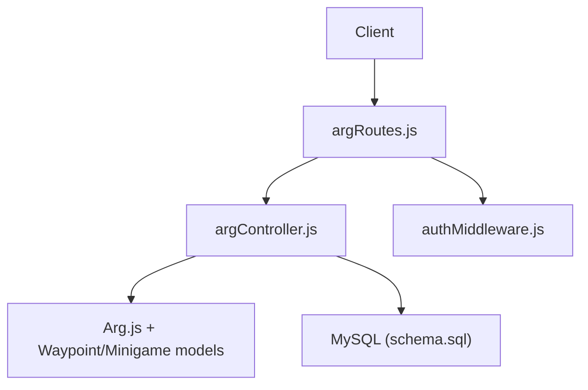
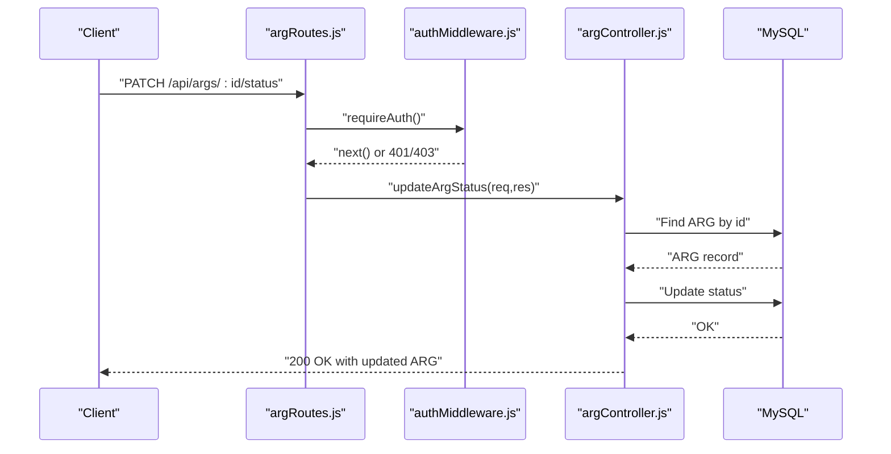
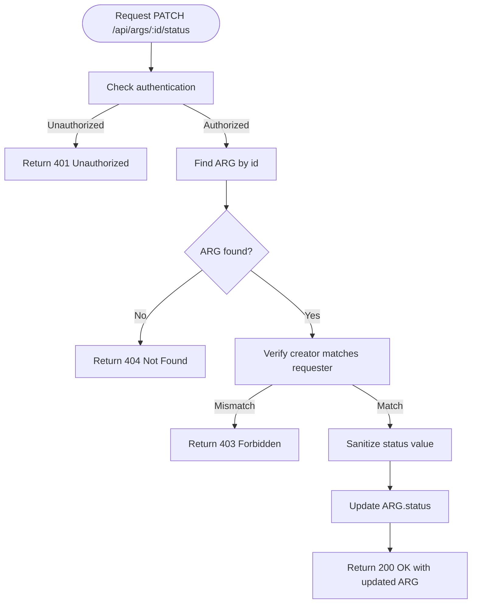
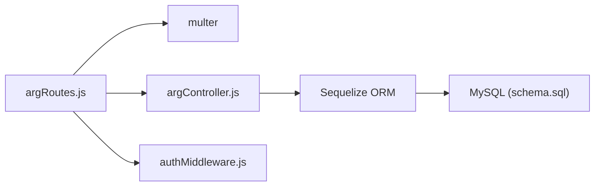

# ARG CRUD Operations

<cite>
**Referenced Files in This Document**
- [argRoutes.js](file://server/src/routes/argRoutes.js)
- [argController.js](file://server/src/controllers/argController.js)
- [Arg.js](file://server/src/models/Arg.js)
- [authMiddleware.js](file://server/src/middleware/authMiddleware.js)
- [schema.sql](file://database/schema.sql)
- [args.md](file://warg-docs/docs/6-api-reference/args.md)
- [args.test.js](file://server/tests/integration/args.test.js)
</cite>

## Table of Contents
1. [Introduction](#introduction)
2. [Project Structure](#project-structure)
3. [Core Components](#core-components)
4. [Architecture Overview](#architecture-overview)
5. [Detailed Component Analysis](#detailed-component-analysis)
6. [Dependency Analysis](#dependency-analysis)
7. [Performance Considerations](#performance-considerations)
8. [Troubleshooting Guide](#troubleshooting-guide)
9. [Conclusion](#conclusion)

## Introduction
This document specifies the Alternate Reality Game (ARG) CRUD operations exposed by the platform’s API. It covers:
- Listing and retrieving ARGs
- Creating new ARGs with waypoints, edges, and minigames
- Updating ARG metadata and structure
- Managing ARG lifecycle status
- Authentication requirements, validation rules, error handling, and example payloads

The implementation is built on Express routes, a controller layer, Sequelize models, and a MySQL schema that includes geospatial waypoints and directed edges for branching gameplay.

## Project Structure
The ARG endpoints are defined under `/api/args` and implemented via:
- Route definitions in `server/src/routes/argRoutes.js`
- Controller logic in `server/src/controllers/argController.js`
- Data model in `server/src/models/Arg.js`
- Database schema in `database/schema.sql`
- Authentication middleware in `server/src/middleware/authMiddleware.js`
- Public API documentation in `warg-docs/docs/6-api-reference/args.md`
- Integration tests in `server/tests/integration/args.test.js`



**Diagram sources**
- [argRoutes.js:1-31](file://server/src/routes/argRoutes.js#L1-L31)
- [argController.js:1-452](file://server/src/controllers/argController.js#L1-L452)
- [Arg.js:1-31](file://server/src/models/Arg.js#L1-L31)
- [authMiddleware.js:1-22](file://server/src/middleware/authMiddleware.js#L1-L22)
- [schema.sql:114-151](file://database/schema.sql#L114-L151)

**Section sources**
- [argRoutes.js:1-31](file://server/src/routes/argRoutes.js#L1-L31)
- [argController.js:1-452](file://server/src/controllers/argController.js#L1-L452)
- [Arg.js:1-31](file://server/src/models/Arg.js#L1-L31)
- [schema.sql:114-151](file://database/schema.sql#L114-L151)
- [authMiddleware.js:1-22](file://server/src/middleware/authMiddleware.js#L1-L22)
- [args.md:1-103](file://warg-docs/docs/6-api-reference/args.md#L1-L103)
- [args.test.js:1-40](file://server/tests/integration/args.test.js#L1-L40)

## Core Components
- **Routes**: Define HTTP methods and URL patterns for ARG resources.
- **Controller**: Implements business logic for listing, fetching, creating, updating, voting, flagging, status changes, and cover image management.
- **Model**: Defines the Arg entity fields and types.
- **Schema**: Provides the database tables for ARGs, waypoints, edges, minigames, votes, and flags.
- **Auth Middleware**: Enforces authentication and handles banned users.

Key responsibilities:
- GET /api/args: List published ARGs with creator info and user vote context.
- GET /api/args/:id: Retrieve full ARG details including waypoints, edges, minigames, and user vote context.
- POST /api/args: Create an ARG with optional waypoints, edges, and minigames.
- PUT /api/args/:id: Update ARG metadata and replace waypoints/edges/minigames.
- PATCH /api/args/:id/status: Change ARG lifecycle status (requires authentication).

**Section sources**
- [argRoutes.js:21-29](file://server/src/routes/argRoutes.js#L21-L29)
- [argController.js:3-54](file://server/src/controllers/argController.js#L3-L54)
- [argController.js:78-157](file://server/src/controllers/argController.js#L78-L157)
- [argController.js:159-326](file://server/src/controllers/argController.js#L159-L326)
- [argController.js:387-411](file://server/src/controllers/argController.js#L387-L411)
- [Arg.js:4-28](file://server/src/models/Arg.js#L4-L28)
- [schema.sql:114-151](file://database/schema.sql#L114-L151)

## Architecture Overview
The ARG API follows a standard MVC-like pattern:
- Express routes map URLs to controller handlers.
- Controllers orchestrate data access through Sequelize models.
- The database stores ARGs, waypoints, edges, minigames, votes, and flags.
- Authentication middleware protects write endpoints.



**Diagram sources**
- [argRoutes.js:25-25](file://server/src/routes/argRoutes.js#L25-L25)
- [authMiddleware.js:1-9](file://server/src/middleware/authMiddleware.js#L1-L9)
- [argController.js:387-411](file://server/src/controllers/argController.js#L387-L411)

## Detailed Component Analysis

### Endpoint: GET /api/args
- Purpose: List published ARGs for public consumption.
- Authentication: Not required.
- Query parameters: None enforced by route; documented docs mention pagination and filters but not implemented in current controller.
- Response: Array of ARG objects with creator info and user_vote context.
- Validation: Filters only ARGs with status 'published'.
- Error handling: Returns 500 with generic error message on failure.

Example response shape:
- Array of ARG objects including arg_id, title, mode, status, creator.username/avatar, and user_vote.

**Section sources**
- [argRoutes.js:21-21](file://server/src/routes/argRoutes.js#L21-L21)
- [argController.js:3-26](file://server/src/controllers/argController.js#L3-L26)
- [args.md:11-38](file://warg-docs/docs/6-api-reference/args.md#L11-L38)
- [args.test.js:17-29](file://server/tests/integration/args.test.js#L17-L29)

### Endpoint: GET /api/args/:id
- Purpose: Retrieve full ARG details including waypoints, edges, minigames, and user vote context.
- Authentication: Not required.
- Response: Single ARG object with nested waypoint graph and minigames.
- Validation: Returns 404 if ARG not found.
- Error handling: Returns 500 with generic error message on failure.

Response includes:
- ARG fields (title, description, mode, genre, status, etc.)
- Creator info
- Waypoints with location and minigames
- Edges
- User vote context

**Section sources**
- [argRoutes.js:22-22](file://server/src/routes/argRoutes.js#L22-L22)
- [argController.js:28-54](file://server/src/controllers/argController.js#L28-L54)
- [args.md:40-61](file://warg-docs/docs/6-api-reference/args.md#L40-L61)
- [args.test.js:32-40](file://server/tests/integration/args.test.js#L32-L40)

### Endpoint: POST /api/args
- Purpose: Create a new ARG with optional waypoints, edges, and minigames.
- Authentication: Not enforced by route; controller falls back to default creator when no user present.
- Request body:
  - title: string (defaults to "Untitled WARG")
  - description: string (defaults to "")
  - status: enum ('unpublished', 'published', 'retired') sanitized by server
  - waypoints: array of waypoint objects
    - Each waypoint may include:
      - id: client-side identifier
      - title, description
      - lat, lng: coordinates used to create spatial POINT
      - games: array of minigame objects
        - type: frontend game type mapped to backend game_type
        - minigame_config: JSON config per minigame
  - edges: array of edge objects
    - from, to: client-side waypoint ids
    - triggers: conditions mapping game outcomes to next steps
- Response: Created ARG plus mappings:
  - idMap: maps client waypoint ids to database waypoint ids
  - minigameMap: maps client waypoint ids to primary minigame ids
  - wpObjMap: internal mapping for game indices to db game ids
- Validation:
  - Status sanitized to allowed values
  - Frontend game types mapped to backend game types
  - Spatial locations created using SRID 4326
- Error handling: Transaction rollback on failure; returns 500 with detail.

Example request payload:
```json
{
  "title": "City Quest",
  "description": "Explore landmarks and solve puzzles.",
  "status": "unpublished",
  "waypoints": [
    {
      "id": "wp1",
      "title": "Start Point",
      "lat": 51.5074,
      "lng": -0.1278,
      "games": [
        {
          "type": "gps",
          "minigame_config": {"radius_m": 30}
        }
      ]
    }
  ],
  "edges": []
}
```

Notes:
- Legacy fallback supports sending wp.type instead of wp.games.
- Edge conditions reference game indices within the originating waypoint’s games array.

**Section sources**
- [argRoutes.js:23-23](file://server/src/routes/argRoutes.js#L23-L23)
- [argController.js:56-76](file://server/src/controllers/argController.js#L56-L76)
- [argController.js:78-157](file://server/src/controllers/argController.js#L78-L157)
- [schema.sql:160-203](file://database/schema.sql#L160-L203)
- [schema.sql:212-246](file://database/schema.sql#L212-L246)

### Endpoint: PUT /api/args/:id
- Purpose: Update ARG metadata and replace its waypoints, edges, and minigames.
- Authentication: Not enforced by route; controller checks creator_id against stored creator.
- Request body:
  - title, description, status: update ARG fields
  - waypoints: array of waypoint objects
    - Existing waypoints can be updated by providing waypoint_id
    - New waypoints can be added without waypoint_id
    - Games can be updated by providing minigame_id; otherwise new minigames are created
  - edges: array of edge objects replacing all existing edges
- Behavior:
  - Deletes missing waypoints and minigames relative to incoming data
  - Updates existing waypoints and merges minigame configs
  - Replaces all edges for the ARG
- Response: Updated ARG plus mappings similar to creation.
- Validation:
  - Status sanitized
  - Spatial locations created using SRID 4326
- Error handling: Transaction rollback on failure; returns 500 with generic error.

Authorization note:
- If the authenticated user does not match the ARG’s creator, returns 403.

**Section sources**
- [argRoutes.js:24-24](file://server/src/routes/argRoutes.js#L24-L24)
- [argController.js:159-326](file://server/src/controllers/argController.js#L159-L326)

### Endpoint: PATCH /api/args/:id/status
- Purpose: Change the ARG’s lifecycle status.
- Authentication: Required (enforced by requireAuth middleware).
- Request body:
  - status: enum ('unpublished', 'published', 'retired')
- Authorization:
  - Only the ARG’s creator can change status; otherwise returns 403.
- Response: Updated ARG object.
- Validation:
  - Status sanitized to allowed values.
- Error handling:
  - 404 if ARG not found
  - 403 if unauthorized
  - 500 on server errors



**Diagram sources**
- [argRoutes.js:25-25](file://server/src/routes/argRoutes.js#L25-L25)
- [authMiddleware.js:1-9](file://server/src/middleware/authMiddleware.js#L1-L9)
- [argController.js:387-411](file://server/src/controllers/argController.js#L387-L411)

**Section sources**
- [argRoutes.js:25-25](file://server/src/routes/argRoutes.js#L25-L25)
- [argController.js:387-411](file://server/src/controllers/argController.js#L387-L411)
- [authMiddleware.js:1-9](file://server/src/middleware/authMiddleware.js#L1-L9)

### Additional Endpoints
- POST /api/args/:id/vote: Submit like/dislike vote; updates counts.
- POST /api/args/:id/flag: Submit moderation flag with reason and description.
- POST /api/args/:id/cover-image: Upload cover image (image files only, up to 5MB).
- GET /api/args/:id/cover-image: Retrieve stored cover image.

These endpoints extend ARG management beyond basic CRUD and are useful for community interaction and content enrichment.

**Section sources**
- [argRoutes.js:26-29](file://server/src/routes/argRoutes.js#L26-L29)
- [argController.js:328-451](file://server/src/controllers/argController.js#L328-L451)

## Dependency Analysis
The ARG API depends on several components:
- Express router for URL-to-handler mapping
- Multer for image upload handling
- Sequelize ORM for database interactions
- MySQL schema defining ARGs, waypoints, edges, minigames, votes, and flags
- Authentication middleware for protecting sensitive operations



**Diagram sources**
- [argRoutes.js:1-31](file://server/src/routes/argRoutes.js#L1-L31)
- [argController.js:1-452](file://server/src/controllers/argController.js#L1-L452)
- [schema.sql:114-246](file://database/schema.sql#L114-L246)
- [authMiddleware.js:1-22](file://server/src/middleware/authMiddleware.js#L1-L22)

**Section sources**
- [argRoutes.js:1-31](file://server/src/routes/argRoutes.js#L1-L31)
- [argController.js:1-452](file://server/src/controllers/argController.js#L1-L452)
- [schema.sql:114-246](file://database/schema.sql#L114-L246)
- [authMiddleware.js:1-22](file://server/src/middleware/authMiddleware.js#L1-L22)

## Performance Considerations
- Use transactions for bulk writes (creation/update) to ensure consistency across ARG, waypoints, edges, and minigames.
- Avoid unnecessary joins; include only necessary relations (e.g., Creator, ArgVote).
- Leverage database indexes defined in schema (e.g., idx_arg_status, idx_wp_arg, idx_edge_arg).
- Limit file uploads to images and cap size at 5MB to prevent memory pressure.
- For large ARGs with many waypoints and edges, consider paginating or lazy-loading related data on the client.

[No sources needed since this section provides general guidance]

## Troubleshooting Guide
Common issues and resolutions:
- 401 Unauthorized: Missing or invalid session cookie for protected endpoints. Ensure login flow sets session properly.
- 403 Forbidden: Attempting to modify an ARG you do not own or accessing admin-only features. Verify creator_id matches requester.
- 404 Not Found: ARG or cover image does not exist. Validate IDs and existence before requests.
- 500 Server Error: Database or processing failures. Check logs and transaction rollbacks.
- Image upload errors: Non-image MIME types or exceeding size limits. Ensure multipart/form-data with single image field.

Error responses typically include an error message; some include additional detail for debugging.

**Section sources**
- [authMiddleware.js:1-9](file://server/src/middleware/authMiddleware.js#L1-L9)
- [argController.js:159-175](file://server/src/controllers/argController.js#L159-L175)
- [argController.js:387-411](file://server/src/controllers/argController.js#L387-L411)
- [argController.js:413-451](file://server/src/controllers/argController.js#L413-L451)

## Conclusion
The ARG CRUD API provides robust capabilities for managing Alternate Reality Games, including:
- Public listing and retrieval of published ARGs
- Creation and updating of ARGs with complex waypoint graphs and minigame configurations
- Lifecycle status management with authentication and authorization controls
- Community interactions via voting and flagging
- Media support through cover image upload and retrieval

Developers should adhere to the documented request/response schemas, validate inputs appropriately, and handle errors consistently. For advanced scenarios involving bulk operations or performance-sensitive workflows, leverage transactions and database indexes as outlined.

[No sources needed since this section summarizes without analyzing specific files]