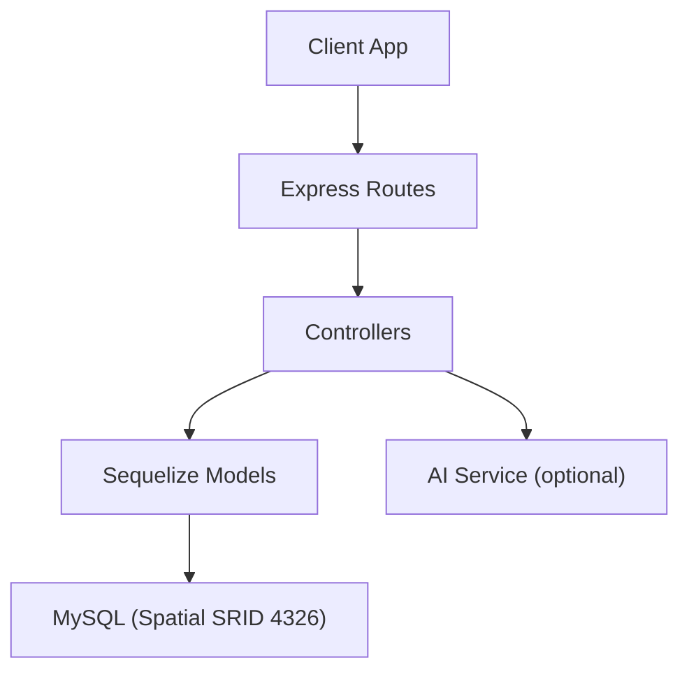
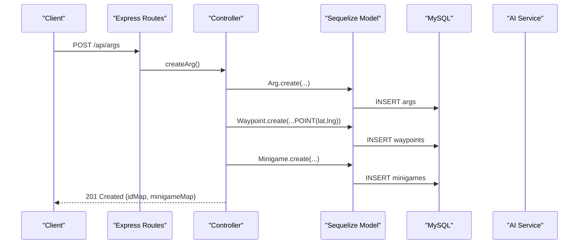
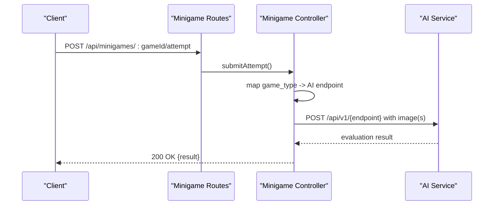
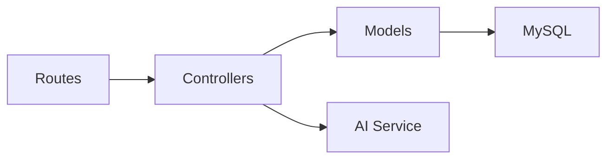

# Game Management API

<cite>
**Referenced Files in This Document**
- [README.md](file://README.md)
- [schema.sql](file://database/schema.sql)
- [argRoutes.js](file://server/src/routes/argRoutes.js)
- [argController.js](file://server/src/controllers/argController.js)
- [minigameRoutes.js](file://server/src/routes/minigameRoutes.js)
- [minigameController.js](file://server/src/controllers/minigameController.js)
- [sessionRoutes.js](file://server/src/routes/sessionRoutes.js)
- [sessionController.js](file://server/src/controllers/sessionController.js)
- [Arg.js](file://server/src/models/Arg.js)
- [Waypoint.js](file://server/src/models/Waypoint.js)
- [Minigame.js](file://server/src/models/Minigame.js)
- [GameSession.js](file://server/src/models/GameSession.js)
- [WaypointProgress.js](file://server/src/models/WaypointProgress.js)
- [MinigameAttempt.js](file://server/src/models/MinigameAttempt.js)
- [LocationEvent.js](file://server/src/models/LocationEvent.js)
- [args.md](file://warg-docs/docs/6-api-reference/args.md)
</cite>

## Table of Contents
1. [Introduction](#introduction)
2. [Project Structure](#project-structure)
3. [Core Components](#core-components)
4. [Architecture Overview](#architecture-overview)
5. [Detailed Component Analysis](#detailed-component-analysis)
6. [Dependency Analysis](#dependency-analysis)
7. [Performance Considerations](#performance-considerations)
8. [Troubleshooting Guide](#troubleshooting-guide)
9. [Conclusion](#conclusion)
10. [Appendices](#appendices)

## Introduction
This document provides a comprehensive Game Management API reference for the WARG Platform, focusing on ARG creation and lifecycle management, waypoint plotting with spatial data, minigame configuration and evaluation, and game session control. It specifies HTTP methods, URL patterns, request/response schemas, authentication requirements, and integration examples for real-time multiplayer and location-based validation.

The platform is a location-based Alternate Reality Game system that supports geospatial nodes (waypoints), branching narrative edges, and multiple minigame types including GPS proximity, QR/barcode scanning, AR object recognition, color/shape matching, and more. The backend uses Node.js + Express, MySQL with spatial extensions (SRID 4326 / WGS 84), Sequelize ORM, and optional AI services for advanced minigames.

**Section sources**
- [README.md:16-75](file://README.md#L16-L75)

## Project Structure
At a high level, the relevant server-side components are organized by routes, controllers, models, and database schema:

- Routes define HTTP endpoints and apply middleware such as authentication and file upload handling.
- Controllers implement business logic for ARG CRUD, voting, flagging, cover image management, minigame reference uploads, attempt submissions, and game sessions.
- Models define database entities and relationships using Sequelize.
- Database schema defines tables for users, args, waypoints, waypoint_edges, minigames, assets, game_sessions, waypoint_progress, minigame_attempts, location_events, trust_events, ratings, comments, flags, badges, leaderboards, analytics, push subscriptions, and audit logs.

**Diagram sources**
- [argRoutes.js:1-31](file://server/src/routes/argRoutes.js#L1-L31)
- [minigameRoutes.js:1-18](file://server/src/routes/minigameRoutes.js#L1-L18)
- [sessionRoutes.js:1-9](file://server/src/routes/sessionRoutes.js#L1-L9)
- [argController.js:1-452](file://server/src/controllers/argController.js#L1-L452)
- [minigameController.js:1-126](file://server/src/controllers/minigameController.js#L1-L126)
- [sessionController.js:1-40](file://server/src/controllers/sessionController.js#L1-L40)
- [schema.sql:114-246](file://database/schema.sql#L114-L246)

**Section sources**
- [argRoutes.js:1-31](file://server/src/routes/argRoutes.js#L1-L31)
- [minigameRoutes.js:1-18](file://server/src/routes/minigameRoutes.js#L1-L18)
- [sessionRoutes.js:1-9](file://server/src/routes/sessionRoutes.js#L1-L9)
- [schema.sql:114-246](file://database/schema.sql#L114-L246)

## Core Components
- ARG Management: List, retrieve, create, update, status changes, voting, flagging, cover image upload/retrieval.
- Waypoint Management: Geospatial POINT storage with SRID 4326, validation radius, sort order; edges define directed graph for branching narratives.
- Minigame Configuration: Enumerated game types with JSON config; reference image upload and retrieval; attempt submission routed to AI service when applicable.
- Game Session Control: Start session per user/ARG, list active sessions, remove recent session.
- Spatial Data Formats: POINT geometry with lat/lng conversion via ST_GeomFromText; accuracy, speed, heading fields for anti-spoofing.

Key data structures:
- Arg: core metadata, mode, genre, curation lifecycle, aggregate stats.
- Waypoint: geospatial node with validation radius and ordering.
- Minigame: type and flexible JSON configuration; points value.
- GameSession: per-user per-ARG attempt tracking with status and timestamps.
- WaypointProgress: per-waypoint progress state and scoring.
- MinigameAttempt: latest outcome, score, points awarded.
- LocationEvent: raw GPS breadcrumbs with anti-spoofing flags.

**Section sources**
- [Arg.js:1-31](file://server/src/models/Arg.js#L1-L31)
- [Waypoint.js:1-20](file://server/src/models/Waypoint.js#L1-L20)
- [Minigame.js:1-18](file://server/src/models/Minigame.js#L1-L18)
- [GameSession.js:1-19](file://server/src/models/GameSession.js#L1-L19)
- [WaypointProgress.js:1-18](file://server/src/models/WaypointProgress.js#L1-L18)
- [MinigameAttempt.js:1-18](file://server/src/models/MinigameAttempt.js#L1-L18)
- [LocationEvent.js:1-21](file://server/src/models/LocationEvent.js#L1-L21)

## Architecture Overview
The Game Management API exposes REST endpoints for ARG lifecycle, waypoint and minigame configuration, and session control. Authentication is enforced where required (e.g., status updates, cover image upload, minigame operations). Spatial data is stored using MySQL POINT geometry with SRID 4326 (WGS 84). Advanced minigames may call an external AI service for evaluation.

**Diagram sources**
- [argRoutes.js:21-28](file://server/src/routes/argRoutes.js#L21-L28)
- [argController.js:78-157](file://server/src/controllers/argController.js#L78-L157)
- [schema.sql:160-203](file://database/schema.sql#L160-L203)

**Section sources**
- [argRoutes.js:1-31](file://server/src/routes/argRoutes.js#L1-L31)
- [argController.js:78-157](file://server/src/controllers/argController.js#L78-L157)
- [schema.sql:160-203](file://database/schema.sql#L160-L203)

## Detailed Component Analysis

### ARG Endpoints
- GET /api/args
  - Purpose: Retrieve published ARGs with creator info and optional user vote context.
  - Auth: None (public).
  - Response: Array of ARG objects with embedded creator and user_vote field.
- GET /api/args/:id
  - Purpose: Retrieve full ARG details including waypoints, edges, minigames, and user vote context.
  - Auth: Optional (depends on ARG privacy).
  - Response: ARG object with nested waypoints and minigames.
- POST /api/args
  - Purpose: Create ARG with title, description, status, waypoints, and edges.
  - Auth: Required for authenticated creators; controller falls back to body-provided creator_id if not authenticated.
  - Request Body:
    - title: string
    - description: string
    - status: enum (unpublished|published|retired)
    - waypoints: array of { id, title, description, lat, lng, games? }
    - edges: array of { from, to, triggers? }
  - Response: 201 Created with created ARG and mapping objects (idMap, minigameMap, wpObjMap).
- PUT /api/args/:id
  - Purpose: Update ARG metadata and replace waypoints/edges atomically within a transaction.
  - Auth: Creator authorization enforced.
  - Request Body: Same structure as create, with optional waypoint_id for existing waypoints.
  - Response: Updated ARG with mapping objects.
- PATCH /api/args/:id/status
  - Purpose: Change ARG status (requires auth).
  - Auth: Required.
  - Request Body: { status }.
  - Response: Updated ARG.
- POST /api/args/:id/vote
  - Purpose: Toggle or set like/dislike vote for an ARG.
  - Auth: Not enforced by route; controller expects user_id in body.
  - Request Body: { vote, user_id }.
  - Response: { success, action, like_count, dislike_count }.
- POST /api/args/:id/flag
  - Purpose: Submit moderation flag for an ARG.
  - Auth: Not enforced by route; controller expects reporter_id in body.
  - Request Body: { reporter_id, reason, description }.
  - Response: Flag object.
- POST /api/args/:id/cover-image
  - Purpose: Upload cover image (image only, memory storage, max 5MB).
  - Auth: Required.
  - Request: multipart/form-data with field 'image'.
  - Response: { message }.
- GET /api/args/:id/cover-image
  - Purpose: Retrieve stored cover image as JPEG.
  - Auth: None.
  - Response: Image bytes with Content-Type image/jpeg.

Authentication notes:
- Some routes explicitly require authentication via middleware (status update, cover image upload).
- Other routes accept anonymous requests but validate ownership at the controller level (updateArg, updateArgStatus, uploadCoverImage).

Spatial data format:
- Waypoints use lat/lng converted to POINT(lat lng) with SRID 4326 during creation/update.

Error handling:
- Validation errors return 400 with descriptive messages.
- Authorization failures return 403.
- Not found returns 404.
- Server errors return 500 with generic error messages.

**Section sources**
- [argRoutes.js:21-29](file://server/src/routes/argRoutes.js#L21-L29)
- [argController.js:3-54](file://server/src/controllers/argController.js#L3-L54)
- [argController.js:78-157](file://server/src/controllers/argController.js#L78-L157)
- [argController.js:159-326](file://server/src/controllers/argController.js#L159-L326)
- [argController.js:328-411](file://server/src/controllers/argController.js#L328-L411)
- [argController.js:413-451](file://server/src/controllers/argController.js#L413-L451)
- [schema.sql:114-151](file://database/schema.sql#L114-L151)

### Waypoint and Edge Management
- Waypoints represent geospatial nodes within an ARG with:
  - title, description
  - location: POINT(SRID 4326)
  - validation_radius_m: default 30 meters
  - sort_order: default 0
- Edges define directed connections between waypoints with optional conditions_json based on minigame outcomes.

Data flow:
- During ARG creation/update, waypoints are inserted with location constructed from lat/lng.
- Edges are created linking from_waypoint_id to to_waypoint_id with conditions derived from triggers referencing game_ids.

Complexity considerations:
- Transactional writes ensure atomicity across Arg, Waypoint, Minigame, and WaypointEdge inserts/updates.
- Deleting missing waypoints and minigames maintains referential integrity.

**Section sources**
- [Waypoint.js:1-20](file://server/src/models/Waypoint.js#L1-L20)
- [schema.sql:160-203](file://database/schema.sql#L160-L203)
- [argController.js:94-148](file://server/src/controllers/argController.js#L94-L148)
- [argController.js:196-317](file://server/src/controllers/argController.js#L196-L317)

### Minigame Configuration and Evaluation
Supported game types include gps_proximity, text_answer, qr_barcode, ar_object_scan, colour_match, shape_match, photo_submit, texture_match, sift_match, symmetry_finder, word_scramble, plaque_scan.

Endpoints:
- POST /api/minigames/:gameId/reference
  - Purpose: Upload reference image for minigame configuration.
  - Auth: Required.
  - Request: multipart/form-data with field 'image'.
  - Response: { message, url }.
- GET /api/minigames/:gameId/reference/image
  - Purpose: Retrieve stored reference image.
  - Auth: None.
  - Response: Image bytes with appropriate Content-Type.
- POST /api/minigames/:gameId/attempt
  - Purpose: Submit attempt image for AI evaluation.
  - Auth: Required.
  - Request: multipart/form-data with field 'image'.
  - Response: Evaluation result from AI service.

Evaluation flow:
- Controller maps game_type to AI endpoint and constructs FormData with attempt image and optional reference image.
- Calls AI service and forwards response to client.

Configuration:
- Reference image stored as base64 in config_json along with mimetype.
- Attempt submission requires reference image for certain game types.

**Section sources**
- [minigameRoutes.js:11-16](file://server/src/routes/minigameRoutes.js#L11-L16)
- [minigameController.js:7-51](file://server/src/controllers/minigameController.js#L7-L51)
- [minigameController.js:53-125](file://server/src/controllers/minigameController.js#L53-L125)
- [Minigame.js:1-18](file://server/src/models/Minigame.js#L1-L18)

**Diagram sources**
- [minigameRoutes.js:16-16](file://server/src/routes/minigameRoutes.js#L16-L16)
- [minigameController.js:63-119](file://server/src/controllers/minigameController.js#L63-L119)

### Game Session Control
Endpoints:
- POST /api/sessions/start
  - Purpose: Start a new game session for a user and ARG.
  - Auth: Not enforced by route; controller expects user_id and arg_id in body.
  - Request Body: { user_id, arg_id }.
  - Response: 201 Created with GameSession object.
- GET /api/sessions/:user_id
  - Purpose: Retrieve active sessions for a user, including ARG metadata.
  - Auth: Not enforced by route.
  - Response: Array of GameSession objects with included Arg details.
- DELETE /api/sessions/:user_id/arg/:arg_id
  - Purpose: Remove a recent active session.
  - Auth: Not enforced by route.
  - Response: { message }.

Session model:
- Primary key: composite (user_id, arg_id).
- Status: active|completed|abandoned.
- Timestamps: started_at, completed_at, last_active_at.
- Metrics: total_points_earned, distance_m.

**Section sources**
- [sessionRoutes.js:5-7](file://server/src/routes/sessionRoutes.js#L5-L7)
- [sessionController.js:3-39](file://server/src/controllers/sessionController.js#L3-L39)
- [GameSession.js:1-19](file://server/src/models/GameSession.js#L1-L19)
- [schema.sql:287-304](file://database/schema.sql#L287-L304)

### Progress Tracking and Attempts
- WaypointProgress tracks per-waypoint state (locked/unlocked/completed/skipped), timestamps, attempts, and points earned.
- MinigameAttempt records latest outcome (pass/fail/timeout), submission payload, normalized score, points awarded, and timestamp.

Integration example:
- After successful minigame evaluation, client should update MinigameAttempt and WaypointProgress accordingly.
- GameSession metrics (total_points_earned, distance_m) can be updated incrementally as players complete waypoints.

**Section sources**
- [WaypointProgress.js:1-18](file://server/src/models/WaypointProgress.js#L1-L18)
- [MinigameAttempt.js:1-18](file://server/src/models/MinigameAttempt.js#L1-L18)
- [schema.sql:307-345](file://database/schema.sql#L307-L345)

### Spatial Data Formats and Proximity Validation
- Waypoints store location as POINT(SRID 4326).
- Creation/update converts lat/lng to POINT(lat lng) using ST_GeomFromText.
- validation_radius_m defaults to 30 meters and can be used for proximity checks.
- LocationEvent stores raw GPS breadcrumbs with accuracy_m, speed_ms, heading, recorded_at, and anti-spoofing flags.

Proximity validation API:
- While no explicit endpoint is exposed for proximity checks, the controller constructs spatial POINT values and the schema includes spatial indexes for efficient queries.
- Clients should send lat/lng for waypoint plotting; server validates and stores spatial data.

Anti-spoofing:
- LocationEvent includes is_suspicious and flags_json for behavioral analysis.
- Trust events and user trust_score are tracked in schema for advanced tiers.

**Section sources**
- [argController.js:94-100](file://server/src/controllers/argController.js#L94-L100)
- [Waypoint.js:4-11](file://server/src/models/Waypoint.js#L4-L11)
- [LocationEvent.js:4-13](file://server/src/models/LocationEvent.js#L4-L13)
- [schema.sql:160-179](file://database/schema.sql#L160-L179)
- [schema.sql:354-372](file://database/schema.sql#L354-L372)

## Dependency Analysis
Component coupling and cohesion:
- Routes are thin and delegate to controllers.
- Controllers orchestrate model operations and external services (AI).
- Models encapsulate database schema definitions and relationships.
- Database schema enforces referential integrity and spatial indexing.

Potential circular dependencies:
- No circular imports observed among routes, controllers, and models.

External dependencies:
- AI service integration for advanced minigames.
- Multer for file uploads.
- Passport for authentication (middleware referenced but not detailed here).

**Diagram sources**
- [argRoutes.js:1-31](file://server/src/routes/argRoutes.js#L1-L31)
- [minigameRoutes.js:1-18](file://server/src/routes/minigameRoutes.js#L1-L18)
- [sessionRoutes.js:1-9](file://server/src/routes/sessionRoutes.js#L1-L9)
- [argController.js:1-452](file://server/src/controllers/argController.js#L1-L452)
- [minigameController.js:1-126](file://server/src/controllers/minigameController.js#L1-L126)
- [sessionController.js:1-40](file://server/src/controllers/sessionController.js#L1-L40)

**Section sources**
- [argRoutes.js:1-31](file://server/src/routes/argRoutes.js#L1-L31)
- [minigameRoutes.js:1-18](file://server/src/routes/minigameRoutes.js#L1-L18)
- [sessionRoutes.js:1-9](file://server/src/routes/sessionRoutes.js#L1-L9)

## Performance Considerations
- Use transactions for bulk ARG creation/update to ensure consistency.
- Leverage spatial indexes on POINT columns for efficient proximity queries.
- Limit uploaded file sizes to 5MB to prevent excessive memory usage.
- Consider partitioning high-volume tables like location_events by time in production.
- Cache frequently accessed ARG listings and cover images where appropriate.

[No sources needed since this section provides general guidance]

## Troubleshooting Guide
Common issues and resolutions:
- File upload errors: Ensure content-type is multipart/form-data and field name matches expected ('image').
- Authorization failures: Verify authentication middleware is applied and user context is present.
- Spatial data errors: Confirm lat/lng values are valid numbers and within acceptable ranges for WGS 84.
- AI service timeouts: Check AI_SERVICE_URL configuration and network connectivity; handle non-OK responses gracefully.
- Session conflicts: Ensure unique user_id/arg_id combinations when starting sessions.

**Section sources**
- [argController.js:152-156](file://server/src/controllers/argController.js#L152-L156)
- [minigameController.js:107-119](file://server/src/controllers/minigameController.js#L107-L119)
- [sessionController.js:3-11](file://server/src/controllers/sessionController.js#L3-L11)

## Conclusion
The Game Management API provides robust endpoints for ARG lifecycle management, waypoint plotting with spatial data, minigame configuration and evaluation, and game session control. It supports both basic and advanced gameplay features through enumerated game types and optional AI integration. Proper authentication, transactional writes, and spatial indexing ensure secure and performant operations.

[No sources needed since this section summarizes without analyzing specific files]

## Appendices

### API Reference Summary
- ARG endpoints: list, get, create, update, status, vote, flag, cover image upload/get.
- Minigame endpoints: reference upload/get, attempt submission.
- Session endpoints: start, list active, remove recent.

For additional documentation, see:
- [args.md](file://warg-docs/docs/6-api-reference/args.md)

**Section sources**
- [args.md:1-103](file://warg-docs/docs/6-api-reference/args.md#L1-L103)