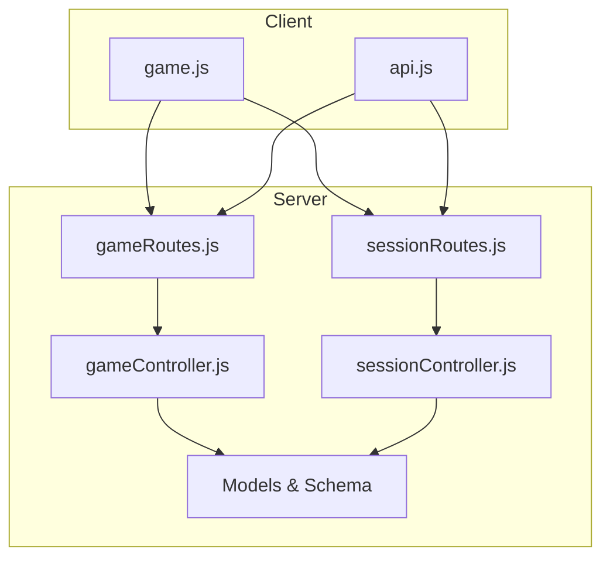
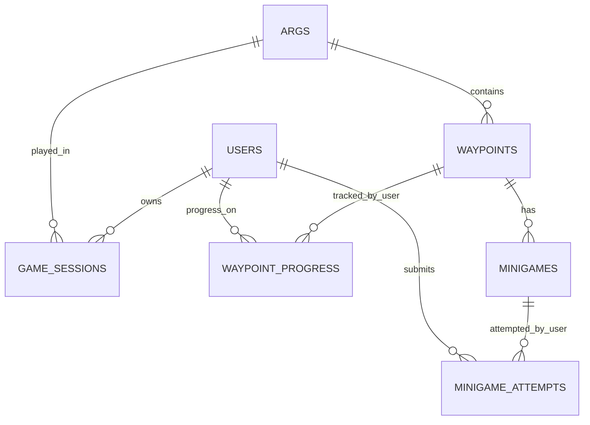
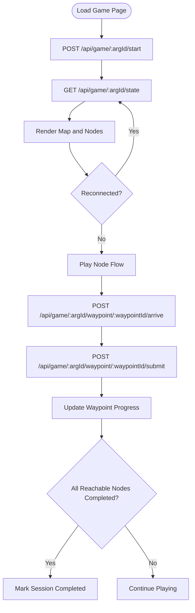
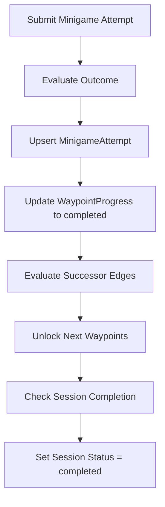
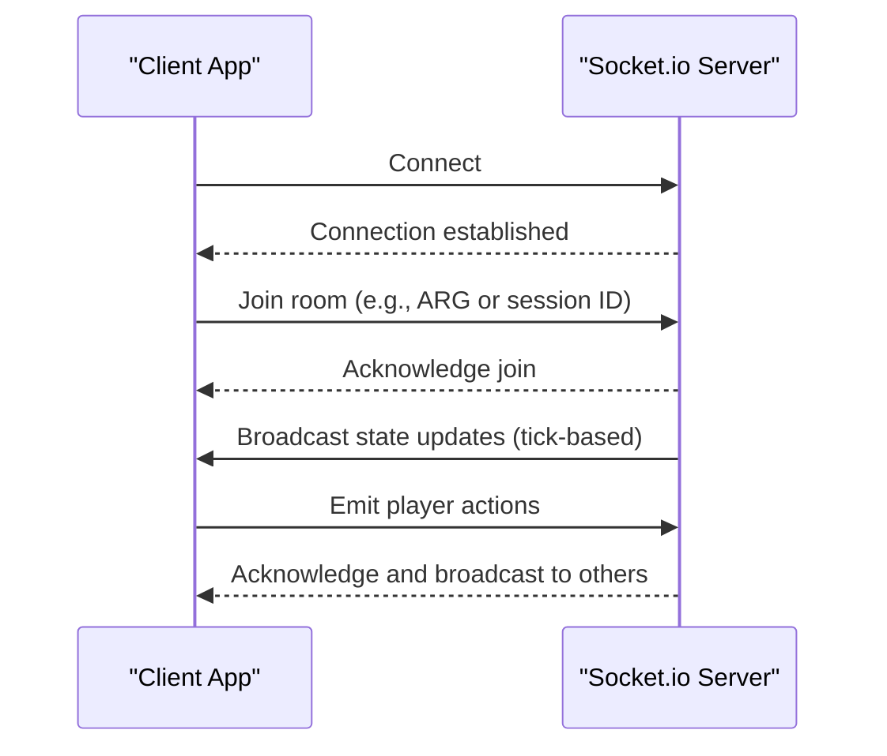
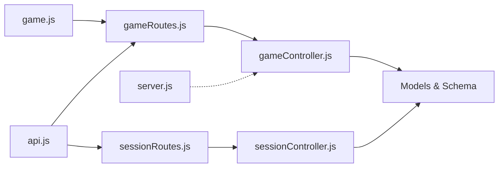

# Game Session Control

<cite>
**Referenced Files in This Document**
- [sessionController.js](file://server/src/controllers/sessionController.js)
- [sessionRoutes.js](file://server/src/routes/sessionRoutes.js)
- [gameController.js](file://server/src/controllers/gameController.js)
- [gameRoutes.js](file://server/src/routes/gameRoutes.js)
- [GameSession.js](file://server/src/models/GameSession.js)
- [MinigameAttempt.js](file://server/src/models/MinigameAttempt.js)
- [schema.sql](file://database/schema.sql)
- [game.js](file://client/scripts/game.js)
- [api.js](file://client/scripts/api.js)
- [server.js](file://server/server.js)
</cite>

## Table of Contents
1. [Introduction](#introduction)
2. [Project Structure](#project-structure)
3. [Core Components](#core-components)
4. [Architecture Overview](#architecture-overview)
5. [Detailed Component Analysis](#detailed-component-analysis)
6. [Dependency Analysis](#dependency-analysis)
7. [Performance Considerations](#performance-considerations)
8. [Troubleshooting Guide](#troubleshooting-guide)
9. [Conclusion](#conclusion)

## Introduction
This document explains how game sessions are created, progressed, and completed in the WARG Platform. It covers:
- HTTP endpoints for starting, resuming, abandoning, and querying game sessions
- Real-time state synchronization via REST responses and WebSocket infrastructure
- Multiplayer coordination hooks through Socket.io
- Progress tracking across waypoints, minigames, and attempts
- Offline resilience, checkpoint-like persistence, and session recovery
- The relationship between game sessions, minigame attempts, and user progress

The documentation is designed to be accessible to both developers and non-technical readers while providing precise API contracts and implementation details.

## Project Structure
The session control system spans server routes, controllers, models, database schema, and client scripts:
- Server routes define URL patterns for session operations
- Controllers implement business logic for session lifecycle and gameplay actions
- Models and schema define persistent structures for sessions, waypoint progress, and minigame attempts
- Client scripts orchestrate session initialization, progress updates, and offline sync



**Diagram sources**
- [gameRoutes.js:1-13](file://server/src/routes/gameRoutes.js#L1-L13)
- [sessionRoutes.js:1-10](file://server/src/routes/sessionRoutes.js#L1-L10)
- [gameController.js:1-368](file://server/src/controllers/gameController.js#L1-L368)
- [sessionController.js:1-40](file://server/src/controllers/sessionController.js#L1-L40)

**Section sources**
- [gameRoutes.js:1-13](file://server/src/routes/gameRoutes.js#L1-L13)
- [sessionRoutes.js:1-10](file://server/src/routes/sessionRoutes.js#L1-L10)
- [gameController.js:1-368](file://server/src/controllers/gameController.js#L1-L368)
- [sessionController.js:1-40](file://server/src/controllers/sessionController.js#L1-L40)

## Core Components
- Game session lifecycle: start/resume, abandon, complete (implicitly), query
- Waypoint arrival validation with geofencing
- Minigame submission and outcome evaluation
- Progress tracking per waypoint and per minigame attempt
- WebSocket infrastructure for real-time features

Key responsibilities:
- Start or resume a session and initialize waypoint progress
- Provide full game state including session, waypoints, progress, attempts, and edges
- Validate player arrival at waypoints using spatial queries
- Evaluate minigame submissions and update progress and session completion
- Abandon active sessions
- Expose WebSocket connection handling for live/co-op modes

**Section sources**
- [gameController.js:40-83](file://server/src/controllers/gameController.js#L40-L83)
- [gameController.js:85-161](file://server/src/controllers/gameController.js#L85-L161)
- [gameController.js:163-201](file://server/src/controllers/gameController.js#L163-L201)
- [gameController.js:203-350](file://server/src/controllers/gameController.js#L203-L350)
- [gameController.js:352-367](file://server/src/controllers/gameController.js#L352-L367)
- [server.js:14-45](file://server/server.js#L14-L45)

## Architecture Overview
The session control architecture combines REST APIs for state transitions and WebSocket infrastructure for real-time communication.

```mermaid
sequenceDiagram
participant Client as "Client App"
participant Routes as "Express Routes"
participant Controller as "GameController"
participant DB as "Database"
participant WS as "Socket.io Server"
Client->>Routes : POST /api/game/ : argId/start
Routes->>Controller : startGameSession()
Controller->>DB : Create/Resume Session + Init Progress
DB-->>Controller : Session + Progress
Controller-->>Client : { session }
Client->>Routes : GET /api/game/ : argId/state
Routes->>Controller : getGameState()
Controller->>DB : Load Waypoints, Progress, Attempts, Edges
DB-->>Controller : Full State
Controller-->>Client : { session, waypoints, progress, attempts, edges }
Client->>Routes : POST /api/game/ : argId/waypoint/ : waypointId/arrive
Routes->>Controller : arriveAtWaypoint()
Controller->>DB : Log LocationEvent + Spatial Query
DB-->>Controller : Distance + Radius
Controller-->>Client : { within_radius, distance, radius }
Client->>Routes : POST /api/game/ : argId/waypoint/ : waypointId/submit
Routes->>Controller : submitMinigame()
Controller->>DB : Upsert MinigameAttempt + Update Progress
Controller->>DB : Evaluate Branching Conditions
DB-->>Controller : Updated State
Controller-->>Client : { outcome, unlockedNodes, session_completed }
Note over WS : Socket.io initialized for live/co-op modes<br/>Connection events logged; room/channel logic can be added here
```

**Diagram sources**
- [gameRoutes.js:6-10](file://server/src/routes/gameRoutes.js#L6-L10)
- [gameController.js:40-83](file://server/src/controllers/gameController.js#L40-L83)
- [gameController.js:85-161](file://server/src/controllers/gameController.js#L85-L161)
- [gameController.js:163-201](file://server/src/controllers/gameController.js#L163-L201)
- [gameController.js:203-350](file://server/src/controllers/gameController.js#L203-L350)
- [server.js:14-45](file://server/server.js#L14-L45)

## Detailed Component Analysis

### HTTP Endpoints for Session Operations
- Start or resume a game session
  - Method: POST
  - URL: /api/game/{argId}/start
  - Auth: Requires authenticated user (user_id from request context)
  - Request body: None required (argId from path)
  - Response: Session object
  - Behavior: Creates new session if none exists; resumes abandoned sessions by setting status to active; initializes waypoint progress for roots

- Get full game state
  - Method: GET
  - URL: /api/game/{argId}/state
  - Auth: Optional (uses req.user if available; fallback to query param)
  - Response: { session, waypoints, progress, attempts, edges }
  - Behavior: Ensures root nodes are unlocked if no progress exists; marks session completed when all reachable nodes are completed

- Arrive at a waypoint (geofence check)
  - Method: POST
  - URL: /api/game/{argId}/waypoint/{waypointId}/arrive
  - Auth: Required (requireAuth middleware)
  - Anti-spoofing: Enabled (antiSpoofing middleware)
  - Request body: { lat, lng, accuracy_m, ...sensorData }
  - Response: { within_radius, distance, radius }
  - Behavior: Logs location event and computes distance using spatial functions

- Submit a minigame
  - Method: POST
  - URL: /api/game/{argId}/waypoint/{waypointId}/submit
  - Auth: Not explicitly enforced in route (controller uses req.user.user_id)
  - Request body: { game_id, submission }
  - Response: { outcome, unlockedNodes, session_completed }
  - Behavior: Evaluates game type, upserts MinigameAttempt, updates waypoint progress, evaluates branching conditions, marks session completed if applicable

- Abandon a session
  - Method: POST
  - URL: /api/game/{argId}/abandon
  - Auth: Requires authenticated user
  - Response: { success: true }
  - Behavior: Sets session status to abandoned

Additional session management endpoints (recent sessions):
- Start recent session
  - Method: POST
  - URL: /api/sessions/start
  - Request body: { user_id, arg_id }
  - Response: Session object
- Get active sessions for a user
  - Method: GET
  - URL: /api/sessions/{user_id}
  - Response: Array of sessions with Arg metadata
- Remove recent session
  - Method: DELETE
  - URL: /api/sessions/{user_id}/arg/{arg_id}
  - Response: { message: 'Session removed from recent' }

**Section sources**
- [gameRoutes.js:6-10](file://server/src/routes/gameRoutes.js#L6-L10)
- [sessionRoutes.js:5-7](file://server/src/routes/sessionRoutes.js#L5-L7)
- [gameController.js:40-83](file://server/src/controllers/gameController.js#L40-L83)
- [gameController.js:85-161](file://server/src/controllers/gameController.js#L85-L161)
- [gameController.js:163-201](file://server/src/controllers/gameController.js#L163-L201)
- [gameController.js:203-350](file://server/src/controllers/gameController.js#L203-L350)
- [gameController.js:352-367](file://server/src/controllers/gameController.js#L352-L367)
- [sessionController.js:3-12](file://server/src/controllers/sessionController.js#L3-L12)
- [sessionController.js:14-26](file://server/src/controllers/sessionController.js#L14-L26)
- [sessionController.js:28-39](file://server/src/controllers/sessionController.js#L28-L39)

### Data Models and Relationships
The core data model includes:
- Game sessions: one row per user per ARG attempt with status, timestamps, points, and distance
- Waypoint progress: per-waypoint status and timestamps
- Minigame attempts: latest attempt per user per minigame with outcome and score



**Diagram sources**
- [schema.sql:287-345](file://database/schema.sql#L287-L345)

**Section sources**
- [GameSession.js:4-16](file://server/src/models/GameSession.js#L4-L16)
- [MinigameAttempt.js:4-15](file://server/src/models/MinigameAttempt.js#L4-L15)
- [schema.sql:287-345](file://database/schema.sql#L287-L345)

### Session Initialization and Recovery
Initialization flow:
- Client calls start endpoint to create or resume session
- Server creates session and initializes waypoint progress for root nodes
- Client retrieves full game state to render map and nodes
- If session was abandoned, it is resumed by updating status to active

Recovery behavior:
- On reconnect, client re-fetches game state to reconcile UI
- Service worker and BroadcastChannel support offline sync for minigame attempts
- Completed sessions trigger overlay display



**Diagram sources**
- [game.js:143-164](file://client/scripts/game.js#L143-L164)
- [game.js:124-129](file://client/scripts/game.js#L124-L129)
- [gameController.js:40-83](file://server/src/controllers/gameController.js#L40-L83)
- [gameController.js:85-161](file://server/src/controllers/gameController.js#L85-L161)

**Section sources**
- [game.js:143-164](file://client/scripts/game.js#L143-L164)
- [game.js:124-129](file://client/scripts/game.js#L124-L129)
- [gameController.js:40-83](file://server/src/controllers/gameController.js#L40-L83)
- [gameController.js:85-161](file://server/src/controllers/gameController.js#L85-L161)

### Progress Tracking and Checkpoint Saving
Progress tracking:
- Waypoint progress records status (locked/unlocked/completed/skipped) and timestamps
- Minigame attempts record outcome, score, and points awarded
- Session aggregates total points earned and distance walked

Checkpoint saving:
- Each minigame submission upserts the latest attempt
- Waypoint progress is updated on each successful submission
- Session completion is determined by evaluating unlocked vs completed nodes



**Diagram sources**
- [gameController.js:203-350](file://server/src/controllers/gameController.js#L203-L350)

**Section sources**
- [gameController.js:203-350](file://server/src/controllers/gameController.js#L203-L350)
- [schema.sql:307-345](file://database/schema.sql#L307-L345)

### WebSocket Integration and Multiplayer Coordination
WebSocket infrastructure:
- Socket.io server initialized with CORS configuration
- Connection and disconnect events logged
- Room/channel logic can be extended for live/co-op modes

Real-time features:
- Live-play games and puzzles can broadcast state updates to players in geofenced locations
- Clients can subscribe to rooms per ARG or per session for synchronized gameplay



**Diagram sources**
- [server.js:14-45](file://server/server.js#L14-L45)

**Section sources**
- [server.js:14-45](file://server/server.js#L14-L45)

### Session Timeout Handling and Concurrent Player Management
Timeout handling:
- Sessions track last_active_at timestamp
- No explicit timeout cleanup is implemented in the provided code
- Abandoned sessions can be resumed by updating status to active

Concurrent player management:
- Session model uses composite primary key (user_id, arg_id) ensuring one session per user per ARG
- Waypoint progress and minigame attempts are scoped per user
- WebSocket rooms/channels can be used to coordinate multiple players in co-op modes

**Section sources**
- [GameSession.js:4-16](file://server/src/models/GameSession.js#L4-L16)
- [schema.sql:287-304](file://database/schema.sql#L287-L304)
- [server.js:14-45](file://server/server.js#L14-L45)

## Dependency Analysis
The session control system has clear dependencies:
- Routes depend on controllers for business logic
- Controllers depend on models and database schema
- Client scripts depend on routes for session operations
- WebSocket server is independent but can be extended for multiplayer features



**Diagram sources**
- [gameRoutes.js:1-13](file://server/src/routes/gameRoutes.js#L1-L13)
- [sessionRoutes.js:1-10](file://server/src/routes/sessionRoutes.js#L1-L10)
- [gameController.js:1-368](file://server/src/controllers/gameController.js#L1-L368)
- [sessionController.js:1-40](file://server/src/controllers/sessionController.js#L1-L40)
- [game.js:1-800](file://client/scripts/game.js#L1-L800)
- [api.js:1-401](file://client/scripts/api.js#L1-L401)
- [server.js:1-72](file://server/server.js#L1-L72)

**Section sources**
- [gameRoutes.js:1-13](file://server/src/routes/gameRoutes.js#L1-L13)
- [sessionRoutes.js:1-10](file://server/src/routes/sessionRoutes.js#L1-L10)
- [gameController.js:1-368](file://server/src/controllers/gameController.js#L1-L368)
- [sessionController.js:1-40](file://server/src/controllers/sessionController.js#L1-L40)
- [game.js:1-800](file://client/scripts/game.js#L1-L800)
- [api.js:1-401](file://client/scripts/api.js#L1-L401)
- [server.js:1-72](file://server/server.js#L1-L72)

## Performance Considerations
- Use transactions for atomic updates during session start and minigame submission
- Spatial queries for geofencing should leverage indexed POINT columns
- Avoid excessive polling; prefer WebSocket broadcasts for real-time updates
- Cache frequently accessed data (waypoints, minigames) on the client side
- Monitor high-volume tables like location_events for performance bottlenecks

[No sources needed since this section provides general guidance]

## Troubleshooting Guide
Common issues and resolutions:
- Session not found: Ensure user is authenticated and session exists for the ARG
- Geofence validation failures: Verify coordinates and accuracy values; check sensor data integrity
- Minigame submission errors: Validate game_type and config_json; ensure AI service is reachable for OCR tasks
- WebSocket connection issues: Confirm CORS settings and allowed origins; check browser console for connection errors

**Section sources**
- [gameController.js:85-161](file://server/src/controllers/gameController.js#L85-L161)
- [gameController.js:163-201](file://server/src/controllers/gameController.js#L163-L201)
- [gameController.js:203-350](file://server/src/controllers/gameController.js#L203-L350)
- [server.js:14-45](file://server/server.js#L14-L45)

## Conclusion
The WARG Platform’s game session control system provides a robust foundation for managing player progression, validating gameplay actions, and supporting real-time collaboration. By combining RESTful APIs for state transitions with WebSocket infrastructure for live features, the platform enables seamless session initialization, progress tracking, and multiplayer coordination. Developers can extend the existing architecture to add advanced features such as session timeouts, leaderboards, and enhanced anti-spoofing mechanisms.

[No sources needed since this section summarizes without analyzing specific files]