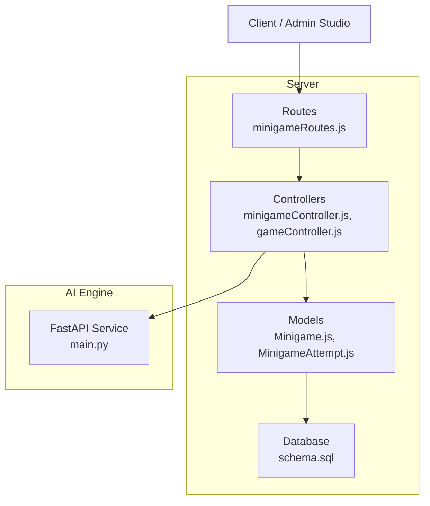
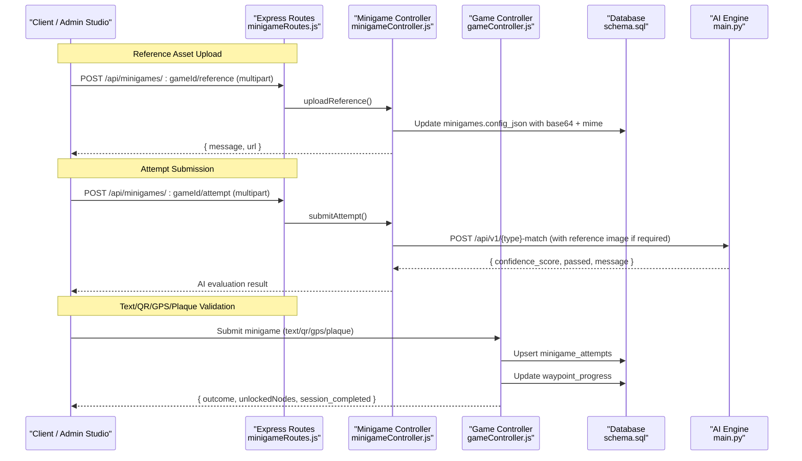
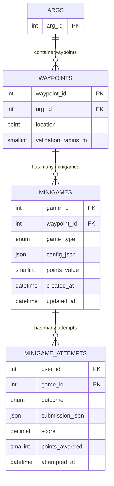
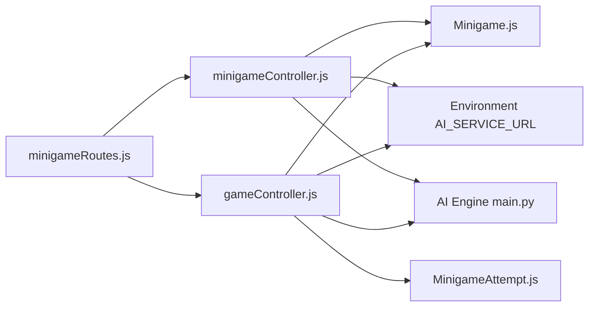

# Minigame Configuration

<cite>
**Referenced Files in This Document**
- [Minigame.js](file://server/src/models/Minigame.js)
- [MinigameAttempt.js](file://server/src/models/MinigameAttempt.js)
- [minigameController.js](file://server/src/controllers/minigameController.js)
- [minigameRoutes.js](file://server/src/routes/minigameRoutes.js)
- [gameController.js](file://server/src/controllers/gameController.js)
- [argController.js](file://server/src/controllers/argController.js)
- [schema.sql](file://database/schema.sql)
- [main.py](file://ai-engine/main.py)
</cite>

## Table of Contents
1. [Introduction](#introduction)
2. [Project Structure](#project-structure)
3. [Core Components](#core-components)
4. [Architecture Overview](#architecture-overview)
5. [Detailed Component Analysis](#detailed-component-analysis)
6. [Dependency Analysis](#dependency-analysis)
7. [Performance Considerations](#performance-considerations)
8. [Troubleshooting Guide](#troubleshooting-guide)
9. [Conclusion](#conclusion)

## Introduction
This document explains how minigames are configured, assigned to waypoints within ARGs, and executed through the platform’s backend and AI engine services. It covers:
- Supported puzzle types and their configuration parameters
- HTTP endpoints for uploading reference assets and submitting attempts
- Validation logic and scoring algorithms
- Integration with the AI engine for image-based challenges
- The end-to-end lifecycle from creation to result processing

## Project Structure
The minigame system spans server models, controllers, routes, database schema, and an external AI service:
- Server models define persistent entities for minigames and attempts
- Controllers implement validation, file handling, and AI integration
- Routes expose authenticated endpoints for reference uploads and attempt submissions
- Database schema defines tables for minigames, attempts, and related progress tracking
- AI engine provides vision-based evaluation endpoints used by the server

**Diagram sources**
- [minigameRoutes.js:1-19](file://server/src/routes/minigameRoutes.js#L1-L19)
- [minigameController.js:1-126](file://server/src/controllers/minigameController.js#L1-L126)
- [gameController.js:200-368](file://server/src/controllers/gameController.js#L200-L368)
- [Minigame.js:1-18](file://server/src/models/Minigame.js#L1-L18)
- [MinigameAttempt.js:1-18](file://server/src/models/MinigameAttempt.js#L1-L18)
- [schema.sql:212-246](file://database/schema.sql#L212-L246)
- [schema.sql:327-345](file://database/schema.sql#L327-L345)
- [main.py:1-157](file://ai-engine/main.py#L1-L157)

**Section sources**
- [minigameRoutes.js:1-19](file://server/src/routes/minigameRoutes.js#L1-L19)
- [minigameController.js:1-126](file://server/src/controllers/minigameController.js#L1-L126)
- [gameController.js:200-368](file://server/src/controllers/gameController.js#L200-L368)
- [Minigame.js:1-18](file://server/src/models/Minigame.js#L1-L18)
- [MinigameAttempt.js:1-18](file://server/src/models/MinigameAttempt.js#L1-L18)
- [schema.sql:212-246](file://database/schema.sql#L212-L246)
- [schema.sql:327-345](file://database/schema.sql#L327-L345)
- [main.py:1-157](file://ai-engine/main.py#L1-L157)

## Core Components
- Minigame model: Defines puzzle type enumeration, per-type JSON configuration, points value, and timestamps.
- MinigameAttempt model: Records latest outcome, normalized score, raw submission, points awarded, and timestamp.
- Minigame controller: Handles reference image upload/retrieval and AI-backed attempt evaluation for advanced puzzle types.
- Game controller: Implements validation and scoring for text-based, QR/barcode, GPS proximity, and plaque scan puzzles; updates progress and unlocks successor nodes.
- Routes: Expose authenticated endpoints for reference management and attempt submission.
- Schema: Defines minigames and minigame_attempts tables, including constraints and indexes.
- AI engine: FastAPI service providing vision endpoints for shape, color, texture, SIFT, symmetry, and OCR matching.

**Section sources**
- [Minigame.js:1-18](file://server/src/models/Minigame.js#L1-L18)
- [MinigameAttempt.js:1-18](file://server/src/models/MinigameAttempt.js#L1-L18)
- [minigameController.js:1-126](file://server/src/controllers/minigameController.js#L1-L126)
- [gameController.js:200-368](file://server/src/controllers/gameController.js#L200-L368)
- [minigameRoutes.js:1-19](file://server/src/routes/minigameRoutes.js#L1-L19)
- [schema.sql:212-246](file://database/schema.sql#L212-L246)
- [schema.sql:327-345](file://database/schema.sql#L327-L345)
- [main.py:1-157](file://ai-engine/main.py#L1-L157)

## Architecture Overview
The minigame workflow integrates client interactions, server-side validation, and AI-powered evaluations:

**Diagram sources**
- [minigameRoutes.js:14-16](file://server/src/routes/minigameRoutes.js#L14-L16)
- [minigameController.js:7-51](file://server/src/controllers/minigameController.js#L7-L51)
- [minigameController.js:53-125](file://server/src/controllers/minigameController.js#L53-L125)
- [gameController.js:204-349](file://server/src/controllers/gameController.js#L204-L349)
- [schema.sql:212-246](file://database/schema.sql#L212-L246)
- [schema.sql:327-345](file://database/schema.sql#L327-L345)
- [main.py:77-157](file://ai-engine/main.py#L77-L157)

## Detailed Component Analysis

### Puzzle Types and Configuration Parameters
Supported puzzle types include:
- gps_proximity: Validate player location within a radius; may include hold duration and tick scoring via config.
- text_answer: Free-text or multiple-choice answers; supports case sensitivity and correct index.
- qr_barcode: Validates scanned barcode/QR against expected value.
- ar_object_scan: Placeholder for AR object recognition.
- colour_match: HSV histogram similarity against a reference image.
- shape_match: Jaccard index between extracted mask and target mask.
- photo_submit: General photo upload challenge.
- texture_match: Feature vector cosine similarity against a reference image.
- sift_match: SIFT feature matching against archival imagery.
- symmetry_finder: Symmetry detection without reference image.
- word_scramble: Word puzzle variant.
- plaque_scan: OCR-based plaque identification using reference image.

Configuration is stored in a JSON field on the minigame entity. Examples include:
- text_answer: answer, hint, case_sensitive, is_mcq, correct_index
- colour_match: target_hsv, tolerance
- qr_barcode: barcode_value
- shape_match: shape_svg, jaccard_threshold
- plaque_scan: reference_image_base64, reference_image_mimetype

These configurations drive validation and scoring logic in both server-side controllers and AI endpoints.

**Section sources**
- [Minigame.js:4-10](file://server/src/models/Minigame.js#L4-L10)
- [schema.sql:212-246](file://database/schema.sql#L212-L246)
- [gameController.js:222-277](file://server/src/controllers/gameController.js#L222-L277)

### Endpoints for Minigame Operations

#### Reference Image Management
- POST /api/minigames/:gameId/reference
  - Authentication: Required
  - Content-Type: multipart/form-data
  - Fields: image (binary)
  - Behavior: Stores base64-encoded reference image and MIME type into minigame.config_json; returns URL and success message.
  - Response: { message, url }
- GET /api/minigames/:gameId/reference/image
  - Authentication: Required
  - Behavior: Retrieves stored reference image buffer and serves it with appropriate MIME type.
  - Response: Binary image data

#### Attempt Submission (AI-backed)
- POST /api/minigames/:gameId/attempt
  - Authentication: Required
  - Content-Type: multipart/form-data
  - Fields: image (player attempt), optional reference image depending on puzzle type
  - Behavior: Determines AI endpoint based on game_type; attaches reference image when required; forwards request to AI engine; returns AI evaluation result.
  - Response: AI evaluation payload (confidence_score, passed, message)

Note: For non-AI puzzle types (text_answer, qr_barcode, gps_proximity, plaque_scan), validation occurs in the game controller rather than this endpoint.

**Section sources**
- [minigameRoutes.js:14-16](file://server/src/routes/minigameRoutes.js#L14-L16)
- [minigameController.js:7-51](file://server/src/controllers/minigameController.js#L7-L51)
- [minigameController.js:53-125](file://server/src/controllers/minigameController.js#L53-L125)

### Validation Logic and Scoring Algorithms

#### Server-Side Validation
- gps_proximity: Outcome set to pass if arrival was already validated before submission.
- text_answer: Supports free-text exact match (case-insensitive unless configured) and multiple-choice index comparison.
- qr_barcode: Exact string match against expected barcode value.
- plaque_scan: Requires reference image; decodes base64 submission, calls AI OCR endpoint, maps AI passed flag to outcome.

#### AI-Based Evaluation
- shape_match: Uses SAM extraction and compares masks; threshold determines pass/fail.
- colour_match: Compares HSV histograms; similarity score threshold determines pass/fail.
- texture_match: Computes cosine similarity between embeddings; threshold determines pass/fail.
- sift_match: Evaluates archival SIFT matches; passes based on computed metric.
- symmetry_finder: Detects symmetry; returns similarity score and pass flag.

Scoring normalization:
- MinigameAttempt.score stores normalized values (e.g., 1.0 for pass, 0.0 for fail).
- Points awarded can be derived from minigame.points_value and difficulty settings in config.

Progression:
- After submission, waypoint_progress is updated to completed.
- Successor nodes are evaluated based on edge conditions; unlocked nodes are returned to the client.
- Session completion is determined by checking whether all relevant waypoints are completed.

**Section sources**
- [gameController.js:222-349](file://server/src/controllers/gameController.js#L222-L349)
- [minigameController.js:67-125](file://server/src/controllers/minigameController.js#L67-L125)
- [main.py:77-157](file://ai-engine/main.py#L77-L157)
- [schema.sql:327-345](file://database/schema.sql#L327-L345)

### Minigame Creation and Assignment to Waypoints
Minigames are created during ARG authoring:
- When saving an ARG, the controller iterates over waypoints and creates corresponding minigames based on frontend-provided type and configuration.
- Legacy fallback allows assigning a single minigame per waypoint using wp.type.
- Multiple minigames per waypoint are supported via wp.games array mapping.

This process ensures that each waypoint has associated minigames with proper configuration and points values.

**Section sources**
- [argController.js:240-273](file://server/src/controllers/argController.js#L240-L273)

### Data Models and Relationships

**Diagram sources**
- [schema.sql:212-246](file://database/schema.sql#L212-L246)
- [schema.sql:327-345](file://database/schema.sql#L327-L345)
- [schema.sql:160-179](file://database/schema.sql#L160-L179)
- [schema.sql:114-151](file://database/schema.sql#L114-L151)

## Dependency Analysis
- Express routes depend on authentication middleware and multer for file handling.
- Minigame controller depends on Minigame model and environment variable for AI service URL.
- Game controller depends on Minigame, MinigameAttempt, WaypointProgress, WaypointEdge, Waypoint, and GameSession models.
- AI engine exposes FastAPI endpoints secured by API key header and CORS for cross-origin requests.

**Diagram sources**
- [minigameRoutes.js:1-19](file://server/src/routes/minigameRoutes.js#L1-L19)
- [minigameController.js:1-126](file://server/src/controllers/minigameController.js#L1-L126)
- [gameController.js:200-368](file://server/src/controllers/gameController.js#L200-L368)
- [Minigame.js:1-18](file://server/src/models/Minigame.js#L1-L18)
- [MinigameAttempt.js:1-18](file://server/src/models/MinigameAttempt.js#L1-L18)
- [main.py:1-157](file://ai-engine/main.py#L1-L157)

**Section sources**
- [minigameRoutes.js:1-19](file://server/src/routes/minigameRoutes.js#L1-L19)
- [minigameController.js:1-126](file://server/src/controllers/minigameController.js#L1-L126)
- [gameController.js:200-368](file://server/src/controllers/gameController.js#L200-L368)
- [main.py:1-157](file://ai-engine/main.py#L1-L157)

## Performance Considerations
- File uploads are handled in memory with size limits to prevent large payloads from impacting performance.
- AI service calls introduce network latency; consider caching reference images and batching evaluations where possible.
- Normalized scores simplify downstream analytics and leaderboards but require consistent thresholds across AI endpoints.
- Database transactions ensure atomicity for progression updates and attempt records.

[No sources needed since this section provides general guidance]

## Troubleshooting Guide
Common issues and resolutions:
- Missing reference image: Ensure reference image is uploaded before attempting AI-backed puzzles; check minigame.config_json for base64 and MIME type fields.
- AI service errors: Verify AI_SERVICE_URL and API keys; inspect error logs for status codes and messages from the AI engine.
- Validation failures: Confirm puzzle configuration matches expected fields (e.g., barcode_value for qr_barcode, answer for text_answer).
- Progress not updating: Check transaction commits and condition evaluation for successor nodes; verify edge conditions JSON structure.

**Section sources**
- [minigameController.js:28-31](file://server/src/controllers/minigameController.js#L28-L31)
- [minigameController.js:112-125](file://server/src/controllers/minigameController.js#L112-L125)
- [gameController.js:239-273](file://server/src/controllers/gameController.js#L239-L273)
- [gameController.js:343-349](file://server/src/controllers/gameController.js#L343-L349)

## Conclusion
The minigame system provides a flexible framework for creating and managing diverse puzzle types within ARGs. Through well-defined models, controllers, routes, and an AI engine, it supports both simple text-based challenges and complex image-based evaluations. Proper configuration, validation, and progression logic ensure a robust gameplay experience while enabling creators to tailor difficulty and scoring to their narrative needs.

[No sources needed since this section summarizes without analyzing specific files]