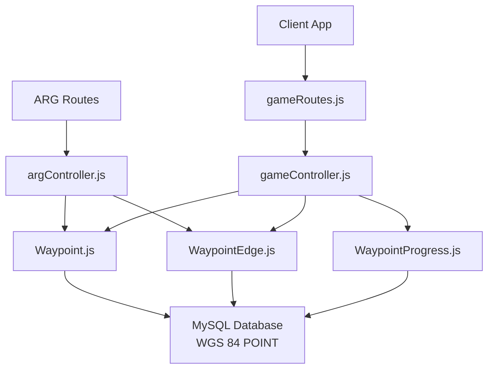
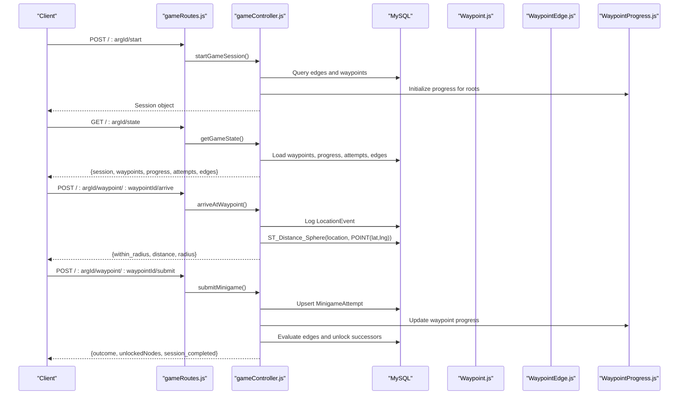
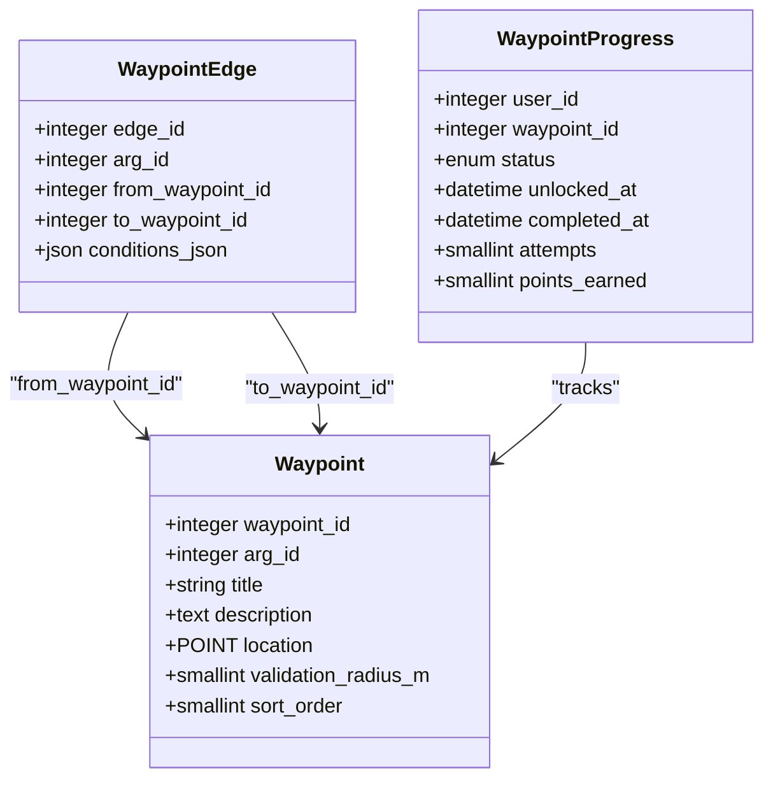
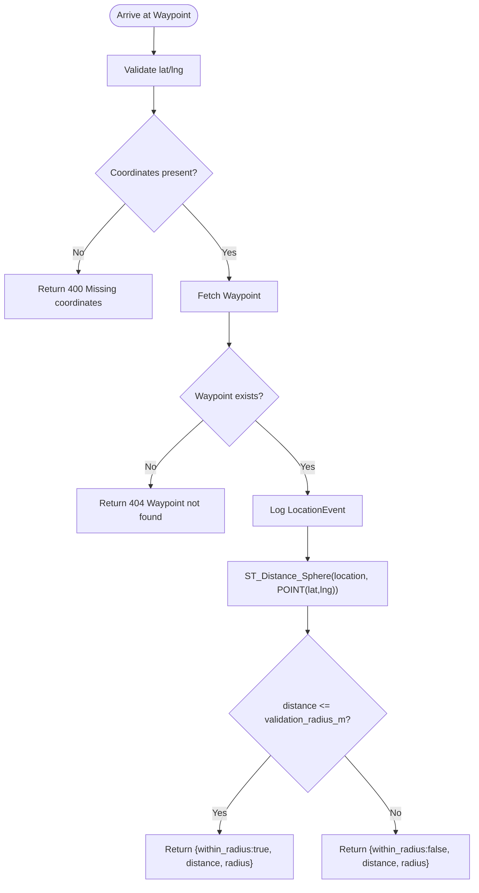
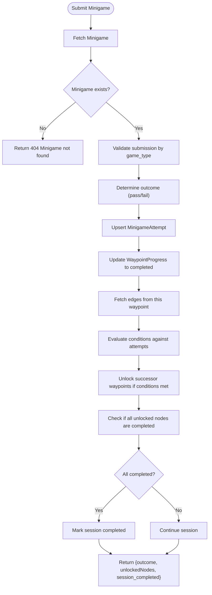
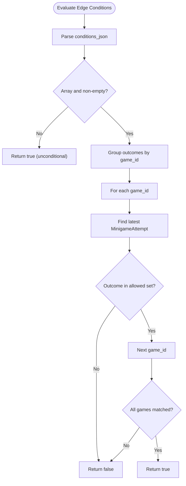
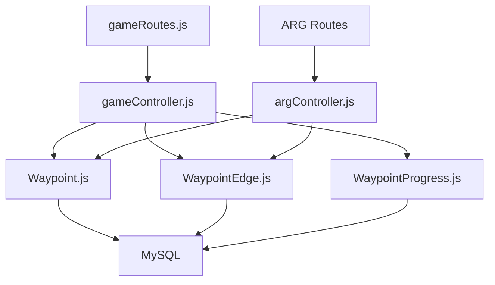

# Waypoint Management

<cite>
**Referenced Files in This Document**
- [argController.js](file://server/src/controllers/argController.js)
- [gameController.js](file://server/src/controllers/gameController.js)
- [gameRoutes.js](file://server/src/routes/gameRoutes.js)
- [Waypoint.js](file://server/src/models/Waypoint.js)
- [WaypointEdge.js](file://server/src/models/WaypointEdge.js)
- [WaypointProgress.js](file://server/src/models/WaypointProgress.js)
- [schema.sql](file://database/schema.sql)
</cite>

## Table of Contents
1. [Introduction](#introduction)
2. [Project Structure](#project-structure)
3. [Core Components](#core-components)
4. [Architecture Overview](#architecture-overview)
5. [Detailed Component Analysis](#detailed-component-analysis)
6. [Dependency Analysis](#dependency-analysis)
7. [Performance Considerations](#performance-considerations)
8. [Troubleshooting Guide](#troubleshooting-guide)
9. [Conclusion](#conclusion)

## Introduction
This document describes the waypoint management system used by ARGs (location-based games). It covers:
- Creating, updating, and managing waypoints within an ARG
- Spatial coordinates using WGS 84 and GPS proximity validation
- Waypoint relationships via directed edges for progression paths
- Player progress tracking through waypoints
- API endpoints for arrival checks and minigame submissions
- Data models, coordinate systems, distance calculations, and geospatial query capabilities

The system supports:
- Plotting waypoints on maps using latitude and longitude
- Configuring location-based puzzles with a configurable validation radius
- Defining branching progression paths between waypoints
- Managing player states such as locked, unlocked, completed, or skipped

## Project Structure
The waypoint system is implemented across controllers, routes, models, and database schema:
- Controllers handle business logic for ARG creation/update and gameplay interactions
- Routes expose HTTP endpoints for game session management and waypoint operations
- Models define data structures for waypoints, edges, and progress
- Schema defines spatial columns, indexes, and constraints

**Diagram sources**
- [gameRoutes.js:1-13](file://server/src/routes/gameRoutes.js#L1-L13)
- [gameController.js:1-368](file://server/src/controllers/gameController.js#L1-L368)
- [argController.js:1-452](file://server/src/controllers/argController.js#L1-L452)
- [Waypoint.js:1-20](file://server/src/models/Waypoint.js#L1-L20)
- [WaypointEdge.js:1-16](file://server/src/models/WaypointEdge.js#L1-L16)
- [WaypointProgress.js:1-18](file://server/src/models/WaypointProgress.js#L1-L18)

**Section sources**
- [gameRoutes.js:1-13](file://server/src/routes/gameRoutes.js#L1-L13)
- [gameController.js:1-368](file://server/src/controllers/gameController.js#L1-L368)
- [argController.js:1-452](file://server/src/controllers/argController.js#L1-L452)
- [Waypoint.js:1-20](file://server/src/models/Waypoint.js#L1-L20)
- [WaypointEdge.js:1-16](file://server/src/models/WaypointEdge.js#L1-L16)
- [WaypointProgress.js:1-18](file://server/src/models/WaypointProgress.js#L1-L18)
- [schema.sql:154-203](file://database/schema.sql#L154-L203)

## Core Components
- Waypoints: Geospatial nodes with title, description, WGS 84 point location, validation radius in meters, and sort order
- Edges: Directed connections from one waypoint to another with optional JSON conditions based on minigame outcomes
- Progress: Per-user per-waypoint state including status, timestamps, attempts, and points earned
- Gameplay endpoints: Start/resume sessions, get game state, arrive at waypoint (geofence check), submit minigame, abandon session
- ARG authoring endpoints: Create/update ARGs with waypoints and edges; includes mapping frontend types to backend game types

Key responsibilities:
- argController: Creates and updates ARGs with waypoints and edges; maps client waypoint payloads to server models
- gameController: Manages game sessions, evaluates branching conditions, performs spatial queries for proximity, records attempts, and updates progress

**Section sources**
- [Waypoint.js:4-17](file://server/src/models/Waypoint.js#L4-L17)
- [WaypointEdge.js:4-13](file://server/src/models/WaypointEdge.js#L4-L13)
- [WaypointProgress.js:4-15](file://server/src/models/WaypointProgress.js#L4-L15)
- [argController.js:78-157](file://server/src/controllers/argController.js#L78-L157)
- [argController.js:159-326](file://server/src/controllers/argController.js#L159-L326)
- [gameController.js:40-83](file://server/src/controllers/gameController.js#L40-L83)
- [gameController.js:85-161](file://server/src/controllers/gameController.js#L85-L161)
- [gameController.js:163-201](file://server/src/controllers/gameController.js#L163-L201)
- [gameController.js:203-350](file://server/src/controllers/gameController.js#L203-L350)

## Architecture Overview
The waypoint system integrates ARG authoring and gameplay flows:
- Authoring flow: Clients send waypoints and edges when creating/updating ARGs; controller persists spatial locations and relationships
- Gameplay flow: Clients start a session, fetch state, arrive at waypoints, submit minigames, and progress through the graph

**Diagram sources**
- [gameRoutes.js:6-10](file://server/src/routes/gameRoutes.js#L6-L10)
- [gameController.js:40-83](file://server/src/controllers/gameController.js#L40-L83)
- [gameController.js:85-161](file://server/src/controllers/gameController.js#L85-L161)
- [gameController.js:163-201](file://server/src/controllers/gameController.js#L163-L201)
- [gameController.js:203-350](file://server/src/controllers/gameController.js#L203-L350)

## Detailed Component Analysis

### Waypoint Data Model and Spatial Format
- Coordinates: WGS 84 (SRID 4326) stored as MySQL POINT
- Validation radius: meters around the point for proximity checks
- Sorting: sort_order allows ordering waypoints for display or sequencing
- Indexes: SPATIAL INDEX on location for efficient geospatial queries

Spatial format examples:
- Latitude and longitude pairs are converted to POINT(lat lng) with SRID 4326
- Distance calculation uses ST_Distance_Sphere to compute meters between two points

**Diagram sources**
- [Waypoint.js:4-17](file://server/src/models/Waypoint.js#L4-L17)
- [WaypointEdge.js:4-13](file://server/src/models/WaypointEdge.js#L4-L13)
- [WaypointProgress.js:4-15](file://server/src/models/WaypointProgress.js#L4-L15)
- [schema.sql:160-179](file://database/schema.sql#L160-L179)
- [schema.sql:183-203](file://database/schema.sql#L183-L203)
- [schema.sql:308-324](file://database/schema.sql#L308-L324)

**Section sources**
- [Waypoint.js:4-17](file://server/src/models/Waypoint.js#L4-L17)
- [WaypointEdge.js:4-13](file://server/src/models/WaypointEdge.js#L4-L13)
- [WaypointProgress.js:4-15](file://server/src/models/WaypointProgress.js#L4-L15)
- [schema.sql:160-179](file://database/schema.sql#L160-L179)
- [schema.sql:183-203](file://database/schema.sql#L183-L203)
- [schema.sql:308-324](file://database/schema.sql#L308-L324)

### ARG Creation and Update with Waypoints and Edges
- Creating an ARG accepts waypoints and edges; controller creates Waypoints with spatial locations and WaypointEdges with optional conditions
- Updating an ARG replaces missing waypoints and edges; it also manages associated minigames and their configurations
- Frontend type mapping converts client-side puzzle types to backend game types

Request/response patterns:
- Create ARG: body includes waypoints array and edges array; response includes idMap, minigameMap, wpObjMap for client reconciliation
- Update ARG: body includes updated waypoints and edges; existing items are matched by IDs; new items create new DB records

Coordinate handling:
- lat/lng are converted to POINT(lat lng) with SRID 4326 before persistence

**Section sources**
- [argController.js:78-157](file://server/src/controllers/argController.js#L78-L157)
- [argController.js:159-326](file://server/src/controllers/argController.js#L159-L326)
- [argController.js:56-76](file://server/src/controllers/argController.js#L56-L76)

### Gameplay Endpoints and Flow

#### Start Game Session
- Method: POST
- URL pattern: /:argId/start
- Behavior: Creates or resumes a session; initializes waypoint progress for root nodes based on edges

Response:
- Session object with status and timestamps

**Section sources**
- [gameRoutes.js:6-6](file://server/src/routes/gameRoutes.js#L6-L6)
- [gameController.js:40-83](file://server/src/controllers/gameController.js#L40-L83)

#### Get Game State
- Method: GET
- URL pattern: /:argId/state
- Behavior: Returns session, waypoints (with minigames), progress, attempts, and edges; unlocks root nodes if none are unlocked

Response:
- Object containing session, waypoints, progress, attempts, edges

**Section sources**
- [gameRoutes.js:7-7](file://server/src/routes/gameRoutes.js#L7-L7)
- [gameController.js:85-161](file://server/src/controllers/gameController.js#L85-L161)

#### Arrive at Waypoint (Geofence Check)
- Method: POST
- URL pattern: /:argId/waypoint/:waypointId/arrive
- Authentication: Requires authentication and anti-spoofing middleware
- Request body: lat, lng, accuracy_m
- Behavior: Logs location event; computes distance using ST_Distance_Sphere; returns whether within validation radius

Response:
- within_radius (boolean)
- distance (meters)
- radius (validation_radius_m)

**Diagram sources**
- [gameController.js:163-201](file://server/src/controllers/gameController.js#L163-L201)

**Section sources**
- [gameRoutes.js:8-8](file://server/src/routes/gameRoutes.js#L8-L8)
- [gameController.js:163-201](file://server/src/controllers/gameController.js#L163-L201)

#### Submit Minigame
- Method: POST
- URL pattern: /:argId/waypoint/:waypointId/submit
- Request body: game_id, submission
- Behavior: Validates submission based on game_type; upserts MinigameAttempt; updates WaypointProgress; evaluates edges to unlock successors; marks session completed if no unlocked nodes remain

Response:
- outcome (pass/fail)
- unlockedNodes (array of waypoint_ids)
- session_completed (boolean)

**Diagram sources**
- [gameController.js:203-350](file://server/src/controllers/gameController.js#L203-L350)

**Section sources**
- [gameRoutes.js:9-9](file://server/src/routes/gameRoutes.js#L9-L9)
- [gameController.js:203-350](file://server/src/controllers/gameController.js#L203-L350)

#### Abandon Session
- Method: POST
- URL pattern: /:argId/abandon
- Behavior: Sets session status to abandoned

Response:
- success boolean

**Section sources**
- [gameRoutes.js:10-10](file://server/src/routes/gameRoutes.js#L10-L10)
- [gameController.js:352-368](file://server/src/controllers/gameController.js#L352-L368)

### Waypoint Relationships and Progression Paths
- Edges define directed predecessor-to-successor relationships
- Conditions JSON can specify required outcomes for specific minigames to unlock a successor
- Evaluation groups outcomes by game_id and treats multiple outcomes for the same game as OR logic

Example condition structure:
- Array of objects with game_id and outcome fields
- If any grouped outcome matches the latest attempt for that game, the edge is satisfied

**Diagram sources**
- [gameController.js:5-38](file://server/src/controllers/gameController.js#L5-L38)

**Section sources**
- [WaypointEdge.js:4-13](file://server/src/models/WaypointEdge.js#L4-L13)
- [schema.sql:183-203](file://database/schema.sql#L183-L203)
- [gameController.js:5-38](file://server/src/controllers/gameController.js#L5-L38)

### Player Progress Management
- Progress tracks per-user per-waypoint state: locked, unlocked, completed, skipped
- Timestamps record when unlocked and completed
- Attempts count and points earned are tracked per waypoint

Initialization:
- On session start, root waypoints are unlocked; others remain locked unless edges unlock them

Updates:
- On minigame submission, progress is updated to completed
- Successor waypoints may be unlocked based on edge conditions

**Section sources**
- [WaypointProgress.js:4-15](file://server/src/models/WaypointProgress.js#L4-L15)
- [schema.sql:308-324](file://database/schema.sql#L308-L324)
- [gameController.js:40-83](file://server/src/controllers/gameController.js#L40-L83)
- [gameController.js:294-350](file://server/src/controllers/gameController.js#L294-L350)

## Dependency Analysis
- Controllers depend on models for data access
- Routes connect HTTP endpoints to controller methods
- Spatial queries rely on MySQL functions and SRID 4326
- Branching logic depends on minigame attempts and edge conditions

**Diagram sources**
- [gameRoutes.js:1-13](file://server/src/routes/gameRoutes.js#L1-L13)
- [gameController.js:1-368](file://server/src/controllers/gameController.js#L1-L368)
- [argController.js:1-452](file://server/src/controllers/argController.js#L1-L452)
- [Waypoint.js:1-20](file://server/src/models/Waypoint.js#L1-L20)
- [WaypointEdge.js:1-16](file://server/src/models/WaypointEdge.js#L1-L16)
- [WaypointProgress.js:1-18](file://server/src/models/WaypointProgress.js#L1-L18)

**Section sources**
- [gameRoutes.js:1-13](file://server/src/routes/gameRoutes.js#L1-L13)
- [gameController.js:1-368](file://server/src/controllers/gameController.js#L1-L368)
- [argController.js:1-452](file://server/src/controllers/argController.js#L1-L452)
- [Waypoint.js:1-20](file://server/src/models/Waypoint.js#L1-L20)
- [WaypointEdge.js:1-16](file://server/src/models/WaypointEdge.js#L1-L16)
- [WaypointProgress.js:1-18](file://server/src/models/WaypointProgress.js#L1-L18)

## Performance Considerations
- Use SPATIAL INDEX on location for efficient proximity queries
- Batch initialization of waypoint progress during session start to reduce round trips
- Avoid unnecessary re-computation of distances by caching validated results where appropriate
- Limit frequency of location logging to balance anti-spoofing needs with database load

[No sources needed since this section provides general guidance]

## Troubleshooting Guide
Common issues and resolutions:
- Missing coordinates in arrival request: Ensure lat and lng are provided in the request body
- Waypoint not found: Verify waypoint_id exists and belongs to the ARG
- AI service unreachable: When submitting plaque scans, ensure AI_SERVICE_URL is configured and reachable
- Session completion not triggered: Confirm all unlocked waypoints are completed and edges do not unlock additional nodes

**Section sources**
- [gameController.js:163-201](file://server/src/controllers/gameController.js#L163-L201)
- [gameController.js:203-350](file://server/src/controllers/gameController.js#L203-L350)

## Conclusion
The waypoint management system provides a robust framework for location-based ARGs:
- Waypoints store WGS 84 coordinates and validation radii for GPS proximity checks
- Edges define progression paths with conditional unlocking based on minigame outcomes
- Player progress is tracked comprehensively, supporting branching narratives and session lifecycle management
- APIs enable clients to plot waypoints, configure puzzles, manage progression, and interact with the game world effectively

[No sources needed since this section summarizes without analyzing specific files]