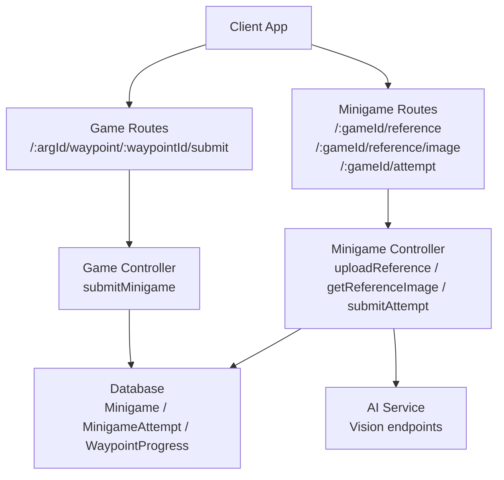
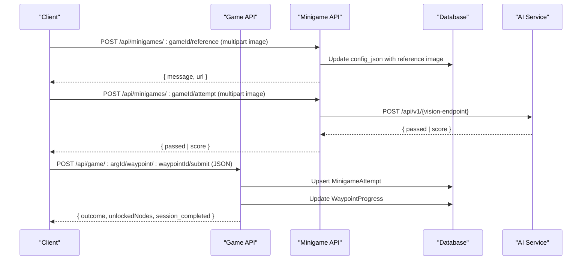
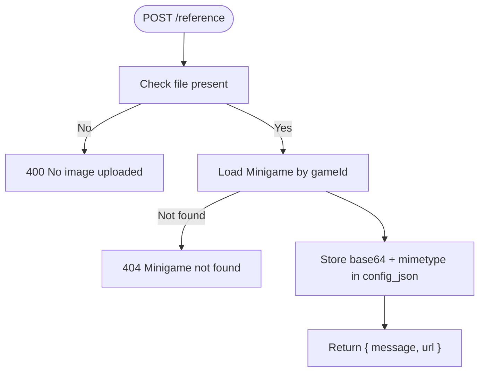
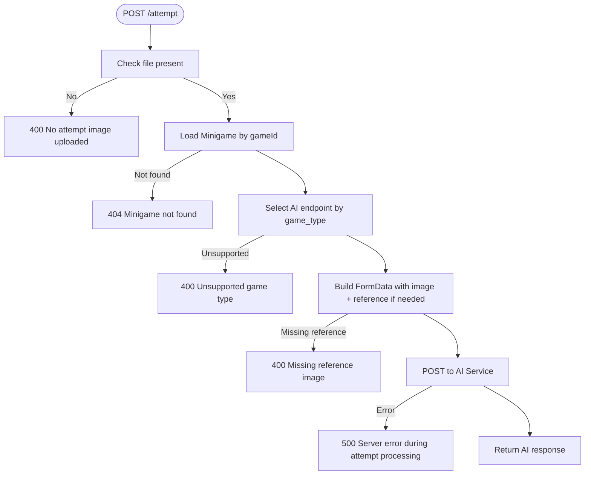
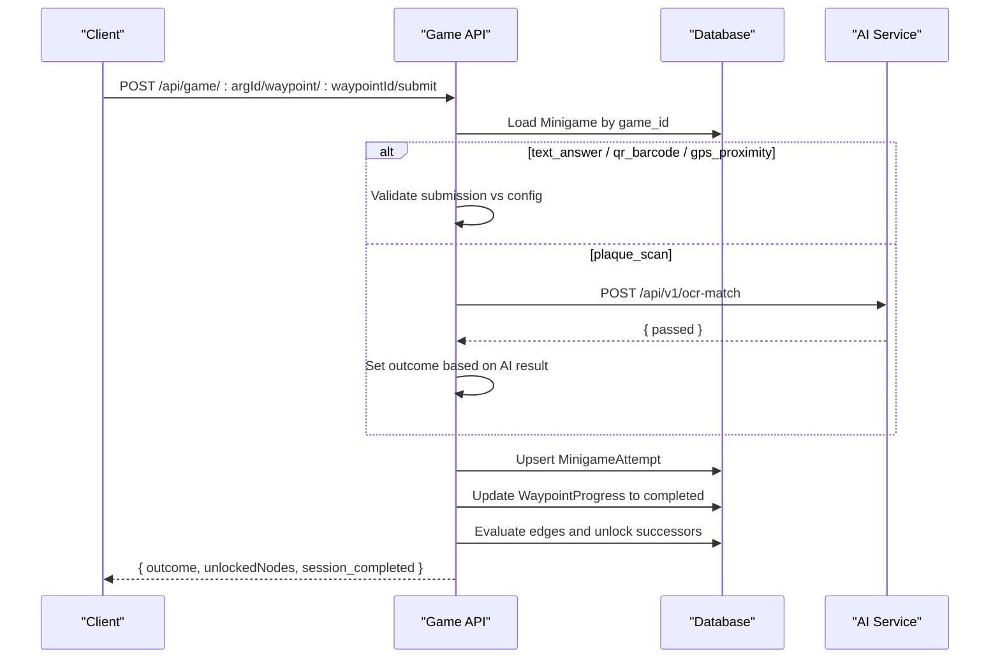
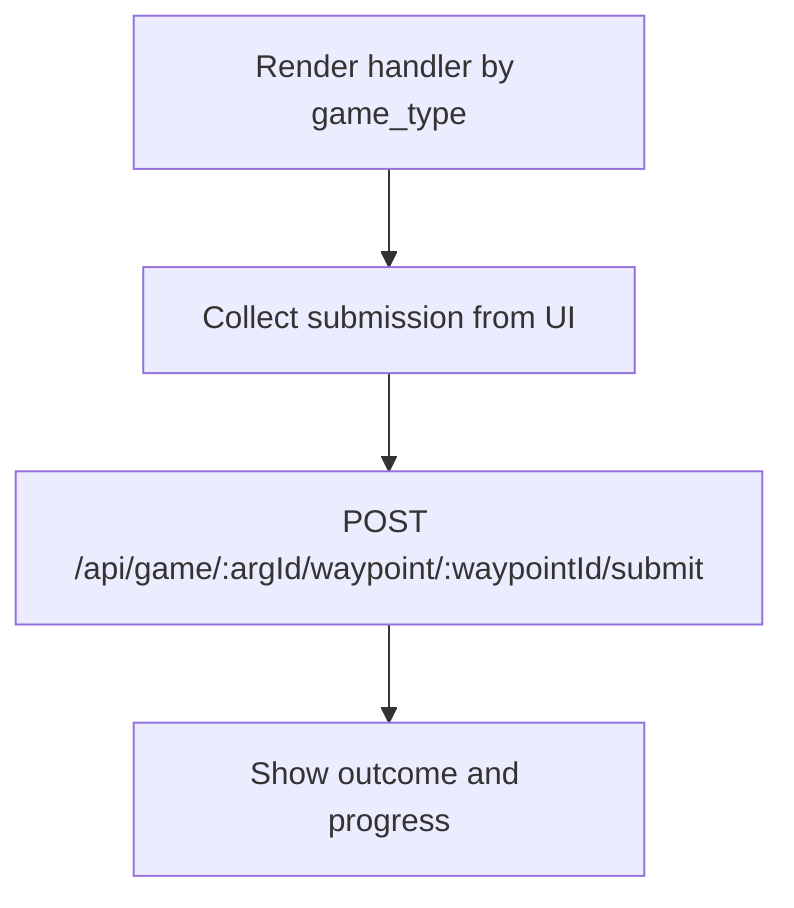
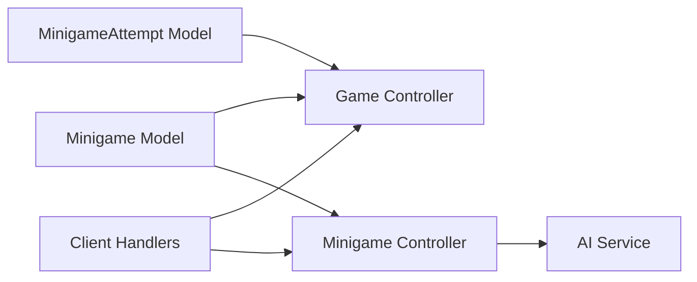

# Minigame API

<cite>
**Referenced Files in This Document**
- [minigameController.js](file://server/src/controllers/minigameController.js)
- [minigameRoutes.js](file://server/src/routes/minigameRoutes.js)
- [gameController.js](file://server/src/controllers/gameController.js)
- [gameRoutes.js](file://server/src/routes/gameRoutes.js)
- [Minigame.js](file://server/src/models/Minigame.js)
- [MinigameAttempt.js](file://server/src/models/MinigameAttempt.js)
- [schema.sql](file://database/schema.sql)
- [minigame-handlers.js](file://client/scripts/components/minigame-handlers.js)
- [game.js](file://client/scripts/game.js)
- [authMiddleware.js](file://server/src/middleware/authMiddleware.js)
- [antiSpoofing.js](file://server/src/middleware/antiSpoofing.js)
</cite>

## Table of Contents
1. [Introduction](#introduction)
2. [Project Structure](#project-structure)
3. [Core Components](#core-components)
4. [Architecture Overview](#architecture-overview)
5. [Detailed Component Analysis](#detailed-component-analysis)
6. [Dependency Analysis](#dependency-analysis)
7. [Performance Considerations](#performance-considerations)
8. [Troubleshooting Guide](#troubleshooting-guide)
9. [Conclusion](#conclusion)
10. [Appendices](#appendices)

## Introduction
This document specifies the minigame API for puzzle execution, validation, and scoring across the platform. It covers:
- Endpoints for reference image management and AI-assisted attempt evaluation
- Endpoints for game session submission, validation, and progression
- Authentication requirements and request/response schemas
- Supported minigame types and their validation logic
- Custom minigame development guidelines and integration examples

The system supports both lightweight text-based puzzles and advanced vision-based challenges (image recognition, color matching, shape detection, texture matching, symmetry finding).

## Project Structure
The minigame subsystem spans server routes, controllers, models, middleware, client UI handlers, and an external AI service.

**Diagram sources**
- [gameRoutes.js:1-13](file://server/src/routes/gameRoutes.js#L1-L13)
- [minigameRoutes.js:1-19](file://server/src/routes/minigameRoutes.js#L1-L19)
- [gameController.js:203-350](file://server/src/controllers/gameController.js#L203-L350)
- [minigameController.js:7-125](file://server/src/controllers/minigameController.js#L7-L125)

**Section sources**
- [gameRoutes.js:1-13](file://server/src/routes/gameRoutes.js#L1-L13)
- [minigameRoutes.js:1-19](file://server/src/routes/minigameRoutes.js#L1-L19)
- [gameController.js:203-350](file://server/src/controllers/gameController.js#L203-L350)
- [minigameController.js:7-125](file://server/src/controllers/minigameController.js#L7-L125)

## Core Components
- Minigame model defines supported game types and configuration storage.
- MinigameAttempt model records per-user outcomes, scores, and points awarded.
- Game controller implements core submission flow, validation, and progression updates.
- Minigame controller provides reference image upload/retrieval and AI-backed attempt evaluation.
- Client-side handlers render specific minigame UIs and submit answers or images.

Key responsibilities:
- Reference image management for vision-based minigames
- Attempt submission to AI service for complex puzzles
- Deterministic validation for simple puzzles
- Progression and completion tracking

**Section sources**
- [Minigame.js:1-18](file://server/src/models/Minigame.js#L1-L18)
- [MinigameAttempt.js:1-18](file://server/src/models/MinigameAttempt.js#L1-L18)
- [gameController.js:203-350](file://server/src/controllers/gameController.js#L203-L350)
- [minigameController.js:7-125](file://server/src/controllers/minigameController.js#L7-L125)
- [minigame-handlers.js:1-202](file://client/scripts/components/minigame-handlers.js#L1-L202)

## Architecture Overview
The minigame architecture integrates three layers:
- Client layer: renders minigame UIs and submits answers or images
- Server layer: validates submissions, persists attempts, and manages progression
- AI service layer: evaluates complex visual tasks via dedicated endpoints

**Diagram sources**
- [minigameController.js:7-125](file://server/src/controllers/minigameController.js#L7-L125)
- [gameController.js:203-350](file://server/src/controllers/gameController.js#L203-L350)

## Detailed Component Analysis

### Minigame Reference Image Management
Endpoints:
- POST /api/minigames/:gameId/reference
  - Method: POST
  - Path parameters: gameId (integer)
  - Headers: Authorization (required), Content-Type: multipart/form-data
  - Body: field name image (file, max 5 MB)
  - Response: JSON { message, url }
  - Errors: 400 No image uploaded; 404 Minigame not found; 500 Server error
- GET /api/minigames/:gameId/reference/image
  - Method: GET
  - Path parameters: gameId (integer)
  - Headers: Authorization (required)
  - Response: Binary image stream with Content-Type set from stored mimetype
  - Errors: 404 Reference image not found; 500 Server error

Authentication:
- All minigame routes are protected by requireAuth middleware.

Validation logic:
- Reference image is stored in base64 within config_json along with mimetype.
- The URL returned points to a dynamic endpoint serving the stored image buffer.

**Diagram sources**
- [minigameController.js:7-31](file://server/src/controllers/minigameController.js#L7-L31)
- [minigameRoutes.js:14-16](file://server/src/routes/minigameRoutes.js#L14-L16)

**Section sources**
- [minigameController.js:7-51](file://server/src/controllers/minigameController.js#L7-L51)
- [minigameRoutes.js:14-16](file://server/src/routes/minigameRoutes.js#L14-L16)

### AI-Assisted Attempt Evaluation
Endpoint:
- POST /api/minigames/:gameId/attempt
  - Method: POST
  - Path parameters: gameId (integer)
  - Headers: Authorization (required), Content-Type: multipart/form-data
  - Body: field name image (file, max 5 MB)
  - Response: JSON from AI service (e.g., { passed })
  - Errors: 400 No attempt image uploaded; 404 Minigame not found; 400 Missing reference image; 500 Server error during processing

Supported game types and AI endpoints:
- shape_match -> /api/v1/sam-extract (requires target_mask reference)
- colour_match -> /api/v1/hsv-match (requires reference_image)
- texture_match -> /api/v1/texture-match (requires reference_image)
- sift_match -> /api/v1/sift-match (requires archival_image)
- symmetry_finder -> /api/v1/symmetry (no reference image)

Validation logic:
- Determines AI endpoint based on game_type.
- Attaches required reference fields from config_json when needed.
- Forwards multipart form data to AI service and returns its response.

**Diagram sources**
- [minigameController.js:53-125](file://server/src/controllers/minigameController.js#L53-L125)

**Section sources**
- [minigameController.js:53-125](file://server/src/controllers/minigameController.js#L53-L125)
- [minigameRoutes.js:16-16](file://server/src/routes/minigameRoutes.js#L16-L16)

### Game Submission, Validation, and Scoring
Endpoint:
- POST /api/game/:argId/waypoint/:waypointId/submit
  - Method: POST
  - Path parameters: argId (integer), waypointId (integer)
  - Headers: Authorization (required)
  - Body: JSON { game_id, submission }
  - Response: JSON { outcome, unlockedNodes, session_completed }
  - Errors: 404 Minigame not found; 500 Failed to submit minigame

Supported game types and validation:
- gps_proximity: pass (proximity already validated by arrive endpoint)
- text_answer:
  - MCQ: compare submitted index with correct_index
  - Free text: case-insensitive exact match against config.answer
- qr_barcode: exact string match against config.barcode_value
- plaque_scan: calls AI OCR service; passes if AI reports success
- Other types: fallback stub currently marks pass

Scoring and persistence:
- Outcome determines score: pass -> 1.0, fail -> 0.0
- MinigameAttempt upserted with user_id, game_id, outcome, submission_json, score, attempted_at
- WaypointProgress updated to completed regardless of outcome
- Successor waypoints evaluated and unlocked based on conditions
- Session marked completed when no unlocked nodes remain

**Diagram sources**
- [gameController.js:203-350](file://server/src/controllers/gameController.js#L203-L350)

**Section sources**
- [gameController.js:203-350](file://server/src/controllers/gameController.js#L203-L350)
- [gameRoutes.js:6-10](file://server/src/routes/gameRoutes.js#L6-L10)

### Client-Side Minigame Handlers
The client provides handlers for rendering minigame UIs and collecting submissions:
- gps_proximity: location verification button submitting empty payload
- text_answer: MCQ radio inputs or free-text input
- qr_barcode: scanner integration with manual entry fallback
- plaque_scan: photo capture and preview before submission

Integration:
- The game loop renders the appropriate handler based on game_type
- On submit, it posts to /api/game/:argId/waypoint/:waypointId/submit with { game_id, game_type, submission }
- Displays loading state while verifying

**Diagram sources**
- [minigame-handlers.js:7-202](file://client/scripts/components/minigame-handlers.js#L7-L202)
- [game.js:537-564](file://client/scripts/game.js#L537-L564)

**Section sources**
- [minigame-handlers.js:7-202](file://client/scripts/components/minigame-handlers.js#L7-L202)
- [game.js:537-564](file://client/scripts/game.js#L537-L564)

## Dependency Analysis
- Minigame model enumerates supported game types and stores configuration JSON.
- MinigameAttempt model tracks per-user attempts with outcome, score, and points_awarded.
- Game controller depends on database models and optional AI service for OCR.
- Minigame controller depends on AI service for vision tasks and uses multer for file uploads.
- Client handlers depend on browser APIs and third-party libraries (e.g., QR scanner).

**Diagram sources**
- [Minigame.js:1-18](file://server/src/models/Minigame.js#L1-L18)
- [MinigameAttempt.js:1-18](file://server/src/models/MinigameAttempt.js#L1-L18)
- [gameController.js:203-350](file://server/src/controllers/gameController.js#L203-L350)
- [minigameController.js:7-125](file://server/src/controllers/minigameController.js#L7-L125)
- [minigame-handlers.js:7-202](file://client/scripts/components/minigame-handlers.js#L7-L202)

**Section sources**
- [Minigame.js:1-18](file://server/src/models/Minigame.js#L1-L18)
- [MinigameAttempt.js:1-18](file://server/src/models/MinigameAttempt.js#L1-L18)
- [gameController.js:203-350](file://server/src/controllers/gameController.js#L203-L350)
- [minigameController.js:7-125](file://server/src/controllers/minigameController.js#L7-L125)
- [minigame-handlers.js:7-202](file://client/scripts/components/minigame-handlers.js#L7-L202)

## Performance Considerations
- File size limits: Multer configured to accept up to 5 MB per image.
- Memory storage: Images are kept in memory for immediate processing; consider disk storage for large-scale deployments.
- AI service latency: Vision endpoints may be slow; implement client-side loading states and retries.
- Database transactions: Use transactions for atomicity during submission and progression updates.
- Caching: Cache reference images at CDN level to reduce repeated transfers.
- Concurrency: Offload heavy AI computations to the Python microservice to keep Node.js responsive.

[No sources needed since this section provides general guidance]

## Troubleshooting Guide
Common issues and resolutions:
- Missing reference image: Ensure reference image is uploaded before attempting vision-based puzzles.
- Unsupported game type: Only specified game types are routed to AI endpoints; extend controller logic for new types.
- AI service errors: Check environment variables for AI_SERVICE_URL and headers like X-API-Key where applicable.
- Authentication failures: Verify Authorization header presence and validity.
- Submission validation failures: Confirm submission format matches expected schema for each game type.

**Section sources**
- [minigameController.js:7-125](file://server/src/controllers/minigameController.js#L7-L125)
- [gameController.js:203-350](file://server/src/controllers/gameController.js#L203-L350)
- [authMiddleware.js](file://server/src/middleware/authMiddleware.js)
- [antiSpoofing.js](file://server/src/middleware/antiSpoofing.js)

## Conclusion
The minigame API provides a robust framework for both simple and advanced puzzles. It supports reference image management, AI-assisted evaluation, deterministic validation, and comprehensive progression tracking. Developers can extend the system by adding new game types, integrating additional AI services, and customizing client handlers.

[No sources needed since this section summarizes without analyzing specific files]

## Appendices

### API Reference Summary

#### Minigame Reference Management
- POST /api/minigames/:gameId/reference
  - Auth: Required
  - Content-Type: multipart/form-data
  - Request body: image (file)
  - Response: JSON { message, url }
- GET /api/minigames/:gameId/reference/image
  - Auth: Required
  - Response: Binary image stream

#### AI-Assisted Attempt Evaluation
- POST /api/minigames/:gameId/attempt
  - Auth: Required
  - Content-Type: multipart/form-data
  - Request body: image (file)
  - Response: JSON from AI service

#### Game Submission, Validation, and Scoring
- POST /api/game/:argId/waypoint/:waypointId/submit
  - Auth: Required
  - Content-Type: application/json
  - Request body: { game_id, submission }
  - Response: JSON { outcome, unlockedNodes, session_completed }

**Section sources**
- [minigameRoutes.js:14-16](file://server/src/routes/minigameRoutes.js#L14-L16)
- [gameRoutes.js:6-10](file://server/src/routes/gameRoutes.js#L6-L10)

### Data Models

#### Minigame
- Fields:
  - game_id: integer primary key
  - waypoint_id: integer
  - game_type: enum including gps_proximity, text_answer, qr_barcode, ar_object_scan, colour_match, shape_match, photo_submit, texture_match, sift_match, symmetry_finder, word_scramble, plaque_scan
  - config_json: JSON
  - points_value: small integer unsigned

#### MinigameAttempt
- Fields:
  - user_id: integer primary key
  - game_id: integer primary key
  - outcome: enum pass/fail/timeout
  - submission_json: JSON
  - score: decimal 5,4
  - points_awarded: small integer unsigned
  - attempted_at: timestamp

**Section sources**
- [Minigame.js:1-18](file://server/src/models/Minigame.js#L1-L18)
- [MinigameAttempt.js:1-18](file://server/src/models/MinigameAttempt.js#L1-L18)
- [schema.sql:305-335](file://database/schema.sql#L305-L335)

### Custom Minigame Development Guidelines
- Add new game_type to Minigame model enum if necessary.
- Implement validation logic in gameController.submitMinigame for deterministic puzzles.
- For vision-based puzzles, add routing in minigameController.submitAttempt to call the appropriate AI endpoint.
- Extend client handlers in minigame-handlers.js to render UI and collect submissions.
- Test with unit tests for controller logic and integration tests for end-to-end flows.

**Section sources**
- [Minigame.js:1-18](file://server/src/models/Minigame.js#L1-L18)
- [gameController.js:203-350](file://server/src/controllers/gameController.js#L203-L350)
- [minigameController.js:53-125](file://server/src/controllers/minigameController.js#L53-L125)
- [minigame-handlers.js:7-202](file://client/scripts/components/minigame-handlers.js#L7-L202)