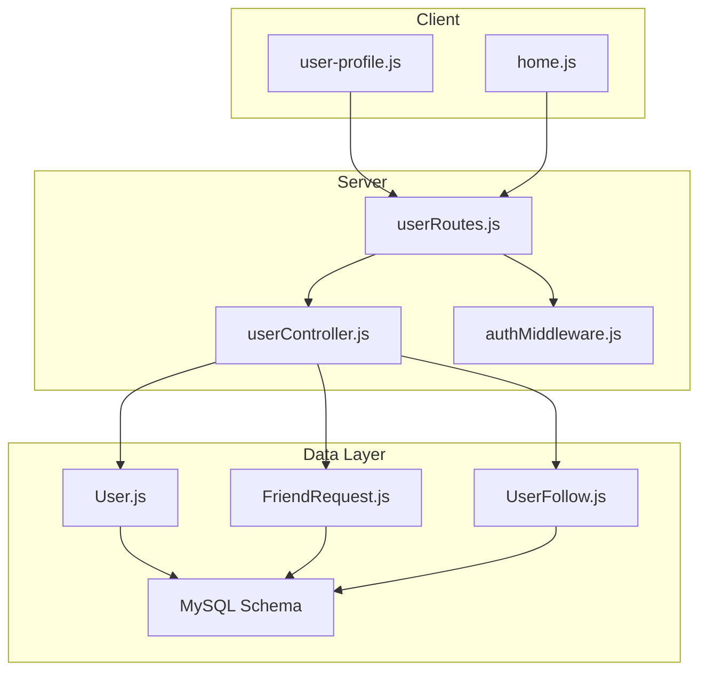
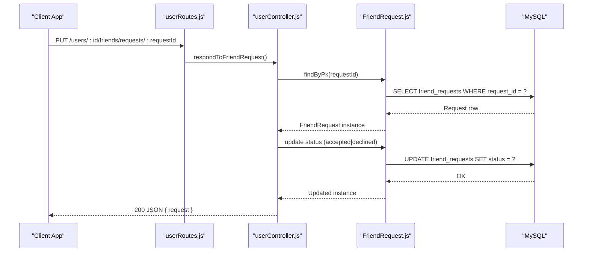
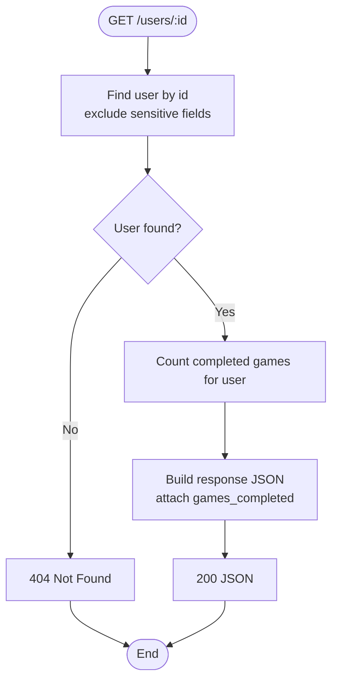
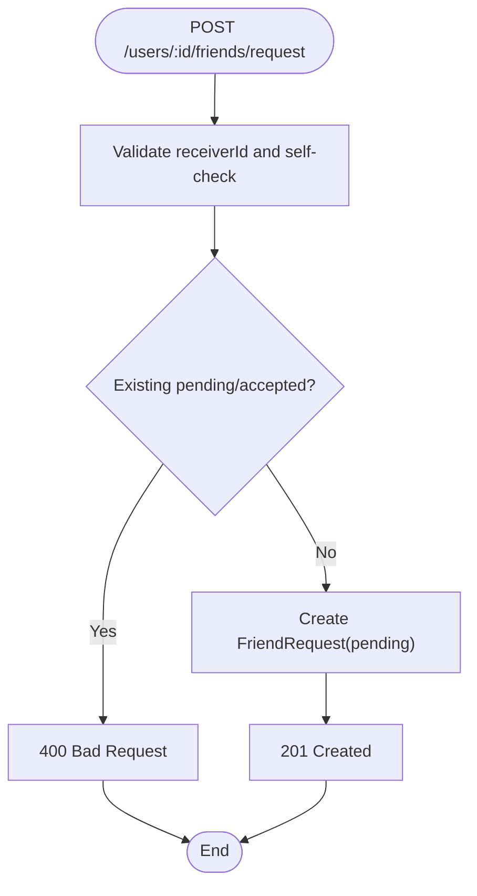
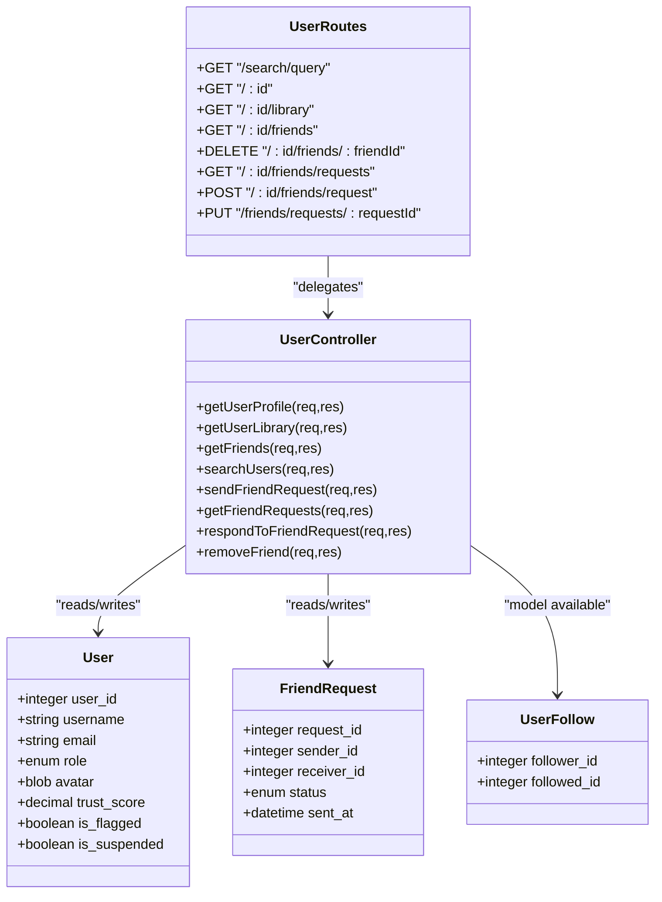

# User Management API

<cite>
**Referenced Files in This Document**
- [userRoutes.js](file://server/src/routes/userRoutes.js)
- [userController.js](file://server/src/controllers/userController.js)
- [authMiddleware.js](file://server/src/middleware/authMiddleware.js)
- [User.js](file://server/src/models/User.js)
- [FriendRequest.js](file://server/src/models/FriendRequest.js)
- [UserFollow.js](file://server/src/models/UserFollow.js)
- [schema.sql](file://database/schema.sql)
- [user-profile.js](file://client/scripts/user-profile.js)
- [home.js](file://client/scripts/home.js)
</cite>

## Table of Contents
1. [Introduction](#introduction)
2. [Project Structure](#project-structure)
3. [Core Components](#core-components)
4. [Architecture Overview](#architecture-overview)
5. [Detailed Component Analysis](#detailed-component-analysis)
6. [Dependency Analysis](#dependency-analysis)
7. [Performance Considerations](#performance-considerations)
8. [Troubleshooting Guide](#troubleshooting-guide)
9. [Conclusion](#conclusion)
10. [Appendices](#appendices)

## Introduction
This document specifies the user management API for the WARG Platform, focusing on:
- User profile operations (read-only endpoints are implemented; updates require extension)
- Friend systems (send, list, accept/decline requests, remove friends)
- Social features (user discovery/search, following model present in schema and models)
- Authorization and role-based access control
- Integration examples for social graph usage with comments, ratings, and leaderboards

The API is built with Express routes and controllers backed by Sequelize models and a MySQL schema.

## Project Structure
Relevant backend files for this API:
- Routes: server/src/routes/userRoutes.js
- Controllers: server/src/controllers/userController.js
- Middleware: server/src/middleware/authMiddleware.js
- Models: server/src/models/User.js, FriendRequest.js, UserFollow.js
- Database Schema: database/schema.sql
- Client integration: client/scripts/user-profile.js, client/scripts/home.js

**Diagram sources**
- [userRoutes.js:1-15](file://server/src/routes/userRoutes.js#L1-L15)
- [userController.js:1-226](file://server/src/controllers/userController.js#L1-L226)
- [authMiddleware.js:1-22](file://server/src/middleware/authMiddleware.js#L1-L22)
- [User.js:1-28](file://server/src/models/User.js#L1-L28)
- [FriendRequest.js:1-16](file://server/src/models/FriendRequest.js#L1-L16)
- [UserFollow.js:1-13](file://server/src/models/UserFollow.js#L1-L13)
- [schema.sql:15-84](file://database/schema.sql#L15-L84)

**Section sources**
- [userRoutes.js:1-15](file://server/src/routes/userRoutes.js#L1-L15)
- [schema.sql:15-84](file://database/schema.sql#L15-L84)

## Core Components
- User Profile Read: GET /users/:id returns public profile data plus computed games_completed.
- User Library: GET /users/:id/library lists ARGs created by the user.
- Friends:
  - GET /users/:id/friends returns accepted friends with optional active game presence.
  - DELETE /users/:id/friends/:friendId removes an accepted friend connection.
- Friend Requests:
  - POST /users/:id/friends/request sends a new request to another user.
  - GET /users/:id/friends/requests lists pending requests received by the user.
  - PUT /users/:id/friends/requests/:requestId accepts or declines a request.
- User Discovery/Search:
  - GET /users/search/query?q=... performs username substring search.

Authorization:
- The current route definitions do not apply middleware explicitly. Use authMiddleware.requireAuth where appropriate to protect write endpoints.

Role-Based Access Control:
- Roles: player, creator, admin. Admin-only logic is available via requireAdmin middleware.

Privacy:
- Public profiles exclude sensitive fields like google_uid and session_token.

**Section sources**
- [userRoutes.js:5-12](file://server/src/routes/userRoutes.js#L5-L12)
- [userController.js:4-225](file://server/src/controllers/userController.js#L4-L225)
- [authMiddleware.js:1-22](file://server/src/middleware/authMiddleware.js#L1-L22)
- [User.js:4-19](file://server/src/models/User.js#L4-L19)

## Architecture Overview
End-to-end flow for friend request acceptance:

**Diagram sources**
- [userRoutes.js:12-12](file://server/src/routes/userRoutes.js#L12-L12)
- [userController.js:177-199](file://server/src/controllers/userController.js#L177-L199)
- [FriendRequest.js:4-13](file://server/src/models/FriendRequest.js#L4-L13)
- [schema.sql:69-84](file://database/schema.sql#L69-L84)

## Detailed Component Analysis

### User Profile Endpoints

- GET /users/:id
  - Purpose: Retrieve a user’s public profile and computed stats.
  - Auth: Not enforced in route definition; recommended to use requireAuth for private contexts.
  - Response: User object excluding sensitive fields, plus games_completed count.
  - Notes: Includes badges through a join; avatar may be stored as BLOB but client currently uses a generated identicon.

- GET /users/:id/library
  - Purpose: List ARGs authored by the user.
  - Auth: Not enforced in route definition.
  - Response: Array of ARG objects created by the user.

- Profile Picture Upload
  - Status: No upload endpoint is defined in user routes.
  - Recommendation: Add a multipart/form-data endpoint to update the avatar field on the User model. Validate MIME type and size before persisting.

- Profile Update
  - Status: No update endpoint is defined in user routes.
  - Recommendation: Add PATCH /users/:id to update allowed fields (e.g., username, email). Enforce uniqueness constraints and validate inputs. Apply requireAuth and consider requireAdmin for role changes.

**Diagram sources**
- [userController.js:4-25](file://server/src/controllers/userController.js#L4-L25)
- [User.js:4-19](file://server/src/models/User.js#L4-L19)

**Section sources**
- [userRoutes.js:6-7](file://server/src/routes/userRoutes.js#L6-L7)
- [userController.js:4-37](file://server/src/controllers/userController.js#L4-L37)
- [User.js:4-19](file://server/src/models/User.js#L4-L19)
- [schema.sql:15-44](file://database/schema.sql#L15-L44)

### Friend System Endpoints

- POST /users/:id/friends/request
  - Purpose: Send a friend request from the path parameter user to receiverId in the body.
  - Auth: Recommended to enforce requireAuth.
  - Request Body: { receiverId: number }
  - Response: 201 Created with the created request object.
  - Validation: Prevent self-request; prevent duplicate or already accepted connections.

- GET /users/:id/friends/requests
  - Purpose: List pending friend requests received by the user.
  - Auth: Recommended to enforce requireAuth.
  - Response: Array of formatted requests including sender details.

- PUT /users/:id/friends/requests/:requestId
  - Purpose: Accept or decline a specific friend request.
  - Auth: Recommended to enforce requireAuth.
  - Request Body: { status: "accepted" | "declined" }
  - Response: 200 OK with updated request object.

- GET /users/:id/friends
  - Purpose: Get accepted friends with optional active game presence.
  - Auth: Recommended to enforce requireAuth.
  - Response: Array of friend user objects with minimal attributes and optional active game info.

- DELETE /users/:id/friends/:friendId
  - Purpose: Remove an accepted friendship.
  - Auth: Recommended to enforce requireAuth.
  - Response: 200 OK with success message or 404 if no accepted connection exists.

**Diagram sources**
- [userController.js:97-134](file://server/src/controllers/userController.js#L97-L134)
- [FriendRequest.js:4-13](file://server/src/models/FriendRequest.js#L4-L13)
- [schema.sql:69-84](file://database/schema.sql#L69-L84)

**Section sources**
- [userRoutes.js:8-12](file://server/src/routes/userRoutes.js#L8-L12)
- [userController.js:39-225](file://server/src/controllers/userController.js#L39-L225)
- [FriendRequest.js:4-13](file://server/src/models/FriendRequest.js#L4-L13)
- [schema.sql:69-84](file://database/schema.sql#L69-L84)

### User Discovery and Search

- GET /users/search/query?q=string
  - Purpose: Discover users by username substring match.
  - Auth: Not enforced in route definition.
  - Query Params: q (optional string)
  - Response: Array of user objects with minimal attributes.

Integration example:
- The client renders search results and provides “Add” buttons that call sendFriendRequest using the current user ID and selected user ID.

**Section sources**
- [userRoutes.js:5-5](file://server/src/routes/userRoutes.js#L5-L5)
- [userController.js:76-95](file://server/src/controllers/userController.js#L76-L95)
- [home.js:453-560](file://client/scripts/home.js#L453-L560)

### Following System (Schema and Model)

- Data Model:
  - user_follows table stores asymmetric follows (follower_id, followed_id).
  - UserFollow model defines the primary key pair and table mapping.

- API Surface:
  - No explicit follow/unfollow endpoints are exposed in userRoutes.
  - Recommendation: Implement:
    - POST /users/:id/follows/:targetId to follow
    - DELETE /users/:id/follows/:targetId to unfollow
  - Enforce requireAuth and ensure follower != followed.

Social Graph Usage:
- The schema includes views and indexes optimized for activity feeds and leaderboard queries.

**Section sources**
- [UserFollow.js:1-13](file://server/src/models/UserFollow.js#L1-L13)
- [schema.sql:54-65](file://database/schema.sql#L54-L65)

### Role-Based Access Control and Permissions

- Roles:
  - player, creator, admin (defined in User model and schema).

- Middleware:
  - requireAuth: Ensures user is authenticated and not flagged; otherwise returns 401 or 403.
  - requireAdmin: Restricts access to admin users; otherwise returns 403.

- Recommendations:
  - Apply requireAuth to all write endpoints (friend requests, removing friends).
  - Apply requireAdmin to any future profile update endpoints that change roles or sensitive fields.

**Section sources**
- [User.js:12-12](file://server/src/models/User.js#L12-L12)
- [schema.sql:15-44](file://database/schema.sql#L15-L44)
- [authMiddleware.js:1-22](file://server/src/middleware/authMiddleware.js#L1-L22)

### Privacy Settings

- Sensitive Fields Exposed:
  - Profile read excludes google_uid and session_token.
- Avatar Storage:
  - Avatar is stored as a BLOB in the database; client currently uses a generated identicon based on username.
- Recommendations:
  - Introduce privacy flags (e.g., visibility of distance_walked_m, trust_score) controlled by role and user settings.
  - Serve avatars via a secure endpoint with access checks.

**Section sources**
- [userController.js:6-8](file://server/src/controllers/userController.js#L6-L8)
- [User.js:11-11](file://server/src/models/User.js#L11-L11)
- [schema.sql:15-44](file://database/schema.sql#L15-L44)

## Dependency Analysis

**Diagram sources**
- [User.js:4-19](file://server/src/models/User.js#L4-L19)
- [FriendRequest.js:4-13](file://server/src/models/FriendRequest.js#L4-L13)
- [UserFollow.js:4-10](file://server/src/models/UserFollow.js#L4-L10)
- [userController.js:4-225](file://server/src/controllers/userController.js#L4-L225)
- [userRoutes.js:5-12](file://server/src/routes/userRoutes.js#L5-L12)

**Section sources**
- [userRoutes.js:5-12](file://server/src/routes/userRoutes.js#L5-L12)
- [userController.js:4-225](file://server/src/controllers/userController.js#L4-L225)
- [User.js:4-19](file://server/src/models/User.js#L4-L19)
- [FriendRequest.js:4-13](file://server/src/models/FriendRequest.js#L4-L13)
- [UserFollow.js:4-10](file://server/src/models/UserFollow.js#L4-L10)

## Performance Considerations
- Indexes:
  - Users: role, trust_score.
  - Friend requests: receiver index.
  - Follows: followed index.
- Queries:
  - Friend retrieval joins GameSession and Arg; ensure proper indexing on game_sessions(user_id, status) and args(arg_id).
- Pagination:
  - For large libraries or friend lists, implement pagination to reduce payload size.
- Caching:
  - Cache frequent profile reads and friend lists with short TTLs.

[No sources needed since this section provides general guidance]

## Troubleshooting Guide
Common issues and resolutions:
- Unauthorized responses:
  - Ensure authentication is enabled for protected endpoints using requireAuth middleware.
- Forbidden due to flagged account:
  - Flagged users receive 403; review moderation actions and unflagging process.
- Duplicate friend requests:
  - The controller prevents sending duplicate or already accepted connections; check existing statuses.
- Friend removal not found:
  - Removing a non-existent accepted connection returns 404; verify both directions of the accepted relationship.

**Section sources**
- [authMiddleware.js:1-22](file://server/src/middleware/authMiddleware.js#L1-L22)
- [userController.js:102-134](file://server/src/controllers/userController.js#L102-L134)
- [userController.js:201-225](file://server/src/controllers/userController.js#L201-L225)

## Conclusion
The user management API currently exposes robust read endpoints for profiles and libraries, comprehensive friend request workflows, and user discovery via search. While the following system is modeled and indexed, explicit follow/unfollow endpoints are not yet implemented. To fully support user profile updates and profile picture uploads, add dedicated endpoints with validation and authorization. Applying requireAuth and requireAdmin appropriately will strengthen security and align with role-based permissions.

[No sources needed since this section summarizes without analyzing specific files]

## Appendices

### API Reference Summary

- GET /users/search/query
  - Query params: q (string)
  - Response: array of user objects

- GET /users/:id
  - Response: user object with games_completed

- GET /users/:id/library
  - Response: array of ARG objects

- GET /users/:id/friends
  - Response: array of friend user objects

- DELETE /users/:id/friends/:friendId
  - Response: success message or 404

- GET /users/:id/friends/requests
  - Response: array of pending requests with sender details

- POST /users/:id/friends/request
  - Request body: { receiverId: number }
  - Response: created request object

- PUT /users/:id/friends/requests/:requestId
  - Request body: { status: "accepted" | "declined" }
  - Response: updated request object

**Section sources**
- [userRoutes.js:5-12](file://server/src/routes/userRoutes.js#L5-L12)
- [userController.js:4-225](file://server/src/controllers/userController.js#L4-L225)

### Client Integration Examples

- Profile Page:
  - Fetches current user and full profile to render stats and badges.
  - Calls getUserLibrary to display user-created ARGs.

- Home Page:
  - Renders search results and allows sending friend requests.
  - Displays incoming friend requests with accept/decline actions.

**Section sources**
- [user-profile.js:7-123](file://client/scripts/user-profile.js#L7-L123)
- [home.js:453-560](file://client/scripts/home.js#L453-L560)