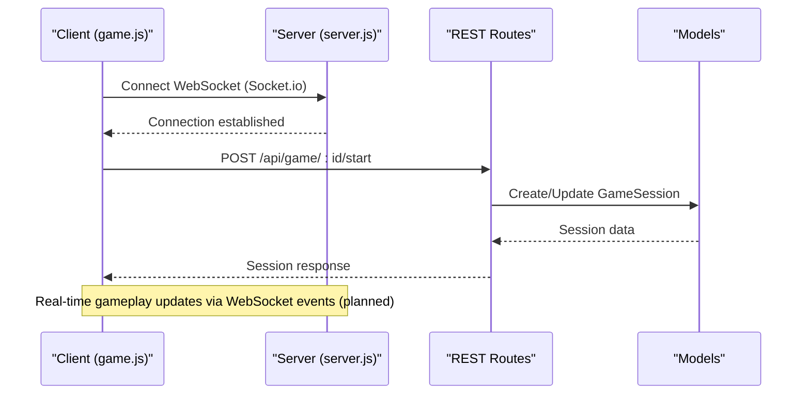
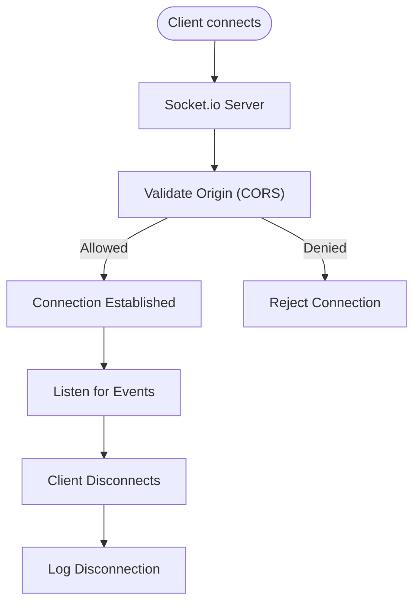
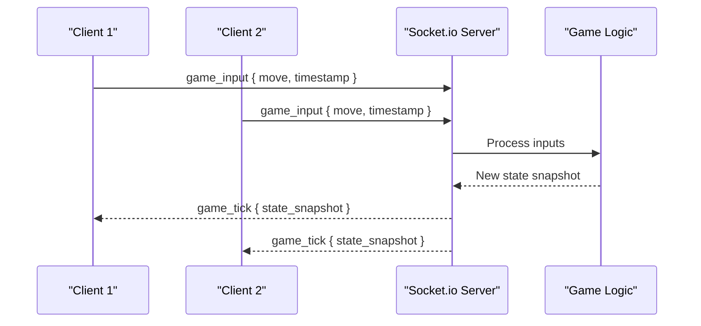
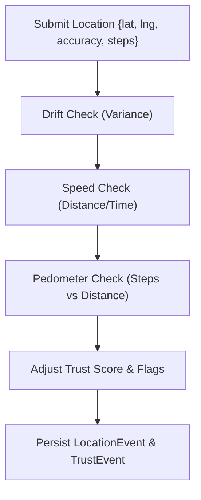
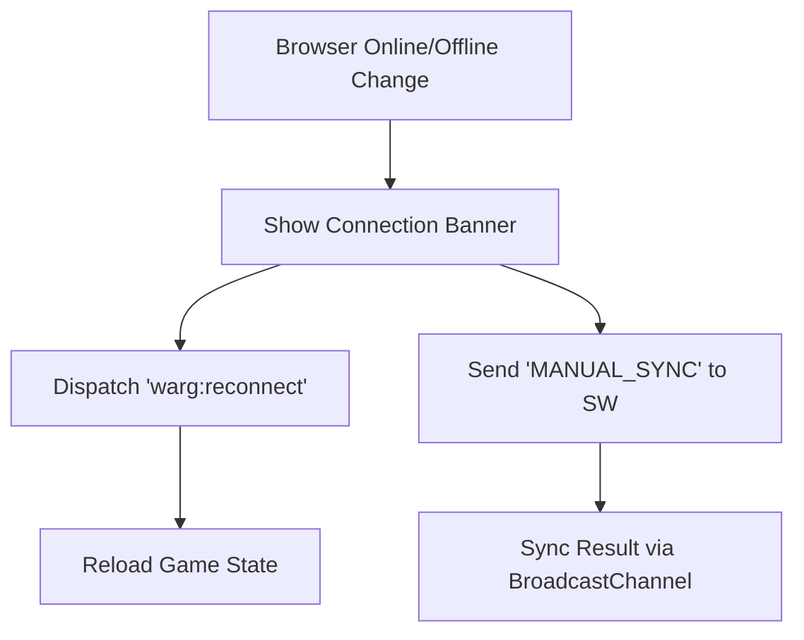
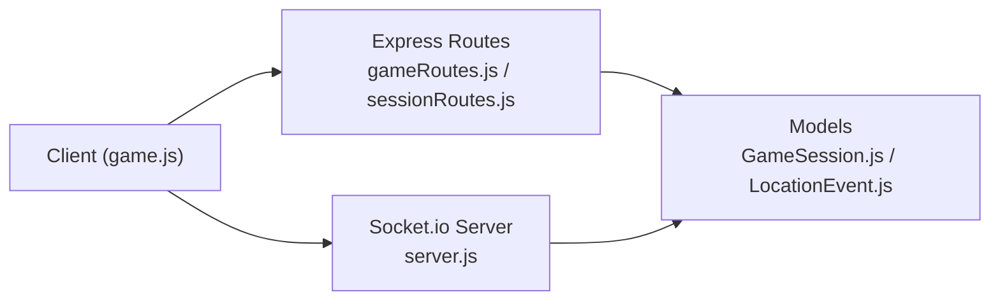
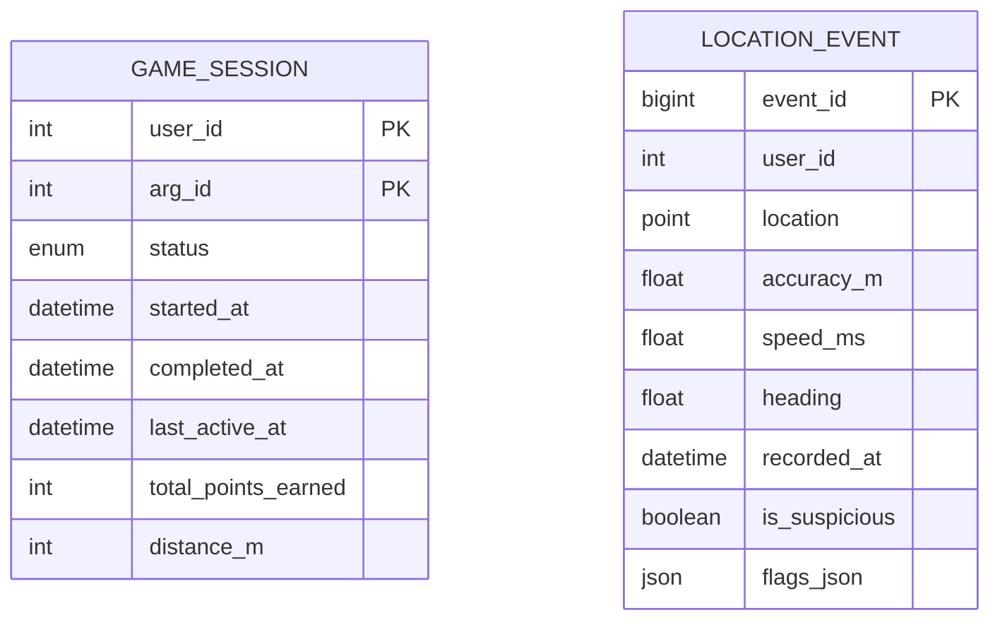

# WebSocket API

<cite>
**Referenced Files in This Document**
- [server.js](file://server/server.js)
- [implementation-details.md](file://warg-docs/docs/2-architecture-and-design/implementation-details.md)
- [spoofing-detection.md](file://warg-docs/docs/2-architecture-and-design/spoofing-detection.md)
- [antiSpoofing.js](file://server/src/middleware/antiSpoofing.js)
- [gameRoutes.js](file://server/src/routes/gameRoutes.js)
- [sessionRoutes.js](file://server/src/routes/sessionRoutes.js)
- [GameSession.js](file://server/src/models/GameSession.js)
- [LocationEvent.js](file://server/src/models/LocationEvent.js)
- [game.js](file://client/scripts/game.js)
</cite>

## Table of Contents
1. [Introduction](#introduction)
2. [Project Structure](#project-structure)
3. [Core Components](#core-components)
4. [Architecture Overview](#architecture-overview)
5. [Detailed Component Analysis](#detailed-component-analysis)
6. [Dependency Analysis](#dependency-analysis)
7. [Performance Considerations](#performance-considerations)
8. [Troubleshooting Guide](#troubleshooting-guide)
9. [Conclusion](#conclusion)
10. [Appendices](#appendices)

## Introduction
This document specifies the real-time communication features for the WARG Platform using WebSockets (Socket.io). It covers connection establishment, message protocols, event types, and lifecycle management. It also documents real-time gameplay updates, location sharing, multiplayer coordination, anti-spoofing alerts, reconnection strategies, and integration examples for live multiplayer experiences and real-time feedback systems.

The platform’s design envisions tick-based game loops where player inputs are transmitted and processed at a defined cadence, with state broadcasts to players within geofenced locations. Rendering is interpolated between ticks for smooth transitions.

**Section sources**
- [implementation-details.md:207-209](file://warg-docs/docs/2-architecture-and-design/implementation-details.md#L207-L209)

## Project Structure
At a high level, the server initializes an HTTP server and attaches Socket.io for real-time communication. The client-side game logic orchestrates session initialization, location tracking, and interactions via REST endpoints; future real-time features will extend this with WebSocket events.

```mermaid
graph TB
Client["Client App<br/>game.js"] --> |HTTP REST| ServerAPI["Express API<br/>gameRoutes.js / sessionRoutes.js"]
Client --> |WebSocket (future)| WS["Socket.io Server<br/>server.js"]
ServerAPI --> DB["Database Models<br/>GameSession.js / LocationEvent.js"]
WS --> DB
```

**Diagram sources**
- [server.js:1-36](file://server/server.js#L1-L36)
- [gameRoutes.js:1-12](file://server/src/routes/gameRoutes.js#L1-L12)
- [sessionRoutes.js:1-9](file://server/src/routes/sessionRoutes.js#L1-L9)
- [GameSession.js:1-19](file://server/src/models/GameSession.js#L1-L19)
- [LocationEvent.js:1-21](file://server/src/models/LocationEvent.js#L1-L21)
- [game.js:143-164](file://client/scripts/game.js#L143-L164)

**Section sources**
- [server.js:1-36](file://server/server.js#L1-L36)
- [game.js:143-164](file://client/scripts/game.js#L143-L164)

## Core Components
- Socket.io Server: Initializes CORS policy and connection handlers.
- Game Session Management: REST endpoints to start, query, and manage sessions.
- Anti-Spoofing Middleware: Validates location submissions and computes trust signals.
- Data Models: Persist game sessions and location events with fields supporting speed, heading, accuracy, and flags.

Key responsibilities:
- Establish secure WebSocket connections with origin validation.
- Provide REST APIs for session control and waypoint interactions.
- Enforce anti-spoofing checks on location submissions.
- Store and index location events for analysis and auditing.

**Section sources**
- [server.js:14-45](file://server/server.js#L14-L45)
- [gameRoutes.js:1-12](file://server/src/routes/gameRoutes.js#L1-L12)
- [sessionRoutes.js:1-9](file://server/src/routes/sessionRoutes.js#L1-L9)
- [antiSpoofing.js:27-66](file://server/src/middleware/antiSpoofing.js#L27-L66)
- [GameSession.js:1-19](file://server/src/models/GameSession.js#L1-L19)
- [LocationEvent.js:1-21](file://server/src/models/LocationEvent.js#L1-L21)

## Architecture Overview
The system combines RESTful services for session and interaction management with planned WebSocket channels for live gameplay. The current server sets up Socket.io and logs connection/disconnection events. Future extensions will broadcast game state updates and coordinate multiplayer actions.



**Diagram sources**
- [server.js:38-45](file://server/server.js#L38-L45)
- [gameRoutes.js:1-12](file://server/src/routes/gameRoutes.js#L1-L12)
- [GameSession.js:1-19](file://server/src/models/GameSession.js#L1-L19)
- [game.js:143-164](file://client/scripts/game.js#L143-L164)

## Detailed Component Analysis

### WebSocket Connection Lifecycle
- Connection Establishment:
  - The server creates a Socket.io instance with CORS configuration that allows origins from environment variables or localhost during development.
  - On connection, the server logs the socket ID.
- Disconnection Handling:
  - A disconnect handler logs when clients disconnect.



**Diagram sources**
- [server.js:14-45](file://server/server.js#L14-L45)

**Section sources**
- [server.js:14-45](file://server/server.js#L14-L45)

### Message Protocols and Event Types
Planned real-time events (based on architecture documentation):
- Tick-based Gameplay Updates:
  - Event: game_tick
  - Payload: { tick_id, timestamp, positions[], actions[] }
  - Purpose: Broadcast updated player positions and actions at each tick.
- Geofenced State Broadcast:
  - Event: location_state_update
  - Payload: { zone_id, players[], state_snapshot }
  - Purpose: Send state snapshots to players within a geofenced area.
- Multiplayer Coordination:
  - Event: multiplayer_action
  - Payload: { action_type, target_player_id, payload }
  - Purpose: Coordinate cooperative actions among players.
- Anti-Spoofing Alerts:
  - Event: anti_spoof_alert
  - Payload: { alert_type, severity, reason, suggested_action }
  - Purpose: Notify clients of suspicious behavior detected by server-side checks.

Note: These events are conceptual and align with the documented plan for live-play games and puzzles.

[No sources needed since this section describes conceptual event types aligned with architecture documentation]

### Real-Time Gameplay Updates
- Input Transmission:
  - Clients send player inputs (e.g., movement, actions) via WebSocket events at a controlled rate.
- Server Processing:
  - Server validates inputs, applies game rules, and computes new state.
- State Broadcasting:
  - Server broadcasts the new state to relevant clients (geofenced or room members).
- Client Interpolation:
  - Clients interpolate between states to render smooth transitions at higher refresh rates.



**Diagram sources**
- [implementation-details.md:207-209](file://warg-docs/docs/2-architecture-and-design/implementation-details.md#L207-L209)

**Section sources**
- [implementation-details.md:207-209](file://warg-docs/docs/2-architecture-and-design/implementation-details.md#L207-L209)

### Location Sharing and Movement Pattern Analysis
- Location Submission:
  - Clients submit location data including latitude, longitude, accuracy, and optional sensor-derived metrics (e.g., steps).
- Anti-Spoofing Checks:
  - Drift detection: Analyzes variance in buffered location samples.
  - Speed detection: Computes distance/time to detect unrealistic speeds.
  - Pedometer integration: Correlates step counts with distance covered.
- Trust Scoring:
  - Adjusts user trust scores based on check outcomes and flags anomalies.



**Diagram sources**
- [antiSpoofing.js:27-66](file://server/src/middleware/antiSpoofing.js#L27-L66)
- [spoofing-detection.md:26-46](file://warg-docs/docs/2-architecture-and-design/spoofing-detection.md#L26-L46)

**Section sources**
- [antiSpoofing.js:27-66](file://server/src/middleware/antiSpoofing.js#L27-L66)
- [spoofing-detection.md:26-46](file://warg-docs/docs/2-architecture-and-design/spoofing-detection.md#L26-L46)

### Collaborative Gameplay Features
- Room/Zone Membership:
  - Players join rooms or zones based on geolocation or explicit invites.
- Shared State:
  - Real-time shared state includes player positions, objectives, and collaborative tasks.
- Coordination Events:
  - Events enable cooperative actions such as joint puzzles or synchronized challenges.

[No sources needed since this section provides general guidance]

### Reconnection Strategies
- Online/Offline Detection:
  - The client monitors browser online/offline status and displays a banner indicating sync state.
- Reconnect Event:
  - Dispatches a custom event to trigger state reconciliation and data reload upon reconnection.
- Service Worker Sync:
  - Uses service worker messaging to request manual sync when available.



**Diagram sources**
- [game.js:14-48](file://client/scripts/game.js#L14-L48)
- [game.js:124-129](file://client/scripts/game.js#L124-L129)

**Section sources**
- [game.js:14-48](file://client/scripts/game.js#L14-L48)
- [game.js:124-129](file://client/scripts/game.js#L124-L129)

### Integration Examples
- Live Multiplayer Experiences:
  - Use WebSocket events to synchronize player inputs and broadcast state snapshots at tick intervals.
  - Implement client-side interpolation to smooth rendering between ticks.
- Real-Time Feedback Systems:
  - Emit anti-spoofing alerts to inform clients of suspicious activity and adjust UI accordingly.
  - Provide immediate feedback for successful or failed interactions based on server responses.

[No sources needed since this section provides general guidance]

## Dependency Analysis
The WebSocket layer depends on the HTTP server and integrates with Express routes and database models. The client interacts with both REST endpoints and (planned) WebSocket events.



**Diagram sources**
- [server.js:1-36](file://server/server.js#L1-L36)
- [gameRoutes.js:1-12](file://server/src/routes/gameRoutes.js#L1-L12)
- [sessionRoutes.js:1-9](file://server/src/routes/sessionRoutes.js#L1-L9)
- [GameSession.js:1-19](file://server/src/models/GameSession.js#L1-L19)
- [LocationEvent.js:1-21](file://server/src/models/LocationEvent.js#L1-L21)
- [game.js:143-164](file://client/scripts/game.js#L143-L164)

**Section sources**
- [server.js:1-36](file://server/server.js#L1-L36)
- [gameRoutes.js:1-12](file://server/src/routes/gameRoutes.js#L1-L12)
- [sessionRoutes.js:1-9](file://server/src/routes/sessionRoutes.js#L1-L9)
- [GameSession.js:1-19](file://server/src/models/GameSession.js#L1-L19)
- [LocationEvent.js:1-21](file://server/src/models/LocationEvent.js#L1-L21)
- [game.js:143-164](file://client/scripts/game.js#L143-L164)

## Performance Considerations
- Tick Rate Tuning:
  - Choose an appropriate tick interval to balance responsiveness and bandwidth usage.
- Interpolation:
  - Render at higher refresh rates and interpolate between state snapshots to reduce perceived latency.
- Bandwidth Optimization:
  - Compress payloads and limit broadcast scope to geofenced areas or specific rooms.
- Connection Stability:
  - Implement exponential backoff for reconnections and handle partial failures gracefully.

[No sources needed since this section provides general guidance]

## Troubleshooting Guide
- WebSocket Connection Failures:
  - Verify CORS configuration and ensure allowed origins include the client’s domain.
  - Check server logs for connection and disconnection events.
- Anti-Spoofing False Positives:
  - Review drift thresholds and speed limits; adjust parameters if necessary.
  - Ensure accurate sensor data collection (steps, accelerometer) on the client.
- Reconnection Issues:
  - Confirm online/offline event handling and service worker sync messages.
  - Validate that state reload triggers on reconnect events.

**Section sources**
- [server.js:14-45](file://server/server.js#L14-L45)
- [antiSpoofing.js:27-66](file://server/src/middleware/antiSpoofing.js#L27-L66)
- [game.js:14-48](file://client/scripts/game.js#L14-L48)
- [game.js:124-129](file://client/scripts/game.js#L124-L129)

## Conclusion
The WARG Platform establishes a foundation for real-time communication through Socket.io and robust REST APIs for session and interaction management. Planned WebSocket events will enable live gameplay, coordinated multiplayer experiences, and real-time feedback. Anti-spoofing mechanisms protect integrity by analyzing location patterns and sensor data. With careful tuning of tick rates, interpolation, and reconnection strategies, the system can deliver smooth, responsive, and secure real-time experiences.

[No sources needed since this section summarizes without analyzing specific files]

## Appendices

### Data Models Reference
- GameSession: Tracks user sessions, status, timestamps, points, and distance.
- LocationEvent: Stores location coordinates, accuracy, speed, heading, timestamps, suspicion flags, and additional metadata.



**Diagram sources**
- [GameSession.js:1-19](file://server/src/models/GameSession.js#L1-L19)
- [LocationEvent.js:1-21](file://server/src/models/LocationEvent.js#L1-L21)