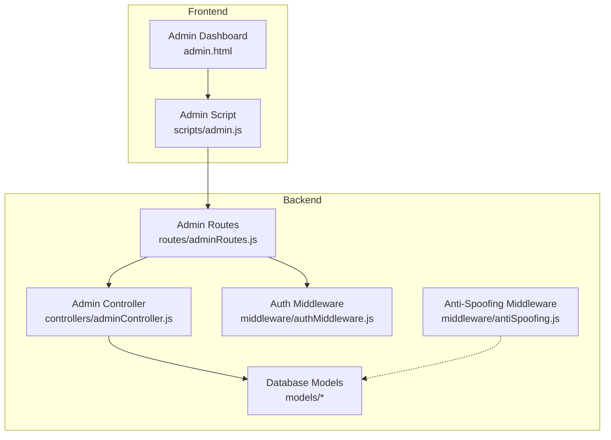
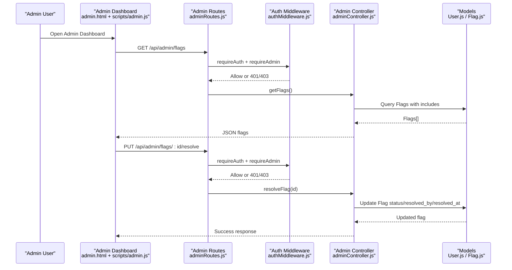
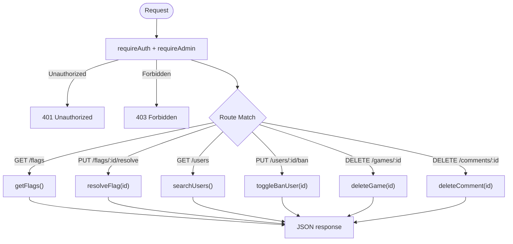
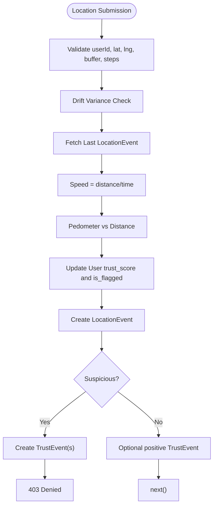
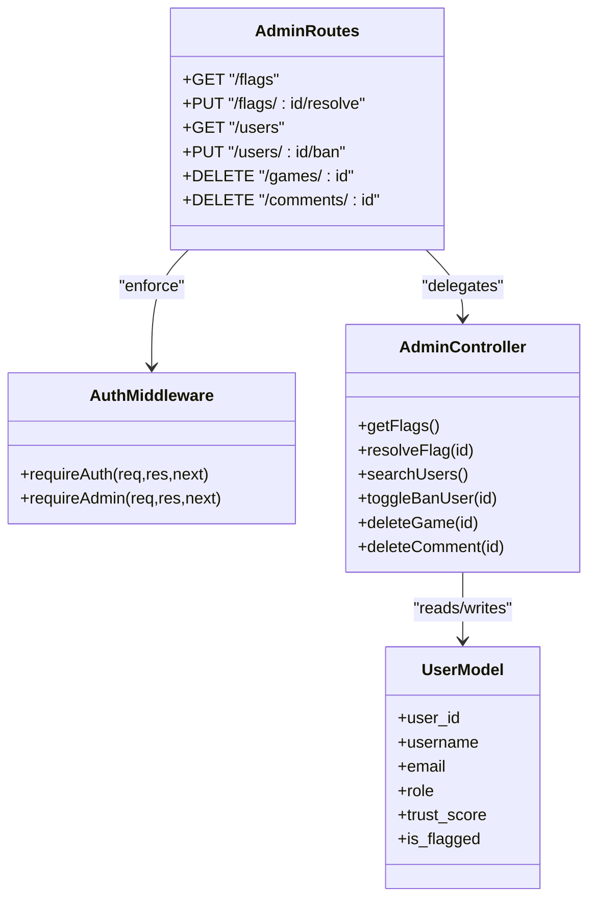
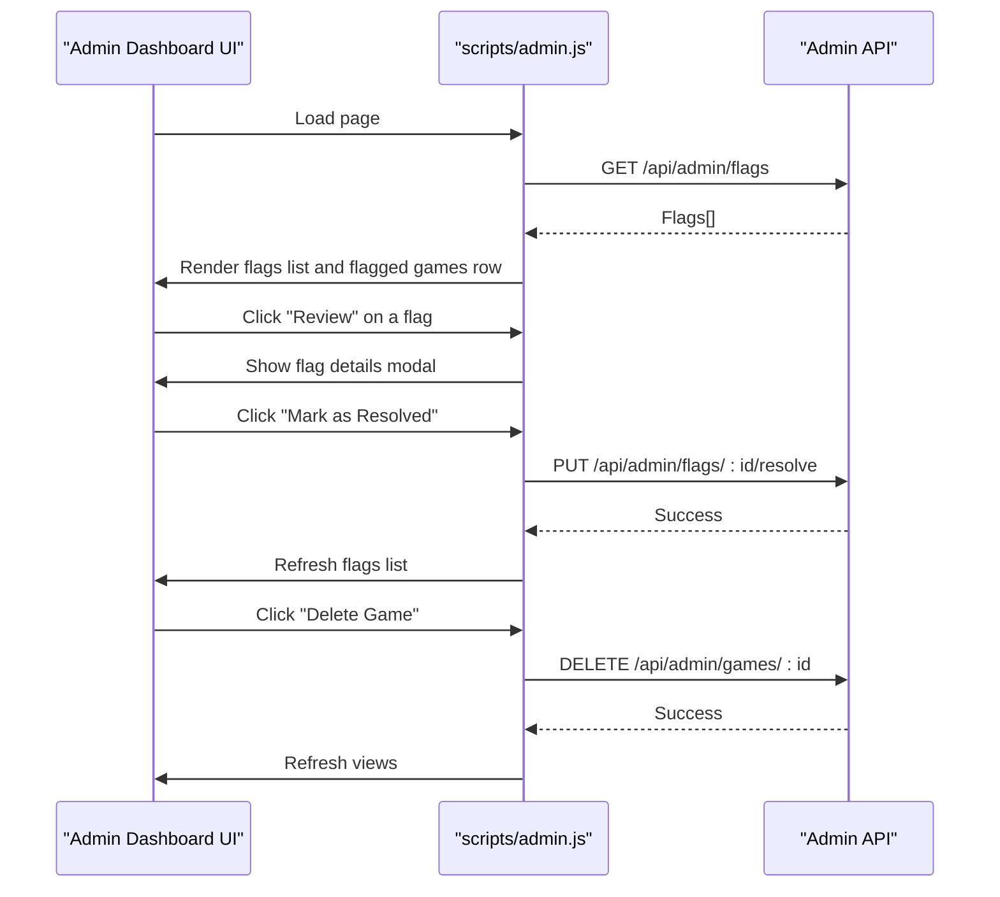
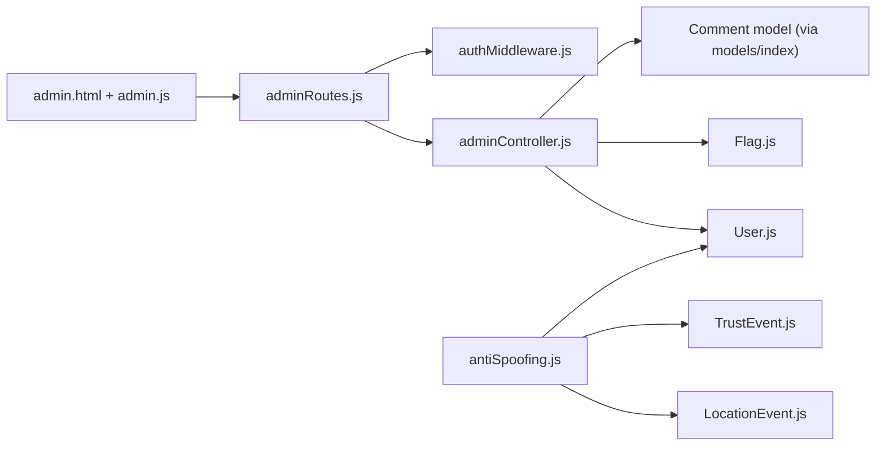
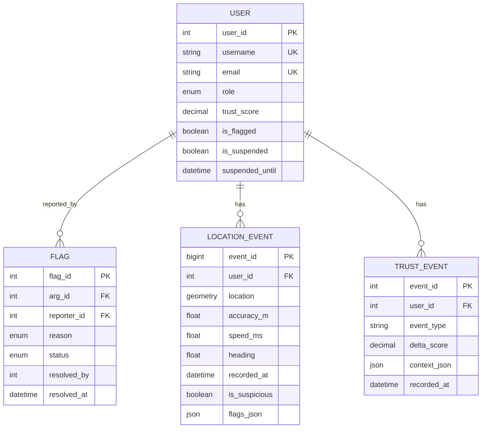

# Administrative APIs

<cite>
**Referenced Files in This Document**
- [adminRoutes.js](file://server/src/routes/adminRoutes.js)
- [adminController.js](file://server/src/controllers/adminController.js)
- [authMiddleware.js](file://server/src/middleware/authMiddleware.js)
- [antiSpoofing.js](file://server/src/middleware/antiSpoofing.js)
- [User.js](file://server/src/models/User.js)
- [Flag.js](file://server/src/models/Flag.js)
- [LocationEvent.js](file://server/src/models/LocationEvent.js)
- [TrustEvent.js](file://server/src/models/TrustEvent.js)
- [admin.html](file://client/admin.html)
- [admin.js](file://client/scripts/admin.js)
- [admin-security.md](file://warg-docs/docs/5-policies/admin-security.md)
- [spoofing-detection.md](file://warg-docs/docs/2-architecture-and-design/spoofing-detection.md)
</cite>

## Table of Contents
1. [Introduction](#introduction)
2. [Project Structure](#project-structure)
3. [Core Components](#core-components)
4. [Architecture Overview](#architecture-overview)
5. [Detailed Component Analysis](#detailed-component-analysis)
6. [Dependency Analysis](#dependency-analysis)
7. [Performance Considerations](#performance-considerations)
8. [Troubleshooting Guide](#troubleshooting-guide)
9. [Conclusion](#conclusion)
10. [Appendices](#appendices)

## Introduction
This document describes the administrative and system management capabilities of the WARG Platform with a focus on:
- Admin-only endpoints for user management, content moderation, and operational controls
- Anti-spoofing mechanisms including GPS drift detection, speed checks, pedometer correlation, trust scoring, and audit logging
- Security measures for admin access, privilege enforcement, and compliance reporting
- Administrative workflows via the Admin Dashboard UI
- Guidance for extending system health checks, performance metrics collection, database maintenance, cache management, and configuration tools

Where applicable, this document maps concepts to concrete source files and provides diagrams that visualize request flows, data models, and security boundaries.

## Project Structure
The administrative surface is implemented as:
- Backend Express routes under server routes
- Controllers handling business logic
- Middleware enforcing authentication and anti-spoofing
- Data models representing users, flags, location events, and trust events
- Frontend Admin Dashboard HTML and JavaScript interacting with the backend

**Diagram sources**
- [adminRoutes.js:1-19](file://server/src/routes/adminRoutes.js#L1-L19)
- [adminController.js:1-124](file://server/src/controllers/adminController.js#L1-L124)
- [authMiddleware.js:1-22](file://server/src/middleware/authMiddleware.js#L1-L22)
- [antiSpoofing.js:1-168](file://server/src/middleware/antiSpoofing.js#L1-L168)
- [User.js:1-28](file://server/src/models/User.js#L1-L28)
- [Flag.js:1-36](file://server/src/models/Flag.js#L1-L36)
- [LocationEvent.js:1-21](file://server/src/models/LocationEvent.js#L1-L21)
- [TrustEvent.js:1-17](file://server/src/models/TrustEvent.js#L1-L17)
- [admin.html:1-182](file://client/admin.html#L1-L182)
- [admin.js:1-272](file://client/scripts/admin.js#L1-L272)

**Section sources**
- [adminRoutes.js:1-19](file://server/src/routes/adminRoutes.js#L1-L19)
- [adminController.js:1-124](file://server/src/controllers/adminController.js#L1-L124)
- [authMiddleware.js:1-22](file://server/src/middleware/authMiddleware.js#L1-L22)
- [antiSpoofing.js:1-168](file://server/src/middleware/antiSpoofing.js#L1-L168)
- [admin.html:1-182](file://client/admin.html#L1-L182)
- [admin.js:1-272](file://client/scripts/admin.js#L1-L272)

## Core Components
- Admin API routes expose moderation and user management operations behind admin authorization.
- The admin controller implements flag review, user search/ban toggling, and content deletion.
- Auth middleware enforces both general authentication and admin role checks.
- Anti-spoofing middleware evaluates location submissions for anomalies and updates trust profiles.
- Data models define users, flags, location events, and trust events used by these components.

Key responsibilities:
- Route layer: URL mapping and minimal request validation
- Controller layer: Business logic, model interactions, error handling
- Middleware layer: Security (auth), integrity (anti-spoofing)
- Model layer: Schema definitions and ORM usage

**Section sources**
- [adminRoutes.js:1-19](file://server/src/routes/adminRoutes.js#L1-L19)
- [adminController.js:1-124](file://server/src/controllers/adminController.js#L1-L124)
- [authMiddleware.js:1-22](file://server/src/middleware/authMiddleware.js#L1-L22)
- [antiSpoofing.js:1-168](file://server/src/middleware/antiSpoofing.js#L1-L168)
- [User.js:1-28](file://server/src/models/User.js#L1-L28)
- [Flag.js:1-36](file://server/src/models/Flag.js#L1-L36)
- [LocationEvent.js:1-21](file://server/src/models/LocationEvent.js#L1-L21)
- [TrustEvent.js:1-17](file://server/src/models/TrustEvent.js#L1-L17)

## Architecture Overview
The administrative workflow integrates frontend actions with backend enforcement and data persistence.

**Diagram sources**
- [adminRoutes.js:9-10](file://server/src/routes/adminRoutes.js#L9-L10)
- [authMiddleware.js:1-22](file://server/src/middleware/authMiddleware.js#L1-L22)
- [adminController.js:4-43](file://server/src/controllers/adminController.js#L4-L43)
- [Flag.js:1-36](file://server/src/models/Flag.js#L1-L36)
- [admin.js:34-84](file://client/scripts/admin.js#L34-L84)
- [admin.js:118-141](file://client/scripts/admin.js#L118-L141)

## Detailed Component Analysis

### Admin API Endpoints
The following admin-only endpoints are defined:

- GET /api/admin/flags
  - Purpose: List open/reviewing flags with reporter and related game context
  - Authorization: requireAuth + requireAdmin
  - Response: Array of flags with included reporter and ARG metadata
  - Error handling: Returns 500 on internal errors

- PUT /api/admin/flags/:id/resolve
  - Purpose: Mark a flag as resolved, recording admin identity and timestamp
  - Authorization: requireAuth + requireAdmin
  - Input: Flag ID in path
  - Response: Updated flag object and success message
  - Error handling: 404 if not found; 500 on internal errors

- GET /api/admin/users
  - Purpose: Search users by username or email, returning trust indicators
  - Authorization: requireAuth + requireAdmin
  - Query parameters: search (optional)
  - Response: Users sorted by trust score ascending, limited to 50
  - Error handling: 500 on internal errors

- PUT /api/admin/users/:id/ban
  - Purpose: Toggle user ban status (is_flagged)
  - Authorization: requireAuth + requireAdmin
  - Input: User ID in path
  - Response: Updated user and confirmation message
  - Error handling: 404 if not found; 500 on internal errors

- DELETE /api/admin/games/:id
  - Purpose: Delete an ARG (game) by ID
  - Authorization: requireAuth + requireAdmin
  - Input: Game ID in path
  - Response: Success message
  - Error handling: 404 if not found; 500 on internal errors

- DELETE /api/admin/comments/:id
  - Purpose: Delete a comment by ID
  - Authorization: requireAuth + requireAdmin
  - Input: Comment ID in path
  - Response: Success message
  - Error handling: 404 if not found; 500 on internal errors

**Diagram sources**
- [adminRoutes.js:9-16](file://server/src/routes/adminRoutes.js#L9-L16)
- [adminController.js:4-123](file://server/src/controllers/adminController.js#L4-L123)
- [authMiddleware.js:1-22](file://server/src/middleware/authMiddleware.js#L1-L22)

**Section sources**
- [adminRoutes.js:9-16](file://server/src/routes/adminRoutes.js#L9-L16)
- [adminController.js:4-123](file://server/src/controllers/adminController.js#L4-L123)

### Anti-Spoofing Mechanisms
The anti-spoofing middleware performs multi-layered checks on location submissions:

- Drift detection: Analyzes variance of buffered coordinates; extremely low variance indicates static spoofing
- Speed check: Computes distance over time between last known location and current submission; rejects if exceeding walking speed thresholds
- Pedometer correlation: Compares reported steps with geographical distance; flags mismatches
- Trust profile updates: Adjusts user trust_score and may set is_flagged when trust falls below threshold
- Audit logging: Persists LocationEvent records and TrustEvent entries for suspicious or positive interactions

**Diagram sources**
- [antiSpoofing.js:27-164](file://server/src/middleware/antiSpoofing.js#L27-L164)
- [LocationEvent.js:1-21](file://server/src/models/LocationEvent.js#L1-L21)
- [TrustEvent.js:1-17](file://server/src/models/TrustEvent.js#L1-L17)
- [User.js:1-28](file://server/src/models/User.js#L1-L28)

**Section sources**
- [antiSpoofing.js:27-164](file://server/src/middleware/antiSpoofing.js#L27-L164)
- [spoofing-detection.md:1-46](file://warg-docs/docs/2-architecture-and-design/spoofing-detection.md#L1-L46)

### Admin Access Security and Privilege Enforcement
Security model highlights:
- Authentication required for all admin endpoints
- Role-based access control enforced at the backend using requireAdmin middleware
- Frontend gating complements backend enforcement but is not a security boundary
- Banned users (is_flagged) are blocked from authenticated operations

**Diagram sources**
- [authMiddleware.js:1-22](file://server/src/middleware/authMiddleware.js#L1-L22)
- [adminRoutes.js:1-19](file://server/src/routes/adminRoutes.js#L1-L19)
- [adminController.js:1-124](file://server/src/controllers/adminController.js#L1-L124)
- [User.js:1-28](file://server/src/models/User.js#L1-L28)

**Section sources**
- [authMiddleware.js:1-22](file://server/src/middleware/authMiddleware.js#L1-L22)
- [admin-security.md:1-45](file://warg-docs/docs/5-policies/admin-security.md#L1-L45)

### Admin Dashboard Workflows
The Admin Dashboard provides:
- Viewing recent flagged games and flag reports
- Resolving flags through a modal workflow
- Deleting games associated with flagged content
- Searching users and toggling ban status

**Diagram sources**
- [admin.html:114-175](file://client/admin.html#L114-L175)
- [admin.js:15-84](file://client/scripts/admin.js#L15-L84)
- [admin.js:118-169](file://client/scripts/admin.js#L118-L169)
- [admin.js:179-270](file://client/scripts/admin.js#L179-L270)

**Section sources**
- [admin.html:114-175](file://client/admin.html#L114-L175)
- [admin.js:15-84](file://client/scripts/admin.js#L15-L84)
- [admin.js:118-169](file://client/scripts/admin.js#L118-L169)
- [admin.js:179-270](file://client/scripts/admin.js#L179-L270)

## Dependency Analysis
The administrative subsystem depends on:
- Express routing and middleware stack
- Sequelize ORM models for users, flags, location events, and trust events
- Client-side JavaScript for dashboard interactions

**Diagram sources**
- [adminRoutes.js:1-19](file://server/src/routes/adminRoutes.js#L1-L19)
- [adminController.js:1-124](file://server/src/controllers/adminController.js#L1-L124)
- [authMiddleware.js:1-22](file://server/src/middleware/authMiddleware.js#L1-L22)
- [antiSpoofing.js:1-168](file://server/src/middleware/antiSpoofing.js#L1-L168)
- [User.js:1-28](file://server/src/models/User.js#L1-L28)
- [Flag.js:1-36](file://server/src/models/Flag.js#L1-L36)
- [LocationEvent.js:1-21](file://server/src/models/LocationEvent.js#L1-L21)
- [TrustEvent.js:1-17](file://server/src/models/TrustEvent.js#L1-L17)
- [admin.html:1-182](file://client/admin.html#L1-L182)
- [admin.js:1-272](file://client/scripts/admin.js#L1-L272)

**Section sources**
- [adminRoutes.js:1-19](file://server/src/routes/adminRoutes.js#L1-L19)
- [adminController.js:1-124](file://server/src/controllers/adminController.js#L1-L124)
- [antiSpoofing.js:1-168](file://server/src/middleware/antiSpoofing.js#L1-L168)
- [admin.html:1-182](file://client/admin.html#L1-L182)
- [admin.js:1-272](file://client/scripts/admin.js#L1-L272)

## Performance Considerations
- Anti-spoofing middleware performs database reads for the last location event per request; consider caching recent location lookups where appropriate.
- Trust score updates and event logging occur on every location submission; batch or throttle writes during high-frequency interactions.
- Admin queries include joins and ordering; ensure indexes exist on frequently filtered fields such as user identifiers and timestamps.
- Pagination and limits are applied in some admin endpoints (e.g., user search limit); extend pagination for large datasets.

[No sources needed since this section provides general guidance]

## Troubleshooting Guide
Common issues and resolutions:
- 401 Unauthorized: Ensure the admin user is authenticated before calling admin endpoints.
- 403 Forbidden: Verify the authenticated user has the admin role; non-admin roles will be denied.
- 404 Not Found: Confirm the resource ID exists before attempting delete or resolve operations.
- Internal server errors: Review console logs in the controller and middleware layers for database or processing failures.

Operational tips:
- Use the Admin Dashboard to inspect flags and user statuses visually.
- Validate client payloads for location submissions to avoid unnecessary anti-spoofing rejections.
- Monitor trust events and location events for patterns indicating abuse or misconfiguration.

**Section sources**
- [authMiddleware.js:1-22](file://server/src/middleware/authMiddleware.js#L1-L22)
- [adminController.js:4-123](file://server/src/controllers/adminController.js#L4-L123)
- [antiSpoofing.js:160-164](file://server/src/middleware/antiSpoofing.js#L160-L164)

## Conclusion
The WARG Platform’s administrative APIs provide robust moderation and user management capabilities backed by strict authorization and comprehensive anti-spoofing protections. The Admin Dashboard offers practical workflows for reviewing flags, managing users, and removing problematic content. Extending the system with health checks, performance metrics, database maintenance tools, and configuration management should follow the established patterns of middleware-driven security, model-backed persistence, and clear error handling.

[No sources needed since this section summarizes without analyzing specific files]

## Appendices

### Data Models Overview

**Diagram sources**
- [User.js:1-28](file://server/src/models/User.js#L1-L28)
- [Flag.js:1-36](file://server/src/models/Flag.js#L1-L36)
- [LocationEvent.js:1-21](file://server/src/models/LocationEvent.js#L1-L21)
- [TrustEvent.js:1-17](file://server/src/models/TrustEvent.js#L1-L17)

### Administrative Workflow Examples
- Flag resolution workflow:
  - Admin opens dashboard, reviews flags, resolves a flag, and refreshes the list
- User ban workflow:
  - Admin searches for a user, toggles ban status, and verifies the change in the results list

These workflows are implemented in the Admin Dashboard JavaScript and call the corresponding admin endpoints.

**Section sources**
- [admin.js:118-169](file://client/scripts/admin.js#L118-L169)
- [admin.js:238-270](file://client/scripts/admin.js#L238-L270)