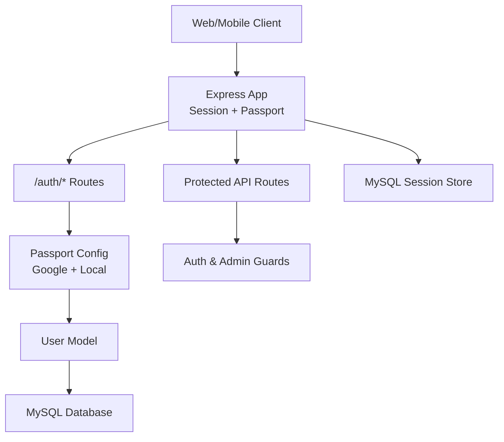
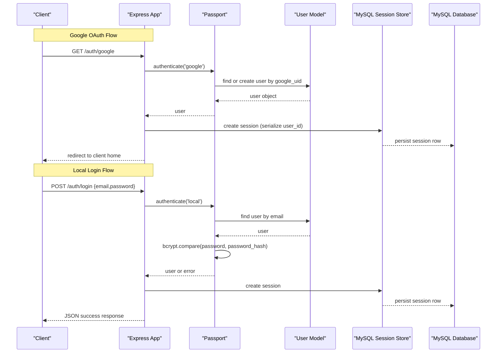
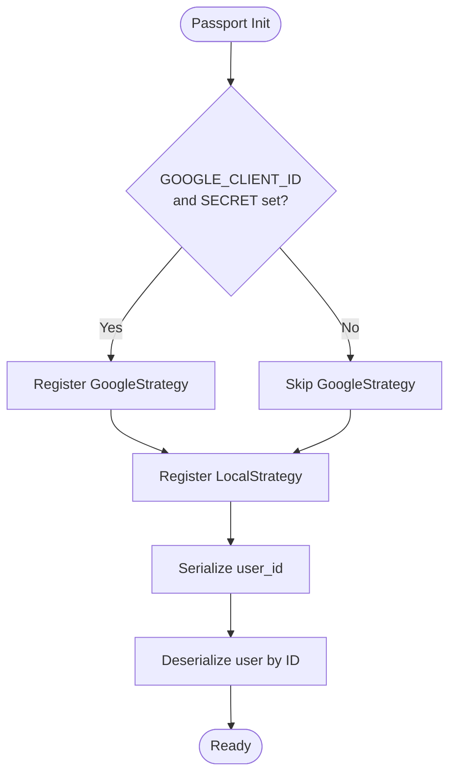
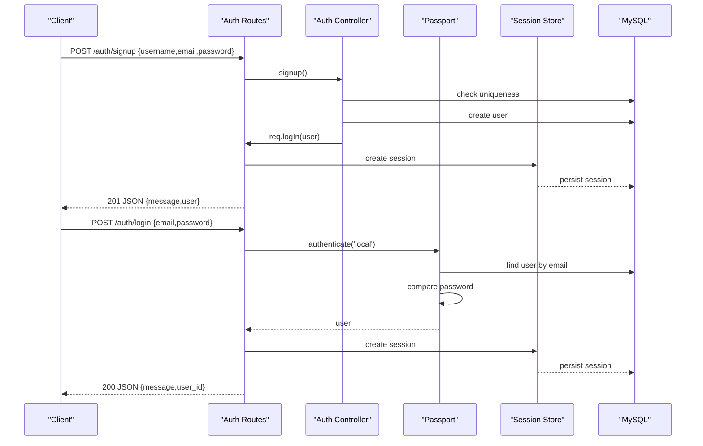
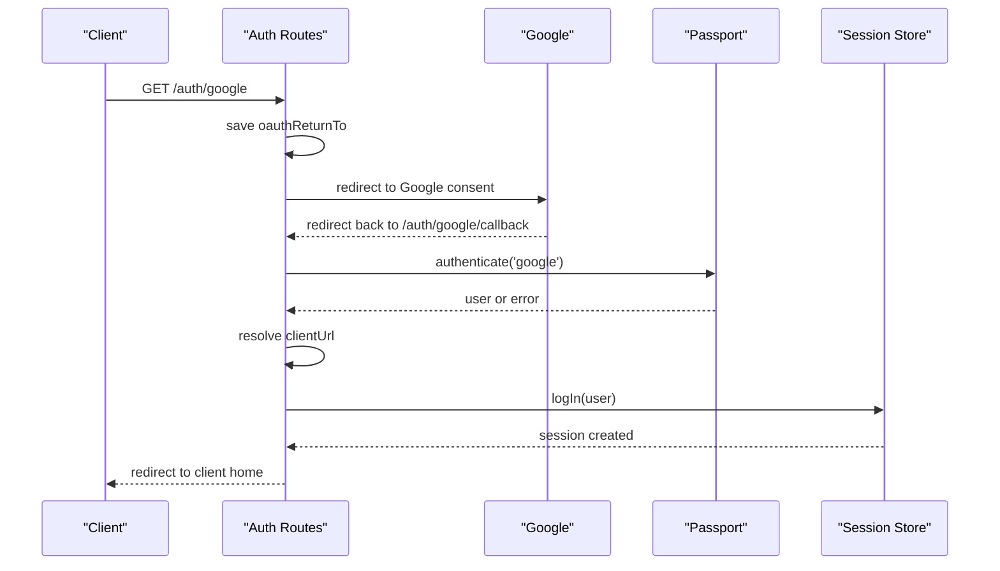
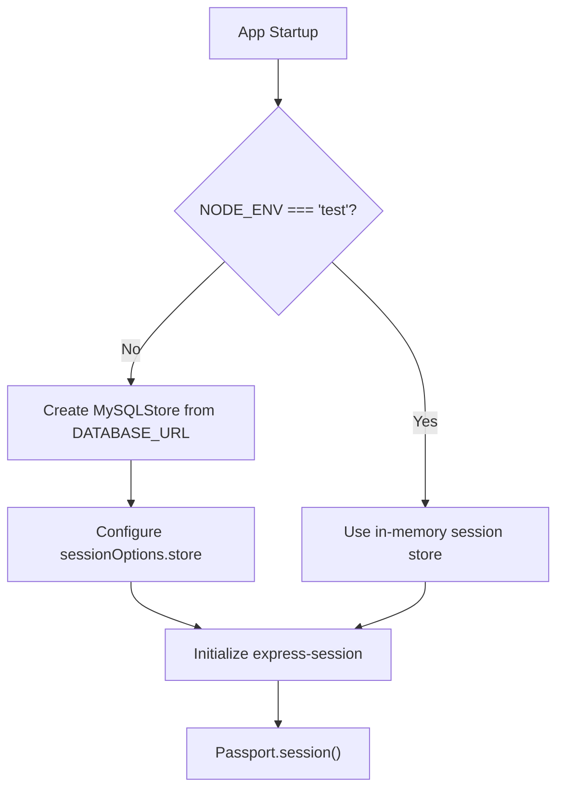
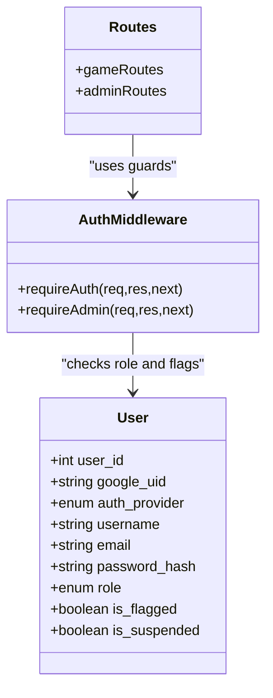
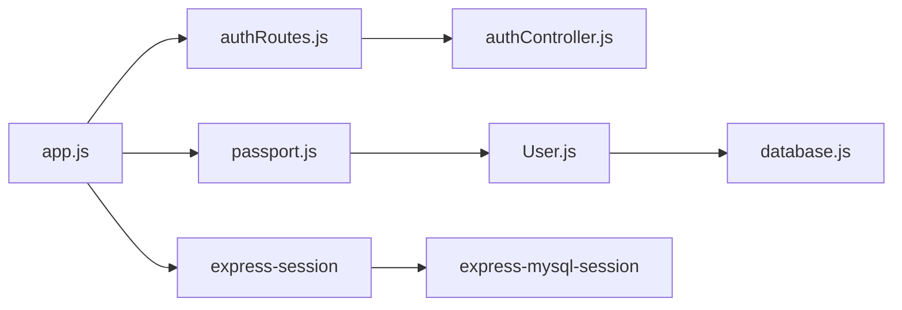

# Authentication System

<cite>
**Referenced Files in This Document**   
- [passport.js](file://server/src/config/passport.js)
- [authController.js](file://server/src/controllers/authController.js)
- [authMiddleware.js](file://server/src/middleware/authMiddleware.js)
- [User.js](file://server/src/models/User.js)
- [authRoutes.js](file://server/src/routes/authRoutes.js)
- [database.js](file://server/src/config/database.js)
- [app.js](file://server/src/app.js)
- [schema.sql](file://database/schema.sql)
</cite>

## Table of Contents
1. [Introduction](#introduction)
2. [Project Structure](#project-structure)
3. [Core Components](#core-components)
4. [Architecture Overview](#architecture-overview)
5. [Detailed Component Analysis](#detailed-component-analysis)
6. [Dependency Analysis](#dependency-analysis)
7. [Performance Considerations](#performance-considerations)
8. [Troubleshooting Guide](#troubleshooting-guide)
9. [Conclusion](#conclusion)

## Introduction
This document explains the WARG Platform authentication system. It covers:
- Passport.js configuration with Google OAuth and local username/password login
- Session management backed by MySQL for horizontal scalability
- Role-based access control (RBAC) using player, creator, and admin roles
- Middleware guards for protecting routes
- Security best practices and practical integration patterns for web and mobile clients

The backend is an Express application that uses Passport strategies, express-session with a MySQL session store, Sequelize models, and role-aware middleware to protect API endpoints.

## Project Structure
Authentication-related code is organized into configuration, controllers, middleware, models, and routes:
- Configuration: Passport strategies and database connection
- Controllers: Local signup and user existence checks
- Middleware: Authentication and authorization guards
- Models: User entity with roles and flags
- Routes: Public auth endpoints and protected route mounting

**Diagram sources**
- [app.js:26-117](file://server/src/app.js#L26-L117)
- [authRoutes.js:1-124](file://server/src/routes/authRoutes.js#L1-L124)
- [passport.js:1-99](file://server/src/config/passport.js#L1-L99)
- [User.js:1-28](file://server/src/models/User.js#L1-L28)
- [database.js:1-38](file://server/src/config/database.js#L1-L38)

**Section sources**
- [app.js:26-117](file://server/src/app.js#L26-L117)
- [authRoutes.js:1-124](file://server/src/routes/authRoutes.js#L1-L124)
- [passport.js:1-99](file://server/src/config/passport.js#L1-L99)
- [User.js:1-28](file://server/src/models/User.js#L1-L28)
- [database.js:1-38](file://server/src/config/database.js#L1-L38)

## Core Components
- Passport configuration:
  - Google OAuth strategy (optional, requires environment variables)
  - Local strategy for email/password login
  - Serialize/deserialize user ID into sessions
- Auth controller:
  - Local signup with password hashing
  - Username/email uniqueness validation
  - User existence check endpoint
- Auth middleware:
  - requireAuth: ensures authenticated users and bans
  - requireAdmin: restricts to admin role
- User model:
  - Roles: player, creator, admin
  - Flags: is_flagged, is_suspended
  - Provider linkage via google_uid and auth_provider
- Routes:
  - Google OAuth initiation and callback
  - Local login/logout
  - Signup and user existence checks
  - Current user profile endpoint
- Session management:
  - express-session with MySQL-backed store in production
  - Cookie security settings (httpOnly, secure, sameSite)

**Section sources**
- [passport.js:1-99](file://server/src/config/passport.js#L1-L99)
- [authController.js:1-83](file://server/src/controllers/authController.js#L1-L83)
- [authMiddleware.js:1-22](file://server/src/middleware/authMiddleware.js#L1-L22)
- [User.js:1-28](file://server/src/models/User.js#L1-L28)
- [authRoutes.js:1-124](file://server/src/routes/authRoutes.js#L1-L124)
- [app.js:50-84](file://server/src/app.js#L50-L84)

## Architecture Overview
The authentication architecture combines stateful sessions with role-based protection:

**Diagram sources**
- [authRoutes.js:6-81](file://server/src/routes/authRoutes.js#L6-L81)
- [passport.js:8-95](file://server/src/config/passport.js#L8-L95)
- [User.js:1-28](file://server/src/models/User.js#L1-L28)
- [app.js:62-84](file://server/src/app.js#L62-L84)

## Detailed Component Analysis

### Passport Configuration
- Google OAuth Strategy:
  - Conditionally registered when GOOGLE_CLIENT_ID and GOOGLE_CLIENT_SECRET are set
  - Callback URL defaults to /auth/google/callback
  - On successful OAuth:
    - Existing user: returns user if not banned
    - New user: creates account with google_uid, auth_provider='google', username from displayName or generated fallback, email from profile
  - Banned users receive a rejection message
- Local Strategy:
  - Uses email and password fields
  - Validates user existence, ban status, and presence of password_hash
  - Compares password using bcrypt
- Serialization:
  - Serializes user_id into session
  - Deserializes full user object on each request, excluding sensitive fields like session_token

**Diagram sources**
- [passport.js:24-64](file://server/src/config/passport.js#L24-L64)
- [passport.js:66-95](file://server/src/config/passport.js#L66-L95)
- [passport.js:8-22](file://server/src/config/passport.js#L8-L22)

**Section sources**
- [passport.js:1-99](file://server/src/config/passport.js#L1-L99)

### Local Authentication Flow
- Signup:
  - Validates required fields
  - Checks uniqueness of email and username
  - Hashes password and creates user with auth_provider='local'
  - Logs user in immediately after signup
- Login:
  - Uses passport.authenticate('local')
  - Creates session and returns success JSON
- Logout:
  - Destroys session and clears cookie

**Diagram sources**
- [authRoutes.js:57-81](file://server/src/routes/authRoutes.js#L57-L81)
- [authController.js:5-61](file://server/src/controllers/authController.js#L5-L61)
- [passport.js:66-95](file://server/src/config/passport.js#L66-L95)

**Section sources**
- [authController.js:1-83](file://server/src/controllers/authController.js#L1-L83)
- [authRoutes.js:57-95](file://server/src/routes/authRoutes.js#L57-L95)

### Google OAuth Integration
- Initiation:
  - GET /auth/google stores the originating origin in session for post-login redirect
  - Redirects to Google consent screen with profile and email scopes
- Callback:
  - GET /auth/google/callback authenticates via Passport
  - Determines redirect URL from session, CLIENT_PAGES_URL, or CLIENT_URL
  - Cleans up session data and logs user in
  - Redirects to client home page

**Diagram sources**
- [authRoutes.js:6-55](file://server/src/routes/authRoutes.js#L6-L55)
- [passport.js:24-64](file://server/src/config/passport.js#L24-L64)

**Section sources**
- [authRoutes.js:6-55](file://server/src/routes/authRoutes.js#L6-L55)
- [passport.js:24-64](file://server/src/config/passport.js#L24-L64)

### Session Management with MySQL Backing
- Session options:
  - Secret from SESSION_SECRET or dev default
  - Cookie: httpOnly enabled; secure and sameSite configured per environment
  - maxAge set to 24 hours
- MySQL session store:
  - In non-test environments, uses express-mysql-session with DATABASE_URL
  - Auto-creates session table if missing
  - Expiration set to 24 hours
- Test environment:
  - Falls back to in-memory store to avoid requiring persistent sessions

**Diagram sources**
- [app.js:50-84](file://server/src/app.js#L50-L84)

**Section sources**
- [app.js:50-84](file://server/src/app.js#L50-L84)

### Role-Based Access Control (RBAC)
- Roles:
  - player, creator, admin defined in the User model
- Guards:
  - requireAuth: allows only authenticated users; blocks banned accounts
  - requireAdmin: allows only users with role=admin
- Route protection:
  - Game routes require authentication
  - Admin routes require both authentication and admin role

**Diagram sources**
- [User.js:4-19](file://server/src/models/User.js#L4-L19)
- [authMiddleware.js:1-22](file://server/src/middleware/authMiddleware.js#L1-L22)
- [app.js:110-117](file://server/src/app.js#L110-L117)

**Section sources**
- [User.js:1-28](file://server/src/models/User.js#L1-L28)
- [authMiddleware.js:1-22](file://server/src/middleware/authMiddleware.js#L1-L22)
- [app.js:110-117](file://server/src/app.js#L110-L117)

### Token Validation and Security Best Practices
- Password handling:
  - bcrypt used for hashing and comparison
- Session security:
  - httpOnly cookies prevent client-side script access
  - secure flag enforced in production
  - sameSite set to none in production for cross-site scenarios
- CORS:
  - Allowed origins parsed from CLIENT_URL; localhost allowed in development
- Ban enforcement:
  - Both Passport strategies and requireAuth guard reject banned users
- Environment-driven behavior:
  - Google strategy registration depends on environment variables
  - Session store switches between MySQL and in-memory based on NODE_ENV

**Section sources**
- [passport.js:24-95](file://server/src/config/passport.js#L24-L95)
- [authMiddleware.js:1-22](file://server/src/middleware/authMiddleware.js#L1-L22)
- [app.js:29-58](file://server/src/app.js#L29-L58)

## Dependency Analysis
Key dependencies and relationships:
- app.js wires Express, CORS, session, Passport, and routes
- authRoutes depend on passport and authController
- passport.js depends on User model and bcrypt
- User model depends on sequelize and database config
- Sessions persisted to MySQL via express-mysql-session

**Diagram sources**
- [app.js:1-117](file://server/src/app.js#L1-L117)
- [authRoutes.js:1-124](file://server/src/routes/authRoutes.js#L1-L124)
- [passport.js:1-99](file://server/src/config/passport.js#L1-L99)
- [User.js:1-28](file://server/src/models/User.js#L1-L28)
- [database.js:1-38](file://server/src/config/database.js#L1-L38)

**Section sources**
- [app.js:1-117](file://server/src/app.js#L1-L117)
- [authRoutes.js:1-124](file://server/src/routes/authRoutes.js#L1-L124)
- [passport.js:1-99](file://server/src/config/passport.js#L1-L99)
- [User.js:1-28](file://server/src/models/User.js#L1-L28)
- [database.js:1-38](file://server/src/config/database.js#L1-L38)

## Performance Considerations
- Database pooling:
  - Sequelize pool configured with max/min connections and timeouts
- Session persistence:
  - MySQL-backed sessions enable horizontal scaling across multiple server instances
- Query efficiency:
  - User deserialization excludes sensitive fields to reduce payload size
- Rate limiting and throttling:
  - Not implemented in the analyzed files; consider adding at the router level for login/signup endpoints

[No sources needed since this section provides general guidance]

## Troubleshooting Guide
Common issues and resolutions:
- Google OAuth disabled:
  - Ensure GOOGLE_CLIENT_ID and GOOGLE_CLIENT_SECRET are set; otherwise, the strategy is not registered
- Login failures:
  - Verify email/password correctness and that the account has a password_hash (Google-only accounts cannot use local login)
- Banned users:
  - If is_flagged is true, both strategies and requireAuth will block access
- Session errors:
  - Check MySQL connectivity and session store initialization; errors are logged with context
- CORS rejections:
  - Confirm CLIENT_URL includes the client origin; localhost is allowed in development

**Section sources**
- [passport.js:24-64](file://server/src/config/passport.js#L24-L64)
- [passport.js:66-95](file://server/src/config/passport.js#L66-L95)
- [authMiddleware.js:1-22](file://server/src/middleware/authMiddleware.js#L1-L22)
- [app.js:77-79](file://server/src/app.js#L77-L79)

## Conclusion
The WARG Platform’s authentication system combines Passport strategies for Google OAuth and local login, robust session management with MySQL backing, and role-based access control through middleware guards. Security is reinforced with bcrypt password hashing, httpOnly cookies, environment-aware CORS, and ban enforcement. For scalable deployments, ensure proper environment variables, maintain MySQL connectivity for sessions, and apply additional protections such as rate limiting where appropriate.

[No sources needed since this section summarizes without analyzing specific files]