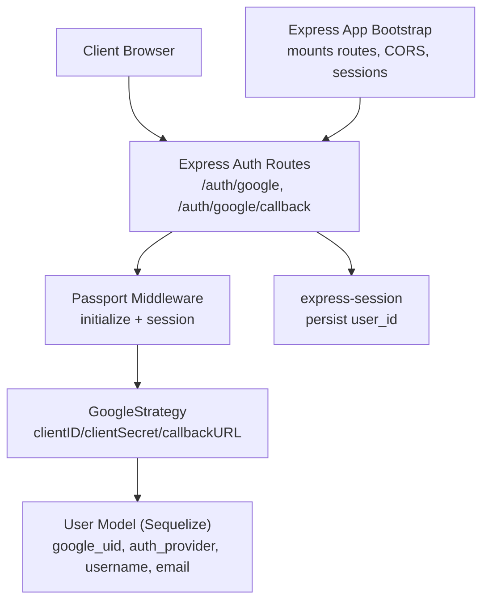
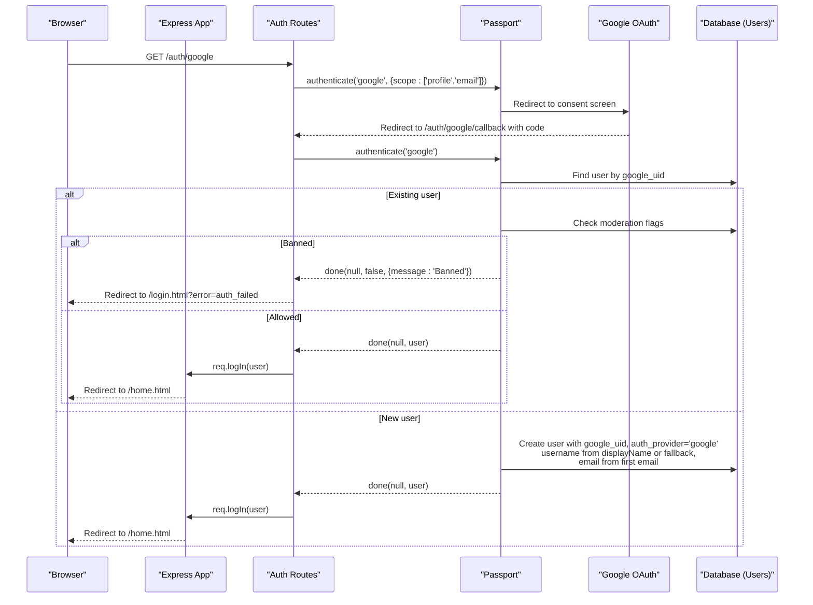
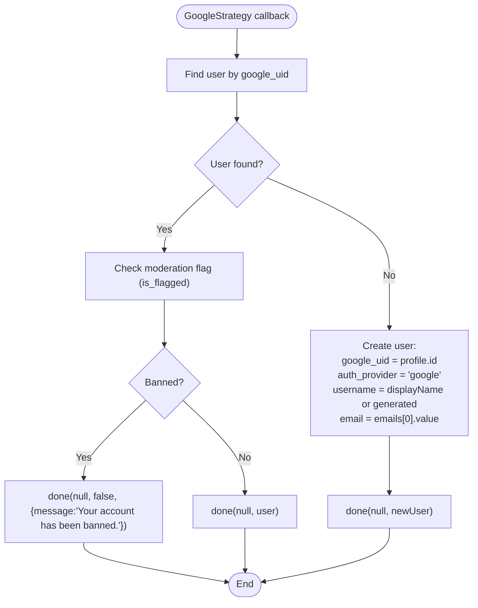
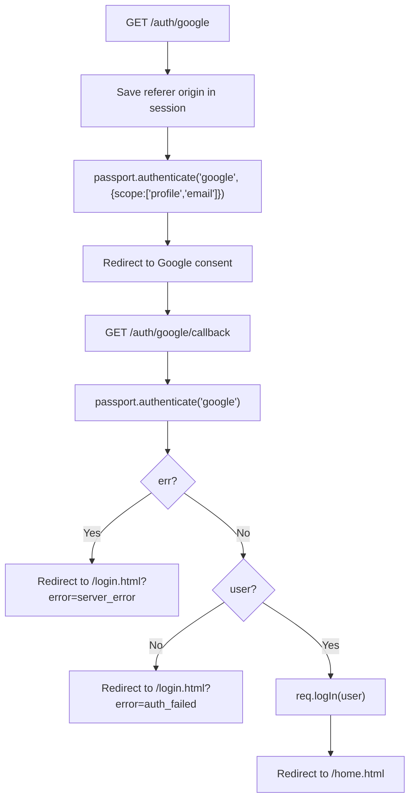
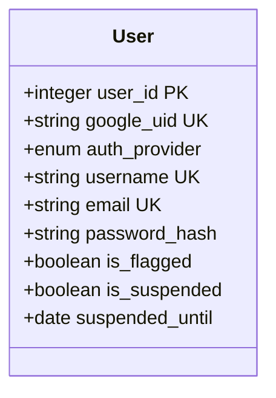
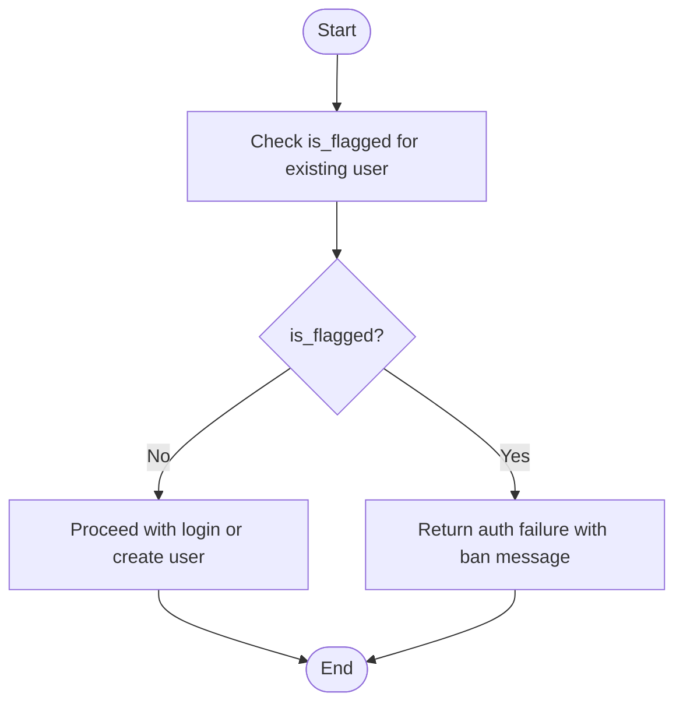
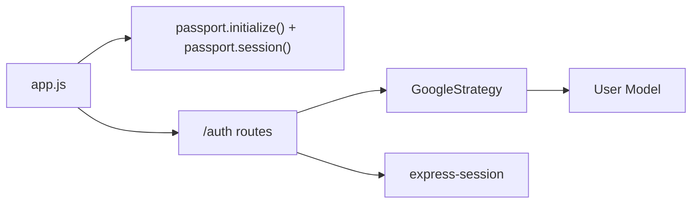

# Google OAuth Integration

<cite>
**Referenced Files in This Document**
- [passport.js](file://server/src/config/passport.js)
- [authRoutes.js](file://server/src/routes/authRoutes.js)
- [User.js](file://server/src/models/User.js)
- [app.js](file://server/src/app.js)
</cite>

## Table of Contents
1. [Introduction](#introduction)
2. [Project Structure](#project-structure)
3. [Core Components](#core-components)
4. [Architecture Overview](#architecture-overview)
5. [Detailed Component Analysis](#detailed-component-analysis)
6. [Dependency Analysis](#dependency-analysis)
7. [Performance Considerations](#performance-considerations)
8. [Troubleshooting Guide](#troubleshooting-guide)
9. [Conclusion](#conclusion)

## Introduction
This document explains the Google OAuth integration for the WARG Platform using Passport.js and Express. It covers:
- How GoogleStrategy is configured with client ID/secret and callback URL
- The full OAuth flow from redirect to callback handling
- User profile mapping from Google’s API response
- New user creation, including username generation, email extraction, and google_uid storage
- Error handling for banned users, profile validation, and account linking considerations
- Practical environment variable configuration and common troubleshooting steps

## Project Structure
The Google OAuth integration spans four primary files:
- Server-side Passport configuration and strategy registration
- Express routes for initiating Google login and handling the callback
- User model schema that stores Google-linked accounts
- Application bootstrap that mounts routes and initializes sessions/passport

**Diagram sources**
- [app.js:86-96](file://server/src/app.js#L86-L96)
- [authRoutes.js:1-55](file://server/src/routes/authRoutes.js#L1-L55)
- [passport.js:1-64](file://server/src/config/passport.js#L1-L64)
- [User.js:4-20](file://server/src/models/User.js#L4-L20)

**Section sources**
- [app.js:1-132](file://server/src/app.js#L1-L132)
- [authRoutes.js:1-124](file://server/src/routes/authRoutes.js#L1-L124)
- [passport.js:1-99](file://server/src/config/passport.js#L1-L99)
- [User.js:1-28](file://server/src/models/User.js#L1-L28)

## Core Components
- GoogleStrategy configuration:
  - Reads GOOGLE_CLIENT_ID and GOOGLE_CLIENT_SECRET from environment variables
  - Uses GOOGLE_CALLBACK_URL or defaults to /auth/google/callback
  - Registers only when both client credentials are present; otherwise logs a warning
- Callback route:
  - Initiates Google authentication with profile and email scopes
  - Handles success/failure and redirects to the client application
- User model:
  - Stores google_uid, auth_provider, username, email, and moderation flags used during login
- App bootstrap:
  - Initializes passport middleware and sessions
  - Mounts /auth routes under /auth

**Section sources**
- [passport.js:24-64](file://server/src/config/passport.js#L24-L64)
- [authRoutes.js:6-55](file://server/src/routes/authRoutes.js#L6-L55)
- [User.js:4-20](file://server/src/models/User.js#L4-L20)
- [app.js:86-96](file://server/src/app.js#L86-L96)

## Architecture Overview
The end-to-end Google OAuth flow:

**Diagram sources**
- [authRoutes.js:6-55](file://server/src/routes/authRoutes.js#L6-L55)
- [passport.js:27-60](file://server/src/config/passport.js#L27-L60)
- [User.js:4-20](file://server/src/models/User.js#L4-L20)

## Detailed Component Analysis

### GoogleStrategy Configuration
- Credentials and callback:
  - clientID and clientSecret are read from environment variables
  - callbackURL defaults to /auth/google/callback if not set
- Profile handling:
  - Looks up existing user by google_uid
  - If found and flagged/banned, returns an error indicating the account is banned
  - If not found, creates a new user:
    - google_uid set to profile.id
    - auth_provider set to 'google'
    - username set to profile.displayName or a generated value based on the last characters of profile.id
    - email set to the first email from profile.emails
- Registration behavior:
  - Strategy is registered only when both GOOGLE_CLIENT_ID and GOOGLE_CLIENT_SECRET are present
  - A warning is logged if credentials are missing

**Diagram sources**
- [passport.js:27-60](file://server/src/config/passport.js#L27-L60)
- [User.js:4-20](file://server/src/models/User.js#L4-L20)

**Section sources**
- [passport.js:24-64](file://server/src/config/passport.js#L24-L64)

### Callback Route Handling
- Initiation:
  - GET /auth/google triggers passport.authenticate('google') with scopes profile and email
  - Saves the requesting origin in the session for post-login redirection
- Callback:
  - GET /auth/google/callback runs passport.authenticate('google') again
  - Determines redirect target:
    - First tries the saved origin from the session
    - Falls back to CLIENT_PAGES_URL or CLIENT_URL
    - If CLIENT_URL contains multiple origins, uses the first one
  - On errors:
    - Database or server errors redirect to /login.html?error=server_error
    - Authentication failures redirect to /login.html?error=auth_failed
  - On success:
    - Logs in the user via req.logIn and redirects to /home.html

**Diagram sources**
- [authRoutes.js:6-55](file://server/src/routes/authRoutes.js#L6-L55)

**Section sources**
- [authRoutes.js:6-55](file://server/src/routes/authRoutes.js#L6-L55)

### User Model and Data Mapping
- Fields relevant to Google OAuth:
  - google_uid: unique identifier from Google
  - auth_provider: enum local or google
  - username: unique, required
  - email: unique, required
  - is_flagged: used to block banned users
- New user creation:
  - google_uid comes from Google profile.id
  - auth_provider set to 'google'
  - username derived from displayName or generated suffix
  - email extracted from the first entry in profile.emails

**Diagram sources**
- [User.js:4-20](file://server/src/models/User.js#L4-L20)

**Section sources**
- [User.js:1-28](file://server/src/models/User.js#L1-L28)

### Environment Variables and Setup
- Required variables:
  - GOOGLE_CLIENT_ID: Google OAuth client ID
  - GOOGLE_CLIENT_SECRET: Google OAuth client secret
  - GOOGLE_CALLBACK_URL: Optional override for callback URL; defaults to /auth/google/callback
  - CLIENT_URL or CLIENT_PAGES_URL: Used to determine where to redirect after successful login
  - SESSION_SECRET: Secret for session signing
  - DATABASE_URL: Database connection string (used by session store and models)
- Notes:
  - If GOOGLE_CLIENT_ID and GOOGLE_CLIENT_SECRET are missing, the server still starts but Google login is disabled
  - In production, cookie secure and sameSite settings depend on NODE_ENV

**Section sources**
- [passport.js:27-31](file://server/src/config/passport.js#L27-L31)
- [authRoutes.js:25-30](file://server/src/routes/authRoutes.js#L25-L30)
- [app.js:50-59](file://server/src/app.js#L50-L59)

### Error Handling and Validation
- Banned users:
  - If an existing Google user has is_flagged set, the strategy returns a failure with a message indicating the account is banned
- Profile validation:
  - Username is derived from displayName; if unavailable, a generated username is created
  - Email is taken from the first email in profile.emails; ensure Google provides at least one email
- Account linking scenarios:
  - Current implementation links by google_uid uniqueness; there is no explicit linking between local accounts and Google accounts
  - To support linking, you would need additional logic to detect matching emails and merge or prompt the user

**Diagram sources**
- [passport.js:35-44](file://server/src/config/passport.js#L35-L44)

**Section sources**
- [passport.js:35-44](file://server/src/config/passport.js#L35-L44)

## Dependency Analysis
- Passport initialization and session usage:
  - app.js initializes passport and session middleware and mounts /auth routes
- Routes depend on:
  - passport.authenticate for Google and Local strategies
  - express-session for persisting user_id across requests
- Strategy depends on:
  - User model for lookup and creation
  - Environment variables for credentials and callback URL

**Diagram sources**
- [app.js:86-96](file://server/src/app.js#L86-L96)
- [authRoutes.js:1-55](file://server/src/routes/authRoutes.js#L1-L55)
- [passport.js:1-64](file://server/src/config/passport.js#L1-L64)
- [User.js:1-28](file://server/src/models/User.js#L1-L28)

**Section sources**
- [app.js:86-96](file://server/src/app.js#L86-L96)
- [authRoutes.js:1-55](file://server/src/routes/authRoutes.js#L1-L55)
- [passport.js:1-64](file://server/src/config/passport.js#L1-L64)
- [User.js:1-28](file://server/src/models/User.js#L1-L28)

## Performance Considerations
- Database lookups:
  - Single find-by-google_uid query per callback; consider indexing google_uid for fast lookups
- Session persistence:
  - MySQL-backed session store is used in non-test environments; ensure database performance and connection pooling are tuned
- Profile mapping:
  - Minimal transformation; avoid heavy processing in the strategy callback to keep latency low

## Troubleshooting Guide
Common issues and resolutions:
- Google login disabled:
  - Symptom: Warning about missing GOOGLE_CLIENT_ID/GOOGLE_CLIENT_SECRET
  - Resolution: Set both environment variables and restart the server
- Callback mismatch:
  - Symptom: Google rejects callback URL
  - Resolution: Ensure GOOGLE_CALLBACK_URL matches the configured redirect URI in Google Cloud Console
- Redirect destination issues:
  - Symptom: Wrong redirect after login
  - Resolution: Verify CLIENT_URL or CLIENT_PAGES_URL; ensure it points to your frontend base URL
- Banned user login:
  - Symptom: Login fails with a ban message
  - Resolution: Review user moderation status (is_flagged) and adjust accordingly
- Missing email:
  - Symptom: Error creating user due to missing email
  - Resolution: Ensure Google grants email scope and the user shares their email
- Session errors:
  - Symptom: Session creation or persistence errors
  - Resolution: Check SESSION_SECRET and DATABASE_URL; verify MySQL connectivity and session table creation

**Section sources**
- [passport.js:27-64](file://server/src/config/passport.js#L27-L64)
- [authRoutes.js:25-53](file://server/src/routes/authRoutes.js#L25-L53)
- [app.js:50-82](file://server/src/app.js#L50-L82)

## Conclusion
The WARG Platform integrates Google OAuth through Passport.js with clear separation of concerns:
- Strategy handles credential-based authentication and user mapping
- Routes manage the OAuth lifecycle and client redirection
- The User model persists Google-linked accounts and supports moderation checks
By configuring the appropriate environment variables and ensuring correct callback URLs, the platform can reliably authenticate users, create new accounts, and enforce moderation policies.