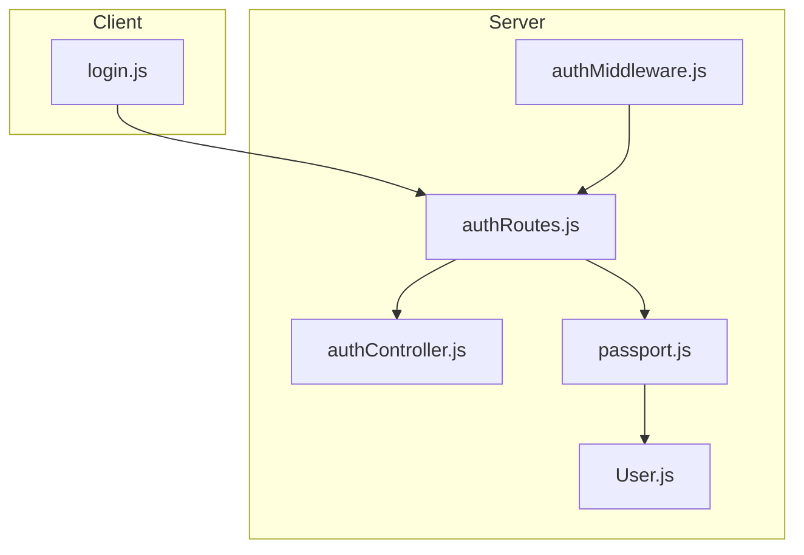
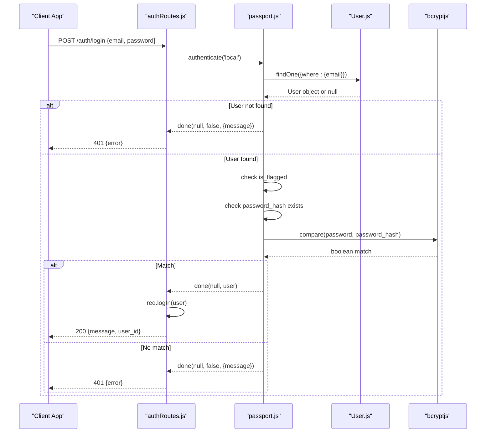
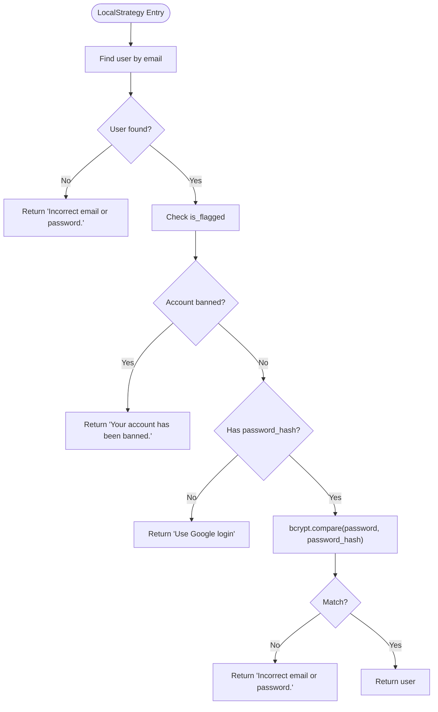
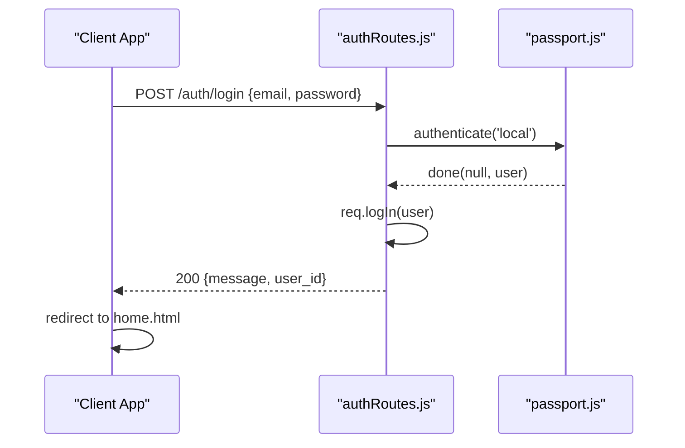
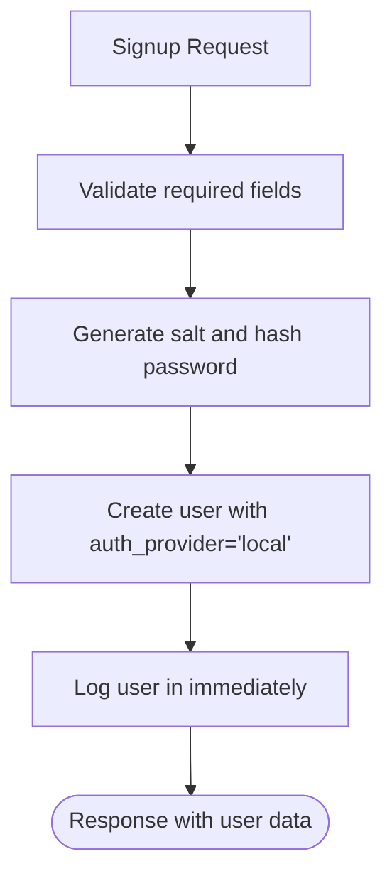
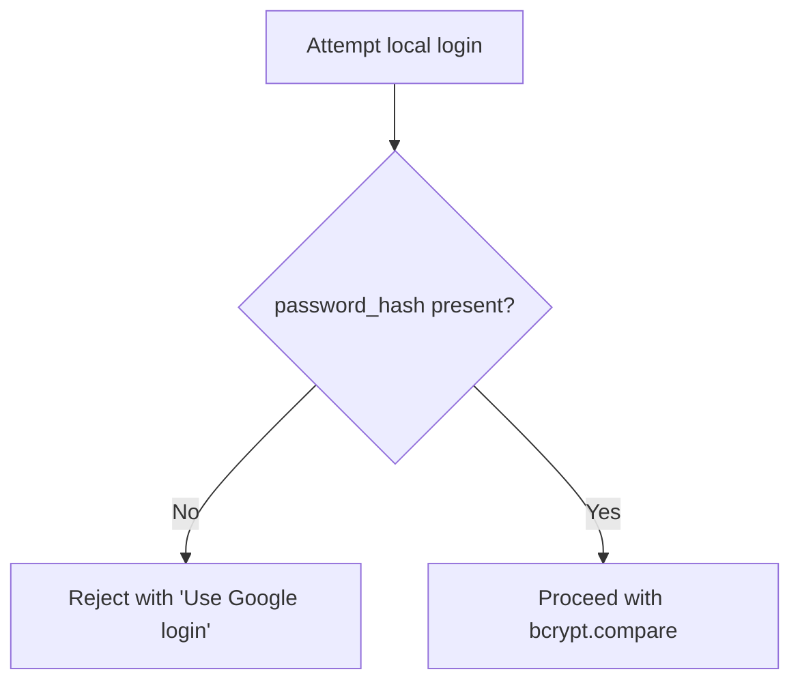
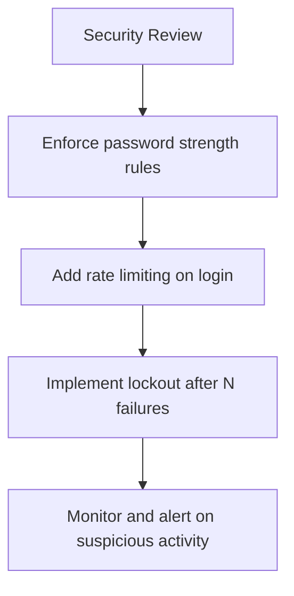
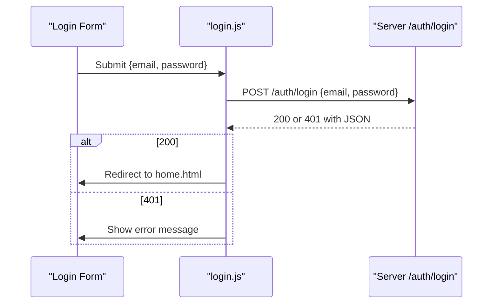
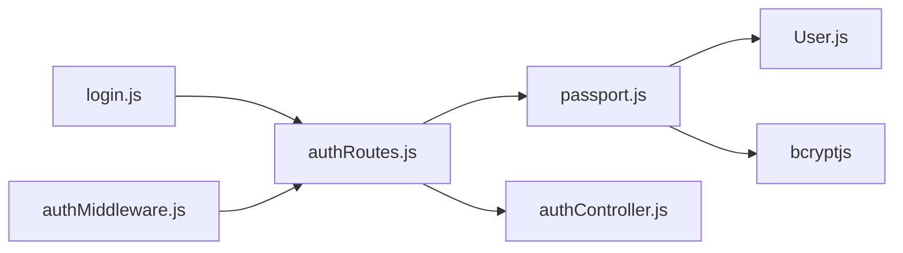

# Local Authentication

<cite>
**Referenced Files in This Document**
- [passport.js](file://server/src/config/passport.js)
- [authController.js](file://server/src/controllers/authController.js)
- [authRoutes.js](file://server/src/routes/authRoutes.js)
- [User.js](file://server/src/models/User.js)
- [login.js](file://client/scripts/login.js)
- [authMiddleware.js](file://server/src/middleware/authMiddleware.js)
</cite>

## Table of Contents
1. [Introduction](#introduction)
2. [Project Structure](#project-structure)
3. [Core Components](#core-components)
4. [Architecture Overview](#architecture-overview)
5. [Detailed Component Analysis](#detailed-component-analysis)
6. [Dependency Analysis](#dependency-analysis)
7. [Performance Considerations](#performance-considerations)
8. [Troubleshooting Guide](#troubleshooting-guide)
9. [Conclusion](#conclusion)

## Introduction
This document explains the local email/password authentication implementation in the WARG Platform. It covers the Passport.js LocalStrategy configuration, email field mapping, password hashing with bcryptjs, user validation logic, and the complete login flow for existing users. It also documents how Google-only accounts are handled when they lack a password, security considerations such as password strength and rate limiting, and practical guidance for integrating the login form on the client side.

## Project Structure
The local authentication feature spans server-side configuration, routes, controllers, models, middleware, and client integration:

- Server configuration defines Passport strategies (Local and Google), serialization, and deserialization.
- Routes expose endpoints for signup, login, logout, and profile retrieval.
- Controllers handle signup logic and pre-login checks.
- The User model defines schema fields including auth_provider and password_hash.
- Middleware protects routes and enforces account status checks.
- Client script submits credentials to the login endpoint and handles responses.

**Diagram sources**
- [login.js:1-44](file://client/scripts/login.js#L1-L44)
- [authRoutes.js:1-124](file://server/src/routes/authRoutes.js#L1-L124)
- [authController.js:1-83](file://server/src/controllers/authController.js#L1-L83)
- [passport.js:1-99](file://server/src/config/passport.js#L1-L99)
- [User.js:1-28](file://server/src/models/User.js#L1-L28)
- [authMiddleware.js:1-22](file://server/src/middleware/authMiddleware.js#L1-L22)

**Section sources**
- [passport.js:1-99](file://server/src/config/passport.js#L1-L99)
- [authController.js:1-83](file://server/src/controllers/authController.js#L1-L83)
- [authRoutes.js:1-124](file://server/src/routes/authRoutes.js#L1-L124)
- [User.js:1-28](file://server/src/models/User.js#L1-L28)
- [login.js:1-44](file://client/scripts/login.js#L1-L44)
- [authMiddleware.js:1-22](file://server/src/middleware/authMiddleware.js#L1-L22)

## Core Components
- Passport LocalStrategy:
  - Maps the request’s email field to the usernameField and uses the passwordField for credential submission.
  - Looks up the user by email, checks account status, verifies that a password exists, and compares the provided password against the stored hash using bcryptjs.
- Auth Controller:
  - Handles user signup, validates inputs, hashes passwords with bcryptjs, creates the user record with auth_provider set to local, and logs the user in immediately after successful registration.
- Auth Routes:
  - Expose POST /auth/login for local login, POST /auth/signup for registration, GET /auth/me for current user info, and GET /auth/logout for session termination.
- User Model:
  - Defines fields including email, password_hash, auth_provider (local or google), and flags like is_flagged used during authentication.
- Client Login Script:
  - Submits email and password to the login endpoint, manages UI state, and redirects upon success or shows errors on failure.

**Section sources**
- [passport.js:66-95](file://server/src/config/passport.js#L66-L95)
- [authController.js:5-60](file://server/src/controllers/authController.js#L5-L60)
- [authRoutes.js:57-95](file://server/src/routes/authRoutes.js#L57-L95)
- [User.js:4-20](file://server/src/models/User.js#L4-L20)
- [login.js:1-44](file://client/scripts/login.js#L1-L44)

## Architecture Overview
The local authentication flow integrates client requests with server-side Passport strategies and database operations.

**Diagram sources**
- [authRoutes.js:64-81](file://server/src/routes/authRoutes.js#L64-L81)
- [passport.js:67-95](file://server/src/config/passport.js#L67-L95)
- [User.js:4-20](file://server/src/models/User.js#L4-L20)

## Detailed Component Analysis

### Passport LocalStrategy Implementation
- Email Field Mapping:
  - The strategy is configured to accept email via the usernameField and password via the passwordField.
- User Lookup and Validation:
  - Finds the user by email; if not found, returns an authentication failure message.
  - Checks if the account is flagged (banned); if so, returns a specific error.
  - Ensures the user has a password_hash; if missing (Google-only account), returns a message instructing the user to sign in with Google.
- Password Verification:
  - Uses bcrypt.compare to validate the submitted password against the stored hash.
  - On success, returns the user object; otherwise, returns an authentication failure message.

**Diagram sources**
- [passport.js:67-95](file://server/src/config/passport.js#L67-L95)

**Section sources**
- [passport.js:66-95](file://server/src/config/passport.js#L66-L95)

### Authentication Flow for Existing Users
- Route Handler:
  - POST /auth/login invokes passport.authenticate('local').
  - On success, calls req.logIn to establish the session and returns a JSON response with a success message and user_id.
  - On failure, returns a 401 response with the error message from the strategy.
- Session Handling:
  - The client includes credentials in the cookie-based session via credentials: 'include'.
  - After successful login, the client redirects to home.html.

**Diagram sources**
- [authRoutes.js:64-81](file://server/src/routes/authRoutes.js#L64-L81)
- [login.js:15-35](file://client/scripts/login.js#L15-L35)

**Section sources**
- [authRoutes.js:64-81](file://server/src/routes/authRoutes.js#L64-L81)
- [login.js:1-44](file://client/scripts/login.js#L1-L44)

### Password Verification Process
- Hashing at Signup:
  - The signup controller generates a salt and hashes the password before creating the user record.
- Comparison at Login:
  - The LocalStrategy uses bcrypt.compare to verify the submitted password against the stored hash.

**Diagram sources**
- [authController.js:5-60](file://server/src/controllers/authController.js#L5-L60)

**Section sources**
- [authController.js:5-60](file://server/src/controllers/authController.js#L5-L60)
- [passport.js:85-88](file://server/src/config/passport.js#L85-L88)

### Handling Google-Only Accounts Without Passwords
- Detection:
  - If a user’s password_hash is missing, the LocalStrategy rejects the login attempt with a message indicating the account uses Google login.
- Guidance:
  - Clients should direct users to use Google OAuth for such accounts.

**Diagram sources**
- [passport.js:80-83](file://server/src/config/passport.js#L80-L83)

**Section sources**
- [passport.js:80-83](file://server/src/config/passport.js#L80-L83)

### Security Measures
- Password Strength Requirements:
  - The current implementation does not enforce password complexity rules at signup or login.
  - Recommendation: Add server-side validation for minimum length, character classes, and optionally integrate a password strength library.
- Rate Limiting Considerations:
  - There is no explicit rate limiting on the login endpoint in the analyzed code.
  - Recommendation: Apply rate limiting to POST /auth/login to mitigate brute-force attempts.
- Account Lockout Mechanisms:
  - The system supports flagging users via is_flagged, which blocks login and access to protected routes.
  - There is no automatic lockout based on failed attempts; consider implementing temporary locks or progressive delays.

[No sources needed since this section provides general guidance]

### Login Form Integration Examples
- Client Submission:
  - The client script collects email and password, sends a POST request to /auth/login with JSON payload, and sets credentials: 'include' to maintain sessions.
- Error Handling:
  - On non-successful responses, the script displays an alert with the error message returned by the server.
- Success Handling:
  - On success, the client redirects to home.html.

**Diagram sources**
- [login.js:15-35](file://client/scripts/login.js#L15-L35)
- [authRoutes.js:64-81](file://server/src/routes/authRoutes.js#L64-L81)

**Section sources**
- [login.js:1-44](file://client/scripts/login.js#L1-L44)
- [authRoutes.js:64-81](file://server/src/routes/authRoutes.js#L64-L81)

### Best Practices for Secure Password Handling
- Use bcrypt for hashing and comparison as implemented.
- Enforce strong password policies at signup.
- Implement rate limiting and optional account lockout mechanisms.
- Avoid exposing sensitive details in error messages; return generic messages for invalid credentials while preserving specific messages for known conditions (e.g., banned accounts).
- Ensure cookies and sessions are secured (HTTPS, secure flags) and consider SameSite attributes.

[No sources needed since this section provides general guidance]

## Dependency Analysis
The following diagram illustrates key dependencies among components involved in local authentication.

**Diagram sources**
- [login.js:1-44](file://client/scripts/login.js#L1-L44)
- [authRoutes.js:1-124](file://server/src/routes/authRoutes.js#L1-L124)
- [passport.js:1-99](file://server/src/config/passport.js#L1-L99)
- [User.js:1-28](file://server/src/models/User.js#L1-L28)
- [authController.js:1-83](file://server/src/controllers/authController.js#L1-L83)
- [authMiddleware.js:1-22](file://server/src/middleware/authMiddleware.js#L1-L22)

**Section sources**
- [passport.js:1-99](file://server/src/config/passport.js#L1-L99)
- [authRoutes.js:1-124](file://server/src/routes/authRoutes.js#L1-L124)
- [authController.js:1-83](file://server/src/controllers/authController.js#L1-L83)
- [User.js:1-28](file://server/src/models/User.js#L1-L28)
- [login.js:1-44](file://client/scripts/login.js#L1-L44)
- [authMiddleware.js:1-22](file://server/src/middleware/authMiddleware.js#L1-L22)

## Performance Considerations
- bcrypt Cost Factor:
  - The signup controller uses a fixed salt rounds value; ensure it aligns with performance and security requirements.
- Database Queries:
  - LocalStrategy performs a single lookup by email; ensure proper indexing on the email column.
- Session Management:
  - Session creation occurs after successful authentication; consider optimizing session storage and cleanup.

[No sources needed since this section provides general guidance]

## Troubleshooting Guide
- Incorrect Email or Password:
  - The LocalStrategy returns a generic message when the user is not found or the password does not match.
- Google-Only Account:
  - If password_hash is missing, the strategy instructs the user to sign in with Google.
- Banned Accounts:
  - If is_flagged is true, both the LocalStrategy and middleware reject access with a forbidden message.
- Session Errors:
  - If req.logIn fails, the route returns a server error response.

**Section sources**
- [passport.js:70-95](file://server/src/config/passport.js#L70-L95)
- [authMiddleware.js:1-22](file://server/src/middleware/authMiddleware.js#L1-L22)
- [authRoutes.js:64-95](file://server/src/routes/authRoutes.js#L64-L95)

## Conclusion
The WARG Platform implements local email/password authentication using Passport.js LocalStrategy with bcryptjs for password hashing. The flow validates users by email, checks account status, ensures password presence, and compares credentials securely. Google-only accounts are explicitly handled to prevent misuse of local login. While the core authentication is robust, additional security measures such as password strength enforcement, rate limiting, and account lockout mechanisms are recommended to further harden the system.