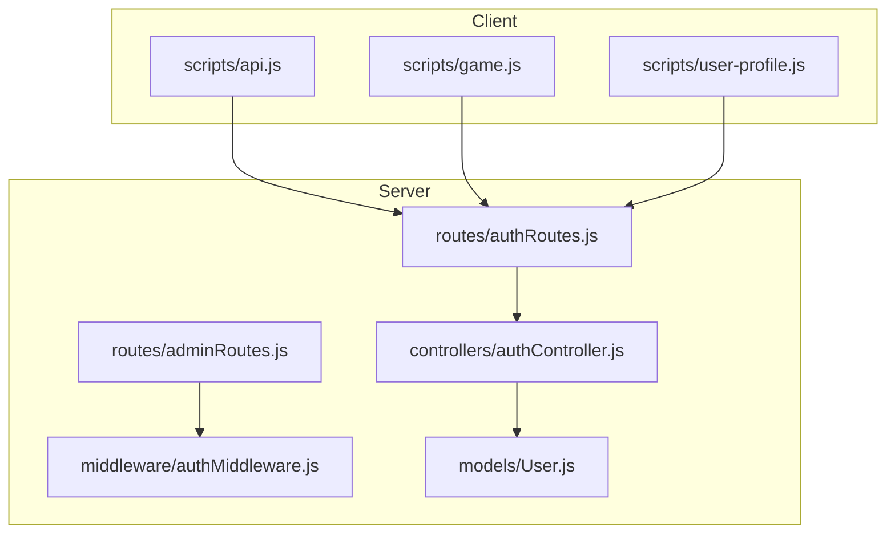
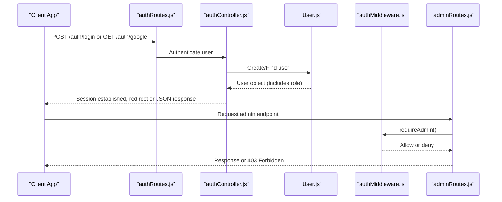
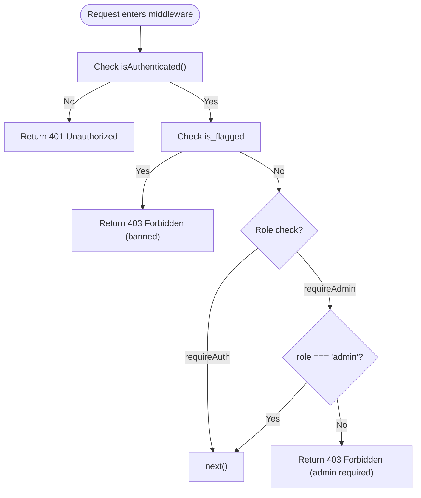
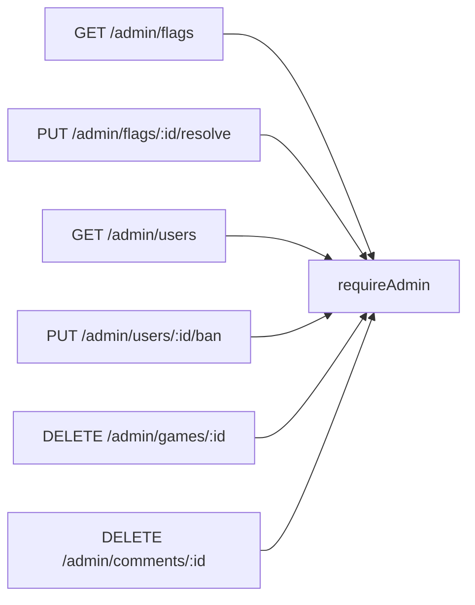
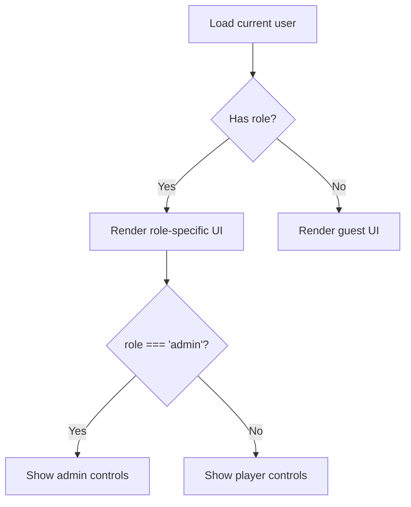
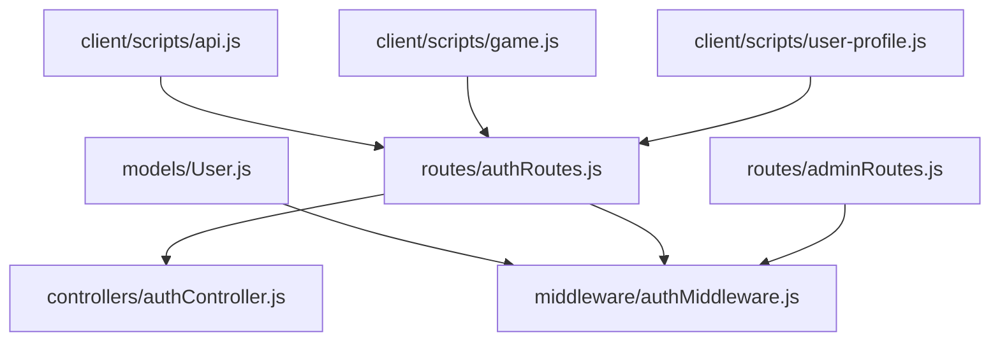

# Role-Based Access Control

<cite>
**Referenced Files in This Document**
- [User.js](file://server/src/models/User.js)
- [authMiddleware.js](file://server/src/middleware/authMiddleware.js)
- [adminRoutes.js](file://server/src/routes/adminRoutes.js)
- [authRoutes.js](file://server/src/routes/authRoutes.js)
- [authController.js](file://server/src/controllers/authController.js)
- [api.js](file://client/scripts/api.js)
- [game.js](file://client/scripts/game.js)
- [user-profile.js](file://client/scripts/user-profile.js)
</cite>

## Table of Contents
1. [Introduction](#introduction)
2. [Project Structure](#project-structure)
3. [Core Components](#core-components)
4. [Architecture Overview](#architecture-overview)
5. [Detailed Component Analysis](#detailed-component-analysis)
6. [Dependency Analysis](#dependency-analysis)
7. [Performance Considerations](#performance-considerations)
8. [Troubleshooting Guide](#troubleshooting-guide)
9. [Conclusion](#conclusion)

## Introduction
This document explains the role-based access control (RBAC) design and implementation in the WARG Platform. It covers:
- User roles and their capabilities
- Server-side authorization middleware for protecting routes
- Role assignment and modification flows
- Security considerations around role escalation
- Practical examples of route protection, custom guards, and role-based UI rendering on the client

The system uses a simple role model with three roles: player, creator, and admin. Authorization is enforced via Express middleware that checks authentication status and user roles before allowing access to protected endpoints. The client renders UI features conditionally based on the authenticated user’s role.

## Project Structure
At a high level, RBAC spans both server and client layers:
- Server:
  - Data model defines the role field on users
  - Middleware provides requireAuth and requireAdmin guards
  - Routes apply guards to protect sensitive endpoints
  - Auth routes handle login/signup and return user info including role
- Client:
  - Scripts read the current user’s role from API responses
  - UI components conditionally render admin-only controls

**Diagram sources**
- [authRoutes.js:1-124](file://server/src/routes/authRoutes.js#L1-L124)
- [adminRoutes.js:1-19](file://server/src/routes/adminRoutes.js#L1-L19)
- [authMiddleware.js:1-22](file://server/src/middleware/authMiddleware.js#L1-L22)
- [authController.js:1-83](file://server/src/controllers/authController.js#L1-L83)
- [User.js:1-28](file://server/src/models/User.js#L1-L28)
- [api.js:370-385](file://client/scripts/api.js#L370-L385)
- [game.js:640-700](file://client/scripts/game.js#L640-L700)
- [user-profile.js:55-70](file://client/scripts/user-profile.js#L55-L70)

**Section sources**
- [User.js:1-28](file://server/src/models/User.js#L1-L28)
- [authMiddleware.js:1-22](file://server/src/middleware/authMiddleware.js#L1-L22)
- [adminRoutes.js:1-19](file://server/src/routes/adminRoutes.js#L1-L19)
- [authRoutes.js:1-124](file://server/src/routes/authRoutes.js#L1-L124)
- [authController.js:1-83](file://server/src/controllers/authController.js#L1-L83)
- [api.js:370-385](file://client/scripts/api.js#L370-L385)
- [game.js:640-700](file://client/scripts/game.js#L640-L700)
- [user-profile.js:55-70](file://client/scripts/user-profile.js#L55-L70)

## Core Components
- User role model:
  - Role values are enumerated as player, creator, admin with default player
- Authorization middleware:
  - requireAuth ensures the request is authenticated and not banned
  - requireAdmin enforces admin role for privileged routes
- Route protection:
  - Admin routes are guarded by requireAdmin
  - Other routes may use requireAuth where needed
- Role assignment and exposure:
  - Signup flow creates users with default role
  - Current user endpoint returns role to clients
- Client-side role usage:
  - Scripts check user.role to enable/disable UI elements

Key responsibilities:
- Data integrity: role is constrained at the database/model layer
- Server enforcement: middleware prevents unauthorized access
- Client presentation: UI adapts to the user’s role

**Section sources**
- [User.js:1-28](file://server/src/models/User.js#L1-L28)
- [authMiddleware.js:1-22](file://server/src/middleware/authMiddleware.js#L1-L22)
- [adminRoutes.js:1-19](file://server/src/routes/adminRoutes.js#L1-L19)
- [authRoutes.js:97-124](file://server/src/routes/authRoutes.js#L97-L124)
- [authController.js:5-61](file://server/src/controllers/authController.js#L5-L61)
- [api.js:370-385](file://client/scripts/api.js#L370-L385)
- [game.js:640-700](file://client/scripts/game.js#L640-L700)
- [user-profile.js:55-70](file://client/scripts/user-profile.js#L55-L70)

## Architecture Overview
The RBAC architecture integrates authentication, authorization, and role-aware UI:

**Diagram sources**
- [authRoutes.js:64-124](file://server/src/routes/authRoutes.js#L64-L124)
- [authController.js:5-61](file://server/src/controllers/authController.js#L5-L61)
- [User.js:1-28](file://server/src/models/User.js#L1-L28)
- [authMiddleware.js:1-22](file://server/src/middleware/authMiddleware.js#L1-L22)
- [adminRoutes.js:1-19](file://server/src/routes/adminRoutes.js#L1-L19)

## Detailed Component Analysis

### User Role Model
- Role enumeration:
  - Values: player, creator, admin
  - Default: player
- Additional fields relevant to access:
  - is_flagged and suspension flags influence auth decisions

Implications:
- Role is authoritative and persisted in the database
- Clients should treat role as server-provided trust boundary

**Section sources**
- [User.js:1-28](file://server/src/models/User.js#L1-L28)

### Authorization Middleware
- requireAuth:
  - Validates session authentication
  - Blocks flagged/banned users with 403
  - Allows other authenticated users to proceed
- requireAdmin:
  - Requires authenticated user with role admin
  - Returns 403 if not admin

Behavioral notes:
- requireAdmin implies requireAuth; it checks both authentication and role
- Banning logic is enforced early to prevent any action by flagged accounts

**Diagram sources**
- [authMiddleware.js:1-22](file://server/src/middleware/authMiddleware.js#L1-L22)

**Section sources**
- [authMiddleware.js:1-22](file://server/src/middleware/authMiddleware.js#L1-L22)

### Route Protection
- Admin routes:
  - Protected by requireAdmin
  - Endpoints include flag management, user bans, content deletion
- Other routes:
  - Some routes import requireAuth for general protection

Protection strategy:
- Apply requireAdmin to all administrative endpoints
- Use requireAuth where only authentication is required

**Diagram sources**
- [adminRoutes.js:1-19](file://server/src/routes/adminRoutes.js#L1-L19)
- [authMiddleware.js:11-16](file://server/src/middleware/authMiddleware.js#L11-L16)

**Section sources**
- [adminRoutes.js:1-19](file://server/src/routes/adminRoutes.js#L1-L19)
- [authMiddleware.js:11-16](file://server/src/middleware/authMiddleware.js#L11-L16)

### Role Assignment and Modification
- Role assignment:
  - New users created via signup receive the default role (player)
  - Role is included in the user payload returned after successful signup
- Role modification:
  - No dedicated role-change endpoint is present in the analyzed files
  - Administrative operations such as banning exist, but explicit role elevation is not shown here

Security implications:
- Since role changes are not exposed through an analyzed endpoint, privilege escalation risk is mitigated unless other mechanisms exist outside these files
- Always ensure role updates are performed through trusted, audited server-side processes

**Section sources**
- [authController.js:5-61](file://server/src/controllers/authController.js#L5-L61)
- [authRoutes.js:57-61](file://server/src/routes/authRoutes.js#L57-L61)
- [User.js:1-28](file://server/src/models/User.js#L1-L28)

### Client-Side Role Usage and UI Rendering
- Role detection:
  - Client scripts read user.role from API responses
  - Example patterns:
    - Set global admin flag when role is admin
    - Conditionally render delete buttons for admins
    - Display profile title based on role
- Best practices:
  - Never trust client-side role alone; always enforce on the server
  - Keep UI behavior consistent with server permissions

**Diagram sources**
- [api.js:370-385](file://client/scripts/api.js#L370-L385)
- [game.js:640-700](file://client/scripts/game.js#L640-L700)
- [user-profile.js:55-70](file://client/scripts/user-profile.js#L55-L70)

**Section sources**
- [api.js:370-385](file://client/scripts/api.js#L370-L385)
- [game.js:640-700](file://client/scripts/game.js#L640-L700)
- [user-profile.js:55-70](file://client/scripts/user-profile.js#L55-L70)

## Dependency Analysis
The following diagram shows how RBAC-related modules depend on each other:

**Diagram sources**
- [User.js:1-28](file://server/src/models/User.js#L1-L28)
- [authMiddleware.js:1-22](file://server/src/middleware/authMiddleware.js#L1-L22)
- [authRoutes.js:1-124](file://server/src/routes/authRoutes.js#L1-L124)
- [authController.js:1-83](file://server/src/controllers/authController.js#L1-L83)
- [adminRoutes.js:1-19](file://server/src/routes/adminRoutes.js#L1-L19)
- [api.js:370-385](file://client/scripts/api.js#L370-L385)
- [game.js:640-700](file://client/scripts/game.js#L640-L700)
- [user-profile.js:55-70](file://client/scripts/user-profile.js#L55-L70)

**Section sources**
- [User.js:1-28](file://server/src/models/User.js#L1-L28)
- [authMiddleware.js:1-22](file://server/src/middleware/authMiddleware.js#L1-L22)
- [authRoutes.js:1-124](file://server/src/routes/authRoutes.js#L1-L124)
- [authController.js:1-83](file://server/src/controllers/authController.js#L1-L83)
- [adminRoutes.js:1-19](file://server/src/routes/adminRoutes.js#L1-L19)
- [api.js:370-385](file://client/scripts/api.js#L370-L385)
- [game.js:640-700](file://client/scripts/game.js#L640-L700)
- [user-profile.js:55-70](file://client/scripts/user-profile.js#L55-L70)

## Performance Considerations
- Middleware overhead:
  - requireAuth and requireAdmin add minimal checks per request
- Database queries:
  - Role checks are in-memory after user deserialization
  - Avoid repeated role lookups; cache user context within request lifecycle
- Client rendering:
  - Conditional UI based on role is lightweight; avoid unnecessary re-renders

[No sources needed since this section provides general guidance]

## Troubleshooting Guide
Common issues and resolutions:
- 401 Unauthorized:
  - Cause: Missing or invalid session
  - Resolution: Ensure login succeeded and session cookie is present
- 403 Forbidden (banned):
  - Cause: User is flagged/suspended
  - Resolution: Review moderation actions and unban if appropriate
- 403 Forbidden (admin required):
  - Cause: Non-admin attempted admin route
  - Resolution: Verify user role and route protection
- Role not reflected in UI:
  - Cause: Client did not fetch current user or misread role
  - Resolution: Confirm /auth/me response includes role and client logic reads it correctly

Operational tips:
- Log middleware decisions during development to trace authorization failures
- Validate that role changes (if implemented elsewhere) propagate to active sessions

**Section sources**
- [authMiddleware.js:1-22](file://server/src/middleware/authMiddleware.js#L1-L22)
- [authRoutes.js:97-124](file://server/src/routes/authRoutes.js#L97-L124)

## Conclusion
The WARG Platform implements RBAC using a simple role model with clear server-side enforcement:
- Roles: player, creator, admin
- Middleware: requireAuth and requireAdmin protect routes
- Client: UI adapts to the authenticated user’s role

For robust security:
- Enforce all critical permissions server-side
- Restrict role modifications to trusted administrative processes
- Audit role changes and monitor for escalation attempts
- Keep client-side role checks purely for UX enhancement

[No sources needed since this section summarizes without analyzing specific files]