# Session Management

<cite>
**Referenced Files in This Document**
- [app.js](file://server/src/app.js)
- [passport.js](file://server/src/config/passport.js)
- [authRoutes.js](file://server/src/routes/authRoutes.js)
- [authController.js](file://server/src/controllers/authController.js)
- [User.js](file://server/src/models/User.js)
- [authMiddleware.js](file://server/src/middleware/authMiddleware.js)
- [database.js](file://server/src/config/database.js)
- [sessionController.js](file://server/src/controllers/sessionController.js)
- [sessionRoutes.js](file://server/src/routes/sessionRoutes.js)
- [server.js](file://server/server.js)
</cite>

## Table of Contents
1. [Introduction](#introduction)
2. [Project Structure](#project-structure)
3. [Core Components](#core-components)
4. [Architecture Overview](#architecture-overview)
5. [Detailed Component Analysis](#detailed-component-analysis)
6. [Dependency Analysis](#dependency-analysis)
7. [Performance Considerations](#performance-considerations)
8. [Troubleshooting Guide](#troubleshooting-guide)
9. [Conclusion](#conclusion)

## Introduction
This document explains how the WARG Platform manages user sessions and authentication. It covers Passport.js serialization and deserialization, MySQL-backed session storage for scalability, session lifecycle management, security considerations (expiration, regeneration), middleware configuration, cookie settings, cross-domain handling, session-based guards, data access patterns, and troubleshooting guidance.

## Project Structure
The session-related logic is primarily implemented in:
- Express app setup with session middleware and MySQL store
- Passport strategies and serialization/deserialization
- Authentication routes and controllers
- Authorization middleware
- Database configuration used by both application models and session store

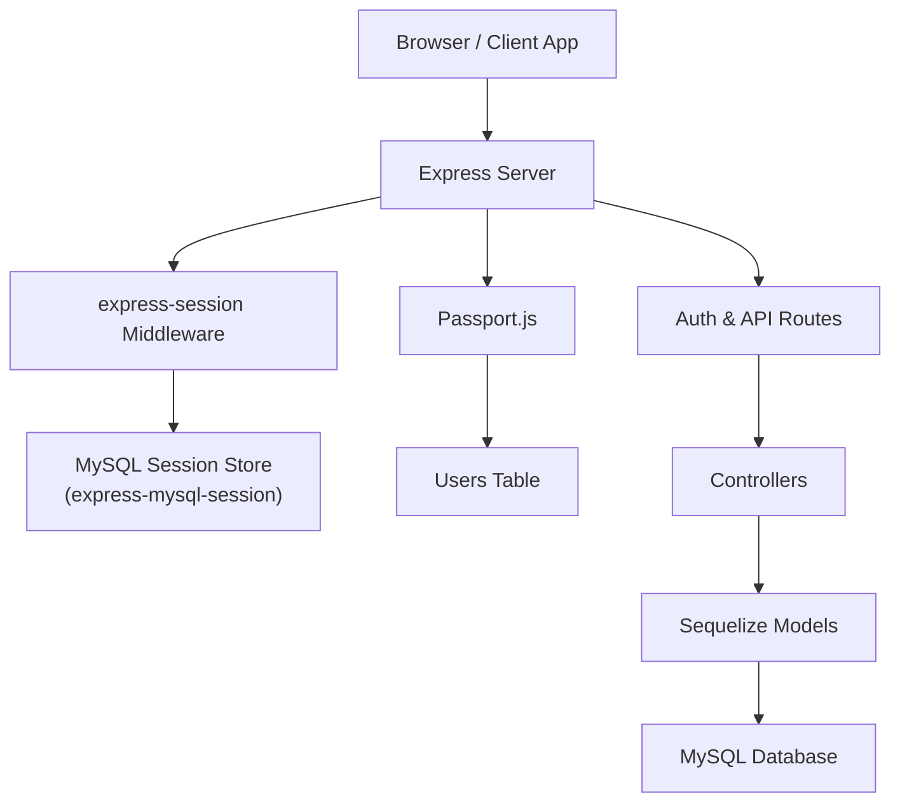

**Diagram sources**
- [app.js:50-88](file://server/src/app.js#L50-L88)
- [passport.js:8-22](file://server/src/config/passport.js#L8-L22)
- [database.js:1-37](file://server/src/config/database.js#L1-L37)

**Section sources**
- [app.js:1-132](file://server/src/app.js#L1-L132)
- [server.js:1-37](file://server/server.js#L1-L37)

## Core Components
- Session middleware and MySQL-backed persistence
- Passport.js strategies (Local and Google OAuth)
- Serialization and deserialization of user identity
- Authentication routes and controllers
- Authorization middleware for protected routes
- Database configuration for MySQL connectivity

Key responsibilities:
- Create and manage sessions via express-session
- Persist sessions to MySQL for horizontal scaling
- Serialize only the user ID into the session
- Deserialize user objects from the database on each request
- Provide secure cookie settings and CORS for cross-domain flows
- Enforce authentication and authorization at route level

**Section sources**
- [app.js:50-88](file://server/src/app.js#L50-L88)
- [passport.js:8-22](file://server/src/config/passport.js#L8-L22)
- [authRoutes.js:6-55](file://server/src/routes/authRoutes.js#L6-L55)
- [authController.js:5-55](file://server/src/controllers/authController.js#L5-L55)
- [authMiddleware.js:1-22](file://server/src/middleware/authMiddleware.js#L1-L22)
- [database.js:1-37](file://server/src/config/database.js#L1-L37)

## Architecture Overview
The platform uses a standard Node.js/Express stack with Passport.js for authentication and express-mysql-session for persistent sessions.

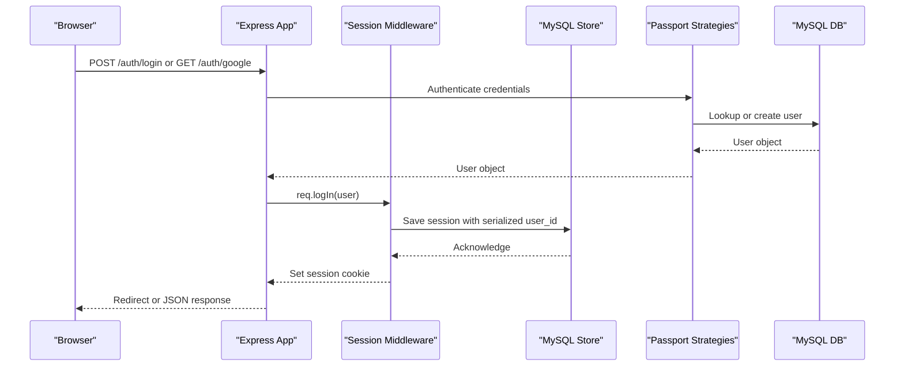

**Diagram sources**
- [authRoutes.js:64-55](file://server/src/routes/authRoutes.js#L64-L55)
- [passport.js:8-22](file://server/src/config/passport.js#L8-L22)
- [app.js:50-88](file://server/src/app.js#L50-L88)

## Detailed Component Analysis

### Passport.js Serialization and Deserialization
- Serialization stores only the user ID in the session, minimizing payload size and improving performance.
- Deserialization retrieves the full user object from the database on each request using the stored ID. Sensitive fields like session tokens are excluded.

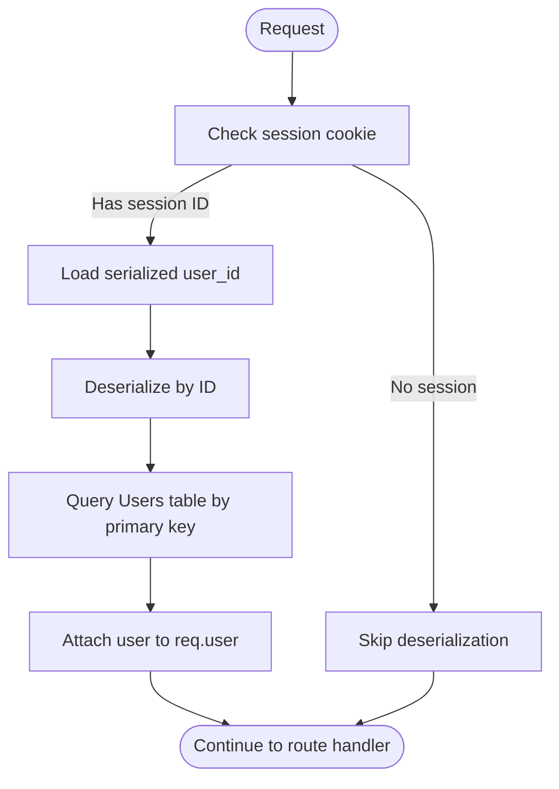

**Diagram sources**
- [passport.js:8-22](file://server/src/config/passport.js#L8-L22)
- [User.js:4-25](file://server/src/models/User.js#L4-L25)

**Section sources**
- [passport.js:8-22](file://server/src/config/passport.js#L8-L22)
- [User.js:4-25](file://server/src/models/User.js#L4-L25)

### MySQL-Backed Session Storage
- In production and development (non-test environments), sessions are persisted to MySQL using express-mysql-session.
- The store connects using DATABASE_URL, creates the session table automatically if needed, and sets an expiration time.
- In tests, an in-memory store is used to avoid requiring a persistent session table.

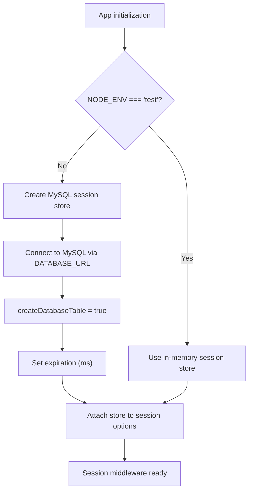

**Diagram sources**
- [app.js:50-82](file://server/src/app.js#L50-L82)
- [database.js:1-37](file://server/src/config/database.js#L1-L37)

**Section sources**
- [app.js:50-82](file://server/src/app.js#L50-L82)
- [database.js:1-37](file://server/src/config/database.js#L1-L37)

### Session Lifecycle Management
- Creation: On successful login (local or Google), the session is created and the user ID is serialized.
- Persistence: The session is written to MySQL; it survives process restarts.
- Access: Each request loads the session, deserializes the user, and attaches it to req.user.
- Update: Sessions are not resaved unless modified (resave: false).
- Destruction: Logout destroys the session and clears the session cookie.

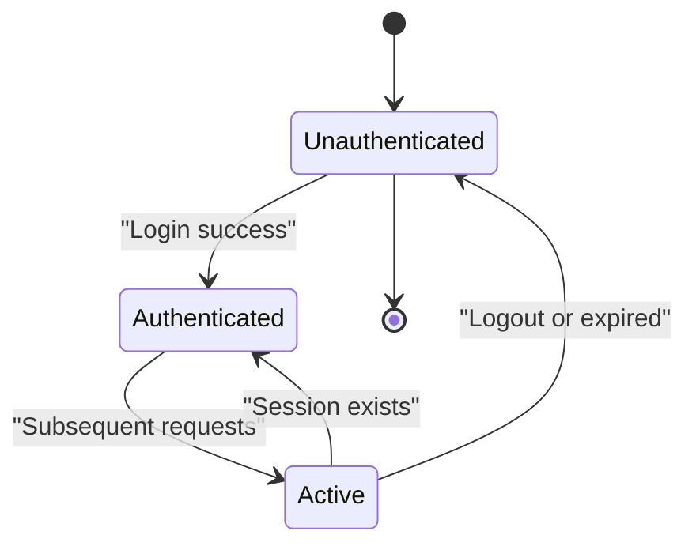

**Diagram sources**
- [authRoutes.js:84-95](file://server/src/routes/authRoutes.js#L84-L95)
- [app.js:50-88](file://server/src/app.js#L50-L88)

**Section sources**
- [authRoutes.js:84-95](file://server/src/routes/authRoutes.js#L84-L95)
- [app.js:50-88](file://server/src/app.js#L50-L88)

### Security Considerations
- Secret: A strong SESSION_SECRET should be set; otherwise, a development default is used.
- Cookie flags:
  - httpOnly: true prevents client-side script access.
  - secure: true in production ensures HTTPS-only cookies.
  - sameSite: none in production for cross-site scenarios; lax locally.
  - maxAge: 24 hours.
- Trust proxy: Enabled to correctly handle forwarded headers behind proxies.
- CORS: Credentials enabled; origins validated against CLIENT_URL.
- Session regeneration: Not explicitly performed after login; consider implementing regeneration for defense-in-depth.

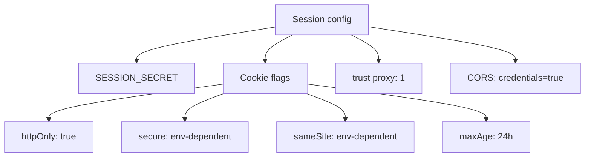

**Diagram sources**
- [app.js:48-59](file://server/src/app.js#L48-L59)

**Section sources**
- [app.js:48-59](file://server/src/app.js#L48-L59)

### Cross-Domain Session Handling
- CORS is configured to allow credentials and validate allowed origins from CLIENT_URL.
- Cookies use sameSite: none in production to support cross-site requests when necessary.
- Socket.io also uses a custom CORS origin function that mirrors the Express behavior.

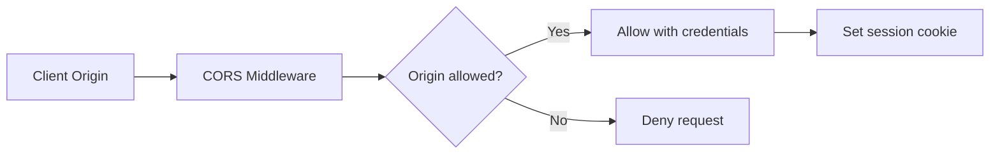

**Diagram sources**
- [app.js:29-44](file://server/src/app.js#L29-L44)
- [server.js:15-36](file://server/server.js#L15-L36)

**Section sources**
- [app.js:29-44](file://server/src/app.js#L29-L44)
- [server.js:15-36](file://server/server.js#L15-L36)

### Session-Based Authentication Guards
- requireAuth checks isAuthenticated() and rejects flagged users with 403; otherwise allows access.
- requireAdmin additionally checks role === 'admin'.
- Protected routes are mounted with these guards.

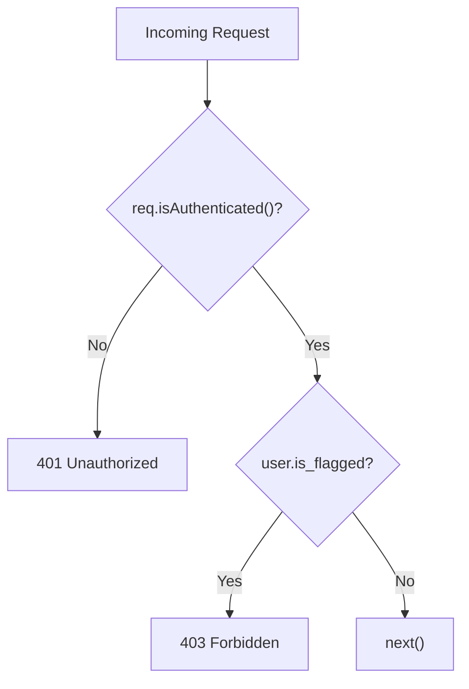

**Diagram sources**
- [authMiddleware.js:1-22](file://server/src/middleware/authMiddleware.js#L1-L22)
- [app.js:110-117](file://server/src/app.js#L110-L117)

**Section sources**
- [authMiddleware.js:1-22](file://server/src/middleware/authMiddleware.js#L1-L22)
- [app.js:110-117](file://server/src/app.js#L110-L117)

### Session Data Access Patterns
- After authentication, req.user contains the deserialized user object.
- Controllers can read req.user.user_id, username, email, role, etc.
- Example endpoints:
  - GET /api/users/me returns current user profile and derived metrics.
  - Game session endpoints operate on game-specific records and do not rely on the HTTP session.

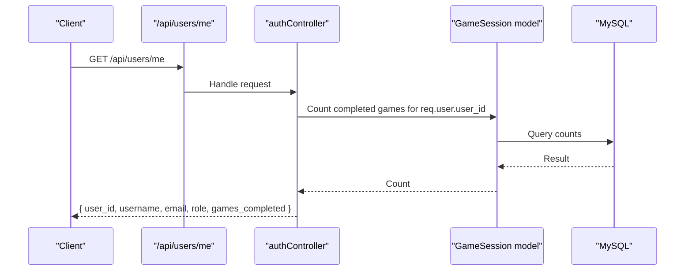

**Diagram sources**
- [authRoutes.js:97-121](file://server/src/routes/authRoutes.js#L97-L121)
- [authController.js:1-83](file://server/src/controllers/authController.js#L1-L83)

**Section sources**
- [authRoutes.js:97-121](file://server/src/routes/authRoutes.js#L97-L121)
- [authController.js:1-83](file://server/src/controllers/authController.js#L1-L83)

### Game Session Endpoints vs. HTTP Sessions
- The “game session” endpoints under /api/sessions manage per-user game activity records in the database, distinct from HTTP session state.
- These endpoints create, list, and delete active game sessions tied to user_id and arg_id.

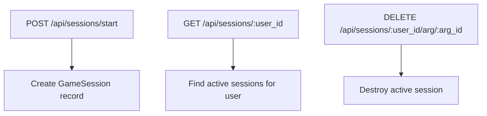

**Diagram sources**
- [sessionRoutes.js:5-7](file://server/src/routes/sessionRoutes.js#L5-L7)
- [sessionController.js:3-39](file://server/src/controllers/sessionController.js#L3-L39)

**Section sources**
- [sessionRoutes.js:1-10](file://server/src/routes/sessionRoutes.js#L1-L10)
- [sessionController.js:1-40](file://server/src/controllers/sessionController.js#L1-L40)

## Dependency Analysis
The following diagram shows how session-related modules depend on each other.

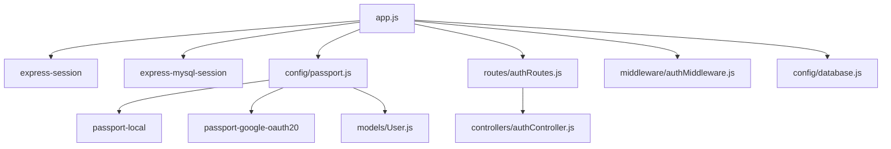

**Diagram sources**
- [app.js:1-132](file://server/src/app.js#L1-L132)
- [passport.js:1-99](file://server/src/config/passport.js#L1-L99)
- [authRoutes.js:1-124](file://server/src/routes/authRoutes.js#L1-L124)
- [authController.js:1-83](file://server/src/controllers/authController.js#L1-L83)
- [authMiddleware.js:1-22](file://server/src/middleware/authMiddleware.js#L1-L22)
- [database.js:1-37](file://server/src/config/database.js#L1-L37)

**Section sources**
- [app.js:1-132](file://server/src/app.js#L1-L132)
- [passport.js:1-99](file://server/src/config/passport.js#L1-L99)
- [authRoutes.js:1-124](file://server/src/routes/authRoutes.js#L1-L124)
- [authController.js:1-83](file://server/src/controllers/authController.js#L1-L83)
- [authMiddleware.js:1-22](file://server/src/middleware/authMiddleware.js#L1-L22)
- [database.js:1-37](file://server/src/config/database.js#L1-L37)

## Performance Considerations
- Serialization minimizes session payload by storing only the user ID.
- MySQL-backed sessions enable horizontal scaling across multiple server instances.
- Avoid unnecessary session writes by keeping resave: false and saveUninitialized: false.
- Consider enabling session regeneration after login to mitigate fixation risks.
- Monitor MySQL connection pool and session store error events.

[No sources needed since this section provides general guidance]

## Troubleshooting Guide
Common issues and resolutions:
- Session not persisting across restarts:
  - Ensure NODE_ENV is not test and MySQL store is initialized.
  - Verify DATABASE_URL and MySQL connectivity.
- Cross-origin requests failing:
  - Confirm CLIENT_URL includes the exact origin and trailing slash normalization.
  - Ensure credentials: true is set on both client and server.
- Cookies not sent cross-site:
  - In production, ensure sameSite: none and secure: true are set and served over HTTPS.
- Unauthorized errors on protected routes:
  - Verify passport.initialize() and passport.session() are applied before routes.
  - Check requireAuth guard and user.is_flagged status.
- Session store errors:
  - Inspect MySQL connection and SSL settings; review error logs from the session store.

**Section sources**
- [app.js:50-88](file://server/src/app.js#L50-L88)
- [authMiddleware.js:1-22](file://server/src/middleware/authMiddleware.js#L1-L22)
- [authRoutes.js:84-95](file://server/src/routes/authRoutes.js#L84-L95)

## Conclusion
The WARG Platform implements robust session management using express-session with MySQL persistence, Passport.js for authentication, and secure cookie/CORS configurations for cross-domain operations. Serialization stores only user IDs, while deserialization fetches full user profiles securely. With proper environment configuration, the system scales horizontally and maintains secure, predictable session lifecycles. For enhanced security, consider adding session regeneration after login and tightening cookie policies according to deployment needs.