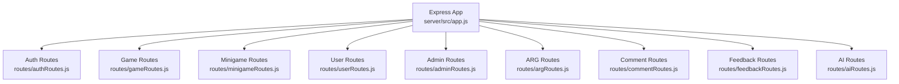
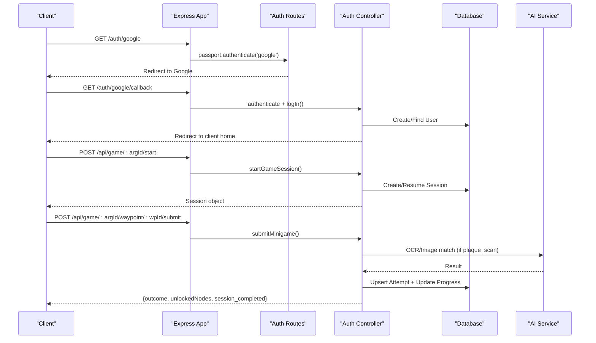
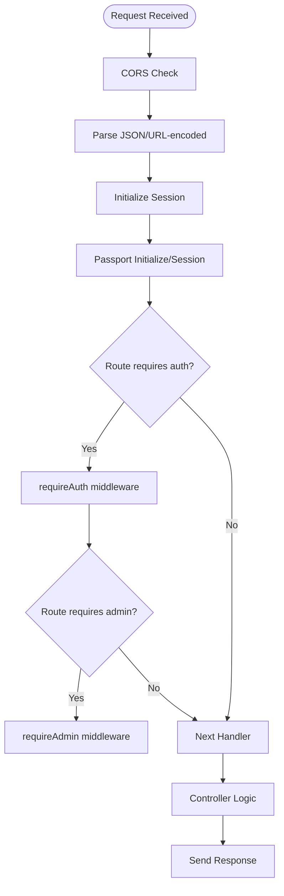
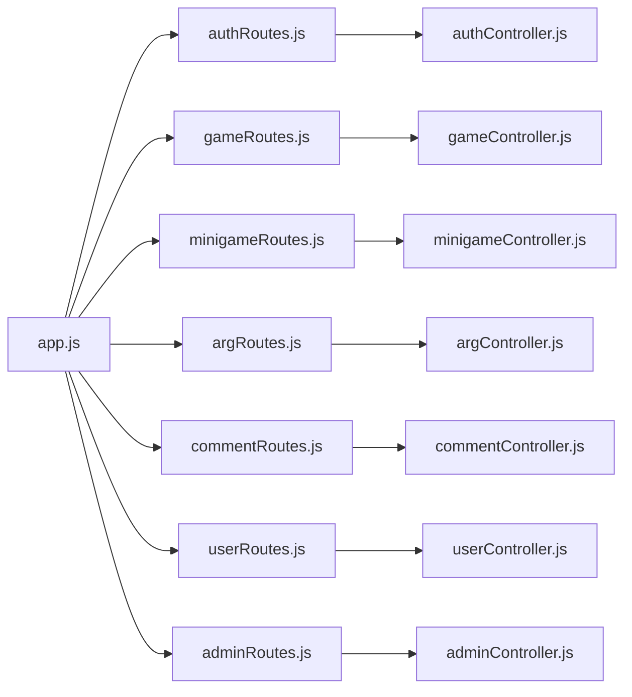

# Backend API

<cite>
**Referenced Files in This Document**
- [app.js](file://server/src/app.js)
- [authRoutes.js](file://server/src/routes/authRoutes.js)
- [gameRoutes.js](file://server/src/routes/gameRoutes.js)
- [minigameRoutes.js](file://server/src/routes/minigameRoutes.js)
- [userRoutes.js](file://server/src/routes/userRoutes.js)
- [adminRoutes.js](file://server/src/routes/adminRoutes.js)
- [argRoutes.js](file://server/src/routes/argRoutes.js)
- [commentRoutes.js](file://server/src/routes/commentRoutes.js)
- [authController.js](file://server/src/controllers/authController.js)
- [gameController.js](file://server/src/controllers/gameController.js)
- [minigameController.js](file://server/src/controllers/minigameController.js)
- [userController.js](file://server/src/controllers/userController.js)
- [adminController.js](file://server/src/controllers/adminController.js)
- [argController.js](file://server/src/controllers/argController.js)
- [commentController.js](file://server/src/controllers/commentController.js)
- [authMiddleware.js](file://server/src/middleware/authMiddleware.js)
</cite>

## Table of Contents
1. [Introduction](#introduction)
2. [Project Structure](#project-structure)
3. [Core Components](#core-components)
4. [Architecture Overview](#architecture-overview)
5. [Detailed Component Analysis](#detailed-component-analysis)
6. [Dependency Analysis](#dependency-analysis)
7. [Performance Considerations](#performance-considerations)
8. [Troubleshooting Guide](#troubleshooting-guide)
9. [Conclusion](#conclusion)

## Introduction
This document provides comprehensive backend API documentation for the WARG Platform’s Express.js server. It covers REST endpoints across authentication, game management, waypoint operations, minigames, ARGs (games), comments, feedback, users, and admin functions. It also documents middleware architecture including authentication guards, anti-spoofing mechanisms, input validation, Passport.js OAuth with Google, session management, and role-based access control. Practical examples and integration patterns are included to help client applications integrate effectively.

## Project Structure
The server is an Express application that:
- Configures CORS, JSON parsing, sessions, and Passport.js
- Mounts route modules under specific URL prefixes
- Applies global and per-route middleware for authentication and authorization
- Serves static client assets

**Diagram sources**
- [app.js:90-117](file://server/src/app.js#L90-L117)

**Section sources**
- [app.js:1-132](file://server/src/app.js#L1-L132)

## Core Components
- Authentication and Sessions
  - Local login/signup, Google OAuth, logout, current user profile
  - Session configuration with MySQL persistence in production and in-memory in tests
- Game Management
  - Start/resume game sessions, get game state, abandon sessions
- Waypoint Operations
  - Geofence arrival checks with spatial queries
- Minigame Handling
  - Reference image upload/retrieval, attempt submission, AI evaluation integration
- ARGs (Games)
  - CRUD for ARGs, waypoints, edges, cover images, voting, flagging
- Comments
  - List and create comments on ARGs
- Users and Social Features
  - User profiles, library, friends, friend requests
- Admin
  - Flag review, user search/ban toggle, content moderation

**Section sources**
- [authRoutes.js:1-124](file://server/src/routes/authRoutes.js#L1-L124)
- [gameRoutes.js:1-13](file://server/src/routes/gameRoutes.js#L1-L13)
- [minigameRoutes.js:1-19](file://server/src/routes/minigameRoutes.js#L1-L19)
- [argRoutes.js:1-32](file://server/src/routes/argRoutes.js#L1-L32)
- [commentRoutes.js:1-9](file://server/src/routes/commentRoutes.js#L1-L9)
- [userRoutes.js:1-15](file://server/src/routes/userRoutes.js#L1-L15)
- [adminRoutes.js:1-19](file://server/src/routes/adminRoutes.js#L1-L19)

## Architecture Overview
The server uses a layered architecture:
- Middleware layer: CORS, body parsers, sessions, Passport initialization, auth guards, anti-spoofing
- Route layer: Express routers grouped by feature
- Controller layer: Business logic, data access via Sequelize models
- External integrations: AI service for OCR/image matching

**Diagram sources**
- [authRoutes.js:6-55](file://server/src/routes/authRoutes.js#L6-L55)
- [gameController.js:40-83](file://server/src/controllers/gameController.js#L40-L83)
- [gameController.js:204-349](file://server/src/controllers/gameController.js#L204-L349)

## Detailed Component Analysis

### Authentication and Sessions
Endpoints:
- GET /auth/google
  - Purpose: Initiate Google OAuth flow
  - Auth: None
  - Response: Redirect to Google
- GET /auth/google/callback
  - Purpose: Handle Google OAuth callback
  - Auth: None
  - Response: Redirect to client page with success or error
- POST /auth/signup
  - Purpose: Local signup
  - Auth: None
  - Request: username, email, password
  - Response: 201 with user info
  - Errors: 400 if fields missing or duplicates; 500 on server error
- GET /auth/check-user
  - Purpose: Check if email/username exists
  - Auth: None
  - Query: email or username
  - Response: { exists: boolean, field?: string }
- POST /auth/login
  - Purpose: Local login
  - Auth: None
  - Request: username/email, password
  - Response: { message, user_id }
  - Errors: 401 if invalid credentials; 500 on server/session errors
- GET /auth/logout
  - Purpose: Logout and destroy session
  - Auth: Required
  - Response: { message }
- GET /auth/me
  - Purpose: Get current user profile with games completed count
  - Auth: Required
  - Response: { user_id, username, email, role, games_completed, profile_picture }
  - Errors: 401 if not authenticated; 500 on server error

Authentication requirements:
- Requires active session via Passport.js
- Cookies: secure, httpOnly, sameSite configured per environment

Error handling:
- Consistent JSON error responses with descriptive messages
- Redirects for OAuth flows with query parameters indicating error type

Integration pattern:
- Store requesting origin in session during Google OAuth redirect to return to correct client page
- After successful login, set session and redirect to client home

**Section sources**
- [authRoutes.js:6-124](file://server/src/routes/authRoutes.js#L6-L124)
- [authController.js:5-83](file://server/src/controllers/authController.js#L5-L83)
- [app.js:48-88](file://server/src/app.js#L48-L88)

### Game Management
Endpoints:
- POST /api/game/:argId/start
  - Purpose: Start or resume a game session
  - Auth: Required
  - Response: Session object
  - Errors: 500 on failure
- GET /api/game/:argId/state
  - Purpose: Get full game state (session, waypoints, progress, attempts, edges)
  - Auth: Optional (defaults to user_id=1 if unauthenticated)
  - Response: { session, waypoints, progress, attempts, edges }
  - Errors: 404 if session not found; 500 on failure
- POST /api/game/:argId/abandon
  - Purpose: Abandon current session
  - Auth: Required
  - Response: { success: true }
  - Errors: 500 on failure

Behavior highlights:
- Dynamic root node allocation and lockout prevention
- Automatic completion detection when all required nodes are completed

**Section sources**
- [gameRoutes.js:6-10](file://server/src/routes/gameRoutes.js#L6-L10)
- [gameController.js:40-161](file://server/src/controllers/gameController.js#L40-L161)

### Waypoint Operations
Endpoints:
- POST /api/game/:argId/waypoint/:waypointId/arrive
  - Purpose: Validate geofence proximity before allowing minigame submission
  - Auth: Required
  - Anti-spoofing: Enabled via middleware
  - Request: lat, lng, accuracy_m
  - Response: { within_radius, distance, radius }
  - Errors: 400 if coordinates missing; 404 if waypoint not found; 500 on failure

Spatial processing:
- Uses ST_Distance_Sphere to compute distance between provided coordinates and waypoint location
- Logs LocationEvent for auditability

**Section sources**
- [gameRoutes.js:8](file://server/src/routes/gameRoutes.js#L8)
- [gameController.js:163-201](file://server/src/controllers/gameController.js#L163-L201)

### Minigame Handling
Endpoints:
- POST /api/minigames/:gameId/reference
  - Purpose: Upload reference image for plaque scan or similar minigames
  - Auth: Required
  - Request: multipart/form-data with field 'image'
  - Response: { message, url }
  - Errors: 400 if no image; 404 if minigame not found; 500 on server error
- GET /api/minigames/:gameId/reference/image
  - Purpose: Retrieve stored reference image
  - Auth: Not required (public endpoint)
  - Response: Image bytes with appropriate Content-Type
  - Errors: 404 if not found; 500 on server error
- POST /api/minigames/:gameId/attempt
  - Purpose: Submit attempt image for AI evaluation
  - Auth: Required
  - Request: multipart/form-data with field 'image'
  - Response: AI evaluation result
  - Errors: 400 if no image or unsupported game type; 404 if minigame not found; 500 on server error

AI integration:
- For plaque_scan, submits player image and reference image to AI service for OCR matching
- For other types (shape_match, colour_match, texture_match, sift_match, symmetry_finder), forwards to corresponding AI endpoints

**Section sources**
- [minigameRoutes.js:11-17](file://server/src/routes/minigameRoutes.js#L11-L17)
- [minigameController.js:7-126](file://server/src/controllers/minigameController.js#L7-L126)

### ARGs (Games)
Endpoints:
- GET /api/args
  - Purpose: List published ARGs with optional user vote context
  - Auth: Optional
  - Response: Array of ARG objects with creator and user_vote
- GET /api/args/:id
  - Purpose: Get ARG details including waypoints, edges, minigames, and user vote
  - Auth: Optional
  - Response: ARG object with nested data
  - Errors: 404 if not found; 500 on failure
- POST /api/args
  - Purpose: Create ARG with waypoints, edges, and minigames
  - Auth: Optional (creator_id defaults to 1 if not provided)
  - Request: title, description, status, waypoints[], edges[]
  - Response: Created ARG with idMap, minigameMap, wpObjMap
  - Errors: 500 on failure
- PUT /api/args/:id
  - Purpose: Update ARG metadata, waypoints, edges, and minigames
  - Auth: Optional (creator check enforced)
  - Request: title, description, status, waypoints[], edges[]
  - Response: Updated ARG with mapping helpers
  - Errors: 404 if not found; 403 if not authorized; 500 on failure
- PATCH /api/args/:id/status
  - Purpose: Update ARG status (unpublished/published/retired)
  - Auth: Required
  - Request: status
  - Response: Updated ARG
  - Errors: 404 if not found; 403 if not authorized; 500 on failure
- POST /api/args/:id/vote
  - Purpose: Like/dislike an ARG
  - Auth: Optional
  - Request: user_id, vote ('like' | 'dislike')
  - Response: { success, action, like_count, dislike_count }
  - Errors: 400 if missing fields; 500 on failure
- POST /api/args/:id/flag
  - Purpose: Flag an ARG for moderation
  - Auth: Optional
  - Request: reporter_id, reason, description
  - Response: Created flag object
  - Errors: 400 if missing fields; 500 on failure
- POST /api/args/:id/cover-image
  - Purpose: Upload cover image for ARG
  - Auth: Required
  - Request: multipart/form-data with field 'image'
  - Response: { message }
  - Errors: 400 if no image; 404 if ARG not found; 403 if not authorized; 500 on server error
- GET /api/args/:id/cover-image
  - Purpose: Retrieve ARG cover image
  - Auth: Not required
  - Response: Image bytes
  - Errors: 404 if not found; 500 on server error

Validation and sanitization:
- Status values sanitized to allowed set
- File filter restricts uploads to images
- Creator authorization enforced for updates and cover image upload

**Section sources**
- [argRoutes.js:21-29](file://server/src/routes/argRoutes.js#L21-L29)
- [argController.js:3-452](file://server/src/controllers/argController.js#L3-L452)

### Comments
Endpoints:
- GET /api/comments/arg/:argId
  - Purpose: List comments for an ARG
  - Auth: Not required
  - Response: Array of comment objects with author username
  - Errors: 500 on failure
- POST /api/comments/arg/:argId
  - Purpose: Create a comment on an ARG
  - Auth: Required
  - Request: body, parent_id (optional), is_spoiler (optional)
  - Response: Created comment object
  - Errors: 401 if not authenticated; 400 if empty body; 500 on failure

**Section sources**
- [commentRoutes.js:5-6](file://server/src/routes/commentRoutes.js#L5-L6)
- [commentController.js:3-50](file://server/src/controllers/commentController.js#L3-L50)

### Users and Social Features
Endpoints:
- GET /api/users/search/query
  - Purpose: Search users by username
  - Auth: Not required
  - Query: q (search term)
  - Response: Array of user objects (id, username, avatar)
- GET /api/users/:id
  - Purpose: Get user profile with badges and games completed count
  - Auth: Not required
  - Response: User object with badges and games_completed
  - Errors: 404 if not found; 500 on failure
- GET /api/users/:id/library
  - Purpose: Get ARGs created by a user
  - Auth: Not required
  - Response: Array of ARG objects
  - Errors: 500 on failure
- GET /api/users/:id/friends
  - Purpose: Get accepted friends with optional active game info
  - Auth: Not required
  - Response: Array of user objects with active game context
  - Errors: 500 on failure
- DELETE /api/users/:id/friends/:friendId
  - Purpose: Remove a friend connection
  - Auth: Not required
  - Response: { success, message }
  - Errors: 404 if connection not found; 500 on failure
- GET /api/users/:id/friends/requests
  - Purpose: Get pending friend requests received by a user
  - Auth: Not required
  - Response: Array of request objects with sender details
  - Errors: 500 on failure
- POST /api/users/:id/friends/request
  - Purpose: Send a friend request
  - Auth: Not required
  - Request: receiverId
  - Response: Created request object
  - Errors: 400 if self-request or duplicate; 500 on failure
- PUT /api/users/friends/requests/:requestId
  - Purpose: Accept or decline a friend request
  - Auth: Not required
  - Request: status ('accepted' | 'declined')
  - Response: Updated request object
  - Errors: 400 if invalid status; 404 if not found; 500 on failure

**Section sources**
- [userRoutes.js:5-12](file://server/src/routes/userRoutes.js#L5-L12)
- [userController.js:4-226](file://server/src/controllers/userController.js#L4-L226)

### Admin
Endpoints:
- GET /api/admin/flags
  - Purpose: List open/reviewing flags with reporter and ARG info
  - Auth: Required + Admin
  - Response: Array of flag objects
  - Errors: 500 on failure
- PUT /api/admin/flags/:id/resolve
  - Purpose: Resolve a flag
  - Auth: Required + Admin
  - Response: { message, flag }
  - Errors: 404 if not found; 500 on failure
- GET /api/admin/users
  - Purpose: Search users by username/email with trust score ordering
  - Auth: Required + Admin
  - Query: search
  - Response: Array of user objects
  - Errors: 500 on failure
- PUT /api/admin/users/:id/ban
  - Purpose: Toggle user ban status (is_flagged)
  - Auth: Required + Admin
  - Response: { message, user }
  - Errors: 404 if not found; 500 on failure
- DELETE /api/admin/games/:id
  - Purpose: Delete an ARG
  - Auth: Required + Admin
  - Response: { message }
  - Errors: 404 if not found; 500 on failure
- DELETE /api/admin/comments/:id
  - Purpose: Delete a comment
  - Auth: Required + Admin
  - Response: { message }
  - Errors: 404 if not found; 500 on failure

Authorization:
- All admin routes require both authentication and admin role

**Section sources**
- [adminRoutes.js:9-16](file://server/src/routes/adminRoutes.js#L9-L16)
- [adminController.js:4-124](file://server/src/controllers/adminController.js#L4-L124)

### Middleware Architecture
- Authentication Guards
  - requireAuth: Ensures user is authenticated and not banned; returns 401/403 accordingly
  - requireAdmin: Ensures user has admin role; returns 403 otherwise
- Anti-Spoofing
  - Applied to sensitive game actions such as arriving at a waypoint
- Input Validation
  - Multer file filters for images
  - Body parsing limits and extended URL encoding support
- Session Management
  - express-session with MySQLStore in production; in-memory store in tests
  - Cookie settings: maxAge 24h, secure/httpOnly/sameSite based on environment
- CORS
  - Allowed origins from CLIENT_URL env var; local development allows localhost

**Diagram sources**
- [app.js:44-88](file://server/src/app.js#L44-L88)
- [authMiddleware.js:1-22](file://server/src/middleware/authMiddleware.js#L1-L22)

**Section sources**
- [app.js:29-88](file://server/src/app.js#L29-L88)
- [authMiddleware.js:1-22](file://server/src/middleware/authMiddleware.js#L1-L22)

### Passport.js OAuth Integration with Google
- Strategy: Google OAuth with profile and email scopes
- Flow:
  - GET /auth/google initiates OAuth and stores referer origin in session
  - GET /auth/google/callback authenticates via Passport, logs in user, and redirects to client home
- Error handling:
  - Redirects to client with error query parameters for server_error, auth_failed, session_error

**Section sources**
- [authRoutes.js:6-55](file://server/src/routes/authRoutes.js#L6-L55)

### Role-Based Access Control
- requireAuth: Validates isAuthenticated and bans check
- requireAdmin: Validates role === 'admin'
- Applied globally to /api/game and /api/admin routes

**Section sources**
- [authMiddleware.js:1-22](file://server/src/middleware/authMiddleware.js#L1-L22)
- [app.js:110-117](file://server/src/app.js#L110-L117)

## Dependency Analysis
Key dependencies and relationships:
- app.js mounts routers and applies global middleware
- Controllers depend on Sequelize models for data access
- Minigame controller integrates with external AI service
- Game controller evaluates branching conditions using MinigameAttempt outcomes

**Diagram sources**
- [app.js:90-117](file://server/src/app.js#L90-L117)

**Section sources**
- [app.js:90-117](file://server/src/app.js#L90-L117)

## Performance Considerations
- Use of transactions for multi-step operations (e.g., creating ARG with waypoints and edges)
- Spatial queries leverage database functions for efficient distance calculations
- Multer memory storage avoids disk I/O but increases memory usage; consider streaming for large files
- AI service calls can be slow; implement retries and timeouts in client code
- Session persistence via MySQLStore reduces restart impact but adds DB load

[No sources needed since this section provides general guidance]

## Troubleshooting Guide
Common issues and resolutions:
- Unauthorized errors
  - Ensure session cookies are sent with requests (credentials: true in fetch)
  - Verify Passport session initialization and cookie settings
- Forbidden errors
  - Check user role for admin routes
  - Ensure user is not flagged/banned
- AI service failures
  - Validate AI_SERVICE_URL and API keys
  - Inspect error logs for response codes and messages
- File upload errors
  - Confirm Content-Type multipart/form-data
  - Ensure file size within limits and MIME type allowed

**Section sources**
- [authMiddleware.js:1-22](file://server/src/middleware/authMiddleware.js#L1-L22)
- [minigameController.js:107-126](file://server/src/controllers/minigameController.js#L107-L126)

## Conclusion
The WARG Platform backend provides a robust set of APIs for authentication, game management, waypoint validation, minigame handling, ARG creation and interaction, comments, social features, and administration. The middleware architecture ensures secure access through authentication and role checks, while anti-spoofing protects critical gameplay actions. Integration with an AI service enables advanced minigame evaluations. Clients should handle authentication via sessions, respect rate limits and error responses, and follow the documented request/response schemas for reliable integration.

[No sources needed since this section summarizes without analyzing specific files]