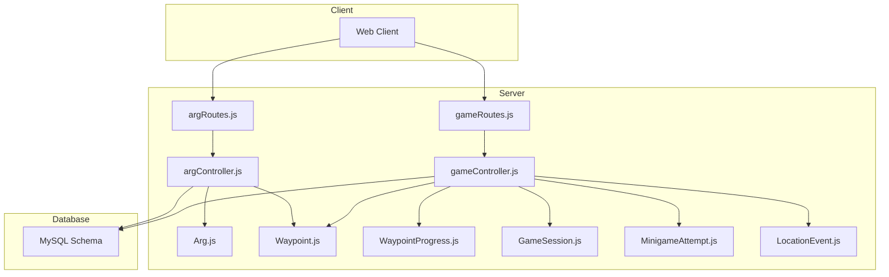
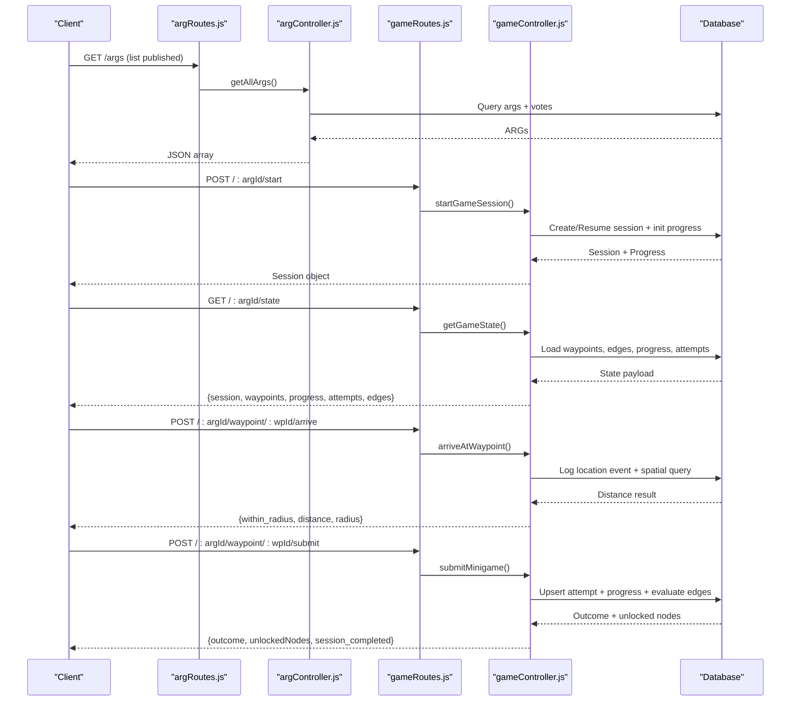
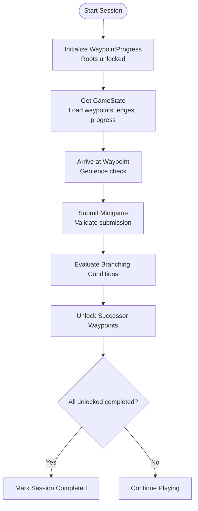
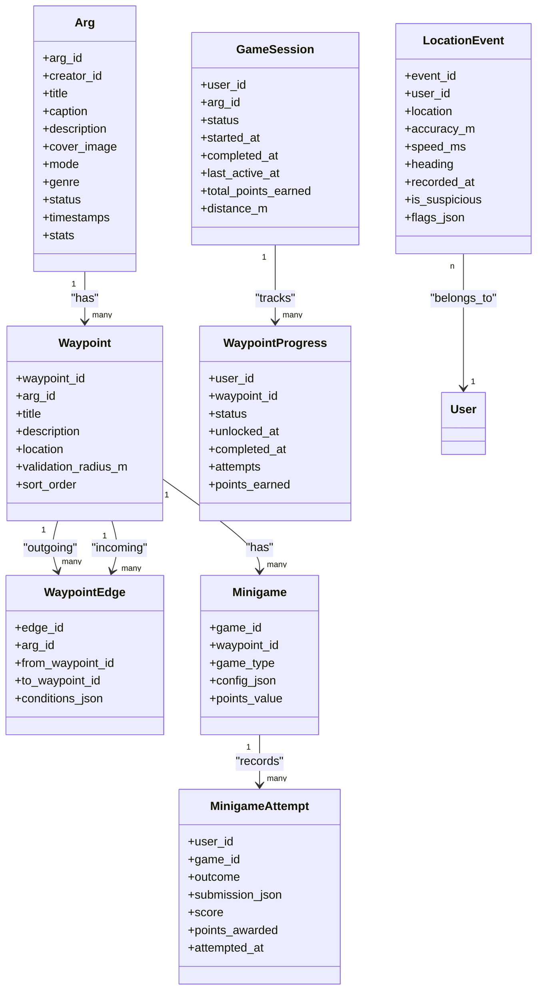

# Game Management APIs

<cite>
**Referenced Files in This Document**
- [gameRoutes.js](file://server/src/routes/gameRoutes.js)
- [gameController.js](file://server/src/controllers/gameController.js)
- [argRoutes.js](file://server/src/routes/argRoutes.js)
- [argController.js](file://server/src/controllers/argController.js)
- [GameSession.js](file://server/src/models/GameSession.js)
- [Arg.js](file://server/src/models/Arg.js)
- [Waypoint.js](file://server/src/models/Waypoint.js)
- [WaypointProgress.js](file://server/src/models/WaypointProgress.js)
- [MinigameAttempt.js](file://server/src/models/MinigameAttempt.js)
- [LocationEvent.js](file://server/src/models/LocationEvent.js)
- [schema.sql](file://database/schema.sql)
</cite>

## Table of Contents
1. [Introduction](#introduction)
2. [Project Structure](#project-structure)
3. [Core Components](#core-components)
4. [Architecture Overview](#architecture-overview)
5. [Detailed Component Analysis](#detailed-component-analysis)
6. [Dependency Analysis](#dependency-analysis)
7. [Performance Considerations](#performance-considerations)
8. [Troubleshooting Guide](#troubleshooting-guide)
9. [Conclusion](#conclusion)

## Introduction
This document provides detailed API documentation for game management endpoints in the WARG Platform, focusing on:
- ARG (Alternate Reality Game) lifecycle: creation, editing, publishing, and metadata operations
- Game session management: starting sessions, tracking player progress, scoring, and state persistence
- Waypoint assignment, branching logic, difficulty scaling via minigames, and spatial validation
- Discovery and filtering of published games
- Request/response schemas, validation rules, and business constraints
- Example workflows and error handling strategies

The scope covers both creator-facing ARG management and player-facing gameplay flows.

## Project Structure
The game management functionality is implemented across routes, controllers, models, and database schema:
- Routes define HTTP endpoints for ARGs and gameplay
- Controllers implement business logic for ARG CRUD, voting, flagging, cover image upload, and gameplay flows
- Models define data structures for ARGs, waypoints, edges, minigames, sessions, attempts, and location events
- Database schema defines tables, indexes, and relationships

**Diagram sources**
- [argRoutes.js:21-29](file://server/src/routes/argRoutes.js#L21-L29)
- [gameRoutes.js:6-10](file://server/src/routes/gameRoutes.js#L6-L10)
- [argController.js:3-451](file://server/src/controllers/argController.js#L3-L451)
- [gameController.js:41-367](file://server/src/controllers/gameController.js#L41-L367)
- [Arg.js:4-28](file://server/src/models/Arg.js#L4-L28)
- [Waypoint.js:4-17](file://server/src/models/Waypoint.js#L4-L17)
- [WaypointProgress.js:4-15](file://server/src/models/WaypointProgress.js#L4-L15)
- [GameSession.js:4-16](file://server/src/models/GameSession.js#L4-L16)
- [MinigameAttempt.js:4-15](file://server/src/models/MinigameAttempt.js#L4-L15)
- [LocationEvent.js:4-18](file://server/src/models/LocationEvent.js#L4-L18)

**Section sources**
- [argRoutes.js:21-29](file://server/src/routes/argRoutes.js#L21-L29)
- [gameRoutes.js:6-10](file://server/src/routes/gameRoutes.js#L6-L10)
- [schema.sql:114-151](file://database/schema.sql#L114-L151)

## Core Components
- ARG management: list, get by ID, create, update, status transitions, vote, flag, cover image upload/get
- Gameplay management: start/resume session, fetch full game state, geofence arrival check, minigame submission with branching unlock, abandon session
- Data models: ARG, Waypoint, WaypointEdge, Minigame, GameSession, WaypointProgress, MinigameAttempt, LocationEvent

Key responsibilities:
- argController handles ARG discovery, creation, updates, voting, flagging, and media
- gameController handles session lifecycle, waypoint progression, minigame evaluation, and completion detection

**Section sources**
- [argController.js:3-451](file://server/src/controllers/argController.js#L3-L451)
- [gameController.js:41-367](file://server/src/controllers/gameController.js#L41-L367)

## Architecture Overview
The system exposes two primary route groups:
- ARG routes for content management and discovery
- Game routes for live gameplay interactions

**Diagram sources**
- [argRoutes.js:21-29](file://server/src/routes/argRoutes.js#L21-L29)
- [gameRoutes.js:6-10](file://server/src/routes/gameRoutes.js#L6-L10)
- [argController.js:3-54](file://server/src/controllers/argController.js#L3-L54)
- [gameController.js:41-367](file://server/src/controllers/gameController.js#L41-L367)

## Detailed Component Analysis

### ARG Management Endpoints
- List published ARGs
  - Method: GET
  - Path: /args
  - Response: Array of ARG objects including creator info and user vote context
  - Notes: Only published ARGs are returned; includes optional user vote if authenticated

- Get ARG by ID
  - Method: GET
  - Path: /args/:id
  - Response: ARG object with waypoints, minigames, edges, and user vote context
  - Error: 404 if not found

- Create ARG
  - Method: POST
  - Path: /args
  - Request body: title, description, status, waypoints[], edges[]
  - Behavior: Creates ARG, waypoints, minigames, and edges in a transaction; returns id mapping
  - Validation: Status sanitized to allowed values; waypoints include geospatial points

- Update ARG
  - Method: PUT
  - Path: /args/:id
  - Request body: title, description, status, waypoints[], edges[]
  - Behavior: Updates ARG metadata; reconciles existing/new waypoints and minigames; replaces edges
  - Authorization: Creator-only update

- Update ARG status
  - Method: PATCH
  - Path: /args/:id/status
  - Request body: status
  - Authorization: requireAuth middleware

- Vote on ARG
  - Method: POST
  - Path: /args/:id/vote
  - Request body: vote, user_id
  - Behavior: Toggle or update vote; updates like/dislike counts

- Flag ARG
  - Method: POST
  - Path: /args/:id/flag
  - Request body: reporter_id, reason, description
  - Behavior: Creates moderation flag record

- Upload cover image
  - Method: POST
  - Path: /args/:id/cover-image
  - Authorization: requireAuth
  - File: Single image file, max 5MB, image/* only
  - Behavior: Stores image buffer in ARG.cover_image

- Get cover image
  - Method: GET
  - Path: /args/:id/cover-image
  - Response: Image/jpeg binary

Request/response schemas:
- ARG fields: arg_id, creator_id, title, caption, description, cover_image, mode, genre, status, timestamps, aggregate stats
- Waypoint fields: waypoint_id, arg_id, title, description, location (POINT), validation_radius_m, sort_order
- Edge fields: edge_id, arg_id, from_waypoint_id, to_waypoint_id, conditions_json
- Minigame fields: game_id, waypoint_id, game_type, config_json, points_value

Validation rules and constraints:
- Status must be one of unpublished, published, retired
- Cover image must be an image file under size limit
- Waypoint locations use SRID 4326 geometry
- Edges enforce unique pairs per ARG

Error handling:
- 404 for missing ARGs
- 403 for unauthorized updates
- 500 for server errors

Example workflow:
- Create ARG with waypoints and edges
- Upload cover image
- Publish ARG via status update

**Section sources**
- [argRoutes.js:21-29](file://server/src/routes/argRoutes.js#L21-L29)
- [argController.js:3-451](file://server/src/controllers/argController.js#L3-L451)
- [Arg.js:4-28](file://server/src/models/Arg.js#L4-L28)
- [Waypoint.js:4-17](file://server/src/models/Waypoint.js#L4-L17)
- [schema.sql:114-151](file://database/schema.sql#L114-L151)
- [schema.sql:160-203](file://database/schema.sql#L160-L203)
- [schema.sql:212-246](file://database/schema.sql#L212-L246)

### Game Session Management Endpoints
- Start or resume game session
  - Method: POST
  - Path: /:argId/start
  - Authentication: Not required here; user identity derived from request context
  - Behavior: Creates new session if none exists; initializes waypoint progress; reactivates abandoned sessions
  - Response: Session object

- Get full game state
  - Method: GET
  - Path: /:argId/state
  - Behavior: Returns session, waypoints with minigames, waypoint progress, minigame attempts, and edges
  - Dynamic behavior: Unlocks root waypoints if none unlocked; marks session completed when all unlocked are completed

- Arrive at waypoint (geofence check)
  - Method: POST
  - Path: /:argId/waypoint/:waypointId/arrive
  - Authentication: requireAuth
  - Anti-spoofing: antiSpoofing middleware applied
  - Request body: lat, lng, accuracy_m
  - Behavior: Logs location event; computes distance using spatial query; returns within_radius, distance, radius

- Submit minigame
  - Method: POST
  - Path: /:argId/waypoint/:waypointId/submit
  - Request body: game_id, submission
  - Behavior: Validates submission based on game type; upserts attempt; updates waypoint progress; evaluates branching edges; detects session completion
  - Response: outcome, unlockedNodes, session_completed

- Abandon session
  - Method: POST
  - Path: /:argId/abandon
  - Behavior: Sets session status to abandoned

Data models and persistence:
- GameSession: user_id, arg_id, status, started_at, completed_at, last_active_at, total_points_earned, distance_m
- WaypointProgress: user_id, waypoint_id, status, unlocked_at, completed_at, attempts, points_earned
- MinigameAttempt: user_id, game_id, outcome, submission_json, score, points_awarded, attempted_at
- LocationEvent: user_id, location (POINT), accuracy_m, speed_ms, heading, recorded_at, is_suspicious, flags_json

Business logic constraints:
- Branching unlocks depend on minigame outcomes via conditions_json
- Completion requires all unlocked waypoints to be completed
- Geofencing uses ST_Distance_Sphere against waypoint.location

Error handling:
- Missing coordinates return 400
- Waypoint not found returns 404
- AI service failures return 502
- General failures return 500

Example workflow:
- Start session -> Get state -> Arrive at waypoint -> Submit minigame -> Unlock next waypoints -> Complete session

**Section sources**
- [gameRoutes.js:6-10](file://server/src/routes/gameRoutes.js#L6-L10)
- [gameController.js:41-367](file://server/src/controllers/gameController.js#L41-L367)
- [GameSession.js:4-16](file://server/src/models/GameSession.js#L4-L16)
- [WaypointProgress.js:4-15](file://server/src/models/WaypointProgress.js#L4-L15)
- [MinigameAttempt.js:4-15](file://server/src/models/MinigameAttempt.js#L4-L15)
- [LocationEvent.js:4-18](file://server/src/models/LocationEvent.js#L4-L18)
- [schema.sql:287-345](file://database/schema.sql#L287-L345)
- [schema.sql:354-372](file://database/schema.sql#L354-L372)

### Waypoint Assignment and Difficulty Scaling
- Waypoint assignment:
  - Waypoints are created per ARG with geospatial coordinates and validation radius
  - Edges define directed graph connections between waypoints
  - Conditions_json on edges enables branching based on minigame outcomes

- Difficulty scaling:
  - Minigame types vary from basic (gps_proximity, text_answer) to advanced (ar_object_scan, colour_match, shape_match, plaque_scan)
  - Points value per minigame allows scoring differentiation
  - Config_json holds per-type parameters (e.g., correct answer, barcode value, reference images)

- Spatial validation:
  - Waypoint.validation_radius_m controls proximity tolerance
  - arriveAtWaypoint computes distance using spatial functions

**Diagram sources**
- [gameController.js:41-367](file://server/src/controllers/gameController.js#L41-L367)
- [schema.sql:160-203](file://database/schema.sql#L160-L203)
- [schema.sql:212-246](file://database/schema.sql#L212-L246)

**Section sources**
- [Waypoint.js:4-17](file://server/src/models/Waypoint.js#L4-L17)
- [schema.sql:160-203](file://database/schema.sql#L160-L203)
- [schema.sql:212-246](file://database/schema.sql#L212-L246)
- [gameController.js:164-201](file://server/src/controllers/gameController.js#L164-L201)
- [gameController.js:204-349](file://server/src/controllers/gameController.js#L204-L349)

### Game Discovery, Filtering, and Search
- Discovery:
  - List endpoint returns published ARGs
  - Includes creator info and user vote context
- Filtering:
  - Server-side filter by status = 'published'
- Search:
  - No explicit search parameters in current routes; client can filter locally after retrieval

Recommendations:
- Add query parameters for genre, mode, sorting by play_count or rating
- Implement full-text search on title/description

**Section sources**
- [argController.js:3-26](file://server/src/controllers/argController.js#L3-L26)
- [schema.sql:114-151](file://database/schema.sql#L114-L151)

### Authentication and Authorization
- requireAuth middleware protects sensitive endpoints (e.g., arriveAtWaypoint, cover image upload)
- Anti-spoofing middleware applied to arrival checks
- Creator authorization enforced for ARG updates and status changes

**Section sources**
- [gameRoutes.js:8-8](file://server/src/routes/gameRoutes.js#L8-L8)
- [argRoutes.js:25-28](file://server/src/routes/argRoutes.js#L25-L28)
- [argController.js:171-175](file://server/src/controllers/argController.js#L171-L175)
- [argController.js:397-400](file://server/src/controllers/argController.js#L397-L400)

## Dependency Analysis
Component relationships:
- argController depends on Arg, User, Waypoint, WaypointEdge, Minigame, ArgVote, Flag
- gameController depends on Waypoint, WaypointEdge, Minigame, GameSession, WaypointProgress, MinigameAttempt, LocationEvent
- Database schema enforces foreign keys and indexes for performance and integrity

**Diagram sources**
- [Arg.js:4-28](file://server/src/models/Arg.js#L4-L28)
- [Waypoint.js:4-17](file://server/src/models/Waypoint.js#L4-L17)
- [schema.sql:160-203](file://database/schema.sql#L160-L203)
- [schema.sql:212-246](file://database/schema.sql#L212-L246)
- [GameSession.js:4-16](file://server/src/models/GameSession.js#L4-L16)
- [WaypointProgress.js:4-15](file://server/src/models/WaypointProgress.js#L4-L15)
- [MinigameAttempt.js:4-15](file://server/src/models/MinigameAttempt.js#L4-L15)
- [LocationEvent.js:4-18](file://server/src/models/LocationEvent.js#L4-L18)

**Section sources**
- [schema.sql:114-151](file://database/schema.sql#L114-L151)
- [schema.sql:160-203](file://database/schema.sql#L160-L203)
- [schema.sql:212-246](file://database/schema.sql#L212-L246)
- [schema.sql:287-345](file://database/schema.sql#L287-L345)
- [schema.sql:354-372](file://database/schema.sql#L354-L372)

## Performance Considerations
- Spatial queries: Use SPATIAL INDEX on location columns for efficient distance calculations
- Aggregates: ARG play_count, completion_count, like_count, dislike_count denormalized for fast reads
- Transaction usage: ARG creation/update and gameplay submissions use transactions to ensure consistency
- Indexes: Multiple indexes on frequently queried columns (status, mode, genre, user_id, recorded_at)

Optimization opportunities:
- Paginate ARG listings and state responses
- Cache computed aggregates periodically
- Partition high-volume tables like location_events by time
- Stream large assets (cover images) instead of loading into memory

[No sources needed since this section provides general guidance]

## Troubleshooting Guide
Common issues and resolutions:
- Missing coordinates on arrival: Ensure lat/lng provided; server returns 400
- Waypoint not found: Verify waypoint_id exists; server returns 404
- AI service failure: Check AI_SERVICE_URL and AI_API_KEY; server returns 502
- Unauthorized updates: Confirm creator_id matches; server returns 403
- Session not found: Ensure session exists before fetching state; server returns 404

Debugging tips:
- Inspect console logs for server errors
- Validate JSON payloads for minigame submissions
- Verify spatial data format (POINT with SRID 4326)
- Review transaction rollbacks for failed operations

**Section sources**
- [gameController.js:164-201](file://server/src/controllers/gameController.js#L164-L201)
- [gameController.js:204-349](file://server/src/controllers/gameController.js#L204-L349)
- [argController.js:171-175](file://server/src/controllers/argController.js#L171-L175)
- [argController.js:397-400](file://server/src/controllers/argController.js#L397-L400)

## Conclusion
The WARG Platform’s game management APIs provide robust support for ARG lifecycle management and interactive gameplay. Creators can author ARGs with rich waypoint graphs and minigames, while players engage through session-based progression, spatial validation, and branching narratives. The architecture emphasizes data integrity via transactions, spatial indexing for performance, and clear separation of concerns across routes, controllers, and models. Future enhancements should focus on search/filter capabilities, caching, and scalability optimizations for high-volume location events.

[No sources needed since this section summarizes without analyzing specific files]