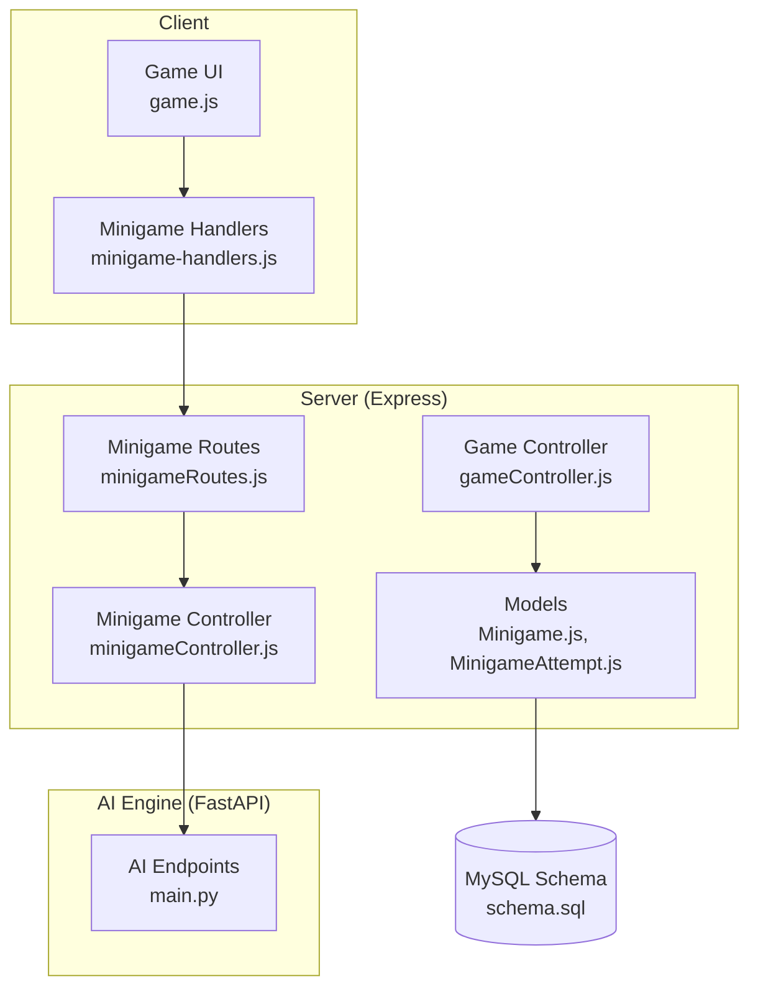
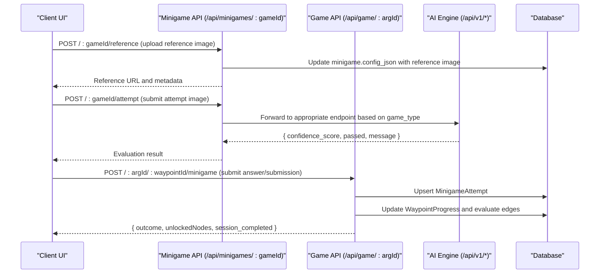
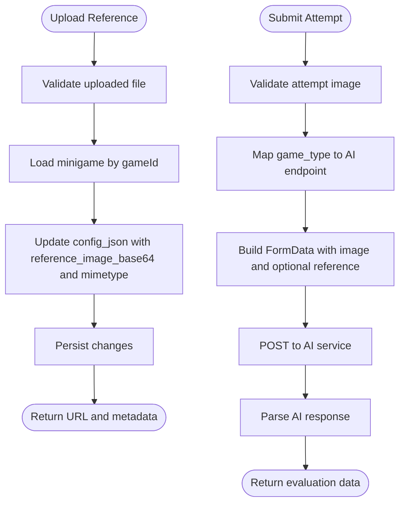
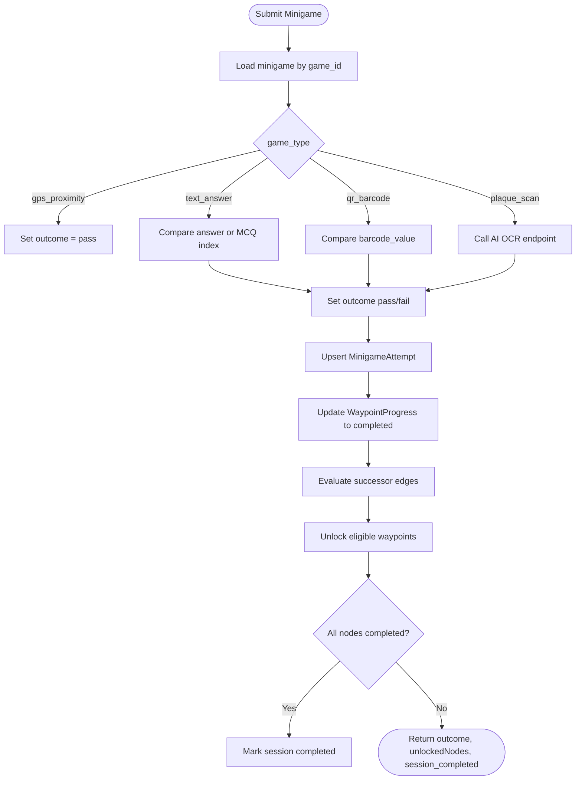
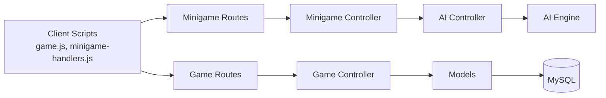

# Minigame APIs

<cite>
**Referenced Files in This Document**
- [Minigame.js](file://server/src/models/Minigame.js)
- [MinigameAttempt.js](file://server/src/models/MinigameAttempt.js)
- [minigameController.js](file://server/src/controllers/minigameController.js)
- [minigameRoutes.js](file://server/src/routes/minigameRoutes.js)
- [aiController.js](file://server/src/controllers/aiController.js)
- [aiRoutes.js](file://server/src/routes/aiRoutes.js)
- [gameController.js](file://server/src/controllers/gameController.js)
- [schema.sql](file://database/schema.sql)
- [main.py](file://ai-engine/main.py)
- [minigame-handlers.js](file://client/scripts/components/minigame-handlers.js)
- [game.js](file://client/scripts/game.js)
</cite>

## Table of Contents
1. [Introduction](#introduction)
2. [Project Structure](#project-structure)
3. [Core Components](#core-components)
4. [Architecture Overview](#architecture-overview)
5. [Detailed Component Analysis](#detailed-component-analysis)
6. [Dependency Analysis](#dependency-analysis)
7. [Performance Considerations](#performance-considerations)
8. [Troubleshooting Guide](#troubleshooting-guide)
9. [Conclusion](#conclusion)
10. [Appendices](#appendices)

## Introduction
This document provides detailed API documentation for the minigame framework that powers puzzle-based checkpoints within the WARG platform. It covers:
- Extensible minigame types including image recognition, color matching, shape detection, and custom puzzle implementations
- Minigame registration via database schema and configuration JSON
- Execution workflows from client UI to server validation and AI evaluation
- Attempt tracking, scoring algorithms, and branching logic
- AI integration endpoints for computer vision processing, confidence scoring, and result interpretation
- Type definitions, parameter schemas, and extension points for adding new puzzle types
- Examples of implementation patterns and integration with the main game engine

## Project Structure
The minigame system spans three layers:
- Client-side UI handlers render per-type puzzles and collect submissions
- Server-side Express routes and controllers validate inputs, persist attempts, and orchestrate AI evaluations
- AI Engine (FastAPI) performs specialized image analysis and returns confidence scores and pass/fail decisions

**Diagram sources**
- [minigameRoutes.js:1-19](file://server/src/routes/minigameRoutes.js#L1-L19)
- [minigameController.js:1-126](file://server/src/controllers/minigameController.js#L1-L126)
- [aiController.js:1-163](file://server/src/controllers/aiController.js#L1-L163)
- [aiRoutes.js:1-40](file://server/src/routes/aiRoutes.js#L1-L40)
- [gameController.js:1-368](file://server/src/controllers/gameController.js#L1-L368)
- [Minigame.js:1-18](file://server/src/models/Minigame.js#L1-L18)
- [MinigameAttempt.js:1-18](file://server/src/models/MinigameAttempt.js#L1-L18)
- [schema.sql:212-246](file://database/schema.sql#L212-L246)
- [schema.sql:328-345](file://database/schema.sql#L328-L345)
- [main.py:1-157](file://ai-engine/main.py#L1-L157)

**Section sources**
- [minigameRoutes.js:1-19](file://server/src/routes/minigameRoutes.js#L1-L19)
- [minigameController.js:1-126](file://server/src/controllers/minigameController.js#L1-L126)
- [aiController.js:1-163](file://server/src/controllers/aiController.js#L1-L163)
- [aiRoutes.js:1-40](file://server/src/routes/aiRoutes.js#L1-L40)
- [gameController.js:1-368](file://server/src/controllers/gameController.js#L1-L368)
- [Minigame.js:1-18](file://server/src/models/Minigame.js#L1-L18)
- [MinigameAttempt.js:1-18](file://server/src/models/MinigameAttempt.js#L1-L18)
- [schema.sql:212-246](file://database/schema.sql#L212-L246)
- [schema.sql:328-345](file://database/schema.sql#L328-L345)
- [main.py:1-157](file://ai-engine/main.py#L1-L157)

## Core Components
- Minigame model defines supported puzzle types and per-game configuration stored as JSON.
- MinigameAttempt model records each user’s latest attempt outcome, normalized score, and points awarded.
- Minigame controller exposes endpoints for uploading reference images and submitting attempts for AI evaluation.
- AI controller proxies requests to the AI engine for specific puzzle types.
- Game controller implements core gameplay flows: session management, waypoint arrival checks, minigame submission validation, and branching progression.
- Client-side minigame handlers provide UI for GPS proximity, text answers, QR/barcode scanning, and plaque photo capture.

Key responsibilities:
- Registration: Define minigame entries in the database with type and config JSON.
- Configuration: Use config_json to store per-type parameters such as correct answers, thresholds, or reference images.
- Execution: Client collects input; server validates and optionally calls AI engine; results are persisted and used to unlock next nodes.

**Section sources**
- [Minigame.js:1-18](file://server/src/models/Minigame.js#L1-L18)
- [MinigameAttempt.js:1-18](file://server/src/models/MinigameAttempt.js#L1-L18)
- [minigameController.js:1-126](file://server/src/controllers/minigameController.js#L1-L126)
- [aiController.js:1-163](file://server/src/controllers/aiController.js#L1-L163)
- [gameController.js:203-349](file://server/src/controllers/gameController.js#L203-L349)
- [minigame-handlers.js:1-202](file://client/scripts/components/minigame-handlers.js#L1-L202)

## Architecture Overview
The minigame architecture integrates client UI, server validation, and AI-powered evaluation:

**Diagram sources**
- [minigameRoutes.js:14-16](file://server/src/routes/minigameRoutes.js#L14-L16)
- [minigameController.js:7-125](file://server/src/controllers/minigameController.js#L7-L125)
- [aiController.js:3-154](file://server/src/controllers/aiController.js#L3-L154)
- [aiRoutes.js:15-37](file://server/src/routes/aiRoutes.js#L15-L37)
- [gameController.js:203-349](file://server/src/controllers/gameController.js#L203-L349)
- [schema.sql:212-246](file://database/schema.sql#L212-L246)
- [schema.sql:328-345](file://database/schema.sql#L328-L345)

## Detailed Component Analysis

### Minigame Model and Types
- Supported types include gps_proximity, text_answer, qr_barcode, ar_object_scan, colour_match, shape_match, photo_submit, texture_match, sift_match, symmetry_finder, word_scramble, plaque_scan.
- Each minigame stores flexible configuration in config_json. Examples include:
  - text_answer: answer, hint, case_sensitive, is_mcq, options, correct_index
  - colour_match: target_hsv, tolerance
  - qr_barcode: barcode_value
  - shape_match: shape_svg, jaccard_threshold
  - plaque_scan: reference_image_base64, reference_image_mimetype

Data model highlights:
- game_id auto-increments and links to a waypoint
- points_value determines reward when passing
- timestamps track creation and updates

**Section sources**
- [Minigame.js:1-18](file://server/src/models/Minigame.js#L1-L18)
- [schema.sql:212-246](file://database/schema.sql#L212-L246)

### Minigame Attempt Tracking and Scoring
- MinigameAttempt records the latest attempt per user per game with:
  - outcome: pass, fail, timeout
  - submission_json: raw player input
  - score: normalized 0.0–1.0 for graded challenges
  - points_awarded: integer points granted upon success
  - attempted_at: timestamp

Scoring behavior:
- For simple validations (text_answer, qr_barcode), score is set to 1.0 on pass and 0.0 on fail.
- For AI-driven evaluations, confidence_score from AI engine maps to score and determines pass/fail threshold.

**Section sources**
- [MinigameAttempt.js:1-18](file://server/src/models/MinigameAttempt.js#L1-L18)
- [gameController.js:279-287](file://server/src/controllers/gameController.js#L279-L287)
- [schema.sql:328-345](file://database/schema.sql#L328-L345)

### Minigame Submission Workflow (Image-Based)
The minigame controller supports uploading reference images and submitting attempts for AI evaluation. The workflow:
- Upload reference image: stores base64 and mimetype in minigame.config_json
- Submit attempt: forwards image to AI engine based on game_type mapping
- Returns AI evaluation result to client

**Diagram sources**
- [minigameController.js:7-51](file://server/src/controllers/minigameController.js#L7-L51)
- [minigameController.js:53-125](file://server/src/controllers/minigameController.js#L53-L125)

**Section sources**
- [minigameController.js:7-125](file://server/src/controllers/minigameController.js#L7-L125)

### AI Integration Endpoints
The AI controller exposes endpoints that proxy to the AI engine for specific puzzle types:
- Shape extraction: /api/v1/sam-extract
- Color matching: /api/v1/hsv-match
- Texture matching: /api/v1/texture-match
- SIFT matching: /api/v1/sift-match
- Symmetry detection: /api/v1/symmetry
- OCR plaque matching: /api/v1/ocr-match

Each endpoint:
- Validates required files
- Builds FormData with image(s)
- Calls AI engine with proper headers and body
- Returns standardized evaluation result

AI engine responses follow a consistent schema:
- confidence_score: float between 0 and 1
- passed: boolean indicating if threshold met
- message: human-readable status

Thresholds:
- Shape match: passes if confidence >= 0.75
- Color match: passes if similarity >= 0.80
- Texture match: passes if similarity >= 0.60
- SIFT and symmetry: use engine-defined logic

**Section sources**
- [aiController.js:3-154](file://server/src/controllers/aiController.js#L3-L154)
- [aiRoutes.js:15-37](file://server/src/routes/aiRoutes.js#L15-L37)
- [main.py:77-157](file://ai-engine/main.py#L77-L157)

### Game Controller: Validation and Branching Logic
The game controller handles:
- Starting/resuming game sessions
- Fetching full game state including waypoints, progress, attempts, and edges
- Geofencing via arriveAtWaypoint
- Minigame submission validation and progression

Validation rules:
- gps_proximity: pass if arrived within radius
- text_answer: exact string match or MCQ index match
- qr_barcode: exact code match
- plaque_scan: uses AI OCR evaluation

Branching logic:
- After submission, evaluates successor edges using conditions_json
- Unlocks next waypoints based on outcomes
- Marks session completed when no unlocked nodes remain

**Diagram sources**
- [gameController.js:203-349](file://server/src/controllers/gameController.js#L203-L349)

**Section sources**
- [gameController.js:203-349](file://server/src/controllers/gameController.js#L203-L349)

### Client-Side Minigame Handlers
The client provides UI handlers for several puzzle types:
- gps_proximity: prompts location verification and submits empty payload
- text_answer: supports both free-text and multiple-choice questions
- qr_barcode: integrates scanner and manual entry fallback
- plaque_scan: captures photo and submits base64 image

Handlers expose a render function that builds UI and an onSubmit callback to send data to the game engine.

**Section sources**
- [minigame-handlers.js:1-202](file://client/scripts/components/minigame-handlers.js#L1-L202)

## Dependency Analysis
The minigame system has clear separation of concerns:
- Client UI depends on minigame handlers and game engine APIs
- Server routes depend on controllers and models
- Controllers depend on AI engine for advanced evaluations
- Database schema defines relationships between minigames, attempts, waypoints, and sessions

**Diagram sources**
- [game.js:1-200](file://client/scripts/game.js#L1-L200)
- [minigame-handlers.js:1-202](file://client/scripts/components/minigame-handlers.js#L1-L202)
- [minigameRoutes.js:1-19](file://server/src/routes/minigameRoutes.js#L1-L19)
- [minigameController.js:1-126](file://server/src/controllers/minigameController.js#L1-L126)
- [aiController.js:1-163](file://server/src/controllers/aiController.js#L1-L163)
- [aiRoutes.js:1-40](file://server/src/routes/aiRoutes.js#L1-L40)
- [gameController.js:1-368](file://server/src/controllers/gameController.js#L1-L368)
- [Minigame.js:1-18](file://server/src/models/Minigame.js#L1-L18)
- [MinigameAttempt.js:1-18](file://server/src/models/MinigameAttempt.js#L1-L18)

**Section sources**
- [game.js:1-200](file://client/scripts/game.js#L1-L200)
- [minigame-handlers.js:1-202](file://client/scripts/components/minigame-handlers.js#L1-L202)
- [minigameRoutes.js:1-19](file://server/src/routes/minigameRoutes.js#L1-L19)
- [minigameController.js:1-126](file://server/src/controllers/minigameController.js#L1-L126)
- [aiController.js:1-163](file://server/src/controllers/aiController.js#L1-L163)
- [aiRoutes.js:1-40](file://server/src/routes/aiRoutes.js#L1-L40)
- [gameController.js:1-368](file://server/src/controllers/gameController.js#L1-L368)
- [Minigame.js:1-18](file://server/src/models/Minigame.js#L1-L18)
- [MinigameAttempt.js:1-18](file://server/src/models/MinigameAttempt.js#L1-L18)

## Performance Considerations
- Image uploads are limited to 5MB at the route level to prevent excessive payloads.
- AI engine endpoints perform CPU-intensive operations; ensure adequate scaling and caching where possible.
- Database queries for game state and attempts should be optimized with indexes already present in the schema.
- Avoid repeated AI calls by caching reference images and common configurations.

[No sources needed since this section provides general guidance]

## Troubleshooting Guide
Common issues and resolutions:
- Missing reference image: Ensure reference image is uploaded before attempting AI evaluation; check minigame.config_json fields.
- AI service errors: Verify AI_SERVICE_URL and network connectivity; inspect error logs for HTTP status codes.
- Incorrect game_type mapping: Confirm game_type matches supported AI endpoints in the controller switch statement.
- Session completion not updating: Verify edge conditions and waypoint progress states; ensure all nodes are evaluated correctly.

**Section sources**
- [minigameController.js:95-105](file://server/src/controllers/minigameController.js#L95-L105)
- [minigameController.js:107-125](file://server/src/controllers/minigameController.js#L107-L125)
- [gameController.js:239-273](file://server/src/controllers/gameController.js#L239-L273)

## Conclusion
The minigame framework provides a robust, extensible system for integrating diverse puzzle types into the WARG platform. By leveraging configurable minigame definitions, structured attempt tracking, and AI-powered evaluations, creators can design engaging gameplay experiences. The architecture ensures clear separation of concerns, scalable evaluation pipelines, and comprehensive tracking of player progress and outcomes.

[No sources needed since this section summarizes without analyzing specific files]

## Appendices

### Minigame Type Definitions and Parameter Schemas
- gps_proximity: No additional parameters; relies on geolocation validation
- text_answer: answer, hint, case_sensitive, is_mcq, options, correct_index
- qr_barcode: barcode_value
- ar_object_scan: Placeholder for AR object recognition
- colour_match: target_hsv, tolerance
- shape_match: shape_svg, jaccard_threshold
- photo_submit: Placeholder for generic photo upload
- texture_match: Placeholder for texture comparison
- sift_match: Placeholder for SIFT feature matching
- symmetry_finder: Placeholder for symmetry detection
- word_scramble: Placeholder for word puzzle
- plaque_scan: reference_image_base64, reference_image_mimetype

**Section sources**
- [Minigame.js:4-9](file://server/src/models/Minigame.js#L4-L9)
- [schema.sql:212-246](file://database/schema.sql#L212-L246)

### Extension Points for New Puzzle Types
To add a new puzzle type:
1. Extend the game_type enum in the database schema
2. Implement client-side handler in minigame-handlers.js
3. Add server-side validation in gameController.js
4. If AI evaluation is required, implement endpoint in aiController.js and main.py
5. Update minigameController.js to map the new game_type to the appropriate AI endpoint

**Section sources**
- [schema.sql:212-246](file://database/schema.sql#L212-L246)
- [minigame-handlers.js:1-202](file://client/scripts/components/minigame-handlers.js#L1-L202)
- [gameController.js:218-277](file://server/src/controllers/gameController.js#L218-L277)
- [aiController.js:3-154](file://server/src/controllers/aiController.js#L3-L154)
- [main.py:77-157](file://ai-engine/main.py#L77-L157)