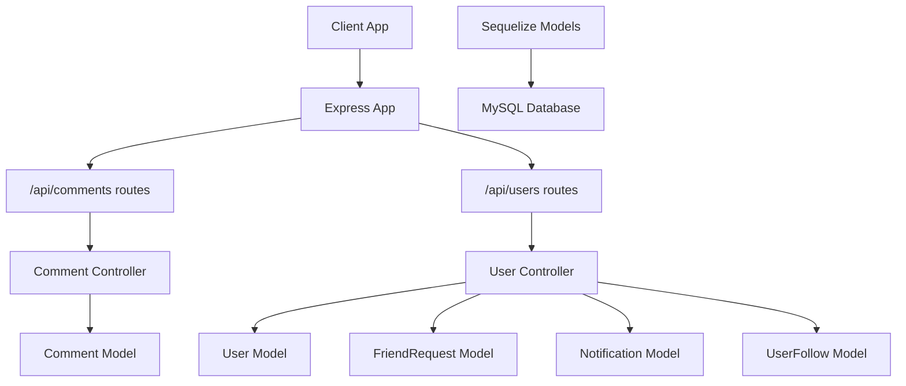
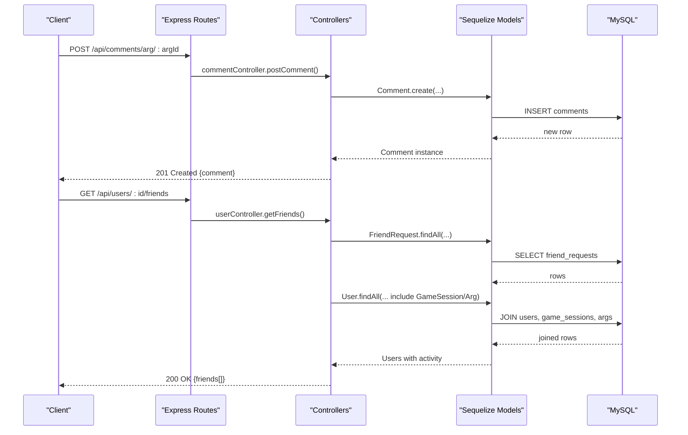
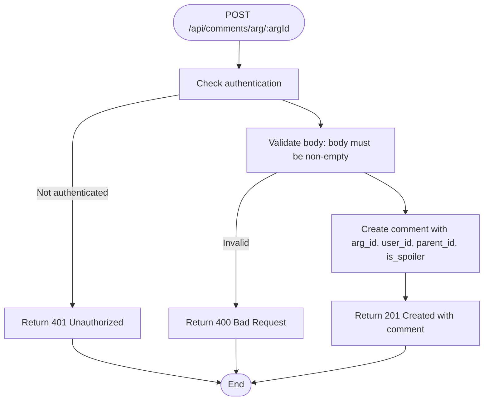
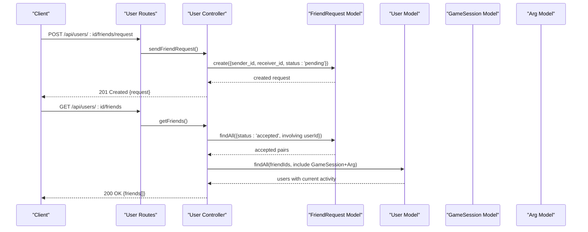
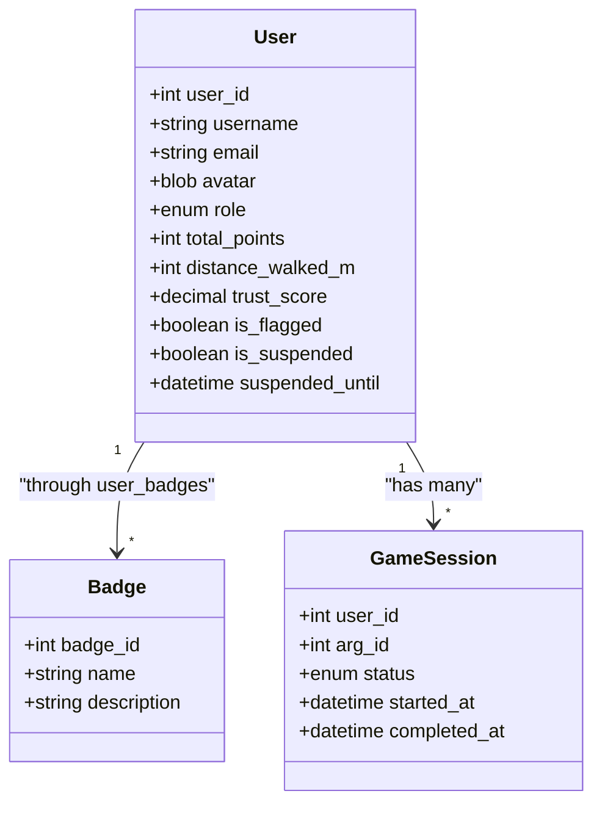
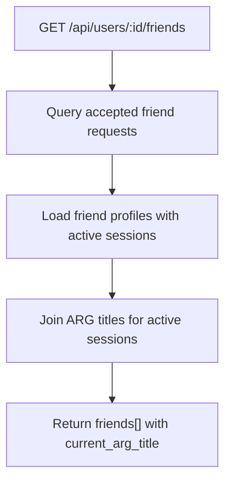
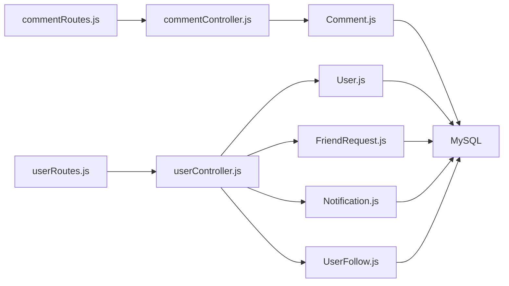

# Social Features APIs

<cite>
**Referenced Files in This Document**
- [app.js](file://server/src/app.js)
- [commentRoutes.js](file://server/src/routes/commentRoutes.js)
- [userRoutes.js](file://server/src/routes/userRoutes.js)
- [commentController.js](file://server/src/controllers/commentController.js)
- [userController.js](file://server/src/controllers/userController.js)
- [Comment.js](file://server/src/models/Comment.js)
- [User.js](file://server/src/models/User.js)
- [FriendRequest.js](file://server/src/models/FriendRequest.js)
- [Notification.js](file://server/src/models/Notification.js)
- [UserFollow.js](file://server/src/models/UserFollow.js)
- [schema.sql](file://database/schema.sql)
</cite>

## Table of Contents
1. Introduction
2. Project Structure
3. Core Components
4. Architecture Overview
5. Detailed Component Analysis
6. Dependency Analysis
7. Performance Considerations
8. Troubleshooting Guide
9. Conclusion

## Introduction
This document describes the social features APIs for the WARG Platform, focusing on:
- Comment system: posting, threading, moderation flags, and content filtering considerations
- User relationships: friend requests, following/unfollowing, and social graph operations
- User profile management: public/private data segregation and avatar handling
- Ratings and feedback systems for games (ARGs) and users
- Notifications and real-time updates via WebSockets
- Social feed generation

The backend is an Express application with REST endpoints, Sequelize models, and a MySQL schema that defines core social entities such as comments, friend requests, notifications, follows, and ratings.

## Project Structure
Social-related routes are mounted under /api/comments and /api/users. Controllers implement business logic, while models map to database tables defined in the schema.

**Diagram sources**
- [app.js:90-117](file://server/src/app.js#L90-L117)
- [commentRoutes.js:1-9](file://server/src/routes/commentRoutes.js#L1-L9)
- [userRoutes.js:1-15](file://server/src/routes/userRoutes.js#L1-L15)
- [commentController.js:1-50](file://server/src/controllers/commentController.js#L1-L50)
- [userController.js:1-226](file://server/src/controllers/userController.js#L1-L226)
- [Comment.js:1-21](file://server/src/models/Comment.js#L1-L21)
- [User.js:1-28](file://server/src/models/User.js#L1-L28)
- [FriendRequest.js:1-16](file://server/src/models/FriendRequest.js#L1-L16)
- [Notification.js:1-19](file://server/src/models/Notification.js#L1-L19)
- [UserFollow.js:1-13](file://server/src/models/UserFollow.js#L1-L13)

**Section sources**
- [app.js:90-117](file://server/src/app.js#L90-L117)
- [schema.sql:15-44](file://database/schema.sql#L15-L44)

## Core Components
- Comment System: Create and retrieve threaded comments per ARG; supports spoiler tagging and soft deletes.
- User Relationships: Friend request lifecycle (send, view pending, accept/decline), remove friends, list friends with current activity.
- User Profiles: Public profile retrieval excluding sensitive fields; includes badges and completed game counts.
- Ratings and Feedback: Like/dislike and star ratings for ARGs; denormalized aggregates maintained at the ARG level.
- Notifications: Persistent notification records for social events.
- Follows: Asymmetric follow relationships between users.

**Section sources**
- [commentController.js:1-50](file://server/src/controllers/commentController.js#L1-L50)
- [userController.js:1-226](file://server/src/controllers/userController.js#L1-L226)
- [schema.sql:397-456](file://database/schema.sql#L397-L456)
- [schema.sql:54-84](file://database/schema.sql#L54-L84)
- [schema.sql:91-107](file://database/schema.sql#L91-L107)
- [schema.sql:55-65](file://database/schema.sql#L55-L65)

## Architecture Overview
The social feature flow uses Express routes to controllers, which use Sequelize models to interact with MySQL. Authentication is enforced where required (e.g., posting comments).

**Diagram sources**
- [commentRoutes.js:5-6](file://server/src/routes/commentRoutes.js#L5-L6)
- [commentController.js:23-48](file://server/src/controllers/commentController.js#L23-L48)
- [userRoutes.js:8](file://server/src/routes/userRoutes.js#L8)
- [userController.js:39-73](file://server/src/controllers/userController.js#L39-L73)

## Detailed Component Analysis

### Comment System
Capabilities:
- Retrieve all comments for an ARG, including author username and ordering by creation time.
- Post a new comment with optional threading via parent_id and spoiler flag.
- Enforce authentication for posting.

Data model highlights:
- Comments support threading through parent_id and soft delete via deleted_at.
- Spoiler marking allows UI to hide or blur sensitive content.

API endpoints:
- GET /api/comments/arg/:argId
- POST /api/comments/arg/:argId

**Diagram sources**
- [commentController.js:23-48](file://server/src/controllers/commentController.js#L23-L48)

**Section sources**
- [commentRoutes.js:5-6](file://server/src/routes/commentRoutes.js#L5-L6)
- [commentController.js:1-50](file://server/src/controllers/commentController.js#L1-L50)
- [Comment.js:1-21](file://server/src/models/Comment.js#L1-L21)
- [schema.sql:434-456](file://database/schema.sql#L434-L456)

### User Relationship Management
Capabilities:
- Send friend requests, check duplicates, and manage lifecycle states.
- View pending friend requests with sender details.
- Accept or decline friend requests.
- Remove existing friends.
- List friends with their current active game session and ARG title.

API endpoints:
- GET /api/users/search/query?q=...
- GET /api/users/:id
- GET /api/users/:id/library
- GET /api/users/:id/friends
- DELETE /api/users/:id/friends/:friendId
- GET /api/users/:id/friends/requests
- POST /api/users/:id/friends/request
- PUT /api/users/friends/requests/:requestId

**Diagram sources**
- [userRoutes.js:5-12](file://server/src/routes/userRoutes.js#L5-L12)
- [userController.js:97-134](file://server/src/controllers/userController.js#L97-L134)
- [userController.js:39-73](file://server/src/controllers/userController.js#L39-L73)

**Section sources**
- [userRoutes.js:1-15](file://server/src/routes/userRoutes.js#L1-L15)
- [userController.js:1-226](file://server/src/controllers/userController.js#L1-L226)
- [FriendRequest.js:1-16](file://server/src/models/FriendRequest.js#L1-L16)
- [schema.sql:68-84](file://database/schema.sql#L68-L84)

### Following and Unfollowing
- The schema defines asymmetric follows (follower_id, followed_id).
- The UserFollow model exists but is not used by the current user controller endpoints.
- Follow/unfollow endpoints are not exposed yet; they can be added using the existing model and table.

Recommendation:
- Add endpoints to subscribe/unsubscribe from a user and to fetch followers/following lists.
- Integrate with notifications to alert followed users of new activity.

**Section sources**
- [schema.sql:54-65](file://database/schema.sql#L54-L65)
- [UserFollow.js:1-13](file://server/src/models/UserFollow.js#L1-L13)

### User Profile Management and Data Segregation
- Public profile endpoint excludes sensitive fields like google_uid and session_token.
- Includes badges and computed games_completed count.
- Avatar is stored as a BLOB and included in responses when requested.

API endpoints:
- GET /api/users/:id
- GET /api/users/:id/library

**Diagram sources**
- [User.js:1-28](file://server/src/models/User.js#L1-L28)
- [schema.sql:15-44](file://database/schema.sql#L15-L44)
- [schema.sql:287-304](file://database/schema.sql#L287-L304)

**Section sources**
- [userController.js:4-25](file://server/src/controllers/userController.js#L4-L25)
- [User.js:1-28](file://server/src/models/User.js#L1-L28)
- [schema.sql:15-44](file://database/schema.sql#L15-L44)

### Ratings and Feedback Systems
- ARG-level likes/dislikes and star ratings are supported.
- Denormalized aggregates (like_count, dislike_count, rating_sum, rating_count) exist on the ARG table.
- Views compute average rating and other stats.

API endpoints:
- Not explicitly present in the provided routes; likely implemented elsewhere or to be added.

Implementation notes:
- Ensure unique constraints prevent duplicate votes/ratings per user per ARG.
- Update denormalized aggregates atomically when votes/ratings change.

**Section sources**
- [schema.sql:397-431](file://database/schema.sql#L397-L431)
- [schema.sql:114-151](file://database/schema.sql#L114-L151)
- [schema.sql:644-651](file://database/schema.sql#L644-L651)

### Notifications and Real-Time Updates
- Notifications are persisted with type, title, body, payload_json, read status, and timestamps.
- No WebSocket server is configured in app.js; real-time delivery would require adding Socket.io or similar.

Recommendation:
- Add a WebSocket layer to broadcast notifications upon events (friend request accepted, new comment, etc.).
- Use the Notification model to persist notifications and mark them read via a dedicated endpoint.

**Section sources**
- [Notification.js:1-19](file://server/src/models/Notification.js#L1-L19)
- [schema.sql:91-107](file://database/schema.sql#L91-L107)
- [app.js:1-132](file://server/src/app.js#L1-L132)

### Social Feed Generation
- A view v_friend_activity provides a base for generating feeds of followed/friend activity, including current ARG if active.
- The getFriends endpoint returns friends with their active session and ARG title, enabling client-side feed construction.

**Diagram sources**
- [userController.js:39-73](file://server/src/controllers/userController.js#L39-L73)
- [schema.sql:671-683](file://database/schema.sql#L671-L683)

**Section sources**
- [userController.js:39-73](file://server/src/controllers/userController.js#L39-L73)
- [schema.sql:671-683](file://database/schema.sql#L671-L683)

## Dependency Analysis
- Routes depend on controllers for business logic.
- Controllers depend on Sequelize models.
- Models map to MySQL tables defined in schema.sql.
- Authentication middleware ensures protected endpoints require login.

**Diagram sources**
- [commentRoutes.js:1-9](file://server/src/routes/commentRoutes.js#L1-L9)
- [userRoutes.js:1-15](file://server/src/routes/userRoutes.js#L1-L15)
- [commentController.js:1-50](file://server/src/controllers/commentController.js#L1-L50)
- [userController.js:1-226](file://server/src/controllers/userController.js#L1-L226)
- [Comment.js:1-21](file://server/src/models/Comment.js#L1-L21)
- [User.js:1-28](file://server/src/models/User.js#L1-L28)
- [FriendRequest.js:1-16](file://server/src/models/FriendRequest.js#L1-L16)
- [Notification.js:1-19](file://server/src/models/Notification.js#L1-L19)
- [UserFollow.js:1-13](file://server/src/models/UserFollow.js#L1-L13)

**Section sources**
- [app.js:90-117](file://server/src/app.js#L90-L117)

## Performance Considerations
- Indexes:
  - Comments: indexed by arg_id, user_id, parent_id for efficient retrieval and threading.
  - Friend requests: indexed by receiver_id and unique pair constraint to avoid duplicates.
  - Notifications: indexed by user_id, is_read, created_at for unread paging.
  - Follows: indexed by followed_id for quick lookup of popular targets.
- Denormalization:
  - ARG aggregates (like_count, dislike_count, rating_sum, rating_count) reduce join overhead for leaderboards and feeds.
- Pagination:
  - Consider adding pagination to comments and friend lists for large datasets.
- Caching:
  - Cache frequent reads (e.g., friend lists, ARG metadata) at the application or CDN layer.
- Real-time:
  - For WebSocket-based notifications, consider connection sharding and message queues to scale.

[No sources needed since this section provides general guidance]

## Troubleshooting Guide
Common issues and resolutions:
- Posting comments without authentication:
  - Ensure the client sends session cookies and the server has CORS configured correctly.
  - Verify express-session and Passport initialization in app.js.
- Duplicate friend requests:
  - The controller checks for existing pending or accepted requests; ensure client does not retry aggressively.
- Missing friend connections:
  - Removing a friend requires an accepted relationship; verify status before deletion.
- Avatar handling:
  - Avatars are stored as BLOBs; ensure clients handle binary data appropriately and respect size limits.
- Notifications not delivered in real-time:
  - No WebSocket server is present; implement Socket.io or integrate a real-time provider.

**Section sources**
- [commentController.js:23-48](file://server/src/controllers/commentController.js#L23-L48)
- [userController.js:97-134](file://server/src/controllers/userController.js#L97-L134)
- [userController.js:177-199](file://server/src/controllers/userController.js#L177-L199)
- [app.js:29-88](file://server/src/app.js#L29-L88)

## Conclusion
The WARG Platform’s social features provide a solid foundation for community interactions:
- Comments enable threaded discussions with moderation-friendly flags.
- Friend request workflows cover the full lifecycle and expose friend activity.
- User profiles segregate sensitive data and include badges and progress metrics.
- Ratings and feedback are modeled and aggregated for ARGs.
- Notifications are persisted and ready for real-time integration.
- Follow relationships are modeled and can be extended with additional endpoints.

To enhance the platform:
- Add follow/unfollow endpoints and integrate with notifications.
- Implement WebSocket-based real-time updates for comments, friend events, and notifications.
- Expand content filtering and moderation tools for comments and user-generated content.

[No sources needed since this section summarizes without analyzing specific files]