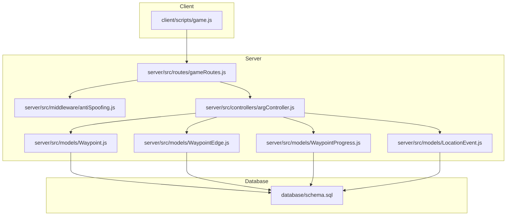
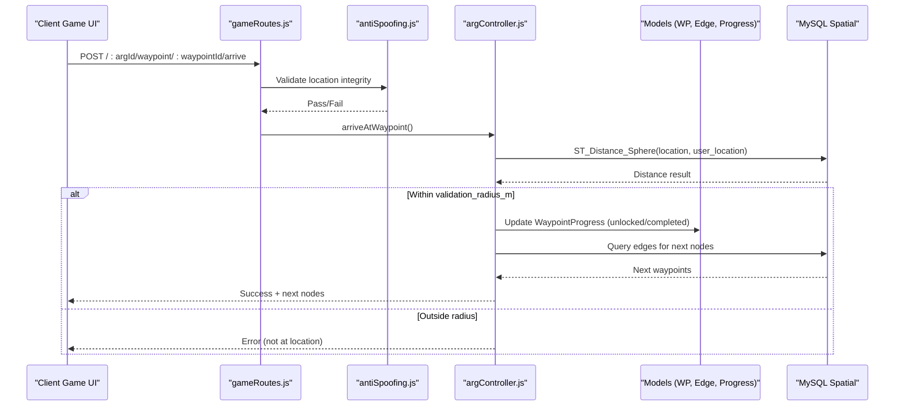
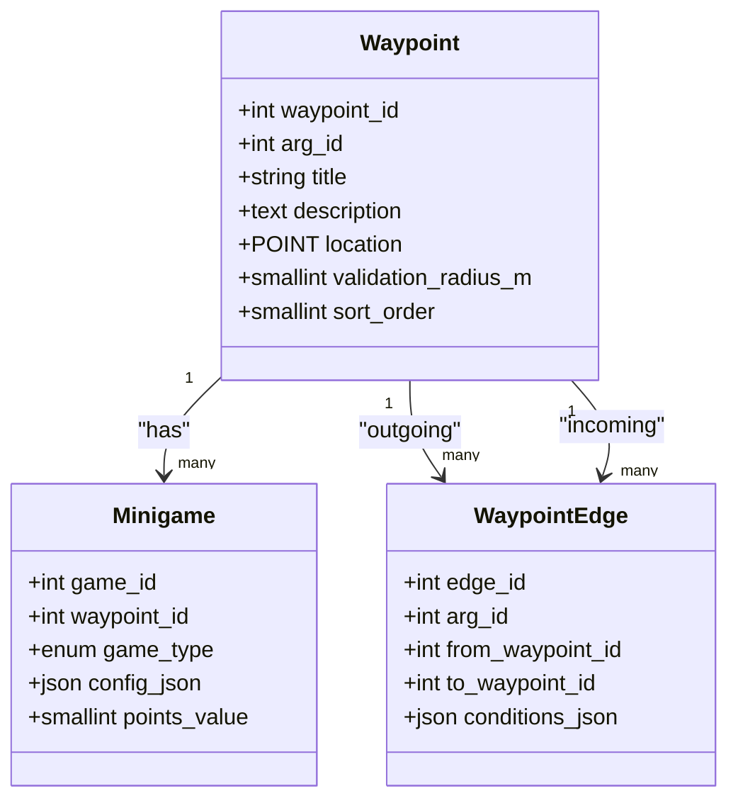
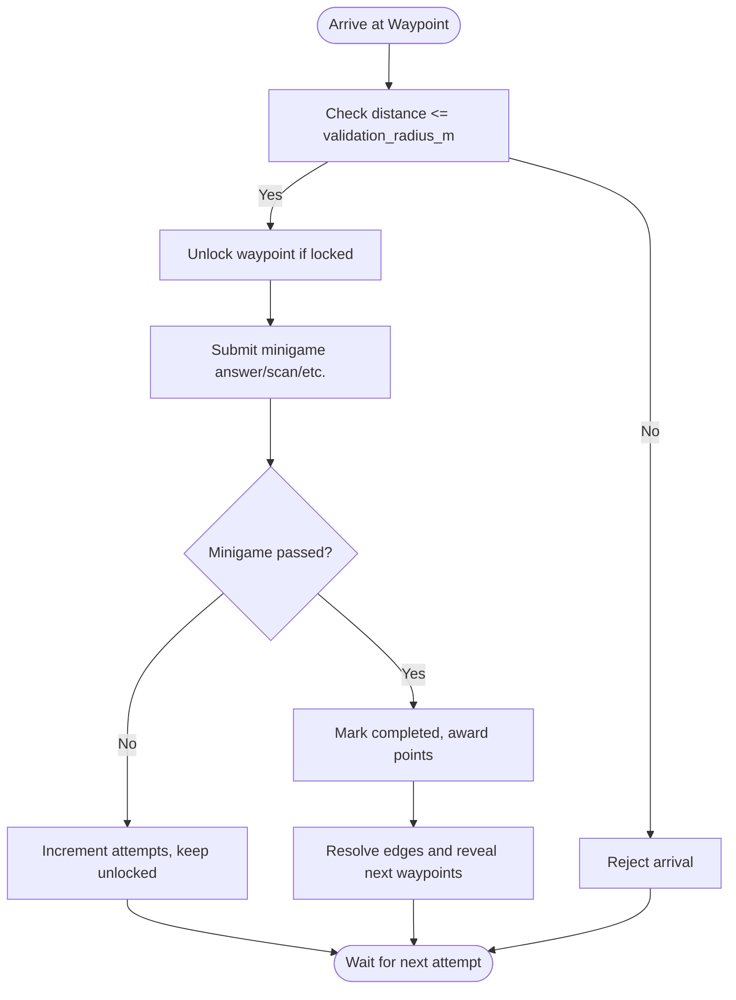
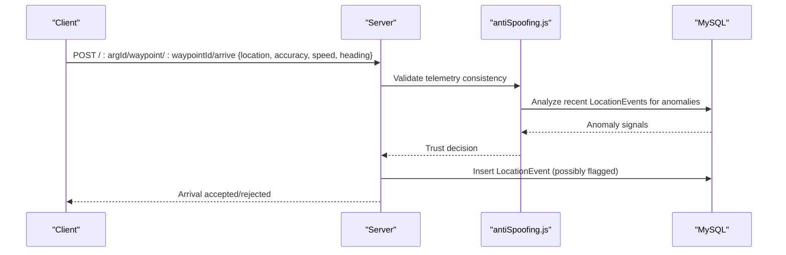
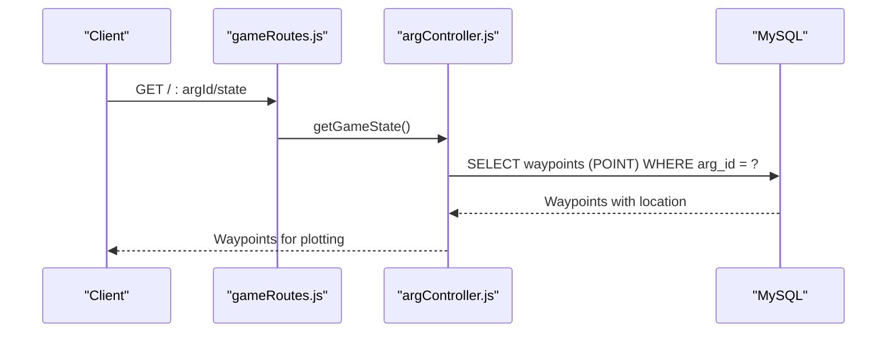
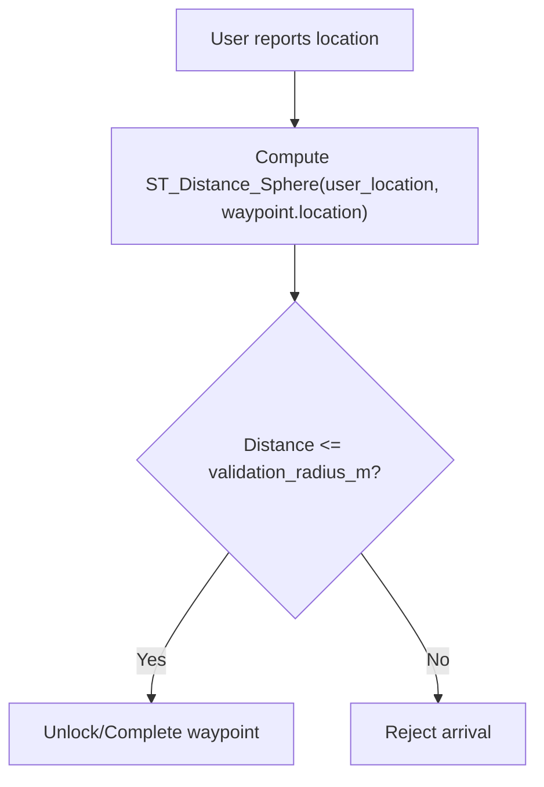
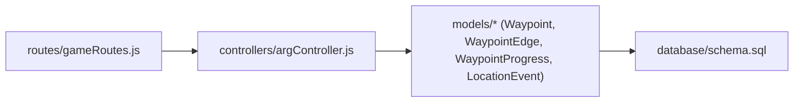

# Waypoint & Geospatial APIs

<cite>
**Referenced Files in This Document**
- [schema.sql](file://database/schema.sql)
- [Waypoint.js](file://server/src/models/Waypoint.js)
- [WaypointEdge.js](file://server/src/models/WaypointEdge.js)
- [WaypointProgress.js](file://server/src/models/WaypointProgress.js)
- [LocationEvent.js](file://server/src/models/LocationEvent.js)
- [argController.js](file://server/src/controllers/argController.js)
- [gameRoutes.js](file://server/src/routes/gameRoutes.js)
- [antiSpoofing.js](file://server/src/middleware/antiSpoofing.js)
- [game.js](file://client/scripts/game.js)
</cite>

## Table of Contents
1. [Introduction](#introduction)
2. [Project Structure](#project-structure)
3. [Core Components](#core-components)
4. [Architecture Overview](#architecture-overview)
5. [Detailed Component Analysis](#detailed-component-analysis)
6. [Dependency Analysis](#dependency-analysis)
7. [Performance Considerations](#performance-considerations)
8. [Troubleshooting Guide](#troubleshooting-guide)
9. [Conclusion](#conclusion)

## Introduction
This document explains the waypoint and geospatial subsystem used to build location-based ARG experiences. It covers:
- Waypoint creation, validation, and management with GPS coordinates and proximity checks
- The waypoint graph structure (nodes and directed edges)
- Geospatial queries using MySQL spatial extensions for distance calculations and location filtering
- Progress tracking, completion validation, and anti-spoofing mechanisms
- Coordinate system specifications (WGS 84), precision requirements, and performance optimization strategies
- Practical examples for plotting waypoints, performing proximity checks, and analyzing movement patterns

## Project Structure
The waypoint and geospatial features are implemented across database schema definitions, server models, controllers, routes, middleware, and client-side game logic.

**Diagram sources**
- [game.js:537-564](file://client/scripts/game.js#L537-L564)
- [gameRoutes.js:1-13](file://server/src/routes/gameRoutes.js#L1-L13)
- [argController.js:1-452](file://server/src/controllers/argController.js#L1-L452)
- [Waypoint.js:1-20](file://server/src/models/Waypoint.js#L1-L20)
- [WaypointEdge.js:1-16](file://server/src/models/WaypointEdge.js#L1-L16)
- [WaypointProgress.js:1-18](file://server/src/models/WaypointProgress.js#L1-L18)
- [LocationEvent.js:1-21](file://server/src/models/LocationEvent.js#L1-L21)
- [schema.sql:154-203](file://database/schema.sql#L154-L203)

**Section sources**
- [schema.sql:154-203](file://database/schema.sql#L154-L203)
- [Waypoint.js:1-20](file://server/src/models/Waypoint.js#L1-L20)
- [WaypointEdge.js:1-16](file://server/src/models/WaypointEdge.js#L1-L16)
- [WaypointProgress.js:1-18](file://server/src/models/WaypointProgress.js#L1-L18)
- [LocationEvent.js:1-21](file://server/src/models/LocationEvent.js#L1-L21)
- [argController.js:78-157](file://server/src/controllers/argController.js#L78-L157)
- [gameRoutes.js:1-13](file://server/src/routes/gameRoutes.js#L1-L13)
- [game.js:537-564](file://client/scripts/game.js#L537-L564)

## Core Components
- Waypoint model: Stores a geospatial point (WGS 84), title, description, validation radius, and sort order.
- WaypointEdge model: Represents directed connections between waypoints with optional branching conditions.
- WaypointProgress model: Tracks per-user progress per waypoint (locked/unlocked/completed/skipped).
- LocationEvent model: Records high-frequency GPS breadcrumbs with accuracy, speed, heading, timestamps, and suspicious flags.
- Database schema: Defines tables, spatial indexes, and constraints for all entities.

Key responsibilities:
- Waypoints define where players must go and how close they need to be.
- Edges define narrative flow and conditional unlocks based on minigame outcomes.
- Progress records capture state transitions and points earned.
- Location events feed proximity detection and anti-spoofing analysis.

**Section sources**
- [Waypoint.js:1-20](file://server/src/models/Waypoint.js#L1-L20)
- [WaypointEdge.js:1-16](file://server/src/models/WaypointEdge.js#L1-L16)
- [WaypointProgress.js:1-18](file://server/src/models/WaypointProgress.js#L1-L18)
- [LocationEvent.js:1-21](file://server/src/models/LocationEvent.js#L1-L21)
- [schema.sql:154-203](file://database/schema.sql#L154-L203)
- [schema.sql:307-324](file://database/schema.sql#L307-L324)
- [schema.sql:352-372](file://database/schema.sql#L352-L372)

## Architecture Overview
The player interacts with the client game UI, which calls game endpoints. The server validates authentication and location integrity, then updates progress and evaluates next steps.

**Diagram sources**
- [gameRoutes.js:1-13](file://server/src/routes/gameRoutes.js#L1-L13)
- [argController.js:28-54](file://server/src/controllers/argController.js#L28-L54)
- [schema.sql:160-179](file://database/schema.sql#L160-L179)
- [schema.sql:307-324](file://database/schema.sql#L307-L324)

## Detailed Component Analysis

### Waypoint Model and Data Contract
- Fields:
  - waypoint_id: Primary key
  - arg_id: Parent ARG identifier
  - title, description: Human-readable metadata
  - location: POINT with SRID 4326 (WGS 84)
  - validation_radius_m: Proximity threshold in meters
  - sort_order: Ordering hint for display or progression
- Spatial indexing: SPATIAL INDEX on location enables efficient distance and containment queries.

Coordinate system and precision:
- WGS 84 (SRID 4326) is enforced at the schema level.
- Latitude-longitude ordering is critical; utilities exist to fix reversed coordinates when needed.

Validation radius:
- Default radius is 30 meters; clients should request arrival only when within this range.

**Section sources**
- [Waypoint.js:1-20](file://server/src/models/Waypoint.js#L1-L20)
- [schema.sql:160-179](file://database/schema.sql#L160-L179)

### Waypoint Graph: Nodes and Directed Edges
- Nodes: Waypoints represent locations and associated minigames.
- Edges: Directed connections from predecessor to successor with optional JSON conditions tied to minigame outcomes.
- Creation/update flows:
  - Creating an ARG includes creating waypoints and edges in a transaction.
  - Updating an ARG replaces edges and reconciles waypoint/minigame changes.

**Diagram sources**
- [Waypoint.js:1-20](file://server/src/models/Waypoint.js#L1-L20)
- [WaypointEdge.js:1-16](file://server/src/models/WaypointEdge.js#L1-L16)
- [schema.sql:182-203](file://database/schema.sql#L182-L203)

**Section sources**
- [schema.sql:182-203](file://database/schema.sql#L182-L203)
- [argController.js:78-157](file://server/src/controllers/argController.js#L78-L157)
- [argController.js:159-326](file://server/src/controllers/argController.js#L159-L326)

### Waypoint Progress Tracking and Completion Validation
- Per-user, per-waypoint progress states: locked, unlocked, completed, skipped.
- Timestamps for unlock and completion, attempt counts, and points earned.
- Completion typically requires:
  - Being within validation_radius_m
  - Passing the associated minigame(s)
  - Transitioning progress state accordingly

**Diagram sources**
- [WaypointProgress.js:1-18](file://server/src/models/WaypointProgress.js#L1-L18)
- [schema.sql:307-324](file://database/schema.sql#L307-L324)

**Section sources**
- [WaypointProgress.js:1-18](file://server/src/models/WaypointProgress.js#L1-L18)
- [schema.sql:307-324](file://database/schema.sql#L307-L324)

### Geospatial Queries and Proximity Detection
- Proximity check uses MySQL spatial functions against the POINT column with SRID 4326.
- Typical query pattern:
  - Compute distance between user’s current location and waypoint.location
  - Compare against validation_radius_m
- Spatial index spx_wp_loc accelerates nearest-neighbor and distance queries.

Example operations:
- Plotting waypoints: Retrieve waypoints with their POINT geometry for mapping.
- Proximity checks: Use ST_Distance_Sphere or similar functions to compute distances in meters.
- Location-based filtering: Filter waypoints by being within a given radius of a user location.

**Section sources**
- [schema.sql:160-179](file://database/schema.sql#L160-L179)
- [schema.sql:352-372](file://database/schema.sql#L352-L372)

### Movement Pattern Analysis and Anti-Spoofing
- Location events record:
  - location (POINT, SRID 4326)
  - accuracy_m, speed_ms, heading
  - recorded_at (millisecond precision)
  - is_suspicious flag and flags_json context
- Anti-spoofing middleware protects arrival endpoints to ensure location data integrity.
- Behavioral trust scoring can penalize impossible speeds, jumps, or drift anomalies.

**Diagram sources**
- [gameRoutes.js:1-13](file://server/src/routes/gameRoutes.js#L1-L13)
- [LocationEvent.js:1-21](file://server/src/models/LocationEvent.js#L1-L21)
- [schema.sql:352-372](file://database/schema.sql#L352-L372)

**Section sources**
- [LocationEvent.js:1-21](file://server/src/models/LocationEvent.js#L1-L21)
- [schema.sql:352-372](file://database/schema.sql#L352-L372)
- [gameRoutes.js:1-13](file://server/src/routes/gameRoutes.js#L1-L13)

### Coordinate System Specifications and Precision Requirements
- Coordinate system: WGS 84 (EPSG:4326) enforced via SRID 4326 on POINT columns.
- Precision:
  - Latitude/longitude values should preserve sufficient decimal places for meter-level accuracy.
  - Recorded timestamps include millisecond precision to support speed and heading analysis.
- Coordinate ordering:
  - Ensure latitude-first, longitude-second ordering when constructing POINT values.
  - Utilities exist to correct reversed coordinates if necessary.

**Section sources**
- [schema.sql:160-179](file://database/schema.sql#L160-L179)
- [schema.sql:352-372](file://database/schema.sql#L352-L372)

### API Workflows and Examples

#### Waypoint Plotting
- Retrieve waypoints for an ARG including location geometry for rendering on a map.
- Use the GET endpoint that returns ARG details with waypoints and minigames.

**Diagram sources**
- [gameRoutes.js:1-13](file://server/src/routes/gameRoutes.js#L1-L13)
- [argController.js:28-54](file://server/src/controllers/argController.js#L28-L54)

**Section sources**
- [argController.js:28-54](file://server/src/controllers/argController.js#L28-L54)

#### Proximity Checks
- On arrival, the server computes the distance between the user’s reported location and the waypoint’s stored POINT.
- If within validation_radius_m, the waypoint becomes unlocked or completed depending on minigame results.

**Diagram sources**
- [schema.sql:160-179](file://database/schema.sql#L160-L179)

**Section sources**
- [schema.sql:160-179](file://database/schema.sql#L160-L179)

#### Movement Pattern Analysis
- Analyze LocationEvent sequences to detect:
  - Impossible speeds (speed_ms too high relative to time deltas)
  - Jumps (large distance between consecutive points)
  - Drift anomalies (heading inconsistencies)
- Flag suspicious events and adjust trust scores accordingly.

**Section sources**
- [LocationEvent.js:1-21](file://server/src/models/LocationEvent.js#L1-L21)
- [schema.sql:352-372](file://database/schema.sql#L352-L372)

## Dependency Analysis
- Controllers depend on models for persistence and spatial queries.
- Routes wire HTTP endpoints to controller methods and apply middleware for security.
- Schema defines relationships and spatial indexes that underpin performance.

**Diagram sources**
- [gameRoutes.js:1-13](file://server/src/routes/gameRoutes.js#L1-L13)
- [argController.js:1-452](file://server/src/controllers/argController.js#L1-L452)
- [schema.sql:154-203](file://database/schema.sql#L154-L203)

**Section sources**
- [gameRoutes.js:1-13](file://server/src/routes/gameRoutes.js#L1-L13)
- [argController.js:1-452](file://server/src/controllers/argController.js#L1-L452)
- [schema.sql:154-203](file://database/schema.sql#L154-L203)

## Performance Considerations
- Spatial indexing:
  - SPATIAL INDEX on location columns accelerates distance and containment queries.
- Query design:
  - Prefer server-side spatial functions (e.g., ST_Distance_Sphere) to avoid transferring large coordinate sets.
  - Filter by arg_id and use indexed fields to reduce scan scope.
- High-volume location events:
  - Partitioning by time ranges can improve write/read performance for location_events.
- Transactional integrity:
  - Create/update ARGs with waypoints and edges in transactions to maintain consistency.
- Client efficiency:
  - Batch waypoint retrieval and minimize repeated requests during gameplay.

[No sources needed since this section provides general guidance]

## Troubleshooting Guide
Common issues and resolutions:
- Reversed coordinates:
  - If latitude/longitude are swapped, use utility scripts to normalize POINT values.
- Proximity failures:
  - Verify device-reported accuracy and ensure the user is within validation_radius_m.
- Suspicious location events:
  - Inspect flags_json and is_suspicious to diagnose spoofing or sensor anomalies.
- Progress not updating:
  - Confirm minigame submission succeeded and that edges are correctly defined.

Operational references:
- Utility to dump waypoints for inspection.
- Utility to fix reversed coordinates.

**Section sources**
- [dump_wp_mysql.js:1-14](file://server/dump_wp_mysql.js#L1-L14)
- [fix_wp.js:1-13](file://server/fix_wp.js#L1-L13)
- [LocationEvent.js:1-21](file://server/src/models/LocationEvent.js#L1-L21)
- [schema.sql:352-372](file://database/schema.sql#L352-L372)

## Conclusion
The waypoint and geospatial subsystem integrates robust spatial data handling, graph-based narrative flow, and strong anti-spoofing safeguards. By leveraging MySQL spatial extensions, precise WGS 84 coordinates, and well-indexed schemas, the platform supports scalable location-based gameplay with reliable proximity detection and comprehensive progress tracking. Proper usage of the provided APIs and adherence to coordinate ordering and precision guidelines ensures accurate and performant operation even at scale.

[No sources needed since this section summarizes without analyzing specific files]