# Authentication & Authorization

<cite>
**Referenced Files in This Document**
- [passport.js](file://server/src/config/passport.js)
- [authController.js](file://server/src/controllers/authController.js)
- [authRoutes.js](file://server/src/routes/authRoutes.js)
- [authMiddleware.js](file://server/src/middleware/authMiddleware.js)
- [User.js](file://server/src/models/User.js)
- [database.js](file://server/src/config/database.js)
- [index.js](file://server/src/models/index.js)
- [schema.sql](file://database/schema.sql)
- [app.js](file://server/src/app.js)
- [package.json](file://server/package.json)
</cite>

## Table of Contents
1. [Introduction](#introduction)
2. [Project Structure](#project-structure)
3. [Core Components](#core-components)
4. [Architecture Overview](#architecture-overview)
5. [Detailed Component Analysis](#detailed-component-analysis)
6. [Dependency Analysis](#dependency-analysis)
7. [Performance Considerations](#performance-considerations)
8. [Troubleshooting Guide](#troubleshooting-guide)
9. [Conclusion](#conclusion)

## Introduction
This document explains the WARG Platform’s authentication and authorization system. It covers:
- Google OAuth integration via Passport.js
- Local email/password authentication
- Session management backed by MySQL using `express-mysql-session`
- Route protection with middleware
- Role-based access control (player, creator, admin)
- Security best practices, token refresh considerations, and production deployment guidance

The backend is an Express application that uses Passport for authentication strategies, Sequelize for database models, and a MySQL-backed session store for persistent sessions across processes and restarts.

## Project Structure
Authentication-related code is organized into configuration, controllers, routes, middleware, and models:
- Configuration: Passport strategies and database connection
- Controllers: User signup and user existence checks
- Routes: Google OAuth flow, local login/signup, logout, and current user profile
- Middleware: Authentication and role guards
- Models: User entity and associations
- Application bootstrap: Session setup, CORS, route mounting, and static file serving

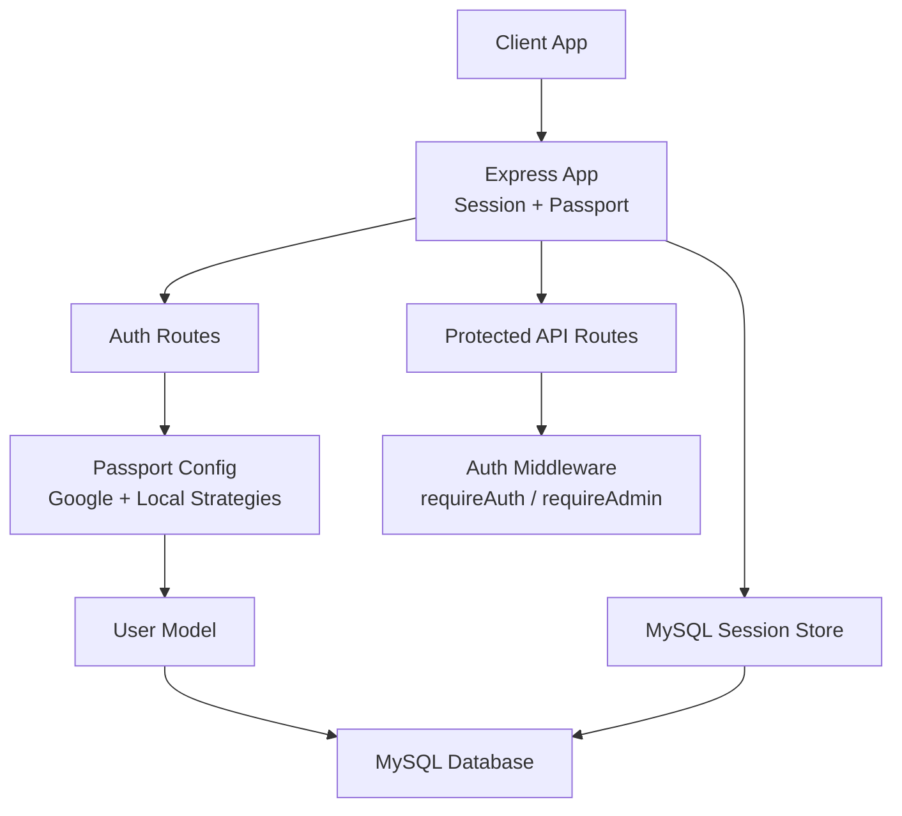

**Diagram sources**
- [app.js:1-132](file://server/src/app.js#L1-L132)
- [authRoutes.js:1-124](file://server/src/routes/authRoutes.js#L1-L124)
- [passport.js:1-99](file://server/src/config/passport.js#L1-L99)
- [authMiddleware.js:1-22](file://server/src/middleware/authMiddleware.js#L1-L22)
- [User.js:1-28](file://server/src/models/User.js#L1-L28)
- [database.js:1-38](file://server/src/config/database.js#L1-L38)

**Section sources**
- [app.js:1-132](file://server/src/app.js#L1-L132)
- [package.json:16-30](file://server/package.json#L16-L30)

## Core Components
- Passport configuration:
  - Google OAuth strategy (optional, enabled when client ID/secret are set)
  - Local strategy for email/password
  - Serialize/deserialize user to/from session
- Auth routes:
  - Google OAuth redirect and callback
  - Local signup and login
  - Logout and current user info
- Auth middleware:
  - Require authenticated user
  - Require admin role
- User model:
  - Role enum: player, creator, admin
  - Flags for suspension and trust scoring
- Session management:
  - MySQL-backed sessions in production
  - In-memory sessions in tests

**Section sources**
- [passport.js:1-99](file://server/src/config/passport.js#L1-L99)
- [authRoutes.js:1-124](file://server/src/routes/authRoutes.js#L1-L124)
- [authMiddleware.js:1-22](file://server/src/middleware/authMiddleware.js#L1-L22)
- [User.js:1-28](file://server/src/models/User.js#L1-L28)
- [app.js:48-88](file://server/src/app.js#L48-L88)

## Architecture Overview
The authentication architecture integrates three layers:
- HTTP layer: Express routes handle OAuth flows and local auth endpoints
- Strategy layer: Passport validates credentials and manages sessions
- Persistence layer: MySQL stores both user data and active sessions

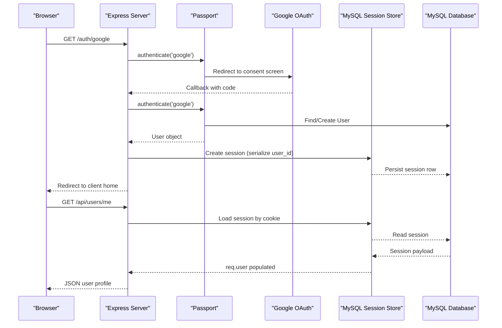

**Diagram sources**
- [authRoutes.js:6-55](file://server/src/routes/authRoutes.js#L6-L55)
- [passport.js:8-64](file://server/src/config/passport.js#L8-L64)
- [app.js:48-88](file://server/src/app.js#L48-L88)
- [database.js:1-38](file://server/src/config/database.js#L1-L38)

## Detailed Component Analysis

### Passport Configuration
- Serialization: Stores only the user ID in the session to minimize payload size.
- Deserialization: Loads the full user object from the database on each request, excluding sensitive fields like session tokens.
- Google Strategy:
  - Enabled conditionally based on environment variables.
  - Looks up existing users by Google UID; bans flagged users.
  - Creates new users from Google profile data if not found.
- Local Strategy:
  - Validates email/password against stored hash.
  - Rejects accounts without a password hash (Google-only accounts).
  - Blocks flagged users.

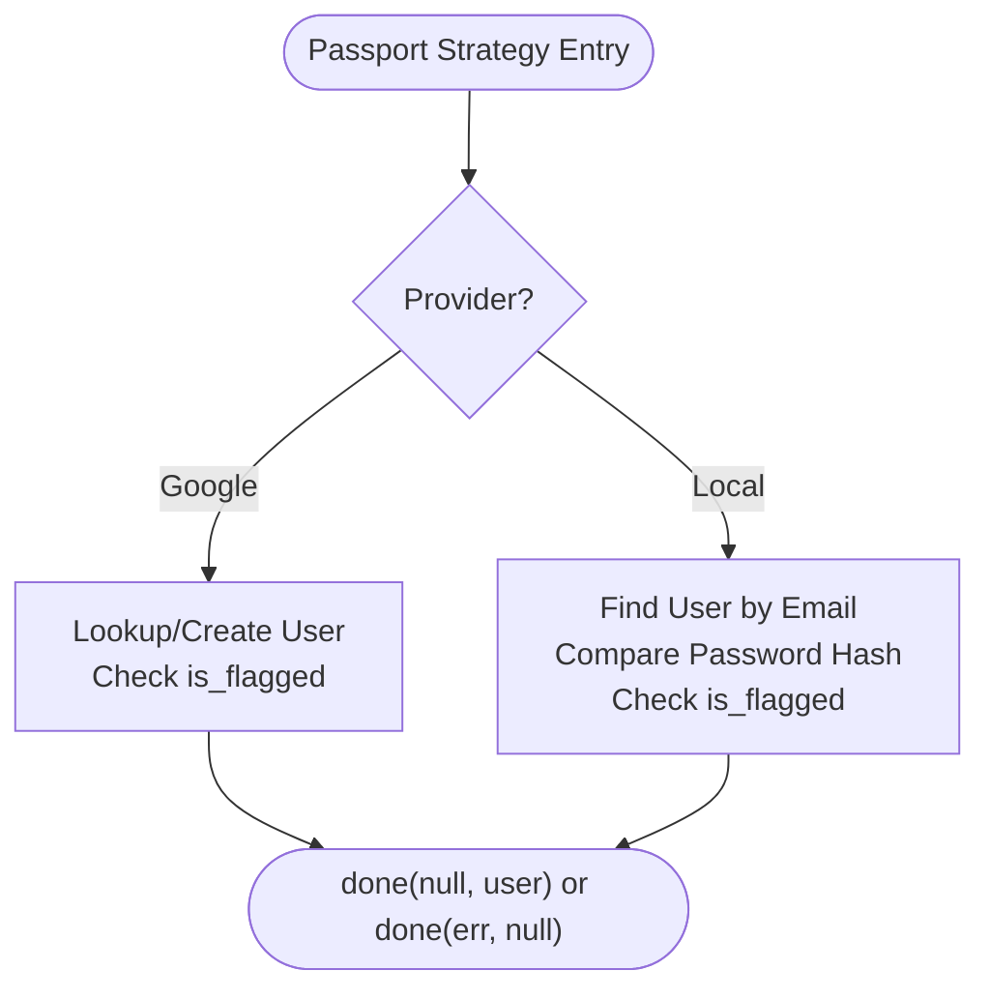

**Diagram sources**
- [passport.js:8-95](file://server/src/config/passport.js#L8-L95)

**Section sources**
- [passport.js:1-99](file://server/src/config/passport.js#L1-L99)

### Google OAuth Integration Flow
- The `/auth/google` route redirects to Google’s consent screen, storing the original origin in the session for post-auth redirection.
- After Google redirects back to `/auth/google/callback`, Passport authenticates the user, logs them in, and redirects to the client app.
- Error handling returns appropriate error codes and messages.

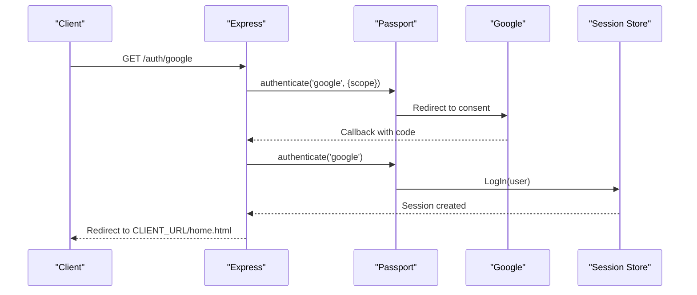

**Diagram sources**
- [authRoutes.js:6-55](file://server/src/routes/authRoutes.js#L6-L55)
- [passport.js:24-64](file://server/src/config/passport.js#L24-L64)

**Section sources**
- [authRoutes.js:6-55](file://server/src/routes/authRoutes.js#L6-L55)
- [passport.js:24-64](file://server/src/config/passport.js#L24-L64)

### Local Authentication Mechanisms
- Signup:
  - Validates required fields.
  - Checks uniqueness of email and username.
  - Hashes password and creates user with provider 'local'.
  - Logs the user in immediately after successful signup.
- Login:
  - Uses Passport’s local strategy.
  - On success, logs the user in and returns a minimal response.
  - On failure, returns a 401 with an error message.

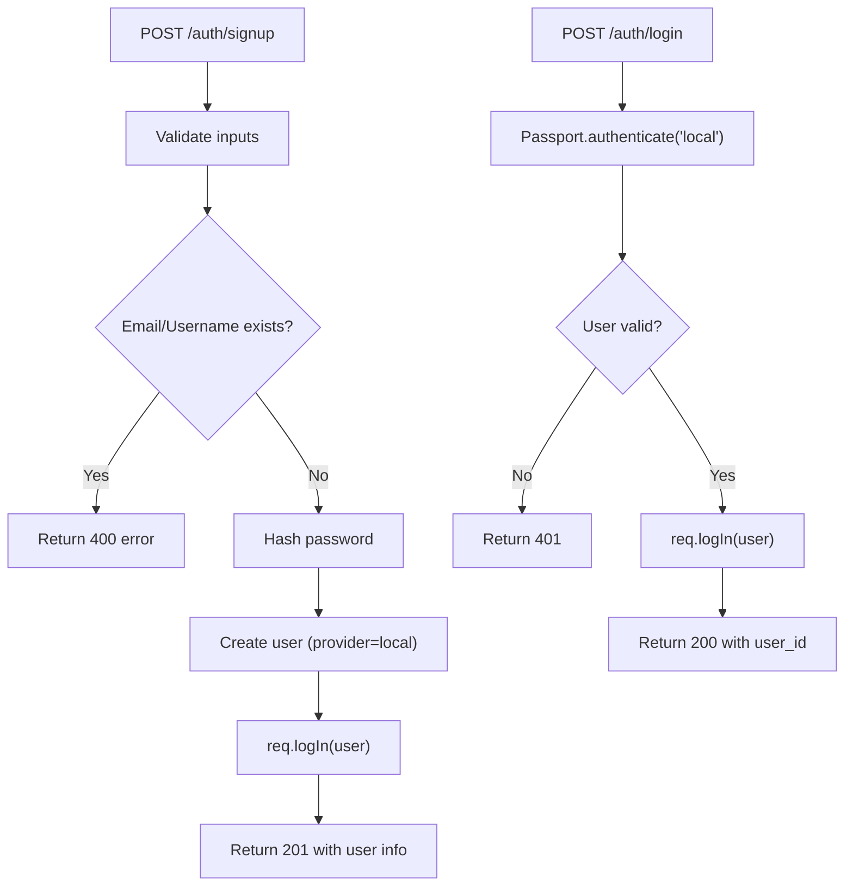

**Diagram sources**
- [authController.js:5-82](file://server/src/controllers/authController.js#L5-L82)
- [authRoutes.js:57-81](file://server/src/routes/authRoutes.js#L57-L81)

**Section sources**
- [authController.js:5-82](file://server/src/controllers/authController.js#L5-L82)
- [authRoutes.js:57-81](file://server/src/routes/authRoutes.js#L57-L81)

### Session Management Using MySQL-Backed Sessions
- Production:
  - Uses `express-mysql-session` with options derived from `DATABASE_URL`.
  - Persists sessions in MySQL with a 24-hour expiration.
  - Handles errors from the session store gracefully.
- Tests:
  - Falls back to in-memory session storage to avoid requiring a session table.
- Cookie settings:
  - Secure and SameSite configured per environment.
  - HttpOnly enabled to prevent client-side access.

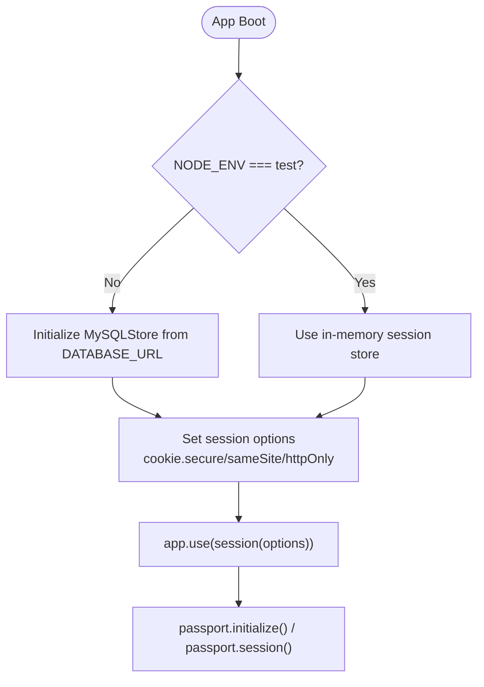

**Diagram sources**
- [app.js:48-88](file://server/src/app.js#L48-L88)
- [database.js:1-38](file://server/src/config/database.js#L1-L38)

**Section sources**
- [app.js:48-88](file://server/src/app.js#L48-L88)
- [database.js:1-38](file://server/src/config/database.js#L1-L38)

### Passport.js Configuration, Strategy Setup, and Middleware Implementation
- Configuration:
  - Passport initialized and session-enabled in the Express app.
  - Strategies registered in the Passport config module.
- Strategy setup:
  - Google strategy conditionally registered based on environment variables.
  - Local strategy always available for email/password.
- Middleware implementation:
  - `requireAuth`: Ensures the user is authenticated and not flagged.
  - `requireAdmin`: Ensures the user has the admin role.

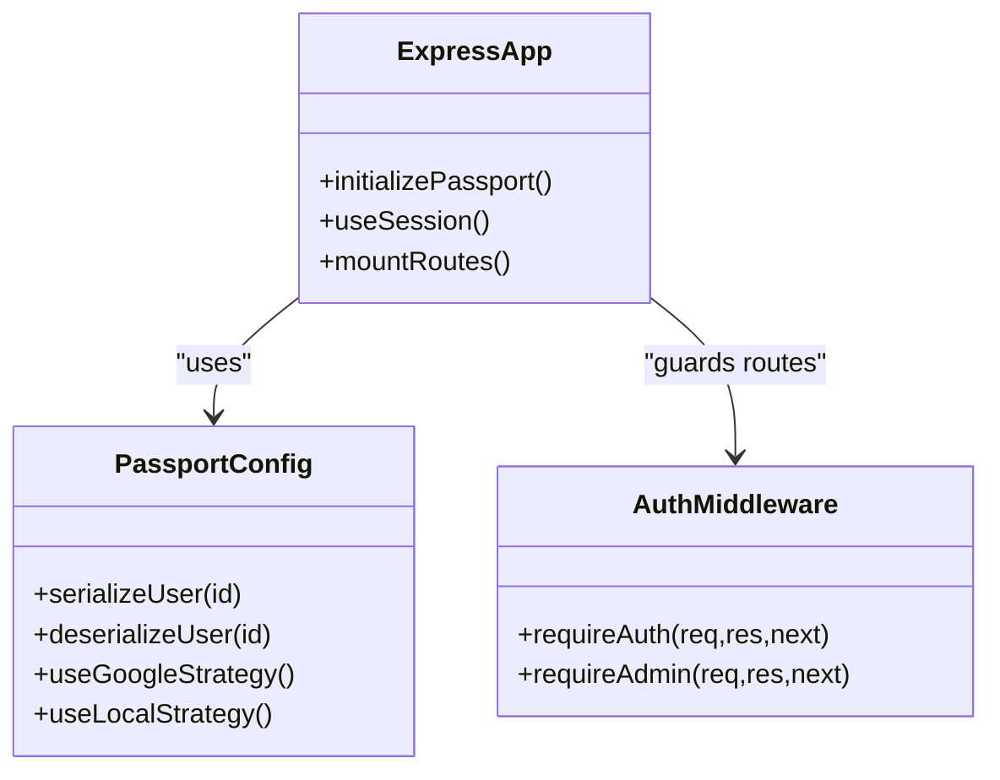

**Diagram sources**
- [passport.js:1-99](file://server/src/config/passport.js#L1-L99)
- [authMiddleware.js:1-22](file://server/src/middleware/authMiddleware.js#L1-L22)
- [app.js:86-117](file://server/src/app.js#L86-L117)

**Section sources**
- [passport.js:1-99](file://server/src/config/passport.js#L1-L99)
- [authMiddleware.js:1-22](file://server/src/middleware/authMiddleware.js#L1-L22)
- [app.js:86-117](file://server/src/app.js#L86-L117)

### User Role-Based Access Control and Permission Levels
- Roles:
  - player: default role for regular users
  - creator: can create content (e.g., ARGs)
  - admin: administrative privileges
- Enforcement:
  - `requireAuth` blocks unauthenticated and flagged users.
  - `requireAdmin` restricts admin-only routes to users with role 'admin'.

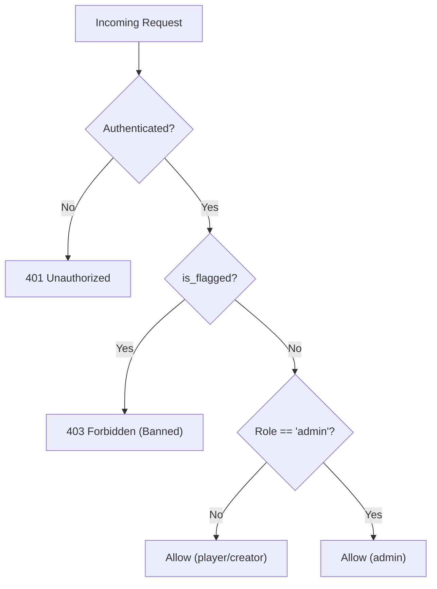

**Diagram sources**
- [authMiddleware.js:1-22](file://server/src/middleware/authMiddleware.js#L1-L22)
- [User.js:12-12](file://server/src/models/User.js#L12-L12)

**Section sources**
- [authMiddleware.js:1-22](file://server/src/middleware/authMiddleware.js#L1-L22)
- [User.js:1-28](file://server/src/models/User.js#L1-L28)

### Protecting API Endpoints
- Global route protection:
  - Game routes are mounted under `/api/game` with `requireAuth`.
  - Admin routes are mounted under `/api/admin` with `requireAuth` and `requireAdmin`.
- Endpoint-level protection:
  - Individual routes can use the same middleware functions for fine-grained control.

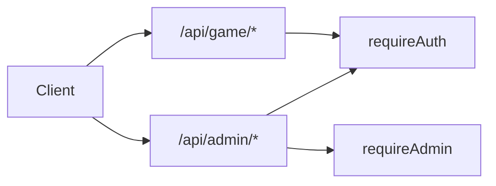

**Diagram sources**
- [app.js:110-117](file://server/src/app.js#L110-L117)
- [authMiddleware.js:1-22](file://server/src/middleware/authMiddleware.js#L1-L22)

**Section sources**
- [app.js:110-117](file://server/src/app.js#L110-L117)
- [authMiddleware.js:1-22](file://server/src/middleware/authMiddleware.js#L1-L22)

### Handling User Sessions
- Current user endpoint:
  - Returns user profile information including role and computed stats.
  - Requires authentication; otherwise returns 401.
- Logout:
  - Destroys the session and clears the session cookie.

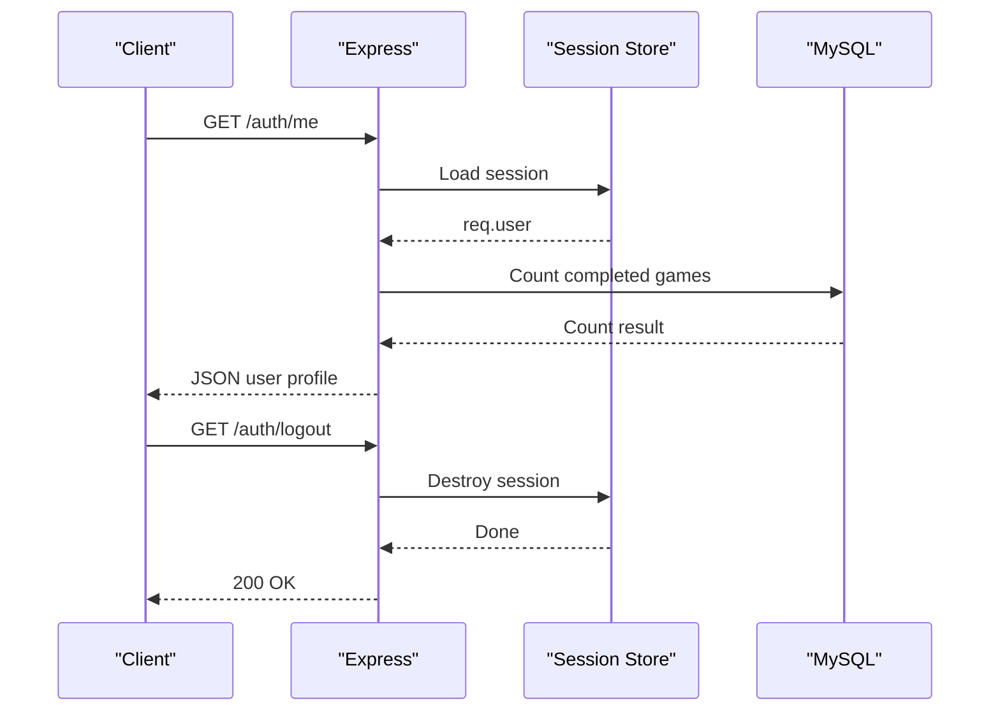

**Diagram sources**
- [authRoutes.js:83-121](file://server/src/routes/authRoutes.js#L83-L121)
- [app.js:48-88](file://server/src/app.js#L48-L88)

**Section sources**
- [authRoutes.js:83-121](file://server/src/routes/authRoutes.js#L83-L121)
- [app.js:48-88](file://server/src/app.js#L48-L88)

### Implementing Custom Authentication Strategies
- To add a custom strategy:
  - Register it in the Passport configuration module alongside Google and Local strategies.
  - Ensure serialize/deserialize logic handles your custom user attributes.
  - Add corresponding routes to initiate and handle the callback.
  - Update middleware guards if you need role-specific enforcement.

[No sources needed since this section provides general guidance]

## Dependency Analysis
Key dependencies involved in authentication and authorization:
- `passport`: Core authentication framework
- `passport-google-oauth20`: Google OAuth strategy
- `passport-local`: Local email/password strategy
- `express-session`: Session management
- `express-mysql-session`: MySQL-backed session store
- `bcryptjs`: Password hashing
- `sequelize`: ORM for database interactions

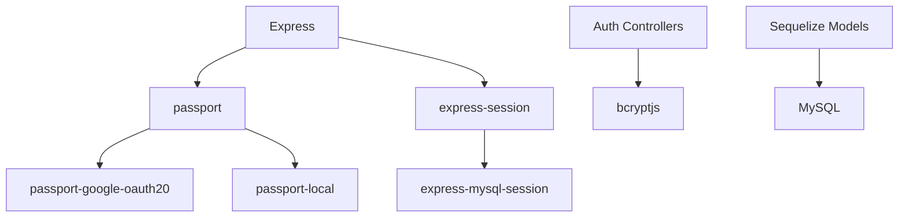

**Diagram sources**
- [package.json:16-30](file://server/package.json#L16-L30)
- [passport.js:1-5](file://server/src/config/passport.js#L1-L5)
- [app.js:1-10](file://server/src/app.js#L1-L10)

**Section sources**
- [package.json:16-30](file://server/package.json#L16-L30)
- [passport.js:1-5](file://server/src/config/passport.js#L1-L5)
- [app.js:1-10](file://server/src/app.js#L1-L10)

## Performance Considerations
- Session store:
  - MySQL-backed sessions persist across process restarts but introduce additional database load.
  - Ensure proper indexing on session tables and tune connection pool settings.
- Database queries:
  - Deserialize user loads full user objects; consider selecting only necessary fields where possible.
- Rate limiting:
  - Consider adding rate limiting to login and signup endpoints to mitigate brute-force attacks.
- Connection pooling:
  - Sequelize pool settings are configured; monitor usage and adjust max connections based on workload.

[No sources needed since this section provides general guidance]

## Troubleshooting Guide
Common issues and resolutions:
- Google OAuth disabled:
  - If `GOOGLE_CLIENT_ID` or `GOOGLE_CLIENT_SECRET` are missing, Google login is disabled.
  - Verify environment variables and ensure callback URL matches Google console configuration.
- Local login fails for Google-only accounts:
  - Accounts created via Google may not have a password hash; instruct users to sign in with Google.
- Session persistence failures:
  - Check MySQL connectivity and session store error logs.
  - Ensure `DATABASE_URL` is correctly formatted and accessible.
- CORS errors:
  - Confirm `CLIENT_URL` includes the correct origins and that cookies are allowed.
- Role-based access denied:
  - Verify user role and flags (`is_flagged`) in the database.

**Section sources**
- [passport.js:24-64](file://server/src/config/passport.js#L24-L64)
- [passport.js:66-95](file://server/src/config/passport.js#L66-L95)
- [app.js:29-44](file://server/src/app.js#L29-L44)
- [app.js:77-79](file://server/src/app.js#L77-L79)

## Conclusion
The WARG Platform implements a robust authentication and authorization system combining Google OAuth, local email/password login, and MySQL-backed sessions. Passport.js strategies provide flexible authentication mechanisms, while middleware enforces role-based access control. For production, ensure secure session configuration, proper environment variables, and monitoring of session store health. Extend the system with custom strategies and endpoint-level guards as needed, and follow security best practices to protect user data and maintain platform integrity.

[No sources needed since this section summarizes without analyzing specific files]