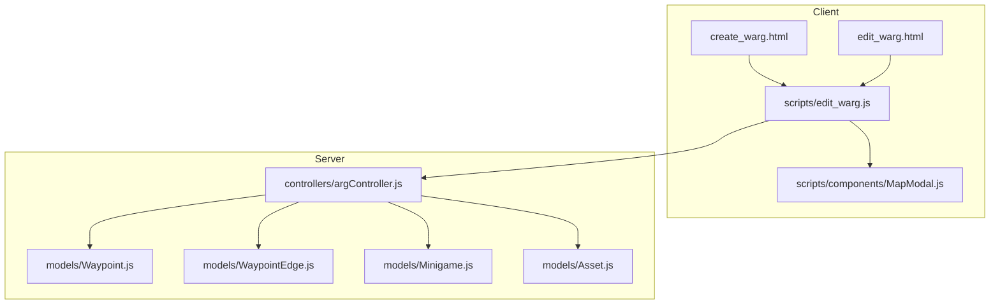
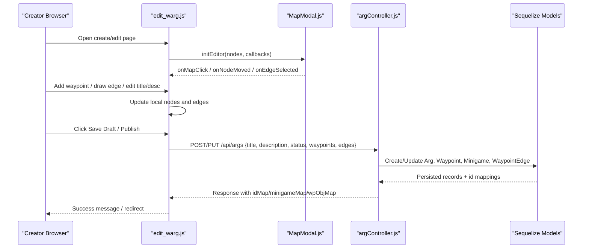
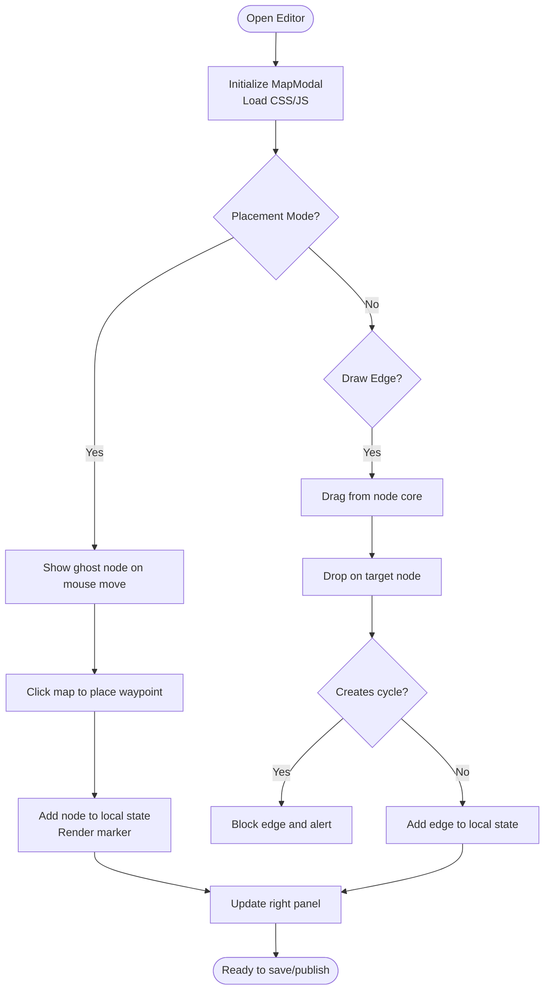
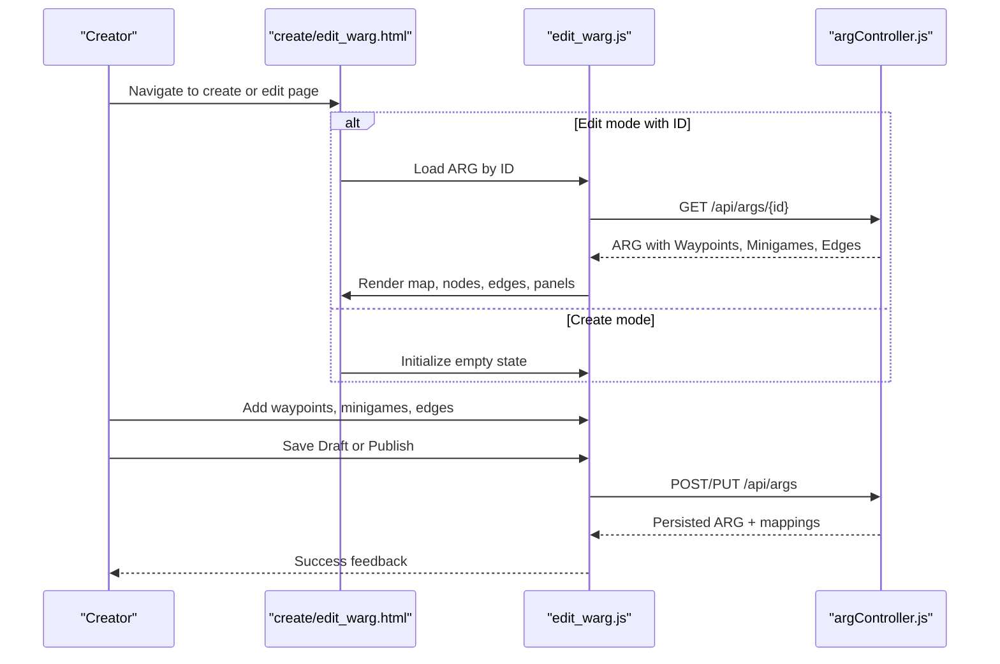
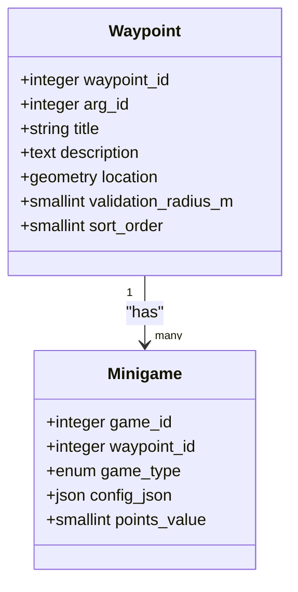
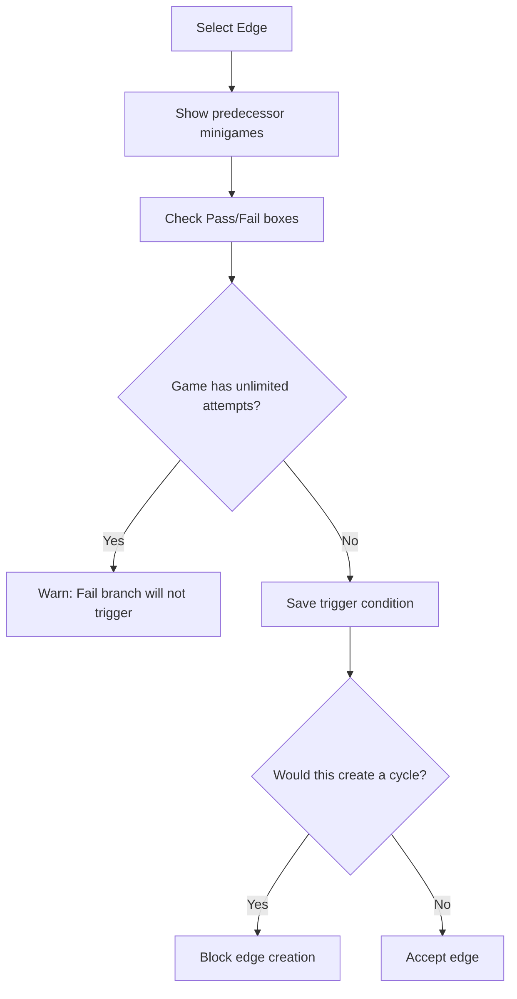
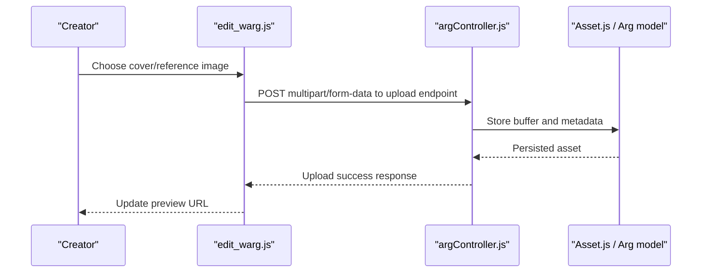
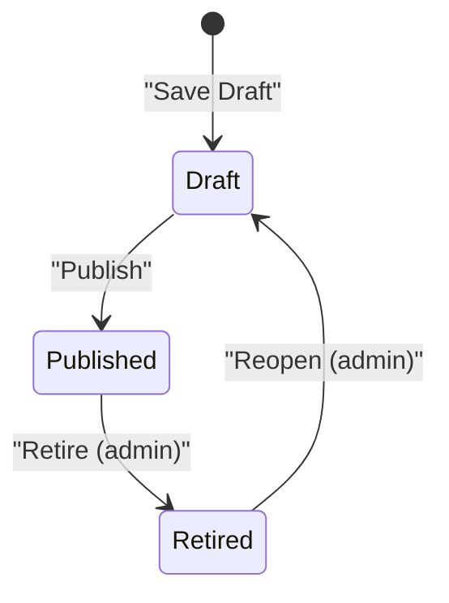
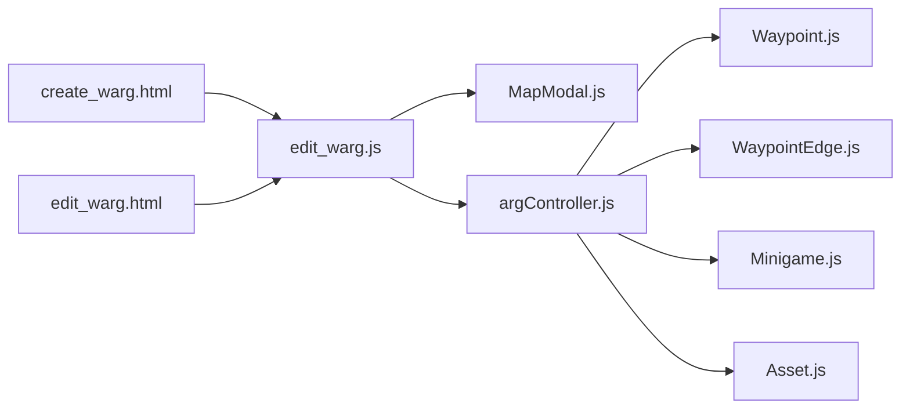

# Content Creation & Authoring Tools

<cite>
**Referenced Files in This Document**
- [README.md](file://README.md)
- [create_warg.html](file://client/create_warg.html)
- [edit_warg.html](file://client/edit_warg.html)
- [edit_warg.js](file://client/scripts/edit_warg.js)
- [MapModal.js](file://client/scripts/components/MapModal.js)
- [argController.js](file://server/src/controllers/argController.js)
- [Waypoint.js](file://server/src/models/Waypoint.js)
- [WaypointEdge.js](file://server/src/models/WaypointEdge.js)
- [Minigame.js](file://server/src/models/Minigame.js)
- [Asset.js](file://server/src/models/Asset.js)
- [git-policy.md](file://warg-docs/docs/5-policies/git-policy.md)
- [methodology.md](file://warg-docs/docs/1-overview/methodology.md)
</cite>

## Table of Contents
1. [Introduction](#introduction)
2. [Project Structure](#project-structure)
3. [Core Components](#core-components)
4. [Architecture Overview](#architecture-overview)
5. [Detailed Component Analysis](#detailed-component-analysis)
6. [Dependency Analysis](#dependency-analysis)
7. [Performance Considerations](#performance-considerations)
8. [Troubleshooting Guide](#troubleshooting-guide)
9. [Conclusion](#conclusion)
10. [Appendices](#appendices)

## Introduction
This document explains the WARG Platform’s content creation and authoring tools from a creator perspective. It focuses on:
- The interactive map editor for plotting waypoints and drawing transitions between them.
- The ARG creation workflow, including drafting, saving, and publishing.
- The minigame configuration interface at each waypoint.
- Asset management for cover images and reference photos.
- Real-time preview behavior inside the editor.
- Publishing pipeline and version control conventions used by authors and collaborators.
- Usability guidance for non-technical creators, validation rules, and common troubleshooting steps.

The platform is designed to let campus creators build location-based ARGs without writing code, while still supporting advanced gameplay through configurable minigames and branching waypoint logic.

**Section sources**
- [README.md:16-58](file://README.md#L16-L58)

## Project Structure
The authoring experience is primarily implemented in the client-side HTML pages and JavaScript modules, with server-side persistence and validation handled by Express controllers and Sequelize models.

**Diagram sources**
- [create_warg.html:114-176](file://client/create_warg.html#L114-L176)
- [edit_warg.html:114-182](file://client/edit_warg.html#L114-L182)
- [edit_warg.js:10-271](file://client/scripts/edit_warg.js#L10-L271)
- [MapModal.js:74-133](file://client/scripts/components/MapModal.js#L74-L133)
- [argController.js:78-157](file://server/src/controllers/argController.js#L78-L157)
- [Waypoint.js:4-17](file://server/src/models/Waypoint.js#L4-L17)
- [WaypointEdge.js:4-13](file://server/src/models/WaypointEdge.js#L4-L13)
- [Minigame.js:4-15](file://server/src/models/Minigame.js#L4-L15)
- [Asset.js:4-18](file://server/src/models/Asset.js#L4-L18)

**Section sources**
- [create_warg.html:114-176](file://client/create_warg.html#L114-L176)
- [edit_warg.html:114-182](file://client/edit_warg.html#L114-L182)
- [edit_warg.js:10-271](file://client/scripts/edit_warg.js#L10-L271)
- [MapModal.js:74-133](file://client/scripts/components/MapModal.js#L74-L133)
- [argController.js:78-157](file://server/src/controllers/argController.js#L78-L157)

## Core Components
- Interactive map editor: A Leaflet-based map that supports adding waypoints, dragging markers, drawing edges, and real-time visual feedback.
- ARG metadata editor: Title, description, and hero banner image editing.
- Minigame configuration panel: Add, edit, and remove minigames per waypoint; configure QnA and barcode games; set reference images for computer vision minigames.
- Transition editor: Configure pass/fail triggers from predecessor minigames to control flow between waypoints.
- Save and publish actions: Draft saving and final publication with status handling.
- Server persistence: Transactional creation and update of ARGs, waypoints, minigames, and edges.

Key behaviors:
- New ARGs are created as drafts or published directly.
- Waypoints store geospatial data and optional minigames.
- Edges define directed transitions with conditions based on minigame outcomes.
- Cover images and reference images are uploaded via dedicated endpoints.

**Section sources**
- [create_warg.html:114-176](file://client/create_warg.html#L114-L176)
- [edit_warg.html:114-182](file://client/edit_warg.html#L114-L182)
- [edit_warg.js:627-735](file://client/scripts/edit_warg.js#L627-L735)
- [argController.js:78-157](file://server/src/controllers/argController.js#L78-L157)
- [argController.js:159-326](file://server/src/controllers/argController.js#L159-L326)

## Architecture Overview
The authoring architecture connects the browser-based editor to the backend API. The editor maintains an in-memory graph of nodes (waypoints) and edges (transitions), then serializes it into a payload for the server. The server persists the graph using transactions to ensure consistency.

**Diagram sources**
- [edit_warg.js:10-271](file://client/scripts/edit_warg.js#L10-L271)
- [edit_warg.js:627-735](file://client/scripts/edit_warg.js#L627-L735)
- [argController.js:78-157](file://server/src/controllers/argController.js#L78-L157)
- [argController.js:159-326](file://server/src/controllers/argController.js#L159-L326)

## Detailed Component Analysis

### Interactive Map Editor
The map editor provides:
- Placement mode: Click anywhere on the map to drop a new waypoint.
- Dragging: Move existing waypoints by dragging their handles.
- Edge drawing: Drag from one node’s core to another to create a transition.
- Cycle prevention: Prevents creating cycles so the graph remains a directed acyclic graph.
- Start node visualization: Marks nodes with no incoming edges as start nodes.

Implementation highlights:
- MapModal initializes Leaflet, injects editor UI, and wires event handlers for placement, movement, and edge drawing.
- Editor script manages state for nodes and edges, updates the map, and controls selection panels.

**Diagram sources**
- [MapModal.js:74-133](file://client/scripts/components/MapModal.js#L74-L133)
- [MapModal.js:455-526](file://client/scripts/components/MapModal.js#L455-L526)
- [MapModal.js:596-646](file://client/scripts/components/MapModal.js#L596-L646)
- [edit_warg.js:200-271](file://client/scripts/edit_warg.js#L200-L271)
- [edit_warg.js:273-289](file://client/scripts/edit_warg.js#L273-L289)

**Section sources**
- [MapModal.js:74-133](file://client/scripts/components/MapModal.js#L74-L133)
- [MapModal.js:455-526](file://client/scripts/components/MapModal.js#L455-L526)
- [MapModal.js:596-646](file://client/scripts/components/MapModal.js#L596-L646)
- [edit_warg.js:200-271](file://client/scripts/edit_warg.js#L200-L271)
- [edit_warg.js:273-289](file://client/scripts/edit_warg.js#L273-L289)

### ARG Creation Workflow
The workflow supports both creating a new ARG and editing an existing one:
- In create mode, the page starts empty and allows adding waypoints and minigames.
- In edit mode, the page loads ARG data, maps backend IDs to frontend IDs, and renders existing waypoints, minigames, and edges.
- Title and description are editable inline.
- Hero banner can be uploaded after the ARG exists.

**Diagram sources**
- [edit_warg.js:10-158](file://client/scripts/edit_warg.js#L10-L158)
- [edit_warg.js:627-735](file://client/scripts/edit_warg.js#L627-L735)
- [argController.js:78-157](file://server/src/controllers/argController.js#L78-L157)
- [argController.js:159-326](file://server/src/controllers/argController.js#L159-L326)

**Section sources**
- [edit_warg.js:10-158](file://client/scripts/edit_warg.js#L10-L158)
- [edit_warg.js:627-735](file://client/scripts/edit_warg.js#L627-L735)
- [argController.js:78-157](file://server/src/controllers/argController.js#L78-L157)
- [argController.js:159-326](file://server/src/controllers/argController.js#L159-L326)

### Minigame Configuration Interface
At each waypoint, creators can:
- Add multiple minigames.
- Configure QnA questions and options.
- Configure barcode values or scan barcodes.
- Set reference images for computer vision minigames.
- Toggle unlimited attempts for certain game types.

Backend mapping:
- Frontend game types are mapped to backend enum values.
- Configurations are stored as JSON alongside minigame records.

**Diagram sources**
- [Minigame.js:4-15](file://server/src/models/Minigame.js#L4-L15)
- [Waypoint.js:4-17](file://server/src/models/Waypoint.js#L4-L17)

**Section sources**
- [edit_warg.js:27-42](file://client/scripts/edit_warg.js#L27-L42)
- [edit_warg.js:334-516](file://client/scripts/edit_warg.js#L334-L516)
- [argController.js:56-71](file://server/src/controllers/argController.js#L56-L71)
- [Minigame.js:4-15](file://server/src/models/Minigame.js#L4-L15)

### Transition and Branching Logic
Creators can define how minigame outcomes affect progression:
- For each edge, select which predecessor minigames trigger pass or fail branches.
- Unlimited attempts games warn that fail branches will never trigger.
- Cycles are prevented to maintain a DAG structure.

**Diagram sources**
- [edit_warg.js:517-583](file://client/scripts/edit_warg.js#L517-L583)
- [edit_warg.js:273-289](file://client/scripts/edit_warg.js#L273-L289)

**Section sources**
- [edit_warg.js:517-583](file://client/scripts/edit_warg.js#L517-L583)
- [edit_warg.js:273-289](file://client/scripts/edit_warg.js#L273-L289)

### Asset Management System
- Cover image upload: Creators can upload a cover image for the ARG after the record exists.
- Reference image upload: For computer vision minigames, creators can upload a reference photo linked to a specific minigame.
- Backend storage: Assets are persisted via models and served through endpoints.

**Diagram sources**
- [edit_warg.js:737-789](file://client/scripts/edit_warg.js#L737-L789)
- [edit_warg.js:402-434](file://client/scripts/edit_warg.js#L402-L434)
- [argController.js:413-451](file://server/src/controllers/argController.js#L413-L451)
- [Asset.js:4-18](file://server/src/models/Asset.js#L4-L18)

**Section sources**
- [edit_warg.js:737-789](file://client/scripts/edit_warg.js#L737-L789)
- [edit_warg.js:402-434](file://client/scripts/edit_warg.js#L402-L434)
- [argController.js:413-451](file://server/src/controllers/argController.js#L413-L451)
- [Asset.js:4-18](file://server/src/models/Asset.js#L4-L18)

### Publishing Pipeline and Version Control
Publishing:
- Save draft sets status to unpublished.
- Publish sets status to published and makes the ARG discoverable.
- Status is sanitized on the server to allowed values.

Version control and collaboration:
- The project uses Git for version control and collaboration.
- Team policy emphasizes atomic commits, conventional commit messages, peer review, and task tracking.

**Diagram sources**
- [edit_warg.js:694-735](file://client/scripts/edit_warg.js#L694-L735)
- [argController.js:73-76](file://server/src/controllers/argController.js#L73-L76)
- [git-policy.md:1-17](file://warg-docs/docs/5-policies/git-policy.md#L1-L17)
- [methodology.md:26-41](file://warg-docs/docs/1-overview/methodology.md#L26-L41)

**Section sources**
- [edit_warg.js:694-735](file://client/scripts/edit_warg.js#L694-L735)
- [argController.js:73-76](file://server/src/controllers/argController.js#L73-L76)
- [git-policy.md:1-17](file://warg-docs/docs/5-policies/git-policy.md#L1-L17)
- [methodology.md:26-41](file://warg-docs/docs/1-overview/methodology.md#L26-L41)

## Dependency Analysis
The authoring toolchain depends on:
- Client HTML pages for layout and modals.
- Editor script for state management and API calls.
- Map component for Leaflet integration and editor interactions.
- Server controller for transactional persistence and validation.
- Database models for structured storage of ARGs, waypoints, minigames, and edges.

**Diagram sources**
- [create_warg.html:114-176](file://client/create_warg.html#L114-L176)
- [edit_warg.html:114-182](file://client/edit_warg.html#L114-L182)
- [edit_warg.js:10-271](file://client/scripts/edit_warg.js#L10-L271)
- [MapModal.js:74-133](file://client/scripts/components/MapModal.js#L74-L133)
- [argController.js:78-157](file://server/src/controllers/argController.js#L78-L157)
- [Waypoint.js:4-17](file://server/src/models/Waypoint.js#L4-L17)
- [WaypointEdge.js:4-13](file://server/src/models/WaypointEdge.js#L4-L13)
- [Minigame.js:4-15](file://server/src/models/Minigame.js#L4-L15)
- [Asset.js:4-18](file://server/src/models/Asset.js#L4-L18)

**Section sources**
- [create_warg.html:114-176](file://client/create_warg.html#L114-L176)
- [edit_warg.html:114-182](file://client/edit_warg.html#L114-L182)
- [edit_warg.js:10-271](file://client/scripts/edit_warg.js#L10-L271)
- [MapModal.js:74-133](file://client/scripts/components/MapModal.js#L74-L133)
- [argController.js:78-157](file://server/src/controllers/argController.js#L78-L157)

## Performance Considerations
- Map rendering: Leaflet initialization and SVG edge redraws occur on map events; avoid excessive re-renders by batching updates.
- Image uploads: Large reference images or cover images may slow down the editor; consider compressing assets before upload.
- Graph operations: Cycle detection uses BFS; keep graphs reasonably sized to maintain responsiveness.
- Transactions: Server-side transactions ensure consistency but can lock resources; batch updates efficiently.

[No sources needed since this section provides general guidance]

## Troubleshooting Guide
Common issues and resolutions:
- Cannot add waypoints: Ensure placement mode is active and click on the map area.
- Edge creation blocked: The system prevents cycles; verify the graph remains a DAG.
- Minigame configuration not saving: Confirm the ARG exists before uploading reference images; the editor auto-saves if needed.
- Publish fails: Verify at least one waypoint exists; check network connectivity and credentials.
- Cover image not updating: Ensure the ARG was saved first; refresh the preview URL.

Validation and error handling:
- Status sanitization ensures only valid statuses are accepted.
- Server returns errors for missing records or unauthorized updates.
- Client shows alerts and confirmations for destructive actions.

**Section sources**
- [edit_warg.js:273-289](file://client/scripts/edit_warg.js#L273-L289)
- [edit_warg.js:694-735](file://client/scripts/edit_warg.js#L694-L735)
- [argController.js:73-76](file://server/src/controllers/argController.js#L73-L76)
- [argController.js:159-175](file://server/src/controllers/argController.js#L159-L175)

## Conclusion
The WARG Platform’s authoring tools provide a robust, user-friendly environment for creating location-based ARGs. Creators can plot waypoints, configure minigames, define branching transitions, manage assets, and publish content with clear validation and feedback. The system balances ease of use for non-technical authors with powerful features like transactional persistence, spatial data handling, and structured graph modeling. Collaboration and version control are supported through established Git policies and team workflows.

[No sources needed since this section summarizes without analyzing specific files]

## Appendices

### Examples

#### Creating a New ARG
- Open the create page.
- Add waypoints by clicking “Add Waypoint” and placing them on the map.
- For each waypoint, add minigames and configure them (QnA, barcode, reference images).
- Optionally draw edges to define transitions.
- Save as draft or publish directly.

**Section sources**
- [create_warg.html:150-176](file://client/create_warg.html#L150-L176)
- [edit_warg.js:586-603](file://client/scripts/edit_warg.js#L586-L603)
- [edit_warg.js:694-735](file://client/scripts/edit_warg.js#L694-L735)

#### Configuring Complex Waypoint Sequences
- Use the edge editor to connect waypoints.
- Configure pass/fail triggers for predecessor minigames.
- Avoid cycles; the editor blocks invalid connections.
- Visual cues indicate start nodes and selected edges.

**Section sources**
- [edit_warg.js:517-583](file://client/scripts/edit_warg.js#L517-L583)
- [edit_warg.js:273-289](file://client/scripts/edit_warg.js#L273-L289)
- [MapModal.js:596-646](file://client/scripts/components/MapModal.js#L596-L646)

#### Integrating Custom Minigames
- Select a minigame type when adding games to a waypoint.
- Configure type-specific settings (e.g., QnA options, barcode value).
- For computer vision minigames, upload a reference image.
- Backend stores configurations as JSON and maps frontend types to enums.

**Section sources**
- [edit_warg.js:27-42](file://client/scripts/edit_warg.js#L27-L42)
- [edit_warg.js:334-516](file://client/scripts/edit_warg.js#L334-L516)
- [argController.js:56-71](file://server/src/controllers/argController.js#L56-L71)
- [Minigame.js:4-15](file://server/src/models/Minigame.js#L4-L15)