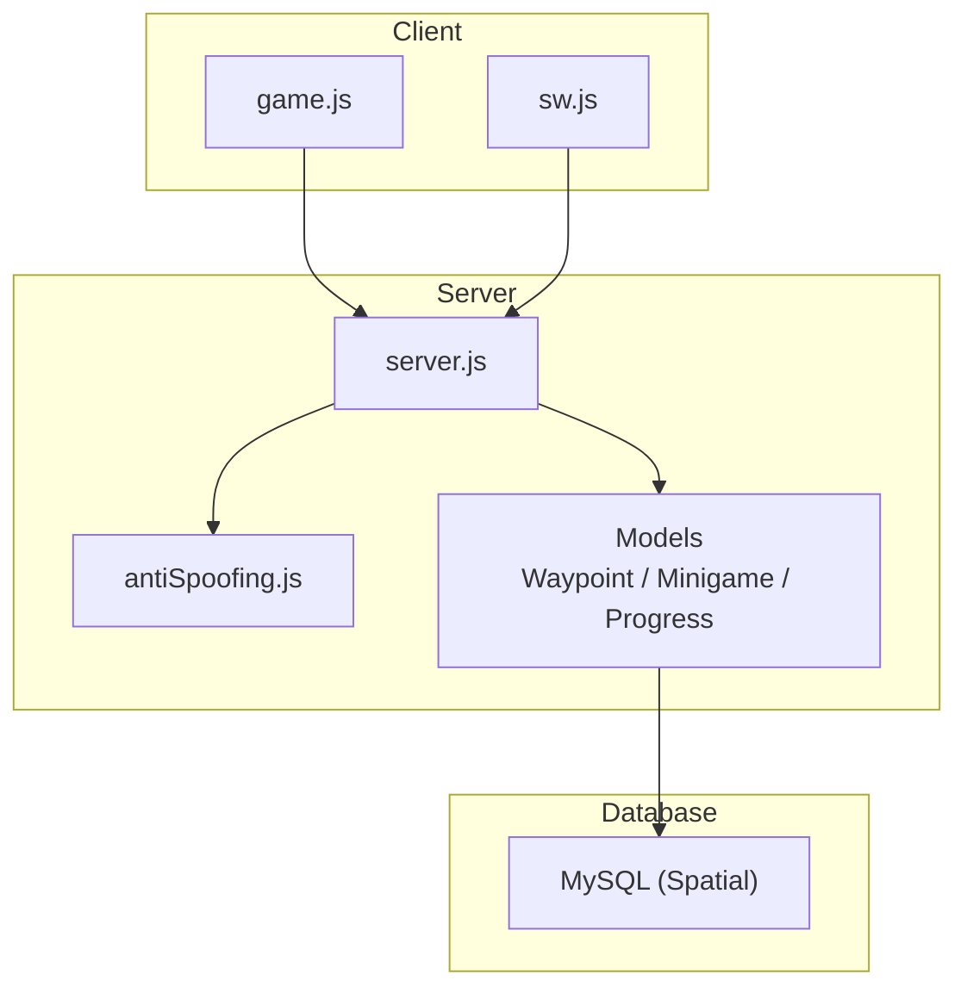
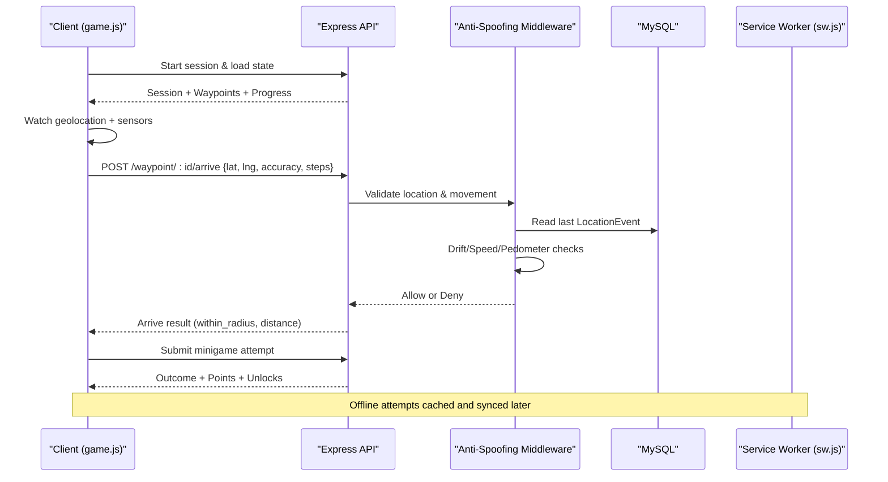
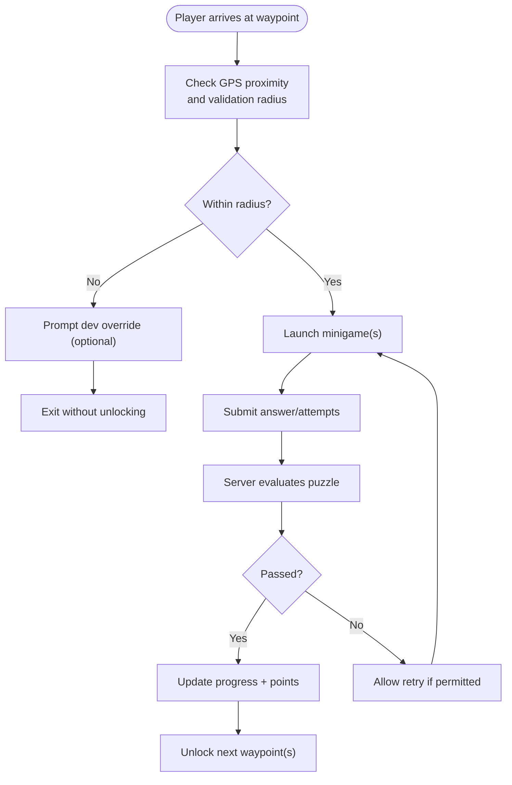
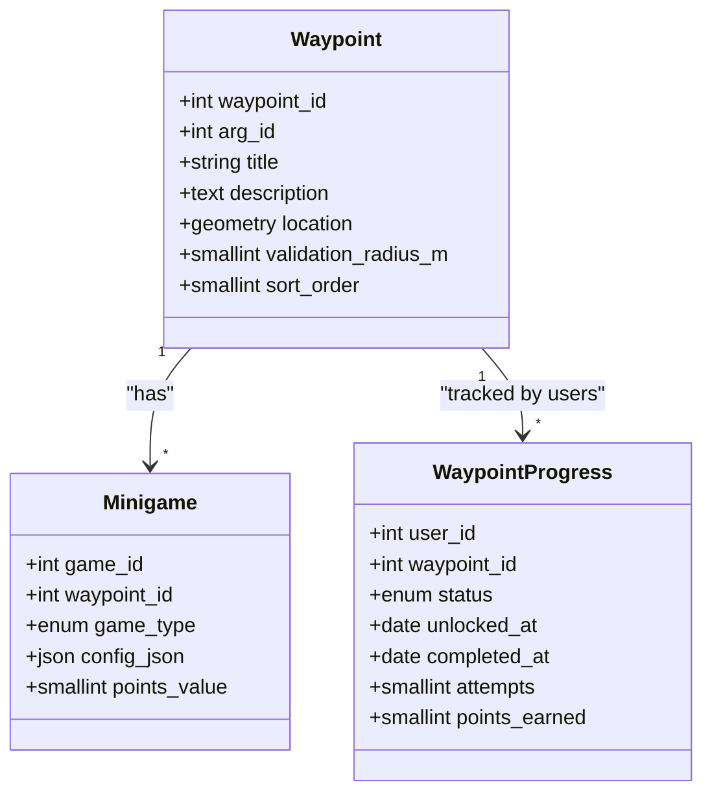
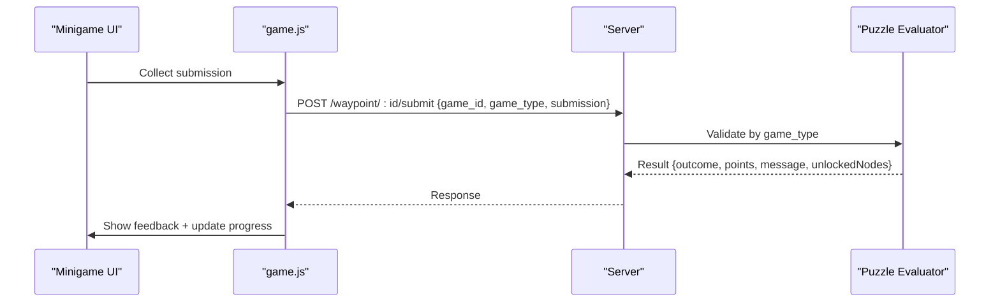
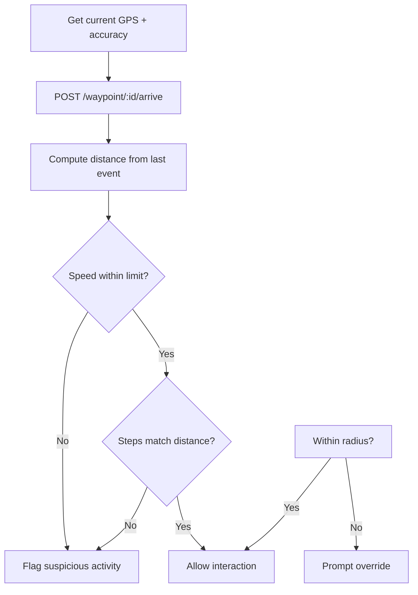
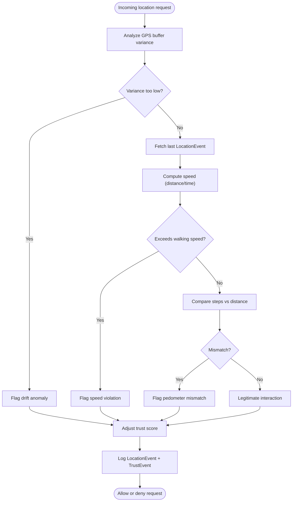
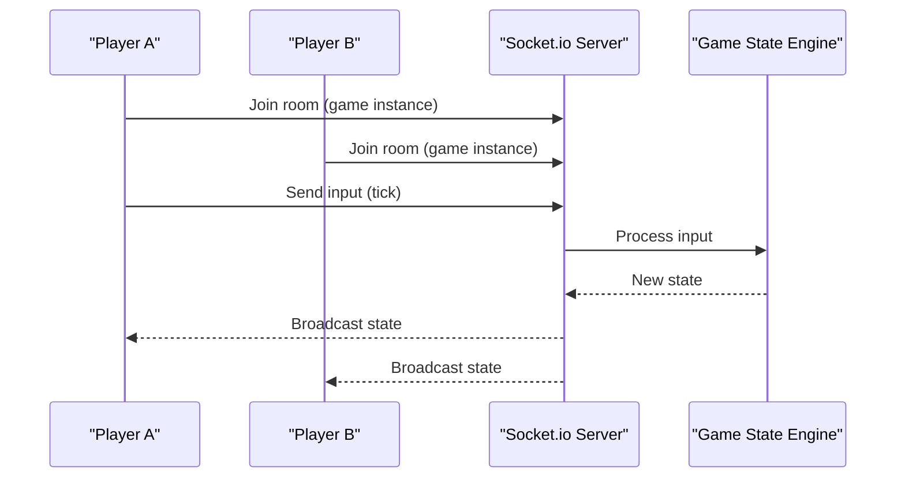
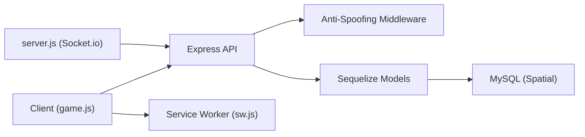

# Core Features

<cite>
**Referenced Files in This Document**
- [README.md](file://README.md)
- [Waypoint.js](file://server/src/models/Waypoint.js)
- [Minigame.js](file://server/src/models/Minigame.js)
- [WaypointProgress.js](file://server/src/models/WaypointProgress.js)
- [antiSpoofing.js](file://server/src/middleware/antiSpoofing.js)
- [game.js](file://client/scripts/game.js)
- [sw.js](file://client/sw.js)
- [server.js](file://server/server.js)
- [implementation-details.md](file://warg-docs/docs/2-architecture-and-design/implementation-details.md)
- [spoofing-detection.md](file://warg-docs/docs/2-architecture-and-design/spoofing-detection.md)
</cite>

## Table of Contents
1. [Introduction](#introduction)
2. [Project Structure](#project-structure)
3. [Core Components](#core-components)
4. [Architecture Overview](#architecture-overview)
5. [Detailed Component Analysis](#detailed-component-analysis)
6. [Dependency Analysis](#dependency-analysis)
7. [Performance Considerations](#performance-considerations)
8. [Troubleshooting Guide](#troubleshooting-guide)
9. [Conclusion](#conclusion)

## Introduction
This document explains the WARG Platform’s core gameplay features with a focus on:
- Waypoint-based progression and puzzle validation
- Minigame framework architecture
- Geospatial GPS proximity validation, movement analysis, and anti-spoofing
- Real-time multiplayer via WebSockets (planned)
- Offline resilience and live synchronization
- Implementation examples for custom minigames, waypoint configuration, and location triggers
- Security considerations, performance optimization, and debugging techniques

The platform is a location-based Alternate Reality Game system designed to turn campus spaces into interactive gameboards. It combines geolocation, sensor data, and server-side validation to ensure authentic gameplay while supporting offline play and future real-time collaboration.

**Section sources**
- [README.md:16-58](file://README.md#L16-L58)

## Project Structure
At a high level:
- Client (browser): Leaflet map, geolocation watch, minigame UI, offline caching via Service Worker
- Server (Node.js + Express): REST endpoints, models, middleware (including anti-spoofing), Socket.io setup
- Database (MySQL with spatial extensions): Waypoints, minigames, progress tracking, trust events
- Documentation: Architecture and design details including spoofing detection and live-play plans

**Diagram sources**
- [game.js:143-272](file://client/scripts/game.js#L143-L272)
- [sw.js:157-195](file://client/sw.js#L157-L195)
- [server.js:1-37](file://server/server.js#L1-L37)
- [antiSpoofing.js:27-167](file://server/src/middleware/antiSpoofing.js#L27-L167)
- [Waypoint.js:1-20](file://server/src/models/Waypoint.js#L1-L20)
- [Minigame.js:1-18](file://server/src/models/Minigame.js#L1-L18)
- [WaypointProgress.js:1-17](file://server/src/models/WaypointProgress.js#L1-L17)

**Section sources**
- [README.md:62-75](file://README.md#L62-L75)

## Core Components
- Waypoints: Geographic nodes with titles, descriptions, spatial locations, validation radius, and ordering.
- Minigames: Puzzle types attached to waypoints, including GPS proximity, text answers, QR/barcode scanning, AR/object scans, color/shape matching, photo submission, texture/SIFT matching, symmetry finding, word scramble, plaque scanning.
- Waypoint Progress: Tracks per-user status (locked/unlocked/completed/skipped), attempts, points earned, and timestamps.
- Anti-Spoofing Middleware: Validates player movement using drift variance, speed checks, and pedometer correlation; updates trust scores and logs events.
- Client Game Flow: Starts sessions, loads state, renders map, handles geofencing, runs minigames, submits results, and manages offline sync.
- Live Multiplayer (Planned): Socket.io configured for real-time co-op and competitive modes.

**Section sources**
- [Waypoint.js:1-20](file://server/src/models/Waypoint.js#L1-L20)
- [Minigame.js:1-18](file://server/src/models/Minigame.js#L1-L18)
- [WaypointProgress.js:1-17](file://server/src/models/WaypointProgress.js#L1-L17)
- [antiSpoofing.js:27-167](file://server/src/middleware/antiSpoofing.js#L27-L167)
- [game.js:143-272](file://client/scripts/game.js#L143-L272)
- [server.js:14-37](file://server/server.js#L14-L37)

## Architecture Overview
The gameplay loop integrates client sensors and UI with server-side validation and persistence:

**Diagram sources**
- [game.js:486-630](file://client/scripts/game.js#L486-L630)
- [antiSpoofing.js:27-167](file://server/src/middleware/antiSpoofing.js#L27-L167)
- [sw.js:157-195](file://client/sw.js#L157-L195)

## Detailed Component Analysis

### Waypoint-Based Progression System
- Data model:
  - Waypoint: Spatial point (SRID 4326), title/description, validation radius, sort order.
  - WaypointProgress: Per-user status, attempts, points, timestamps.
- Gameplay flow:
  - Client starts a session and loads full state (waypoints, edges, progress).
  - Map displays nodes; players must be within the validation radius to unlock puzzles.
  - Completing minigames advances progress and unlocks subsequent waypoints based on edges.

**Diagram sources**
- [Waypoint.js:1-20](file://server/src/models/Waypoint.js#L1-L20)
- [WaypointProgress.js:1-17](file://server/src/models/WaypointProgress.js#L1-L17)
- [game.js:486-630](file://client/scripts/game.js#L486-L630)

**Section sources**
- [Waypoint.js:1-20](file://server/src/models/Waypoint.js#L1-L20)
- [WaypointProgress.js:1-17](file://server/src/models/WaypointProgress.js#L1-L17)
- [game.js:143-272](file://client/scripts/game.js#L143-L272)

### Minigame Framework Architecture
- Minigame model supports multiple game types via an enum, each with JSON configuration and point values.
- Client handler pattern:
  - The game page selects a handler by game_type, renders UI, collects submissions, and posts them to the server.
  - For camera-based games, the client captures media, optionally processes locally, then submits blobs to the server for evaluation.
- Validation:
  - Server validates submissions against stored configurations and returns pass/fail outcomes, points awarded, and any unlocked nodes.

**Diagram sources**
- [Minigame.js:1-18](file://server/src/models/Minigame.js#L1-L18)
- [Waypoint.js:1-20](file://server/src/models/Waypoint.js#L1-L20)
- [WaypointProgress.js:1-17](file://server/src/models/WaypointProgress.js#L1-L17)

**Section sources**
- [Minigame.js:1-18](file://server/src/models/Minigame.js#L1-L18)
- [game.js:354-630](file://client/scripts/game.js#L354-L630)

### Puzzle Validation Logic
- Client gathers inputs per minigame type (e.g., text answer, QR code, image blob).
- Submission payload includes game_id, game_type, and submission data.
- Server evaluates logic (type-specific) and responds with outcome, points, and potential unlocks.
- Camera-based minigames may include confidence scores and offline handling.

**Diagram sources**
- [game.js:543-600](file://client/scripts/game.js#L543-L600)

**Section sources**
- [game.js:543-600](file://client/scripts/game.js#L543-L600)

### Geospatial GPS Proximity Validation
- Client watches geolocation and sends arrival requests with latitude, longitude, accuracy, and optional sensor data.
- Server-side checks:
  - Distance between last known location and current location
  - Speed limits based on time delta
  - Pedometer correlation when steps are provided
- If outside radius, client can prompt a developer override before proceeding.

**Diagram sources**
- [game.js:486-630](file://client/scripts/game.js#L486-L630)
- [antiSpoofing.js:27-167](file://server/src/middleware/antiSpoofing.js#L27-L167)

**Section sources**
- [game.js:486-630](file://client/scripts/game.js#L486-L630)
- [spoofing-detection.md:26-46](file://warg-docs/docs/2-architecture-and-design/spoofing-detection.md#L26-L46)

### Movement Pattern Analysis and Anti-Spoofing Mechanisms
- Drift detection: Analyzes variance of buffered GPS samples; extremely low variance indicates spoofing.
- Speed detection: Computes distance/time; flags unrealistic speeds.
- Pedometer integration: Correlates step counts with distance covered.
- Trust scoring: Adjusts user trust score and flags suspicious accounts; logs LocationEvent and TrustEvent records.

**Diagram sources**
- [antiSpoofing.js:27-167](file://server/src/middleware/antiSpoofing.js#L27-L167)

**Section sources**
- [antiSpoofing.js:27-167](file://server/src/middleware/antiSpoofing.js#L27-L167)
- [implementation-details.md:33-67](file://warg-docs/docs/2-architecture-and-design/implementation-details.md#L33-L67)
- [spoofing-detection.md:26-46](file://warg-docs/docs/2-architecture-and-design/spoofing-detection.md#L26-L46)

### Real-Time Multiplayer Support (WebSockets)
- Socket.io is configured on the server with CORS settings for client origins.
- Planned live-play mechanics:
  - Tick-based state updates broadcast to players in a geofenced area.
  - Interpolation for smooth rendering between ticks.
- Integration points:
  - Clients will join rooms per game instance and subscribe to state broadcasts.
  - Server will validate inputs and compute new states deterministically.

**Diagram sources**
- [server.js:14-37](file://server/server.js#L14-L37)
- [implementation-details.md:207-209](file://warg-docs/docs/2-architecture-and-design/implementation-details.md#L207-L209)

**Section sources**
- [server.js:14-37](file://server/server.js#L14-L37)
- [implementation-details.md:207-209](file://warg-docs/docs/2-architecture-and-design/implementation-details.md#L207-L209)

### Collaborative Puzzle Mechanics and Live Synchronization
- Collaborative puzzles rely on shared state and synchronized inputs across clients.
- Live synchronization ensures consistent gameplay through deterministic server-side evaluation and periodic state broadcasts.
- Offline mode excludes live/co-op games; such puzzles require connectivity.

**Section sources**
- [implementation-details.md:207-209](file://warg-docs/docs/2-architecture-and-design/implementation-details.md#L207-L209)

### Implementation Examples

#### Creating Custom Minigames
- Define a new game_type in the Minigame model and implement a corresponding client handler that renders UI and collects submissions.
- Ensure the server evaluator recognizes the new type and validates submissions accordingly.
- Example references:
  - Model definition: [Minigame.js:1-18](file://server/src/models/Minigame.js#L1-L18)
  - Client handler invocation: [game.js:517-604](file://client/scripts/game.js#L517-L604)

#### Configuring Waypoint Challenges
- Create a Waypoint with a spatial POINT and set validation_radius_m to define the geofence.
- Attach one or more Minigames to the waypoint via the authoring console.
- Use sort_order to control progression sequence.
- Example references:
  - Waypoint model: [Waypoint.js:1-20](file://server/src/models/Waypoint.js#L1-L20)
  - Client geofence check: [game.js:486-630](file://client/scripts/game.js#L486-L630)

#### Integrating Location-Based Triggers
- Use navigator.geolocation.watchPosition to stream location updates.
- On arrival, send lat/lng/accuracy plus sensor data to the server.
- Handle within/outside radius responses and optional dev overrides.
- Example references:
  - Location watching: [game.js:257-267](file://client/scripts/game.js#L257-L267)
  - Arrival submission: [game.js:486-630](file://client/scripts/game.js#L486-L630)

**Section sources**
- [Minigame.js:1-18](file://server/src/models/Minigame.js#L1-L18)
- [Waypoint.js:1-20](file://server/src/models/Waypoint.js#L1-L20)
- [game.js:257-267](file://client/scripts/game.js#L257-L267)
- [game.js:486-630](file://client/scripts/game.js#L486-L630)
- [game.js:517-604](file://client/scripts/game.js#L517-L604)

## Dependency Analysis
Key dependencies and relationships:
- Client depends on geolocation APIs, Service Worker for offline caching, and server REST endpoints.
- Server depends on Express routes, Sequelize models, and MySQL spatial functions.
- Anti-spoofing middleware depends on LocationEvent history and User trust profiles.
- Socket.io is integrated for planned real-time features.

**Diagram sources**
- [game.js:143-272](file://client/scripts/game.js#L143-L272)
- [sw.js:157-195](file://client/sw.js#L157-L195)
- [server.js:1-37](file://server/server.js#L1-L37)
- [antiSpoofing.js:27-167](file://server/src/middleware/antiSpoofing.js#L27-L167)

**Section sources**
- [README.md:62-75](file://README.md#L62-L75)

## Performance Considerations
- Geolocation throttling: Use reasonable maximumAge and enableHighAccuracy judiciously to balance precision and battery usage.
- Sensor data batching: Aggregate steps and motion data to reduce payload size and frequency.
- Offline caching: Preload minigame references and use Service Worker to cache assets and pending attempts.
- Server-side validation: Keep anti-spoofing checks efficient; avoid heavy computations per request.
- WebSocket scaling: Plan for horizontal scaling of Socket.io instances with adapters if needed.

[No sources needed since this section provides general guidance]

## Troubleshooting Guide
Common issues and resolutions:
- Geofence failures:
  - Verify device location permissions and accuracy.
  - Use the dev override prompt to confirm expected behavior during testing.
  - Reference: [game.js:486-630](file://client/scripts/game.js#L486-L630)
- Anti-spoofing denials:
  - Check drift variance, speed violations, and pedometer mismatches.
  - Review trust score adjustments and logged events.
  - Reference: [antiSpoofing.js:27-167](file://server/src/middleware/antiSpoofing.js#L27-L167)
- Offline sync problems:
  - Ensure Service Worker is active and manual sync is triggered upon reconnect.
  - Confirm pending attempts are cleared after successful sync.
  - Reference: [sw.js:157-195](file://client/sw.js#L157-L195)
- Live-play not working:
  - Validate CORS configuration for Socket.io and client origins.
  - Ensure clients join correct rooms and receive broadcasts.
  - Reference: [server.js:14-37](file://server/server.js#L14-L37)

**Section sources**
- [game.js:486-630](file://client/scripts/game.js#L486-L630)
- [antiSpoofing.js:27-167](file://server/src/middleware/antiSpoofing.js#L27-L167)
- [sw.js:157-195](file://client/sw.js#L157-L195)
- [server.js:14-37](file://server/server.js#L14-L37)

## Conclusion
The WARG Platform delivers a robust, secure, and extensible gameplay experience centered around geospatial challenges and diverse minigames. Its architecture balances client-side interactivity with server-side validation, incorporates anti-spoofing mechanisms to protect integrity, and lays groundwork for real-time multiplayer. With clear extension points for custom minigames and waypoint configuration, creators can craft engaging location-based narratives while maintaining performance and security.

[No sources needed since this section summarizes without analyzing specific files]