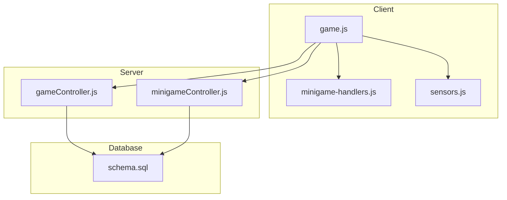
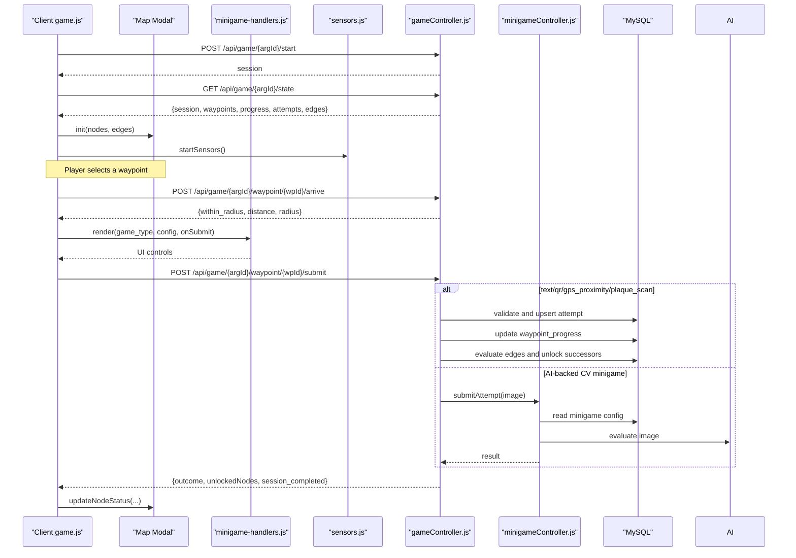
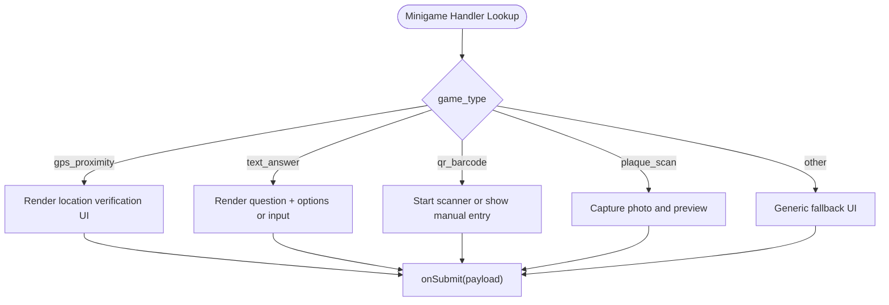
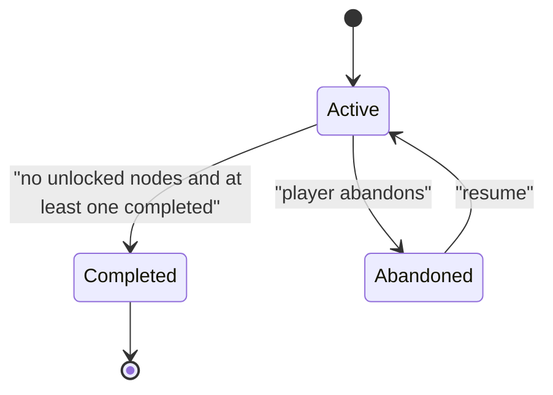
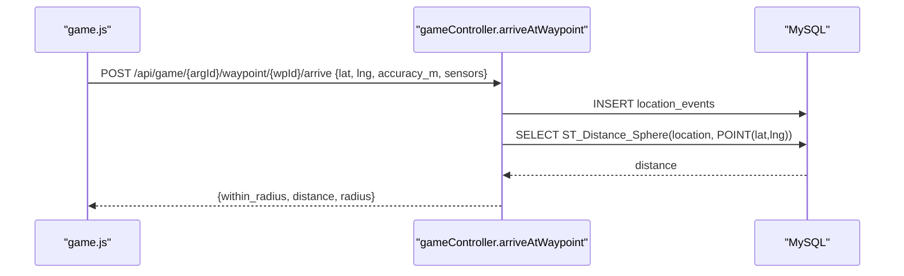
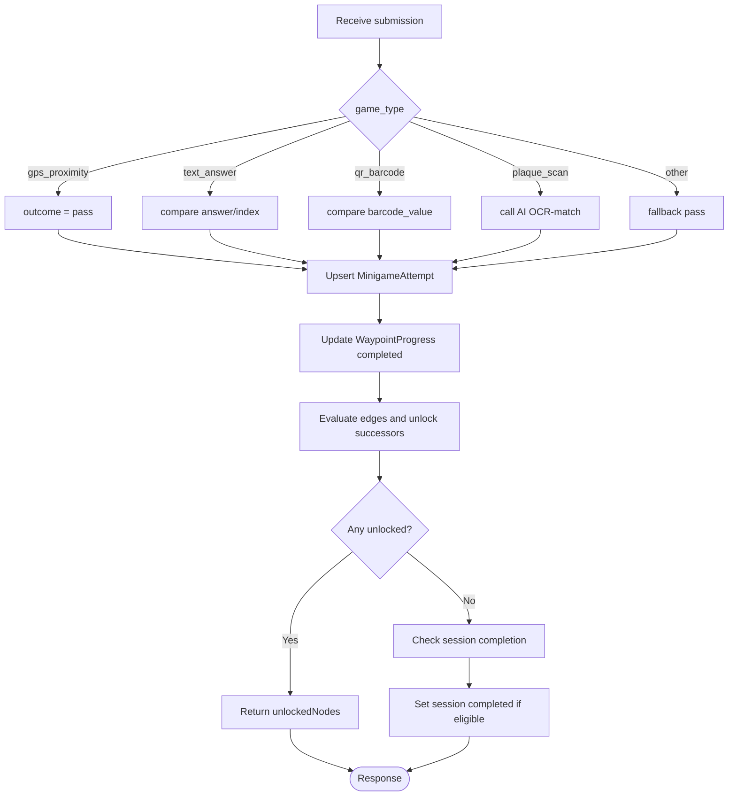
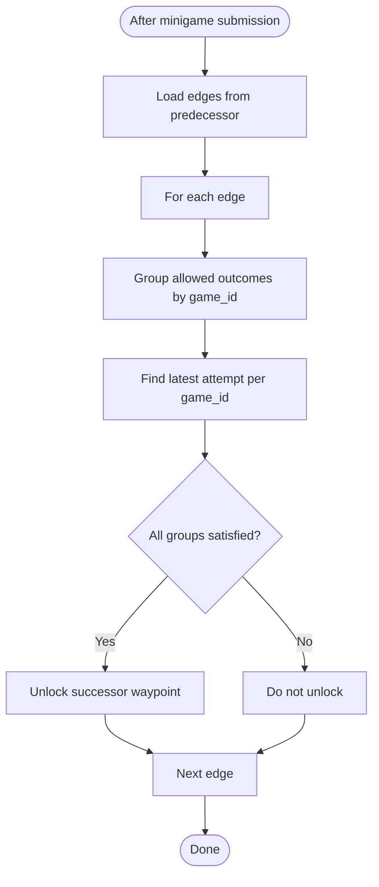
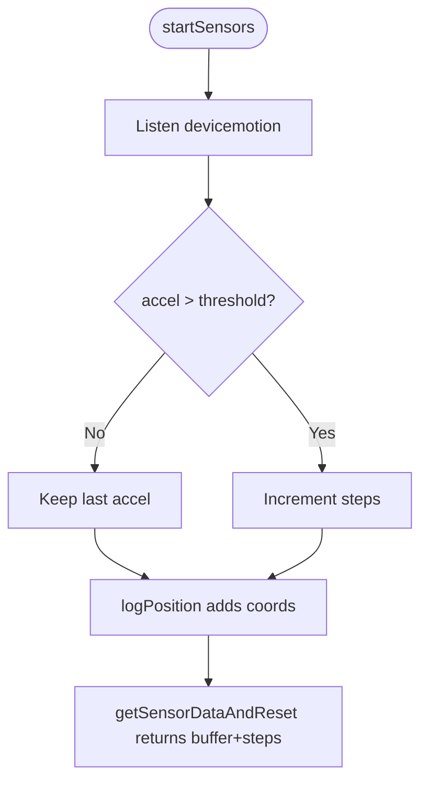
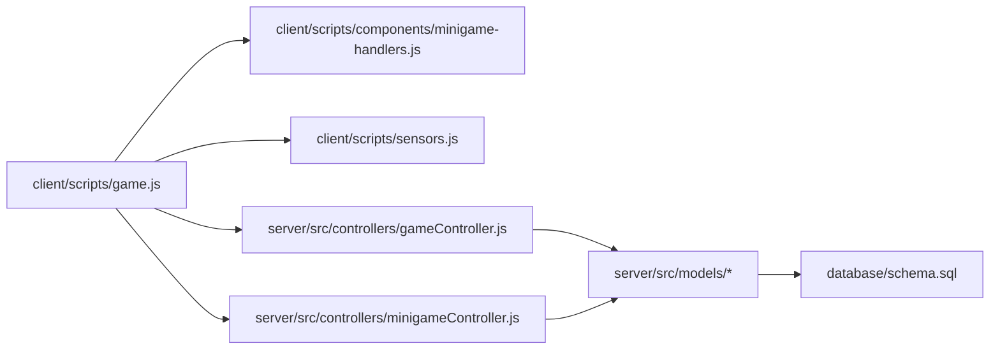

# Game Engine & Progression System

<cite>
**Referenced Files in This Document**
- [README.md](file://README.md)
- [schema.sql](file://database/schema.sql)
- [Waypoint.js](file://server/src/models/Waypoint.js)
- [Minigame.js](file://server/src/models/Minigame.js)
- [GameSession.js](file://server/src/models/GameSession.js)
- [gameController.js](file://server/src/controllers/gameController.js)
- [minigameController.js](file://server/src/controllers/minigameController.js)
- [game.js](file://client/scripts/game.js)
- [minigame-handlers.js](file://client/scripts/components/minigame-handlers.js)
- [sensors.js](file://client/scripts/sensors.js)
</cite>

## Table of Contents
1. [Introduction](#introduction)
2. [Project Structure](#project-structure)
3. [Core Components](#core-components)
4. [Architecture Overview](#architecture-overview)
5. [Detailed Component Analysis](#detailed-component-analysis)
6. [Dependency Analysis](#dependency-analysis)
7. [Performance Considerations](#performance-considerations)
8. [Troubleshooting Guide](#troubleshooting-guide)
9. [Conclusion](#conclusion)

## Introduction
This document explains the WARG Platform’s game engine and waypoint-based progression system. It covers:
- The minigame framework architecture on both client and server
- Puzzle validation logic for built-in puzzle types
- State management for gameplay sessions, including branching progression
- Waypoint structure, validation, and progression flow
- Minigame type system and how to create custom minigames
- Examples of configuring waypoint challenges, implementing validation, and synchronizing game state
- Performance optimization strategies for large games
- Error handling and debugging techniques for complex gameplay scenarios

The platform is a location-based ARG system with geospatial nodes (waypoints), puzzles (minigames), and player progress tracked across sessions.

**Section sources**
- [README.md:16-75](file://README.md#L16-L75)

## Project Structure
At a high level:
- Client-side game UI orchestrates map rendering, sensor collection, and minigame interactions
- Server-side controllers manage session lifecycle, geofencing, puzzle validation, and progression updates
- Database schema defines waypoints, edges, minigames, attempts, and progress tables



**Diagram sources**
- [game.js:1-838](file://client/scripts/game.js#L1-L838)
- [minigame-handlers.js:1-202](file://client/scripts/components/minigame-handlers.js#L1-L202)
- [sensors.js:1-59](file://client/scripts/sensors.js#L1-L59)
- [gameController.js:1-368](file://server/src/controllers/gameController.js#L1-L368)
- [minigameController.js:1-126](file://server/src/controllers/minigameController.js#L1-L126)
- [schema.sql:154-345](file://database/schema.sql#L154-L345)

**Section sources**
- [game.js:1-838](file://client/scripts/game.js#L1-L838)
- [schema.sql:154-345](file://database/schema.sql#L154-L345)

## Core Components
- Waypoint model: geospatial node with title, description, location, validation radius, and sort order
- Minigame model: puzzle attached to a waypoint with a typed configuration and points value
- GameSession model: per-user per-ARG session tracking status, timestamps, points, and distance
- Game controller: session lifecycle, geofence arrival, minigame submission, branching unlock logic
- Minigame controller: reference image upload/retrieval and AI-backed attempt evaluation
- Client game script: session start/state fetch, map initialization, sensor collection, minigame orchestration
- Minigame handlers registry: UI renderers for supported puzzle types
- Sensors module: motion and position buffer for anti-spoofing telemetry

**Section sources**
- [Waypoint.js:1-20](file://server/src/models/Waypoint.js#L1-L20)
- [Minigame.js:1-18](file://server/src/models/Minigame.js#L1-L18)
- [GameSession.js:1-19](file://server/src/models/GameSession.js#L1-L19)
- [gameController.js:1-368](file://server/src/controllers/gameController.js#L1-L368)
- [minigameController.js:1-126](file://server/src/controllers/minigameController.js#L1-L126)
- [game.js:1-838](file://client/scripts/game.js#L1-L838)
- [minigame-handlers.js:1-202](file://client/scripts/components/minigame-handlers.js#L1-L202)
- [sensors.js:1-59](file://client/scripts/sensors.js#L1-L59)

## Architecture Overview
The game engine follows a client-server flow:
- Client starts/resumes a session and loads full game state
- Player navigates to a waypoint; client verifies geofence via server
- Client renders the appropriate minigame UI based on type
- Client submits answers or media; server validates and records attempts
- Server updates waypoint progress and evaluates branching edges to unlock successors
- Session completion is detected when no unlocked nodes remain and at least one is completed



**Diagram sources**
- [game.js:143-631](file://client/scripts/game.js#L143-L631)
- [gameController.js:40-349](file://server/src/controllers/gameController.js#L40-L349)
- [minigameController.js:53-125](file://server/src/controllers/minigameController.js#L53-L125)
- [schema.sql:154-345](file://database/schema.sql#L154-L345)

## Detailed Component Analysis

### Waypoint Model and Data Structure
- Fields include identifier, associated ARG, title, description, geospatial POINT (SRID 4326), validation radius in meters, and sort order
- Spatial index supports efficient proximity queries
- Edges define directed predecessor-successor relationships with JSON conditions

```mermaid
erDiagram
WAYPOINTS {
int waypoint_id PK
int arg_id FK
string title
text description
point location SRID_4326
smallint validation_radius_m
smallint sort_order
datetime created_at
datetime updated_at
}
WAYPOINT_EDGES {
int edge_id PK
int arg_id FK
int from_waypoint_id FK
int to_waypoint_id FK
json conditions_json
}
MINIGAMES {
int game_id PK
int waypoint_id FK
enum game_type
json config_json
smallint points_value
datetime created_at
datetime updated_at
}
WAYPOINTS ||--o{ MINIGAMES : "has"
WAYPOINTS ||--o{ WAYPOINT_EDGES : "from"
WAYPOINTS ||--o{ WAYPOINT_EDGES : "to"
```

**Diagram sources**
- [schema.sql:154-246](file://database/schema.sql#L154-L246)
- [Waypoint.js:1-20](file://server/src/models/Waypoint.js#L1-L20)
- [Minigame.js:1-18](file://server/src/models/Minigame.js#L1-L18)

**Section sources**
- [schema.sql:154-246](file://database/schema.sql#L154-L246)
- [Waypoint.js:1-20](file://server/src/models/Waypoint.js#L1-L20)
- [Minigame.js:1-18](file://server/src/models/Minigame.js#L1-L18)

### Minigame Type System
Built-in types defined in the database enum:
- gps_proximity
- text_answer
- qr_barcode
- ar_object_scan
- colour_match
- shape_match
- photo_submit
- texture_match
- sift_match
- symmetry_finder
- word_scramble
- plaque_scan

Client-side handler registry currently implements:
- gps_proximity
- text_answer (supports MCQ and free-text)
- qr_barcode (scanner + manual entry fallback)
- plaque_scan (photo capture and preview)

Other types fall back to a generic “Mark Complete” UI until fully implemented.



**Diagram sources**
- [minigame-handlers.js:7-200](file://client/scripts/components/minigame-handlers.js#L7-L200)
- [schema.sql:212-246](file://database/schema.sql#L212-L246)

**Section sources**
- [schema.sql:212-246](file://database/schema.sql#L212-L246)
- [minigame-handlers.js:1-202](file://client/scripts/components/minigame-handlers.js#L1-L202)

### Gameplay Session State Management
- Session lifecycle: start/resume, active/completed/abandoned
- On first start, root waypoints are unlocked based on edges; if none exist, all waypoints are roots
- Dynamic start node allocation ensures players can begin at valid roots even if progress data is inconsistent
- Session completion is detected when there are no unlocked nodes but at least one completed node exists



**Diagram sources**
- [gameController.js:40-83](file://server/src/controllers/gameController.js#L40-L83)
- [gameController.js:114-156](file://server/src/controllers/gameController.js#L114-L156)
- [GameSession.js:1-19](file://server/src/models/GameSession.js#L1-L19)

**Section sources**
- [gameController.js:40-83](file://server/src/controllers/gameController.js#L40-L83)
- [gameController.js:114-156](file://server/src/controllers/gameController.js#L114-L156)
- [GameSession.js:1-19](file://server/src/models/GameSession.js#L1-L19)

### Geofencing and Arrival Validation
- Client calls arrive endpoint with lat/lng/accuracy and optional sensor telemetry
- Server logs LocationEvent and computes spherical distance using MySQL spatial functions
- Response includes whether within radius, computed distance, and configured radius
- Client may prompt dev override if outside radius



**Diagram sources**
- [game.js:486-506](file://client/scripts/game.js#L486-L506)
- [gameController.js:163-201](file://server/src/controllers/gameController.js#L163-L201)
- [schema.sql:354-372](file://database/schema.sql#L354-L372)

**Section sources**
- [game.js:486-506](file://client/scripts/game.js#L486-L506)
- [gameController.js:163-201](file://server/src/controllers/gameController.js#L163-L201)
- [schema.sql:354-372](file://database/schema.sql#L354-L372)

### Minigame Submission and Validation Logic
- gps_proximity: pass if arrived within radius
- text_answer: exact match for free-text; correct_index for MCQ
- qr_barcode: exact match against configured barcode value
- plaque_scan: base64 image comparison via AI OCR service
- Other types: fallback stub passes by default unless handled elsewhere

On success/failure:
- Upsert MinigameAttempt with outcome and score
- Update WaypointProgress to completed
- Evaluate successor edges with conditions based on previous attempts
- Unlock successors if conditions met
- Mark session completed if applicable



**Diagram sources**
- [gameController.js:203-349](file://server/src/controllers/gameController.js#L203-L349)
- [minigameController.js:53-125](file://server/src/controllers/minigameController.js#L53-L125)
- [schema.sql:327-345](file://database/schema.sql#L327-L345)

**Section sources**
- [gameController.js:203-349](file://server/src/controllers/gameController.js#L203-L349)
- [minigameController.js:53-125](file://server/src/controllers/minigameController.js#L53-L125)
- [schema.sql:327-345](file://database/schema.sql#L327-L345)

### Branching Progression and Conditions
- Edges connect predecessor to successor waypoints
- conditions_json specifies required outcomes for specific game_ids
- evaluateConditions groups multiple outcomes per game_id as OR logic
- Successors are unlocked only if all grouped conditions are satisfied



**Diagram sources**
- [gameController.js:5-38](file://server/src/controllers/gameController.js#L5-L38)
- [gameController.js:304-318](file://server/src/controllers/gameController.js#L304-L318)
- [schema.sql:182-203](file://database/schema.sql#L182-L203)

**Section sources**
- [gameController.js:5-38](file://server/src/controllers/gameController.js#L5-L38)
- [gameController.js:304-318](file://server/src/controllers/gameController.js#L304-L318)
- [schema.sql:182-203](file://database/schema.sql#L182-L203)

### Client-Side Sensor Telemetry
- Collects accelerometer peaks to estimate step count
- Buffers recent GPS coordinates with timestamps
- Resets step counter after interaction and returns buffered telemetry with arrival submissions



**Diagram sources**
- [sensors.js:1-59](file://client/scripts/sensors.js#L1-L59)

**Section sources**
- [sensors.js:1-59](file://client/scripts/sensors.js#L1-L59)

### Example: Configuring a Waypoint Challenge
- Define a waypoint with location and validation radius
- Attach a minigame with a chosen game_type and config_json
- Configure conditions on edges to control unlocking behavior

Examples:
- text_answer MCQ: set is_mcq=true, options array, correct_index
- qr_barcode: set barcode_value to expected code
- plaque_scan: upload reference image via minigame controller; store base64 and mimetype in config_json

**Section sources**
- [schema.sql:154-246](file://database/schema.sql#L154-L246)
- [minigameController.js:7-31](file://server/src/controllers/minigameController.js#L7-L31)

### Example: Implementing Puzzle Validation
- For simple types, implement direct comparisons in the server controller
- For AI-backed types, route through minigame controller to call external AI endpoints
- Ensure config fields are validated before processing (e.g., presence of reference images)

**Section sources**
- [gameController.js:218-277](file://server/src/controllers/gameController.js#L218-L277)
- [minigameController.js:63-119](file://server/src/controllers/minigameController.js#L63-L119)

### Example: Handling Game State Synchronization
- Client starts session and fetches full state
- Prefetch minigame references for unlocked nodes to support offline caching
- On reconnect, reload state and reconcile UI markers
- Use BroadcastChannel to handle sync results from background tasks

**Section sources**
- [game.js:143-218](file://client/scripts/game.js#L143-L218)
- [game.js:68-113](file://client/scripts/game.js#L68-L113)

## Dependency Analysis
Key dependencies and relationships:
- Client game.js depends on minigame handlers and sensors
- Server gameController depends on models and performs spatial queries
- Minigame controller depends on AI service for advanced evaluations
- Database schema enforces referential integrity between waypoints, edges, minigames, attempts, and progress



**Diagram sources**
- [game.js:1-838](file://client/scripts/game.js#L1-L838)
- [minigame-handlers.js:1-202](file://client/scripts/components/minigame-handlers.js#L1-L202)
- [sensors.js:1-59](file://client/scripts/sensors.js#L1-L59)
- [gameController.js:1-368](file://server/src/controllers/gameController.js#L1-L368)
- [minigameController.js:1-126](file://server/src/controllers/minigameController.js#L1-L126)
- [schema.sql:154-345](file://database/schema.sql#L154-L345)

**Section sources**
- [game.js:1-838](file://client/scripts/game.js#L1-L838)
- [gameController.js:1-368](file://server/src/controllers/gameController.js#L1-L368)
- [minigameController.js:1-126](file://server/src/controllers/minigameController.js#L1-L126)
- [schema.sql:154-345](file://database/schema.sql#L154-L345)

## Performance Considerations
- Spatial queries: Use MySQL SPATIAL INDEX on POINT columns for fast distance calculations
- Batch operations: Initialize waypoint progress in parallel during session start
- Prefetching: Preload minigame references for unlocked nodes to reduce latency and enable offline caching
- Connection resilience: Detect online/offline state and reconcile state upon reconnection
- AI service calls: Cache reference images and minimize payload sizes; consider timeouts and retries
- Sensor buffering: Limit coordinate buffer size to avoid memory growth

[No sources needed since this section provides general guidance]

## Troubleshooting Guide
Common issues and resolutions:
- Missing coordinates in arrive request: ensure lat/lng provided; client should guard against undefined values
- AI service unreachable: return clear error and allow retry; log detailed errors for diagnosis
- Reference image missing for plaque scan: validate config before processing; provide admin tool to upload reference
- Offline sync failures: use BroadcastChannel to surface errors and allow manual retry
- Geofence override: developer prompt allows testing outside radius; disable in production

**Section sources**
- [gameController.js:163-201](file://server/src/controllers/gameController.js#L163-L201)
- [gameController.js:239-273](file://server/src/controllers/gameController.js#L239-L273)
- [minigameController.js:7-31](file://server/src/controllers/minigameController.js#L7-L31)
- [game.js:486-506](file://client/scripts/game.js#L486-L506)
- [game.js:68-113](file://client/scripts/game.js#L68-L113)

## Conclusion
The WARG Platform’s game engine combines geospatial validation, typed minigames, and robust session state management to deliver engaging, location-based ARG experiences. Waypoints form a directed graph with conditional branching, while minigame validation spans simple checks to AI-backed computer vision tasks. The client orchestrates user interactions and sensor telemetry, while the server ensures secure progression and synchronization. With careful attention to performance, error handling, and debugging, the system scales to support large, complex games.

[No sources needed since this section summarizes without analyzing specific files]