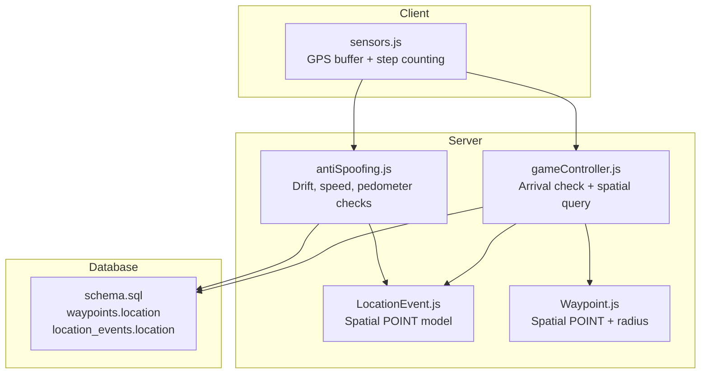
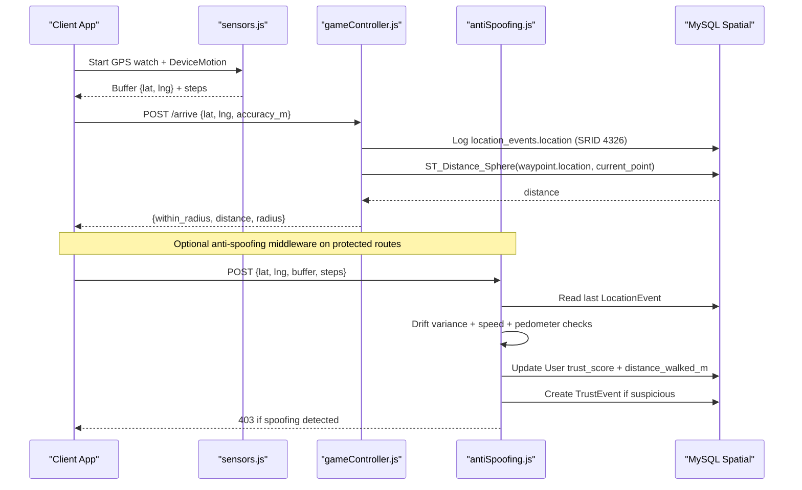
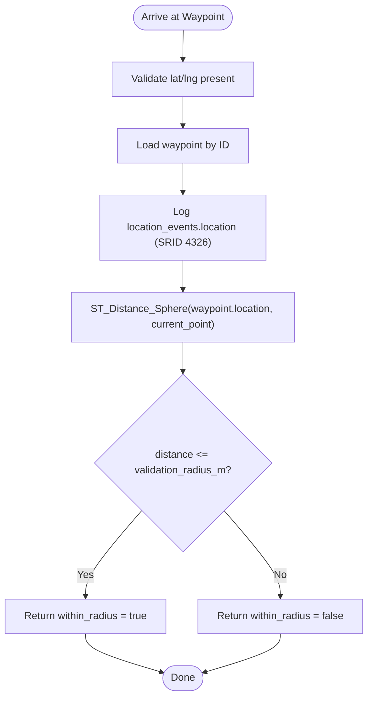
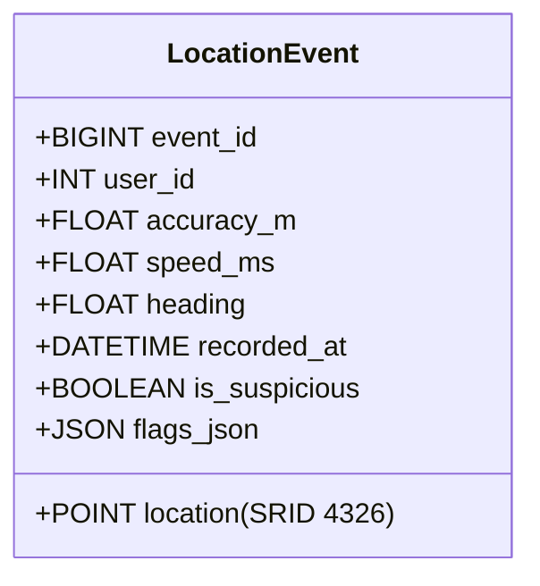
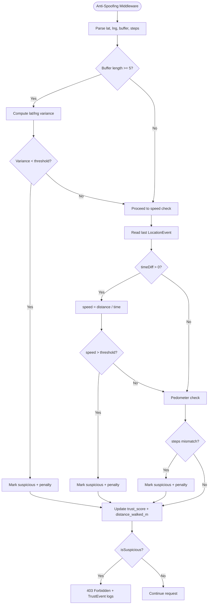
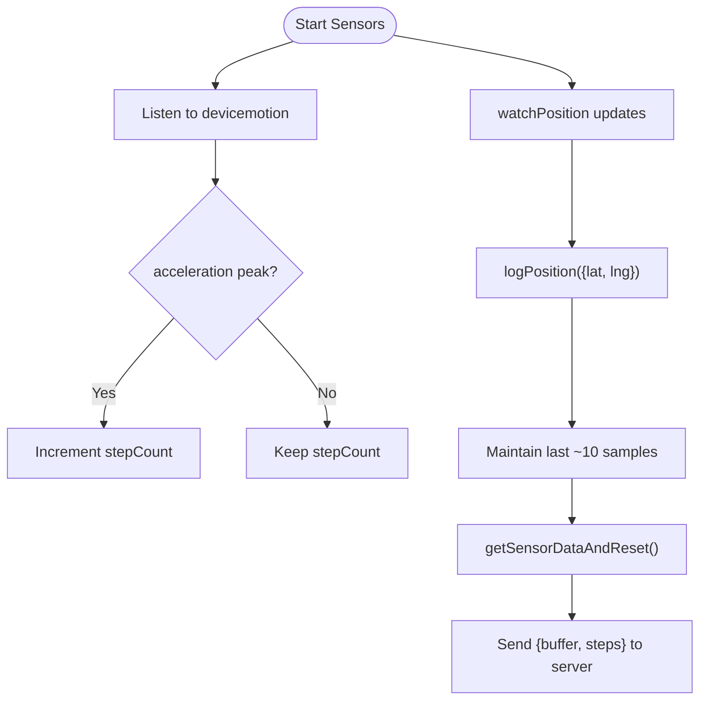
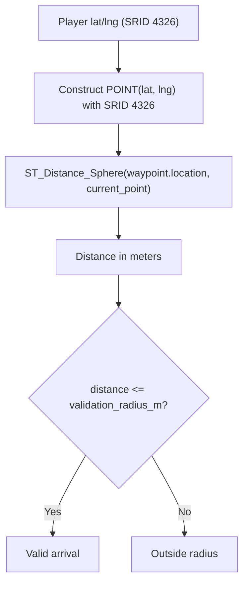
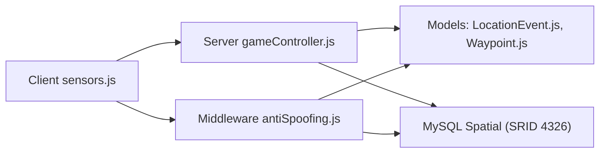

# Geospatial Features & Location Validation

<cite>
**Referenced Files in This Document**
- [schema.sql](file://database/schema.sql)
- [antiSpoofing.js](file://server/src/middleware/antiSpoofing.js)
- [LocationEvent.js](file://server/src/models/LocationEvent.js)
- [Waypoint.js](file://server/src/models/Waypoint.js)
- [gameController.js](file://server/src/controllers/gameController.js)
- [sensors.js](file://client/scripts/sensors.js)
- [spoofing-detection.md](file://warg-docs/docs/2-architecture-and-design/spoofing-detection.md)
- [implementation-details.md](file://warg-docs/docs/2-architecture-and-design/implementation-details.md)
- [test_loc.js](file://server/test_loc.js)
</cite>

## Table of Contents
1. [Introduction](#introduction)
2. [Project Structure](#project-structure)
3. [Core Components](#core-components)
4. [Architecture Overview](#architecture-overview)
5. [Detailed Component Analysis](#detailed-component-analysis)
6. [Dependency Analysis](#dependency-analysis)
7. [Performance Considerations](#performance-considerations)
8. [Troubleshooting Guide](#troubleshooting-guide)
9. [Conclusion](#conclusion)

## Introduction
This document explains the WARG Platform’s geospatial features and location validation system. It covers GPS proximity validation, movement pattern analysis, anti-spoofing mechanisms, MySQL spatial extensions with SRID 4326 (WGS 84), coordinate systems, spatial queries for distance calculations, location event tracking, suspicious movement detection, spoofing prevention techniques, configuration examples, mobile device compatibility, and performance guidance.

The goal is to ensure authentic physical presence at game locations while maintaining a smooth gameplay experience across mobile devices.

## Project Structure
Geospatial functionality spans database schema definitions, server-side controllers and middleware, client-side sensor collection, and documentation describing design intent.

**Diagram sources**
- [sensors.js:1-59](file://client/scripts/sensors.js#L1-L59)
- [gameController.js:163-201](file://server/src/controllers/gameController.js#L163-L201)
- [antiSpoofing.js:27-167](file://server/src/middleware/antiSpoofing.js#L27-L167)
- [LocationEvent.js:1-21](file://server/src/models/LocationEvent.js#L1-L21)
- [Waypoint.js:1-20](file://server/src/models/Waypoint.js#L1-L20)
- [schema.sql:160-179](file://database/schema.sql#L160-L179)
- [schema.sql:354-372](file://database/schema.sql#L354-L372)

**Section sources**
- [schema.sql:160-179](file://database/schema.sql#L160-L179)
- [schema.sql:354-372](file://database/schema.sql#L354-L372)
- [gameController.js:163-201](file://server/src/controllers/gameController.js#L163-L201)
- [antiSpoofing.js:27-167](file://server/src/middleware/antiSpoofing.js#L27-L167)
- [sensors.js:1-59](file://client/scripts/sensors.js#L1-L59)

## Core Components
- Waypoints store geospatial points using MySQL spatial extensions with SRID 4326 and include a configurable validation radius in meters.
- Location events record high-frequency GPS breadcrumbs with optional accuracy, speed, heading, suspicion flags, and JSON context.
- The arrival controller validates whether a player is within the waypoint’s radius using ST_Distance_Sphere.
- Anti-spoofing middleware evaluates drift variance, speed limits, and pedometer consistency, updating trust profiles and blocking suspicious interactions.
- Client sensors collect recent GPS coordinates and accelerometer-derived steps to feed into server-side checks.

Key responsibilities:
- Database schema defines spatial columns and indexes.
- Controllers perform proximity validation and log location events.
- Middleware enforces anti-spoofing rules and trust scoring.
- Client collects motion and location telemetry.

**Section sources**
- [schema.sql:160-179](file://database/schema.sql#L160-L179)
- [schema.sql:354-372](file://database/schema.sql#L354-L372)
- [gameController.js:163-201](file://server/src/controllers/gameController.js#L163-L201)
- [antiSpoofing.js:27-167](file://server/src/middleware/antiSpoofing.js#L27-L167)
- [sensors.js:1-59](file://client/scripts/sensors.js#L1-L59)

## Architecture Overview
The geospatial flow integrates client telemetry, server-side validation, and MySQL spatial functions.

**Diagram sources**
- [sensors.js:25-58](file://client/scripts/sensors.js#L25-L58)
- [gameController.js:163-201](file://server/src/controllers/gameController.js#L163-L201)
- [antiSpoofing.js:27-167](file://server/src/middleware/antiSpoofing.js#L27-L167)
- [schema.sql:354-372](file://database/schema.sql#L354-L372)

## Detailed Component Analysis

### Waypoints and Proximity Thresholds
Waypoints define geospatial targets with:
- A POINT geometry column using SRID 4326.
- A validation_radius_m field controlling proximity tolerance.
- A spatial index for efficient queries.

Proximity validation uses ST_Distance_Sphere to compute the great-circle distance between the player’s reported point and the waypoint’s stored point. If the distance is less than or equal to validation_radius_m, the player is considered to have arrived.

Configuration guidance:
- Use smaller radii (e.g., 10–20 m) for precise checkpoints.
- Use larger radii (e.g., 30–50 m) for broader areas or when GPS accuracy is poor.
- Adjust per waypoint based on environment (urban canyons vs open spaces).

**Diagram sources**
- [gameController.js:163-201](file://server/src/controllers/gameController.js#L163-L201)
- [schema.sql:160-179](file://database/schema.sql#L160-L179)

**Section sources**
- [schema.sql:160-179](file://database/schema.sql#L160-L179)
- [gameController.js:163-201](file://server/src/controllers/gameController.js#L163-L201)

### Location Event Tracking
Location events capture:
- user_id
- location as POINT with SRID 4326
- accuracy_m, speed_ms, heading
- recorded_at timestamp
- is_suspicious flag
- flags_json for detailed reasons

Indexes optimize queries by user and time. The model also exposes fields for speed and heading, enabling richer analytics even if not always populated by every endpoint.

**Diagram sources**
- [LocationEvent.js:1-21](file://server/src/models/LocationEvent.js#L1-L21)
- [schema.sql:354-372](file://database/schema.sql#L354-L372)

**Section sources**
- [LocationEvent.js:1-21](file://server/src/models/LocationEvent.js#L1-L21)
- [schema.sql:354-372](file://database/schema.sql#L354-L372)

### Anti-Spoofing Mechanisms
Anti-spoofing middleware performs three primary checks:

1. Drift Detection
   - Analyzes variance of latitude and longitude from a recent coordinate buffer.
   - Flags near-zero variance as suspicious (possible static spoofing).

2. Speed Detection
   - Computes distance between the last recorded location and the current location.
   - Divides by elapsed time to estimate speed.
   - Flags speeds exceeding a walking threshold.

3. Pedometer Consistency
   - Compares step count against expected distance covered.
   - Flags mismatches where steps are zero or insufficient relative to distance.

Outcomes:
- Updates user trust_score within bounds [0, 100].
- Marks users as flagged when trust_score drops below a threshold.
- Accumulates steps as meters for legitimate interactions.
- Logs TrustEvent records for suspicious activity.
- Returns 403 Forbidden when spoofing is detected.

**Diagram sources**
- [antiSpoofing.js:27-167](file://server/src/middleware/antiSpoofing.js#L27-L167)

**Section sources**
- [antiSpoofing.js:27-167](file://server/src/middleware/antiSpoofing.js#L27-L167)
- [spoofing-detection.md:1-46](file://warg-docs/docs/2-architecture-and-design/spoofing-detection.md#L1-L46)

### Client Sensor Collection
The client collects:
- A rolling buffer of recent GPS coordinates via navigator.geolocation.watchPosition.
- Step counts derived from DeviceMotionEvent acceleration peaks.

Data sent to the server includes:
- buffer: array of recent {lat, lng} samples
- steps: accumulated step count since last interaction

This telemetry enables drift and pedometer checks on the server.

**Diagram sources**
- [sensors.js:1-59](file://client/scripts/sensors.js#L1-L59)

**Section sources**
- [sensors.js:1-59](file://client/scripts/sensors.js#L1-L59)

### Coordinate Systems and Spatial Queries
Coordinate system:
- All spatial data uses SRID 4326 (WGS 84).
- Waypoints and location events store POINT geometries with this SRID.

Spatial queries:
- Arrival validation uses ST_Distance_Sphere to calculate distances in meters between the player’s reported point and the waypoint’s stored point.
- Raw SQL queries construct POINT literals with explicit SRID 4326.

Examples of usage patterns:
- Creating spatial points via Sequelize function wrappers.
- Executing raw spatial queries for distance computation.

**Diagram sources**
- [gameController.js:177-196](file://server/src/controllers/gameController.js#L177-L196)
- [schema.sql:160-179](file://database/schema.sql#L160-L179)
- [schema.sql:354-372](file://database/schema.sql#L354-L372)

**Section sources**
- [gameController.js:177-196](file://server/src/controllers/gameController.js#L177-L196)
- [schema.sql:160-179](file://database/schema.sql#L160-L179)
- [schema.sql:354-372](file://database/schema.sql#L354-L372)

### Movement Pattern Analysis and Suspicious Detection
Movement analysis combines:
- Drift variance from GPS buffers to detect static spoofing.
- Speed estimation from consecutive location events to detect impossible travel.
- Pedometer correlation to detect lack of physical movement during significant displacement.

Suspicious indicators:
- Zero drift variance over multiple samples.
- Excessive speed beyond human walking thresholds.
- Steps significantly lower than expected for the distance covered.

Actions:
- Reduce trust score and mark user as flagged.
- Log TrustEvent entries with context.
- Reject interactions when spoofing is detected.

**Section sources**
- [antiSpoofing.js:44-93](file://server/src/middleware/antiSpoofing.js#L44-L93)
- [spoofing-detection.md:19-41](file://warg-docs/docs/2-architecture-and-design/spoofing-detection.md#L19-L41)

### Configuring Proximity Thresholds and Custom Rules
Configurable elements:
- Waypoint validation_radius_m controls proximity acceptance.
- Client-side step threshold influences step counting sensitivity.
- Server-side thresholds:
  - Drift variance threshold for anomaly detection.
  - Maximum walking speed threshold for speed violation detection.
  - Pedometer mismatch logic comparing steps to distance.

Customization guidance:
- Increase validation_radius_m for noisy GPS environments.
- Tune step threshold based on device characteristics.
- Adjust speed threshold to match expected movement patterns (walking vs running).
- Extend anti-spoofing checks with additional signals (e.g., altitude, IP geolocation) as future considerations.

**Section sources**
- [schema.sql:160-179](file://database/schema.sql#L160-L179)
- [sensors.js:7-22](file://client/scripts/sensors.js#L7-L22)
- [antiSpoofing.js:44-93](file://server/src/middleware/antiSpoofing.js#L44-L93)
- [spoofing-detection.md:43-46](file://warg-docs/docs/2-architecture-and-design/spoofing-detection.md#L43-L46)

### Handling GPS Accuracy Variations
Recommendations:
- Use accuracy_m from the device to adjust validation_radius_m dynamically.
- Prefer larger radii when accuracy_m is high (low confidence).
- Combine multiple location samples to reduce noise before sending to the server.
- Consider smoothing filters on the client to stabilize coordinates.

**Section sources**
- [gameController.js:168-182](file://server/src/controllers/gameController.js#L168-L182)
- [sensors.js:40-46](file://client/scripts/sensors.js#L40-L46)

## Dependency Analysis
The geospatial subsystem depends on:
- MySQL spatial extensions for storing and querying POINT geometries.
- Sequelize models mapping to spatial columns.
- Client sensor APIs (geolocation and device motion).
- Controller endpoints orchestrating arrival checks and event logging.
- Middleware enforcing anti-spoofing policies and trust profiles.

**Diagram sources**
- [sensors.js:1-59](file://client/scripts/sensors.js#L1-L59)
- [gameController.js:163-201](file://server/src/controllers/gameController.js#L163-L201)
- [LocationEvent.js:1-21](file://server/src/models/LocationEvent.js#L1-L21)
- [Waypoint.js:1-20](file://server/src/models/Waypoint.js#L1-L20)
- [antiSpoofing.js:27-167](file://server/src/middleware/antiSpoofing.js#L27-L167)

**Section sources**
- [schema.sql:160-179](file://database/schema.sql#L160-L179)
- [schema.sql:354-372](file://database/schema.sql#L354-L372)
- [gameController.js:163-201](file://server/src/controllers/gameController.js#L163-L201)
- [antiSpoofing.js:27-167](file://server/src/middleware/antiSpoofing.js#L27-L167)

## Performance Considerations
- Spatial Indexes: Ensure SPATIAL INDEX exists on waypoint.location and location_events.location to accelerate proximity queries.
- Query Optimization: Use ST_Distance_Sphere only when necessary; avoid full-table scans by filtering on specific waypoint IDs.
- Batching: Batch location event inserts where possible to reduce database load.
- Client Throttling: Limit GPS update frequency to balance accuracy and battery life.
- Memory Management: Keep coordinate buffers small (e.g., last 10 seconds) to prevent memory growth.
- Trust Score Updates: Avoid excessive writes by consolidating trust score changes.

[No sources needed since this section provides general guidance]

## Troubleshooting Guide
Common issues and resolutions:
- Missing Coordinates: Ensure lat and lng are provided in arrival requests.
- SRID Mismatch: Verify all POINT geometries use SRID 4326.
- No Drift Detected: Check that the client sends a realistic buffer of coordinates; static buffers trigger drift anomalies.
- Speed Violations: Confirm timestamps and location deltas are accurate; unrealistic jumps indicate spoofing or clock issues.
- Pedometer Mismatch: Validate DeviceMotionEvent support and step counting logic; low steps with large distances suggest spoofing.
- Accuracy Problems: Adjust validation_radius_m based on device-reported accuracy_m.

Diagnostic utilities:
- Test scripts can create sample location events to verify spatial storage and retrieval.

**Section sources**
- [gameController.js:170-182](file://server/src/controllers/gameController.js#L170-L182)
- [antiSpoofing.js:44-93](file://server/src/middleware/antiSpoofing.js#L44-L93)
- [test_loc.js:1-18](file://server/test_loc.js#L1-L18)

## Conclusion
The WARG Platform’s geospatial system combines robust MySQL spatial extensions, careful coordinate handling with SRID 4326, and multi-layered anti-spoofing checks to ensure authentic physical presence at game locations. By tuning proximity thresholds, leveraging client sensor data, and optimizing spatial queries, developers can deliver reliable location-based gameplay while mitigating spoofing risks. Continuous monitoring of trust profiles and location events enables proactive detection of suspicious behavior and maintains fairness across the platform.

[No sources needed since this section summarizes without analyzing specific files]