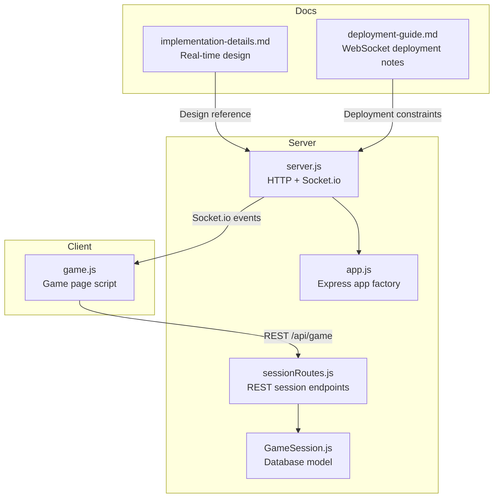
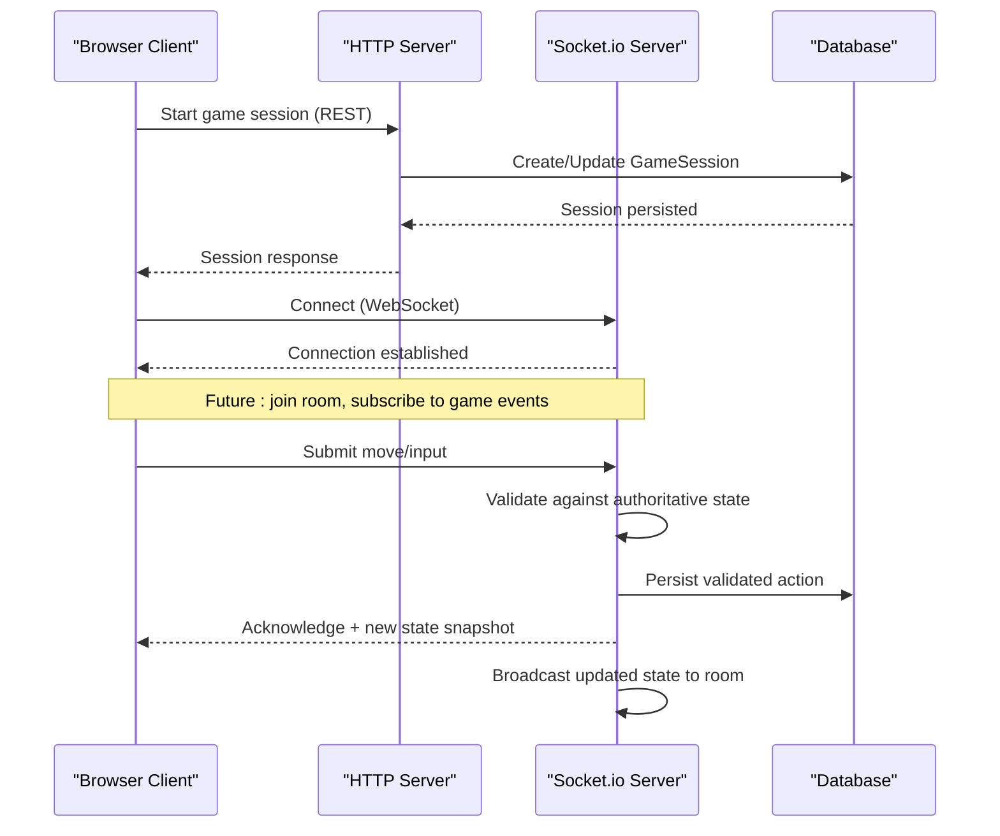
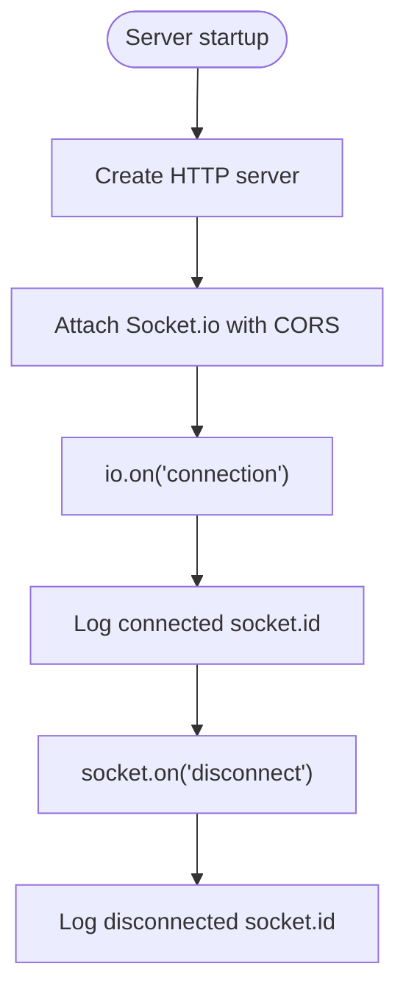
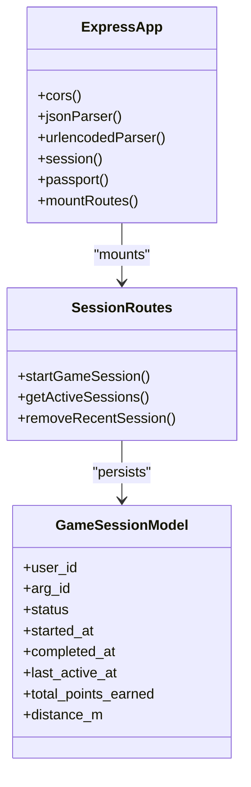
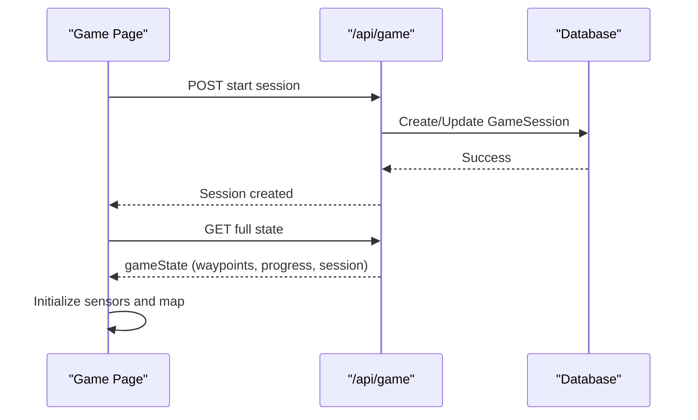
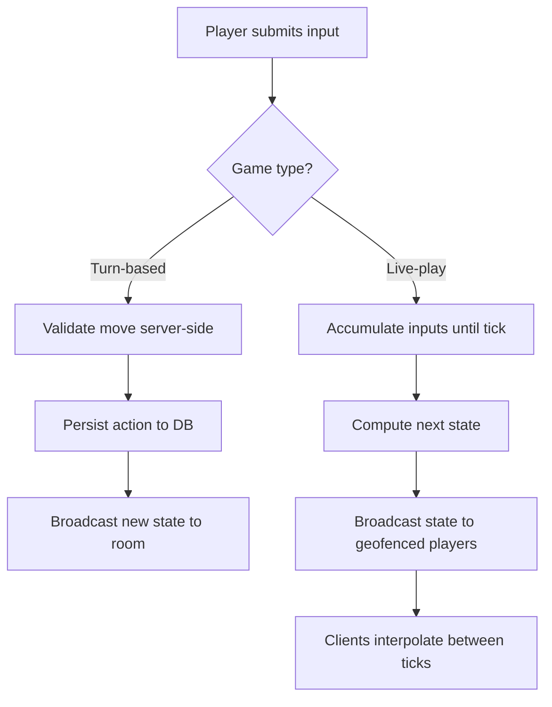
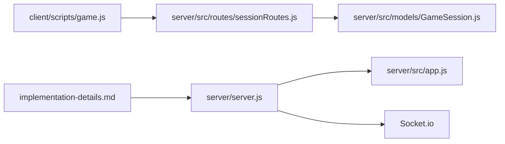

# Real-time Multiplayer & Collaboration

<cite>
**Referenced Files in This Document**
- [server.js](file://server/server.js)
- [app.js](file://server/src/app.js)
- [GameSession.js](file://server/src/models/GameSession.js)
- [sessionRoutes.js](file://server/src/routes/sessionRoutes.js)
- [game.js](file://client/scripts/game.js)
- [implementation-details.md](file://warg-docs/docs/2-architecture-and-design/implementation-details.md)
- [deployment-guide.md](file://warg-docs/docs/4-deployment/deployment-guide.md)
</cite>

## Table of Contents
1. [Introduction](#introduction)
2. [Project Structure](#project-structure)
3. [Core Components](#core-components)
4. [Architecture Overview](#architecture-overview)
5. [Detailed Component Analysis](#detailed-component-analysis)
6. [Dependency Analysis](#dependency-analysis)
7. [Performance Considerations](#performance-considerations)
8. [Troubleshooting Guide](#troubleshooting-guide)
9. [Conclusion](#conclusion)

## Introduction
This document explains how the WARG Platform supports real-time multiplayer and collaborative gameplay. It focuses on the Socket.io-based WebSocket layer, real-time state synchronization, live multiplayer interactions, event-driven updates, connection management, and scalability considerations for concurrent players. It also documents the current implementation boundaries: the server initializes a Socket.io server with basic connection handling, while the design documentation describes the intended real-time game models such as turn-based co-op puzzles, tick-based live-play, zone ownership broadcasting, and team fragment assembly.

## Project Structure
The real-time multiplayer capability is split across:
- A Node.js HTTP server that hosts Express routes and attaches a Socket.io server.
- An Express application factory that configures middleware, sessions, and REST API routes.
- Game session persistence via a database model.
- Client-side game logic that starts sessions, loads state, and renders interactive gameplay.
- Design documentation describing the intended real-time architecture for co-op and live-play modes.

**Diagram sources**
- [server.js:1-72](file://server/server.js#L1-L72)
- [app.js:1-132](file://server/src/app.js#L1-L132)
- [sessionRoutes.js:1-9](file://server/src/routes/sessionRoutes.js#L1-L9)
- [GameSession.js:1-19](file://server/src/models/GameSession.js#L1-L19)
- [game.js:143-164](file://client/scripts/game.js#L143-L164)
- [implementation-details.md:180-209](file://warg-docs/docs/2-architecture-and-design/implementation-details.md#L180-L209)
- [deployment-guide.md:173-177](file://warg-docs/docs/4-deployment/deployment-guide.md#L173-L177)

**Section sources**
- [server.js:1-72](file://server/server.js#L1-L72)
- [app.js:1-132](file://server/src/app.js#L1-L132)
- [sessionRoutes.js:1-9](file://server/src/routes/sessionRoutes.js#L1-L9)
- [GameSession.js:1-19](file://server/src/models/GameSession.js#L1-L19)
- [game.js:143-164](file://client/scripts/game.js#L143-L164)
- [implementation-details.md:180-209](file://warg-docs/docs/2-architecture-and-design/implementation-details.md#L180-L209)
- [deployment-guide.md:173-177](file://warg-docs/docs/4-deployment/deployment-guide.md#L173-L177)

## Core Components
- Socket.io server initialization and CORS configuration are defined in the server entry file. It creates an HTTP server, attaches Socket.io, and logs connection/disconnection events.
- The Express application factory configures CORS, sessions, authentication, and mounts REST routes under `/api/*`.
- The GameSession model persists per-user game session metadata (status, timestamps, points, distance).
- The client game script starts a game session via REST, fetches full game state, initializes sensors, and renders the map and minigames.
- Design documentation outlines the intended real-time patterns: turn-based co-op puzzles over WebSockets, tick-based live-play broadcasts, and team-based relay completion broadcasts.

**Section sources**
- [server.js:14-45](file://server/server.js#L14-L45)
- [app.js:26-128](file://server/src/app.js#L26-L128)
- [GameSession.js:4-16](file://server/src/models/GameSession.js#L4-L16)
- [game.js:143-164](file://client/scripts/game.js#L143-L164)
- [implementation-details.md:201-209](file://warg-docs/docs/2-architecture-and-design/implementation-details.md#L201-L209)

## Architecture Overview
At runtime:
- The HTTP server serves Express routes and exposes a Socket.io endpoint.
- Clients connect to the same host/port; Socket.io handles transport negotiation and fallbacks.
- Current server code logs connections and disconnections but does not yet implement room or channel logic.
- The design calls for rooms/channels per game instance, authoritative state validation, and broadcast of updates to relevant clients.

**Diagram sources**
- [server.js:14-45](file://server/server.js#L14-L45)
- [sessionRoutes.js:1-9](file://server/src/routes/sessionRoutes.js#L1-L9)
- [GameSession.js:4-16](file://server/src/models/GameSession.js#L4-L16)
- [implementation-details.md:201-209](file://warg-docs/docs/2-architecture-and-design/implementation-details.md#L201-L209)

## Detailed Component Analysis

### Socket.io Server Initialization and Connection Handling
- The server imports Socket.io and attaches it to the HTTP server.
- CORS is configured to allow specified origins from environment variables and local development.
- Basic `connection` and `disconnect` handlers log socket IDs.

**Diagram sources**
- [server.js:1-45](file://server/server.js#L1-L45)

**Section sources**
- [server.js:14-45](file://server/server.js#L14-L45)

### Express App Factory and REST Integration
- The Express app factory sets up CORS, JSON parsing, trust proxy, session storage (MySQL-backed in production), Passport auth, and mounts REST routes including `/api/game`, `/api/sessions`, etc.
- This separation allows tests to import just the request-handling layer without starting HTTP or Socket.io.

**Diagram sources**
- [app.js:26-128](file://server/src/app.js#L26-L128)
- [sessionRoutes.js:1-9](file://server/src/routes/sessionRoutes.js#L1-L9)
- [GameSession.js:4-16](file://server/src/models/GameSession.js#L4-L16)

**Section sources**
- [app.js:26-128](file://server/src/app.js#L26-L128)
- [sessionRoutes.js:1-9](file://server/src/routes/sessionRoutes.js#L1-L9)
- [GameSession.js:4-16](file://server/src/models/GameSession.js#L4-L16)

### Client Game Flow and State Loading
- The client initiates a game session via REST, then fetches the full game state.
- It initializes sensors, builds nodes from waypoints, and renders the map.
- It handles offline/online banners and reconnect events to refresh state.

**Diagram sources**
- [game.js:143-164](file://client/scripts/game.js#L143-L164)
- [game.js:257-267](file://client/scripts/game.js#L257-L267)
- [GameSession.js:4-16](file://server/src/models/GameSession.js#L4-L16)

**Section sources**
- [game.js:143-164](file://client/scripts/game.js#L143-L164)
- [game.js:257-267](file://client/scripts/game.js#L257-L267)

### Real-Time Design: Turn-Based Co-op Puzzles and Live-Play Broadcasting
- Turn-based games: server acts as authority, validates moves, persists actions, and uses WebSockets for concurrent play.
- Live-play games: inputs are transmitted and processed at a tick interval; at each tick, the server broadcasts updated state to geofenced players; clients interpolate between states for smooth rendering.
- Team-based Landmark Relay: server holds authoritative fragment collection state and broadcasts completion once all fragments are collected.

**Diagram sources**
- [implementation-details.md:201-209](file://warg-docs/docs/2-architecture-and-design/implementation-details.md#L201-L209)
- [implementation-details.md:183-193](file://warg-docs/docs/2-architecture-and-design/implementation-details.md#L183-L193)

**Section sources**
- [implementation-details.md:183-209](file://warg-docs/docs/2-architecture-and-design/implementation-details.md#L183-L209)

## Dependency Analysis
- The server depends on Socket.io for WebSocket communication and Express for REST APIs.
- The client depends on REST endpoints to start sessions and load state; future real-time features will depend on Socket.io channels/rooms.
- The GameSession model provides persistent context for active/completed sessions.

**Diagram sources**
- [game.js:143-164](file://client/scripts/game.js#L143-L164)
- [sessionRoutes.js:1-9](file://server/src/routes/sessionRoutes.js#L1-L9)
- [GameSession.js:4-16](file://server/src/models/GameSession.js#L4-L16)
- [server.js:1-45](file://server/server.js#L1-L45)
- [app.js:26-128](file://server/src/app.js#L26-L128)
- [implementation-details.md:201-209](file://warg-docs/docs/2-architecture-and-design/implementation-details.md#L201-L209)

**Section sources**
- [game.js:143-164](file://client/scripts/game.js#L143-L164)
- [sessionRoutes.js:1-9](file://server/src/routes/sessionRoutes.js#L1-L9)
- [GameSession.js:4-16](file://server/src/models/GameSession.js#L4-L16)
- [server.js:1-45](file://server/server.js#L1-L45)
- [app.js:26-128](file://server/src/app.js#L26-L128)
- [implementation-details.md:201-209](file://warg-docs/docs/2-architecture-and-design/implementation-details.md#L201-L209)

## Performance Considerations
- Tick-based live-play should use a balanced tick interval to avoid overwhelming the server and clients.
- Persist only meaningful state changes (e.g., ownership changes) rather than every tick to reduce database write load.
- Use rooms/channels to limit broadcasts to relevant players (e.g., geofenced zones or specific game instances).
- Ensure clients interpolate between states to maintain smooth UI updates even if ticks arrive irregularly.
- For deployments like Render’s free tier, note that services spin down after inactivity; upgrade plans may be required to keep WebSocket-dependent features stable.

[No sources needed since this section provides general guidance]

## Troubleshooting Guide
- Verify CORS configuration for both Express and Socket.io to ensure the client origin is allowed.
- Check server logs for connection and disconnection events to confirm WebSocket lifecycle.
- Confirm that the database connection succeeds at startup; the server attempts to authenticate and sync models before listening.
- If deploying on platforms with service spin-down, ensure appropriate plan upgrades to maintain WebSocket uptime.

**Section sources**
- [server.js:14-45](file://server/server.js#L14-L45)
- [server.js:47-72](file://server/server.js#L47-L72)
- [deployment-guide.md:173-177](file://warg-docs/docs/4-deployment/deployment-guide.md#L173-L177)

## Conclusion
The WARG Platform currently initializes a Socket.io server alongside Express, with basic connection logging. The design documentation defines a robust real-time architecture for turn-based co-op puzzles, tick-based live-play, and team collaboration, including authoritative state validation, persistence, and broadcast strategies. To fully enable real-time multiplayer, extend the server’s Socket.io handlers to manage rooms/channels, validate and persist player actions, and broadcast synchronized state to clients. On the client side, integrate WebSocket listeners to receive live updates and render interpolated states for smooth gameplay. Deployment considerations, especially around platform service spin-down, must be addressed to ensure reliable WebSocket connectivity during active sessions.