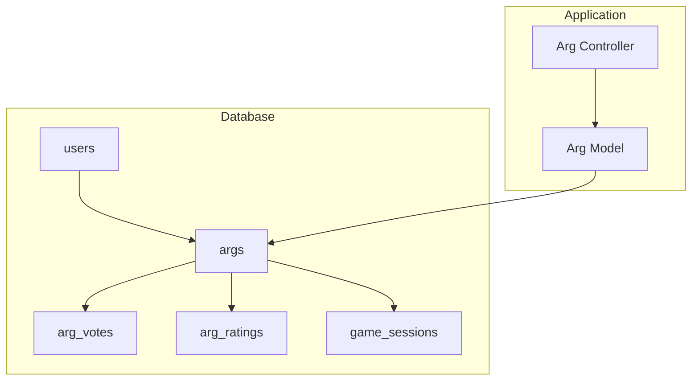
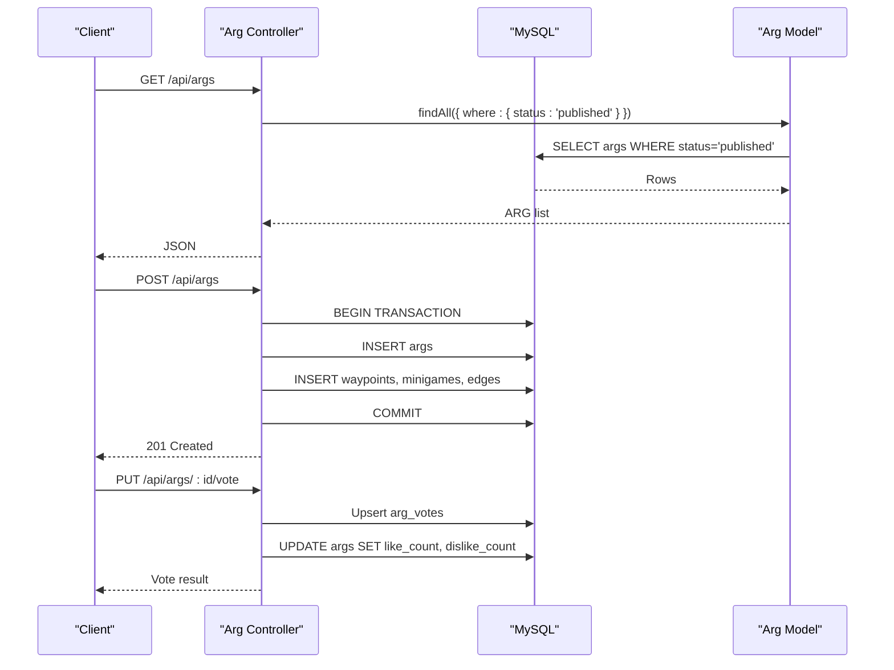
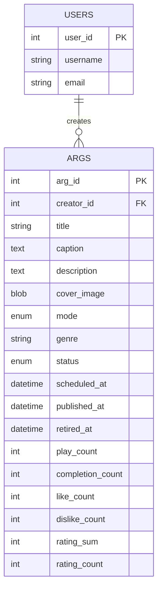
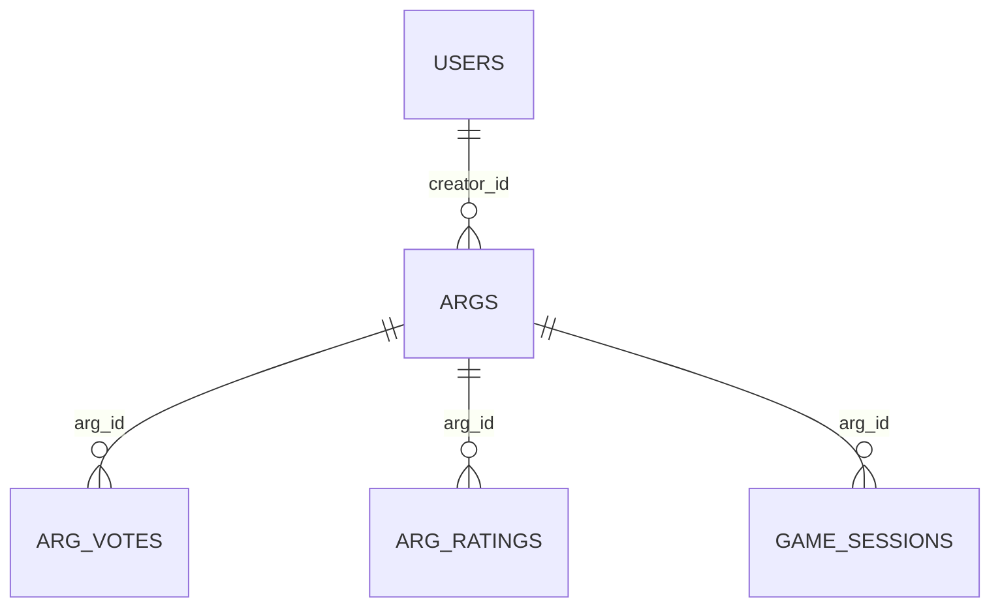
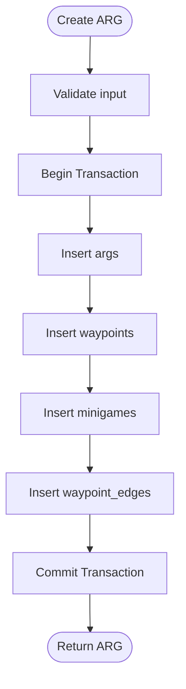
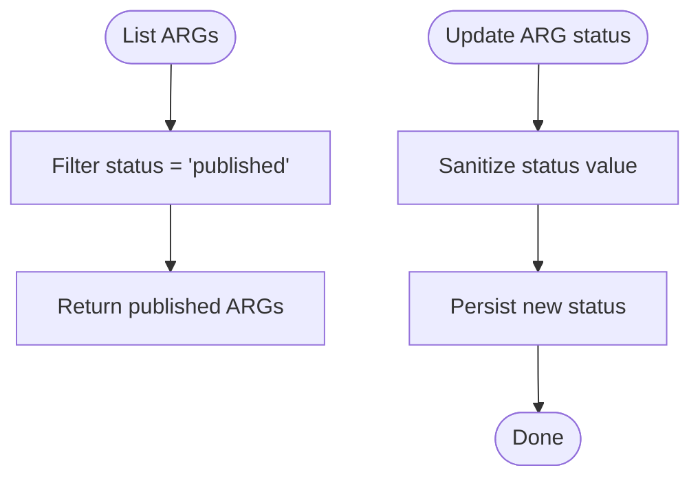
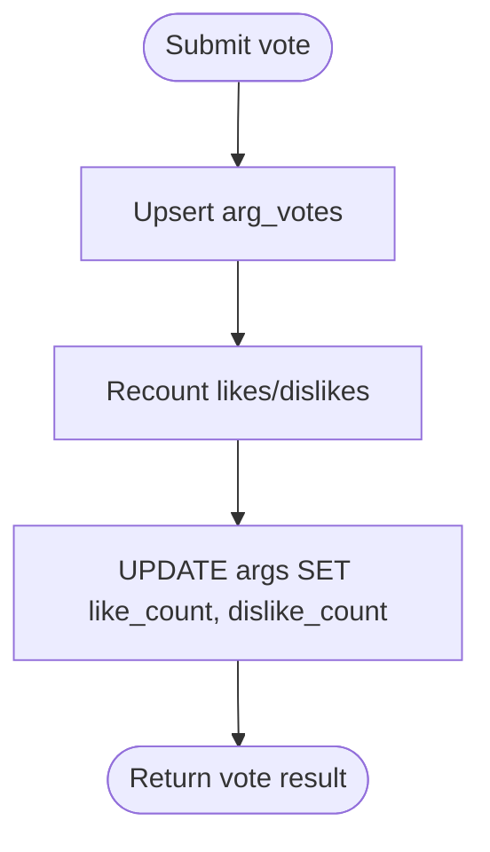
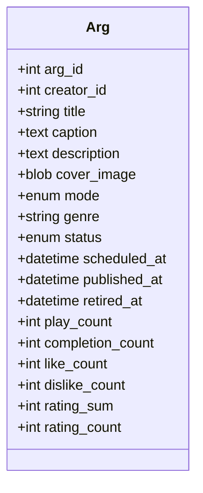
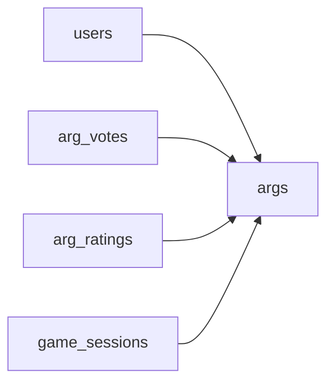

# ARG (Game) Entity

<cite>
**Referenced Files in This Document**
- [schema.sql](file://database/schema.sql)
- [Arg.js](file://server/src/models/Arg.js)
- [argController.js](file://server/src/controllers/argController.js)
- [args.test.js](file://server/tests/integration/args.test.js)
- [schema.md](file://warg-docs/docs/3-database/schema.md)
</cite>

## Table of Contents
1. [Introduction](#introduction)
2. [Project Structure](#project-structure)
3. [Core Components](#core-components)
4. [Architecture Overview](#architecture-overview)
5. [Detailed Component Analysis](#detailed-component-analysis)
6. [Dependency Analysis](#dependency-analysis)
7. [Performance Considerations](#performance-considerations)
8. [Troubleshooting Guide](#troubleshooting-guide)
9. [Conclusion](#conclusion)

## Introduction
This document provides comprehensive data model documentation for the ARG (Alternate Reality Game) entity, centered on the args table. It covers field definitions, data types, constraints, indexes, foreign key relationships to users, and business rules around creation, publishing workflow, and statistical tracking. The ARG is a first-class game object that encapsulates metadata, curation lifecycle, and denormalized aggregate statistics used for performance optimization.

## Project Structure
The ARG entity spans three primary layers:
- Database schema defining the args table and related tables
- Sequelize model mapping database fields to application entities
- Controller logic implementing creation, updates, voting, status transitions, and cover image handling

**Diagram sources**
- [schema.sql:114-151](file://database/schema.sql#L114-L151)
- [schema.sql:397-431](file://database/schema.sql#L397-L431)
- [schema.sql:287-304](file://database/schema.sql#L287-L304)
- [Arg.js:4-28](file://server/src/models/Arg.js#L4-L28)
- [argController.js:1-452](file://server/src/controllers/argController.js#L1-L452)

**Section sources**
- [schema.sql:114-151](file://database/schema.sql#L114-L151)
- [Arg.js:4-28](file://server/src/models/Arg.js#L4-L28)
- [argController.js:1-452](file://server/src/controllers/argController.js#L1-L452)

## Core Components
The ARG entity is represented by the args table and its associated models and controllers. Key aspects include:
- Metadata: title, caption, description, cover_image
- Mode classification: ENUM values 'solo', 'coop', 'pvp', 'live'
- Genre classification: free-form genre string
- Curation lifecycle: status ENUM ('unpublished', 'published', 'retired') with scheduling timestamps scheduled_at, published_at, retired_at
- Denormalized aggregate statistics: play_count, completion_count, like_count, dislike_count, rating_sum, rating_count

Field-level details:
- Primary key: arg_id (INT UNSIGNED, auto-increment)
- Creator reference: creator_id (INT UNSIGNED), FK to users.user_id with ON DELETE CASCADE
- Title: VARCHAR(256), NOT NULL
- Caption: TEXT, nullable
- Description: TEXT, nullable
- Cover image: MEDIUMBLOB, nullable
- Mode: ENUM('solo','coop','pvp','live'), default 'solo'
- Genre: VARCHAR(64), nullable
- Status: ENUM('unpublished','published','retired'), default 'unpublished'
- Scheduled at: DATETIME, nullable
- Published at: DATETIME, nullable
- Retired at: DATETIME, nullable
- Aggregates: INT UNSIGNED counters with default 0
- Timestamps: created_at, updated_at

Indexes:
- idx_arg_creator (creator_id)
- idx_arg_status (status)
- idx_arg_mode (mode)
- idx_arg_genre (genre)
- idx_arg_likes (like_count)
- idx_arg_pub_date (published_at)

Foreign keys:
- fk_arg_creator references users(user_id) ON DELETE CASCADE

Business rules:
- Creation defaults to unpublished unless explicitly set
- Public listing filters to published status
- Voting updates like_count and dislike_count aggregates
- Status updates are sanitized to allowed values

**Section sources**
- [schema.sql:114-151](file://database/schema.sql#L114-L151)
- [Arg.js:4-28](file://server/src/models/Arg.js#L4-L28)
- [argController.js:3-26](file://server/src/controllers/argController.js#L3-L26)
- [argController.js:328-362](file://server/src/controllers/argController.js#L328-L362)
- [argController.js:387-411](file://server/src/controllers/argController.js#L387-L411)

## Architecture Overview
The ARG entity participates in multiple workflows:
- Listing: only published ARGs are returned
- Detail: ARG detail includes creator, waypoints, edges, minigames, and user vote state
- Creation: transactional creation of ARG, waypoints, minigames, and edges
- Voting: like/dislike toggling updates denormalized counts
- Status management: sanitization ensures valid lifecycle states

**Diagram sources**
- [argController.js:3-26](file://server/src/controllers/argController.js#L3-L26)
- [argController.js:78-157](file://server/src/controllers/argController.js#L78-L157)
- [argController.js:328-362](file://server/src/controllers/argController.js#L328-L362)
- [schema.sql:114-151](file://database/schema.sql#L114-L151)

## Detailed Component Analysis

### Data Model Definition
The args table defines the core ARG entity with metadata, mode, genre, lifecycle, and aggregated statistics. The Sequelize model mirrors these fields and enforces defaults and types.

Key mappings:
- arg_id: INTEGER UNSIGNED PK
- creator_id: INTEGER UNSIGNED NOT NULL
- title: STRING(256) NOT NULL
- caption: TEXT
- description: TEXT
- cover_image: BLOB('medium')
- mode: ENUM('solo','coop','pvp','live') DEFAULT 'solo'
- genre: STRING(64)
- status: ENUM('unpublished','published','retired') DEFAULT 'unpublished'
- scheduled_at: DATE
- published_at: DATE
- retired_at: DATE
- play_count: INTEGER UNSIGNED DEFAULT 0
- completion_count: INTEGER UNSIGNED DEFAULT 0
- like_count: INTEGER UNSIGNED DEFAULT 0
- dislike_count: INTEGER UNSIGNED DEFAULT 0
- rating_sum: INTEGER UNSIGNED DEFAULT 0
- rating_count: INTEGER UNSIGNED DEFAULT 0

Constraints and indexes:
- PRIMARY KEY (arg_id)
- INDEX idx_arg_creator (creator_id)
- INDEX idx_arg_status (status)
- INDEX idx_arg_mode (mode)
- INDEX idx_arg_genre (genre)
- INDEX idx_arg_likes (like_count)
- INDEX idx_arg_pub_date (published_at)
- FOREIGN KEY fk_arg_creator REFERENCES users(user_id) ON DELETE CASCADE

**Diagram sources**
- [schema.sql:15-44](file://database/schema.sql#L15-L44)
- [schema.sql:114-151](file://database/schema.sql#L114-L151)

**Section sources**
- [schema.sql:114-151](file://database/schema.sql#L114-L151)
- [Arg.js:4-28](file://server/src/models/Arg.js#L4-L28)

### Field Definitions and Constraints
- arg_id: Auto-incrementing primary key; unique per ARG
- creator_id: References users.user_id; deletion cascades to ARGs
- title: Required; up to 256 characters
- caption: Optional short description
- description: Optional long-form narrative
- cover_image: Optional binary image stored inline
- mode: One of 'solo', 'coop', 'pvp', 'live'; defaults to 'solo'
- genre: Free-form classification up to 64 characters
- status: Lifecycle state; one of 'unpublished', 'published', 'retired'; defaults to 'unpublished'
- scheduled_at: Optional future publish time
- published_at: Timestamp when ARG became public
- retired_at: Timestamp when ARG was removed from active catalog
- play_count: Number of sessions started
- completion_count: Number of completed sessions
- like_count: Count of positive votes
- dislike_count: Count of negative votes
- rating_sum: Sum of star ratings
- rating_count: Number of star ratings

Index rationale:
- idx_arg_creator: Fast lookup by author
- idx_arg_status: Filtering by lifecycle state
- idx_arg_mode: Filtering by gameplay mode
- idx_arg_genre: Filtering by genre
- idx_arg_likes: Sorting or filtering by popularity
- idx_arg_pub_date: Time-based queries for newly published content

**Section sources**
- [schema.sql:114-151](file://database/schema.sql#L114-L151)

### Foreign Key Relationships
- Users to ARGs: One-to-many via users.user_id -> args.creator_id
- ARGs to Votes: One-to-many via args.arg_id -> arg_votes.arg_id
- ARGs to Ratings: One-to-many via args.arg_id -> arg_ratings.arg_id
- ARGs to Sessions: One-to-many via args.arg_id -> game_sessions.arg_id

**Diagram sources**
- [schema.sql:114-151](file://database/schema.sql#L114-L151)
- [schema.sql:397-431](file://database/schema.sql#L397-L431)
- [schema.sql:287-304](file://database/schema.sql#L287-L304)

**Section sources**
- [schema.sql:114-151](file://database/schema.sql#L114-L151)
- [schema.sql:397-431](file://database/schema.sql#L397-L431)
- [schema.sql:287-304](file://database/schema.sql#L287-L304)

### Business Rules and Workflows

#### ARG Creation
- Creation is transactional, ensuring ARG, waypoints, minigames, and edges are created atomically
- Default title and description are applied if not provided
- Status is sanitized to allowed values before persisting

**Diagram sources**
- [argController.js:78-157](file://server/src/controllers/argController.js#L78-L157)

**Section sources**
- [argController.js:78-157](file://server/src/controllers/argController.js#L78-L157)

#### Publishing Workflow
- Public listing returns only ARGs with status 'published'
- Tests assert unpublished ARGs are excluded from listings
- Status updates are sanitized to ensure valid lifecycle states

**Diagram sources**
- [argController.js:3-26](file://server/src/controllers/argController.js#L3-L26)
- [argController.js:387-411](file://server/src/controllers/argController.js#L387-L411)
- [args.test.js:17-30](file://server/tests/integration/args.test.js#L17-L30)

**Section sources**
- [argController.js:3-26](file://server/src/controllers/argController.js#L3-L26)
- [argController.js:387-411](file://server/src/controllers/argController.js#L387-L411)
- [args.test.js:17-30](file://server/tests/integration/args.test.js#L17-L30)

#### Statistical Tracking
- Like/dislike votes update denormalized like_count and dislike_count
- Rating sum and count support average rating computation via a view
- Play and completion counts are maintained alongside session events

**Diagram sources**
- [argController.js:328-362](file://server/src/controllers/argController.js#L328-L362)
- [schema.sql:397-431](file://database/schema.sql#L397-L431)

**Section sources**
- [argController.js:328-362](file://server/src/controllers/argController.js#L328-L362)
- [schema.sql:397-431](file://database/schema.sql#L397-L431)

### Class Diagram (Sequelize Model)

**Diagram sources**
- [Arg.js:4-28](file://server/src/models/Arg.js#L4-L28)

**Section sources**
- [Arg.js:4-28](file://server/src/models/Arg.js#L4-L28)

## Dependency Analysis
ARG depends on:
- users: ownership and creator identity
- arg_votes: like/dislike aggregation
- arg_ratings: star ratings and computed averages
- game_sessions: play/completion metrics

**Diagram sources**
- [schema.sql:114-151](file://database/schema.sql#L114-L151)
- [schema.sql:397-431](file://database/schema.sql#L397-L431)
- [schema.sql:287-304](file://database/schema.sql#L287-L304)

**Section sources**
- [schema.sql:114-151](file://database/schema.sql#L114-L151)
- [schema.sql:397-431](file://database/schema.sql#L397-L431)
- [schema.sql:287-304](file://database/schema.sql#L287-L304)

## Performance Considerations
Denormalized aggregate statistics reduce read-time joins and aggregations:
- like_count and dislike_count avoid counting votes on every request
- rating_sum and rating_count enable fast average calculation
- play_count and completion_count reflect session outcomes without scanning game_sessions

Optimization notes:
- Use idx_arg_likes for sorting by popularity
- Use idx_arg_pub_date for time-based discovery
- Keep aggregate updates atomic with vote operations to prevent inconsistencies

[No sources needed since this section provides general guidance]

## Troubleshooting Guide
Common issues and resolutions:
- ARG not found: Ensure arg_id exists and is accessible; controller returns 404 when missing
- Unauthorized status update: Verify creator_id matches authenticated user; controller enforces authorization
- Invalid status value: Status is sanitized to allowed values; unexpected inputs default to 'unpublished'
- Missing cover image: Cover upload requires a file; controller validates presence and ownership

Operational checks:
- Verify only published ARGs appear in listings
- Confirm vote updates reflect accurate like/dislike counts
- Ensure lifecycle timestamps are set appropriately during publishing and retirement

**Section sources**
- [argController.js:28-54](file://server/src/controllers/argController.js#L28-L54)
- [argController.js:387-411](file://server/src/controllers/argController.js#L387-L411)
- [argController.js:413-451](file://server/src/controllers/argController.js#L413-L451)

## Conclusion
The ARG entity is a robust, well-indexed data model supporting rich metadata, flexible gameplay modes, clear curation lifecycle, and high-performance aggregate statistics. Its relationships to users, votes, ratings, and sessions provide a solid foundation for gameplay analytics and community features. The controller logic enforces business rules such as publication filtering, status sanitization, and atomic creation workflows, ensuring consistency and reliability across the platform.

[No sources needed since this section summarizes without analyzing specific files]