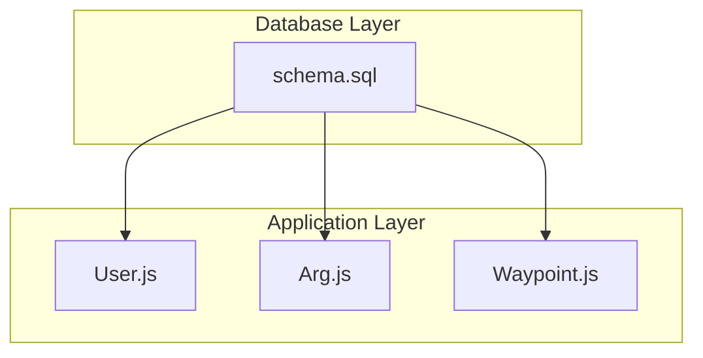
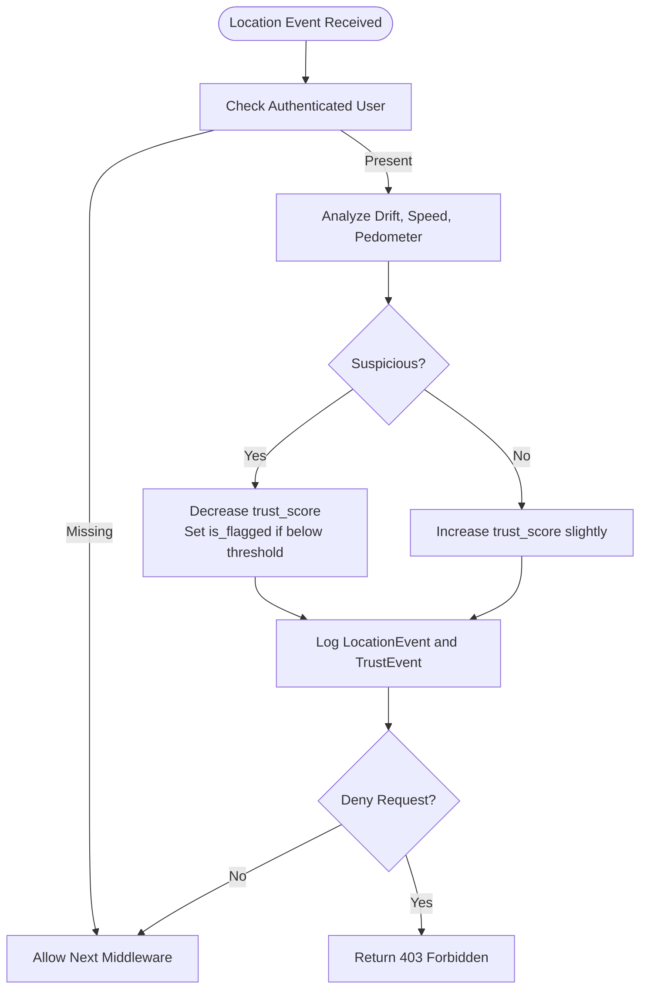
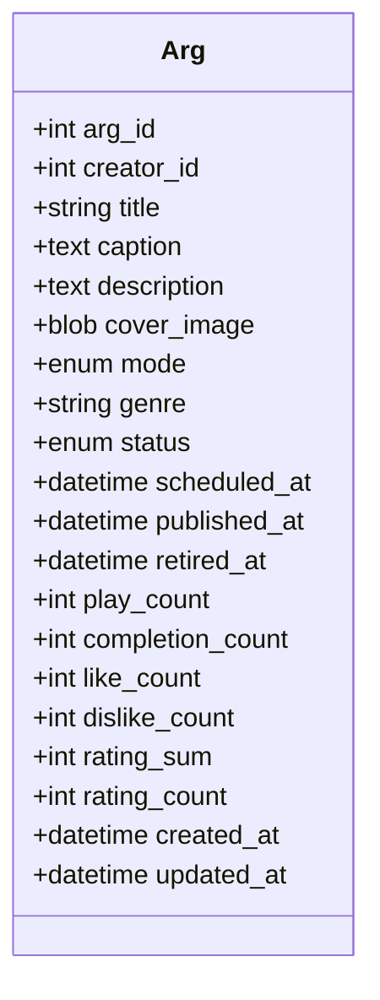
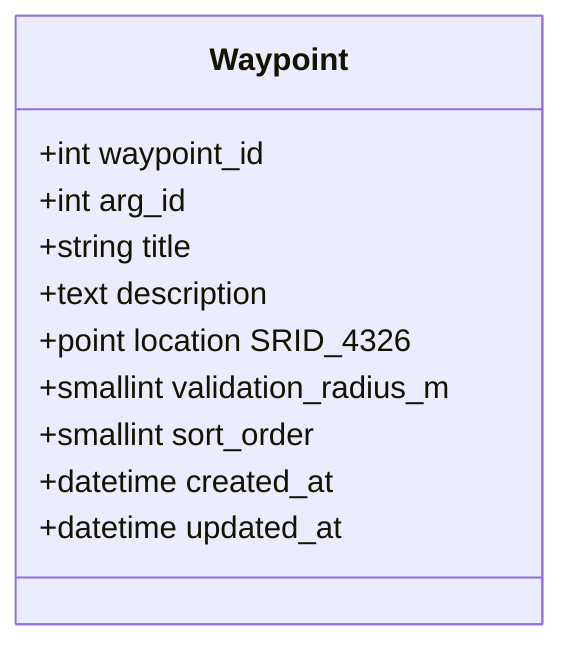
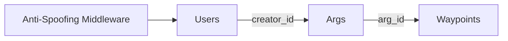

# Core Entities

<cite>
**Referenced Files in This Document**
- [schema.sql](file://database/schema.sql)
- [User.js](file://server/src/models/User.js)
- [Arg.js](file://server/src/models/Arg.js)
- [Waypoint.js](file://server/src/models/Waypoint.js)
- [antiSpoofing.js](file://server/src/middleware/antiSpoofing.js)
</cite>

## Table of Contents
1. [Introduction](#introduction)
2. [Project Structure](#project-structure)
3. [Core Components](#core-components)
4. [Architecture Overview](#architecture-overview)
5. [Detailed Component Analysis](#detailed-component-analysis)
6. [Dependency Analysis](#dependency-analysis)
7. [Performance Considerations](#performance-considerations)
8. [Troubleshooting Guide](#troubleshooting-guide)
9. [Conclusion](#conclusion)

## Introduction
This document describes the core data model for the WARG Platform, focusing on three primary entities: Users, Args (games), and Waypoints. It explains field definitions, data types, constraints, indexes, and business rules, including authentication fields, role-based access control, trust scoring and anti-spoofing for users; game metadata, lifecycle states, mode types, and denormalized statistics for args; and geospatial POINT geometry with SRID 4326, validation radius configuration, and relationships to ARGs for waypoints.

## Project Structure
The core entities are defined at two layers:
- Database schema layer: MySQL DDL in a single schema file that defines tables, constraints, indexes, spatial columns, and views.
- Application model layer: Sequelize model files that mirror the database structure and provide runtime type information.



**Diagram sources**
- [schema.sql:10-44](file://database/schema.sql#L10-L44)
- [schema.sql:110-151](file://database/schema.sql#L110-L151)
- [schema.sql:154-179](file://database/schema.sql#L154-L179)
- [User.js:4-25](file://server/src/models/User.js#L4-L25)
- [Arg.js:4-28](file://server/src/models/Arg.js#L4-L28)
- [Waypoint.js:4-17](file://server/src/models/Waypoint.js#L4-L17)

**Section sources**
- [schema.sql:1-44](file://database/schema.sql#L1-L44)
- [schema.sql:110-151](file://database/schema.sql#L110-L151)
- [schema.sql:154-179](file://database/schema.sql#L154-L179)
- [User.js:1-28](file://server/src/models/User.js#L1-L28)
- [Arg.js:1-31](file://server/src/models/Arg.js#L1-L31)
- [Waypoint.js:1-20](file://server/src/models/Waypoint.js#L1-L20)

## Core Components
This section summarizes the three core entities and their responsibilities:
- Users: Identity, authentication linkage, roles, progression metrics, trust profile, and suspension state.
- Args: Game metadata, curation lifecycle, gameplay modes, and aggregate statistics.
- Waypoints: Geospatial nodes within an ARG, with proximity validation radius and ordering.

Key cross-cutting concerns:
- Role-based access control is enforced via user roles.
- Trust scoring and anti-spoofing influence user flags and session behavior.
- Waypoints are tied to ARGs and support spatial queries using WGS 84 coordinates.

**Section sources**
- [schema.sql:10-44](file://database/schema.sql#L10-L44)
- [schema.sql:110-151](file://database/schema.sql#L110-L151)
- [schema.sql:154-179](file://database/schema.sql#L154-L179)
- [User.js:4-25](file://server/src/models/User.js#L4-L25)
- [Arg.js:4-28](file://server/src/models/Arg.js#L4-L28)
- [Waypoint.js:4-17](file://server/src/models/Waypoint.js#L4-L17)

## Architecture Overview
The data architecture centers around three core tables with clear relationships:
- Users are referenced by Args as creators.
- Waypoints belong to Args and include geospatial location data.
- Anti-spoofing middleware interacts with user trust profiles and location events.

```mermaid
erDiagram
USERS {
int user_id PK
string google_uid UK
string username UK
string email UK
enum role
decimal trust_score
tinyint is_flagged
tinyint is_suspended
datetime suspended_until
}
ARGS {
int arg_id PK
int creator_id FK
enum mode
enum status
int play_count
int completion_count
int like_count
int dislike_count
int rating_sum
int rating_count
}
WAYPOINTS {
int waypoint_id PK
int arg_id FK
point location SRID_4326
smallint validation_radius_m
smallint sort_order
}
USERS ||--o{ ARGS : "creator_id"
ARGS ||--o{ WAYPOINTS : "arg_id"
```

**Diagram sources**
- [schema.sql:10-44](file://database/schema.sql#L10-L44)
- [schema.sql:110-151](file://database/schema.sql#L110-L151)
- [schema.sql:154-179](file://database/schema.sql#L154-L179)

## Detailed Component Analysis

### Users Entity
Purpose:
- Stores authenticated identities and platform roles.
- Tracks meta-progression metrics and trust profile.
- Supports anti-spoofing through trust scoring and flagging.

Field definitions and types:
- Primary key: user_id (integer, auto-increment).
- Authentication:
  - google_uid: unique identifier from Google OAuth.
  - username: unique display name.
  - email: unique contact address.
  - password_hash: optional local auth credential.
  - auth_provider: provider type (local or google).
- Profile:
  - avatar: optional binary image.
- Access control:
  - role: player, creator, admin.
- Session:
  - session_token: single-device session token.
- Progression:
  - total_points: cumulative points.
  - distance_walked_m: meters walked.
- Trust and moderation:
  - trust_score: numeric trust score.
  - is_flagged: suspicious activity flag.
  - is_suspended: account suspension flag.
  - suspended_until: suspension expiry timestamp.
- Timestamps:
  - created_at, updated_at.

Constraints and indexes:
- Unique keys: google_uid, username, email.
- Indexes: role, trust_score.
- Foreign keys: none directly on this table; referenced by other entities.

Business rules:
- Default role is player.
- Trust score starts at a high baseline and can be adjusted by anti-spoofing logic.
- Flagging occurs when trust score falls below a threshold.
- Suspension can be applied administratively with an optional expiry.

Anti-spoofing integration:
- The anti-spoofing middleware updates trust_score and is_flagged based on location drift, speed, and pedometer mismatch checks.
- Suspicious interactions may be denied and logged as trust events.



**Diagram sources**
- [antiSpoofing.js:27-168](file://server/src/middleware/antiSpoofing.js#L27-L168)

**Section sources**
- [schema.sql:10-44](file://database/schema.sql#L10-L44)
- [User.js:4-25](file://server/src/models/User.js#L4-L25)
- [antiSpoofing.js:27-168](file://server/src/middleware/antiSpoofing.js#L27-L168)

### Args Entity
Purpose:
- Represents a WARG game with metadata, lifecycle management, and aggregated statistics.

Field definitions and types:
- Primary key: arg_id (integer, auto-increment).
- Creator:
  - creator_id: references users.user_id.
- Metadata:
  - title: required game title.
  - caption: short description.
  - description: long-form description.
  - cover_image: optional binary image.
  - genre: optional category label.
- Gameplay:
  - mode: solo, coop, pvp, live.
- Lifecycle:
  - status: unpublished, published, retired.
  - scheduled_at: planned publish time.
  - published_at: actual publish time.
  - retired_at: retirement time.
- Aggregates:
  - play_count, completion_count, like_count, dislike_count, rating_sum, rating_count.
- Timestamps:
  - created_at, updated_at.

Constraints and indexes:
- Foreign key: creator_id references users.user_id with cascade delete.
- Indexes: creator_id, status, mode, genre, like_count, published_at.

Business rules:
- Default mode is solo.
- Default status is unpublished.
- Aggregate counters are maintained by application logic or triggers.
- Published games are typically exposed to players; retired games are archived.



**Diagram sources**
- [Arg.js:4-28](file://server/src/models/Arg.js#L4-L28)
- [schema.sql:110-151](file://database/schema.sql#L110-L151)

**Section sources**
- [schema.sql:110-151](file://database/schema.sql#L110-L151)
- [Arg.js:4-28](file://server/src/models/Arg.js#L4-L28)

### Waypoints Entity
Purpose:
- Defines geospatial nodes within an ARG, supporting proximity validation and ordered traversal.

Field definitions and types:
- Primary key: waypoint_id (integer, auto-increment).
- Relationship:
  - arg_id: references args.arg_id with cascade delete.
- Content:
  - title: required waypoint title.
  - description: optional details.
- Geospatial:
  - location: POINT geometry with SRID 4326 (WGS 84).
- Validation:
  - validation_radius_m: proximity radius in meters (default 30).
- Ordering:
  - sort_order: sequence index for traversal.
- Timestamps:
  - created_at, updated_at.

Constraints and indexes:
- Foreign key: arg_id references args.arg_id with cascade delete.
- Indexes: arg_id, spatial index on location.

Business rules:
- Each waypoint belongs to exactly one ARG.
- Proximity checks use the configured validation radius.
- Spatial queries rely on WGS 84 coordinates.



**Diagram sources**
- [Waypoint.js:4-17](file://server/src/models/Waypoint.js#L4-L17)
- [schema.sql:154-179](file://database/schema.sql#L154-L179)

**Section sources**
- [schema.sql:154-179](file://database/schema.sql#L154-L179)
- [Waypoint.js:4-17](file://server/src/models/Waypoint.js#L4-L17)

## Dependency Analysis
Relationships among core entities:
- Args depend on Users via creator_id.
- Waypoints depend on Args via arg_id.
- Anti-spoofing affects Users through trust_score and is_flagged updates.



**Diagram sources**
- [schema.sql:10-44](file://database/schema.sql#L10-L44)
- [schema.sql:110-151](file://database/schema.sql#L110-L151)
- [schema.sql:154-179](file://database/schema.sql#L154-L179)
- [antiSpoofing.js:27-168](file://server/src/middleware/antiSpoofing.js#L27-L168)

**Section sources**
- [schema.sql:10-44](file://database/schema.sql#L10-L44)
- [schema.sql:110-151](file://database/schema.sql#L110-L151)
- [schema.sql:154-179](file://database/schema.sql#L154-L179)
- [antiSpoofing.js:27-168](file://server/src/middleware/antiSpoofing.js#L27-L168)

## Performance Considerations
- Users:
  - Indexes on role and trust_score optimize filtering and ranking.
  - Avoid frequent full-table scans by leveraging these indexes.
- Args:
  - Indexes on status, mode, genre, like_count, and published_at support catalog queries and sorting.
  - Denormalized aggregates reduce join costs for read-heavy dashboards.
- Waypoints:
  - Spatial index on location enables efficient proximity searches.
  - Keep validation_radius_m reasonable to balance accuracy and performance.

[No sources needed since this section provides general guidance]

## Troubleshooting Guide
Common issues and resolutions:
- Users flagged due to low trust score:
  - Review anti-spoofing logs and context flags.
  - Adjust trust_score thresholds or investigate device spoofing.
- Args not appearing in catalogs:
  - Verify status is published.
  - Check indexes and filters used by listing endpoints.
- Waypoint proximity checks failing:
  - Ensure location uses SRID 4326 and correct coordinate order.
  - Validate validation_radius_m settings relative to GPS accuracy.

Operational hints:
- Anti-spoofing middleware returns 403 when suspicious activity is detected; inspect flags_json for reasons.
- Admin controllers expose trust_score and is_flagged for moderation workflows.

**Section sources**
- [antiSpoofing.js:27-168](file://server/src/middleware/antiSpoofing.js#L27-L168)
- [schema.sql:10-44](file://database/schema.sql#L10-L44)
- [schema.sql:110-151](file://database/schema.sql#L110-L151)
- [schema.sql:154-179](file://database/schema.sql#L154-L179)

## Conclusion
The WARG Platform’s core data model centers on Users, Args, and Waypoints, providing robust identity and access control, comprehensive game metadata and lifecycle management, and precise geospatial capabilities. Trust scoring and anti-spoofing integrate tightly with user profiles to maintain integrity, while denormalized statistics and spatial indexes support efficient reads and real-time gameplay experiences.

[No sources needed since this section summarizes without analyzing specific files]