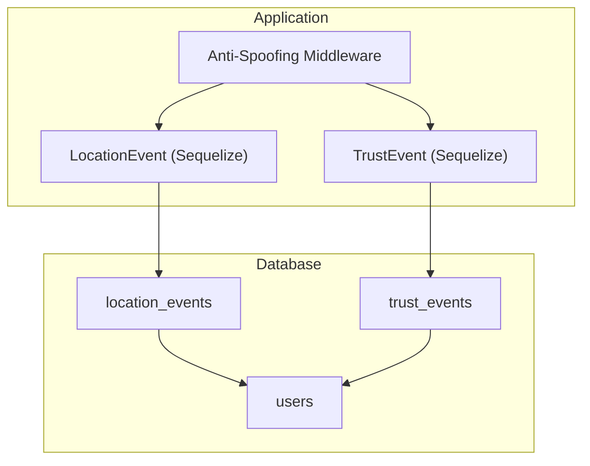
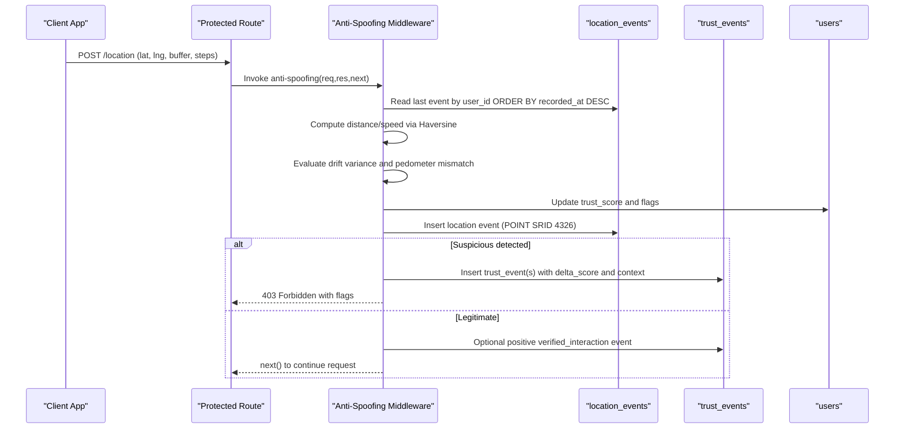
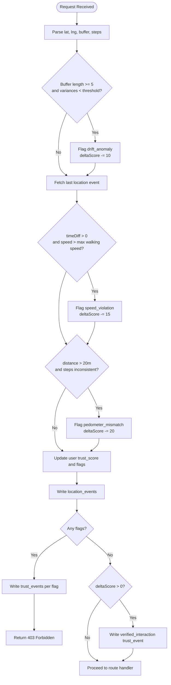
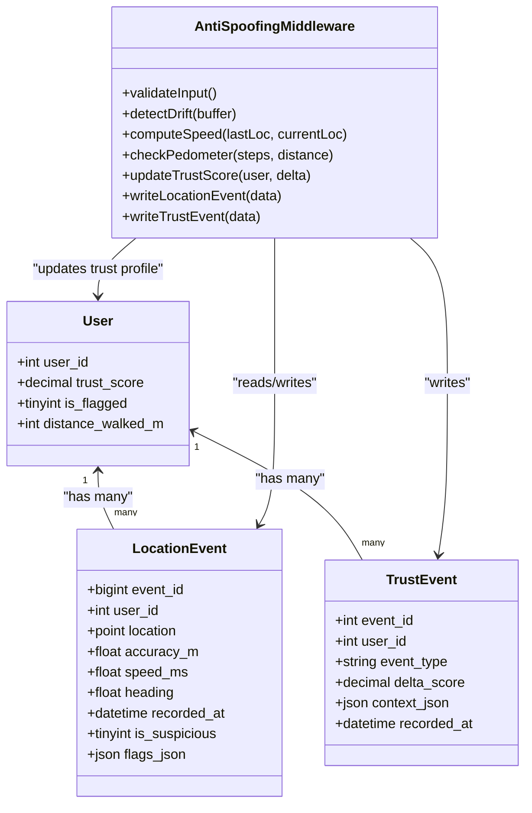

# Location Tracking & Anti-Spoofing Entities

<cite>
**Referenced Files in This Document**   
- [schema.sql](file://database/schema.sql)
- [LocationEvent.js](file://server/src/models/LocationEvent.js)
- [TrustEvent.js](file://server/src/models/TrustEvent.js)
- [antiSpoofing.js](file://server/src/middleware/antiSpoofing.js)
</cite>

## Table of Contents
1. [Introduction](#introduction)
2. [Project Structure](#project-structure)
3. [Core Components](#core-components)
4. [Architecture Overview](#architecture-overview)
5. [Detailed Component Analysis](#detailed-component-analysis)
6. [Dependency Analysis](#dependency-analysis)
7. [Performance Considerations](#performance-considerations)
8. [Troubleshooting Guide](#troubleshooting-guide)
9. [Conclusion](#conclusion)

## Introduction
This document provides comprehensive data model documentation for the location tracking and anti-spoofing subsystem. It focuses on two core tables:
- location_events: high-volume GPS breadcrumb storage with spatial geometry, device precision, movement analysis fields, direction tracking, suspicious flagging, and structured flags.
- trust_events: behavioral anomaly logging that records event types, trust score adjustments, and detailed context.

It also explains spatial indexing for location queries, time-series optimization considerations, and how the anti-spoofing middleware integrates with these entities to validate locations and adjust user trust profiles.

## Project Structure
The relevant pieces for this domain are:
- Database schema defining the tables, indexes, and constraints.
- Sequelize models mapping application code to database tables.
- Anti-spoofing middleware implementing validation logic and updating both location events and trust events.

**Diagram sources**
- [schema.sql:354-390](file://database/schema.sql#L354-L390)
- [LocationEvent.js:4-18](file://server/src/models/LocationEvent.js#L4-L18)
- [TrustEvent.js:4-14](file://server/src/models/TrustEvent.js#L4-L14)
- [antiSpoofing.js:1-168](file://server/src/middleware/antiSpoofing.js#L1-L168)

**Section sources**
- [schema.sql:354-390](file://database/schema.sql#L354-L390)
- [LocationEvent.js:4-18](file://server/src/models/LocationEvent.js#L4-L18)
- [TrustEvent.js:4-14](file://server/src/models/TrustEvent.js#L4-L14)
- [antiSpoofing.js:1-168](file://server/src/middleware/antiSpoofing.js#L1-L168)

## Core Components
- location_events stores raw GPS breadcrumbs per user with a POINT geometry using SRID 4326 (WGS 84), accuracy_m for device precision, speed_ms for movement analysis, heading for direction tracking, recorded_at timestamps, is_suspicious flag, and flags_json for structured reasons.
- trust_events logs behavioral anomalies with event_type strings, delta_score adjustments to user trust scores, context_json for detailed violation information, and recorded_at timestamps.

Key responsibilities:
- Capture high-frequency location telemetry efficiently.
- Flag suspicious entries at ingestion time.
- Maintain an audit trail of trust score changes and their causes.

**Section sources**
- [schema.sql:354-390](file://database/schema.sql#L354-L390)
- [LocationEvent.js:4-18](file://server/src/models/LocationEvent.js#L4-L18)
- [TrustEvent.js:4-14](file://server/src/models/TrustEvent.js#L4-L14)

## Architecture Overview
The anti-spoofing middleware validates incoming location data, compares it against the last known location, computes distances and speeds, evaluates drift and pedometer consistency, updates the user’s trust profile, writes a location event, and logs trust events when anomalies occur.

**Diagram sources**
- [antiSpoofing.js:27-159](file://server/src/middleware/antiSpoofing.js#L27-L159)
- [schema.sql:354-390](file://database/schema.sql#L354-L390)

## Detailed Component Analysis

### Data Model: location_events
Purpose:
- Store high-volume GPS breadcrumbs with geospatial and motion metadata.
- Support spatial queries and time-based analytics.

Fields:
- event_id: primary key, auto-incremented BIGINT UNSIGNED.
- user_id: foreign key to users; indexes support per-user queries.
- location: POINT geometry with SRID 4326 (WGS 84).
- accuracy_m: optional FLOAT representing device-reported accuracy in meters.
- speed_ms: optional FLOAT for movement analysis.
- heading: optional FLOAT in degrees (0–360) for direction tracking.
- recorded_at: DATETIME(3) timestamp with millisecond precision.
- is_suspicious: TINYINT(1) default 0; marks if the entry was flagged during ingestion.
- flags_json: JSON object storing structured reasons (e.g., reason, computed_speed_ms).

Indexes:
- Primary key on event_id.
- Index on user_id for per-user retrieval.
- Index on recorded_at for time-range queries.
- SPATIAL INDEX on location for proximity and range queries.

Constraints:
- Foreign key constraint to users with ON DELETE CASCADE.

Complexity notes:
- High write throughput expected; consider partitioning by time ranges for archival and query performance.
- Spatial index enables efficient nearest-neighbor and within-radius queries.

Spatial query patterns:
- Find recent points within a radius around a waypoint or current position using ST_DWithin or ST_Contains with buffered geometries.
- Retrieve trajectory segments by user_id and time window combined with spatial filters.

Time-series optimization:
- Use recorded_at indexes for sliding windows.
- Partition by RANGE on recorded_at for large datasets.
- Aggregate historical metrics (speed, heading variance) over time windows.

Business rules:
- Mark is_suspicious true when anti-spoofing detects anomalies.
- Populate flags_json with machine-readable reasons for downstream review.

**Section sources**
- [schema.sql:354-372](file://database/schema.sql#L354-L372)
- [LocationEvent.js:4-18](file://server/src/models/LocationEvent.js#L4-L18)

### Data Model: trust_events
Purpose:
- Log behavioral anomalies and trust score adjustments for auditing and analytics.

Fields:
- event_id: primary key, auto-incremented INT UNSIGNED.
- user_id: foreign key to users; indexes support per-user retrieval.
- event_type: VARCHAR(64); documented values include 'speed_violation', 'impossible_jump', 'drift_anomaly', 'manual_flag'.
- delta_score: DECIMAL(5,2); negative values indicate penalties applied to trust score.
- context_json: JSON object containing detailed violation information.
- recorded_at: DATETIME timestamp.

Indexes:
- Primary key on event_id.
- Index on user_id for per-user history.
- Index on recorded_at for time-based reporting.

Constraints:
- Foreign key constraint to users with ON DELETE CASCADE.

Business rules:
- Each anomaly generates one or more trust_events with corresponding delta_score.
- Positive interactions may be logged as 'verified_interaction' with positive delta_score.

**Section sources**
- [schema.sql:376-390](file://database/schema.sql#L376-L390)
- [TrustEvent.js:4-14](file://server/src/models/TrustEvent.js#L4-L14)

### Anti-Spoofing Algorithm Integration
Responsibilities:
- Validate input presence and parse parameters.
- Detect drift anomalies using variance thresholds on coordinate buffers.
- Compare current location with the last recorded location to compute speed and detect impossible jumps.
- Optionally cross-check pedometer steps against distance traveled.
- Update user trust_score and is_flagged based on cumulative deltas.
- Write location_events with is_suspicious and flags_json populated.
- Write trust_events for each detected anomaly and optionally for positive verification.
- Block further processing when suspicious activity is detected.

Algorithm flow:

**Diagram sources**
- [antiSpoofing.js:27-159](file://server/src/middleware/antiSpoofing.js#L27-L159)

Implementation details:
- Distance calculation uses Haversine formula to compute meters between coordinates.
- Drift detection uses variance thresholds on latitude and longitude arrays.
- Speed check compares computed speed against a maximum walking speed threshold.
- Pedometer mismatch checks whether steps correlate with distance traveled.
- Trust score clamped between 0 and 100; is_flagged set when below a threshold.
- Location event written with GeoJSON Point format and SRID 4326.
- Trust events created per anomaly with appropriate delta_score and context.

**Section sources**
- [antiSpoofing.js:1-168](file://server/src/middleware/antiSpoofing.js#L1-L168)

## Dependency Analysis
Relationships:
- Users: central entity referenced by both location_events and trust_events.
- LocationEvent model maps to location_events table and includes a composite index on user_id and recorded_at.
- TrustEvent model maps to trust_events table without additional indexes beyond those defined in schema.
- Anti-spoofing middleware depends on User, LocationEvent, and TrustEvent models to read/write state and enforce policies.

**Diagram sources**
- [schema.sql:354-390](file://database/schema.sql#L354-L390)
- [LocationEvent.js:4-18](file://server/src/models/LocationEvent.js#L4-L18)
- [TrustEvent.js:4-14](file://server/src/models/TrustEvent.js#L4-L14)
- [antiSpoofing.js:1-168](file://server/src/middleware/antiSpoofing.js#L1-L168)

**Section sources**
- [schema.sql:354-390](file://database/schema.sql#L354-L390)
- [LocationEvent.js:4-18](file://server/src/models/LocationEvent.js#L4-L18)
- [TrustEvent.js:4-14](file://server/src/models/TrustEvent.js#L4-L14)
- [antiSpoofing.js:1-168](file://server/src/middleware/antiSpoofing.js#L1-L168)

## Performance Considerations
- High-frequency writes: location_events is designed for high-volume ingestion; consider partitioning by RANGE on recorded_at to improve maintenance and query performance.
- Spatial indexing: SPATIAL INDEX on location supports proximity queries; ensure queries use spatial functions (e.g., ST_DWithin) to leverage the index.
- Time-series queries: indexed recorded_at enables efficient time-window scans; combine with user_id for per-user trajectories.
- Composite indexes: LocationEvent model defines a composite index on user_id and recorded_at to optimize common queries.
- Buffer processing: drift detection operates on arrays; keep buffer sizes reasonable to avoid excessive CPU usage.
- Trust score updates: batch or throttle trust event creation if necessary to reduce contention on users and trust_events tables.

[No sources needed since this section provides general guidance]

## Troubleshooting Guide
Common issues and resolutions:
- Missing authentication or location parameters: The middleware returns early if userId or lat/lng are missing; ensure client sends required fields.
- Drift anomaly false positives: Variance threshold is very low; verify buffer generation and sensor noise handling on the client.
- Speed violations due to network latency: Large time gaps between events can inflate speed; consider smoothing or filtering out stale events.
- Pedometer mismatch: Steps may not correlate with GPS distance under certain conditions; tune thresholds or exclude noisy segments.
- Trust score clamping: Scores are bounded between 0 and 100; repeated penalties will cap at 0; review policy thresholds.
- Blocking requests: When suspicious activity is detected, the middleware returns 403; inspect flags_json and trust_events for root cause.

Operational tips:
- Monitor is_suspicious rates and flags_json distributions to calibrate thresholds.
- Audit trust_events for anomaly frequency and severity; adjust delta_score weights accordingly.
- Ensure spatial queries use SRID 4326 consistently to avoid index misses.

**Section sources**
- [antiSpoofing.js:27-159](file://server/src/middleware/antiSpoofing.js#L27-L159)
- [schema.sql:354-390](file://database/schema.sql#L354-L390)

## Conclusion
The location tracking and anti-spoofing subsystem centers on robust data modeling and algorithmic validation:
- location_events captures rich geospatial telemetry with spatial and time indexes for efficient querying.
- trust_events provides an auditable trail of behavioral anomalies and trust score adjustments.
- The anti-spoofing middleware enforces business rules for movement plausibility, drift detection, and pedometer consistency, integrating seamlessly with the data models to maintain integrity and fairness.

For production scale, prioritize time-partitioning of location_events, careful tuning of detection thresholds, and continuous monitoring of anomaly patterns to refine the anti-spoofing strategy.

[No sources needed since this section summarizes without analyzing specific files]