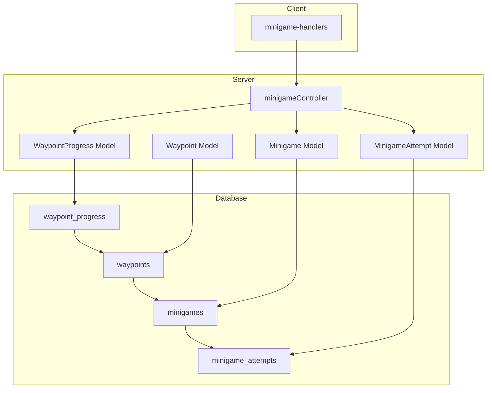
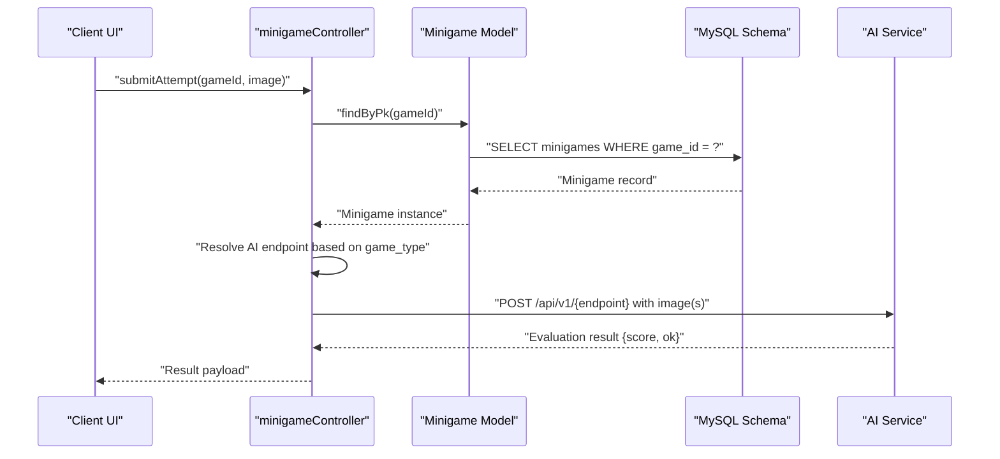
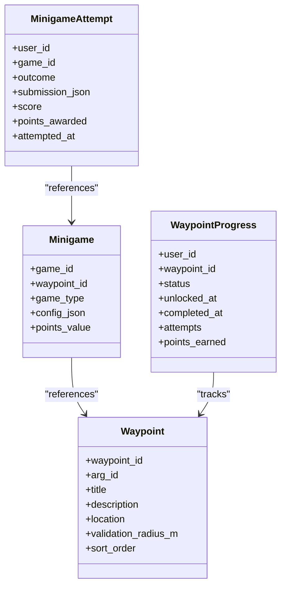

# Minigame & Progress Entities

<cite>
**Referenced Files in This Document**
- [schema.sql](file://database/schema.sql)
- [Minigame.js](file://server/src/models/Minigame.js)
- [MinigameAttempt.js](file://server/src/models/MinigameAttempt.js)
- [WaypointProgress.js](file://server/src/models/WaypointProgress.js)
- [Waypoint.js](file://server/src/models/Waypoint.js)
- [minigameController.js](file://server/src/controllers/minigameController.js)
- [minigame-handlers.js](file://client/scripts/components/minigame-handlers.js)
</cite>

## Table of Contents
1. [Introduction](#introduction)
2. [Project Structure](#project-structure)
3. [Core Components](#core-components)
4. [Architecture Overview](#architecture-overview)
5. [Detailed Component Analysis](#detailed-component-analysis)
6. [Dependency Analysis](#dependency-analysis)
7. [Performance Considerations](#performance-considerations)
8. [Troubleshooting Guide](#troubleshooting-guide)
9. [Conclusion](#conclusion)

## Introduction
This document provides comprehensive data model documentation for the Minigame and player progress entities in the WARG platform. It focuses on:
- The minigames table structure, including game_type ENUM support for multiple puzzle types and flexible per-type configuration via JSON.
- The minigame_attempts table that tracks player submissions, outcomes, normalized scores, and awarded points.
- The waypoint_progress table managing player progression through waypoints with a state machine covering locked, unlocked, completed, and skipped states.
- Relationships to waypoints and how minigames attach to waypoints.
- Field definitions, JSON schema examples for different minigame types, business rules for validation and scoring, and progression flow.

## Project Structure
The relevant code for this documentation spans database schema, server-side models, controller logic, and client-side UI handlers:
- Database schema defines tables, constraints, and relationships.
- Server models mirror the schema using Sequelize.
- Controller handles image-based minigame flows and AI service integration.
- Client handlers render UI for specific minigame types and collect user submissions.

**Diagram sources**
- [schema.sql:160-246](file://database/schema.sql#L160-L246)
- [schema.sql:308-345](file://database/schema.sql#L308-L345)
- [Minigame.js:4-15](file://server/src/models/Minigame.js#L4-L15)
- [MinigameAttempt.js:4-15](file://server/src/models/MinigameAttempt.js#L4-L15)
- [WaypointProgress.js:4-15](file://server/src/models/WaypointProgress.js#L4-L15)
- [Waypoint.js:4-17](file://server/src/models/Waypoint.js#L4-L17)
- [minigameController.js:53-125](file://server/src/controllers/minigameController.js#L53-L125)
- [minigame-handlers.js:7-200](file://client/scripts/components/minigame-handlers.js#L7-L200)

**Section sources**
- [schema.sql:160-246](file://database/schema.sql#L160-L246)
- [schema.sql:308-345](file://database/schema.sql#L308-L345)
- [Minigame.js:4-15](file://server/src/models/Minigame.js#L4-L15)
- [MinigameAttempt.js:4-15](file://server/src/models/MinigameAttempt.js#L4-L15)
- [WaypointProgress.js:4-15](file://server/src/models/WaypointProgress.js#L4-L15)
- [Waypoint.js:4-17](file://server/src/models/Waypoint.js#L4-L17)
- [minigameController.js:53-125](file://server/src/controllers/minigameController.js#L53-L125)
- [minigame-handlers.js:7-200](file://client/scripts/components/minigame-handlers.js#L7-L200)

## Core Components
This section documents the core entities and their fields:

- minigames
  - game_id: Primary key, auto-increment unsigned integer.
  - waypoint_id: Foreign key referencing waypoints; each minigame is attached to a waypoint.
  - game_type: ENUM supporting gps_proximity, text_answer, qr_barcode, ar_object_scan, colour_match, shape_match, photo_submit, texture_match, sift_match, symmetry_finder, word_scramble, plaque_scan.
  - config_json: Flexible JSON for per-type configuration (e.g., answers, thresholds, reference images).
  - points_value: Unsigned small integer defaulting to 10; determines base points for successful completion.
  - created_at / updated_at: Timestamps managed by Sequelize.

- minigame_attempts
  - user_id + game_id: Composite primary key; one row per user per minigame, representing the latest attempt.
  - outcome: ENUM ('pass', 'fail', 'timeout').
  - submission_json: Raw submission payload (text answer, scanned value, base64 image, etc.).
  - score: Normalized server score from 0.0 to 1.0 for graded challenges; nullable for pass/fail puzzles.
  - points_awarded: Unsigned small integer defaulting to 0; derived from outcome and points_value.
  - attempted_at: Timestamp of the attempt.

- waypoint_progress
  - user_id + waypoint_id: Composite primary key; one row per user per waypoint.
  - status: ENUM ('locked', 'unlocked', 'completed', 'skipped'); default 'locked'.
  - unlocked_at: Timestamp when the waypoint became available.
  - completed_at: Timestamp when the waypoint was successfully completed.
  - attempts: Unsigned small integer counting attempts at the waypoint.
  - points_earned: Unsigned small integer accumulating points earned at the waypoint.

- Waypoint relationship
  - Each minigame references a waypoint via waypoint_id.
  - Waypoints define geospatial location and validation radius, used by proximity-based minigames.

**Section sources**
- [schema.sql:212-246](file://database/schema.sql#L212-L246)
- [schema.sql:328-345](file://database/schema.sql#L328-L345)
- [schema.sql:308-324](file://database/schema.sql#L308-L324)
- [Minigame.js:4-15](file://server/src/models/Minigame.js#L4-L15)
- [MinigameAttempt.js:4-15](file://server/src/models/MinigameAttempt.js#L4-L15)
- [WaypointProgress.js:4-15](file://server/src/models/WaypointProgress.js#L4-L15)
- [Waypoint.js:4-17](file://server/src/models/Waypoint.js#L4-L17)

## Architecture Overview
The minigame system integrates client UI, server controllers, AI services, and persistent storage:

**Diagram sources**
- [minigameController.js:53-125](file://server/src/controllers/minigameController.js#L53-L125)
- [Minigame.js:4-15](file://server/src/models/Minigame.js#L4-L15)
- [schema.sql:212-246](file://database/schema.sql#L212-L246)

## Detailed Component Analysis

### Minigames Entity
- Purpose: Defines puzzle types and scoring configuration attached to waypoints.
- Key fields:
  - game_id: Unique identifier.
  - waypoint_id: Links to a waypoint; ensures spatial context for location-based puzzles.
  - game_type: Constrains supported puzzle types via ENUM.
  - config_json: Stores per-puzzle configuration such as answers, thresholds, or reference images.
  - points_value: Base points awarded upon success.
- Relationship:
  - One-to-one with a waypoint (one minigame per waypoint in current design).
  - Referenced by minigame_attempts via game_id.

JSON configuration examples by game type:
- text_answer:
  - Fields: answer, hint, case_sensitive, is_mcq, options.
  - Example structure:
    - { "answer": "Wits", "hint": "Enter the institution name", "case_sensitive": false }
    - { "is_mcq": true, "options": ["Option A", "Option B", "Option C"], "answer": 1 }
- qr_barcode:
  - Fields: barcode_value.
  - Example structure:
    - { "barcode_value": "WARG-2026-A3" }
- colour_match:
  - Fields: target_hsv, tolerance.
  - Example structure:
    - { "target_hsv": [210, 0.8, 0.9], "tolerance": 0.12 }
- shape_match:
  - Fields: shape_svg, jaccard_threshold, target_mask.
  - Example structure:
    - { "shape_svg": "...", "jaccard_threshold": 0.75 }
- texture_match:
  - Fields: reference_image_base64, reference_image_mimetype.
  - Example structure:
    - { "reference_image_base64": "...", "reference_image_mimetype": "image/jpeg" }
- sift_match:
  - Fields: archival_image_base64, archival_image_mimetype.
  - Example structure:
    - { "archival_image_base64": "...", "archival_image_mimetype": "image/jpeg" }
- symmetry_finder:
  - Fields: none required; evaluates submitted image symmetry.
- photo_submit:
  - Fields: optional acceptance criteria; typically validated by AI or manual review.
- ar_object_scan:
  - Fields: object_class, confidence_threshold.
  - Example structure:
    - { "object_class": "landmark", "confidence_threshold": 0.85 }
- word_scramble:
  - Fields: scrambled_word, answer, hint.
  - Example structure:
    - { "scrambled_word": "tsiW", "answer": "Wits", "hint": "University name" }
- plaque_scan:
  - Fields: reference_image_base64, reference_image_mimetype.
  - Example structure:
    - { "reference_image_base64": "...", "reference_image_mimetype": "image/jpeg" }

Validation and scoring rules:
- For text_answer: compare submitted answer against config.answer with case sensitivity controlled by case_sensitive.
- For qr_barcode: compare decoded string against config.barcode_value.
- For colour_match: compute HSV distance between sampled color and target_hsv; pass if within tolerance.
- For shape_match: compute Jaccard similarity between submitted mask and target_mask; pass if >= jaccard_threshold.
- For texture_match/sift_match: use AI service to match textures or features; derive score and threshold decision.
- For symmetry_finder: evaluate symmetry score; pass if above configured threshold.
- For photo_submit/ar_object_scan/plaque_scan: rely on AI evaluation results to determine pass/fail and score.

**Section sources**
- [schema.sql:212-246](file://database/schema.sql#L212-L246)
- [Minigame.js:4-15](file://server/src/models/Minigame.js#L4-L15)
- [minigameController.js:67-105](file://server/src/controllers/minigameController.js#L67-L105)

### MinigameAttempts Entity
- Purpose: Records the latest attempt per user per minigame, capturing outcome, raw submission, normalized score, and points awarded.
- Key fields:
  - user_id + game_id: Composite primary key ensuring one latest attempt per user per game.
  - outcome: ENUM ('pass', 'fail', 'timeout').
  - submission_json: Raw submission data (text, scanned value, base64 image, etc.).
  - score: Normalized server score 0.0–1.0 for graded challenges; nullable for binary puzzles.
  - points_awarded: Derived from outcome and minigame.points_value.
  - attempted_at: Timestamp of the attempt.

Business rules:
- On successful validation (outcome = 'pass'), points_awarded should equal minigame.points_value unless overridden by difficulty modifiers.
- On failure or timeout, points_awarded remains 0.
- score normalization:
  - Graded puzzles (colour_match, shape_match, texture_match, sift_match, symmetry_finder): score reflects similarity or correctness.
  - Binary puzzles (text_answer, qr_barcode, gps_proximity): score may be null or set to 1.0 on pass.

Data integrity:
- Attempt rows are overwritten per user/game to keep only the latest attempt.
- Submission payloads must be valid JSON and sized appropriately for storage.

**Section sources**
- [schema.sql:328-345](file://database/schema.sql#L328-L345)
- [MinigameAttempt.js:4-15](file://server/src/models/MinigameAttempt.js#L4-L15)

### WaypointProgress Entity
- Purpose: Tracks player progression through waypoints, including availability, completion, attempts, and accumulated points.
- Key fields:
  - user_id + waypoint_id: Composite primary key.
  - status: ENUM ('locked', 'unlocked', 'completed', 'skipped').
  - unlocked_at: When the waypoint becomes available.
  - completed_at: When the waypoint is successfully completed.
  - attempts: Count of attempts made at the waypoint.
  - points_earned: Accumulated points earned at the waypoint.

State machine logic:
- Initial state: locked.
- Transition to unlocked:
  - Triggered when predecessor waypoint is completed and edge conditions are satisfied.
- Transition to completed:
  - Triggered when minigame outcome is 'pass' and validation succeeds.
- Transition to skipped:
  - Optional path allowing players to bypass certain waypoints under specific conditions.

Completion timestamps:
- unlocked_at is set when transitioning from locked to unlocked.
- completed_at is set when transitioning to completed.

Points accumulation:
- points_earned accumulates points_awarded from successful minigame attempts at the waypoint.

**Section sources**
- [schema.sql:308-324](file://database/schema.sql#L308-L324)
- [WaypointProgress.js:4-15](file://server/src/models/WaypointProgress.js#L4-L15)

### Waypoint Entity
- Purpose: Represents geospatial nodes in an ARG, defining location and validation radius for proximity checks.
- Key fields:
  - waypoint_id: Primary key.
  - arg_id: Belongs to an ARG.
  - title/description: Human-readable metadata.
  - location: Geospatial POINT (SRID 4326).
  - validation_radius_m: Radius in meters for proximity validation.
  - sort_order: Ordering within an ARG.

Relationships:
- One-to-many with minigames (each waypoint can have one minigame in current design).
- Used by waypoint_progress to track player progression.

**Section sources**
- [schema.sql:160-179](file://database/schema.sql#L160-L179)
- [Waypoint.js:4-17](file://server/src/models/Waypoint.js#L4-L17)

### Client Minigame Handlers
- Purpose: Provide UI rendering and input collection for specific minigame types.
- Supported types:
  - gps_proximity: Renders verification button; submits empty payload since server validates proximity.
  - text_answer: Supports both free-text and multiple-choice inputs; collects selected option index or typed answer.
  - qr_barcode: Integrates scanner and manual entry fallback; submits decoded text.
  - plaque_scan: Captures photo via device camera; submits base64 image data.

Submission flow:
- UI renders appropriate form based on config.
- User interaction triggers onSubmit callback with collected data.
- Data is sent to server endpoints for validation and AI processing where applicable.

**Section sources**
- [minigame-handlers.js:7-200](file://client/scripts/components/minigame-handlers.js#L7-L200)

## Dependency Analysis
The following diagram illustrates dependencies among core components:

**Diagram sources**
- [Minigame.js:4-15](file://server/src/models/Minigame.js#L4-L15)
- [MinigameAttempt.js:4-15](file://server/src/models/MinigameAttempt.js#L4-L15)
- [WaypointProgress.js:4-15](file://server/src/models/WaypointProgress.js#L4-L15)
- [Waypoint.js:4-17](file://server/src/models/Waypoint.js#L4-L17)

**Section sources**
- [Minigame.js:4-15](file://server/src/models/Minigame.js#L4-L15)
- [MinigameAttempt.js:4-15](file://server/src/models/MinigameAttempt.js#L4-L15)
- [WaypointProgress.js:4-15](file://server/src/models/WaypointProgress.js#L4-L15)
- [Waypoint.js:4-17](file://server/src/models/Waypoint.js#L4-L17)

## Performance Considerations
- JSON storage:
  - config_json and submission_json can grow large, especially for base64 images. Consider storing large binaries externally and keeping URLs or hashes in JSON.
- Indexing:
  - Ensure indexes on foreign keys (waypoint_id, game_id, user_id) for efficient joins and lookups.
- AI service calls:
  - Image-based minigames involve network requests to AI services; implement retries and timeouts to avoid blocking.
- Attempt overwrite strategy:
  - Overwriting attempts per user/game reduces storage but loses historical data; consider archiving older attempts if needed for analytics.

[No sources needed since this section provides general guidance]

## Troubleshooting Guide
Common issues and resolutions:
- Missing reference image:
  - Error: "Minigame does not have a reference image uploaded".
  - Resolution: Upload reference image via uploadReference endpoint before attempting image-based minigames.
- AI service failures:
  - Error: "AI evaluation failed".
  - Resolution: Check AI service availability and logs; ensure correct endpoint mapping for game_type.
- Invalid game_type:
  - Error: "Game type does not support AI evaluation via this endpoint".
  - Resolution: Use appropriate endpoint or update controller mapping for new game types.
- Proximity validation:
  - Ensure GPS accuracy and location permissions are enabled; verify validation_radius_m settings.

**Section sources**
- [minigameController.js:15-27](file://server/src/controllers/minigameController.js#L15-L27)
- [minigameController.js:95-105](file://server/src/controllers/minigameController.js#L95-L105)
- [minigameController.js:107-125](file://server/src/controllers/minigameController.js#L107-L125)

## Conclusion
The minigame and progress entities provide a robust foundation for diverse puzzle types and player progression tracking. The schema enforces clear relationships and constraints, while flexible JSON configuration enables extensibility. Business rules around validation, scoring, and progression ensure consistent gameplay experiences. Proper handling of AI services and client interactions enhances usability and reliability.

[No sources needed since this section summarizes without analyzing specific files]