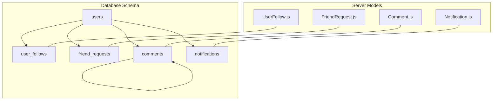
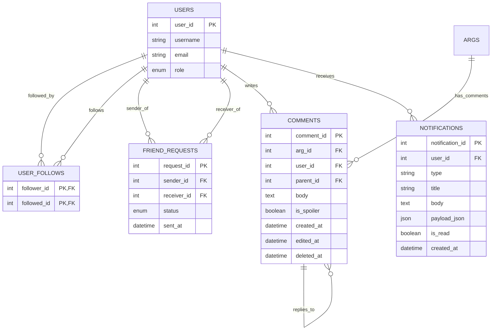
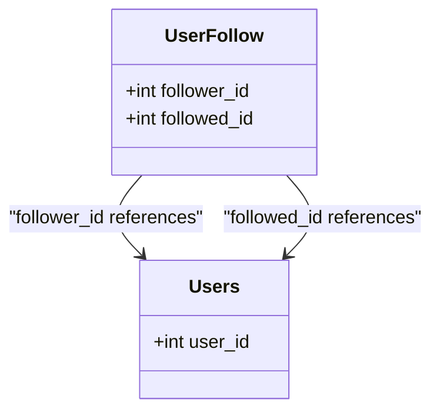
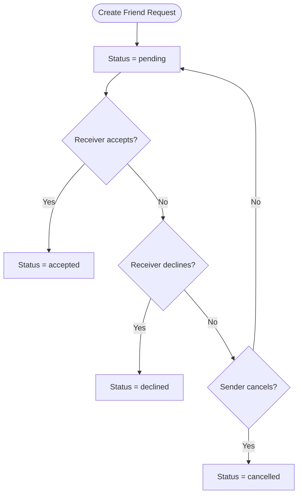
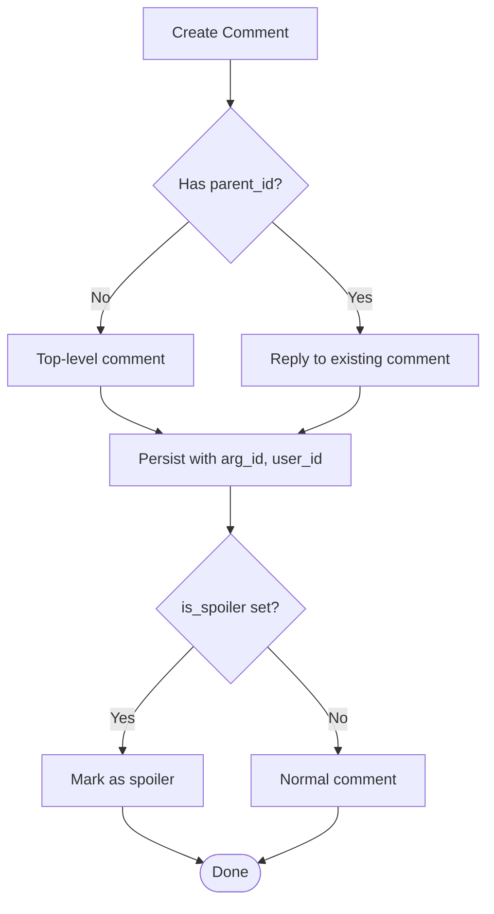
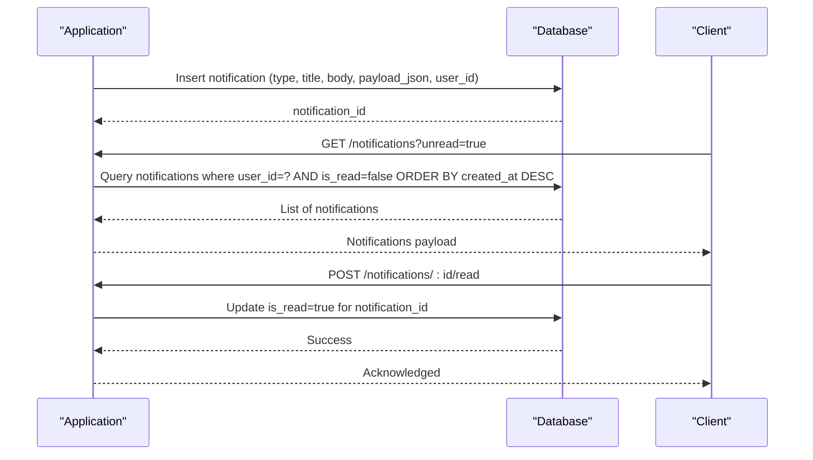
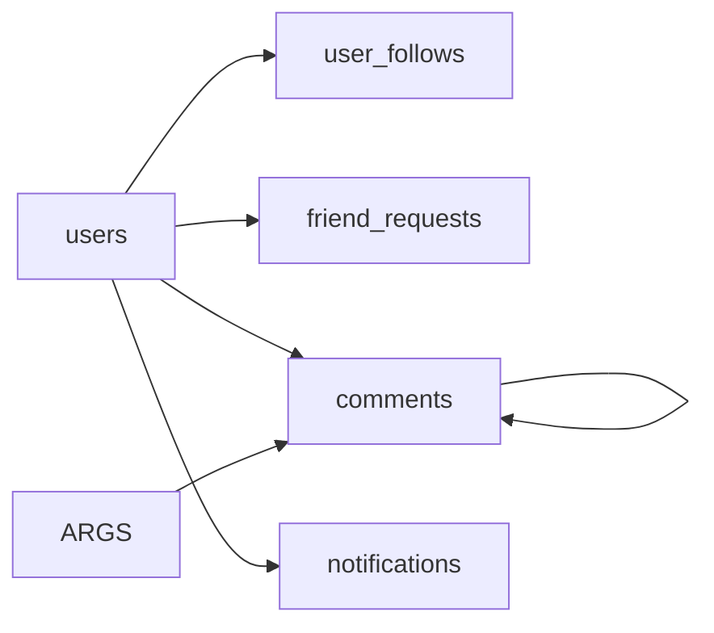

# Social & Community Entities

<cite>
**Referenced Files in This Document**
- [schema.sql](file://database/schema.sql)
- [UserFollow.js](file://server/src/models/UserFollow.js)
- [FriendRequest.js](file://server/src/models/FriendRequest.js)
- [Comment.js](file://server/src/models/Comment.js)
- [Notification.js](file://server/src/models/Notification.js)
</cite>

## Table of Contents
1. [Introduction](#introduction)
2. [Project Structure](#project-structure)
3. [Core Components](#core-components)
4. [Architecture Overview](#architecture-overview)
5. [Detailed Component Analysis](#detailed-component-analysis)
6. [Dependency Analysis](#dependency-analysis)
7. [Performance Considerations](#performance-considerations)
8. [Troubleshooting Guide](#troubleshooting-guide)
9. [Conclusion](#conclusion)

## Introduction
This document describes the social and community interaction data model for the WARG Platform, focusing on four core entities:
- Asymmetric user follows (like Twitter)
- Bidirectional friend requests with a state machine
- Threaded comments with spoiler detection and soft delete
- Notifications for real-time alerts with type categorization and read/unread management

It covers field definitions, relationship constraints, indexing strategies, and business rules for social interactions, content moderation, and notification delivery.

## Project Structure
The social and community entities are defined in the database schema and mirrored by Sequelize models in the server layer. The schema defines table structures, indexes, and foreign keys; the models provide application-level access to these tables.

**Diagram sources**
- [schema.sql:54-84](file://database/schema.sql#L54-L84)
- [schema.sql:91-107](file://database/schema.sql#L91-L107)
- [schema.sql:435-456](file://database/schema.sql#L435-L456)
- [UserFollow.js:4-10](file://server/src/models/UserFollow.js#L4-L10)
- [FriendRequest.js:4-13](file://server/src/models/FriendRequest.js#L4-L13)
- [Comment.js:4-18](file://server/src/models/Comment.js#L4-L18)
- [Notification.js:4-16](file://server/src/models/Notification.js#L4-L16)

**Section sources**
- [schema.sql:54-84](file://database/schema.sql#L54-L84)
- [schema.sql:91-107](file://database/schema.sql#L91-L107)
- [schema.sql:435-456](file://database/schema.sql#L435-L456)
- [UserFollow.js:1-13](file://server/src/models/UserFollow.js#L1-L13)
- [FriendRequest.js:1-16](file://server/src/models/FriendRequest.js#L1-L16)
- [Comment.js:1-21](file://server/src/models/Comment.js#L1-L21)
- [Notification.js:1-19](file://server/src/models/Notification.js#L1-L19)

## Core Components
This section summarizes the four entities and their roles in the social graph and community features.

- UserFollow: Represents asymmetric follow relationships between users. A row means “follower_id follows followed_id.” No duplicate pairs are allowed due to the composite primary key.
- FriendRequest: Represents bidirectional friendship requests with a status enum supporting pending, accepted, declined, and cancelled states. A unique constraint prevents duplicate sender-receiver pairs.
- Comment: Supports threaded discussions via parent_id, spoiler flags, edit timestamps, and soft deletes through deleted_at. Comments belong to an ARG and a user.
- Notification: Stores per-user notifications with a type category, title/body text, optional JSON payload, and is_read flag for read/unread tracking. Indexed for efficient unread queries.

**Section sources**
- [schema.sql:54-84](file://database/schema.sql#L54-L84)
- [schema.sql:91-107](file://database/schema.sql#L91-L107)
- [schema.sql:435-456](file://database/schema.sql#L435-L456)
- [UserFollow.js:4-10](file://server/src/models/UserFollow.js#L4-L10)
- [FriendRequest.js:4-13](file://server/src/models/FriendRequest.js#L4-L13)
- [Comment.js:4-18](file://server/src/models/Comment.js#L4-L18)
- [Notification.js:4-16](file://server/src/models/Notification.js#L4-L16)

## Architecture Overview
The social and community subsystem integrates with the users and args entities. Follows and friend requests build the social graph; comments attach to ARGs; notifications target users and can carry contextual payloads.

**Diagram sources**
- [schema.sql:15-44](file://database/schema.sql#L15-L44)
- [schema.sql:54-84](file://database/schema.sql#L54-L84)
- [schema.sql:91-107](file://database/schema.sql#L91-L107)
- [schema.sql:114-151](file://database/schema.sql#L114-L151)
- [schema.sql:435-456](file://database/schema.sql#L435-L456)

## Detailed Component Analysis

### UserFollow (Asymmetric Follows)
Purpose:
- Model one-way follows between users, similar to Twitter or creator subscriptions.

Key fields:
- follower_id: who initiates the follow
- followed_id: who is being followed

Constraints and relationships:
- Composite primary key (follower_id, followed_id) ensures uniqueness per pair.
- Foreign keys reference users.user_id with cascade delete.
- Index on followed_id optimizes “who is being followed” queries.

Business rules:
- A user can follow another user at most once.
- Deleting a user cascades all their follow relationships.
- To implement mutual friendship, combine follows with friend_requests logic.

Indexing strategy:
- Primary key enforces uniqueness.
- Secondary index on followed_id supports listing followers or popular followed users.

**Diagram sources**
- [schema.sql:54-65](file://database/schema.sql#L54-L65)
- [schema.sql:15-44](file://database/schema.sql#L15-L44)
- [UserFollow.js:4-10](file://server/src/models/UserFollow.js#L4-L10)

**Section sources**
- [schema.sql:54-65](file://database/schema.sql#L54-L65)
- [UserFollow.js:1-13](file://server/src/models/UserFollow.js#L1-L13)

### FriendRequest (Bidirectional Friendship System)
Purpose:
- Manage explicit friendship requests with a clear lifecycle.

Key fields:
- request_id: auto-increment primary key
- sender_id: user sending the request
- receiver_id: user receiving the request
- status: ENUM('pending', 'accepted', 'declined', 'cancelled')
- sent_at: timestamp when the request was sent

Constraints and relationships:
- Unique constraint on (sender_id, receiver_id) prevents duplicate requests.
- Foreign keys reference users.user_id with cascade delete.
- Index on receiver_id supports inbox-style queries.

Status transitions and business rules:
- Initial state is pending.
- Accepted implies a mutual friendship; application logic should ensure both directions are represented as needed.
- Declined or cancelled ends the request without creating a friendship.
- Only one active request exists per sender-receiver pair.

Indexing strategy:
- Primary key on request_id.
- Unique key on (sender_id, receiver_id).
- Index on receiver_id for fast retrieval of incoming requests.

**Diagram sources**
- [schema.sql:69-84](file://database/schema.sql#L69-L84)
- [FriendRequest.js:4-13](file://server/src/models/FriendRequest.js#L4-L13)

**Section sources**
- [schema.sql:69-84](file://database/schema.sql#L69-L84)
- [FriendRequest.js:1-16](file://server/src/models/FriendRequest.js#L1-L16)

### Comments (Threaded Discussions, Spoilers, Soft Delete)
Purpose:
- Enable threaded discussions under ARGs with reply chains, spoiler protection, and soft deletion.

Key fields:
- comment_id: auto-increment primary key
- arg_id: ARG this comment belongs to
- user_id: author of the comment
- parent_id: null for top-level comments; otherwise references another comment’s comment_id
- body: comment text
- is_spoiler: flag indicating spoiler content
- created_at: creation timestamp
- edited_at: last edit timestamp
- deleted_at: soft delete timestamp

Constraints and relationships:
- Foreign keys to users.user_id and args.arg_id with cascade delete.
- Self-referencing foreign key on parent_id with SET NULL behavior so deleting a parent does not remove replies.
- Indexes on arg_id, user_id, and parent_id optimize common queries.

Business rules:
- parent_id enables hierarchical replies.
- is_spoiler allows UI to blur or warn about spoilers.
- deleted_at implements soft delete; application should filter out deleted comments unless admin context.
- Editing updates edited_at but preserves original creation time.

**Diagram sources**
- [schema.sql:435-456](file://database/schema.sql#L435-L456)
- [Comment.js:4-18](file://server/src/models/Comment.js#L4-L18)

**Section sources**
- [schema.sql:435-456](file://database/schema.sql#L435-L456)
- [Comment.js:1-21](file://server/src/models/Comment.js#L1-L21)

### Notifications (Real-Time Alerts with Payloads)
Purpose:
- Provide per-user notifications with categorized types, human-readable titles/bodies, optional JSON payloads, and read/unread tracking.

Key fields:
- notification_id: auto-increment primary key
- user_id: recipient
- type: short string categorizing the event (e.g., new_arg_from_creator, friend_request, badge_earned, arg_flagged, arg_published)
- title: concise headline
- body: optional detailed message
- payload_json: optional structured data (IDs, URLs, metadata)
- is_read: boolean flag for read/unread status
- created_at: timestamp

Constraints and relationships:
- Foreign key to users.user_id with cascade delete.
- Composite index on (user_id, is_read, created_at) optimizes fetching unread notifications sorted by time.

Business rules:
- Type categorization enables routing and UI rendering logic.
- payload_json carries contextual data for deep linking or processing.
- is_read toggles when a user views or acknowledges the notification.
- Deletion of a user cascades their notifications.

**Diagram sources**
- [schema.sql:91-107](file://database/schema.sql#L91-L107)
- [Notification.js:4-16](file://server/src/models/Notification.js#L4-L16)

**Section sources**
- [schema.sql:91-107](file://database/schema.sql#L91-L107)
- [Notification.js:1-19](file://server/src/models/Notification.js#L1-L19)

## Dependency Analysis
The social and community entities depend primarily on users and args. Comments also self-reference for threading. Notifications target users and may include contextual payloads.

**Diagram sources**
- [schema.sql:54-84](file://database/schema.sql#L54-L84)
- [schema.sql:91-107](file://database/schema.sql#L91-L107)
- [schema.sql:114-151](file://database/schema.sql#L114-L151)
- [schema.sql:435-456](file://database/schema.sql#L435-L456)

**Section sources**
- [schema.sql:54-84](file://database/schema.sql#L54-L84)
- [schema.sql:91-107](file://database/schema.sql#L91-L107)
- [schema.sql:114-151](file://database/schema.sql#L114-L151)
- [schema.sql:435-456](file://database/schema.sql#L435-L456)

## Performance Considerations
- Use the provided indexes:
  - user_follows.followed_id for popular followed users.
  - friend_requests.receiver_id for inbox queries.
  - comments.arg_id, comments.user_id, comments.parent_id for discussion lists and reply trees.
  - notifications(user_id, is_read, created_at) for unread feeds.
- Keep payload_json compact; avoid storing large blobs in notifications.
- For high-volume comment threads, paginate by arg_id and parent_id and consider materialized aggregates if needed.
- When marking notifications as read, batch updates to reduce write amplification.

[No sources needed since this section provides general guidance]

## Troubleshooting Guide
Common issues and resolutions:
- Duplicate follow attempts:
  - Cause: Attempting to insert an existing (follower_id, followed_id) pair.
  - Resolution: Check existence before insert or handle unique constraint errors gracefully.
- Duplicate friend requests:
  - Cause: Multiple requests from the same sender to the same receiver.
  - Resolution: Enforce unique constraint; return conflict if already exists.
- Orphaned replies after parent deletion:
  - Behavior: parent_id becomes NULL due to ON DELETE SET NULL.
  - Resolution: Treat NULL parent_id as top-level when rendering; optionally re-parent or hide depending on policy.
- Unread notification performance:
  - Ensure queries use the composite index on (user_id, is_read, created_at).
  - Avoid selecting unnecessary columns; limit result sets.

**Section sources**
- [schema.sql:54-65](file://database/schema.sql#L54-L65)
- [schema.sql:69-84](file://database/schema.sql#L69-L84)
- [schema.sql:435-456](file://database/schema.sql#L435-L456)
- [schema.sql:91-107](file://database/schema.sql#L91-L107)

## Conclusion
The social and community data model provides a robust foundation for user interactions:
- Asymmetric follows enable flexible social graphs.
- Friend requests offer a controlled friendship lifecycle with clear statuses.
- Comments support rich, threaded discussions with spoiler awareness and soft deletes.
- Notifications deliver timely, categorized alerts with contextual payloads and efficient read/unread handling.

Together, these entities enable scalable social features, content moderation hooks, and responsive user experiences.

[No sources needed since this section summarizes without analyzing specific files]