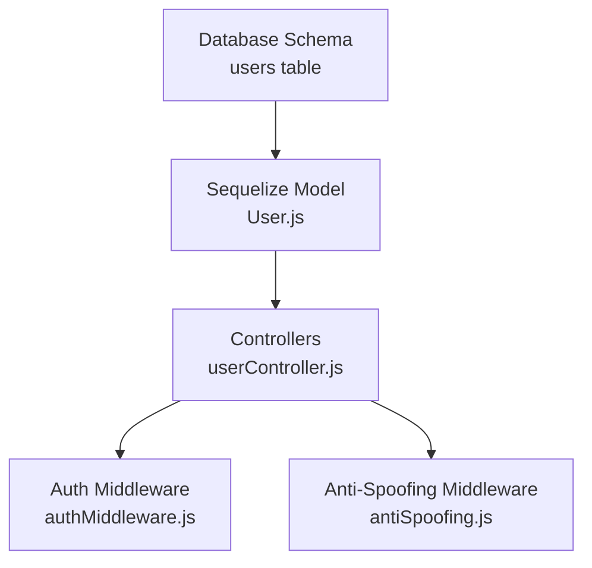
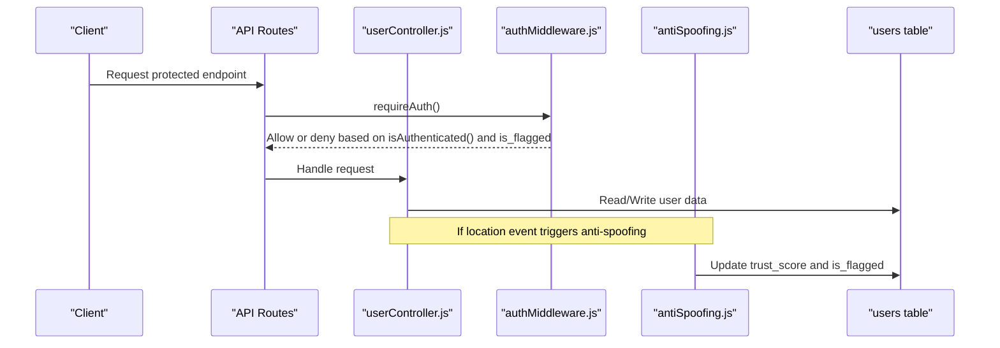
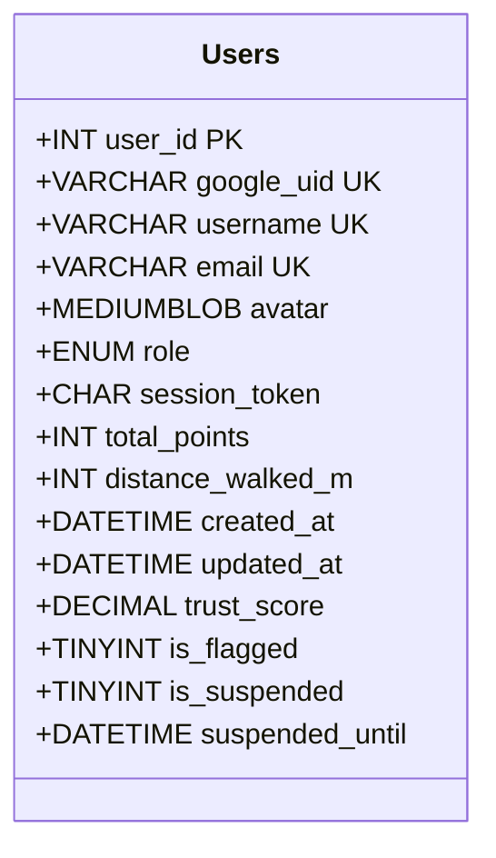
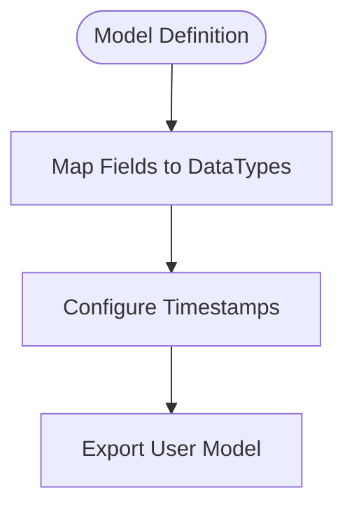
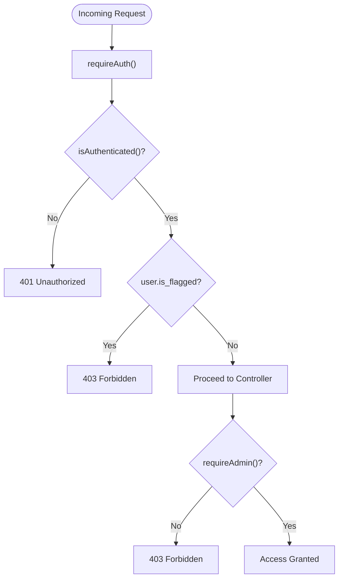
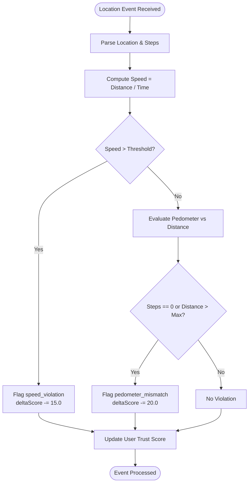
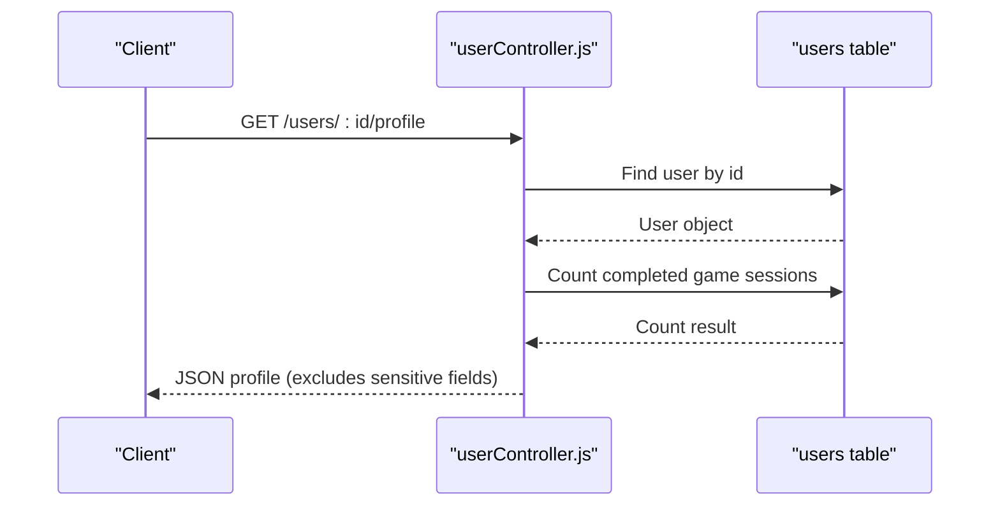
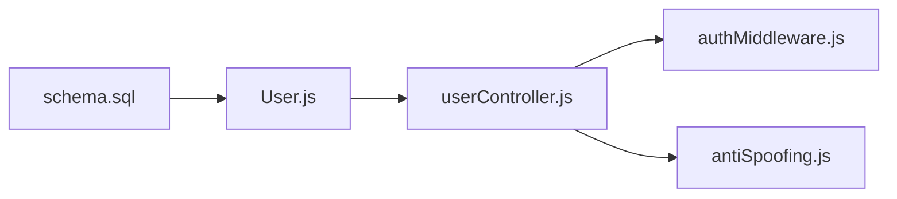

# User Entity

<cite>
**Referenced Files in This Document**
- [schema.sql](file://database/schema.sql)
- [User.js](file://server/src/models/User.js)
- [authMiddleware.js](file://server/src/middleware/authMiddleware.js)
- [antiSpoofing.js](file://server/src/middleware/antiSpoofing.js)
- [userController.js](file://server/src/controllers/userController.js)
</cite>

## Table of Contents
1. [Introduction](#introduction)
2. [Project Structure](#project-structure)
3. [Core Components](#core-components)
4. [Architecture Overview](#architecture-overview)
5. [Detailed Component Analysis](#detailed-component-analysis)
6. [Dependency Analysis](#dependency-analysis)
7. [Performance Considerations](#performance-considerations)
8. [Troubleshooting Guide](#troubleshooting-guide)
9. [Conclusion](#conclusion)

## Introduction
This document provides comprehensive data model documentation for the User entity in the WARG Platform. It focuses on the users table structure, authentication fields (google_uid, username, email), role-based access control with ENUM values ('player', 'creator', 'admin'), trust scoring mechanism using DECIMAL(5,2) and anti-spoofing features including is_flagged status. It also covers meta-progression fields such as total_points and distance_walked_m, session management via session_token, and account lifecycle fields like is_suspended and suspended_until. Field definitions, data types, constraints, indexes (uq_users_google, uq_users_username, uq_users_email, idx_users_role, idx_users_trust), and business rules for user authentication, authorization, and trust management are included.

## Project Structure
The User entity spans three primary layers:
- Database schema defines the canonical table structure and indexes.
- Sequelize model maps application-level attributes to database columns.
- Middleware enforces authentication and authorization policies.
- Anti-spoofing middleware updates trust scores based on location events.
- Controllers expose endpoints that read or update user-related data.

**Diagram sources**
- [schema.sql:15-44](file://database/schema.sql#L15-L44)
- [User.js:4-25](file://server/src/models/User.js#L4-L25)
- [authMiddleware.js:1-21](file://server/src/middleware/authMiddleware.js#L1-L21)
- [antiSpoofing.js:65-98](file://server/src/middleware/antiSpoofing.js#L65-L98)
- [userController.js:4-25](file://server/src/controllers/userController.js#L4-L25)

**Section sources**
- [schema.sql:15-44](file://database/schema.sql#L15-L44)
- [User.js:4-25](file://server/src/models/User.js#L4-L25)

## Core Components
- Authentication fields: google_uid, username, email.
- Role-based access control: role ENUM ('player', 'creator', 'admin').
- Trust scoring: trust_score DECIMAL(5,2) with default 100.00; is_flagged TINYINT(1).
- Meta-progression: total_points INT UNSIGNED, distance_walked_m INT UNSIGNED.
- Session management: session_token CHAR(64).
- Account lifecycle: is_suspended TINYINT(1), suspended_until DATETIME.
- Indexes: uq_users_google, uq_users_username, uq_users_email, idx_users_role, idx_users_trust.

Key responsibilities:
- The database schema enforces uniqueness and indexing for performance and integrity.
- The Sequelize model mirrors these fields and adds application-level defaults and types.
- Middleware gates access based on authentication state and role, and blocks flagged users.
- Anti-spoofing logic adjusts trust scores based on location anomalies.

**Section sources**
- [schema.sql:15-44](file://database/schema.sql#L15-L44)
- [User.js:4-25](file://server/src/models/User.js#L4-L25)
- [authMiddleware.js:1-21](file://server/src/middleware/authMiddleware.js#L1-L21)
- [antiSpoofing.js:65-98](file://server/src/middleware/antiSpoofing.js#L65-L98)

## Architecture Overview
The User entity participates in authentication, authorization, and trust management flows:
- Authentication validates the user’s identity and sets session context.
- Authorization checks roles and flags before allowing actions.
- Trust management evaluates location events and updates trust_score and is_flagged accordingly.

**Diagram sources**
- [authMiddleware.js:1-21](file://server/src/middleware/authMiddleware.js#L1-L21)
- [antiSpoofing.js:65-98](file://server/src/middleware/antiSpoofing.js#L65-L98)
- [userController.js:4-25](file://server/src/controllers/userController.js#L4-L25)
- [schema.sql:15-44](file://database/schema.sql#L15-L44)

## Detailed Component Analysis

### Users Table Data Model
The users table encapsulates core identity, progression, security, and lifecycle information.

Field definitions and constraints:
- user_id: INT UNSIGNED, PRIMARY KEY, AUTO_INCREMENT.
- google_uid: VARCHAR(256), NOT NULL, UNIQUE KEY uq_users_google.
- username: VARCHAR(64), NOT NULL, UNIQUE KEY uq_users_username.
- email: VARCHAR(256), NOT NULL, UNIQUE KEY uq_users_email.
- avatar: MEDIUMBLOB, nullable.
- role: ENUM('player','creator','admin'), NOT NULL DEFAULT 'player'.
- session_token: CHAR(64), nullable.
- total_points: INT UNSIGNED, NOT NULL DEFAULT 0.
- distance_walked_m: INT UNSIGNED, NOT NULL DEFAULT 0.
- created_at: DATETIME, NOT NULL DEFAULT CURRENT_TIMESTAMP.
- updated_at: DATETIME, NOT NULL DEFAULT CURRENT_TIMESTAMP ON UPDATE CURRENT_TIMESTAMP.
- trust_score: DECIMAL(5,2), NOT NULL DEFAULT 100.00.
- is_flagged: TINYINT(1), NOT NULL DEFAULT 0.
- is_suspended: TINYINT(1), NOT NULL DEFAULT 0.
- suspended_until: DATETIME, nullable.

Indexes:
- uq_users_google(google_uid)
- uq_users_username(username)
- uq_users_email(email)
- idx_users_role(role)
- idx_users_trust(trust_score)

Business rules:
- Uniqueness enforced at the database level for google_uid, username, and email.
- Role defaults to 'player' unless explicitly set by admin processes.
- Trust score starts at 100.00 and can be adjusted by anti-spoofing mechanisms.
- Suspension is controlled via is_suspended and suspended_until for time-bound restrictions.

**Diagram sources**
- [schema.sql:15-44](file://database/schema.sql#L15-L44)

**Section sources**
- [schema.sql:15-44](file://database/schema.sql#L15-L44)

### Sequelize Model Mapping
The Sequelize model mirrors the database schema and adds application-level configuration:
- Maps column names and types to JavaScript DataTypes.
- Adds auth_provider ENUM ('local', 'google') and password_hash STRING(255) not present in the canonical schema but used by the application layer.
- Configures timestamps mapping createdAt -> created_at, updatedAt -> updated_at.

Important notes:
- google_uid is defined as allowNull true in the model while the schema marks it NOT NULL; ensure migration consistency.
- Boolean fields map to DataTypes.BOOLEAN, aligning with TINYINT(1) in MySQL.

**Diagram sources**
- [User.js:4-25](file://server/src/models/User.js#L4-L25)

**Section sources**
- [User.js:4-25](file://server/src/models/User.js#L4-L25)

### Authentication and Authorization Flow
Authentication middleware ensures requests are from authenticated users and blocks flagged accounts. Authorization middleware restricts admin-only routes.

Behavior:
- requireAuth: Checks isAuthenticated(); if user.is_flagged is true, returns 403 Forbidden. Otherwise proceeds.
- requireAdmin: Requires both isAuthenticated() and role === 'admin'; otherwise returns 403 Forbidden.

**Diagram sources**
- [authMiddleware.js:1-21](file://server/src/middleware/authMiddleware.js#L1-L21)

**Section sources**
- [authMiddleware.js:1-21](file://server/src/middleware/authMiddleware.js#L1-L21)

### Trust Scoring and Anti-Spoofing Logic
Anti-spoofing middleware evaluates location events to detect suspicious behavior and adjusts trust_score accordingly.

Key checks:
- Speed violation: Computes speed from distance/time; if exceeds threshold (e.g., 4.0 m/s), applies penalty (e.g., -15.0).
- Pedometer mismatch: Compares device-reported steps with calculated distance; flags inconsistencies and applies penalties (e.g., -20.0).
- Updates user trust_score and may set is_flagged based on accumulated violations.

**Diagram sources**
- [antiSpoofing.js:65-98](file://server/src/middleware/antiSpoofing.js#L65-L98)

**Section sources**
- [antiSpoofing.js:65-98](file://server/src/middleware/antiSpoofing.js#L65-L98)

### User Profile and Progression Exposure
Controllers provide endpoints to retrieve user profiles, libraries, friends, and search users. Sensitive fields like google_uid and session_token are excluded from profile responses.

Responsibilities:
- getUserProfile: Returns user data excluding sensitive fields; includes badges and computed games_completed.
- getUserLibrary: Lists ARGs created by a user.
- getFriends: Retrieves accepted friend relationships and active game sessions.
- searchUsers: Searches users by username pattern.

**Diagram sources**
- [userController.js:4-25](file://server/src/controllers/userController.js#L4-L25)

**Section sources**
- [userController.js:4-25](file://server/src/controllers/userController.js#L4-L25)

## Dependency Analysis
The User entity depends on:
- Database schema for structural integrity and indexing.
- Sequelize model for ORM mapping and application-level defaults.
- Middleware for enforcing authentication and authorization policies.
- Anti-spoofing middleware for dynamic trust score adjustments.
- Controllers for exposing user-related functionality.

**Diagram sources**
- [schema.sql:15-44](file://database/schema.sql#L15-L44)
- [User.js:4-25](file://server/src/models/User.js#L4-L25)
- [userController.js:4-25](file://server/src/controllers/userController.js#L4-L25)
- [authMiddleware.js:1-21](file://server/src/middleware/authMiddleware.js#L1-L21)
- [antiSpoofing.js:65-98](file://server/src/middleware/antiSpoofing.js#L65-L98)

**Section sources**
- [schema.sql:15-44](file://database/schema.sql#L15-L44)
- [User.js:4-25](file://server/src/models/User.js#L4-L25)
- [userController.js:4-25](file://server/src/controllers/userController.js#L4-L25)
- [authMiddleware.js:1-21](file://server/src/middleware/authMiddleware.js#L1-L21)
- [antiSpoofing.js:65-98](file://server/src/middleware/antiSpoofing.js#L65-L98)

## Performance Considerations
- Indexes:
  - uq_users_google, uq_users_username, uq_users_email enforce uniqueness and optimize lookups by identifier fields.
  - idx_users_role supports queries filtering by role.
  - idx_users_trust enables efficient trust-based queries and leaderboards.
- Denormalized fields:
  - total_points and distance_walked_m reduce aggregation costs for profile displays.
- Session token:
  - session_token allows single-device session tracking without additional tables.
- Trust score:
  - DECIMAL(5,2) balances precision and storage efficiency for frequent updates.

[No sources needed since this section provides general guidance]

## Troubleshooting Guide
Common issues and resolutions:
- Authentication failures:
  - Ensure req.isAuthenticated() is properly set after login.
  - Verify that flagged users receive 403 Forbidden responses as intended.
- Authorization errors:
  - Confirm that only users with role 'admin' can access admin routes.
- Trust score anomalies:
  - Review anti-spoofing logic for speed and pedometer checks.
  - Validate that trust_score updates reflect expected penalties.
- Data inconsistency between schema and model:
  - Align google_uid nullability and other field definitions across schema.sql and User.js.

**Section sources**
- [authMiddleware.js:1-21](file://server/src/middleware/authMiddleware.js#L1-L21)
- [antiSpoofing.js:65-98](file://server/src/middleware/antiSpoofing.js#L65-L98)
- [schema.sql:15-44](file://database/schema.sql#L15-L44)
- [User.js:4-25](file://server/src/models/User.js#L4-L25)

## Conclusion
The User entity in the WARG Platform is designed to support secure authentication, role-based authorization, progressive gameplay metrics, and robust trust management. The database schema enforces critical constraints and indexes, while the Sequelize model provides application-level mappings. Middleware ensures secure access and dynamic trust adjustments based on location behavior. Together, these components create a reliable foundation for user management within the platform.

[No sources needed since this section summarizes without analyzing specific files]