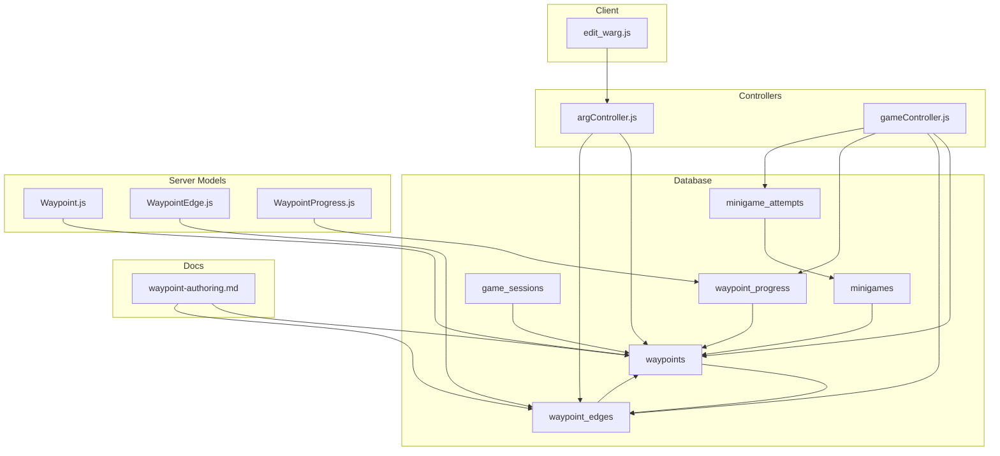
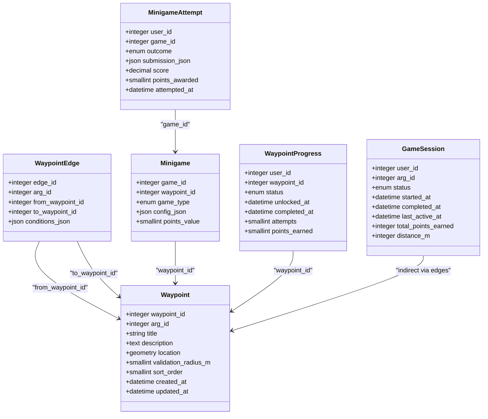
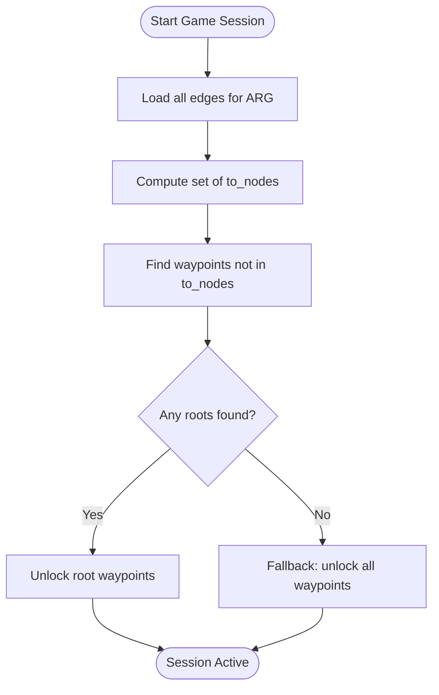
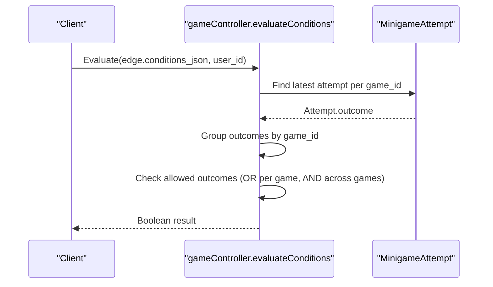
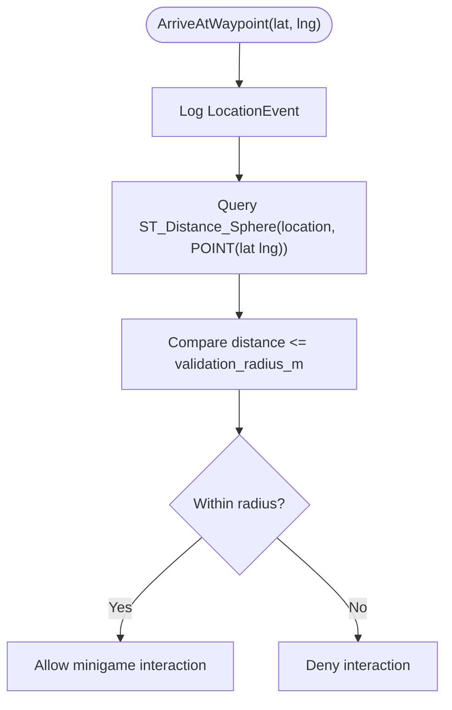
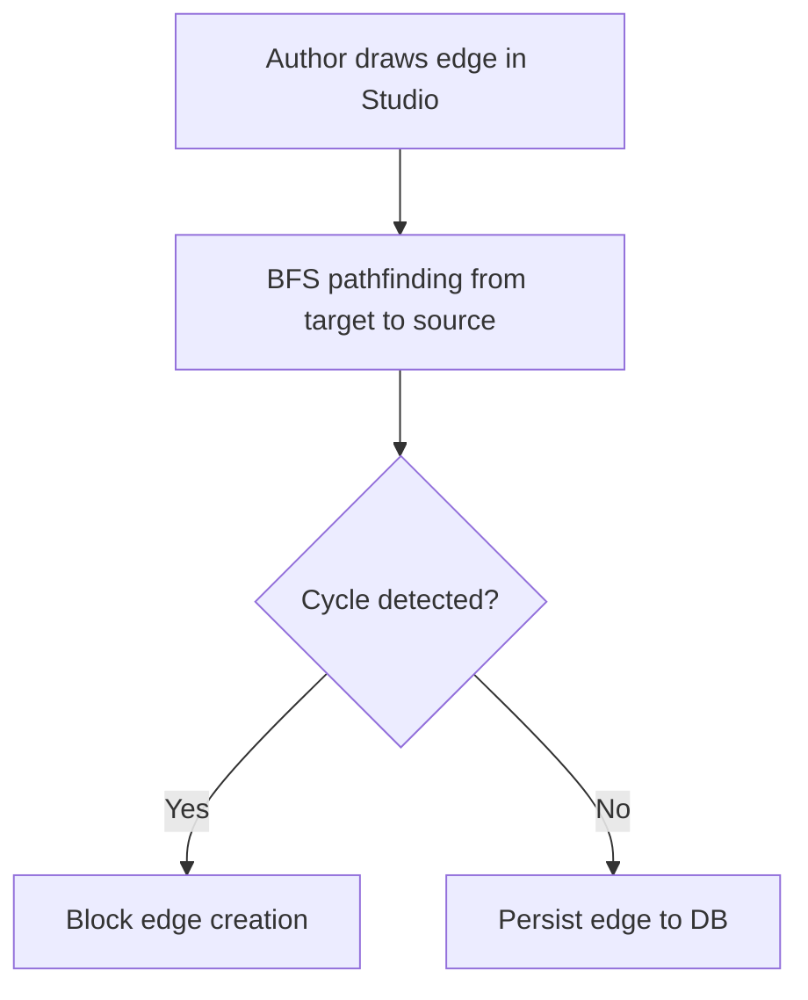
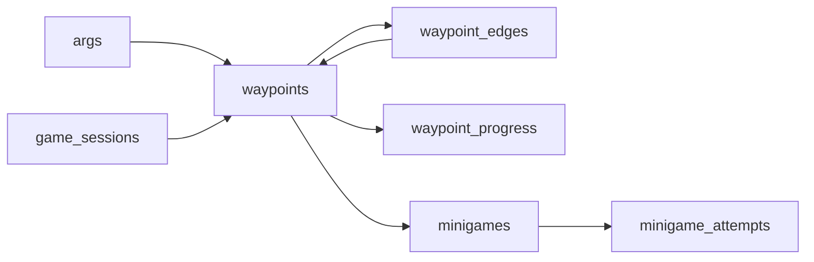

# Waypoint & Graph Entities

<cite>
**Referenced Files in This Document**
- [schema.sql](file://database/schema.sql)
- [Waypoint.js](file://server/src/models/Waypoint.js)
- [WaypointEdge.js](file://server/src/models/WaypointEdge.js)
- [WaypointProgress.js](file://server/src/models/WaypointProgress.js)
- [argController.js](file://server/src/controllers/argController.js)
- [gameController.js](file://server/src/controllers/gameController.js)
- [waypoint-authoring.md](file://warg-docs/docs/2-architecture-and-design/waypoint-authoring.md)
- [edit_warg.js](file://client/scripts/edit_warg.js)
- [fix_wp.js](file://server/fix_wp.js)
- [dump_wp_mysql.js](file://server/dump_wp_mysql.js)
</cite>

## Table of Contents
1. [Introduction](#introduction)
2. [Project Structure](#project-structure)
3. [Core Components](#core-components)
4. [Architecture Overview](#architecture-overview)
5. [Detailed Component Analysis](#detailed-component-analysis)
6. [Dependency Analysis](#dependency-analysis)
7. [Performance Considerations](#performance-considerations)
8. [Troubleshooting Guide](#troubleshooting-guide)
9. [Conclusion](#conclusion)

## Introduction
This document provides comprehensive data model documentation for the Waypoint and related graph entities in the WARG Platform. It focuses on:
- The waypoints table structure, including geospatial POINT geometry using SRID 4326 (WGS 84), validation_radius_m for proximity checks, sort_order for navigation sequence, and relationship to ARGs.
- The waypoint_edges table implementing directed graph relationships between waypoints with conditions_json for branching narrative logic based on minigame outcomes.
- Spatial indexing via SPATIAL INDEX spx_wp_loc, edge constraints ensuring valid graph topology, and how waypoints form a Directed Acyclic Graph (DAG) supporting complex gameplay progression.
- Field definitions, spatial data handling, graph traversal patterns, and business rules for waypoint creation, validation, and pathfinding.

## Project Structure
The waypoint and graph-related functionality spans database schema, Sequelize models, server controllers, client authoring UI, and design documentation:
- Database schema defines tables, indexes, and foreign keys.
- Sequelize models mirror the schema for application-level access.
- Controllers implement graph traversal, session initialization, arrival checks, and edge condition evaluation.
- Client-side editor visualizes and validates DAG edges before persistence.
- Design docs explain authoring UX and graph semantics.

**Diagram sources**
- [schema.sql:160-203](file://database/schema.sql#L160-L203)
- [schema.sql:212-246](file://database/schema.sql#L212-L246)
- [schema.sql:287-345](file://database/schema.sql#L287-L345)
- [Waypoint.js:4-17](file://server/src/models/Waypoint.js#L4-L17)
- [WaypointEdge.js:4-13](file://server/src/models/WaypointEdge.js#L4-L13)
- [WaypointProgress.js:4-15](file://server/src/models/WaypointProgress.js#L4-L15)
- [argController.js:127-148](file://server/src/controllers/argController.js#L127-L148)
- [argController.js:292-317](file://server/src/controllers/argController.js#L292-L317)
- [gameController.js:40-83](file://server/src/controllers/gameController.js#L40-L83)
- [gameController.js:85-161](file://server/src/controllers/gameController.js#L85-L161)
- [gameController.js:163-200](file://server/src/controllers/gameController.js#L163-L200)
- [edit_warg.js:109-127](file://client/scripts/edit_warg.js#L109-L127)
- [waypoint-authoring.md:1-45](file://warg-docs/docs/2-architecture-and-design/waypoint-authoring.md#L1-L45)

**Section sources**
- [schema.sql:160-203](file://database/schema.sql#L160-L203)
- [Waypoint.js:4-17](file://server/src/models/Waypoint.js#L4-L17)
- [WaypointEdge.js:4-13](file://server/src/models/WaypointEdge.js#L4-L13)
- [WaypointProgress.js:4-15](file://server/src/models/WaypointProgress.js#L4-L15)
- [argController.js:127-148](file://server/src/controllers/argController.js#L127-L148)
- [argController.js:292-317](file://server/src/controllers/argController.js#L292-L317)
- [gameController.js:40-83](file://server/src/controllers/gameController.js#L40-L83)
- [gameController.js:85-161](file://server/src/controllers/gameController.js#L85-L161)
- [gameController.js:163-200](file://server/src/controllers/gameController.js#L163-L200)
- [edit_warg.js:109-127](file://client/scripts/edit_warg.js#L109-L127)
- [waypoint-authoring.md:1-45](file://warg-docs/docs/2-architecture-and-design/waypoint-authoring.md#L1-L45)

## Core Components
- Waypoint: Geospatial node representing a challenge or location within an ARG. Includes title, description, POINT geometry (SRID 4326), validation_radius_m for proximity checks, and sort_order for navigation sequencing.
- WaypointEdge: Directed edge from one waypoint to another, optionally gated by conditions_json describing required minigame outcomes.
- WaypointProgress: Per-user per-waypoint state machine tracking locked/unlocked/completed/skipped status, timestamps, attempts, and points earned.
- Minigame and MinigameAttempt: Define the challenge at a waypoint and record player outcomes used by edge conditions.
- GameSession: Tracks overall game state and completion.

Key responsibilities:
- Waypoint stores spatial data and metadata; supports proximity-based arrival checks.
- WaypointEdge encodes graph topology and conditional branching.
- WaypointProgress tracks player progression and unlocks.
- Controllers orchestrate graph traversal, session initialization, arrival validation, and condition evaluation.

**Section sources**
- [schema.sql:160-203](file://database/schema.sql#L160-L203)
- [schema.sql:212-246](file://database/schema.sql#L212-L246)
- [schema.sql:287-345](file://database/schema.sql#L287-L345)
- [Waypoint.js:4-17](file://server/src/models/Waypoint.js#L4-L17)
- [WaypointEdge.js:4-13](file://server/src/models/WaypointEdge.js#L4-L13)
- [WaypointProgress.js:4-15](file://server/src/models/WaypointProgress.js#L4-L15)

## Architecture Overview
The waypoint graph is a relational representation of a directed graph where:
- Nodes are waypoints with geospatial coordinates.
- Edges define allowed transitions and optional branching conditions.
- Progress records track per-user states.
- Controllers compute roots, evaluate conditions, and enforce game completion.

**Diagram sources**
- [schema.sql:160-203](file://database/schema.sql#L160-L203)
- [schema.sql:212-246](file://database/schema.sql#L212-L246)
- [schema.sql:287-345](file://database/schema.sql#L287-L345)
- [Waypoint.js:4-17](file://server/src/models/Waypoint.js#L4-L17)
- [WaypointEdge.js:4-13](file://server/src/models/WaypointEdge.js#L4-L13)
- [WaypointProgress.js:4-15](file://server/src/models/WaypointProgress.js#L4-L15)

## Detailed Component Analysis

### Waypoints Table and Model
- Primary key: waypoint_id (auto-increment).
- Relationship to ARGs: arg_id references args.arg_id with ON DELETE CASCADE.
- Geospatial field: location is a POINT with SRID 4326 (WGS 84).
- Proximity check: validation_radius_m defaults to 30 meters; used to determine if a player is near enough to interact.
- Navigation sequence: sort_order defaults to 0; intended for ordering within an ARG.
- Timestamps: created_at and updated_at managed automatically.
- Indexes: idx_wp_arg for arg_id queries; SPATIAL INDEX spx_wp_loc for spatial operations.

Model mapping:
- Sequelize DataTypes.GEOMETRY('POINT', 4326) mirrors the MySQL POINT SRID 4326 definition.
- validation_radius_m and sort_order types match SMALLINT UNSIGNED defaults.

Spatial data handling:
- Creation/update uses ST_GeomFromText with lat/lng order to construct POINT(lat lng) in SRID 4326.
- A migration utility corrects reversed coordinate pairs when needed.
- Dump utilities export WKT for inspection.

Business rules:
- Each waypoint belongs to exactly one ARG.
- Proximity validation determines whether a player can attempt the associated minigame(s).

**Section sources**
- [schema.sql:160-179](file://database/schema.sql#L160-L179)
- [Waypoint.js:4-17](file://server/src/models/Waypoint.js#L4-L17)
- [argController.js:257-263](file://server/src/controllers/argController.js#L257-L263)
- [argController.js:199-203](file://server/src/controllers/argController.js#L199-L203)
- [fix_wp.js:4-8](file://server/fix_wp.js#L4-L8)
- [dump_wp_mysql.js:4-9](file://server/dump_wp_mysql.js#L4-L9)

### WaypointEdges Table and Model
- Purpose: Encodes directed edges from predecessor to successor waypoints.
- Fields:
  - edge_id: primary key.
  - arg_id: scoped to an ARG.
  - from_waypoint_id: predecessor node.
  - to_waypoint_id: successor node.
  - conditions_json: optional JSON array of conditions keyed by game_id and outcome.
- Constraints:
  - Unique pair constraint on (from_waypoint_id, to_waypoint_id) prevents duplicate edges.
  - Foreign keys reference waypoints with ON DELETE CASCADE.
  - Indexes: idx_edge_arg for ARG-scoped queries; idx_edge_to for reverse lookups.

Branching logic:
- conditions_json contains entries like { game_id, outcome }, evaluated against MinigameAttempt records.
- Multiple outcomes for the same game_id are treated as OR; multiple games are ANDed together.

Persistence:
- Controllers map frontend triggers to backend conditions_json during ARG creation/update.
- Frontend editor parses and serializes conditions_json for visualization.

**Section sources**
- [schema.sql:183-203](file://database/schema.sql#L183-L203)
- [WaypointEdge.js:4-13](file://server/src/models/WaypointEdge.js#L4-L13)
- [argController.js:127-148](file://server/src/controllers/argController.js#L127-L148)
- [argController.js:292-317](file://server/src/controllers/argController.js#L292-L317)
- [edit_warg.js:109-127](file://client/scripts/edit_warg.js#L109-L127)

### WaypointProgress Table and Model
- Tracks per-user progress per waypoint.
- Fields:
  - user_id and waypoint_id composite primary key.
  - status: enum locked/unlocked/completed/skipped.
  - unlocked_at and completed_at timestamps.
  - attempts count and points_earned.
- Relationships:
  - FK to users and waypoints with ON DELETE CASCADE.
  - Index on waypoint_id for efficient queries.

Gameplay semantics:
- Roots (in-degree 0) are initially unlocked; other nodes remain locked until predecessors complete and conditions allow unlocking.
- Completion occurs when no further unlocked waypoints exist.

**Section sources**
- [schema.sql:308-324](file://database/schema.sql#L308-L324)
- [WaypointProgress.js:4-15](file://server/src/models/WaypointProgress.js#L4-L15)
- [gameController.js:40-83](file://server/src/controllers/gameController.js#L40-L83)
- [gameController.js:85-161](file://server/src/controllers/gameController.js#L85-L161)

### Graph Traversal and Pathfinding
- Root detection:
  - Compute all to_nodes from edges; waypoints not appearing as to_nodes are roots.
  - If no edges exist, treat all waypoints as roots.
  - If every node has incoming edges (closed cycle), fallback to treating all waypoints as roots.
- Unlocking:
  - On session start, root waypoints are set to unlocked with timestamp.
  - During getGameState, if no unlocked nodes exist but some are completed, mark session as completed.
- Edge condition evaluation:
  - Group conditions by game_id; for each game, allowed outcomes are ORed.
  - Across games, conditions are ANDed.
  - Uses latest MinigameAttempt per game for the user.

**Diagram sources**
- [gameController.js:40-83](file://server/src/controllers/gameController.js#L40-L83)

**Section sources**
- [gameController.js:40-83](file://server/src/controllers/gameController.js#L40-L83)
- [gameController.js:85-161](file://server/src/controllers/gameController.js#L85-L161)
- [waypoint-authoring.md:16-23](file://warg-docs/docs/2-architecture-and-design/waypoint-authoring.md#L16-L23)

### Branching Narrative Logic
- Conditions are stored as JSON arrays of objects with game_id and outcome.
- Evaluation groups outcomes by game_id and checks against MinigameAttempt records.
- Unconditional edges default to true when conditions_json is null or empty.

**Diagram sources**
- [gameController.js:5-38](file://server/src/controllers/gameController.js#L5-L38)

**Section sources**
- [gameController.js:5-38](file://server/src/controllers/gameController.js#L5-L38)
- [argController.js:127-148](file://server/src/controllers/argController.js#L127-L148)
- [argController.js:292-317](file://server/src/controllers/argController.js#L292-L317)
- [edit_warg.js:109-127](file://client/scripts/edit_warg.js#L109-L127)

### Spatial Data Handling and Proximity Checks
- Location storage: POINT with SRID 4326 ensures geographic coordinates are interpreted correctly.
- Proximity validation:
  - Server computes distance using ST_Distance_Sphere between current device location and waypoint.location.
  - Compares distance to validation_radius_m to determine if the player is within range.
- Coordinate order:
  - Lat/lng order is enforced when constructing POINT(lat lng).
  - Utility script fixes reversed coordinates when necessary.

**Diagram sources**
- [gameController.js:163-200](file://server/src/controllers/gameController.js#L163-L200)
- [schema.sql:160-179](file://database/schema.sql#L160-L179)
- [fix_wp.js:4-8](file://server/fix_wp.js#L4-L8)

**Section sources**
- [gameController.js:163-200](file://server/src/controllers/gameController.js#L163-L200)
- [schema.sql:160-179](file://database/schema.sql#L160-L179)
- [fix_wp.js:4-8](file://server/fix_wp.js#L4-L8)
- [dump_wp_mysql.js:4-9](file://server/dump_wp_mysql.js#L4-L9)

### Business Rules for Waypoint Creation, Validation, and Pathfinding
- Creation:
  - Waypoints must include valid POINT(lat lng) in SRID 4326.
  - Edges must reference existing waypoints and be unique per pair.
- Validation:
  - Creator Studio enforces DAG structure via BFS cycle detection; cyclic edges are blocked.
  - Backend is permissive but relies on frontend validation to maintain DAG integrity.
- Pathfinding:
  - Roots are dynamically computed from edges; disconnected graphs unlock all nodes.
  - Completion is determined by absence of further unlocked waypoints.

**Diagram sources**
- [waypoint-authoring.md:32-38](file://warg-docs/docs/2-architecture-and-design/waypoint-authoring.md#L32-L38)

**Section sources**
- [waypoint-authoring.md:32-38](file://warg-docs/docs/2-architecture-and-design/waypoint-authoring.md#L32-L38)
- [argController.js:127-148](file://server/src/controllers/argController.js#L127-L148)
- [argController.js:292-317](file://server/src/controllers/argController.js#L292-L317)

## Dependency Analysis
- Waypoint depends on ARGs via arg_id.
- WaypointEdge depends on two Waypoint instances (from/to) and is scoped to an ARG.
- WaypointProgress depends on User and Waypoint.
- Minigame depends on Waypoint; MinigameAttempt depends on Minigame.
- GameSession indirectly depends on Waypoints through edges and progress.

**Diagram sources**
- [schema.sql:114-151](file://database/schema.sql#L114-L151)
- [schema.sql:160-203](file://database/schema.sql#L160-L203)
- [schema.sql:212-246](file://database/schema.sql#L212-L246)
- [schema.sql:287-345](file://database/schema.sql#L287-L345)

**Section sources**
- [schema.sql:114-151](file://database/schema.sql#L114-L151)
- [schema.sql:160-203](file://database/schema.sql#L160-L203)
- [schema.sql:212-246](file://database/schema.sql#L212-L246)
- [schema.sql:287-345](file://database/schema.sql#L287-L345)

## Performance Considerations
- Spatial queries:
  - Use SPATIAL INDEX spx_wp_loc for proximity searches and nearest-neighbor queries.
  - ST_Distance_Sphere is computationally intensive; cache or limit scope when possible.
- Graph traversal:
  - Precompute root nodes per ARG to avoid repeated scans.
  - Cache edge lists and adjacency maps for frequently accessed ARGs.
- Condition evaluation:
  - Batch MinigameAttempt lookups grouped by game_id to reduce round trips.
- Index usage:
  - Ensure idx_wp_arg, idx_edge_arg, idx_edge_to, and idx_wp_prog_waypoint are leveraged in queries.

[No sources needed since this section provides general guidance]

## Troubleshooting Guide
- Reversed coordinates:
  - Symptom: Waypoints appear at incorrect locations due to swapped lat/lng.
  - Resolution: Run fix_wp.js to normalize POINT(lat lng) order.
- Missing spatial index:
  - Symptom: Slow proximity checks.
  - Resolution: Verify SPATIAL INDEX spx_wp_loc exists on waypoints.location.
- Cyclic edges:
  - Symptom: Creator Studio blocks edge creation; ensure DAG enforcement is active.
  - Resolution: Remove back-edge or restructure graph to eliminate cycles.
- Condition evaluation failures:
  - Symptom: Edges not unlocking despite minigame completion.
  - Resolution: Verify conditions_json matches actual MinigameAttempt outcomes and game_ids.

**Section sources**
- [fix_wp.js:4-8](file://server/fix_wp.js#L4-L8)
- [schema.sql:176-176](file://database/schema.sql#L176-L176)
- [waypoint-authoring.md:32-38](file://warg-docs/docs/2-architecture-and-design/waypoint-authoring.md#L32-L38)
- [gameController.js:5-38](file://server/src/controllers/gameController.js#L5-L38)

## Conclusion
The Waypoint and related graph entities provide a robust foundation for geospatial, branching ARG gameplay. The waypoints table captures precise location data with SRID 4326, while waypoint_edges encode directed graph topology and conditional branching. Spatial indexing enables efficient proximity checks, and controller logic implements dynamic root discovery, condition evaluation, and completion detection. Together, these components support complex, non-linear narratives while maintaining clear data integrity and performance characteristics.

[No sources needed since this section summarizes without analyzing specific files]