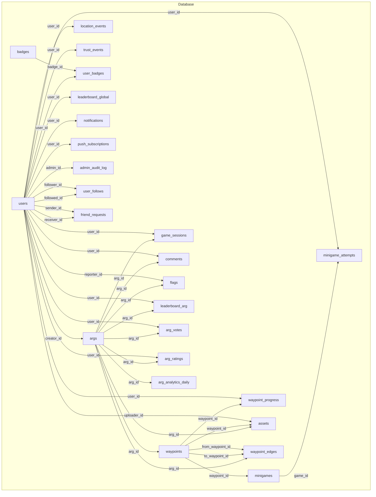
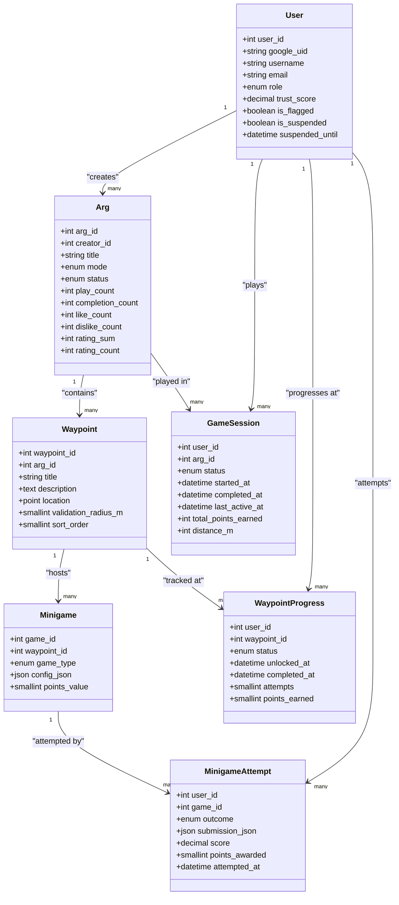
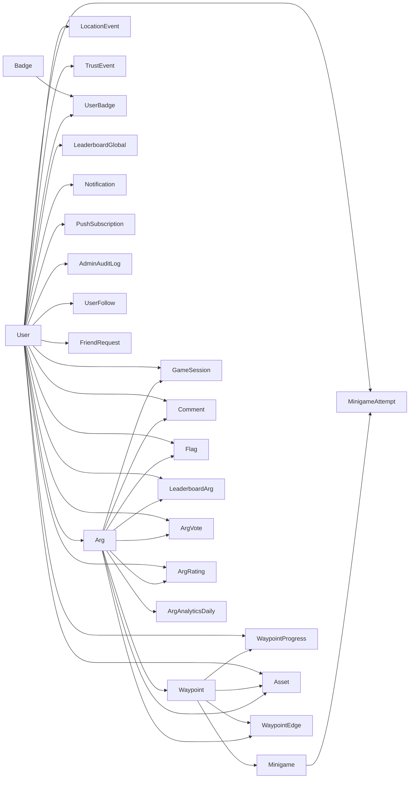

# Database Design

<cite>
**Referenced Files in This Document**
- [schema.sql](file://database/schema.sql)
- [index.js](file://server/src/models/index.js)
- [User.js](file://server/src/models/User.js)
- [Arg.js](file://server/src/models/Arg.js)
- [Waypoint.js](file://server/src/models/Waypoint.js)
- [GameSession.js](file://server/src/models/GameSession.js)
- [Minigame.js](file://server/src/models/Minigame.js)
- [WaypointProgress.js](file://server/src/models/WaypointProgress.js)
- [MinigameAttempt.js](file://server/src/models/MinigameAttempt.js)
- [LocationEvent.js](file://server/src/models/LocationEvent.js)
- [database.js](file://server/src/config/database.js)
- [schema.md](file://warg-docs/docs/3-database/schema.md)
</cite>

## Table of Contents
1. [Introduction](#introduction)
2. [Project Structure](#project-structure)
3. [Core Components](#core-components)
4. [Architecture Overview](#architecture-overview)
5. [Detailed Component Analysis](#detailed-component-analysis)
6. [Dependency Analysis](#dependency-analysis)
7. [Performance Considerations](#performance-considerations)
8. [Troubleshooting Guide](#troubleshooting-guide)
9. [Conclusion](#conclusion)
10. [Appendices](#appendices)

## Introduction
This document provides comprehensive data model documentation for the WARG Platform’s MySQL database schema. It covers entity relationships among Users, Args (games), Waypoints, Minigames, GameSessions, and supporting tables such as progress tracking, attempts, location events, moderation, badges, leaderboards, and analytics. The schema uses SRID 4326 (WGS 84) for geospatial POINT geometry to represent real-world coordinates. We also document Sequelize ORM models, constraints, indexes, spatial considerations, query optimization strategies, lifecycle management, backup strategies, and migration procedures.

## Project Structure
The database is defined by a single SQL schema file and mirrored by Sequelize models that define associations and types. Documentation also includes conceptual ER diagrams grouped by functional areas.

**Diagram sources**
- [schema.sql:15-691](file://database/schema.sql#L15-L691)

**Section sources**
- [schema.sql:1-691](file://database/schema.sql#L1-L691)
- [schema.md:1-205](file://warg-docs/docs/3-database/schema.md#L1-L205)

## Core Components
This section summarizes the primary entities and their responsibilities:
- Users: Identity, roles, trust profile, suspension state, and meta-progression aggregates.
- Args: Games authored by creators with curation lifecycle and denormalized stats.
- Waypoints: Geospatial nodes within an ARG with validation radius and ordering.
- Minigames: Challenge definitions attached to waypoints with flexible JSON configuration.
- GameSessions: Per-user per-ARG attempt tracking with status and aggregate metrics.
- Supporting tables: Progress, attempts, assets, comments, flags, ratings, votes, badges, leaderboards, analytics, notifications, push subscriptions, audit logs, social follows/friend requests, and trust/location event logs.

Key design principles:
- Spatial data uses MySQL POINT with SRID 4326 for WGS 84 coordinates.
- Denormalized counters on ARGS reduce read load for popular aggregations.
- Many high-volume tables include targeted indexes and spatial indexes where applicable.
- Soft deletes and status fields support moderation and lifecycle control.

**Section sources**
- [schema.sql:15-691](file://database/schema.sql#L15-L691)

## Architecture Overview
The database architecture centers around users creating args, which contain waypoints. Each waypoint hosts minigames and can be connected via directed edges to form branching narratives. Player progression is tracked through game sessions, waypoint progress, and minigame attempts. Location and trust events feed anti-spoofing and safety systems. Community features include ratings, votes, comments, flags, badges, and leaderboards.

**Diagram sources**
- [schema.sql:15-345](file://database/schema.sql#L15-L345)
- [User.js:4-25](file://server/src/models/User.js#L4-L25)
- [Arg.js:4-28](file://server/src/models/Arg.js#L4-L28)
- [Waypoint.js:4-17](file://server/src/models/Waypoint.js#L4-L17)
- [Minigame.js:4-15](file://server/src/models/Minigame.js#L4-L15)
- [GameSession.js:4-16](file://server/src/models/GameSession.js#L4-L16)
- [WaypointProgress.js:4-15](file://server/src/models/WaypointProgress.js#L4-L15)
- [MinigameAttempt.js:4-15](file://server/src/models/MinigameAttempt.js#L4-L15)

## Detailed Component Analysis

### Users and Social Graph
- Users table defines identity, authentication linkage, role-based access, trust scoring, and suspension controls.
- Social graph includes asymmetric follows and explicit friend requests with statuses.
- Notifications and push subscriptions enable user alerts across platforms.

Key constraints and indexes:
- Unique keys on google_uid, username, email.
- Indexes on role and trust_score for filtering and ranking.
- Foreign keys enforce referential integrity for follow relationships and notifications.

Sequelize associations:
- Self-referential many-to-many via user_follows for followers/following.
- One-to-many notifications per user.
- Push subscriptions linked to users.

**Section sources**
- [schema.sql:15-107](file://database/schema.sql#L15-L107)
- [index.js:26-36](file://server/src/models/index.js#L26-L36)
- [User.js:4-25](file://server/src/models/User.js#L4-L25)

### Args (Games)
- Args represent games authored by users with curation lifecycle states and metadata.
- Denormalized counters (play_count, completion_count, likes/dislikes, rating sums/counts) optimize read-heavy dashboards.
- Status transitions: unpublished → published → retired.

Indexes:
- Creator, status, mode, genre, like_count, published_at for efficient queries.

Associations:
- Belongs to User (creator).
- Has many waypoints, edges, assets, game sessions, votes, ratings, comments, flags, analytics.

**Section sources**
- [schema.sql:114-151](file://database/schema.sql#L114-L151)
- [Arg.js:4-28](file://server/src/models/Arg.js#L4-L28)
- [index.js:38-40](file://server/src/models/index.js#L38-L40)

### Waypoints and Edges
- Waypoints are geospatial nodes tied to an ARG with a validation radius and ordering.
- Directed edges connect predecessor to successor waypoints with optional JSON conditions based on minigame outcomes.

Spatial constraints:
- location is a POINT with SRID 4326 (WGS 84).
- Spatial index spx_wp_loc enables proximity queries.

Associations:
- Belongs to Arg; has many minigames, assets, edges, progress records.
- Edges reference two waypoints (from/to) and the parent ARG.

**Section sources**
- [schema.sql:160-203](file://database/schema.sql#L160-L203)
- [Waypoint.js:4-17](file://server/src/models/Waypoint.js#L4-L17)
- [index.js:42-50](file://server/src/models/index.js#L42-L50)

### Minigames
- Minigames define challenge types and per-type configurations stored as JSON.
- Points value determines rewards upon successful completion.

Types include GPS proximity, text answer, QR/barcode scan, AR object recognition, color matching, shape matching, photo submission, texture/SIFT matching, symmetry finding, word scramble, plaque scanning.

Associations:
- Belongs to Waypoint; has many attempts.

**Section sources**
- [schema.sql:212-246](file://database/schema.sql#L212-L246)
- [Minigame.js:4-15](file://server/src/models/Minigame.js#L4-L15)
- [index.js:52-54](file://server/src/models/index.js#L52-L54)

### Game Sessions and Progression
- GameSessions track per-user per-ARG attempts with status and aggregated metrics (points earned, distance walked).
- WaypointProgress tracks per-waypoint state (locked/unlocked/completed/skipped), timestamps, attempts, and points earned.
- MinigameAttempts store latest outcome, normalized score, submission payload, and points awarded.

Constraints:
- Composite primary keys ensure one row per user per resource.
- Indexes on status and game_id for performance.

Associations:
- Belongs to User and Arg (sessions).
- Belongs to User and Waypoint (progress).
- Belongs to User and Minigame (attempts).

**Section sources**
- [schema.sql:287-345](file://database/schema.sql#L287-L345)
- [GameSession.js:4-16](file://server/src/models/GameSession.js#L4-L16)
- [WaypointProgress.js:4-15](file://server/src/models/WaypointProgress.js#L4-L15)
- [MinigameAttempt.js:4-15](file://server/src/models/MinigameAttempt.js#L4-L15)
- [index.js:61-73](file://server/src/models/index.js#L61-L73)

### Assets and Multimedia
- Assets store binary content (images, audio, video, 3D models, AR markers) with metadata including MIME type and size.
- Optional links to Waypoint or Arg allow flexible organization.

Foreign key behavior:
- ON DELETE SET NULL for optional references to waypoints and args.

**Section sources**
- [schema.sql:257-279](file://database/schema.sql#L257-L279)
- [index.js:56-59](file://server/src/models/index.js#L56-L59)

### Location Tracking and Anti-Spoofing
- LocationEvents capture raw GPS breadcrumbs with accuracy, speed, heading, timestamp, suspicious flag, and contextual JSON flags.
- TrustEvents log behavioral anomalies affecting trust scores.

Spatial and temporal indexing:
- Spatial index on location for proximity checks.
- Indexes on user_id and recorded_at for time-series queries.

**Section sources**
- [schema.sql:354-390](file://database/schema.sql#L354-L390)
- [LocationEvent.js:4-18](file://server/src/models/LocationEvent.js#L4-L18)
- [index.js:75-77](file://server/src/models/index.js#L75-L77)

### Ratings, Votes, Comments, Flags
- ArgVotes and ArgRatings capture community feedback with unique constraints per user per ARG.
- Comments support threading via parent_id and soft deletes.
- Flags provide moderation workflow with statuses and resolver attribution.

Validation:
- Stars constrained between 1 and 5.

**Section sources**
- [schema.sql:397-456](file://database/schema.sql#L397-L456)
- [index.js:78-106](file://server/src/models/index.js#L78-L106)

### Badges and Meta-Progression
- Badges define award criteria in JSON; user_badges record awards with uniqueness per user-badge pair.
- Leaderboards maintain per-ARG and global rankings with computed ranks and timestamps.

**Section sources**
- [schema.sql:500-569](file://database/schema.sql#L500-L569)
- [index.js:82-89](file://server/src/models/index.js#L82-L89)

### Analytics and Admin Audit
- arg_analytics_daily stores daily rolled-up stats per ARG consumed by dashboards.
- admin_audit_log records administrative actions with target context.

**Section sources**
- [schema.sql:577-637](file://database/schema.sql#L577-L637)

### Views
- v_arg_rating computes average star rating from denormalized fields.
- v_player_stats aggregates player profile statistics.
- v_friend_activity shows followed users’ current activity.

**Section sources**
- [schema.sql:645-683](file://database/schema.sql#L645-L683)

## Dependency Analysis
The following diagram maps core dependencies among major entities and highlights foreign key relationships and association patterns.

**Diagram sources**
- [schema.sql:15-691](file://database/schema.sql#L15-L691)
- [index.js:24-110](file://server/src/models/index.js#L24-L110)

**Section sources**
- [schema.sql:15-691](file://database/schema.sql#L15-L691)
- [index.js:24-110](file://server/src/models/index.js#L24-L110)

## Performance Considerations
- Spatial queries: Use SPATIAL INDEX on POINT columns (waypoints.location, location_events.location) for proximity searches and containment checks. Ensure queries leverage ST_Distance_Sphere or similar functions compatible with SRID 4326.
- High-volume writes: location_events may grow rapidly; consider partitioning by recorded_at ranges and archiving older partitions.
- Denormalized counters: Keep args.play_count, completion_count, like_count, dislike_count, rating_sum, rating_count updated via application logic or triggers to avoid expensive aggregations.
- Index strategy:
  - Composite indexes for frequent filters (e.g., idx_arg_status, idx_le_user+recorded_at).
  - Unique constraints prevent duplicate votes/ratings and enforce business rules.
- Connection pooling: Sequelize pool settings (max/min/acquire/idle) tuned for workload; SSL enabled outside test environments.
- Query optimization:
  - Prefer indexed columns in WHERE clauses.
  - Avoid SELECT *; project only needed fields.
  - Batch updates for bulk operations (e.g., progress updates).
- Storage: Large binaries in assets should be considered for external storage (object storage) to reduce DB size; keep only metadata and pointers in DB if feasible.

[No sources needed since this section provides general guidance]

## Troubleshooting Guide
Common issues and resolutions:
- Spatial constraint errors: Ensure POINT values use SRID 4326 when inserting into waypoints.location and location_events.location. Validate coordinates are within valid lat/lng bounds.
- Foreign key violations: Deleting referenced rows (e.g., users, args, waypoints) will cascade depending on FK definitions; verify ON DELETE CASCADE vs SET NULL behaviors before destructive operations.
- Duplicate entries: Unique constraints on uq_users_username, uq_users_email, uq_arg_vote, uq_arg_rating, uq_edge, etc., will reject duplicates; handle conflicts gracefully in application layer.
- Timezone and timestamps: DATETIME fields default to CURRENT_TIMESTAMP; ensure client applications send consistent timezone-aware timestamps or rely on server defaults.
- Connection failures: Sequelize retry options cover common connection errors; check DATABASE_URL and SSL configuration in production.

**Section sources**
- [schema.sql:15-691](file://database/schema.sql#L15-L691)
- [database.js:4-34](file://server/src/config/database.js#L4-L34)

## Conclusion
The WARG Platform’s database schema is designed for scalability, spatial awareness, and rich gameplay mechanics. It balances normalization with strategic denormalization to optimize read performance while enforcing strong referential integrity and validation constraints. Sequelize models mirror the schema and define clear associations for application logic. With careful attention to spatial indexing, high-volume write patterns, and robust error handling, the system supports complex ARG experiences, community features, and operational oversight.

[No sources needed since this section summarizes without analyzing specific files]

## Appendices

### Data Lifecycle Management
- Users: Creation via OAuth/local auth; suspension and trust score adjustments over time.
- Args: Lifecycle transitions managed by creators/admins; retirement archives historical data.
- Waypoints/Minigames: Created during ARG authoring; changes propagate to progress/attempts.
- GameSessions/Progress/Attempts: Active sessions update frequently; completed sessions become archival.
- Location/Trust Events: Continuous ingestion; periodic aggregation and anomaly detection.
- Moderation: Flags and comments evolve; resolved items archived or redacted.
- Badges/Leaderboards: Awarded and ranked periodically based on achievements and performance.

[No sources needed since this section provides general guidance]

### Backup Strategies
- Full logical backups using mysqldump or equivalent tools; include views and triggers.
- Incremental backups via binlogs for point-in-time recovery.
- Separate backups for large BLOBs (assets) if stored externally.
- Test restore procedures regularly to validate integrity.

[No sources needed since this section provides general guidance]

### Migration Procedures
- Apply schema.sql as baseline; version migrations for incremental changes.
- Use Sequelize migrations alongside SQL migrations to keep ORM and schema in sync.
- Back up before applying migrations; rollback plans for failed migrations.
- Validate constraints and indexes post-migration; run integration tests against staging.

[No sources needed since this section provides general guidance]