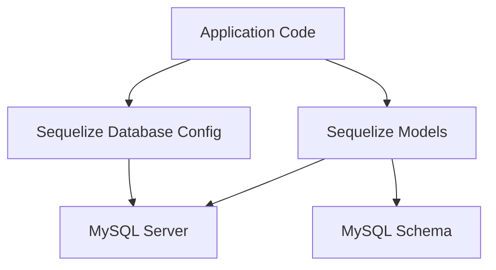
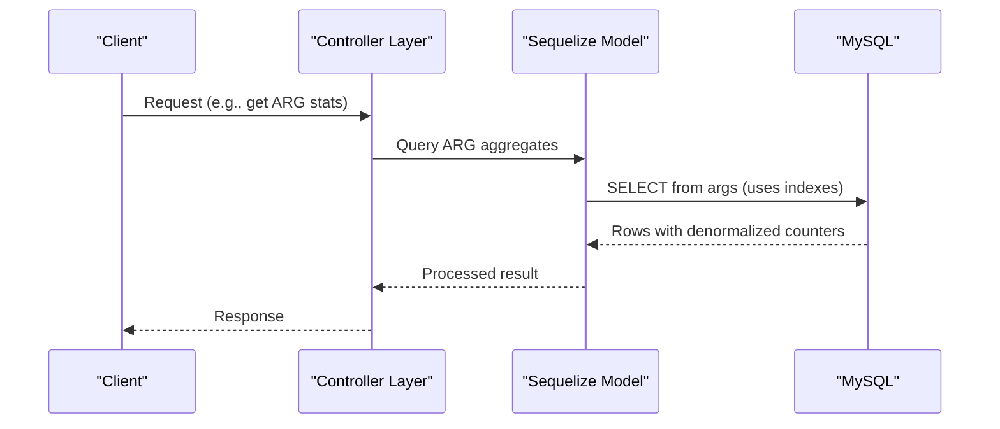
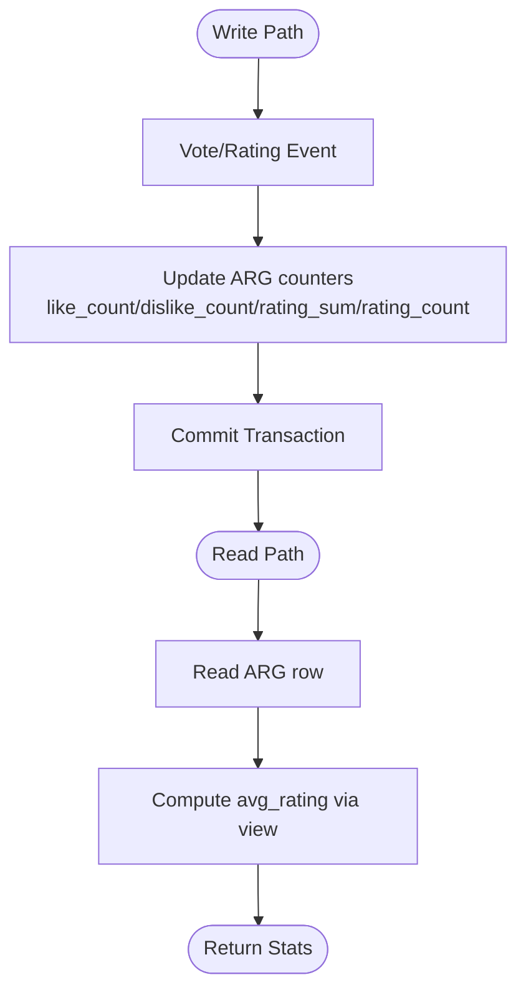
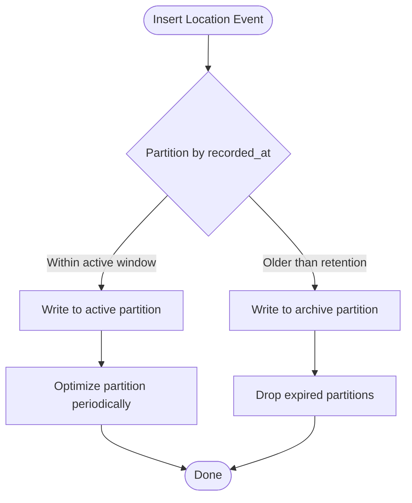
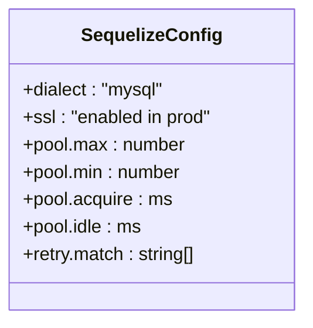
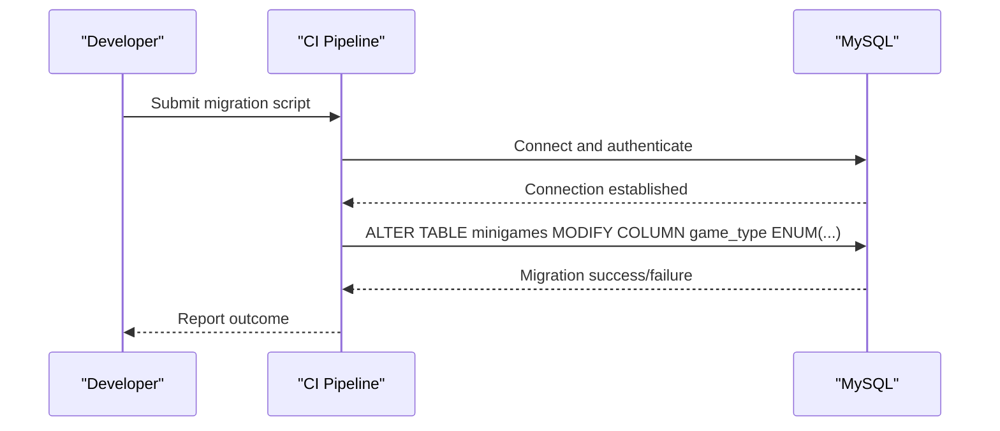
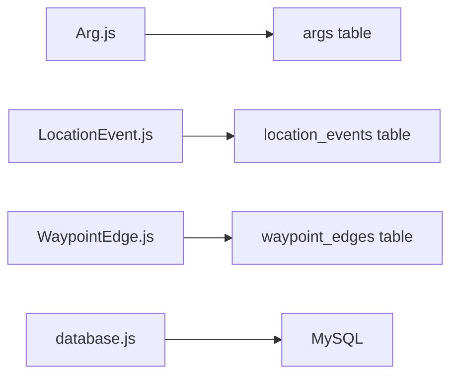

# Performance Optimization

<cite>
**Referenced Files in This Document**
- [schema.sql](file://database/schema.sql)
- [database.js](file://server/src/config/database.js)
- [Arg.js](file://server/src/models/Arg.js)
- [LocationEvent.js](file://server/src/models/LocationEvent.js)
- [WaypointEdge.js](file://server/src/models/WaypointEdge.js)
- [migrate_minigames_enum.js](file://server/migrate_minigames_enum.js)
- [migrate_minigames_enum_plaque.js](file://server/migrate_minigames_enum_plaque.js)
- [test_loc.js](file://server/test_loc.js)
</cite>

## Table of Contents
1. [Introduction](#introduction)
2. [Project Structure](#project-structure)
3. [Core Components](#core-components)
4. [Architecture Overview](#architecture-overview)
5. [Detailed Component Analysis](#detailed-component-analysis)
6. [Dependency Analysis](#dependency-analysis)
7. [Performance Considerations](#performance-considerations)
8. [Troubleshooting Guide](#troubleshooting-guide)
9. [Conclusion](#conclusion)

## Introduction
This document explains database performance optimization strategies for the WARG Platform, focusing on indexing, denormalization, partitioning, connection pooling, query optimization, monitoring, schema design best practices, transaction management, backup and migration procedures, and scalability considerations. The guidance is grounded in the MySQL schema, Sequelize configuration, and model definitions present in the repository.

## Project Structure
The database layer centers around:
- A single authoritative MySQL schema file defining tables, indexes, spatial columns, views, and foreign keys.
- A centralized Sequelize configuration that manages connection pooling, SSL, retries, and dialect options.
- Sequelize models that mirror key schema entities and define additional application-level indexes.
- Migration scripts used to evolve ENUM values in production.

**Diagram sources**
- [database.js:1-38](file://server/src/config/database.js#L1-L38)
- [schema.sql:1-691](file://database/schema.sql#L1-L691)

**Section sources**
- [schema.sql:1-691](file://database/schema.sql#L1-L691)
- [database.js:1-38](file://server/src/config/database.js#L1-L38)

## Core Components
- MySQL schema with InnoDB engine, utf8mb4 charset, SRID 4326 spatial coordinates, primary keys, unique constraints, composite indexes, and spatial indexes.
- Denormalized aggregate counters on the ARG table to avoid expensive joins for leaderboard and profile statistics.
- High-volume location tracking table with spatial index and time-based indexes, plus a comment suggesting range partitioning by date.
- Sequelize connection pool with retry logic and environment-aware SSL configuration.
- Views providing computed average rating and aggregated player stats.

Key responsibilities:
- Indexing strategy: Primary keys, unique constraints, composite indexes, and spatial indexes are defined at the schema level.
- Denormalization: play_count, completion_count, like_count, dislike_count, rating_sum, and rating_count are stored directly on the ARG entity.
- Partitioning guidance: location_events includes an explicit note to consider PARTITION BY RANGE on recorded_at.
- Connection pooling: Pool size, idle timeout, acquire timeout, and retry behavior are configured centrally.

**Section sources**
- [schema.sql:15-44](file://database/schema.sql#L15-L44)
- [schema.sql:114-151](file://database/schema.sql#L114-L151)
- [schema.sql:160-179](file://database/schema.sql#L160-L179)
- [schema.sql:354-372](file://database/schema.sql#L354-L372)
- [schema.sql:645-683](file://database/schema.sql#L645-L683)
- [database.js:11-35](file://server/src/config/database.js#L11-L35)

## Architecture Overview
The data access path uses Sequelize models backed by the MySQL schema. Spatial queries leverage MySQL’s POINT type with SRID 4326. Aggregates are precomputed on the ARG row to reduce join complexity.

**Diagram sources**
- [Arg.js:4-28](file://server/src/models/Arg.js#L4-L28)
- [schema.sql:114-151](file://database/schema.sql#L114-L151)

## Detailed Component Analysis

### Indexing Strategy
Primary keys, unique constraints, and composite indexes are used to optimize lookups and enforce integrity:
- users: primary key user_id; unique google_uid, username, email; indexes on role and trust_score.
- args: primary key arg_id; indexes on creator_id, status, mode, genre, like_count, published_at.
- waypoints: primary key waypoint_id; index on arg_id; spatial index on location.
- waypoint_edges: primary key edge_id; unique constraint on (from_waypoint_id, to_waypoint_id); indexes on arg_id and to_waypoint_id.
- game_sessions: composite primary key (user_id, arg_id); index on status.
- minigame_attempts: composite primary key (user_id, game_id); index on game_id.
- location_events: primary key event_id; indexes on user_id and recorded_at; spatial index on location.
- arg_votes and arg_ratings: unique constraints per (arg_id, user_id); indexes on user_id.
- Leaderboard tables: unique constraints per (arg_id, user_id) or user_id; descending indexes on points/rank fields.
- Analytics daily rollup: unique constraint on (arg_id, stat_date); index on stat_date.

Spatial indexes:
- waypoints.location and location_events.location use SPATIAL INDEX with SRID 4326.

Composite indexes:
- user_follows: composite primary key (follower_id, followed_id).
- friend_requests: unique composite (sender_id, receiver_id).
- leaderboard_arg: composite index on (arg_id, points DESC).
- leaderboard_global: index on total_points DESC.

Recommendations aligned with current schema:
- Keep existing composite indexes for high-cardinality filters such as leaderboard ordering.
- Ensure queries match leading columns of composite indexes.
- Use spatial functions consistently with SRID 4326 to leverage spatial indexes.

**Section sources**
- [schema.sql:15-44](file://database/schema.sql#L15-L44)
- [schema.sql:55-84](file://database/schema.sql#L55-L84)
- [schema.sql:114-151](file://database/schema.sql#L114-L151)
- [schema.sql:160-203](file://database/schema.sql#L160-L203)
- [schema.sql:287-345](file://database/schema.sql#L287-L345)
- [schema.sql:354-372](file://database/schema.sql#L354-L372)
- [schema.sql:398-431](file://database/schema.sql#L398-L431)
- [schema.sql:536-569](file://database/schema.sql#L536-L569)
- [schema.sql:577-594](file://database/schema.sql#L577-L594)

### Denormalization Patterns for Aggregate Statistics
The ARG table stores denormalized counters:
- play_count, completion_count, like_count, dislike_count, rating_sum, rating_count.
- A view v_arg_rating computes avg_rating from rating_sum and rating_count.

Benefits:
- Reduces join complexity for leaderboards, ARG listings, and profile pages.
- Enables fast reads for frequently accessed metrics.

Operational notes:
- Counters must be updated atomically when votes, ratings, or completions occur.
- The schema comments indicate updates via triggers or application logic.

**Diagram sources**
- [schema.sql:114-151](file://database/schema.sql#L114-L151)
- [schema.sql:645-651](file://database/schema.sql#L645-L651)

**Section sources**
- [schema.sql:114-151](file://database/schema.sql#L114-L151)
- [schema.sql:645-651](file://database/schema.sql#L645-L651)
- [Arg.js:17-22](file://server/src/models/Arg.js#L17-L22)

### Partitioning Strategy for High-Volume Tables
The location_events table is designed for high write volume and includes:
- Indexes on user_id and recorded_at.
- A spatial index on location.
- A schema comment explicitly recommending PARTITION BY RANGE on recorded_at.

Recommended approach:
- Range-partition by date (e.g., monthly or weekly partitions) to improve pruning for time-bounded queries and simplify archival.
- Maintain a composite index on (user_id, recorded_at) within each partition if not already covered by the primary key.
- Archive old partitions offline and drop them after retention policies are met.

**Diagram sources**
- [schema.sql:354-372](file://database/schema.sql#L354-L372)

**Section sources**
- [schema.sql:354-372](file://database/schema.sql#L354-L372)

### Connection Pooling Configuration
Sequelize is configured with:
- Dialect: mysql.
- SSL enabled in non-test environments.
- Pool settings: max connections, min connections, acquire timeout, idle timeout.
- Retry configuration for transient connection errors.

Guidance:
- Tune pool.max based on CPU cores and database capacity.
- Adjust acquire/idle timeouts according to expected latency and concurrency.
- Monitor connection usage and adjust pool parameters under load.

**Diagram sources**
- [database.js:11-35](file://server/src/config/database.js#L11-L35)

**Section sources**
- [database.js:1-38](file://server/src/config/database.js#L1-L38)

### Query Optimization Techniques
- Prefer indexed columns in WHERE clauses:
  - users.role, users.trust_score.
  - args.status, args.mode, args.genre, args.published_at.
  - game_sessions.status.
  - minigame_attempts.game_id.
  - location_events.user_id, location_events.recorded_at.
- Use composite indexes effectively:
  - leaderboard_arg.arg_id with points DESC.
  - leaderboard_global.total_points DESC.
- Leverage spatial indexes:
  - waypoints.location and location_events.location with SRID 4326.
- Use views for read-heavy aggregations:
  - v_arg_rating for average star rating.
  - v_player_stats for profile summaries.

Best practices:
- Avoid selecting unnecessary columns.
- Use pagination for large result sets.
- Batch writes where possible to reduce round trips.
- Ensure transactions wrap related updates to maintain consistency.

**Section sources**
- [schema.sql:114-151](file://database/schema.sql#L114-L151)
- [schema.sql:287-345](file://database/schema.sql#L287-L345)
- [schema.sql:354-372](file://database/schema.sql#L354-L372)
- [schema.sql:536-569](file://database/schema.sql#L536-L569)
- [schema.sql:645-683](file://database/schema.sql#L645-L683)

### Monitoring Approaches
- Enable slow query logging in MySQL to identify long-running queries.
- Track connection pool utilization and retry events in application logs.
- Monitor spatial query performance using EXPLAIN and spatial index usage.
- Observe partition sizes and growth rates for location_events to plan archival.

[No sources needed since this section provides general guidance]

### Best Practices for Schema Design
- Normalize reference data but denormalize hot aggregates to reduce joins.
- Define clear primary keys and unique constraints to prevent duplicates.
- Create composite indexes matching common query patterns.
- Use appropriate data types (ENUM for constrained sets, JSON for flexible metadata).
- Keep timestamps and audit fields consistent across tables.

**Section sources**
- [schema.sql:15-44](file://database/schema.sql#L15-L44)
- [schema.sql:114-151](file://database/schema.sql#L114-L151)
- [schema.sql:212-246](file://database/schema.sql#L212-L246)
- [schema.sql:354-372](file://database/schema.sql#L354-L372)

### Transaction Management
- Wrap multi-step updates (e.g., incrementing ARG counters and recording votes/ratings) in transactions to ensure atomicity.
- Use short-lived transactions to minimize lock contention.
- Apply optimistic locking where applicable to handle concurrent updates.

[No sources needed since this section provides general guidance]

### Backup Strategies
- Schedule regular logical backups (e.g., mysqldump) for critical tables: users, args, game_sessions, location_events.
- Include spatial data and JSON columns in backups.
- Test restore procedures regularly.
- For high-volume tables like location_events, consider partition-level backups and archival.

[No sources needed since this section provides general guidance]

### Scalability Considerations
- Horizontal scaling:
  - Read replicas for analytics and leaderboards.
  - Partitioning for time-series data (location_events).
- Vertical scaling:
  - Increase memory for buffer pool to cache indexes and spatial data.
- Caching:
  - Cache ARG aggregates and leaderboard top-N results at the application layer.
- Sharding:
  - Consider sharding by user_id or arg_id for extremely high write volumes.

[No sources needed since this section provides general guidance]

### Migration Procedures for Schema Evolution
- Use migration scripts to alter ENUM values safely.
- Example migrations update minigames.game_type to include new values.
- Follow a safe rollout:
  - Deploy code changes first.
  - Run migrations during maintenance windows.
  - Validate schema and indexes post-migration.

**Diagram sources**
- [migrate_minigames_enum.js:1-30](file://server/migrate_minigames_enum.js#L1-L30)
- [migrate_minigames_enum_plaque.js:1-30](file://server/migrate_minigames_enum_plaque.js#L1-L30)

**Section sources**
- [migrate_minigames_enum.js:1-30](file://server/migrate_minigames_enum.js#L1-L30)
- [migrate_minigames_enum_plaque.js:1-30](file://server/migrate_minigames_enum_plaque.js#L1-L30)

## Dependency Analysis
The application depends on:
- Sequelize for ORM and connection pooling.
- MySQL with spatial extensions for geospatial queries.
- Models mirroring schema entities and adding application-level indexes.

**Diagram sources**
- [Arg.js:4-28](file://server/src/models/Arg.js#L4-L28)
- [LocationEvent.js:4-18](file://server/src/models/LocationEvent.js#L4-L18)
- [WaypointEdge.js:4-13](file://server/src/models/WaypointEdge.js#L4-L13)
- [database.js:11-35](file://server/src/config/database.js#L11-L35)
- [schema.sql:114-151](file://database/schema.sql#L114-L151)
- [schema.sql:354-372](file://database/schema.sql#L354-L372)
- [schema.sql:183-203](file://database/schema.sql#L183-L203)

**Section sources**
- [Arg.js:4-28](file://server/src/models/Arg.js#L4-L28)
- [LocationEvent.js:4-18](file://server/src/models/LocationEvent.js#L4-L18)
- [WaypointEdge.js:4-13](file://server/src/models/WaypointEdge.js#L4-L13)
- [database.js:11-35](file://server/src/config/database.js#L11-L35)

## Performance Considerations
- Index alignment: Ensure queries match leading columns of composite indexes.
- Spatial queries: Use ST_* functions with SRID 4326 to leverage spatial indexes.
- Denormalized reads: Prefer reading precomputed ARG counters over joining vote/rating tables.
- Partitioning: Implement range partitioning on location_events by recorded_at to improve time-range queries and archival.
- Connection pool tuning: Adjust pool.max, acquire, and idle based on workload characteristics.
- Slow query analysis: Regularly review slow query logs and optimize identified queries.

[No sources needed since this section provides general guidance]

## Troubleshooting Guide
Common issues and resolutions:
- Connection failures:
  - Verify DATABASE_URL and SSL settings in non-test environments.
  - Inspect retry configuration and network connectivity.
- Spatial insert errors:
  - Ensure POINT values use SRID 4326 and correct coordinate order.
  - Use ST_GeomFromText or equivalent functions to construct geometry.
- Migration failures:
  - Confirm ENUM values match schema expectations.
  - Roll back migrations if partial state detected.

Relevant references:
- Connection pooling and retry configuration.
- Spatial geometry creation in test utilities.
- Migration scripts for ENUM evolution.

**Section sources**
- [database.js:1-38](file://server/src/config/database.js#L1-L38)
- [test_loc.js:1-18](file://server/test_loc.js#L1-L18)
- [migrate_minigames_enum.js:1-30](file://server/migrate_minigames_enum.js#L1-L30)
- [migrate_minigames_enum_plaque.js:1-30](file://server/migrate_minigames_enum_plaque.js#L1-L30)

## Conclusion
The WARG Platform’s database design emphasizes strong indexing, selective denormalization for hot paths, and readiness for partitioning high-volume telemetry data. Sequelize centralizes connection pooling and retry logic, while migration scripts provide controlled schema evolution. By aligning queries with indexes, leveraging spatial capabilities, and adopting partitioning and caching strategies, the platform can scale efficiently while maintaining responsive performance for players and creators.