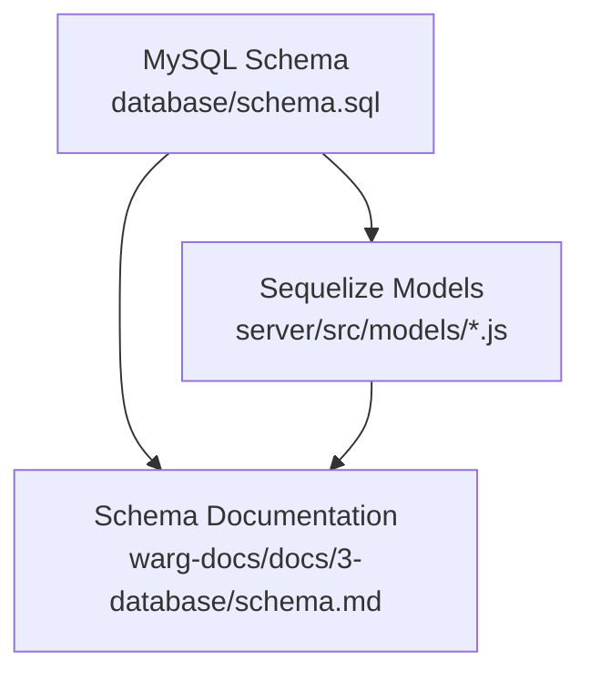
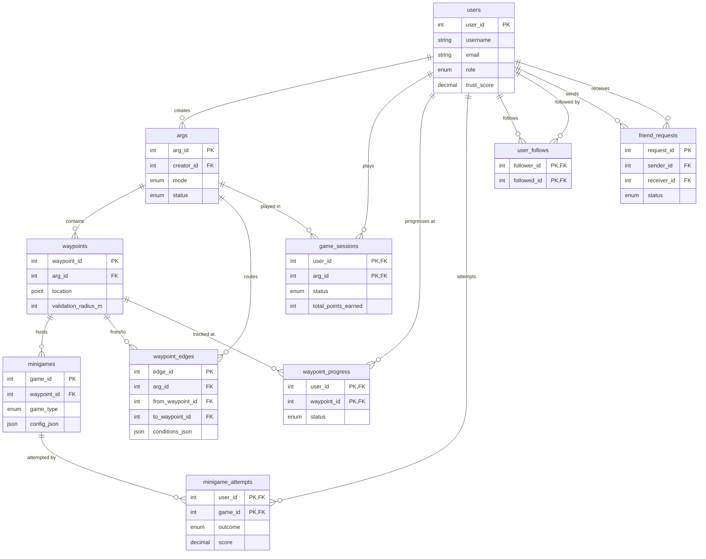
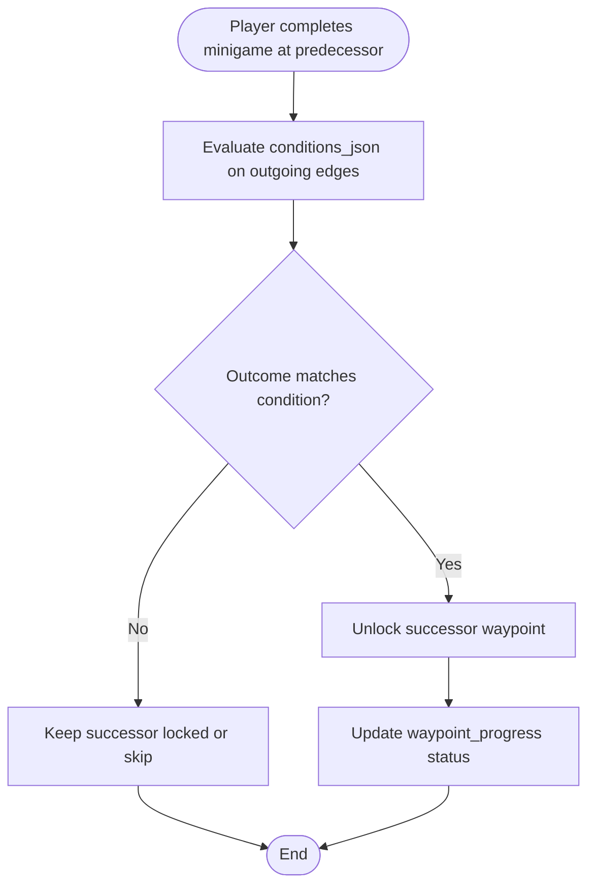
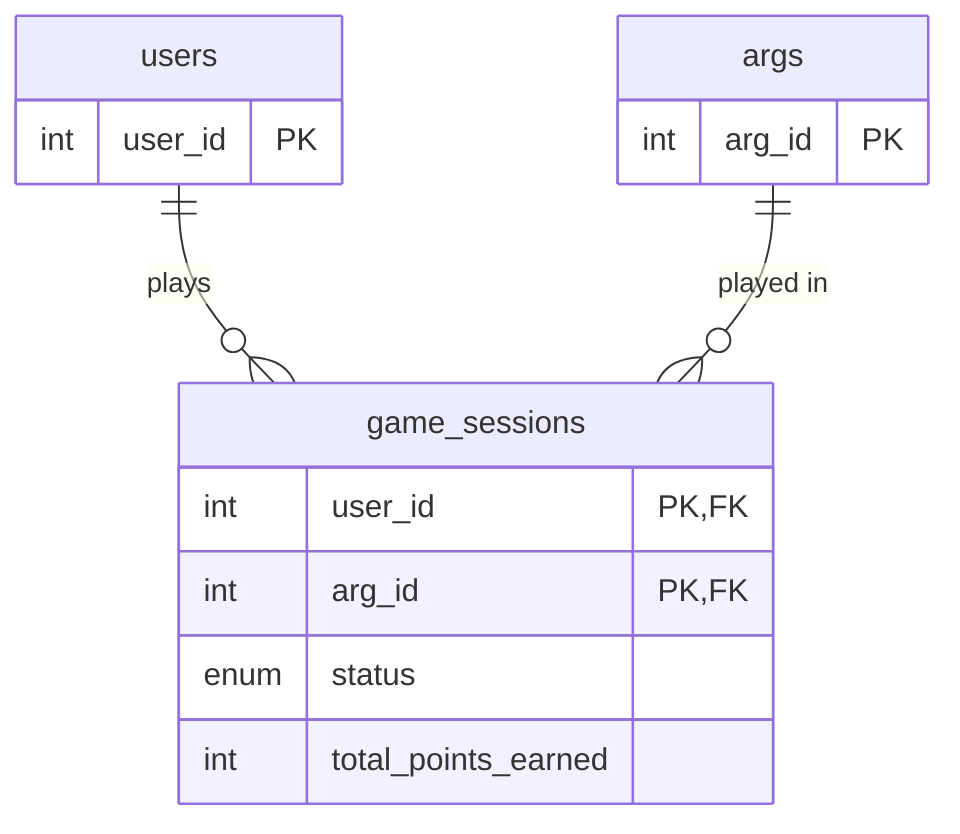
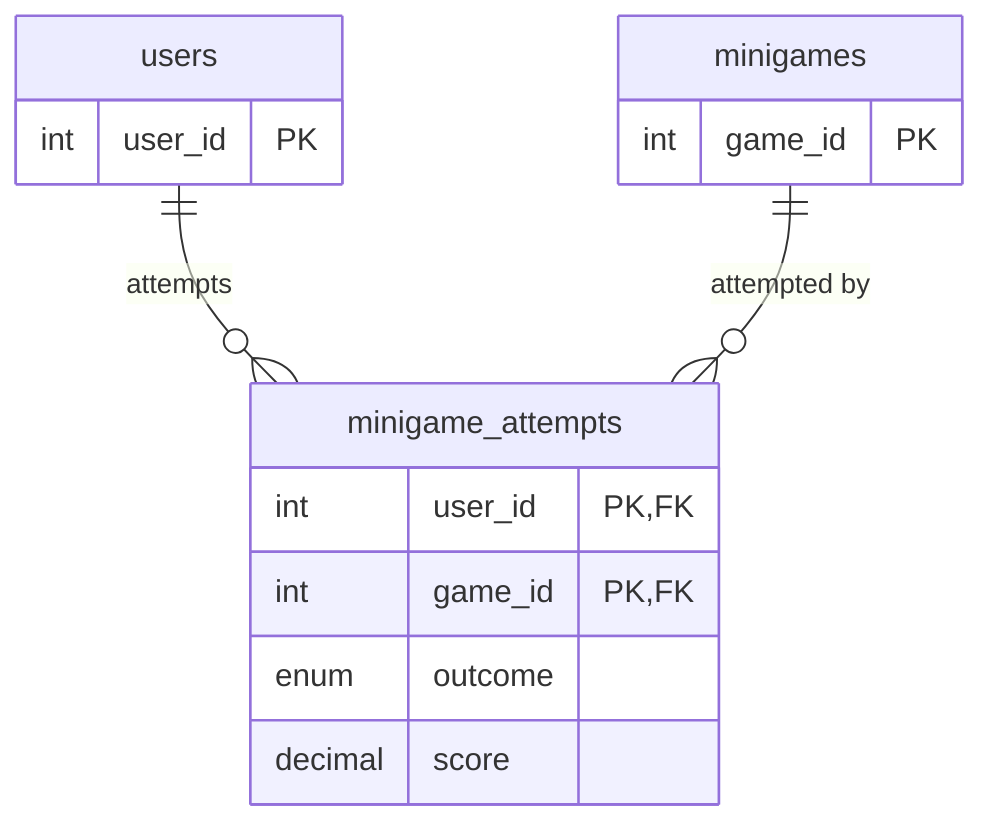
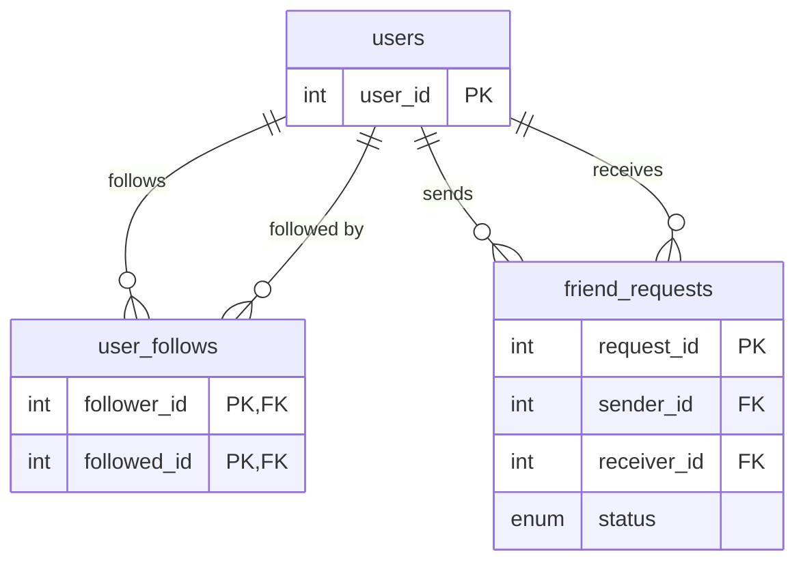
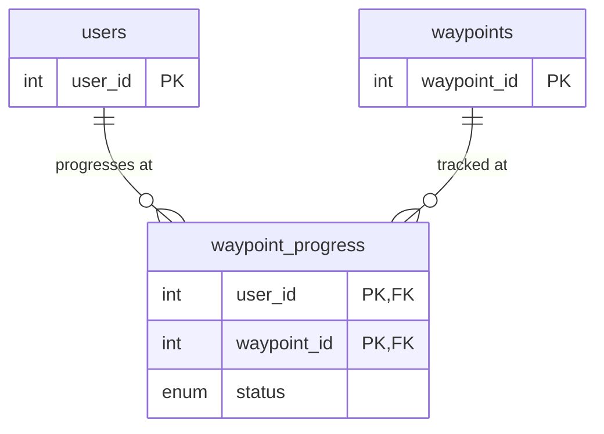
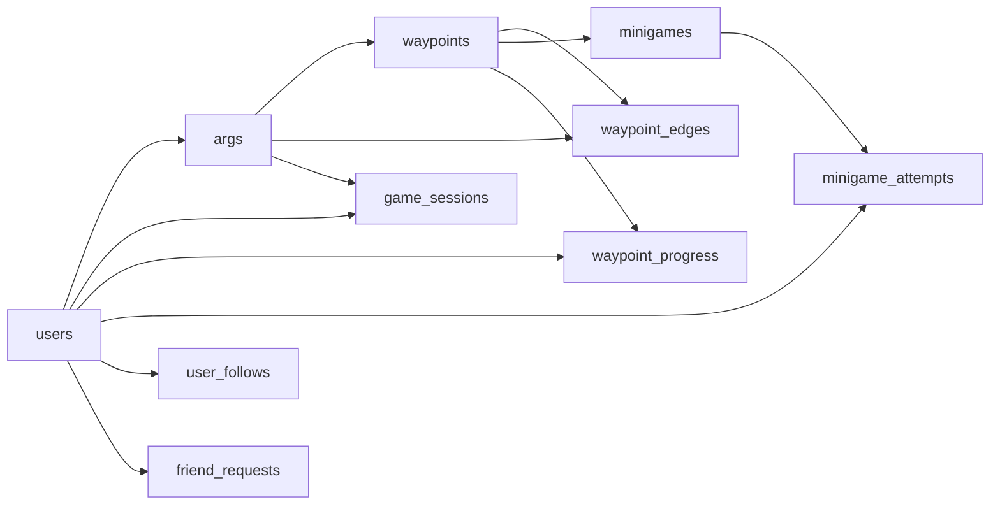

# Relationship Modeling

<cite>
**Referenced Files in This Document**
- [schema.sql](file://database/schema.sql)
- [Waypoint.js](file://server/src/models/Waypoint.js)
- [WaypointEdge.js](file://server/src/models/WaypointEdge.js)
- [GameSession.js](file://server/src/models/GameSession.js)
- [UserFollow.js](file://server/src/models/UserFollow.js)
- [FriendRequest.js](file://server/src/models/FriendRequest.js)
- [MinigameAttempt.js](file://server/src/models/MinigameAttempt.js)
- [schema.md](file://warg-docs/docs/3-database/schema.md)
</cite>

## Table of Contents
1. [Introduction](#introduction)
2. [Project Structure](#project-structure)
3. [Core Components](#core-components)
4. [Architecture Overview](#architecture-overview)
5. [Detailed Component Analysis](#detailed-component-analysis)
6. [Dependency Analysis](#dependency-analysis)
7. [Performance Considerations](#performance-considerations)
8. [Troubleshooting Guide](#troubleshooting-guide)
9. [Conclusion](#conclusion)

## Introduction
This document explains the database relationship modeling used by the WARG Platform, focusing on:
- The directed graph structure of waypoints through the `waypoints` and `waypoint_edges` tables, enabling branching narratives with conditional progression based on minigame outcomes.
- Many-to-many relationships between users and games via `game_sessions`, and user social relationships modeled through `user_follows` and `friend_requests`.
- Foreign key constraints, referential integrity policies, and cascade behaviors defined in the schema.
- Entity-relationship diagrams showing entity relationships, cardinality ratios, and data flow patterns.
- Performance considerations for complex queries involving multiple joins and spatial operations.

The documentation is grounded in the MySQL schema and Sequelize model definitions present in the repository.

## Project Structure
The relevant parts of the project for this analysis are:
- Database schema definition under `database/schema.sql`.
- Sequelize model files under `server/src/models/` that mirror core tables.
- Documentation ER diagrams under `warg-docs/docs/3-database/schema.md`.

**Diagram sources**
- [schema.sql:1-691](file://database/schema.sql#L1-L691)
- [Waypoint.js:1-20](file://server/src/models/Waypoint.js#L1-L20)
- [WaypointEdge.js:1-16](file://server/src/models/WaypointEdge.js#L1-L16)
- [GameSession.js:1-19](file://server/src/models/GameSession.js#L1-L19)
- [UserFollow.js:1-13](file://server/src/models/UserFollow.js#L1-L13)
- [FriendRequest.js:1-16](file://server/src/models/FriendRequest.js#L1-L16)
- [MinigameAttempt.js:1-18](file://server/src/models/MinigameAttempt.js#L1-L18)
- [schema.md:1-205](file://warg-docs/docs/3-database/schema.md#L1-L205)

**Section sources**
- [schema.sql:1-691](file://database/schema.sql#L1-L691)
- [schema.md:1-205](file://warg-docs/docs/3-database/schema.md#L1-L205)

## Core Components
This section summarizes the core entities involved in relationship modeling:
- Users and Social Graph: `users`, `user_follows`, `friend_requests`.
- ARGs and Waypoints Graph: `args`, `waypoints`, `waypoint_edges`, `minigames`.
- Player Progression: `game_sessions`, `waypoint_progress`, `minigame_attempts`.
- Spatial Data: `waypoints.location`, `location_events.location` using SRID 4326 (WGS 84).

Key characteristics:
- Directed graph edges for waypoint progression with JSON conditions tied to minigame outcomes.
- Composite primary keys for many-to-many relationships such as `game_sessions(user_id, arg_id)` and `minigame_attempts(user_id, game_id)`.
- Asymmetric follow relationships and explicit friend request lifecycle.

**Section sources**
- [schema.sql:15-84](file://database/schema.sql#L15-L84)
- [schema.sql:114-203](file://database/schema.sql#L114-L203)
- [schema.sql:212-345](file://database/schema.sql#L212-L345)
- [schema.sql:354-390](file://database/schema.sql#L354-L390)

## Architecture Overview
The WARG platform’s relational architecture centers around a directed graph of waypoints per ARG, where each edge can carry conditional logic evaluated against minigame outcomes. User progress is tracked per ARG session, and social connections are modeled explicitly with follows and friend requests.

**Diagram sources**
- [schema.sql:15-84](file://database/schema.sql#L15-L84)
- [schema.sql:114-203](file://database/schema.sql#L114-L203)
- [schema.sql:212-345](file://database/schema.sql#L212-L345)
- [schema.md:57-129](file://warg-docs/docs/3-database/schema.md#L57-L129)

## Detailed Component Analysis

### Waypoint Directed Graph and Conditional Progression
The waypoint graph models narrative branching within an ARG:
- `waypoints` represent geospatial nodes with location and proximity validation radius.
- `waypoint_edges` define directed links from a predecessor waypoint to a successor waypoint.
- `conditions_json` on edges encodes branching rules evaluated against minigame outcomes at the predecessor node.

**Diagram sources**
- [schema.sql:160-203](file://database/schema.sql#L160-L203)
- [schema.sql:212-246](file://database/schema.sql#L212-L246)
- [schema.sql:328-345](file://database/schema.sql#L328-L345)

Foreign key constraints and cascade behavior:
- `waypoint_edges.arg_id` references `args.arg_id` with ON DELETE CASCADE.
- `waypoint_edges.from_waypoint_id` and `to_waypoint_id` reference `waypoints.waypoint_id` with ON DELETE CASCADE.
- `minigames.waypoint_id` references `waypoints.waypoint_id` with ON DELETE CASCADE.

Data integrity guarantees:
- Unique constraint on `(from_waypoint_id, to_waypoint_id)` prevents duplicate edges.
- Indexes on `arg_id` and `to_waypoint_id` support efficient traversal queries.

Model mapping:
- `Waypoint.js` maps to `waypoints` table with geometry type POINT SRID 4326.
- `WaypointEdge.js` maps to `waypoint_edges` table including JSON conditions.

**Section sources**
- [schema.sql:160-203](file://database/schema.sql#L160-L203)
- [schema.sql:212-246](file://database/schema.sql#L212-L246)
- [Waypoint.js:1-20](file://server/src/models/Waypoint.js#L1-L20)
- [WaypointEdge.js:1-16](file://server/src/models/WaypointEdge.js#L1-L16)

### Game Sessions and User-Game Relationships
`game_sessions` implements a many-to-one relationship between users and ARGs, with a composite primary key `(user_id, arg_id)` ensuring one active/completed/abandoned session per user per ARG.

Key attributes:
- `status`: active, completed, abandoned.
- `total_points_earned`, `distance_m`: denormalized aggregates updated by application logic.
- Timestamps: `started_at`, `completed_at`, `last_active_at`.

Foreign key constraints:
- `user_id` references `users.user_id` with ON DELETE CASCADE.
- `arg_id` references `args.arg_id` with ON DELETE CASCADE.

Cardinality:
- One user plays many ARGs; one ARG has many sessions across users.

**Diagram sources**
- [schema.sql:287-304](file://database/schema.sql#L287-L304)

Model mapping:
- `GameSession.js` defines composite primary key fields and enumerations matching the schema.

**Section sources**
- [schema.sql:287-304](file://database/schema.sql#L287-L304)
- [GameSession.js:1-19](file://server/src/models/GameSession.js#L1-L19)

### Minigame Attempts and Outcome-Based Branching
`minigame_attempts` records the latest attempt per user per minigame, capturing outcome, normalized score, points awarded, and submission payload.

Key attributes:
- `outcome`: pass, fail, timeout.
- `submission_json`: raw player input or scan result.
- `score`: normalized server score 0.0–1.0 for graded challenges.
- `points_awarded`: points granted upon success.

Foreign key constraints:
- `user_id` references `users.user_id` with ON DELETE CASCADE.
- `game_id` references `minigames.game_id` with ON DELETE CASCADE.

Integration with waypoint edges:
- Edge conditions evaluate against minigame outcomes to unlock successors.

**Diagram sources**
- [schema.sql:328-345](file://database/schema.sql#L328-L345)

Model mapping:
- `MinigameAttempt.js` mirrors the composite primary key and enumerated outcome field.

**Section sources**
- [schema.sql:328-345](file://database/schema.sql#L328-L345)
- [MinigameAttempt.js:1-18](file://server/src/models/MinigameAttempt.js#L1-L18)

### User Social Relationships: Follows and Friend Requests
Social graph includes asymmetric follows and explicit friend requests:

- `user_follows`: composite primary key `(follower_id, followed_id)` enforces unique follow pairs. Both foreign keys reference `users.user_id` with ON DELETE CASCADE.
- `friend_requests`: explicit bidirectional request lifecycle with statuses pending, accepted, declined, cancelled. Sender and receiver both reference `users.user_id` with ON DELETE CASCADE.

**Diagram sources**
- [schema.sql:55-84](file://database/schema.sql#L55-L84)

Model mapping:
- `UserFollow.js` maps to `user_follows` with composite primary key.
- `FriendRequest.js` maps to `friend_requests` with enumerated status and timestamps.

**Section sources**
- [schema.sql:55-84](file://database/schema.sql#L55-L84)
- [UserFollow.js:1-13](file://server/src/models/UserFollow.js#L1-L13)
- [FriendRequest.js:1-16](file://server/src/models/FriendRequest.js#L1-L16)

### Waypoint Progress Tracking
`waypoint_progress` tracks per-user per-waypoint state: locked, unlocked, completed, skipped. It uses a composite primary key `(user_id, waypoint_id)` and cascading deletes to maintain consistency when users or waypoints are removed.

**Diagram sources**
- [schema.sql:308-324](file://database/schema.sql#L308-L324)

**Section sources**
- [schema.sql:308-324](file://database/schema.sql#L308-L324)

## Dependency Analysis
The following diagram highlights direct dependencies among core tables and their referential integrity policies.

**Diagram sources**
- [schema.sql:15-84](file://database/schema.sql#L15-L84)
- [schema.sql:114-203](file://database/schema.sql#L114-L203)
- [schema.sql:212-345](file://database/schema.sql#L212-L345)

Key dependency observations:
- Most foreign keys use ON DELETE CASCADE to ensure consistent removal of dependent rows.
- Composite primary keys enforce uniqueness in many-to-many relationships.
- Spatial indexes on `waypoints.location` and `location_events.location` enable efficient proximity queries.

**Section sources**
- [schema.sql:15-84](file://database/schema.sql#L15-L84)
- [schema.sql:114-203](file://database/schema.sql#L114-L203)
- [schema.sql:212-345](file://database/schema.sql#L212-L345)
- [schema.sql:354-390](file://database/schema.sql#L354-L390)

## Performance Considerations
Complex queries often involve multiple joins across the waypoint graph, user progress, and minigame attempts. Recommendations include:

- Use existing indexes:
  - `idx_wp_arg` on `waypoints.arg_id`.
  - `idx_edge_arg` and `idx_edge_to` on `waypoint_edges`.
  - `idx_gs_status` on `game_sessions.status`.
  - `idx_wpp_waypoint` on `waypoint_progress.waypoint_id`.
  - `idx_ma_game` on `minigame_attempts.game_id`.

- Spatial operations:
  - Leverage SPATIAL INDEX on `waypoints.location` and `location_events.location` for proximity checks using SRID 4326.
  - Avoid full-table scans by filtering on `arg_id` before applying spatial functions.

- Query composition:
  - Prefer joining from `waypoint_edges` to `waypoints` and then to `minigames` when evaluating branch conditions.
  - Aggregate `minigame_attempts.outcome` to compute whether conditions on edges are satisfied.

- Denormalization and materialization:
  - Use views like `v_player_stats` and `v_friend_activity` for read-heavy dashboards to reduce repeated joins.

- Partitioning strategy:
  - For high-volume tables like `location_events`, consider partitioning by time ranges to improve query performance.

[No sources needed since this section provides general guidance]

## Troubleshooting Guide
Common issues and resolutions related to relationship modeling:

- Missing or invalid foreign keys:
  - Ensure referenced `users`, `args`, `waypoints`, and `minigames` exist before inserting into dependent tables.
  - Check ON DELETE CASCADE effects when removing parents; dependent rows will be automatically deleted.

- Duplicate edges or attempts:
  - Enforce unique constraints on `(from_waypoint_id, to_waypoint_id)` and `(user_id, game_id)`.
  - Validate application logic to prevent duplicate inserts.

- Stale progress states:
  - Reconcile `waypoint_progress.status` with actual minigame outcomes and edge conditions.
  - Use triggers or application-level updates to keep progress consistent after successful attempts.

- Spatial query errors:
  - Verify SRID 4326 usage for all POINT columns.
  - Confirm spatial indexes are created and utilized by queries.

**Section sources**
- [schema.sql:55-84](file://database/schema.sql#L55-L84)
- [schema.sql:183-203](file://database/schema.sql#L183-L203)
- [schema.sql:308-345](file://database/schema.sql#L308-L345)
- [schema.sql:354-390](file://database/schema.sql#L354-L390)

## Conclusion
The WARG Platform’s database design emphasizes a robust directed graph of waypoints with conditional branching driven by minigame outcomes, while maintaining clear many-to-many relationships between users and games and explicit social connections. Referential integrity is enforced through foreign key constraints with cascade behaviors, and spatial indexing supports efficient geospatial queries. Proper indexing, careful query composition, and leveraging views help optimize performance for complex multi-join scenarios.

[No sources needed since this section summarizes without analyzing specific files]