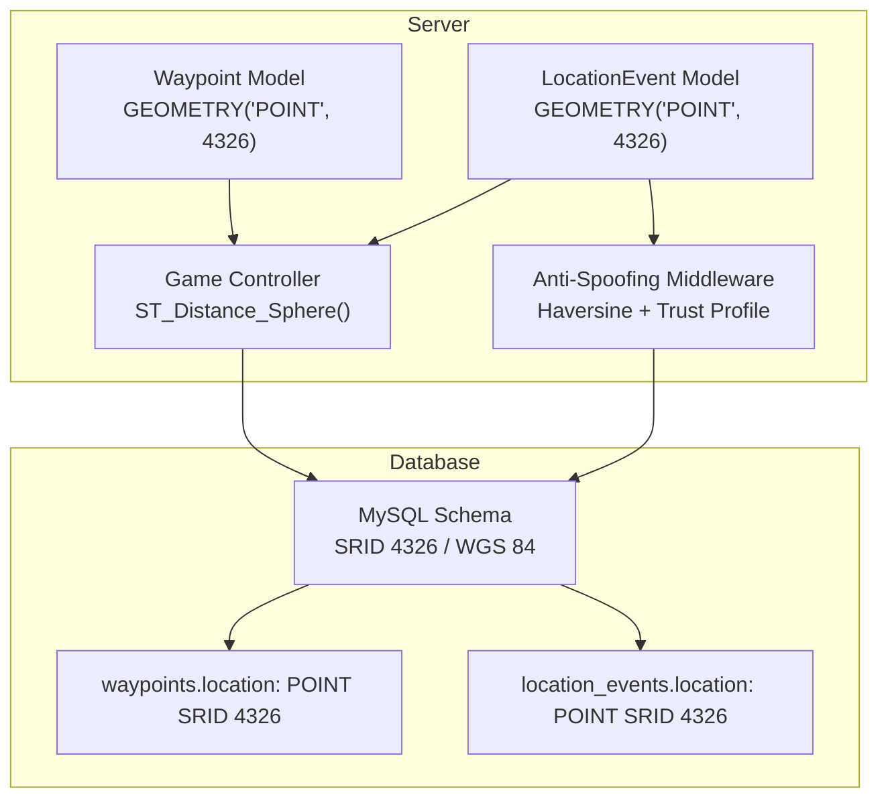
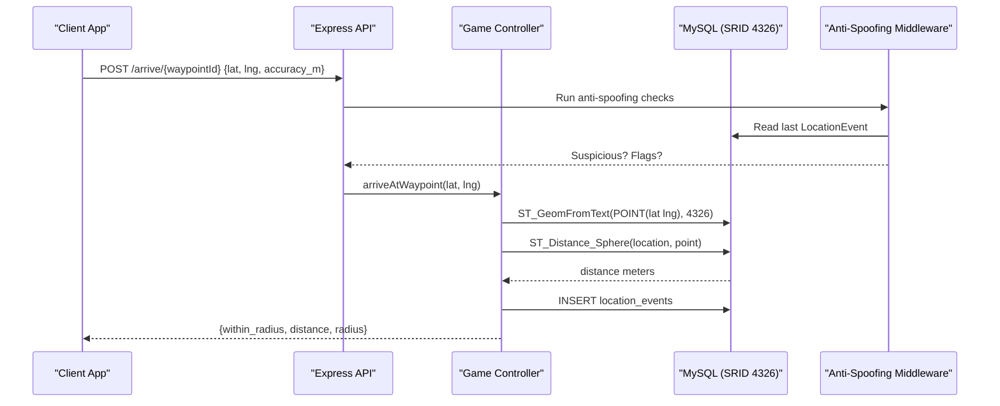
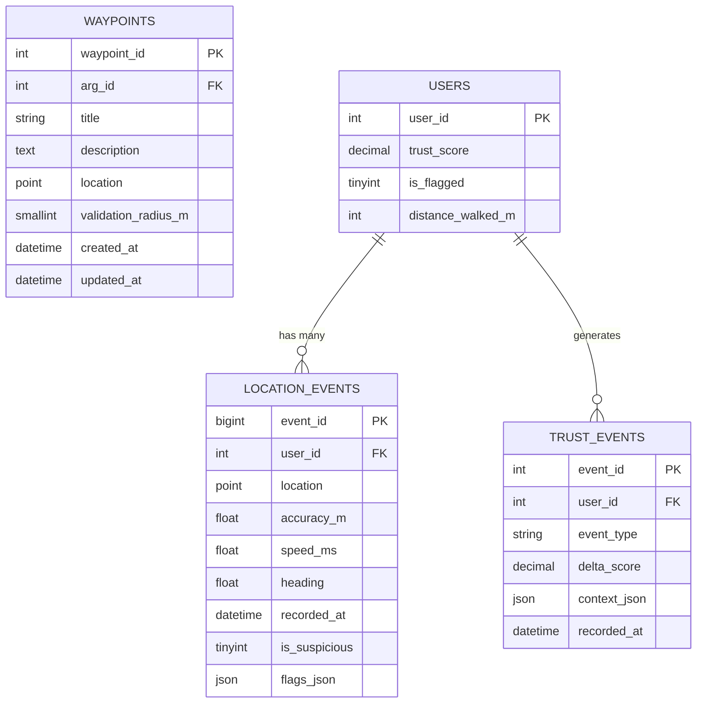
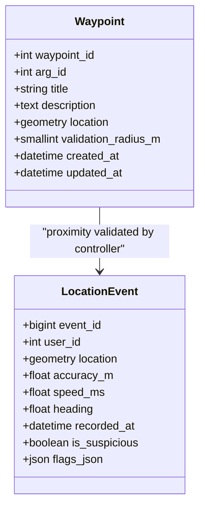
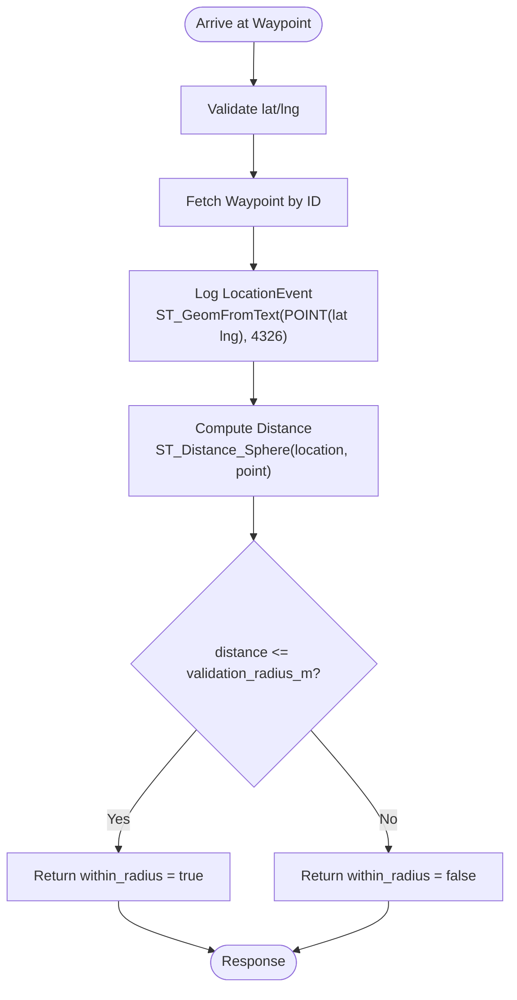
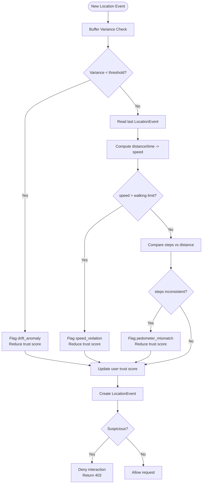
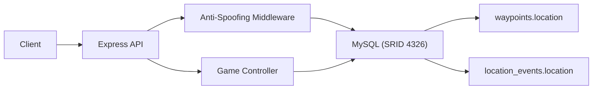

# Spatial Data Handling

<cite>
**Referenced Files in This Document**   
- [schema.sql](file://database/schema.sql)
- [LocationEvent.js](file://server/src/models/LocationEvent.js)
- [Waypoint.js](file://server/src/models/Waypoint.js)
- [gameController.js](file://server/src/controllers/gameController.js)
- [antiSpoofing.js](file://server/src/middleware/antiSpoofing.js)
- [test_loc.js](file://server/test_loc.js)
- [spoofing-detection.md](file://warg-docs/docs/2-architecture-and-design/spoofing-detection.md)
- [schema.md](file://warg-docs/docs/3-database/schema.md)
</cite>

## Table of Contents
1. [Introduction](#introduction)
2. [Project Structure](#project-structure)
3. [Core Components](#core-components)
4. [Architecture Overview](#architecture-overview)
5. [Detailed Component Analysis](#detailed-component-analysis)
6. [Dependency Analysis](#dependency-analysis)
7. [Performance Considerations](#performance-considerations)
8. [Troubleshooting Guide](#troubleshooting-guide)
9. [Conclusion](#conclusion)

## Introduction
This document explains how the WARG Platform stores and queries spatial data using MySQL’s geospatial extensions. The system uses MySQL POINT geometry with SRID 4326 (WGS 84) to represent real-world coordinates for waypoints and GPS tracking events. It also documents spatial indexing strategies, proximity checks, geofencing, anti-spoofing mechanisms, and performance tuning techniques for large-scale location data.

## Project Structure
The spatial data handling spans database schema definitions, Sequelize models, controllers performing SQL-based spatial operations, and middleware implementing anti-spoofing logic.

**Diagram sources**
- [schema.sql:160-179](file://database/schema.sql#L160-L179)
- [schema.sql:354-372](file://database/schema.sql#L354-L372)
- [Waypoint.js:4-17](file://server/src/models/Waypoint.js#L4-L17)
- [LocationEvent.js:4-18](file://server/src/models/LocationEvent.js#L4-L18)
- [gameController.js:163-201](file://server/src/controllers/gameController.js#L163-L201)
- [antiSpoofing.js:27-165](file://server/src/middleware/antiSpoofing.js#L27-L165)

**Section sources**
- [schema.sql:1-10](file://database/schema.sql#L1-L10)
- [schema.md:1-10](file://warg-docs/docs/3-database/schema.md#L1-L10)

## Core Components
- Waypoints store ARG locations as POINT geometry with SRID 4326 and include a validation radius for proximity checks.
- Location events record high-frequency GPS breadcrumbs with optional accuracy, speed, heading, and suspicious flags.
- Controllers use MySQL spatial functions to compute distances and validate geofences.
- Anti-spoofing middleware evaluates drift anomalies, impossible speeds, and pedometer mismatches, updating user trust profiles.

Key responsibilities:
- Store and index spatial data efficiently.
- Validate player proximity to waypoints.
- Detect spoofed or unrealistic movement patterns.
- Maintain a trust profile per user based on behavioral signals.

**Section sources**
- [schema.sql:160-179](file://database/schema.sql#L160-L179)
- [schema.sql:354-372](file://database/schema.sql#L354-L372)
- [gameController.js:163-201](file://server/src/controllers/gameController.js#L163-L201)
- [antiSpoofing.js:27-165](file://server/src/middleware/antiSpoofing.js#L27-L165)

## Architecture Overview
The spatial workflow integrates client GPS inputs, server-side validation, and MySQL spatial queries.

**Diagram sources**
- [gameController.js:163-201](file://server/src/controllers/gameController.js#L163-L201)
- [antiSpoofing.js:27-165](file://server/src/middleware/antiSpoofing.js#L27-L165)
- [schema.sql:354-372](file://database/schema.sql#L354-L372)

## Detailed Component Analysis

### Database Schema: Spatial Tables
- waypoints.location is a POINT with SRID 4326 and includes a SPATIAL INDEX for efficient proximity queries.
- location_events.location is a POINT with SRID 4326 and includes a SPATIAL INDEX for fast spatial scans.
- Both tables are InnoDB with utf8mb4 collation and enforce foreign keys where applicable.

**Diagram sources**
- [schema.sql:160-179](file://database/schema.sql#L160-L179)
- [schema.sql:354-372](file://database/schema.sql#L354-L372)
- [schema.sql:376-390](file://database/schema.sql#L376-L390)
- [schema.sql:15-44](file://database/schema.sql#L15-L44)

**Section sources**
- [schema.sql:160-179](file://database/schema.sql#L160-L179)
- [schema.sql:354-372](file://database/schema.sql#L354-L372)
- [schema.sql:376-390](file://database/schema.sql#L376-L390)

### Sequelize Models: Geometric Types
- Waypoint model defines location as GEOMETRY('POINT', 4326).
- LocationEvent model defines location as GEOMETRY('POINT', 4326) and indexes user_id and recorded_at for time-series queries.

**Diagram sources**
- [Waypoint.js:4-17](file://server/src/models/Waypoint.js#L4-L17)
- [LocationEvent.js:4-18](file://server/src/models/LocationEvent.js#L4-L18)

**Section sources**
- [Waypoint.js:4-17](file://server/src/models/Waypoint.js#L4-L17)
- [LocationEvent.js:4-18](file://server/src/models/LocationEvent.js#L4-L18)

### Geofencing and Proximity Queries
The controller validates whether a player is within a waypoint’s validation radius using MySQL’s ST_Distance_Sphere function. It logs each arrival attempt into location_events and returns proximity results.

**Diagram sources**
- [gameController.js:163-201](file://server/src/controllers/gameController.js#L163-L201)
- [schema.sql:160-179](file://database/schema.sql#L160-L179)
- [schema.sql:354-372](file://database/schema.sql#L354-L372)

**Section sources**
- [gameController.js:163-201](file://server/src/controllers/gameController.js#L163-L201)

### Anti-Spoofing Mechanisms
The middleware implements multiple checks to detect spoofed or unrealistic movement:

- Drift anomaly detection: If buffered coordinates have near-zero variance, it suggests static spoofing.
- Impossible speed detection: Computes straight-line distance over time; if speed exceeds walking thresholds, it flags the event.
- Pedometer mismatch: Compares step count against geographical distance; inconsistencies indicate potential spoofing.
- Trust profile updates: Adjusts user trust scores and marks users flagged when thresholds are breached.

**Diagram sources**
- [antiSpoofing.js:27-165](file://server/src/middleware/antiSpoofing.js#L27-L165)
- [schema.sql:354-372](file://database/schema.sql#L354-L372)
- [schema.sql:376-390](file://database/schema.sql#L376-L390)

**Section sources**
- [antiSpoofing.js:27-165](file://server/src/middleware/antiSpoofing.js#L27-L165)
- [spoofing-detection.md:1-46](file://warg-docs/docs/2-architecture-and-design/spoofing-detection.md#L1-L46)

### Example Spatial SQL Patterns
While specific query strings are not included here, the following patterns are used in the codebase:

- Creating POINT geometry with SRID 4326:
  - Use ST_GeomFromText('POINT(lon lat)', 4326) to insert valid geographic points.
- Computing distances between points:
  - Use ST_Distance_Sphere(location, ST_GeomFromText('POINT(lon lat)', 4326)) to get meters.
- Geofencing:
  - Compare computed distance against validation_radius_m to determine proximity.

These patterns appear in controller logic and test utilities.

**Section sources**
- [gameController.js:177-191](file://server/src/controllers/gameController.js#L177-L191)
- [test_loc.js:6-10](file://server/test_loc.js#L6-L10)

## Dependency Analysis
Spatial data flows from client input through middleware and controller layers into MySQL, leveraging spatial functions and indexes.

**Diagram sources**
- [antiSpoofing.js:27-165](file://server/src/middleware/antiSpoofing.js#L27-L165)
- [gameController.js:163-201](file://server/src/controllers/gameController.js#L163-L201)
- [schema.sql:160-179](file://database/schema.sql#L160-L179)
- [schema.sql:354-372](file://database/schema.sql#L354-L372)

**Section sources**
- [antiSpoofing.js:27-165](file://server/src/middleware/antiSpoofing.js#L27-L165)
- [gameController.js:163-201](file://server/src/controllers/gameController.js#L163-L201)

## Performance Considerations
- Spatial Indexes:
  - SPATIAL INDEX on waypoints.location and location_events.location accelerates proximity scans and range queries.
- Query Optimization:
  - Prefer ST_Distance_Sphere for spherical distance calculations in meters.
  - Filter by user_id and recorded_at using composite indexes to reduce scan size for time-series analysis.
- Partitioning Strategy:
  - For high-volume location_events, consider partitioning by recorded_at ranges to improve write and read performance.
- Accuracy Filtering:
  - Use accuracy_m to filter out low-quality GPS readings before processing or aggregating metrics.
- Trust Score Updates:
  - Batch trust score adjustments and avoid excessive writes during rapid location bursts.

[No sources needed since this section provides general guidance]

## Troubleshooting Guide
Common issues and resolutions:

- Incorrect Point Coordinate Order:
  - Ensure POINT(lon lat) order matches MySQL expectations; tests demonstrate correct usage.
- Missing SRID:
  - Always specify SRID 4326 when creating POINT geometries to maintain consistent coordinate systems.
- Excessive Suspicious Flags:
  - Review drift thresholds and walking speed limits; adjust parameters if legitimate movement is being rejected.
- Trust Score Anomalies:
  - Inspect trust_events for reasons like speed_violation or drift_anomaly; verify pedometer integration accuracy.

**Section sources**
- [test_loc.js:6-10](file://server/test_loc.js#L6-L10)
- [antiSpoofing.js:27-165](file://server/src/middleware/antiSpoofing.js#L27-L165)

## Conclusion
The WARG Platform’s spatial data handling leverages MySQL’s geospatial capabilities with SRID 4326 POINT geometries to support accurate geofencing, proximity checks, and robust anti-spoofing mechanisms. Proper indexing, careful query design, and behavioral trust profiling ensure reliable performance and integrity for large-scale location data.

[No sources needed since this section summarizes without analyzing specific files]