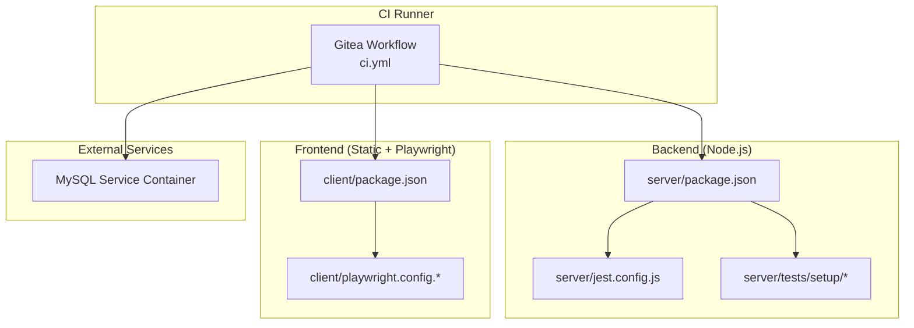
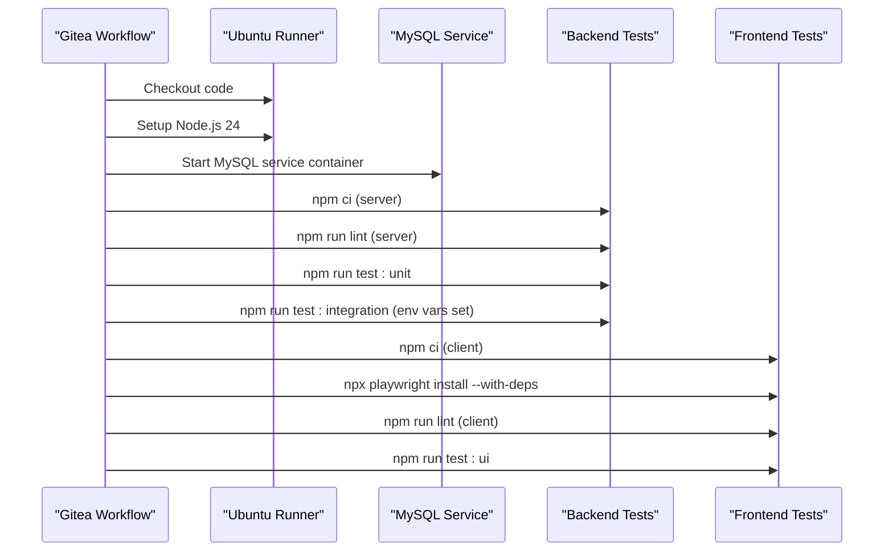
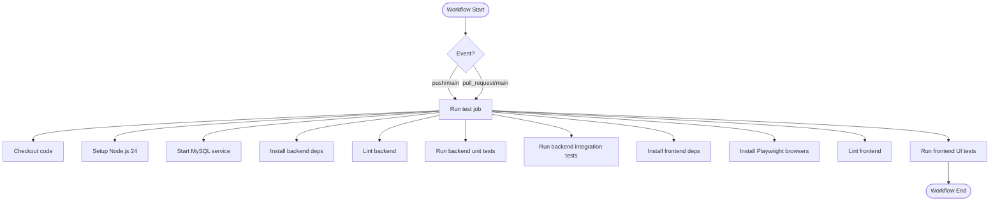
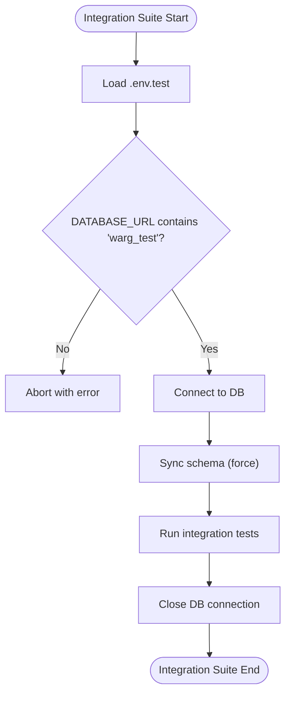
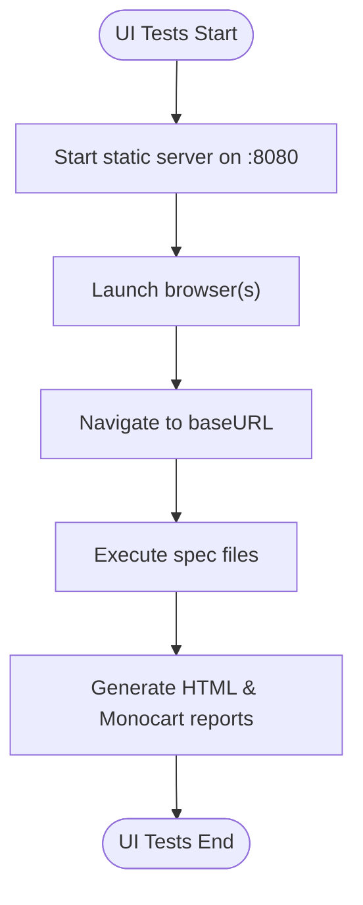
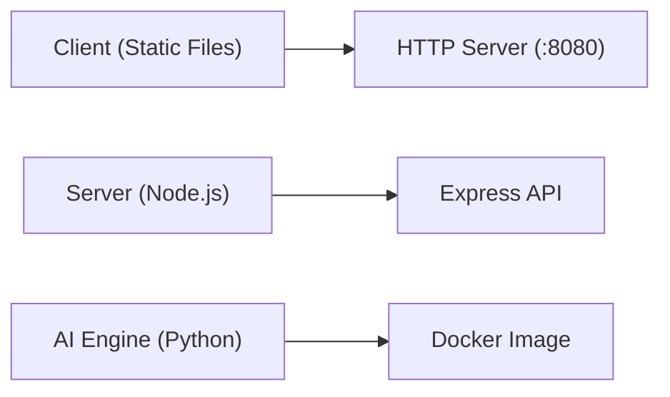
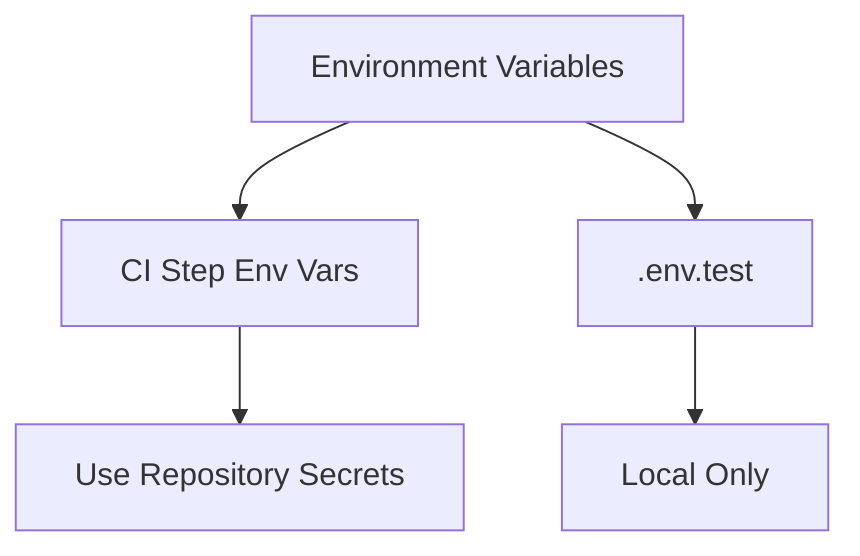
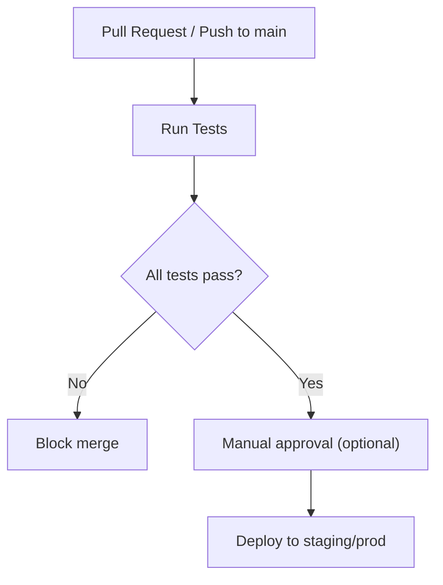
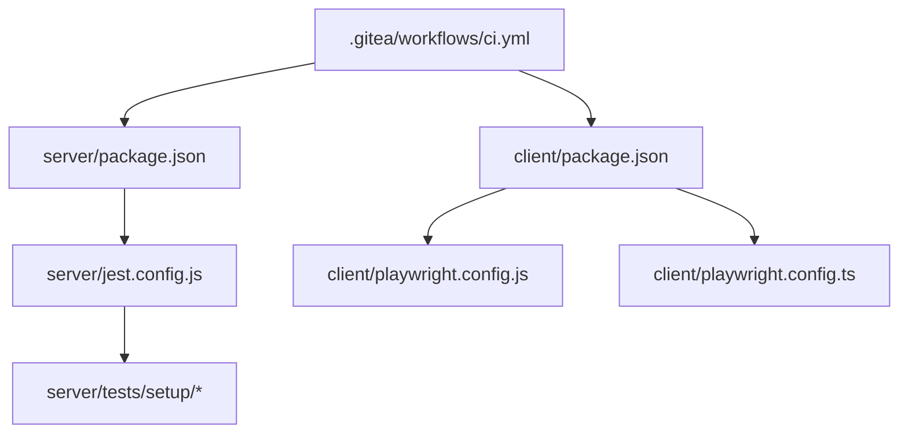

# CI/CD Pipeline

<cite>
**Referenced Files in This Document**
- [ci.yml](file://.gitea/workflows/ci.yml)
- [package.json (client)](file://client/package.json)
- [package.json (server)](file://server/package.json)
- [playwright.config.js](file://client/playwright.config.js)
- [playwright.config.ts](file://client/playwright.config.ts)
- [jest.config.js](file://server/jest.config.js)
- [globalSetup.js](file://server/tests/setup/globalSetup.js)
- [globalTeardown.js](file://server/tests/setup/globalTeardown.js)
- [jest.setup.js](file://server/tests/setup/jest.setup.js)
- [loadEnv.js](file://server/tests/setup/loadEnv.js)
- [.env.test](file://server/.env.test)
- [vercel.json](file://client/vercel.json)
- [Dockerfile (ai-engine)](file://ai-engine/Dockerfile)
</cite>

## Table of Contents
1. [Introduction](#introduction)
2. [Project Structure](#project-structure)
3. [Core Components](#core-components)
4. [Architecture Overview](#architecture-overview)
5. [Detailed Component Analysis](#detailed-component-analysis)
6. [Dependency Analysis](#dependency-analysis)
7. [Performance Considerations](#performance-considerations)
8. [Troubleshooting Guide](#troubleshooting-guide)
9. [Conclusion](#conclusion)

## Introduction
This document explains the WARG Platform’s CI/CD pipeline implemented with Gitea Workflows. It covers automated testing for both frontend and backend, code quality checks, environment configuration, secret management practices, deployment triggers, artifact handling, and optimization strategies to improve build performance.

## Project Structure
The CI/CD configuration is centralized under `.gitea/workflows/ci.yml`. The repository includes:
- Frontend client with Playwright UI tests and ESLint-based linting.
- Backend server with Jest unit, mocked, and integration test suites.
- AI engine service packaged via Docker.
- Documentation sites built with Docusaurus (not part of this CI).

**Diagram sources**
- [ci.yml:1-74](file://.gitea/workflows/ci.yml#L1-L74)
- [package.json (server):6-14](file://server/package.json#L6-L14)
- [jest.config.js:1-39](file://server/jest.config.js#L1-L39)
- [package.json (client):6-9](file://client/package.json#L6-L9)
- [playwright.config.js:1-39](file://client/playwright.config.js#L1-L39)
- [playwright.config.ts:1-72](file://client/playwright.config.ts#L1-L72)

**Section sources**
- [ci.yml:1-74](file://.gitea/workflows/ci.yml#L1-L74)

## Core Components
- Workflow trigger and jobs: Runs on push and pull requests to main; executes a single job that sets up Node.js, MySQL, installs dependencies, lints, and runs tests.
- Backend testing: Jest projects for mocked, unit, and integration tests; integration suite requires a real MySQL instance and enforces a test-only database guard.
- Frontend testing: Playwright UI tests served by a static file server; HTML and Monocart reporters configured.
- Environment configuration: Test environment variables are injected into the workflow step for integration tests; a local `.env.test` is used by Jest setup files.

**Section sources**
- [ci.yml:3-59](file://.gitea/workflows/ci.yml#L3-L59)
- [package.json (server):6-14](file://server/package.json#L6-L14)
- [jest.config.js:1-39](file://server/jest.config.js#L1-L39)
- [globalSetup.js:1-21](file://server/tests/setup/globalSetup.js#L1-L21)
- [loadEnv.js:1-3](file://server/tests/setup/loadEnv.js#L1-L3)
- [package.json (client):6-9](file://client/package.json#L6-L9)
- [playwright.config.js:1-39](file://client/playwright.config.js#L1-L39)
- [playwright.config.ts:1-72](file://client/playwright.config.ts#L1-L72)

## Architecture Overview
The CI pipeline orchestrates the following stages:
1. Checkout code.
2. Set up Node.js 24 with npm cache.
3. Start a MySQL service container for integration tests.
4. Install backend dependencies, lint, and run Jest suites.
5. Install frontend dependencies, install Playwright browsers, lint, and run UI tests.

**Diagram sources**
- [ci.yml:10-74](file://.gitea/workflows/ci.yml#L10-L74)

**Section sources**
- [ci.yml:10-74](file://.gitea/workflows/ci.yml#L10-L74)

## Detailed Component Analysis

### Gitea Workflow Configuration
- Triggers: Push and pull request events targeting the main branch.
- Job: Single job running on ubuntu-latest with a MySQL service container configured for health checks.
- Steps:
  - Checkout code.
  - Setup Node.js 24 with npm cache enabled.
  - Backend: install dependencies, lint, run unit and integration tests with required environment variables.
  - Frontend: install dependencies, install Playwright browsers, lint, run UI tests.

**Diagram sources**
- [ci.yml:3-74](file://.gitea/workflows/ci.yml#L3-L74)

**Section sources**
- [ci.yml:3-74](file://.gitea/workflows/ci.yml#L3-L74)

### Backend Testing Strategy (Jest)
- Projects:
  - Mocked: Controller/model/route/config tests without DB.
  - Unit: Dedicated unit tests directory.
  - Integration: Requires real DB; uses global setup/teardown hooks.
- Global setup:
  - Loads `.env.test`.
  - Validates DATABASE_URL contains “warg_test” to prevent accidental writes to production databases.
  - Authenticates to DB and rebuilds schema synchronously before tests.
- Teardown: Placeholder hook for future cleanup.
- Timeouts: Global Jest timeout increased for stability.

**Diagram sources**
- [jest.config.js:1-39](file://server/jest.config.js#L1-L39)
- [globalSetup.js:1-21](file://server/tests/setup/globalSetup.js#L1-L21)
- [globalTeardown.js:1-6](file://server/tests/setup/globalTeardown.js#L1-L6)
- [jest.setup.js:1-2](file://server/tests/setup/jest.setup.js#L1-L2)
- [loadEnv.js:1-3](file://server/tests/setup/loadEnv.js#L1-L3)

**Section sources**
- [package.json (server):6-14](file://server/package.json#L6-L14)
- [jest.config.js:1-39](file://server/jest.config.js#L1-L39)
- [globalSetup.js:1-21](file://server/tests/setup/globalSetup.js#L1-L21)
- [globalTeardown.js:1-6](file://server/tests/setup/globalTeardown.js#L1-L6)
- [jest.setup.js:1-2](file://server/tests/setup/jest.setup.js#L1-L2)
- [loadEnv.js:1-3](file://server/tests/setup/loadEnv.js#L1-L3)

### Frontend Testing Strategy (Playwright)
- Test runner: Playwright configured to run tests in `./tests`, parallelized locally, single worker on CI.
- Reporters: HTML reporter and Monocart reporter generating coverage reports filtered to application scripts/components.
- Web server: Starts a static server on port 8080 to serve the client directory during tests.
- Browser matrix: TypeScript config defines Chromium, Firefox, and WebKit projects; JavaScript config currently targets Chromium only.

**Diagram sources**
- [playwright.config.js:1-39](file://client/playwright.config.js#L1-L39)
- [playwright.config.ts:1-72](file://client/playwright.config.ts#L1-L72)
- [package.json (client):6-9](file://client/package.json#L6-L9)

**Section sources**
- [package.json (client):6-9](file://client/package.json#L6-L9)
- [playwright.config.js:1-39](file://client/playwright.config.js#L1-L39)
- [playwright.config.ts:1-72](file://client/playwright.config.ts#L1-L72)

### Build Process
- Backend: No explicit build step; the server runs directly via Node.js. Dependencies are installed with `npm ci`.
- Frontend: Static site served by a simple HTTP server during tests; no bundler or build step is defined in package scripts.
- AI Engine: Docker image builds a Python service using a multi-stage approach with system dependencies and model weights.

**Diagram sources**
- [package.json (client):6-9](file://client/package.json#L6-L9)
- [package.json (server):6-14](file://server/package.json#L6-L14)
- [Dockerfile (ai-engine):1-40](file://ai-engine/Dockerfile#L1-L40)

**Section sources**
- [package.json (client):6-9](file://client/package.json#L6-L9)
- [package.json (server):6-14](file://server/package.json#L6-L14)
- [Dockerfile (ai-engine):1-40](file://ai-engine/Dockerfile#L1-L40)

### Environment-Specific Configurations and Secrets
- CI environment variables:
  - `NODE_ENV=test`
  - `DATABASE_URL=mysql://...@127.0.0.1:3306/warg_test`
  - `SESSION_SECRET=ci-test-secret`
- Local test environment:
  - `.env.test` provides a remote MySQL URL for integration tests.
- Secret management best practices:
  - Avoid committing secrets; use Gitea repository secrets and inject them into workflow steps.
  - For database credentials, prefer Gitea secrets over inline values in workflow files.
  - Rotate secrets regularly and restrict access to sensitive environments.

**Diagram sources**
- [ci.yml:55-58](file://.gitea/workflows/ci.yml#L55-L58)
- [.env.test:1-2](file://server/.env.test#L1-L2)

**Section sources**
- [ci.yml:55-58](file://.gitea/workflows/ci.yml#L55-L58)
- [.env.test:1-2](file://server/.env.test#L1-L2)

### Deployment Automation and Triggers
- Current workflow:
  - Triggers on push and pull request to main.
  - Executes tests but does not perform deployments or publish artifacts.
- Deployment options:
  - Add a deploy job triggered on tags or protected branches.
  - Use Gitea Actions to build Docker images and push to a registry.
  - Deploy frontend to Vercel using `vercel.json`; configure Vercel CLI or GitHub/Gitea Actions integration.
  - Deploy backend and AI engine services via container orchestration or cloud platforms.

**Diagram sources**
- [ci.yml:3-8](file://.gitea/workflows/ci.yml#L3-L8)
- [vercel.json:1-9](file://client/vercel.json#L1-L9)

**Section sources**
- [ci.yml:3-8](file://.gitea/workflows/ci.yml#L3-L8)
- [vercel.json:1-9](file://client/vercel.json#L1-L9)

### Artifact Management
- Current state:
  - No explicit artifact upload steps in the workflow.
- Recommendations:
  - Upload Playwright HTML reports and Monocart coverage reports as workflow artifacts for failed runs.
  - Publish Docker images for AI engine and backend as artifacts or to a container registry.
  - Archive test logs and screenshots/videos for debugging.

**Section sources**
- [ci.yml:1-74](file://.gitea/workflows/ci.yml#L1-L74)

## Dependency Analysis
- Workflow depends on:
  - Node.js runtime and npm cache.
  - MySQL service container for integration tests.
  - Backend Jest configuration and test setup files.
  - Frontend Playwright configuration and reporters.
- Coupling:
  - Integration tests depend on a valid test database URL and schema sync.
  - Frontend tests depend on a static server serving the client directory.

**Diagram sources**
- [ci.yml:1-74](file://.gitea/workflows/ci.yml#L1-L74)
- [package.json (server):6-14](file://server/package.json#L6-L14)
- [jest.config.js:1-39](file://server/jest.config.js#L1-L39)
- [package.json (client):6-9](file://client/package.json#L6-L9)
- [playwright.config.js:1-39](file://client/playwright.config.js#L1-L39)
- [playwright.config.ts:1-72](file://client/playwright.config.ts#L1-L72)

**Section sources**
- [ci.yml:1-74](file://.gitea/workflows/ci.yml#L1-L74)
- [package.json (server):6-14](file://server/package.json#L6-L14)
- [jest.config.js:1-39](file://server/jest.config.js#L1-L39)
- [package.json (client):6-9](file://client/package.json#L6-L9)
- [playwright.config.js:1-39](file://client/playwright.config.js#L1-L39)
- [playwright.config.ts:1-72](file://client/playwright.config.ts#L1-L72)

## Performance Considerations
- Cache dependencies:
  - Node.js cache is already enabled for npm; ensure lockfiles are committed to maximize cache hits.
- Parallelization:
  - Frontend Playwright runs in parallel locally; CI forces single worker for stability.
  - Backend integration tests run in-band to avoid concurrency issues with shared DB state.
- Reduce overhead:
  - Skip unnecessary steps conditionally based on changed paths.
  - Use smaller Docker images and preinstall Playwright browsers if needed.
- Reporting:
  - Generate concise reports and archive only necessary artifacts to reduce storage and transfer time.

[No sources needed since this section provides general guidance]

## Troubleshooting Guide
- MySQL connectivity:
  - Ensure the MySQL service container is healthy before running integration tests.
  - Verify `DATABASE_URL` points to the service host and matches the expected test database name.
- Database guard failures:
  - If integration tests abort due to missing or incorrect `DATABASE_URL`, check environment variable injection and `.env.test`.
- Playwright browser installation:
  - On CI, ensure `npx playwright install --with-deps` completes successfully; network issues may require retries or proxy configuration.
- Static server readiness:
  - Playwright waits for the web server URL; confirm the server starts on the configured port and path.
- Linting failures:
  - Fix ESLint errors in both client and server directories before pushing changes.

**Section sources**
- [ci.yml:13-27](file://.gitea/workflows/ci.yml#L13-L27)
- [ci.yml:55-58](file://.gitea/workflows/ci.yml#L55-L58)
- [globalSetup.js:4-11](file://server/tests/setup/globalSetup.js#L4-L11)
- [playwright.config.js:33-37](file://client/playwright.config.js#L33-L37)
- [playwright.config.ts:66-70](file://client/playwright.config.ts#L66-L70)

## Conclusion
The WARG Platform’s CI pipeline integrates backend and frontend testing with robust safeguards for database operations and stable execution on CI. To enhance maturity, consider adding deployment jobs, secret management via repository secrets, artifact uploads for reports, and conditional steps to optimize build times. These improvements will streamline releases and provide better visibility into test outcomes.

[No sources needed since this section summarizes without analyzing specific files]