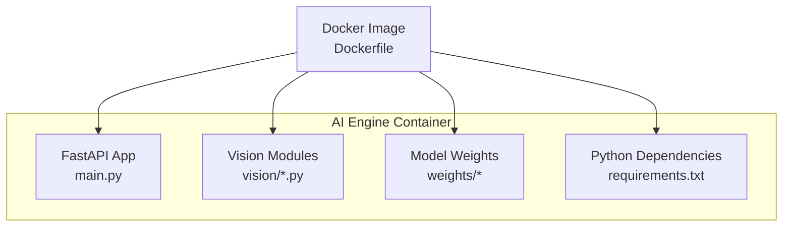
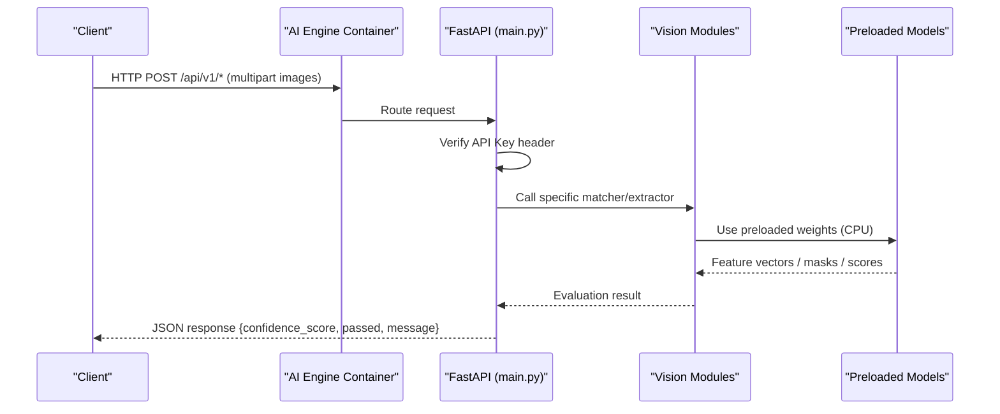
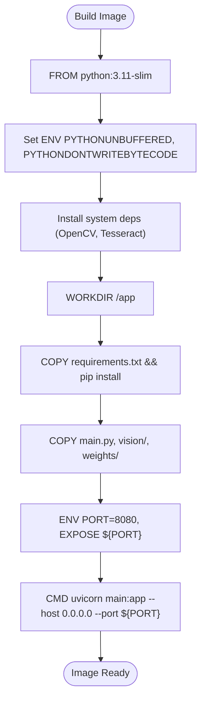
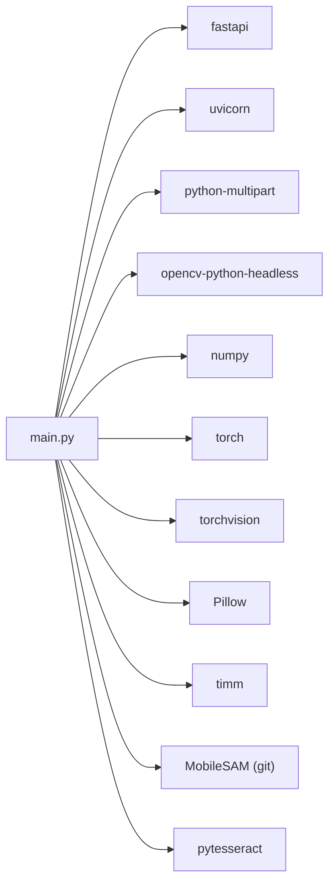

# Containerization & Docker

<cite>
**Referenced Files in This Document**
- [Dockerfile](file://ai-engine/Dockerfile)
- [.dockerignore](file://ai-engine/.dockerignore)
- [main.py](file://ai-engine/main.py)
- [requirements.txt](file://ai-engine/requirements.txt)
- [DEPLOYMENT.md](file://ai-engine/DEPLOYMENT.md)
- [sam_extractor.py](file://ai-engine/vision/sam_extractor.py)
- [mobilenet_extractor.py](file://ai-engine/vision/mobilenet_extractor.py)
</cite>

## Table of Contents
1. [Introduction](#introduction)
2. [Project Structure](#project-structure)
3. [Core Components](#core-components)
4. [Architecture Overview](#architecture-overview)
5. [Detailed Component Analysis](#detailed-component-analysis)
6. [Dependency Analysis](#dependency-analysis)
7. [Performance Considerations](#performance-considerations)
8. [Troubleshooting Guide](#troubleshooting-guide)
9. [Conclusion](#conclusion)
10. [Appendices](#appendices)

## Introduction
This document provides comprehensive containerization guidance for the AI Engine service, focusing on the Dockerfile structure, image optimization strategies, environment configuration, and production deployment patterns. It also covers networking, volume mounting for model weights, security considerations, orchestration patterns, resource limits, and scaling strategies suitable for cloud platforms such as Google Cloud Run and AWS Lightsail.

## Project Structure
The AI Engine is a FastAPI application that exposes endpoints for computer vision tasks (SAM segmentation, HSV color matching, texture similarity via MobileNet, SIFT-based archival matching, symmetry detection, and OCR). The container image includes Python dependencies, OpenCV headless, Tesseract OCR, and the application code with pre-baked model weights.

**Diagram sources**
- [Dockerfile:7-39](file://ai-engine/Dockerfile#L7-L39)
- [main.py:1-157](file://ai-engine/main.py#L1-L157)
- [requirements.txt:1-13](file://ai-engine/requirements.txt#L1-L13)

**Section sources**
- [Dockerfile:1-40](file://ai-engine/Dockerfile#L1-L40)
- [main.py:1-157](file://ai-engine/main.py#L1-L157)
- [requirements.txt:1-13](file://ai-engine/requirements.txt#L1-L13)

## Core Components
- Application entrypoint: FastAPI app exposing health and evaluation endpoints.
- Vision modules: SAM extractor, HSV matcher, MobileNet texture extractor, then_vs_now SIFT evaluator, symmetry detector, OCR matcher.
- System dependencies: OpenCV headless, Tesseract OCR binaries.
- Runtime: Uvicorn serving FastAPI over HTTP.

Key responsibilities:
- Load models at startup (CPU-only PyTorch).
- Validate requests using an API key header.
- Provide a health endpoint reporting model readiness.
- Serve image processing endpoints returning confidence scores and pass/fail decisions.

**Section sources**
- [main.py:1-157](file://ai-engine/main.py#L1-L157)
- [sam_extractor.py:1-90](file://ai-engine/vision/sam_extractor.py#L1-L90)
- [mobilenet_extractor.py:1-50](file://ai-engine/vision/mobilenet_extractor.py#L1-L50)

## Architecture Overview
The AI Engine runs as a stateless HTTP service inside a container. Clients upload images; the service processes them using preloaded models and returns structured results. Model weights are included in the image to avoid cold-start downloads.

**Diagram sources**
- [main.py:10-20](file://ai-engine/main.py#L10-L20)
- [main.py:35-52](file://ai-engine/main.py#L35-L52)
- [main.py:77-157](file://ai-engine/main.py#L77-L157)
- [sam_extractor.py:52-90](file://ai-engine/vision/sam_extractor.py#L52-L90)
- [mobilenet_extractor.py:24-50](file://ai-engine/vision/mobilenet_extractor.py#L24-L50)

## Detailed Component Analysis

### Dockerfile Structure and Multi-stage Build Strategy
- Base image: python:3.11-slim to minimize size.
- Environment variables: PYTHONUNBUFFERED=1 and PYTHONDONTWRITEBYTECODE=1 for better logging and smaller runtime artifacts.
- System packages: libgl1, libglib2.0-0, git, tesseract-ocr, tesseract-ocr-eng for OpenCV and OCR support.
- Layer caching: requirements.txt copied and installed before application code to leverage Docker layer cache.
- Application packaging: main.py, vision/, and weights/ are copied into the image.
- Networking: PORT defaults to 8080; EXPOSE documents the port.
- Entrypoint: uvicorn main:app bound to 0.0.0.0:${PORT}.

Optimization notes:
- CPU-only PyTorch variant is used to reduce image size and dependency complexity.
- Slim base and --no-install-recommends keep system packages minimal.
- Excluding build artifacts via .dockerignore improves build performance.

**Diagram sources**
- [Dockerfile:7-39](file://ai-engine/Dockerfile#L7-L39)

**Section sources**
- [Dockerfile:1-40](file://ai-engine/Dockerfile#L1-L40)

### Image Optimization Strategies
- Use slim base image and minimal system packages.
- Install Python dependencies first to maximize layer reuse.
- Pin versions where possible (requirements.txt already pins some).
- Avoid unnecessary files via .dockerignore.
- Prefer CPU-only wheels to reduce binary size.

**Section sources**
- [Dockerfile:7-39](file://ai-engine/Dockerfile#L7-L39)
- [requirements.txt:1-13](file://ai-engine/requirements.txt#L1-L13)

### Container Networking
- The service listens on all interfaces (0.0.0.0) on the configured PORT.
- Cloud Run injects $PORT; default is 8080.
- CORS middleware allows specified origins for browser access.

Operational tips:
- Ensure your orchestrator forwards traffic to the container’s exposed port.
- For local development, map host ports accordingly (e.g., -p 8080:8080).

**Section sources**
- [Dockerfile:34-39](file://ai-engine/Dockerfile#L34-L39)
- [main.py:22-33](file://ai-engine/main.py#L22-L33)

### Volume Mounting for Model Weights
- The image includes weights/ by default, so no external volume is required for basic operation.
- If you need to swap or update weights without rebuilding the image, mount a persistent volume to /app/weights at runtime.
- Ensure the mounted directory contains expected checkpoints (e.g., mobile_sam.pt referenced by the SAM module).

Runtime example concept:
- docker run -v /host/weights:/app/weights warg-ai-engine
- Kubernetes: use a PersistentVolumeClaim mounted to /app/weights.

Security note:
- Only mount read-only volumes when possible to prevent runtime modification.

**Section sources**
- [Dockerfile:29-32](file://ai-engine/Dockerfile#L29-L32)
- [sam_extractor.py:6-16](file://ai-engine/vision/sam_extractor.py#L6-L16)

### Environment Configuration Within Containers
- PORT: Controls the listening port (default 8080).
- AI_KEY: API key used to authenticate incoming requests via X-API-Key header.
- Additional env vars can be injected by the orchestrator (e.g., Render, Cloud Run).

Best practices:
- Never hardcode secrets; supply AI_KEY via orchestrator secret management.
- Use health checks against /health to verify model readiness.

**Section sources**
- [Dockerfile:34-39](file://ai-engine/Dockerfile#L34-L39)
- [main.py:10-20](file://ai-engine/main.py#L10-L20)
- [main.py:39-52](file://ai-engine/main.py#L39-L52)

### .dockerignore Patterns for Optimal Build Performance and Security
Patterns exclude:
- Python caches and bytecode (__pycache__, *.pyc, *.pyo).
- Virtual environments (venv/, .venv/).
- Git metadata (.git/, .gitignore).
- Documentation (*.md).
- Secrets (.env).
- The .dockerignore file itself.

Benefits:
- Faster builds due to smaller context.
- Reduced risk of leaking secrets or unnecessary files into images.

**Section sources**
- [.dockerignore:1-11](file://ai-engine/.dockerignore#L1-L11)

### Security Considerations
- API Key authentication: Requests must include X-API-Key header matching AI_KEY.
- CORS: Restrict allowed origins to known domains.
- Minimal base image reduces attack surface.
- Do not commit secrets; manage via orchestrator secret stores.

Operational recommendations:
- Rotate AI_KEY regularly.
- Enforce TLS at the ingress/load balancer level.
- Limit network exposure to only necessary ports.

**Section sources**
- [main.py:10-20](file://ai-engine/main.py#L10-L20)
- [main.py:22-33](file://ai-engine/main.py#L22-L33)

### Container Orchestration Patterns, Resource Limits, and Scaling
- Minimum RAM: 1 GB; recommended: 2 GB due to model loading overhead.
- Platform examples:
  - AWS Lightsail Container Service: create service, push image, set container port 8080, expose publicly.
  - Google Cloud Run: supports dynamic PORT injection; ensure sufficient memory allocation.
- Scaling:
  - Horizontal scaling via orchestrator replicas.
  - Auto-scaling based on CPU/memory or request rate.
- Health checks:
  - Use GET /health to probe readiness/liveness.
- Observability:
  - Enable structured logs; ensure stdout/stderr are unbuffered.

Deployment reference:
- Follow the provided steps to build, push, and deploy the image to Lightsail.

**Section sources**
- [DEPLOYMENT.md:8-14](file://ai-engine/DEPLOYMENT.md#L8-L14)
- [DEPLOYMENT.md:18-43](file://ai-engine/DEPLOYMENT.md#L18-L43)
- [main.py:39-52](file://ai-engine/main.py#L39-L52)

## Dependency Analysis
The AI Engine depends on:
- FastAPI and Uvicorn for HTTP serving.
- OpenCV headless for image processing.
- PyTorch/TorchVision for ML inference (CPU-only).
- Pillow for image I/O.
- timm for additional model utilities.
- pytesseract for OCR.
- MobileSAM repository for segmentation.

**Diagram sources**
- [requirements.txt:1-13](file://ai-engine/requirements.txt#L1-L13)
- [main.py:1-6](file://ai-engine/main.py#L1-L6)

**Section sources**
- [requirements.txt:1-13](file://ai-engine/requirements.txt#L1-L13)
- [main.py:1-6](file://ai-engine/main.py#L1-L6)

## Performance Considerations
- Memory: Loading PyTorch + MobileSAM + MobileNetV2 consumes ~400–500 MB at startup; allocate at least 1 GB, ideally 2 GB.
- CPU-only inference avoids GPU drivers and reduces image size.
- Preload models once at container start to avoid per-request initialization costs.
- Tune thresholds per endpoint to balance false positives/negatives.
- Use connection pooling and concurrency settings appropriate for your orchestrator.

**Section sources**
- [DEPLOYMENT.md:8-14](file://ai-engine/DEPLOYMENT.md#L8-L14)
- [sam_extractor.py:6-16](file://ai-engine/vision/sam_extractor.py#L6-L16)
- [mobilenet_extractor.py:11-14](file://ai-engine/vision/mobilenet_extractor.py#L11-L14)

## Troubleshooting Guide
Common issues and resolutions:
- OOM kills during startup: Increase container memory to at least 1 GB; prefer 2 GB.
- Missing Tesseract: Ensure tesseract-ocr and language packs are installed in the image (already included).
- Invalid API Key: Verify X-API-Key matches AI_KEY; check orchestrator secret injection.
- CORS errors: Confirm client origin is listed in CORS allowlist.
- Health endpoint failures: Check model loading paths; ensure weights/ exists and contains required checkpoints.

Verification steps:
- curl the /health endpoint to confirm model readiness.
- Inspect container logs for warnings about missing weights.

**Section sources**
- [DEPLOYMENT.md:8-14](file://ai-engine/DEPLOYMENT.md#L8-L14)
- [DEPLOYMENT.md:59-66](file://ai-engine/DEPLOYMENT.md#L59-L66)
- [main.py:39-52](file://ai-engine/main.py#L39-L52)
- [sam_extractor.py:6-16](file://ai-engine/vision/sam_extractor.py#L6-L16)

## Conclusion
The AI Engine container is optimized for CPU-only inference with preloaded models, minimal base images, and clear environment configuration. By following the provided Dockerfile guidelines, .dockerignore patterns, and orchestration recommendations, you can reliably deploy the service across cloud platforms with predictable performance and secure operations.

## Appendices

### Example Deployment Commands (AWS Lightsail)
- Build locally: cd ai-engine && docker build -t warg-ai-engine .
- Create service and push image per the deployment guide.
- Set environment variables (PORT, AI_KEY) via orchestrator UI or CLI.

Reference:
- [DEPLOYMENT.md:25-43](file://ai-engine/DEPLOYMENT.md#L25-L43)

**Section sources**
- [DEPLOYMENT.md:25-43](file://ai-engine/DEPLOYMENT.md#L25-L43)