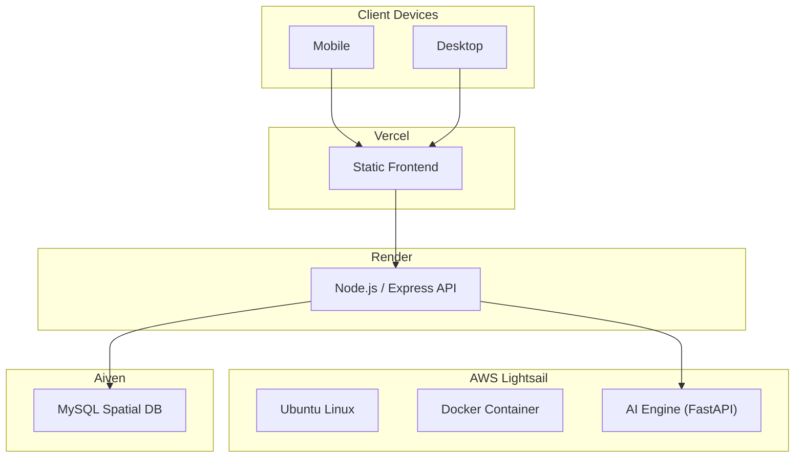
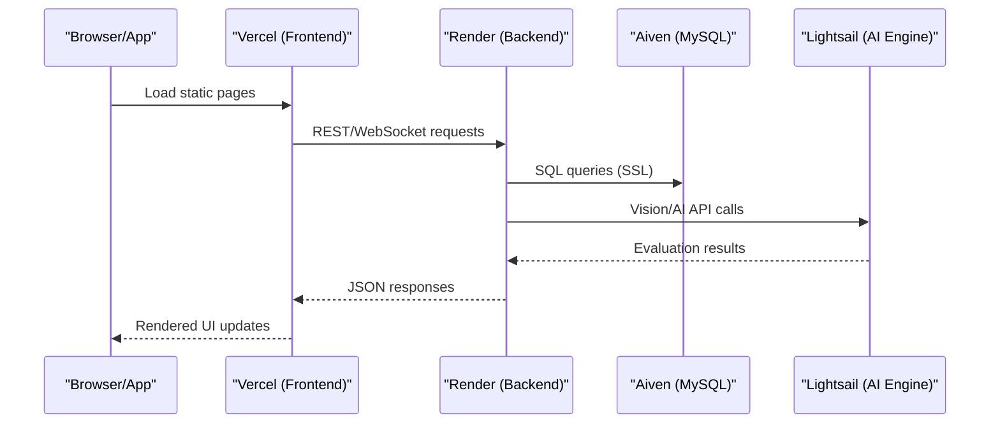
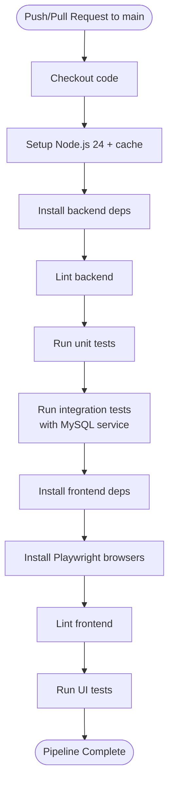
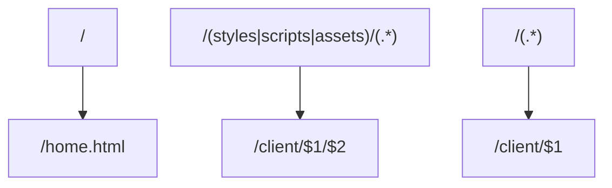
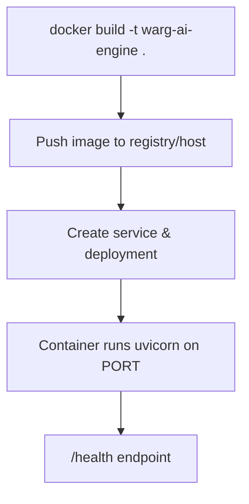
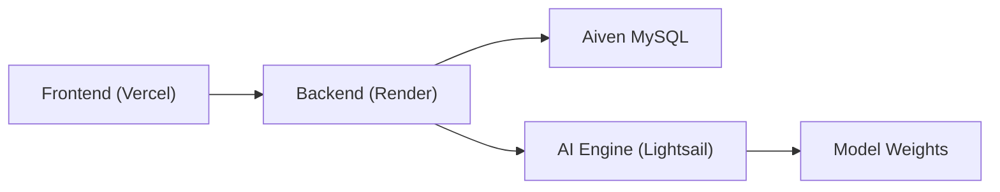

# Deployment & DevOps

<cite>
**Referenced Files in This Document**
- [ci.yml](file://.gitea/workflows/ci.yml)
- [deployment-guide.md](file://warg-docs/docs/4-deployment/deployment-guide.md)
- [Dockerfile](file://ai-engine/Dockerfile)
- [DEPLOYMENT.md](file://ai-engine/DEPLOYMENT.md)
- [vercel.json (root)](file://vercel.json)
- [vercel.json (client)](file://client/vercel.json)
- [database.js](file://server/src/config/database.js)
- [package.json (server)](file://server/package.json)
- [package.json (client)](file://client/package.json)
- [aiController.js](file://server/src/controllers/aiController.js)
- [gameController.js](file://server/src/controllers/gameController.js)
- [minigameController.js](file://server/src/controllers/minigameController.js)
</cite>

## Table of Contents
1. [Introduction](#introduction)
2. [Project Structure](#project-structure)
3. [Core Components](#core-components)
4. [Architecture Overview](#architecture-overview)
5. [Detailed Component Analysis](#detailed-component-analysis)
6. [Dependency Analysis](#dependency-analysis)
7. [Performance Considerations](#performance-considerations)
8. [Troubleshooting Guide](#troubleshooting-guide)
9. [Conclusion](#conclusion)
10. [Appendices](#appendices)

## Introduction
This document provides comprehensive deployment and DevOps guidance for the WARG Platform, covering CI/CD with Gitea workflows, automated testing, and production deployment across Render (backend), Vercel (frontend), Aiven (MySQL database), and an AI Engine service containerized with Docker. It also details environment variable management, secrets handling, monitoring/logging/alerting strategies, rollback procedures, disaster recovery planning, scaling considerations, performance tuning, and maintenance procedures for the multi-service architecture.

## Project Structure
The platform is composed of:
- Frontend: Static HTML/CSS/JS under client/, deployed to Vercel.
- Backend: Node.js/Express API server under server/, deployed to Render.
- Database: MySQL on Aiven with spatial extensions.
- AI Engine: Python/FastAPI service packaged as a Docker image, hosted externally (e.g., AWS Lightsail).

**Diagram sources**
- [deployment-guide.md:18-52](file://warg-docs/docs/4-deployment/deployment-guide.md#L18-L52)

**Section sources**
- [deployment-guide.md:1-15](file://warg-docs/docs/4-deployment/deployment-guide.md#L1-L15)

## Core Components
- CI/CD Pipeline: Gitea workflow runs backend linting, unit tests, integration tests, frontend linting, and Playwright UI tests against a temporary MySQL service.
- Backend (Render): Express server with Sequelize ORM, Socket.io support, and external calls to the AI Engine via HTTP.
- Frontend (Vercel): Static site with routing configuration for clean URLs and asset rewrites.
- Database (Aiven): Managed MySQL with SSL enforced; connection pooling and retry configured in the backend.
- AI Engine: CPU-only FastAPI service packaged in Docker, exposing vision endpoints used by the backend.

**Section sources**
- [ci.yml:1-74](file://.gitea/workflows/ci.yml#L1-L74)
- [package.json (server):1-39](file://server/package.json#L1-L39)
- [package.json (client):1-25](file://client/package.json#L1-L25)
- [database.js:1-38](file://server/src/config/database.js#L1-L38)
- [Dockerfile:1-40](file://ai-engine/Dockerfile#L1-L40)

## Architecture Overview
End-to-end flow from user request to data persistence and AI evaluation:

**Diagram sources**
- [deployment-guide.md:18-52](file://warg-docs/docs/4-deployment/deployment-guide.md#L18-L52)
- [aiController.js:1-163](file://server/src/controllers/aiController.js#L1-L163)
- [gameController.js:203-349](file://server/src/controllers/gameController.js#L203-L349)
- [minigameController.js:53-125](file://server/src/controllers/minigameController.js#L53-L125)

## Detailed Component Analysis

### CI/CD Pipeline (Gitea Workflows)
- Triggers: push and pull_request to main.
- Services: MySQL 8.0 service container with health checks.
- Steps:
  - Checkout code.
  - Setup Node.js 24 with npm cache.
  - Install backend dependencies, lint, run unit and integration tests.
  - Install frontend dependencies, install Playwright browsers, lint, run UI tests.
- Environment variables for integration tests include DATABASE_URL and SESSION_SECRET.

**Diagram sources**
- [ci.yml:1-74](file://.gitea/workflows/ci.yml#L1-L74)

**Section sources**
- [ci.yml:1-74](file://.gitea/workflows/ci.yml#L1-L74)

### Production Deployment: Render (Backend)
- Service type: Web Service (Node.js).
- Root Directory: server.
- Build Command: npm install.
- Start Command: npm start.
- Environment Variables:
  - DATABASE_URL: Full Aiven MySQL URI including SSL.
  - PORT: Render injects its own value; app reads process.env.PORT.
  - NODE_ENV: production.
- Health Check: Optional /health endpoint recommended.
- WebSocket Support: Socket.io supported; free tier spins down after inactivity—upgrade if needed.
- Logs: Use Render logs or forward to external logging via Log Streams.

**Section sources**
- [deployment-guide.md:123-182](file://warg-docs/docs/4-deployment/deployment-guide.md#L123-L182)
- [package.json (server):1-39](file://server/package.json#L1-L39)

### Production Deployment: Vercel (Frontend)
- Framework Preset: Other (static site).
- Root Directory: client.
- Build Command: none.
- Output Directory: . (client folder itself).
- Routing:
  - Clean URLs enabled via vercel.json.
  - Rewrites map root path to home.html and assets/scripts/styles to correct paths.
- Custom Domain: Supported with automatic HTTPS via Let’s Encrypt.
- Preview Deployments: Automatic per PR/merge request.

**Diagram sources**
- [vercel.json (root):1-18](file://vercel.json#L1-L18)

**Section sources**
- [deployment-guide.md:216-295](file://warg-docs/docs/4-deployment/deployment-guide.md#L216-L295)
- [vercel.json (root):1-18](file://vercel.json#L1-L18)
- [vercel.json (client):1-9](file://client/vercel.json#L1-L9)

### Production Deployment: Aiven (MySQL Database)
- Managed MySQL with spatial extensions (SRID 4326/WGS 84).
- SSL required; backend config sets require true and accepts self-signed CA in non-production; production should use CA validation.
- Connection Pooling: pool.max <= 5 recommended for Hobbyist plan.
- Migrations/Seeding: Use Sequelize sync to initialize schema; avoid force:true in production.
- Monitoring/Backups: Automated daily backups on paid plans; monitor metrics.

**Section sources**
- [deployment-guide.md:64-120](file://warg-docs/docs/4-deployment/deployment-guide.md#L64-L120)
- [database.js:1-38](file://server/src/config/database.js#L1-L38)

### AI Engine Service: Dockerization and Hosting
- Dockerfile:
  - Base: python:3.11-slim.
  - System deps: OpenCV headless requirements, tesseract OCR.
  - Python deps: installed from requirements.txt.
  - App code: main.py, vision/, weights/.
  - Expose port: default 8080 (cloud convention).
  - CMD: uvicorn main:app --host 0.0.0.0 --port ${PORT}.
- Minimum RAM: 1 GB; recommended 2 GB due to PyTorch model loading.
- Hosting: AWS Lightsail container service or any Docker host.
- Connectivity: Backend sets AI_SERVICE_URL to point to the AI engine.

**Diagram sources**
- [Dockerfile:1-40](file://ai-engine/Dockerfile#L1-L40)
- [DEPLOYMENT.md:18-43](file://ai-engine/DEPLOYMENT.md#L18-L43)

**Section sources**
- [Dockerfile:1-40](file://ai-engine/Dockerfile#L1-L40)
- [DEPLOYMENT.md:1-81](file://ai-engine/DEPLOYMENT.md#L1-L81)

### Environment Variables and Secrets Handling
- Backend (Render):
  - DATABASE_URL: Full Aiven MySQL URI with SSL.
  - PORT: Render-injected; app uses process.env.PORT.
  - NODE_ENV: production.
  - AI_SERVICE_URL: URL of the AI Engine.
  - AI_API_KEY: Optional key passed to AI Engine for protected endpoints.
- Frontend (Vercel):
  - No runtime env injection for static site; manage API base URL via JS constants or shared config file served alongside HTML.
- Local Development:
  - Copy server/.env.example to server/.env and fill credentials.
- Security Notes:
  - Never commit .env files.
  - For production Aiven connections, validate CA certificate to prevent MITM.

**Section sources**
- [deployment-guide.md:298-321](file://warg-docs/docs/4-deployment/deployment-guide.md#L298-L321)
- [database.js:1-38](file://server/src/config/database.js#L1-L38)
- [aiController.js:1-163](file://server/src/controllers/aiController.js#L1-L163)
- [gameController.js:253-273](file://server/src/controllers/gameController.js#L253-L273)

### Monitoring, Logging, and Alerting
- Backend (Render):
  - Use Render Logs tab for live streaming; consider forwarding to external services via Log Streams.
  - Implement a lightweight /health endpoint for health checks.
- Database (Aiven):
  - Monitor query performance via Metrics tab; watch for connection pool exhaustion.
- AI Engine:
  - Ensure container logs are accessible; verify /health endpoint returns expected status and model readiness.
- Application-Level:
  - Centralize error logging and surface actionable messages to clients.
  - Integrate external alerting (e.g., PagerDuty, Opsgenie) via log streams or application metrics.

**Section sources**
- [deployment-guide.md:163-182](file://warg-docs/docs/4-deployment/deployment-guide.md#L163-L182)
- [deployment-guide.md:115-120](file://warg-docs/docs/4-deployment/deployment-guide.md#L115-L120)
- [DEPLOYMENT.md:59-66](file://ai-engine/DEPLOYMENT.md#L59-L66)

### Deployment Checklist
- Database (Aiven):
  - Service Running state confirmed.
  - DATABASE_URL copied and set in Render.
  - Schema synced without force:true.
  - Spatial indexes present on geometry columns.
- Backend (Render):
  - DATABASE_URL, NODE_ENV=production set.
  - Root Directory set to server; Start Command npm start.
  - /health endpoint returns 200 OK.
  - WebSocket connections verified; upgrade plan if uptime required.
- Frontend (Vercel):
  - API_BASE constants point to production Render URL.
  - Root Directory set to client.
  - All HTML pages load correctly at expected paths.
  - CORS configured on Express to allow Vercel domain.
  - vercel.json present if clean URLs desired.

**Section sources**
- [deployment-guide.md:324-366](file://warg-docs/docs/4-deployment/deployment-guide.md#L324-L366)

### Rollback Procedures
- Backend (Render):
  - Use Render’s deploy history to roll back to a previous successful commit.
  - Revert code changes in Git and redeploy main branch.
- Frontend (Vercel):
  - Revert PR/commit and redeploy; preview deployments help validate before merging.
- Database (Aiven):
  - Restore from automated backups or point-in-time recovery on paid plans.
  - Validate schema integrity post-restore.
- AI Engine:
  - Redeploy previous container image tag; ensure AI_SERVICE_URL remains consistent.

[No sources needed since this section provides general operational guidance]

### Disaster Recovery Planning
- Database Backups:
  - Enable automated daily backups; test restore procedures regularly.
- Multi-Region Strategy:
  - Consider deploying backend and AI engine in regions close to users and database to reduce latency.
- Data Integrity:
  - Periodically validate spatial indexes and geometry constraints.
- Incident Response:
  - Define runbooks for OOM kills, connection timeouts, and AI service unavailability.

[No sources needed since this section provides general operational guidance]

### Scaling Considerations
- Backend (Render):
  - Upgrade instance type for higher concurrency and persistent WebSocket sessions.
  - Tune connection pool size based on workload; keep pool.max conservative for smaller plans.
- Database (Aiven):
  - Scale compute/storage tiers as data grows; monitor query performance and index usage.
- AI Engine:
  - Increase memory allocation (minimum 1 GB, recommended 2 GB) to accommodate model loads.
  - Horizontal scaling behind a load balancer if multiple instances are used.

**Section sources**
- [deployment-guide.md:115-120](file://warg-docs/docs/4-deployment/deployment-guide.md#L115-L120)
- [DEPLOYMENT.md:8-15](file://ai-engine/DEPLOYMENT.md#L8-L15)

### Performance Tuning
- Database:
  - Use spatial indexes; optimize queries using ST_Distance_Sphere and appropriate WHERE clauses.
  - Keep pool settings aligned with plan limits; tune acquire/idle timeouts.
- Backend:
  - Minimize unnecessary logging in production; enable structured logging where possible.
  - Cache frequently accessed data (e.g., ARG metadata) if applicable.
- AI Engine:
  - Preload models once at startup; ensure container has sufficient memory.
  - Optimize image preprocessing pipelines; consider batching requests if feasible.

**Section sources**
- [database.js:11-35](file://server/src/config/database.js#L11-L35)
- [gameController.js:184-196](file://server/src/controllers/gameController.js#L184-L196)
- [Dockerfile:1-40](file://ai-engine/Dockerfile#L1-L40)

### Maintenance Procedures
- Dependency Updates:
  - Regularly update Node.js packages and Python dependencies; run CI tests to validate changes.
- Security Patches:
  - Apply OS-level patches on Lightsail; rotate secrets and API keys periodically.
- Observability:
  - Review logs and metrics weekly; adjust thresholds and alerts as needed.
- Documentation:
  - Keep deployment guides and runbooks up to date with infrastructure changes.

[No sources needed since this section provides general operational guidance]

## Dependency Analysis
Key runtime dependencies and relationships:
- Backend depends on:
  - MySQL via Sequelize with SSL and retry logic.
  - External AI Engine via HTTP (AI_SERVICE_URL).
  - Socket.io for real-time features.
- Frontend depends on:
  - Backend REST/WebSocket endpoints.
  - Vercel routing configuration for clean URLs and asset paths.
- AI Engine depends on:
  - Python libraries (OpenCV, PyTorch, Tesseract OCR).
  - Model weights loaded at startup.

**Diagram sources**
- [package.json (server):16-30](file://server/package.json#L16-L30)
- [database.js:1-38](file://server/src/config/database.js#L1-L38)
- [aiController.js:1-163](file://server/src/controllers/aiController.js#L1-L163)
- [Dockerfile:1-40](file://ai-engine/Dockerfile#L1-L40)

**Section sources**
- [package.json (server):1-39](file://server/package.json#L1-L39)
- [package.json (client):1-25](file://client/package.json#L1-L25)
- [database.js:1-38](file://server/src/config/database.js#L1-L38)
- [aiController.js:1-163](file://server/src/controllers/aiController.js#L1-L163)
- [Dockerfile:1-40](file://ai-engine/Dockerfile#L1-L40)

## Performance Considerations
- Backend:
  - Avoid heavy synchronous operations; leverage async patterns.
  - Use connection pooling judiciously; monitor for pool exhaustion.
- Database:
  - Prefer spatial queries that leverage indexes; avoid full-table scans.
  - Batch writes where possible; minimize round trips.
- AI Engine:
  - Ensure adequate memory to prevent OOM kills during model loading.
  - Monitor request latency and throughput; scale horizontally if needed.

[No sources needed since this section provides general guidance]

## Troubleshooting Guide
- Backend cannot connect to Aiven:
  - Verify DATABASE_URL includes SSL parameters; check network ACLs and firewall rules.
  - Confirm Sequelize dialectOptions ssl.require is true; validate CA cert in production.
- AI Engine unreachable:
  - Check AI_SERVICE_URL correctness; ensure AI Engine /health endpoint responds.
  - Validate AI_API_KEY if required by protected endpoints.
- Frontend CORS errors:
  - Ensure Express CORS configuration allows Vercel domain; verify credentials setting.
- WebSocket drops:
  - Upgrade Render plan to maintain uptime for active gameplay sessions.
- Memory issues:
  - Increase AI Engine memory allocation; monitor container resource usage.

**Section sources**
- [database.js:1-38](file://server/src/config/database.js#L1-L38)
- [aiController.js:1-163](file://server/src/controllers/aiController.js#L1-L163)
- [gameController.js:253-273](file://server/src/controllers/gameController.js#L253-L273)
- [deployment-guide.md:163-182](file://warg-docs/docs/4-deployment/deployment-guide.md#L163-L182)
- [DEPLOYMENT.md:8-15](file://ai-engine/DEPLOYMENT.md#L8-L15)

## Conclusion
The WARG Platform’s deployment strategy leverages managed services for reliability and scalability: Vercel for static frontend delivery, Render for the Node.js backend with WebSocket support, Aiven for secure MySQL hosting, and a containerized AI Engine for computer vision tasks. The Gitea CI pipeline ensures code quality and functional correctness through linting and comprehensive testing. Proper environment variable management, robust error handling, and observability practices are essential for maintaining a resilient production environment. Following the provided checklists, rollback procedures, and scaling recommendations will help sustain performance and availability as the platform grows.

[No sources needed since this section summarizes without analyzing specific files]

## Appendices
- Additional references:
  - Backend scripts and test configurations:
    - [package.json (server):1-39](file://server/package.json#L1-L39)
  - Frontend scripts and test configurations:
    - [package.json (client):1-25](file://client/package.json#L1-L25)
  - AI Engine deployment instructions:
    - [DEPLOYMENT.md:1-81](file://ai-engine/DEPLOYMENT.md#L1-L81)

[No sources needed since this section lists references only]