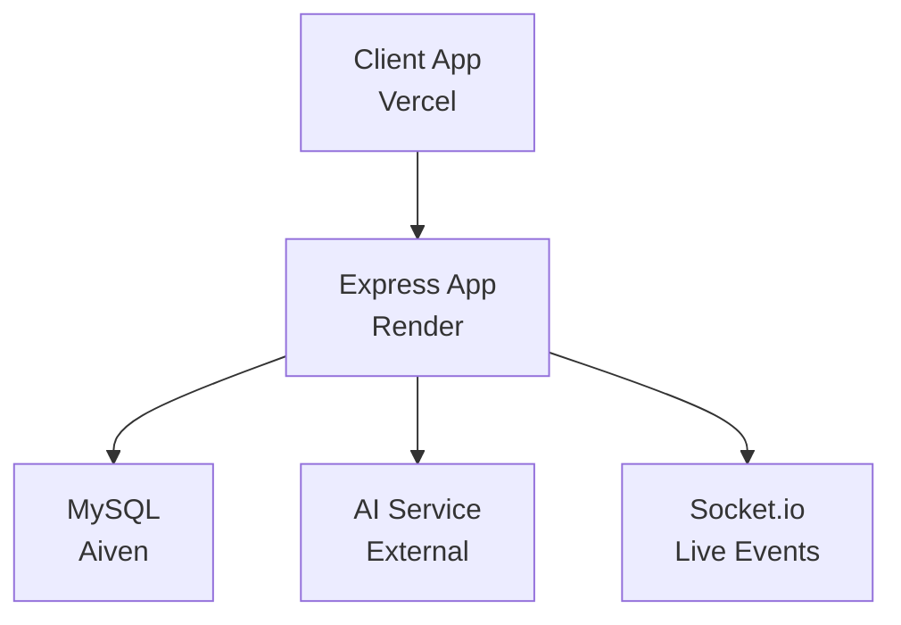
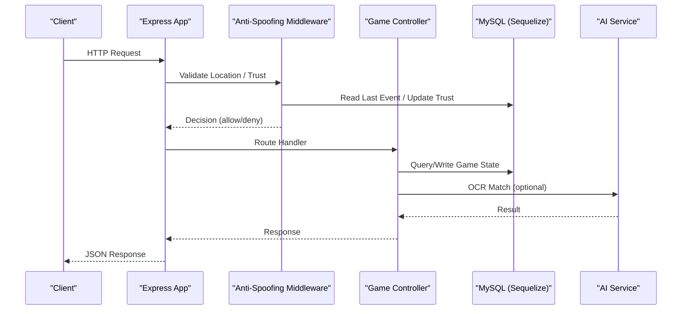
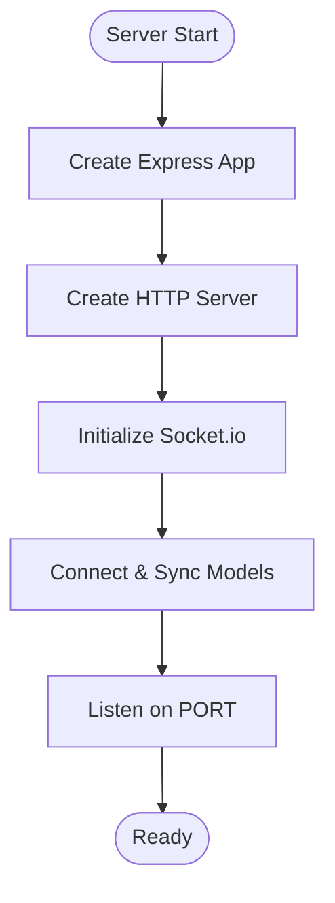
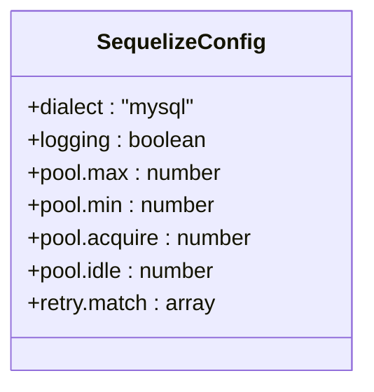
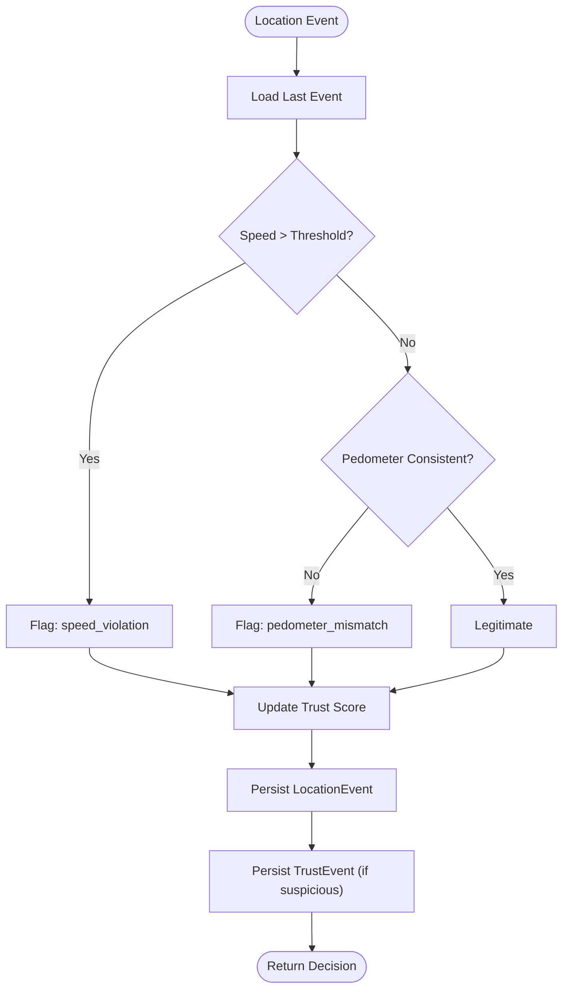
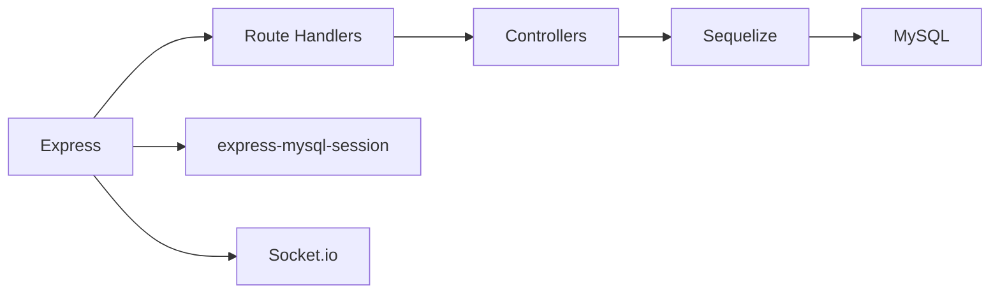

# Monitoring & Logging

<cite>
**Referenced Files in This Document**
- [server.js](file://server/server.js)
- [app.js](file://server/src/app.js)
- [database.js](file://server/src/config/database.js)
- [authController.js](file://server/src/controllers/authController.js)
- [gameController.js](file://server/src/controllers/gameController.js)
- [antiSpoofing.js](file://server/src/middleware/antiSpoofing.js)
- [schema.sql](file://database/schema.sql)
- [README.md](file://README.md)
</cite>

## Table of Contents
1. [Introduction](#introduction)
2. [Project Structure](#project-structure)
3. [Core Components](#core-components)
4. [Architecture Overview](#architecture-overview)
5. [Detailed Component Analysis](#detailed-component-analysis)
6. [Dependency Analysis](#dependency-analysis)
7. [Performance Considerations](#performance-considerations)
8. [Troubleshooting Guide](#troubleshooting-guide)
9. [Conclusion](#conclusion)
10. [Appendices](#appendices)

## Introduction
This document defines the monitoring and logging strategy for the WARG Platform across its Node.js backend, MySQL database, and client-side components. It covers application-level logging practices, structured log formats, performance monitoring, error tracking, alerting, database query observability, API response time tracking, user experience metrics, debugging techniques, log analysis tools, production troubleshooting workflows, security logging, audit trails, and compliance considerations.

The platform is deployed with:
- Backend on Render (Node.js + Express)
- Database on Aiven for MySQL (spatial extensions enabled)
- Frontend on Vercel

These deployment choices influence how logs are collected and where to look for operational signals.

**Section sources**
- [README.md:62-110](file://README.md#L62-L110)

## Project Structure
At a high level, the backend exposes HTTP APIs and Socket.io connections. The server bootstraps an Express app, configures sessions, mounts routes, and starts listening. The database layer uses Sequelize with connection pooling and retry logic. Anti-spoofing middleware evaluates location events and updates trust profiles. Game controllers orchestrate game state transitions and interactions with external AI services.

**Diagram sources**
- [server.js:1-72](file://server/server.js#L1-L72)
- [app.js:1-132](file://server/src/app.js#L1-L132)
- [database.js:1-38](file://server/src/config/database.js#L1-L38)

**Section sources**
- [server.js:1-72](file://server/server.js#L1-L72)
- [app.js:1-132](file://server/src/app.js#L1-L132)

## Core Components
- Application bootstrap and HTTP server: initializes Express, CORS, session storage, and route mounting.
- Database configuration: connects to MySQL with SSL, pool sizing, and retry behavior; SQL logging toggle available.
- Controllers: handle authentication and game flows, including minigame submissions and external AI calls.
- Anti-spoofing middleware: validates location data, computes speed/pedometer checks, updates trust scores, and persists audit events.
- Socket.io: tracks live connections and disconnections.

Key responsibilities:
- Centralize request/response lifecycle logging at the server entry point.
- Standardize structured logs with consistent fields (timestamp, level, service, traceId, userId, endpoint, method, statusCode, durationMs).
- Capture database activity via Sequelize logging when needed.
- Persist security-relevant events (trust violations, suspicious flags) into dedicated tables.

**Section sources**
- [server.js:1-72](file://server/server.js#L1-L72)
- [app.js:1-132](file://server/src/app.js#L1-L132)
- [database.js:1-38](file://server/src/config/database.js#L1-L38)
- [authController.js:1-83](file://server/src/controllers/authController.js#L1-L83)
- [gameController.js:1-368](file://server/src/controllers/gameController.js#L1-L368)
- [antiSpoofing.js:65-135](file://server/src/middleware/antiSpoofing.js#L65-L135)

## Architecture Overview
The following diagram maps runtime components relevant to monitoring and logging:

**Diagram sources**
- [app.js:1-132](file://server/src/app.js#L1-L132)
- [antiSpoofing.js:65-135](file://server/src/middleware/antiSpoofing.js#L65-L135)
- [gameController.js:1-368](file://server/src/controllers/gameController.js#L1-L368)
- [database.js:1-38](file://server/src/config/database.js#L1-L38)

## Detailed Component Analysis

### Server Bootstrap and Lifecycle Logging
- The server creates an HTTP server from the Express app, sets keep-alive and headers timeouts, and starts listening.
- Socket.io is initialized with CORS policies aligned with environment variables.
- Connection and disconnection events are logged to stdout.

Operational notes:
- Use process-level log aggregation (e.g., Render logs) to capture console output.
- Add correlation IDs per request to correlate logs across middleware, controllers, and DB queries.

**Diagram sources**
- [server.js:1-72](file://server/server.js#L1-L72)

**Section sources**
- [server.js:1-72](file://server/server.js#L1-L72)

### Express App Configuration and Routing
- Configures CORS, body parsing limits, trust proxy, and session storage backed by MySQL in non-test environments.
- Mounts all API routes under /api/* and admin routes behind auth/admin guards.
- Serves static client assets.

Monitoring implications:
- Ensure session store errors are captured and surfaced.
- Centralize access logging around route mounting to capture method, path, status, and duration.

**Section sources**
- [app.js:1-132](file://server/src/app.js#L1-L132)

### Database Layer and Query Observability
- Sequelize is configured with SSL for non-test environments, connection pool settings, and retry rules for transient network failures.
- SQL logging is disabled by default but can be enabled for diagnostics.

Recommendations:
- Enable SQL logging temporarily during investigations.
- Track slow queries using database profiling or query logs.
- Monitor connection pool saturation and retries.

**Diagram sources**
- [database.js:1-38](file://server/src/config/database.js#L1-L38)

**Section sources**
- [database.js:1-38](file://server/src/config/database.js#L1-L38)

### Authentication Controller Logging
- Validates inputs, hashes passwords, creates users, and logs them in.
- Errors are caught and logged to stderr; responses include generic error messages.

Best practices:
- Enrich logs with userId and action type (signup, checkUserExists).
- Avoid logging sensitive data (passwords, tokens).

**Section sources**
- [authController.js:1-83](file://server/src/controllers/authController.js#L1-L83)

### Game Controller and External Service Calls
- Manages game sessions, waypoint progress, minigame attempts, and completion states.
- Calls an external AI service for OCR matching; handles non-OK responses and propagates errors.

Observability recommendations:
- Log outbound requests to AI service with requestId, latency, and outcome.
- Instrument DB operations with timing and query signatures for slow query detection.
- Track success/failure rates of AI calls and circuit-breaker states if implemented.

**Section sources**
- [gameController.js:1-368](file://server/src/controllers/gameController.js#L1-L368)

### Anti-Spoofing Middleware and Audit Trails
- Evaluates speed and pedometer consistency against last known location event.
- Updates user trust score and flags suspicious behavior.
- Persists LocationEvent and TrustEvent records for auditability.

Security and compliance:
- Treat trust_events and location events as audit logs; retain according to policy.
- Mask or omit PII in logs; store identifiers instead of names or emails.

**Diagram sources**
- [antiSpoofing.js:65-135](file://server/src/middleware/antiSpoofing.js#L65-L135)

**Section sources**
- [antiSpoofing.js:65-135](file://server/src/middleware/antiSpoofing.js#L65-L135)

## Dependency Analysis
Key dependencies impacting observability:
- Express: request handling and routing.
- Sequelize: ORM with configurable logging and retry behavior.
- express-mysql-session: persistent session storage in MySQL.
- Socket.io: real-time connection events.

**Diagram sources**
- [app.js:1-132](file://server/src/app.js#L1-L132)
- [database.js:1-38](file://server/src/config/database.js#L1-L38)
- [server.js:1-72](file://server/server.js#L1-L72)

**Section sources**
- [app.js:1-132](file://server/src/app.js#L1-L132)
- [database.js:1-38](file://server/src/config/database.js#L1-L38)
- [server.js:1-72](file://server/server.js#L1-L72)

## Performance Considerations
- Connection Pooling: Tune Sequelize pool.max/min based on workload; monitor acquire/idle times.
- Slow Queries: Enable SQL logging temporarily; use database slow query logs to identify bottlenecks.
- External Dependencies: Measure AI service latency and failure rates; implement retries/backoff and circuit breakers.
- Session Store: Monitor MySQL session table growth and errors; ensure indexes exist for session keys.
- Socket.io: Track concurrent connections and message throughput; consider scaling horizontally with shared adapters if needed.

[No sources needed since this section provides general guidance]

## Troubleshooting Guide

### Application-Level Logging Strategy
- Centralize request logging:
  - Fields: timestamp, level, service, traceId, userId, method, path, statusCode, durationMs, userAgent, ip.
- Error logging:
  - Include stack traces only in development; in production, include error code and correlation ID.
- Structured format:
  - Use JSON lines for easy ingestion by log aggregators.

### Log Aggregation Approach
- Backend (Render): Aggregate stdout/stderr logs.
- Database (Aiven MySQL): Export slow query logs and error logs to a central sink.
- Frontend (Vercel): Collect browser console errors and analytics events via a telemetry endpoint.

### Performance Monitoring
- API response time tracking:
  - Compute duration per request; alert on p95/p99 thresholds.
- Database query monitoring:
  - Enable SQL logging during incidents; track query count and latency.
- User experience metrics:
  - Track page load times, interaction latencies, and error rates from the client.

### Error Tracking and Alerting
- Define severity levels: info, warn, error, critical.
- Alert on:
  - High error rate (> threshold % over window).
  - Slow endpoints (p95 > SLA).
  - AI service failures or timeouts.
  - Session store errors.
  - Trust score anomalies and repeated spoofing flags.

### Security Logging and Audit Trails
- Persist trust_events and location events for forensic analysis.
- Redact sensitive fields (passwords, tokens, PII).
- Maintain immutable audit logs with timestamps and actor identifiers.

### Debugging Techniques
- Enable Sequelize logging temporarily to inspect generated SQL.
- Use correlation IDs to trace requests end-to-end.
- Reproduce issues with minimal payloads; validate input schemas.
- Inspect Socket.io connection lifecycle for real-time features.

**Section sources**
- [database.js:1-38](file://server/src/config/database.js#L1-L38)
- [server.js:1-72](file://server/server.js#L1-L72)
- [antiSpoofing.js:65-135](file://server/src/middleware/antiSpoofing.js#L65-L135)

## Conclusion
To achieve robust observability for the WARG Platform:
- Implement centralized, structured logging across Express, controllers, and middleware.
- Instrument API response times and database queries.
- Persist security-related events for audit and compliance.
- Configure alerts for critical system health indicators.
- Adopt correlation IDs and redaction policies to streamline debugging while protecting privacy.

[No sources needed since this section summarizes without analyzing specific files]

## Appendices

### Structured Log Schema (Recommended)
- Common fields:
  - timestamp: ISO 8601
  - level: string (info|warn|error|critical)
  - service: string (backend|client|db)
  - traceId: string
  - userId: string|null
  - method: string
  - path: string
  - statusCode: number
  - durationMs: number
  - error: object|null
  - meta: object (contextual data)

### Database Tables Relevant to Auditing
- trust_events: behavioral trust score changes with event_type, delta_score, context_json, recorded_at.
- location_events: geolocation samples with spatial index and suspicious flags.

**Section sources**
- [schema.sql:361-393](file://database/schema.sql#L361-L393)